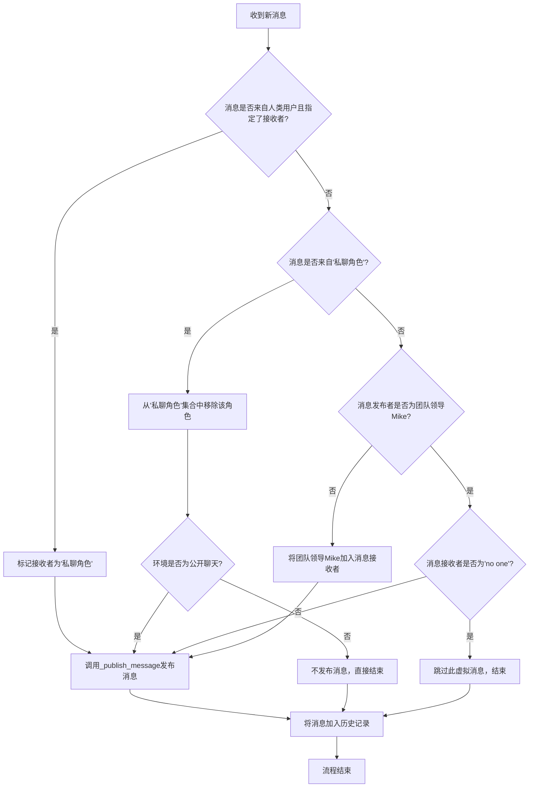
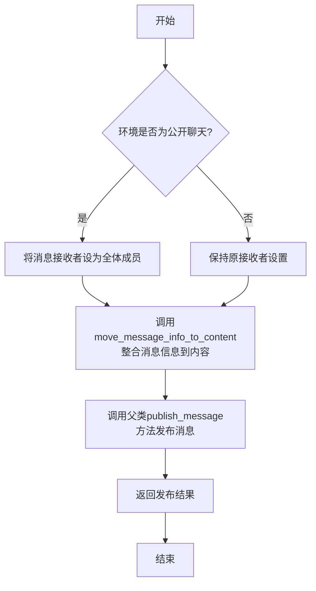
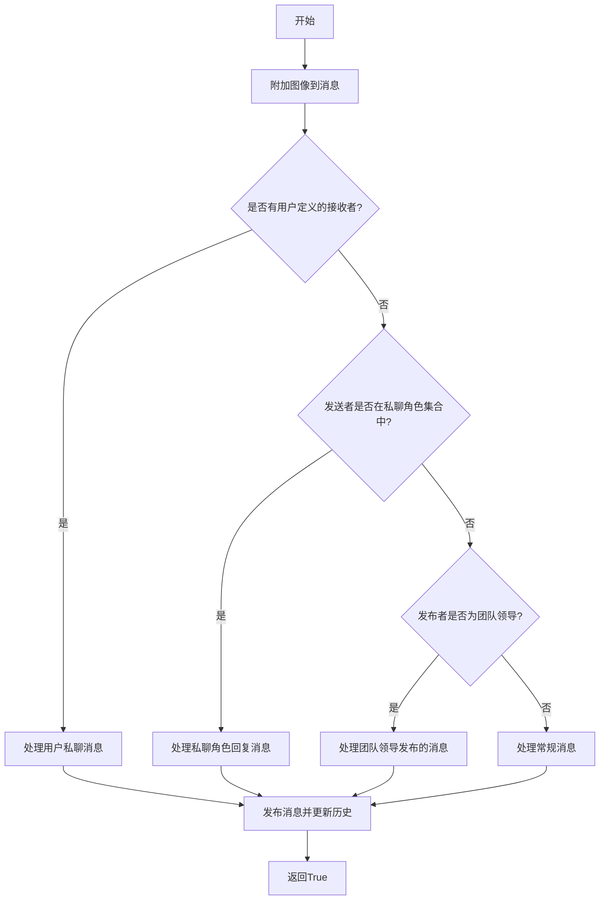
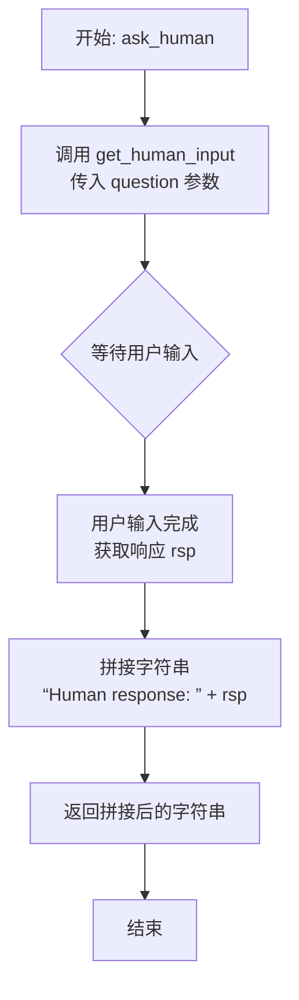
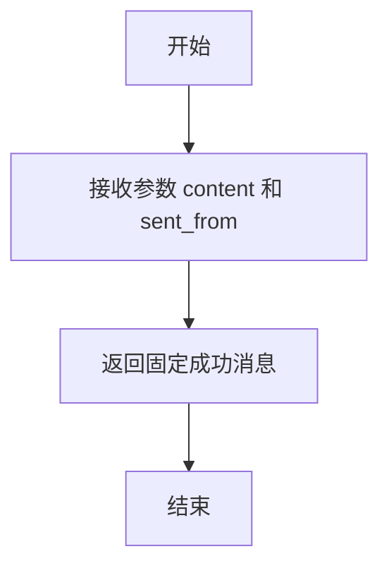
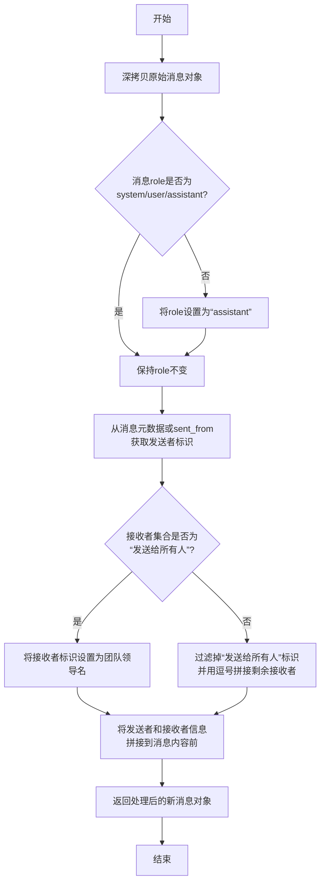
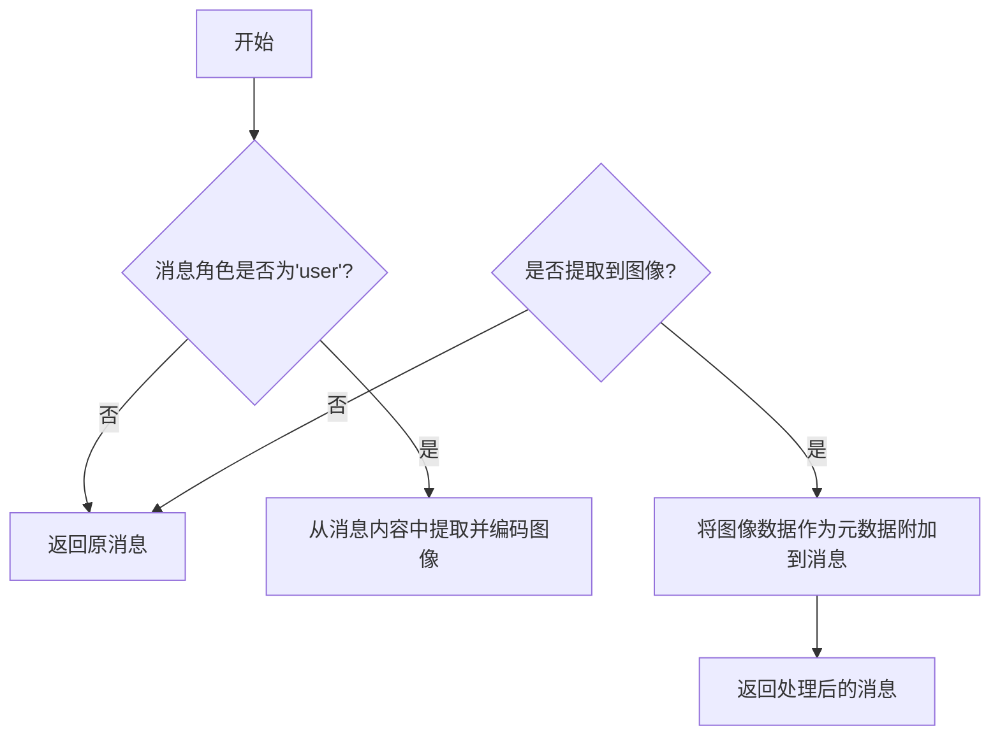

# `.\MetaGPT\metagpt\environment\mgx\mgx_env.py` 详细设计文档

该文件定义了一个名为MGXEnv的类，它是MetaGPT框架中Environment类的扩展实现。其核心功能是管理一个多智能体协作环境中的消息路由与分发，特别支持公开聊天与私聊模式。它通过一个名为'Mike'的团队领导（TeamLeader）角色作为消息中介，根据消息的发送者、接收者以及环境状态（如是否为公开聊天、是否为私聊会话）来决定消息的最终路由路径，确保消息被正确递送给目标角色或广播给所有角色，同时处理与人类用户的交互。

## 整体流程



## 类结构

```
SerializationMixin (序列化混入类)
Environment (环境基类)
└── MGXEnv (MGX环境实现类)
```

## 全局变量及字段


### `MGXEnv.direct_chat_roles`
    
记录正在进行直接对话的角色集合，用于管理用户与特定角色之间的私聊会话状态。

类型：`set[str]`
    


### `MGXEnv.is_public_chat`
    
控制聊天是否为公开模式，决定消息是否默认发送给所有角色。

类型：`bool`
    
    

## 全局函数及方法

### `MGXEnv._publish_message`

该方法负责在MGX环境中发布消息。它首先根据环境是否为公开聊天模式，决定是否将消息的接收者设置为全体成员。然后，它会调用`move_message_info_to_content`方法，将消息的发送者和接收者信息整合到消息内容中，以便团队领导（TeamLeader）能够理解消息的上下文。最后，它调用父类`Environment`的`publish_message`方法来实际发布消息。

参数：

- `message`：`Message`，需要发布的消息对象
- `peekable`：`bool`，指示消息是否可被“窥视”（即是否可以被其他角色在特定条件下查看），默认为`True`

返回值：`bool`，表示消息发布是否成功

#### 流程图



#### 带注释源码

```python
def _publish_message(self, message: Message, peekable: bool = True) -> bool:
    # 如果当前环境是公开聊天模式，则将消息的接收者设置为全体成员
    if self.is_public_chat:
        message.send_to.add(MESSAGE_ROUTE_TO_ALL)
    # 调用move_message_info_to_content方法，将消息的元信息（如发送者、接收者）整合到消息内容中
    # 这是为了让团队领导（TeamLeader）能够理解消息的上下文
    message = self.move_message_info_to_content(message)
    # 调用父类Environment的publish_message方法，执行实际的消息发布逻辑
    # peekable参数控制消息是否可被其他角色“窥视”
    return super().publish_message(message, peekable)
```

### `MGXEnv.publish_message`

该方法负责在MGX环境中发布消息，根据不同的场景（如公开聊天、用户私聊、团队领导处理等）决定消息的接收者和处理流程，确保消息在角色间正确路由。

参数：

- `message`：`Message`，待发布的消息对象，包含内容、发送者、接收者等信息。
- `user_defined_recipient`：`str`，用户定义的接收者名称，用于指定私聊消息的目标角色。
- `publicer`：`str`，发布者名称，用于标识消息的发布来源。

返回值：`bool`，始终返回`True`，表示消息发布成功。

#### 流程图



#### 带注释源码

```python
def publish_message(self, message: Message, user_defined_recipient: str = "", publicer: str = "") -> bool:
    """let the team leader take over message publishing"""
    # 为多模态消息附加图像信息
    message = self.attach_images(message)

    # 获取团队领导角色（默认名为Mike）
    tl = self.get_role(TEAMLEADER_NAME)

    if user_defined_recipient:
        # 处理用户私聊消息：用户直接与某个角色对话
        for role_name in message.send_to:
            if self.get_role(role_name).is_idle:
                # 如果角色空闲，开始新的私聊，其他角色（包括团队领导）不参与
                self.direct_chat_roles.add(role_name)

        # 发布消息（团队领导仅知晓但不处理）
        self._publish_message(message)
        # 注释：团队领导不理解消息内容，因此不直接处理

    elif message.sent_from in self.direct_chat_roles:
        # 处理私聊角色的回复消息：如果非公开聊天，仅用户可见，不发布到环境
        self.direct_chat_roles.remove(message.sent_from)
        if self.is_public_chat:
            # 如果是公开聊天，则发布消息
            self._publish_message(message)

    elif publicer == tl.profile:
        # 处理团队领导发布的消息
        if message.send_to == {"no one"}:
            # 跳过团队领导的虚拟消息
            return True
        # 团队领导处理后的消息可以发布
        self._publish_message(message)

    else:
        # 处理常规消息：所有消息先发送给团队领导
        message.send_to.add(tl.name)
        self._publish_message(message)

    # 将消息添加到历史记录
    self.history.add(message)

    return True
```


### `MGXEnv.ask_human`

该方法用于在环境中向人类用户发起询问，并获取其文本回复。它是一个异步方法，旨在模拟或集成真实的人机交互环节，通常用于在自动化流程中需要人类决策或输入的场景。

参数：

-  `question`：`str`，需要向人类用户提出的问题文本。
-  `sent_from`：`Role`，发起询问的角色对象，用于标识询问的来源。此参数在方法内部未使用，可能用于未来扩展或日志记录。

返回值：`str`，返回一个字符串，格式为 `"Human response: "` 后接人类用户的输入内容。

#### 流程图



#### 带注释源码

```
    async def ask_human(self, question: str, sent_from: Role = None) -> str:
        # NOTE: Can be overwritten in remote setting
        # 调用全局的异步函数 get_human_input，传入问题字符串，并等待其返回用户的输入。
        rsp = await get_human_input(question)
        # 将获取到的用户响应（rsp）与固定的前缀字符串拼接，然后返回。
        return "Human response: " + rsp
```


### `MGXEnv.reply_to_human`

该方法用于模拟向人类用户发送回复后的响应。它返回一个固定的成功消息，告知发送方消息已成功送达，并指示其避免重复发送，以及在无需进一步行动时使用 `end` 命令停止。

参数：

- `content`：`str`，要发送给人类用户的消息内容。
- `sent_from`：`Role`，发送此消息的角色实例。

返回值：`str`，一个固定的成功响应字符串。

#### 流程图



#### 带注释源码

```python
async def reply_to_human(self, content: str, sent_from: Role = None) -> str:
    # NOTE: Can be overwritten in remote setting
    # 注意：此方法可在远程设置中被重写。
    # 返回一个固定的成功消息，告知发送方消息已送达，并指示后续操作。
    return "SUCCESS, human has received your reply. Refrain from resending duplicate messages.  If you no longer need to take action, use the command ‘end’ to stop."
```

### `MGXEnv.move_message_info_to_content`

该方法用于处理消息对象，主要完成两项任务：1. 将消息的`role`字段转换为LLM API所接受的格式（如“user”、“assistant”、“system”）；2. 将消息的发送者和接收者信息整合到消息内容中，以便团队领导（TL）或其他角色能够感知消息的上下文。

参数：

- `message`：`Message`，需要被处理的原始消息对象。

返回值：`Message`，处理后的新消息对象，其内容包含了发送者和接收者信息，且`role`字段已标准化。

#### 流程图



#### 带注释源码

```python
def move_message_info_to_content(self, message: Message) -> Message:
    """Two things here:
    1. Convert role, since role field must be reserved for LLM API, and is limited to, for example, one of ["user", "assistant", "system"]
    2. Add sender and recipient info to content, making TL aware, since LLM API only takes content as input
    """
    # 1. 深拷贝原始消息，避免修改原对象
    converted_msg = message.model_copy(deep=True)
    
    # 2. 标准化role字段：如果不在LLM API接受的范围内，则设置为“assistant”
    if converted_msg.role not in ["system", "user", "assistant"]:
        converted_msg.role = "assistant"
    
    # 3. 确定发送者标识：优先从元数据中获取，否则使用sent_from字段
    sent_from = converted_msg.metadata[AGENT] if AGENT in converted_msg.metadata else converted_msg.sent_from
    
    # 4. 确定接收者标识：
    #    - 如果消息是发送给所有人，则接收者标识为团队领导（TL）
    #    - 否则，过滤掉“发送给所有人”的标识，并用逗号拼接具体的接收者名字
    if converted_msg.send_to == {MESSAGE_ROUTE_TO_ALL}:
        send_to = TEAMLEADER_NAME
    else:
        send_to = ", ".join({role for role in converted_msg.send_to if role != MESSAGE_ROUTE_TO_ALL})
    
    # 5. 将发送者和接收者信息作为前缀，整合到消息内容中
    converted_msg.content = f"[Message] from {sent_from or 'User'} to {send_to}: {converted_msg.content}"
    
    # 6. 返回处理后的新消息对象
    return converted_msg
```


### `MGXEnv.attach_images`

该方法用于处理用户消息中的图像内容。当消息角色为"user"时，它会从消息内容中提取图像数据并进行Base64编码，然后将编码后的图像数据作为元数据附加到消息对象中，以支持多模态消息处理。

参数：

- `message`：`Message`，需要处理的原始消息对象

返回值：`Message`，处理后的消息对象（如果包含图像则附加了图像元数据，否则返回原消息）

#### 流程图



#### 带注释源码

```python
def attach_images(self, message: Message) -> Message:
    # 检查消息角色是否为"user"，只有用户消息需要处理图像
    if message.role == "user":
        # 从消息内容中提取图像并进行Base64编码
        images = extract_and_encode_images(message.content)
        
        # 如果成功提取到图像
        if images:
            # 将编码后的图像数据作为元数据附加到消息中
            # IMAGES是元数据的键名，用于标识图像数据
            message.add_metadata(IMAGES, images)
    
    # 返回处理后的消息（可能包含图像元数据）
    return message
```


### `MGXEnv.__repr__`

该方法返回 `MGXEnv` 类实例的字符串表示形式，用于调试和日志记录。

参数：无

返回值：`str`，返回一个固定的字符串 `"MGXEnv()"`，表示这是一个 `MGXEnv` 类的实例。

#### 流程图

```mermaid
flowchart TD
    Start[开始] --> Return[返回字符串 'MGXEnv()']
    Return --> End[结束]
```

#### 带注释源码

```python
def __repr__(self):
    # 返回一个固定的字符串，表示这是一个 MGXEnv 类的实例。
    # 这是 Python 的内置方法，用于提供对象的“官方”字符串表示。
    # 通常用于调试和日志记录。
    return "MGXEnv()"
```

## 关键组件


### 消息路由与分发机制

该组件负责根据聊天模式（公开/私聊）、消息发送者、接收者以及是否存在用户定义的接收者，来决定消息的最终路由路径。它通过维护一个 `direct_chat_roles` 集合来跟踪私聊会话，并确保团队领导者（TeamLeader）在公开聊天中作为消息分发的中心枢纽，或在特定条件下被绕过。

### 消息内容转换与增强

该组件负责在消息发布前对其进行预处理和格式化。主要功能包括：将消息的 `role` 字段转换为LLM API兼容的格式（如 `"assistant"`）；将原始的发送者（`sent_from`）和接收者（`send_to`）信息嵌入到 `content` 字段中，以便团队领导者能够理解消息的上下文；以及从用户消息中提取并附加图像数据到元数据中。

### 团队领导者（TeamLeader）协调器

该组件是环境中的核心协调角色，名为“Mike”。在公开聊天模式下，大多数常规消息都会先被路由给团队领导者进行处理和决策，然后再由环境发布。它作为消息分发的控制点，管理着团队成员间的通信流程。

### 多模态消息支持

该组件负责处理包含图像内容的消息。它通过 `extract_and_encode_images` 函数从用户消息内容中提取图像数据并进行编码，然后将编码后的图像信息作为元数据附加到消息对象上，为后续的多模态AI处理提供支持。

### 序列化混合（SerializationMixin）

该组件通过继承 `SerializationMixin` 类，为 `MGXEnv` 环境提供了序列化和反序列化的能力。这使得环境的状态（包括消息历史、角色状态等）可以被保存、传输和恢复，对于实现持久化、远程协作或状态快照等功能至关重要。


## 问题及建议


### 已知问题

-   **`direct_chat_roles` 管理逻辑存在潜在缺陷**：`direct_chat_roles` 集合用于追踪正在进行直接对话的角色。当用户向一个空闲角色发起直接对话时，该角色名被加入集合。然而，如果该角色在处理直接对话的过程中，用户又向其发送了另一条消息（例如，追问或补充），代码逻辑会再次将其加入集合（因为 `is_idle` 可能为 `False`），这可能导致集合中出现重复项或状态管理混乱。更关键的是，当角色完成直接对话回复后，会从集合中移除。如果用户再次发起对话，逻辑可能无法正确识别这是新一轮的直接对话还是对上一轮的延续。
-   **`is_public_chat` 状态切换缺乏明确机制**：`is_public_chat` 标志控制环境是否为公开聊天模式，影响 `_publish_message` 和 `publish_message` 中关于直接对话消息的发布逻辑。但代码中未展示该标志如何被设置或切换（例如，由用户命令或系统事件触发）。如果它始终保持 `True`，那么直接对话的响应消息（`elif message.sent_from in self.direct_chat_roles` 分支）仍会被发布，这可能与“非公开聊天时其他角色不应参与”的设计意图相悖。
-   **`ask_human` 和 `reply_to_human` 方法的异步实现可能不必要**：这两个方法被标记为 `async`，但 `get_human_input` 函数（假设是同步或阻塞的）被 `await` 调用。如果 `get_human_input` 本身不是真正的异步I/O操作（例如，只是阻塞等待控制台输入），那么使用 `async/await` 并不能带来并发优势，反而增加了不必要的异步上下文开销。此外，它们的返回值被硬编码了前缀（如 `"Human response: "`），这限制了方法的通用性，调用方可能需要额外处理来移除这些前缀。
-   **`move_message_info_to_content` 方法中的硬编码和逻辑简化**：该方法将消息的发送者、接收者信息硬编码到 `content` 字段中，以便团队领导（TL）感知。其中，当 `send_to` 为 `{MESSAGE_ROUTE_TO_ALL}` 时，接收者被硬编码为 `TEAMLEADER_NAME`（即 `"Mike"`）。这种简化假设团队领导总是处理广播消息，但在更复杂的路由逻辑或动态团队领导场景下可能不适用。同时，将原始 `content` 包裹在固定格式的字符串中，可能会影响后续LLM对原始内容的理解或处理。
-   **`attach_images` 方法的功能单一性**：该方法仅当 `message.role == "user"` 时提取并附加图像。这假设只有用户消息可能包含图像，而忽略了其他角色（如助理）在回复中也可能需要引用或附加图像的情况，限制了多模态交互的完整性。

### 优化建议

-   **重构 `direct_chat_roles` 的状态管理**：建议将 `direct_chat_roles` 从简单的 `set` 升级为更精细的状态管理，例如使用字典 `Dict[str, DirectChatSession]`，其中 `DirectChatSession` 可以包含会话ID、开始时间、最后活动时间、消息历史等。这样能更准确地追踪每个直接对话的上下文和生命周期，避免重复添加和状态混淆。同时，引入明确的会话开始和结束事件（或超时机制）来管理集合的增删。
-   **明确 `is_public_chat` 的控制流**：在类中增加设置 `is_public_chat` 的方法（如 `set_public_chat_mode(mode: bool)`），并在文档中说明其触发条件（例如，响应特定的用户命令或系统配置）。确保在非公开模式下，直接对话的响应消息确实不被发布到环境历史中，以符合设计预期。
-   **简化或重构异步方法**：评估 `get_human_input` 的实际行为。如果它是同步阻塞的，考虑将 `ask_human` 和 `reply_to_human` 改为同步方法，或使用 `asyncio.to_thread` 在单独线程中运行以避免阻塞事件循环。同时，考虑移除返回值中的硬编码前缀，改为返回原始响应，让调用方根据需要添加上下文信息，提高方法的可复用性。
-   **增强 `move_message_info_to_content` 的灵活性和可配置性**：将团队领导名称 `TEAMLEADER_NAME` 作为可配置参数或通过环境动态获取，而不是硬编码。考虑设计更通用的消息元数据转换策略，例如支持插件或策略模式，以便根据不同的路由规则或LLM API要求灵活调整 `content` 的格式化方式，而不是写死固定的字符串模板。
-   **扩展 `attach_images` 方法的功能**：移除对 `message.role == "user"` 的限制，使其能处理任何角色的消息。可以增加一个参数（如 `force_extract: bool = False`）来控制是否强制提取，或者基于消息内容类型（如是否包含图像标记）来决定是否执行提取操作，使多模态支持更加全面和灵活。


## 其它


### 设计目标与约束

本模块（MGXEnv）是MetaGPT框架中一个特定的环境实现，旨在模拟一个由团队领导（Team Leader）协调的、支持公开与私密对话的智能体协作环境。其核心设计目标包括：1) 支持多模态消息（如图像）的传递与处理；2) 实现消息路由机制，区分公开聊天、用户与特定角色的私聊、以及通过团队领导进行协调的常规消息流；3) 保持与基础环境类（`Environment`）的兼容性，并扩展序列化能力（`SerializationMixin`）。主要约束在于需要与框架内定义的`Role`、`Message`等核心数据结构紧密集成，并遵循预定的消息处理流程。

### 错误处理与异常设计

当前代码中显式的错误处理逻辑较少，主要依赖上层调用或框架基础类的处理。潜在的风险点包括：1) `get_role`方法可能返回`None`，导致后续属性访问（如`tl.profile`）失败；2) 对`message.metadata`字典的键（如`AGENT`）进行访问时，若键不存在会引发`KeyError`；3) 异步方法`ask_human`和`reply_to_human`依赖于外部输入，可能因超时或中断导致流程阻塞。建议增加对关键对象（如团队领导角色）存在性的检查，并使用`.get()`方法安全访问字典，同时考虑为异步操作设置超时机制。

### 数据流与状态机

环境内部维护一个关键状态集合`direct_chat_roles`，用于追踪正在进行中的用户与特定角色的私聊会话。数据流主要围绕`Message`对象展开：1) 用户发起的消息根据`user_defined_recipient`判断是私聊还是公开消息，私聊会触发状态记录；2) 来自`direct_chat_roles`中角色的回复，仅在公开聊天模式下才广播；3) 其他所有常规消息均被路由至团队领导（`tl`）进行处理，由其决定最终的分发。团队领导发布的消息或标记为`{"no one"}`的虚拟消息会被直接发布。这是一个简化的状态机，状态转移由消息的发送者、接收者以及`is_public_chat`标志驱动。

### 外部依赖与接口契约

1.  **继承与混入**：依赖于父类`Environment`（提供`publish_message`、`get_role`、`history`等基础接口）和混入类`SerializationMixin`（提供序列化能力）。
2.  **核心数据结构**：强依赖`metagpt.schema.Message`类，其`send_to`、`sent_from`、`content`、`metadata`、`role`等字段是路由和内容转换逻辑的基础。
3.  **角色系统**：依赖`metagpt.roles.Role`类及其`profile`、`name`、`is_idle`、`rc.memory`等属性或方法。
4.  **工具函数与常量**：依赖`metagpt.utils.common.extract_and_encode_images`处理图像；依赖`metagpt.const`中的`AGENT`、`IMAGES`、`MESSAGE_ROUTE_TO_ALL`、`TEAMLEADER_NAME`等常量。
5.  **人类输入**：异步方法`ask_human`依赖于`metagpt.logs.get_human_input`函数获取外部输入，这构成了一个重要的外部交互接口。

    