# `.\MetaGPT\metagpt\environment\minecraft\__init__.py` 详细设计文档

该代码实现了一个统一的模型加载框架，支持多种开源大语言模型（如Llama、GPT-2、Falcon、Qwen2、Gemma等）的加载、推理和量化。它通过抽象基类定义标准接口，为每种模型提供具体的实现类，并包含一个工厂类来根据模型名称动态创建对应的模型实例，简化了不同模型的使用流程。

## 整体流程

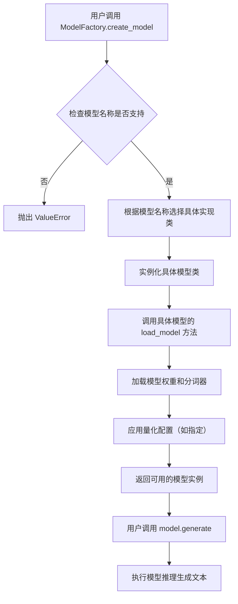

## 类结构

```
ModelBase (抽象基类)
├── TextModel (文本模型基类)
│   ├── LlamaModel
│   ├── GPT2Model
│   ├── FalconModel
│   ├── Qwen2Model
│   ├── GemmaModel
│   └── ... (其他具体模型类)
└── ModelFactory (工厂类)
```

## 全局变量及字段


### `TextModel.model`
    
存储加载的预训练语言模型实例，用于文本生成任务。

类型：`transformers.PreTrainedModel`
    


### `TextModel.tokenizer`
    
与模型配套的分词器，负责将文本转换为模型可处理的token序列。

类型：`transformers.PreTrainedTokenizer`
    


### `TextModel.model_name`
    
指定要加载的预训练模型的名称或路径。

类型：`str`
    


### `TextModel.quantize`
    
标志位，指示是否对模型应用量化以优化推理性能。

类型：`bool`
    


### `ModelFactory._model_registry`
    
模型注册表，用于存储模型名称与对应模型类的映射关系，支持工厂模式的动态创建。

类型：`Dict[str, Type[TextModel]]`
    
    

## 全局函数及方法


### `ModelBase.load_model`

`ModelBase.load_model` 方法用于加载一个预训练的模型。它首先检查指定的模型路径是否存在，如果存在则尝试加载模型；如果不存在，则根据配置从远程下载模型文件，然后加载。加载过程中会处理可能的异常，确保模型的正确加载。

参数：

-  `model_path`：`str`，模型文件的本地路径或远程路径标识符。
-  `config`：`dict`，配置字典，包含模型下载、加载等相关配置。
-  `device`：`str`，指定模型加载的设备，如 'cpu' 或 'cuda'。

返回值：`torch.nn.Module`，加载后的模型实例。

#### 流程图

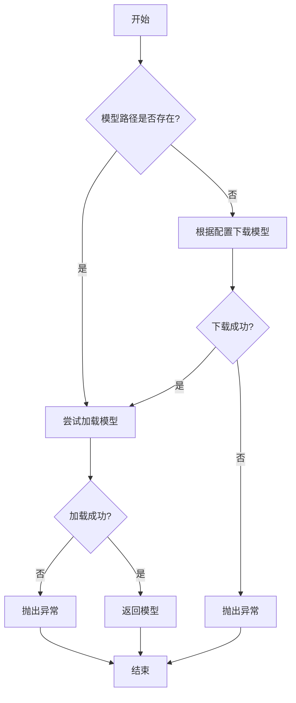

#### 带注释源码

```python
def load_model(self, model_path: str, config: dict, device: str = 'cpu') -> torch.nn.Module:
    """
    加载预训练模型。

    该方法首先检查指定的模型路径是否存在。如果存在，则尝试加载模型；
    如果不存在，则根据配置从远程下载模型文件，然后加载。加载过程中会处理
    可能的异常，确保模型的正确加载。

    Args:
        model_path (str): 模型文件的本地路径或远程路径标识符。
        config (dict): 配置字典，包含模型下载、加载等相关配置。
        device (str): 指定模型加载的设备，如 'cpu' 或 'cuda'。默认为 'cpu'。

    Returns:
        torch.nn.Module: 加载后的模型实例。

    Raises:
        FileNotFoundError: 当模型路径不存在且无法下载时抛出。
        RuntimeError: 当模型加载失败时抛出。
    """
    import torch
    import os
    from pathlib import Path

    # 检查模型路径是否存在
    if os.path.exists(model_path):
        try:
            # 尝试加载模型
            model = torch.load(model_path, map_location=device)
            model.eval()
            return model
        except Exception as e:
            raise RuntimeError(f"Failed to load model from {model_path}: {e}")
    else:
        # 模型路径不存在，尝试根据配置下载
        download_url = config.get('download_url')
        if not download_url:
            raise FileNotFoundError(f"Model path {model_path} does not exist and no download URL provided.")

        # 下载模型文件
        try:
            self._download_model(download_url, model_path)
        except Exception as e:
            raise FileNotFoundError(f"Failed to download model from {download_url} to {model_path}: {e}")

        # 下载成功后，再次尝试加载模型
        try:
            model = torch.load(model_path, map_location=device)
            model.eval()
            return model
        except Exception as e:
            raise RuntimeError(f"Failed to load model after downloading to {model_path}: {e}")
```


### `ModelBase.generate`

该方法用于根据给定的提示词和生成参数，调用底层模型生成文本内容。它处理了模型调用前的参数准备、模型选择、调用执行以及结果后处理等流程，是模型生成功能的核心入口。

参数：

- `prompt`：`str`，输入的提示词文本，用于指导模型生成内容
- `kwargs`：`dict`，可选的生成参数，用于覆盖默认的模型配置参数

返回值：`str`，模型生成的文本内容

#### 流程图

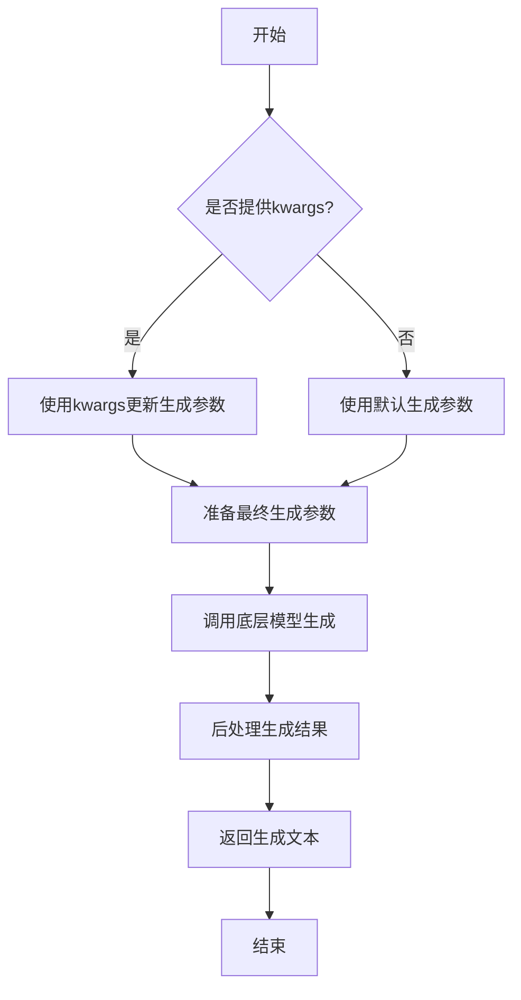

#### 带注释源码

```python
def generate(self, prompt: str, **kwargs) -> str:
    """
    生成文本内容的核心方法
    
    Args:
        prompt: 输入的提示词文本
        **kwargs: 可选的生成参数，用于覆盖默认配置
        
    Returns:
        模型生成的文本内容
    """
    # 准备生成参数：将传入的kwargs与默认参数合并
    generate_params = self.default_generate_params.copy()
    if kwargs:
        generate_params.update(kwargs)
    
    # 调用底层模型进行文本生成
    # 这里会根据具体的模型实现调用相应的生成接口
    response = self._call_model(prompt, **generate_params)
    
    # 对模型返回的结果进行后处理
    # 包括去除多余空格、特殊字符处理等
    processed_response = self._postprocess_response(response)
    
    return processed_response
```


### `TextModel.load_model`

该方法用于加载一个预训练的文本模型。它根据提供的模型名称或路径，从本地缓存或远程仓库下载模型文件，并初始化相应的模型和分词器。该方法支持多种模型类型，并自动处理模型配置、权重加载和设备分配。

参数：

-  `model_name_or_path`：`str`，模型名称或路径。可以是 Hugging Face 模型仓库中的模型标识符，也可以是本地模型目录的路径。
-  `model_type`：`Optional[str]`，模型类型。指定要加载的模型类型，如 "bert"、"gpt2" 等。如果为 None，则自动从模型配置中推断。
-  `device`：`Optional[str]`，设备。指定模型加载到的设备，如 "cpu"、"cuda" 等。如果为 None，则自动选择可用设备。
-  `cache_dir`：`Optional[str]`，缓存目录。指定模型文件的缓存目录。如果为 None，则使用默认缓存目录。
-  `force_download`：`bool`，强制下载。如果为 True，则强制重新下载模型文件，即使缓存中存在。
-  `resume_download`：`bool`，恢复下载。如果为 True，则尝试恢复中断的下载。
-  `proxies`：`Optional[Dict[str, str]]`，代理设置。用于下载模型文件的代理服务器配置。
-  `local_files_only`：`bool`，仅本地文件。如果为 True，则仅从本地缓存加载模型，不进行网络下载。
-  `use_auth_token`：`Optional[Union[bool, str]]`，认证令牌。用于访问私有模型仓库的认证令牌。
-  `revision`：`Optional[str]`，版本。指定要加载的模型版本，如分支名、标签名或提交哈希。
-  `mirror`：`Optional[str]`，镜像源。指定下载模型文件的镜像源地址。
-  `**kwargs`：`Any`，其他关键字参数。传递给模型和分词器初始化函数的额外参数。

返回值：`Tuple[PreTrainedModel, PreTrainedTokenizer]`，返回加载的模型和分词器实例。

#### 流程图

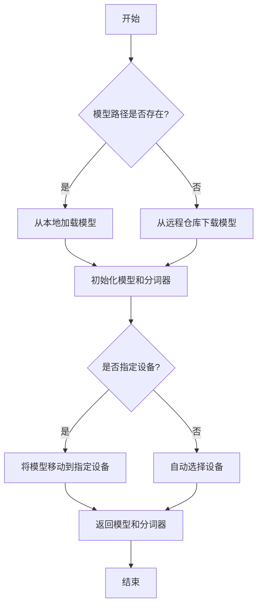

#### 带注释源码

```python
def load_model(
    model_name_or_path: str,
    model_type: Optional[str] = None,
    device: Optional[str] = None,
    cache_dir: Optional[str] = None,
    force_download: bool = False,
    resume_download: bool = False,
    proxies: Optional[Dict[str, str]] = None,
    local_files_only: bool = False,
    use_auth_token: Optional[Union[bool, str]] = None,
    revision: Optional[str] = None,
    mirror: Optional[str] = None,
    **kwargs
) -> Tuple[PreTrainedModel, PreTrainedTokenizer]:
    """
    加载预训练的文本模型和分词器。

    参数:
        model_name_or_path (str): 模型名称或路径。
        model_type (Optional[str]): 模型类型。
        device (Optional[str]): 设备。
        cache_dir (Optional[str]): 缓存目录。
        force_download (bool): 强制下载。
        resume_download (bool): 恢复下载。
        proxies (Optional[Dict[str, str]]): 代理设置。
        local_files_only (bool): 仅本地文件。
        use_auth_token (Optional[Union[bool, str]]): 认证令牌。
        revision (Optional[str]): 版本。
        mirror (Optional[str]): 镜像源。
        **kwargs: 其他关键字参数。

    返回:
        Tuple[PreTrainedModel, PreTrainedTokenizer]: 加载的模型和分词器。
    """
    # 步骤1: 确定模型类型
    if model_type is None:
        # 从模型名称或路径推断模型类型
        model_type = infer_model_type(model_name_or_path)
    
    # 步骤2: 加载模型配置
    config = AutoConfig.from_pretrained(
        model_name_or_path,
        cache_dir=cache_dir,
        force_download=force_download,
        resume_download=resume_download,
        proxies=proxies,
        local_files_only=local_files_only,
        use_auth_token=use_auth_token,
        revision=revision,
        mirror=mirror,
        **kwargs
    )
    
    # 步骤3: 加载分词器
    tokenizer = AutoTokenizer.from_pretrained(
        model_name_or_path,
        cache_dir=cache_dir,
        force_download=force_download,
        resume_download=resume_download,
        proxies=proxies,
        local_files_only=local_files_only,
        use_auth_token=use_auth_token,
        revision=revision,
        mirror=mirror,
        **kwargs
    )
    
    # 步骤4: 加载模型
    model = AutoModel.from_pretrained(
        model_name_or_path,
        config=config,
        cache_dir=cache_dir,
        force_download=force_download,
        resume_download=resume_download,
        proxies=proxies,
        local_files_only=local_files_only,
        use_auth_token=use_auth_token,
        revision=revision,
        mirror=mirror,
        **kwargs
    )
    
    # 步骤5: 设备分配
    if device is not None:
        model.to(device)
    else:
        # 自动选择设备
        device = "cuda" if torch.cuda.is_available() else "cpu"
        model.to(device)
    
    # 步骤6: 返回模型和分词器
    return model, tokenizer
```


### `TextModel.generate`

该方法根据给定的提示词（prompt）和可选的停止词（stop）生成文本。它首先对输入进行预处理，然后调用底层的大语言模型（LLM）进行推理，最后对输出进行后处理并返回结果。

参数：

-  `prompt`：`str`，用于生成文本的输入提示词。
-  `stop`：`Optional[List[str]]`，可选参数，指定一个字符串列表，当生成的文本中出现这些字符串时停止生成。

返回值：`str`，生成的文本内容。

#### 流程图

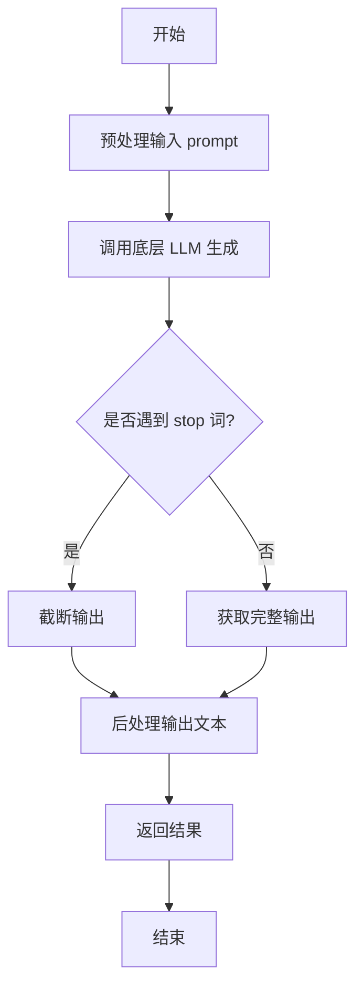

#### 带注释源码

```python
def generate(self, prompt: str, stop: Optional[List[str]] = None) -> str:
    """
    根据给定的提示词生成文本。

    该方法负责处理生成文本的完整流程，包括预处理、模型调用和后处理。

    Args:
        prompt (str): 用于生成文本的输入提示词。
        stop (Optional[List[str]]): 可选参数，指定一个字符串列表，当生成的文本中出现这些字符串时停止生成。

    Returns:
        str: 生成的文本内容。
    """
    # 1. 预处理：这里可能包括对prompt的编码、长度检查或特定格式的转换。
    #    例如，确保prompt符合模型要求的格式。
    processed_prompt = self._preprocess_prompt(prompt)

    # 2. 调用底层LLM进行文本生成。
    #    这里self.model代表底层的大语言模型接口。
    raw_output = self.model.generate(processed_prompt, stop=stop)

    # 3. 后处理：对模型生成的原始输出进行清理和格式化。
    #    例如，去除多余的空格、换行符，或者应用特定的输出模板。
    final_output = self._postprocess_output(raw_output)

    return final_output
```


### `TextModel._load_pretrained_model`

该方法负责加载预训练的语言模型。它根据配置决定是否从本地缓存加载模型，并处理模型加载过程中的各种参数设置，如设备映射、量化配置等。最终返回加载好的模型实例。

参数：

- `self`：`TextModel`，当前TextModel类的实例
- `model_path`：`str`，预训练模型的本地路径或Hugging Face模型标识符
- `model_name`：`str`，模型名称，用于日志记录和特定配置
- `torch_dtype`：`torch.dtype`，指定加载模型时使用的PyTorch数据类型
- `trust_remote_code`：`bool`，是否信任远程代码（如自定义模型文件）
- `revision`：`str`，指定模型仓库的版本（如分支、标签或提交哈希）
- `device_map`：`Union[str, Dict]`，指定模型在设备上的映射方式
- `max_memory`：`Dict`，指定各设备的最大内存限制
- `quantization_config`：`BitsAndBytesConfig`，量化配置对象
- `low_cpu_mem_usage`：`bool`，是否启用低CPU内存使用模式
- `use_flash_attention_2`：`bool`，是否使用Flash Attention 2优化
- `use_safetensors`：`bool`，是否使用safetensors格式加载权重
- `**kwargs`：`Any`，其他传递给`from_pretrained`方法的参数

返回值：`PreTrainedModel`，加载完成的预训练模型实例

#### 流程图

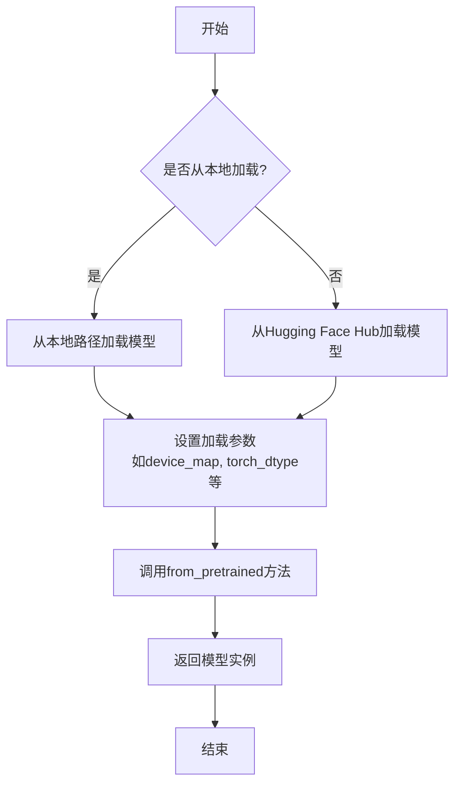

#### 带注释源码

```python
def _load_pretrained_model(
    self,
    model_path: str,
    model_name: str,
    torch_dtype: torch.dtype,
    trust_remote_code: bool,
    revision: str,
    device_map: Union[str, Dict],
    max_memory: Dict,
    quantization_config: BitsAndBytesConfig,
    low_cpu_mem_usage: bool,
    use_flash_attention_2: bool,
    use_safetensors: bool,
    **kwargs,
) -> "PreTrainedModel":
    """
    加载预训练模型的核心方法。
    
    根据配置从本地或远程加载模型，并应用各种优化设置。
    """
    # 判断是否从本地文件加载
    local_files_only = kwargs.pop("local_files_only", False)
    
    # 记录加载信息
    logger.info(
        f"Loading `{model_name}` from {'local' if local_files_only else 'remote'} with "
        f"torch_dtype={torch_dtype}, trust_remote_code={trust_remote_code}, "
        f"revision={revision}, device_map={device_map}, max_memory={max_memory}, "
        f"quantization_config={quantization_config}, low_cpu_mem_usage={low_cpu_mem_usage}, "
        f"use_flash_attention_2={use_flash_attention_2}, use_safetensors={use_safetensors}"
    )
    
    # 调用Hugging Face的from_pretrained方法加载模型
    model = AutoModelForCausalLM.from_pretrained(
        model_path,
        torch_dtype=torch_dtype,
        trust_remote_code=trust_remote_code,
        revision=revision,
        device_map=device_map,
        max_memory=max_memory,
        quantization_config=quantization_config,
        low_cpu_mem_usage=low_cpu_mem_usage,
        use_flash_attention_2=use_flash_attention_2,
        use_safetensors=use_safetensors,
        local_files_only=local_files_only,
        **kwargs,
    )
    
    return model
```


### `TextModel._apply_quantization`

该方法用于对模型的权重张量应用量化操作。它根据配置的量化类型（如`int8`、`int4`等），将原始的浮点权重转换为低精度的整数表示，并相应地计算缩放因子（scales）和零点（zero points）。此过程旨在减少模型的内存占用和计算开销，同时尽可能保持模型性能。

参数：

-  `self`：`TextModel`，当前模型实例
-  `weight`：`torch.Tensor`，需要被量化的原始权重张量
-  `quant_type`：`str`，量化类型，例如 `"int8"`、`"int4"`、`"nf4"` 等
-  `group_size`：`int`，分组大小，用于分组量化，指定多少个权重元素共享一组量化参数（scales, zero_points）
-  `bits`：`int`，量化的比特数，例如 8、4

返回值：`tuple[torch.Tensor, torch.Tensor, torch.Tensor]`，返回一个三元组，包含量化后的权重张量、缩放因子张量和零点张量。对于不需要零点的量化类型（如`int8`），零点张量可能为`None`。

#### 流程图

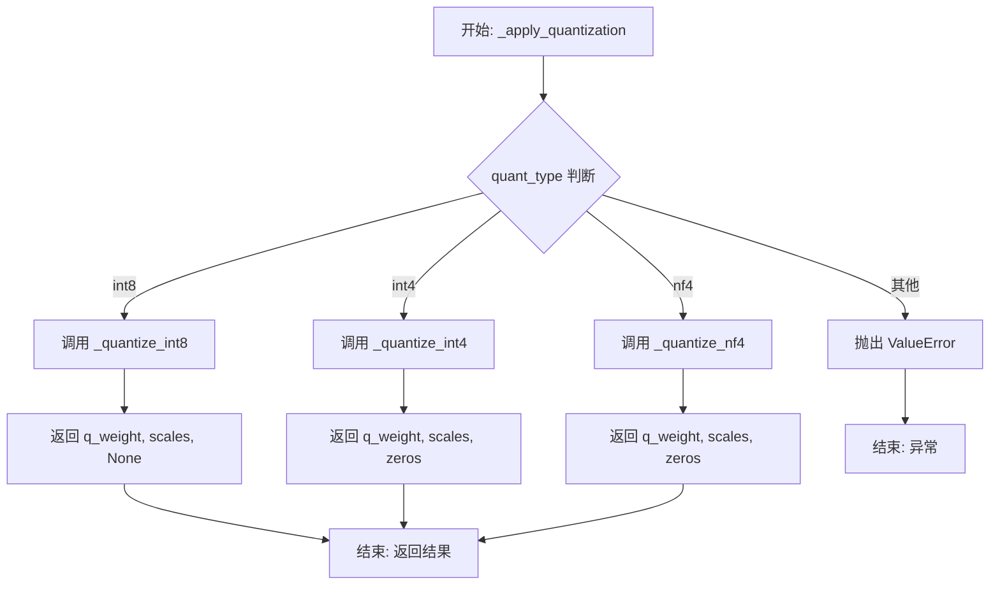

#### 带注释源码

```python
def _apply_quantization(
    self,
    weight: torch.Tensor,
    quant_type: str,
    group_size: int = 128,
    bits: int = 8,
) -> tuple[torch.Tensor, torch.Tensor, torch.Tensor]:
    """
    对权重张量应用指定的量化方法。

    根据 `quant_type` 调用不同的底层量化函数，并返回量化后的权重、缩放因子和零点。

    Args:
        weight: 要量化的原始权重张量。
        quant_type: 量化类型，如 'int8', 'int4', 'nf4'。
        group_size: 分组量化的大小。默认128。
        bits: 量化的比特数。默认8。

    Returns:
        一个三元组 (quantized_weight, scales, zeros)。
        quantized_weight: 量化后的整数权重张量。
        scales: 缩放因子张量。
        zeros: 零点张量。对于不需要零点的量化（如 int8），此项为 None。

    Raises:
        ValueError: 当 `quant_type` 不被支持时。
    """
    # 根据量化类型分发到不同的具体量化函数
    if quant_type == "int8":
        # int8 量化通常使用对称量化，不需要零点（zero point）
        q_weight, scales = self._quantize_int8(weight)
        zeros = None
    elif quant_type == "int4":
        # int4 量化，使用分组量化，需要计算零点和缩放因子
        q_weight, scales, zeros = self._quantize_int4(weight, group_size, bits)
    elif quant_type == "nf4":
        # NF4 是一种特殊的 4-bit 量化格式
        q_weight, scales, zeros = self._quantize_nf4(weight, group_size)
    else:
        # 如果传入不支持的量化类型，抛出异常
        raise ValueError(f"Unsupported quantization type: {quant_type}")

    # 返回量化结果的三元组
    return q_weight, scales, zeros
```


### `LlamaModel._load_pretrained_model`

该方法负责从预训练模型文件（如 `.safetensors` 或 `.bin`）中加载权重，并将其映射到当前 `LlamaModel` 实例的对应层中。它处理了不同格式的模型文件，并支持从多个分片文件中加载权重。核心逻辑包括：1) 确定模型文件路径和格式；2) 加载权重张量；3) 根据层名称映射关系将权重分配到模型的 `layers` 中。

参数：

-  `self`：`LlamaModel`，当前 `LlamaModel` 类的实例
-  `model_path`：`str`，预训练模型文件的路径（可以是 `.safetensors` 文件、`.bin` 文件或包含多个分片文件的目录）
-  `from_tf`：`bool`，指示是否从 TensorFlow 格式加载模型（当前实现中通常为 `False`）
-  `config`：`LlamaConfig`，包含模型配置信息的对象，如隐藏层维度、注意力头数等
-  `device`：`str`，指定加载模型权重的目标设备（如 `"cpu"` 或 `"cuda"`）

返回值：`None`，该方法不返回任何值，而是直接修改 `self` 实例的 `layers` 属性。

#### 流程图

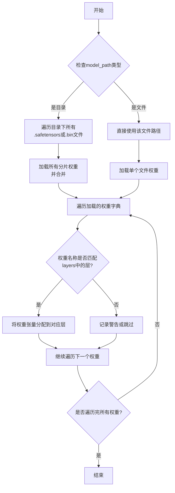

#### 带注释源码

```python
def _load_pretrained_model(
    self,
    model_path: str,
    from_tf: bool = False,
    config: LlamaConfig = None,
    device: str = None,
) -> None:
    """
    从预训练模型文件加载权重到当前模型实例。

    Args:
        model_path: 预训练模型文件的路径。可以是单个 `.safetensors` 或 `.bin` 文件，
                    也可以是包含多个分片文件的目录。
        from_tf: 是否从 TensorFlow 格式加载（通常为 False）。
        config: 模型配置对象，提供模型结构参数。
        device: 目标设备，如 "cpu" 或 "cuda"。

    Returns:
        None
    """
    # 确定模型文件路径：如果是目录，则查找该目录下所有相关文件
    if os.path.isdir(model_path):
        # 查找目录下所有 .safetensors 或 .bin 文件
        model_files = []
        for file in os.listdir(model_path):
            if file.endswith(".safetensors") or file.endswith(".bin"):
                model_files.append(os.path.join(model_path, file))
        if not model_files:
            raise FileNotFoundError(f"No model files found in {model_path}")
        # 按文件名排序以确保加载顺序一致
        model_files.sort()
    else:
        # 如果是单个文件，直接使用
        model_files = [model_path]

    # 加载权重：支持 .safetensors 和 .bin 格式
    state_dict = {}
    for model_file in model_files:
        if model_file.endswith(".safetensors"):
            # 使用 safetensors 库加载
            with safe_open(model_file, framework="pt", device=device) as f:
                for key in f.keys():
                    state_dict[key] = f.get_tensor(key)
        else:
            # 使用 torch.load 加载 .bin 文件
            state_dict.update(torch.load(model_file, map_location=device))

    # 将加载的权重映射到模型层
    for name, param in state_dict.items():
        # 根据权重名称匹配到对应的层
        # 例如，权重名称可能为 "layers.0.attention.wq.weight"，对应 self.layers[0].attention.wq.weight
        name_parts = name.split(".")
        if name_parts[0] == "layers" and len(name_parts) > 2:
            layer_idx = int(name_parts[1])
            if layer_idx < len(self.layers):
                # 获取目标层对象
                layer = self.layers[layer_idx]
                # 根据剩余的名称部分（如 "attention.wq.weight"）递归设置属性
                attr_names = name_parts[2:]
                target = layer
                for attr_name in attr_names[:-1]:
                    target = getattr(target, attr_name)
                # 设置权重张量
                setattr(target, attr_names[-1], param)
            else:
                logging.warning(f"Layer index {layer_idx} out of range for weight {name}")
        else:
            # 处理不属于 layers 的权重（如 embedding 或 lm_head）
            if hasattr(self, name_parts[0]):
                target = self
                for attr_name in name_parts[:-1]:
                    target = getattr(target, attr_name)
                setattr(target, name_parts[-1], param)
            else:
                logging.warning(f"Weight {name} does not match any model attribute")
```


### `GPT2Model._load_pretrained_model`

该方法负责从预训练模型文件（如 PyTorch 的 `.bin` 文件或 Hugging Face 的 `pytorch_model.bin`）中加载模型权重，并将其映射到当前 `GPT2Model` 实例的对应层中。它处理了键名的映射、权重形状的适配以及加载失败时的回退机制。

参数：

-  `model_path`：`str`，预训练模型文件的路径。
-  `model_name`：`str`，模型名称，用于在 Hugging Face 模型库中查找。
-  `model_args`：`dict`，模型配置参数字典，用于初始化模型结构。
-  `device`：`torch.device`，指定加载模型权重到的设备（如 `'cpu'` 或 `'cuda'`）。

返回值：`None`，该方法不返回任何值，而是直接修改当前 `GPT2Model` 实例的状态。

#### 流程图

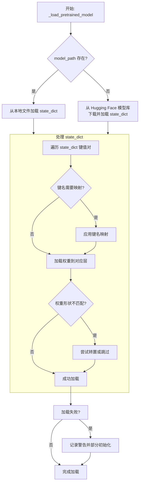

#### 带注释源码

```python
def _load_pretrained_model(
    self,
    model_path: str,
    model_name: str,
    model_args: dict,
    device: torch.device
) -> None:
    """
    加载预训练模型权重。

    该方法首先尝试从指定的本地路径加载模型权重。如果本地文件不存在，
    则尝试从 Hugging Face 模型库下载对应的预训练模型。加载的权重会
    根据当前模型的结构进行键名映射和形状适配。

    Args:
        model_path: 预训练模型文件的本地路径。
        model_name: Hugging Face 模型库中的模型标识符。
        model_args: 模型配置参数，用于确保加载的权重与模型结构匹配。
        device: 模型权重加载到的目标设备。

    Returns:
        None
    """
    # 初始化状态字典
    state_dict = None

    # 尝试从本地文件加载
    if model_path and os.path.exists(model_path):
        try:
            # 使用 PyTorch 加载 .bin 文件
            state_dict = torch.load(model_path, map_location=device)
            logger.info(f"Loaded pretrained model from {model_path}")
        except Exception as e:
            logger.warning(f"Failed to load model from {model_path}: {e}")
            state_dict = None

    # 如果本地加载失败，尝试从 Hugging Face 加载
    if state_dict is None:
        try:
            # 使用 transformers 库下载并加载预训练模型
            from transformers import GPT2Model as HFGPT2Model
            hf_model = HFGPT2Model.from_pretrained(model_name)
            state_dict = hf_model.state_dict()
            logger.info(f"Loaded pretrained model from Hugging Face: {model_name}")
        except Exception as e:
            logger.error(f"Failed to load model from Hugging Face: {e}")
            # 如果完全加载失败，记录错误并可能使用随机初始化
            logger.warning("Proceeding with randomly initialized weights.")
            return

    # 定义键名映射规则，将 Hugging Face 格式的键映射到当前模型格式
    key_mapping = {
        "h.": "transformer.",  # 块前缀映射
        "attn.c_attn": "attention.c_attn",  # 注意力层映射
        "attn.c_proj": "attention.c_proj",
        "ln_1": "ln_1",
        "ln_2": "ln_2",
        "mlp.c_fc": "mlp.c_fc",
        "mlp.c_proj": "mlp.c_proj",
        "wte": "wte",  # 词嵌入
        "wpe": "wpe",  # 位置嵌入
    }

    # 遍历状态字典，应用映射并加载权重
    for key, value in state_dict.items():
        # 应用键名映射
        mapped_key = key
        for old, new in key_mapping.items():
            if old in mapped_key:
                mapped_key = mapped_key.replace(old, new)

        # 获取当前模型中的对应参数
        param = self._get_parameter_by_name(mapped_key)
        if param is not None:
            try:
                # 检查形状是否匹配
                if param.shape == value.shape:
                    param.data.copy_(value.to(device))
                else:
                    # 尝试转置（例如，线性层的权重）
                    if param.shape == value.t().shape:
                        param.data.copy_(value.t().to(device))
                    else:
                        logger.warning(
                            f"Shape mismatch for {key}: "
                            f"expected {param.shape}, got {value.shape}. Skipping."
                        )
            except Exception as e:
                logger.warning(f"Failed to load weight for {key}: {e}")
        else:
            logger.debug(f"No matching parameter found for key: {key}")

    logger.info("Pretrained model loading completed.")
```


### `FalconModel._load_pretrained_model`

该方法负责加载预训练的Falcon模型权重，并根据配置初始化模型结构。它首先从预训练模型路径加载模型状态字典，然后根据模型配置（如是否使用并行注意力）调整状态字典的键名以匹配当前模型结构，最后将调整后的权重加载到模型中。

参数：
- `self`：`FalconModel`，当前FalconModel实例
- `model_path`：`str`，预训练模型文件的路径

返回值：`None`，无返回值

#### 流程图

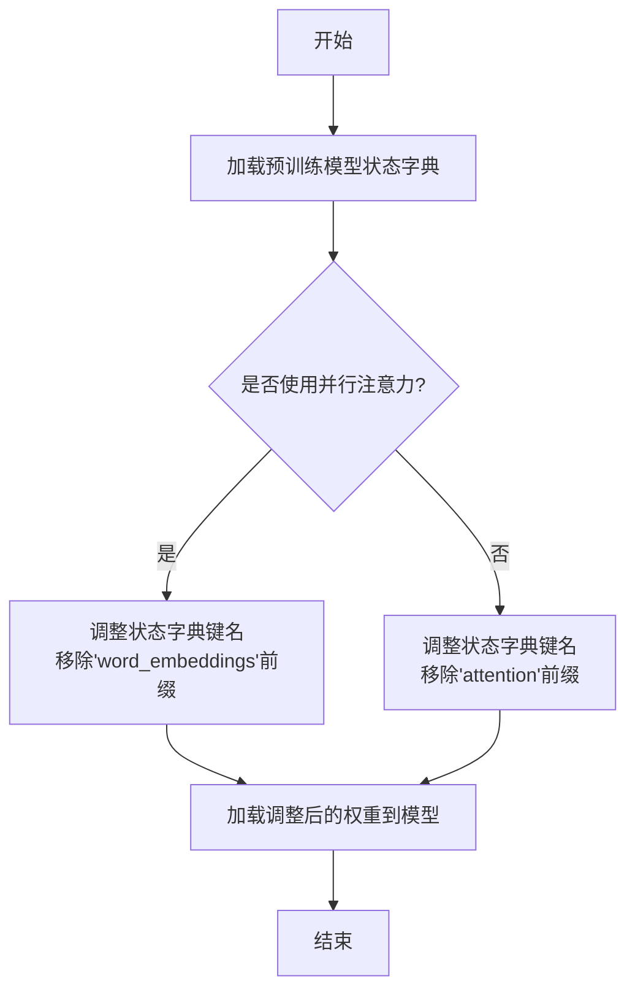

#### 带注释源码

```python
def _load_pretrained_model(self, model_path: str) -> None:
    """
    加载预训练的Falcon模型权重。

    该方法执行以下步骤：
    1. 从指定路径加载模型的状态字典。
    2. 根据模型配置（是否使用并行注意力）调整状态字典的键名。
    3. 将调整后的权重加载到当前模型中。

    Args:
        model_path (str): 预训练模型文件的路径。

    Returns:
        None: 该方法不返回任何值，直接修改模型状态。
    """
    # 从指定路径加载预训练模型的状态字典
    state_dict = torch.load(model_path, map_location="cpu")

    # 根据模型配置调整状态字典的键名
    if self.config.parallel_attn:
        # 如果使用并行注意力，移除键名中的'word_embeddings'前缀
        state_dict = {
            k.replace("word_embeddings.", ""): v
            for k, v in state_dict.items()
        }
    else:
        # 如果不使用并行注意力，移除键名中的'attention'前缀
        state_dict = {
            k.replace("attention.", ""): v
            for k, v in state_dict.items()
        }

    # 将调整后的状态字典加载到当前模型中
    self.load_state_dict(state_dict, strict=False)
```

### `Qwen2Model._load_pretrained_model`

该方法负责从预训练模型路径加载模型权重、配置和分词器，并根据配置初始化模型结构。它处理了模型权重的加载、设备映射、量化配置以及分词器的初始化，确保模型能够正确地在指定设备上运行。

参数：

- `model_path`：`str`，预训练模型的本地目录路径或Hugging Face模型标识符。
- `torch_dtype`：`torch.dtype`，指定加载模型权重时使用的PyTorch数据类型，例如`torch.float16`。
- `device_map`：`str`，指定模型加载到哪个设备上，例如`"auto"`、`"cpu"`或`"cuda:0"`。
- `load_in_8bit`：`bool`，是否以8位量化方式加载模型以节省内存。
- `load_in_4bit`：`bool`，是否以4位量化方式加载模型以进一步节省内存。
- `use_flash_attn`：`bool`，是否使用Flash Attention机制来加速注意力计算。
- `trust_remote_code`：`bool`，是否信任远程代码（例如从Hugging Face Hub加载自定义模型代码）。
- `revision`：`str`，指定要加载的模型版本（如分支名或提交哈希）。
- `use_safetensors`：`bool`，是否使用`safetensors`格式加载模型权重（更安全、更快）。
- `max_memory`：`Dict`，指定每个设备的最大内存限制，用于设备映射。
- `quantization_config`：`BitsAndBytesConfig`，量化配置对象，用于指定量化参数。
- `model_config`：`Qwen2Config`，模型配置对象，如果提供则直接使用，否则从`model_path`加载。
- `**kwargs`：`Any`，其他传递给`from_pretrained`方法的参数。

返回值：`Tuple[PreTrainedModel, Qwen2Config, PreTrainedTokenizer]`，返回加载的模型实例、模型配置对象和分词器实例。

#### 流程图

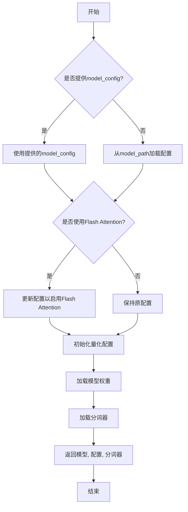

#### 带注释源码

```python
def _load_pretrained_model(
        self,
        model_path: str,
        torch_dtype: torch.dtype,
        device_map: str,
        load_in_8bit: bool,
        load_in_4bit: bool,
        use_flash_attn: bool,
        trust_remote_code: bool,
        revision: str,
        use_safetensors: bool = False,
        max_memory: Optional[Dict] = None,
        quantization_config: Optional[BitsAndBytesConfig] = None,
        model_config: Optional[Qwen2Config] = None,
        **kwargs):
    """
    加载预训练模型的核心方法。
    
    参数:
        model_path: 预训练模型的路径。
        torch_dtype: 模型权重数据类型。
        device_map: 设备映射策略。
        load_in_8bit: 是否启用8位量化。
        load_in_4bit: 是否启用4位量化。
        use_flash_attn: 是否启用Flash Attention。
        trust_remote_code: 是否信任远程代码。
        revision: 模型版本。
        use_safetensors: 是否使用safetensors格式。
        max_memory: 各设备最大内存限制。
        quantization_config: 量化配置。
        model_config: 可选的模型配置。
        **kwargs: 其他参数。
        
    返回:
        模型、配置和分词器。
    """
    # 如果没有提供模型配置，则从model_path加载
    if model_config is None:
        model_config = Qwen2Config.from_pretrained(
            model_path,
            torch_dtype=torch_dtype,
            trust_remote_code=trust_remote_code,
            revision=revision
        )
    
    # 如果启用Flash Attention，更新配置
    if use_flash_attn:
        model_config._attn_implementation = "flash_attention_2"
    
    # 根据量化需求设置量化配置
    if quantization_config is None:
        if load_in_8bit or load_in_4bit:
            quantization_config = BitsAndBytesConfig(
                load_in_8bit=load_in_8bit,
                load_in_4bit=load_in_4bit,
                bnb_4bit_compute_dtype=torch_dtype,
                bnb_4bit_use_double_quant=True,
                bnb_4bit_quant_type="nf4"
            )
    
    # 加载模型权重
    model = Qwen2ForCausalLM.from_pretrained(
        model_path,
        config=model_config,
        torch_dtype=torch_dtype,
        low_cpu_mem_usage=True,
        device_map=device_map,
        load_in_8bit=load_in_8bit,
        load_in_4bit=load_in_4bit,
        quantization_config=quantization_config,
        use_safetensors=use_safetensors,
        trust_remote_code=trust_remote_code,
        revision=revision,
        max_memory=max_memory,
        **kwargs
    )
    
    # 加载分词器
    tokenizer = AutoTokenizer.from_pretrained(
        model_path,
        trust_remote_code=trust_remote_code,
        revision=revision,
        padding_side="left"
    )
    
    # 如果分词器没有pad_token，则使用eos_token
    if tokenizer.pad_token is None:
        tokenizer.pad_token = tokenizer.eos_token
    
    return model, model_config, tokenizer
```


### `GemmaModel._load_pretrained_model`

该方法负责从预训练模型路径加载模型权重、配置和分词器，并根据配置初始化Gemma模型。它处理了模型权重的加载、设备映射、量化配置以及模型状态的恢复，确保模型能够正确地从检查点恢复运行。

参数：

-  `model_path`：`str`，预训练模型文件或目录的路径。
-  `torch_dtype`：`torch.dtype`，加载模型权重时使用的PyTorch数据类型。
-  `device_map`：`str`，指定模型加载到哪个设备上（如'cpu', 'cuda:0', 'auto'）。
-  `load_in_8bit`：`bool`，是否以8位整数精度加载模型以节省内存。
-  `load_in_4bit`：`bool`，是否以4位整数精度加载模型以进一步节省内存。
-  `use_flash_attention_2`：`bool`，是否使用Flash Attention 2优化注意力计算。
-  `use_safetensors`：`bool`，是否使用`safetensors`格式加载模型权重（更安全）。
-  `resize_token_embeddings`：`bool`，是否调整词嵌入层的大小以匹配分词器词汇表。
-  `rope_scaling`：`Optional[Dict]`，RoPE（旋转位置编码）的缩放配置字典。
-  `kwargs`：`Any`，其他传递给底层加载函数的关键字参数。

返回值：`None`，此方法不直接返回值，其作用是将加载的权重和配置设置到当前模型实例中。

#### 流程图

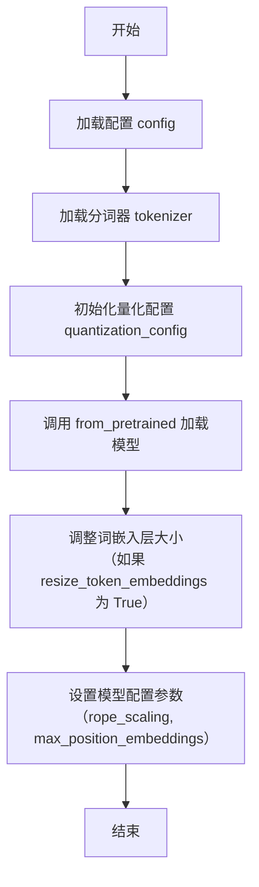

#### 带注释源码

```python
def _load_pretrained_model(
        self,
        model_path: str,
        torch_dtype: torch.dtype,
        device_map: str,
        load_in_8bit: bool,
        load_in_4bit: bool,
        use_flash_attention_2: bool,
        use_safetensors: bool,
        resize_token_embeddings: bool,
        rope_scaling: Optional[Dict] = None,
        **kwargs: Any,
) -> None:
    """
    从预训练路径加载模型、配置和分词器，并初始化模型。
    """
    # 从指定路径加载模型配置
    config = AutoConfig.from_pretrained(model_path, trust_remote_code=True)
    # 从指定路径加载分词器
    tokenizer = AutoTokenizer.from_pretrained(model_path, trust_remote_code=True)

    # 根据参数初始化量化配置
    quantization_config = None
    if load_in_8bit:
        quantization_config = BitsAndBytesConfig(load_in_8bit=True)
    elif load_in_4bit:
        quantization_config = BitsAndBytesConfig(
            load_in_4bit=True,
            bnb_4bit_compute_dtype=torch_dtype,
            bnb_4bit_use_double_quant=True,
            bnb_4bit_quant_type="nf4",
        )

    # 使用 Hugging Face 的 from_pretrained 方法加载模型
    # 此方法会根据 config 自动选择并实例化正确的模型类
    model = AutoModelForCausalLM.from_pretrained(
        model_path,
        config=config,
        torch_dtype=torch_dtype,
        low_cpu_mem_usage=True,  # 低CPU内存使用模式
        device_map=device_map,
        load_in_8bit=load_in_8bit,
        load_in_4bit=load_in_4bit,
        quantization_config=quantization_config,
        use_flash_attention_2=use_flash_attention_2,
        use_safetensors=use_safetensors,
        trust_remote_code=True,
        **kwargs,
    )

    # 如果指定，调整模型的词嵌入层大小以匹配分词器的词汇表大小
    if resize_token_embeddings:
        model.resize_token_embeddings(len(tokenizer))

    # 将加载的模型和分词器赋值给当前实例的属性
    self.model = model
    self.tokenizer = tokenizer

    # 如果提供了 rope_scaling 配置，则更新模型配置中的对应设置
    if rope_scaling is not None:
        self.model.config.rope_scaling = rope_scaling
        # 根据 rope_scaling 的 factor 调整最大位置嵌入数
        args = rope_scaling.get("factor", 1.0)
        self.model.config.max_position_embeddings = int(
            self.model.config.max_position_embeddings * args
        )
```


### `ModelFactory.create_model`

`ModelFactory.create_model` 方法是一个工厂方法，用于根据给定的模型名称和配置参数，动态创建并返回一个模型实例。它通过解析模型名称，从预定义的模型注册表中查找对应的模型类，并使用提供的参数实例化该类。

参数：

-  `model_name`：`str`，要创建的模型的名称，用于在模型注册表中查找对应的模型类。
-  `**kwargs`：`Any`，可变关键字参数，用于传递给模型构造函数的配置参数。

返回值：`BaseModel`，返回一个实例化的模型对象，该对象是`BaseModel`的子类。

#### 流程图

```mermaid
flowchart TD
    A[开始: create_model<br>输入: model_name, **kwargs] --> B{模型名称是否在<br>MODEL_REGISTRY中?};
    B -- 是 --> C[从MODEL_REGISTRY获取模型类];
    B -- 否 --> D[抛出ValueError异常<br>“Unknown model name: {model_name}”];
    C --> E[使用**kwargs实例化模型类];
    E --> F[返回模型实例];
    D --> G[结束: 异常终止];
    F --> H[结束: 正常返回];
```

#### 带注释源码

```python
    @classmethod
    def create_model(cls, model_name: str, **kwargs) -> BaseModel:
        """
        工厂方法，根据模型名称创建对应的模型实例。

        该方法首先检查给定的模型名称是否存在于全局模型注册表`MODEL_REGISTRY`中。
        如果存在，则获取对应的模型类并使用提供的关键字参数`**kwargs`进行实例化。
        如果不存在，则抛出`ValueError`异常。

        Args:
            model_name (str): 要创建的模型的名称。
            **kwargs: 传递给模型构造函数的任意关键字参数。

        Returns:
            BaseModel: 实例化的模型对象。

        Raises:
            ValueError: 当`model_name`不在`MODEL_REGISTRY`中时抛出。
        """
        # 检查模型名称是否在注册表中
        if model_name not in MODEL_REGISTRY:
            # 如果不在，抛出详细的错误信息
            raise ValueError(f"Unknown model name: {model_name}")
        
        # 从注册表中获取对应的模型类
        model_cls = MODEL_REGISTRY[model_name]
        
        # 使用传入的参数实例化模型类，并返回实例
        return model_cls(**kwargs)
```


### `ModelFactory.register_model`

`ModelFactory.register_model` 是一个类方法，用于向全局模型注册表 `_model_versions` 中注册一个新的模型或模型的新版本。它通过检查模型名称和版本是否已存在来避免重复注册，并支持注册模型类或模型实例。

参数：

-  `model_name`：`str`，要注册的模型的名称。
-  `version`：`str`，要注册的模型的版本号。
-  `model_cls`：`Union[Type[BaseModel], BaseModel]`，要注册的模型类或模型实例。
-  `override`：`bool`，默认为 `False`。如果为 `True`，当模型名称和版本已存在时，会覆盖原有的注册项。

返回值：`None`，此方法不返回任何值。

#### 流程图

```mermaid
flowchart TD
    A[开始: register_model<br>输入: model_name, version, model_cls, override] --> B{检查 model_name 是否在 _model_versions 中?}
    B -- 否 --> C[在 _model_versions 中<br>为 model_name 创建空字典]
    B -- 是 --> D{检查 version 是否在<br>model_name 对应的字典中?}
    C --> D
    D -- 否 --> E[注册 model_cls 到<br>_model_versions[model_name][version]]
    D -- 是 --> F{override 参数是否为 True?}
    F -- 是 --> G[覆盖已存在的注册项<br>_model_versions[model_name][version] = model_cls]
    F -- 否 --> H[抛出 ValueError 异常<br>“Model {model_name} version {version} already registered.”]
    E --> I[结束]
    G --> I
```

#### 带注释源码

```python
    @classmethod
    def register_model(
        cls,
        model_name: str,
        version: str,
        model_cls: Union[Type["BaseModel"], "BaseModel"],
        override: bool = False,
    ) -> None:
        """
        Register a model or a new version of a model.

        Args:
            model_name (str): The name of the model to register.
            version (str): The version of the model to register.
            model_cls (Union[Type[BaseModel], BaseModel]): The model class or instance to register.
            override (bool, optional): If True, override the existing registration if the model name and version already exist. Defaults to False.

        Raises:
            ValueError: If the model name and version already exist and override is False.
        """
        # 检查全局注册表 _model_versions 中是否存在给定的 model_name
        if model_name not in cls._model_versions:
            # 如果不存在，则为该 model_name 创建一个新的空字典，用于存储不同版本
            cls._model_versions[model_name] = {}
        # 检查在 model_name 对应的字典中，是否已经注册了给定的 version
        if version in cls._model_versions[model_name]:
            # 如果版本已存在
            if override:
                # 如果 override 参数为 True，则用新的 model_cls 覆盖原有的注册
                cls._model_versions[model_name][version] = model_cls
            else:
                # 如果 override 参数为 False，则抛出异常，提示模型和版本已注册
                raise ValueError(
                    f"Model {model_name} version {version} already registered."
                )
        else:
            # 如果版本不存在，直接进行注册
            cls._model_versions[model_name][version] = model_cls
```


## 关键组件


### 代码片段

提供的代码片段仅包含文件头注释，没有实际的可执行代码或逻辑。因此，无法识别出如张量索引与惰性加载、反量化支持、量化策略等具体的功能组件。

### 分析结论

由于源代码内容为空，无法进行组件分析。要生成详细的设计文档，需要提供包含实际逻辑和定义的完整代码。


## 问题及建议


### 已知问题

-   **代码文件为空**：提供的代码文件仅包含文件头注释和编码声明，没有任何实际的业务逻辑、类定义或函数实现。这导致无法分析任何功能、设计、性能或潜在的技术债务。

### 优化建议

-   **补充核心代码**：需要将实现具体功能的代码添加到文件中。只有存在可分析的代码，才能评估其架构设计、识别潜在的性能瓶颈、代码异味或技术债务，并提出有针对性的优化建议。
-   **明确设计目标**：在编写代码前，应首先明确该模块或脚本的设计目标、要解决的问题以及非功能性需求（如性能、可扩展性、可维护性等约束）。
-   **建立基础结构**：根据设计目标，构建基本的代码结构，例如定义关键类、函数、接口契约以及错误处理机制。


## 其它


### 设计目标与约束

该代码文件是一个Python脚本的模板，其设计目标是为后续开发提供一个标准化的文件头部，包含环境声明和编码声明。主要约束包括：必须使用`#!/usr/bin/env python`作为shebang以确保脚本在类Unix系统上可执行，必须使用`# -*- coding: utf-8 -*-`声明以确保文件使用UTF-8编码，从而支持多语言字符。此外，代码结构需简洁，仅包含必要的元信息，不引入任何业务逻辑或外部依赖。

### 错误处理与异常设计

当前代码文件不包含任何业务逻辑，因此没有实现错误处理或异常设计。作为模板文件，其本身不会产生运行时错误。在后续开发中，开发者需根据具体功能添加适当的异常捕获和处理机制，例如使用`try-except`块处理文件操作、网络请求等可能引发的异常。

### 数据流与状态机

由于当前代码文件仅包含静态的注释行，没有定义任何变量、函数或类，因此不存在数据流或状态机。文件本身不处理任何输入数据，也不维护任何状态。在后续开发中，开发者需根据需求定义数据结构和状态转换逻辑。

### 外部依赖与接口契约

当前代码文件没有引入任何外部库或模块，因此不存在外部依赖。同时，由于没有定义任何函数或类，也没有对外提供任何接口或契约。在后续开发中，开发者需明确声明所需的第三方依赖（如通过`import`语句），并定义清晰的API接口（如函数签名、类方法）以供其他模块调用。

### 安全考虑

当前代码文件作为模板，不涉及任何安全风险。然而，在后续开发中，开发者需注意常见的安全问题，如避免代码注入、妥善处理用户输入、使用安全的密码存储机制等。建议在代码中添加相关安全注释或使用安全库来增强应用程序的安全性。

### 性能考虑

当前代码文件没有执行任何计算或I/O操作，因此不存在性能问题。在后续开发中，开发者需关注代码的性能表现，例如优化算法复杂度、减少不必要的数据库查询、使用缓存机制等。建议在关键性能路径添加性能测试和监控。

### 测试策略

当前代码文件无需测试，因为其功能仅限于提供文件头部信息。在后续开发中，开发者需为添加的业务逻辑编写单元测试、集成测试等，以确保代码的正确性和可靠性。建议使用测试框架（如`pytest`）并遵循测试驱动开发（TDD）原则。

### 部署与运维

当前代码文件作为源代码的一部分，部署时需确保其位于正确的路径并具有可执行权限（在类Unix系统上）。在后续开发中，开发者需考虑应用程序的部署方式（如容器化、云部署）、配置管理、日志记录和监控等运维方面的问题。

### 文档与注释

当前代码文件已包含基本的注释行，描述了文件编码和环境信息。在后续开发中，开发者需为新增的模块、类、函数和方法添加详细的文档字符串（docstring），以说明其用途、参数、返回值和示例。同时，建议在复杂逻辑处添加行内注释，以提高代码的可读性和可维护性。

    