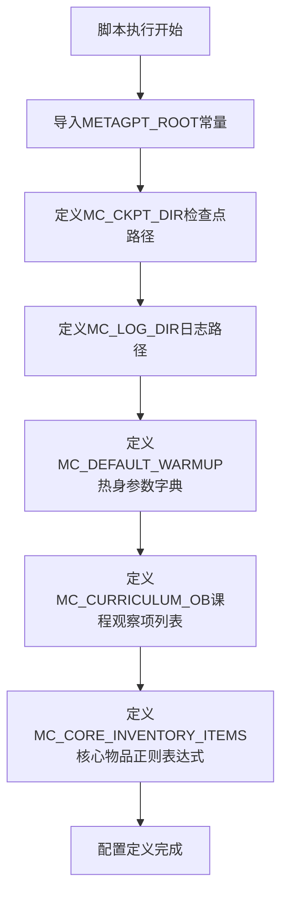

# `.\MetaGPT\metagpt\environment\minecraft\const.py` 详细设计文档

该配置文件为Minecraft游戏智能体定义了核心的路径配置、热身参数、课程观察项和核心物品清单，用于初始化和管理游戏环境中的智能体行为。

## 整体流程



## 类结构

```
配置文件 (无类结构)
├── 全局常量
├── 全局字典
├── 全局列表
└── 全局字符串
```

## 全局变量及字段


### `MC_CKPT_DIR`
    
Minecraft游戏智能体模型检查点文件的存储目录路径。

类型：`pathlib.Path`
    


### `MC_LOG_DIR`
    
Minecraft游戏智能体相关日志文件的存储目录路径。

类型：`pathlib.Path`
    


### `MC_DEFAULT_WARMUP`
    
定义Minecraft游戏智能体在训练或启动阶段，各项观察维度（如上下文、生物群系、时间等）的默认预热（观察）步数配置。

类型：`dict[str, int]`
    


### `MC_CURRICULUM_OB`
    
定义了Minecraft课程学习（Curriculum Learning）中，智能体需要观察的核心状态或特征维度列表。

类型：`list[str]`
    


### `MC_CORE_INVENTORY_ITEMS`
    
一个正则表达式字符串，用于匹配Minecraft游戏中被视为核心或基础物品的物品名称（如各种原木、木板、工作台等），在课程学习的预热阶段用于筛选库存显示。

类型：`str`
    


    

## 全局函数及方法


## 关键组件


### 常量与路径配置

定义了与Minecraft游戏智能体相关的核心常量、文件路径和默认配置值，用于初始化和管理智能体的运行环境。

### 默认预热配置

提供了一个字典，定义了智能体在训练或执行任务前，各个观察维度（如环境、生物群系、时间、实体、状态等）的默认预热步数，用于逐步引入环境复杂性。

### 课程学习观察维度

定义了一个列表，指定了在课程学习（Curriculum Learning）过程中智能体需要关注的核心观察维度，用于结构化地训练智能体。

### 核心物品正则表达式

定义了一个正则表达式字符串，用于匹配Minecraft游戏中的核心物品（如原木、木板、工具等），在课程学习的特定阶段限制库存中显示的物品，以简化学习空间。


## 问题及建议


### 已知问题

-   **硬编码的配置数据**：`MC_DEFAULT_WARMUP` 和 `MC_CURRICULUM_OB` 等配置数据直接硬编码在模块中。这降低了代码的灵活性，当需要调整这些参数（例如，为不同游戏模式或难度设置不同的预热值）时，必须修改源代码并重新部署。
-   **正则表达式可读性与维护性差**：`MC_CORE_INVENTORY_ITEMS` 变量使用一个冗长且未命名的正则表达式字符串。这种写法可读性差，难以理解其匹配规则，并且在需要修改或扩展匹配模式时容易出错，不利于长期维护。
-   **缺乏类型注解**：代码中定义的常量（如 `MC_DEFAULT_WARMUP`）没有显式的类型注解（例如 `Dict[str, int]`）。这降低了代码的清晰度，不利于现代IDE的自动补全和静态类型检查工具（如mypy）的分析，可能增加运行时类型错误的风险。
-   **常量定义与业务逻辑耦合**：`MC_CORE_INVENTORY_ITEMS` 的注释中包含了业务逻辑说明（“curriculum_agent: only show these items...”）。这违反了关注点分离原则，使得常量的定义依赖于特定的代理实现细节，降低了其作为通用配置的可复用性。

### 优化建议

-   **将配置外部化**：建议将 `MC_DEFAULT_WARMUP`、`MC_CURRICULUM_OB` 等配置移至外部配置文件（如JSON、YAML或TOML格式）。这样可以在不修改代码的情况下调整参数，便于进行A/B测试、环境差异化配置和管理。
-   **重构正则表达式并添加注释**：将 `MC_CORE_INVENTORY_ITEMS` 的正则表达式拆分为多个命名部分，或使用 `re.VERBOSE` 标志编写多行带注释的正则表达式。这能极大提升可读性和可维护性。同时，将业务逻辑注释从常量定义处移除，转移到使用该常量的业务代码附近。
-   **添加完整的类型注解**：为所有常量（包括 `MC_CKPT_DIR`, `MC_LOG_DIR`）添加明确的类型注解。例如：`MC_DEFAULT_WARMUP: Dict[str, int] = {...}`。这能提升代码的健壮性和开发体验。
-   **考虑使用配置类或数据类**：可以定义一个 `MinecraftConfig` 数据类（使用 `dataclass` 或 `pydantic` 的 `BaseModel`）来集中管理所有Minecraft相关的配置项。这不仅能提供类型安全，还能方便地进行配置验证、序列化和反序列化（如果从文件加载），使配置管理更加结构化。
-   **分离常量与逻辑注释**：将 `MC_CORE_INVENTORY_ITEMS` 注释中关于 `curriculum_agent` 的行为说明移动到该代理的实现代码中。保持常量定义简洁、独立，只描述“它是什么”（一个匹配核心物品的正则模式），而不是“它怎么用”。


## 其它


### 设计目标与约束

该代码模块的设计目标是提供一个用于《我的世界》（Minecraft）游戏智能体（Agent）的配置和常量定义。其主要约束包括：
1.  **路径管理**：依赖于 `METAGPT_ROOT` 常量来定义检查点（checkpoint）和日志文件的存储路径，确保文件系统访问的一致性。
2.  **配置驱动**：通过预定义的字典和列表来配置智能体的“热身”（warmup）阶段参数、观察（observation）课程（curriculum）以及核心物品筛选规则，实现行为的可配置性，而非硬编码。
3.  **可维护性**：将游戏相关的特定配置集中管理，便于未来根据游戏版本或智能体训练策略的变化进行调整。

### 错误处理与异常设计

当前代码模块主要定义常量，不包含运行时逻辑，因此没有显式的错误处理或异常抛出机制。其潜在的错误场景及隐含的处理方式包括：
1.  **路径无效**：如果 `METAGPT_ROOT` 指向的路径不存在或不可写，后续使用 `MC_CKPT_DIR` 和 `MC_LOG_DIR` 的代码可能会引发 `FileNotFoundError` 或 `PermissionError`。这需要调用方（使用这些常量的模块）负责处理。
2.  **配置键错误**：`MC_DEFAULT_WARMUP` 字典中的键被 `MC_CURRICULUM_OB` 列表引用。如果列表包含了字典中不存在的键，使用该列表的代码可能会引发 `KeyError`。这依赖于开发者维护配置间的一致性。
3.  **正则表达式错误**：`MC_CORE_INVENTORY_ITEMS` 是一个原始字符串（raw string），包含一个可能复杂的正则表达式。如果该模式语法错误，在首次被正则引擎编译时会引发 `re.error` 异常。

### 数据流与状态机

此模块本身不定义数据流或状态机。它提供的是静态配置数据：
1.  **数据提供者**：模块作为配置数据的源头。`MC_DEFAULT_WARMUP`、`MC_CURRICULUM_OB` 和 `MC_CORE_INVENTORY_ITEMS` 等常量预计会被其他组件（如课程智能体、观察包装器等）读取。
2.  **配置影响流程**：这些常量会影响智能体的学习或决策流程。例如，`MC_DEFAULT_WARMUP` 中的数值可能决定了智能体在训练初期关注哪些游戏维度；`MC_CURRICULUM_OB` 可能定义了观察空间的渐进式展开顺序；`MC_CORE_INVENTORY_ITEMS` 则用于过滤库存物品，聚焦关键资源。

### 外部依赖与接口契约

1.  **外部依赖**：
    *   `metagpt.const.METAGPT_ROOT`：一个路径对象，用于解析项目根目录。这是该模块正常工作的前提。
    *   `re` 模块（间接）：虽然未直接导入，但 `MC_CORE_INVENTORY_ITEMS` 作为正则表达式字符串，其最终使用者必然会导入并使用 `re` 模块进行模式匹配。
2.  **接口契约**：
    *   **提供方契约**：本模块承诺提供特定名称和类型的常量（如 `MC_CKPT_DIR` 为 `pathlib.Path` 对象，`MC_DEFAULT_WARMUP` 为字典）。任何导入此模块的代码都可以依赖这些定义。
    *   **使用方假设**：模块假设调用方了解这些常量的含义和用途，例如，知道 `MC_DEFAULT_WARMUP` 字典中键对应的游戏状态维度，以及数值代表的权重或阈值。

    