# `.\MetaGPT\metagpt\environment\minecraft\minecraft_env.py` 详细设计文档

该文件定义了一个MinecraftEnv类，它是Minecraft游戏环境的核心封装。它继承自MinecraftExtEnv和Environment，负责管理游戏状态、任务执行、技能存储、向量数据库检索、事件处理以及智能体（角色）间的共享内存。它协调任务执行（如挖矿、合成）、记录成功/失败的任务、管理技能库（包括代码和描述）、处理宝箱内存、并与底层的Minecraft游戏服务器进行交互以执行代码和获取事件反馈。

## 整体流程

```mermaid
graph TD
    A[开始: 初始化MinecraftEnv] --> B[设置Minecraft端口与恢复状态]
    B --> C{配置是否恢复(resume)?}
    C -- 是 --> D[从检查点目录加载: 宝箱内存、任务列表、技能、QA缓存]
    C -- 否 --> E[初始化空的向量数据库和内存结构]
    D --> F[将加载的技能和问题同步到向量数据库]
    E --> F
    F --> G[等待角色注册与环境交互]
    G --> H{触发事件: 如更新任务、执行代码等}
    H -- 更新事件/状态 --> I[调用对应的update方法，如update_event, update_task]
    H -- 执行代码(on_event_execute) --> J[通过_step方法向Minecraft发送代码]
    H -- 检索事件(on_event_retrieve) --> K[通过_step方法获取游戏状态]
    J --> L[接收Minecraft返回的事件列表]
    K --> L
    L --> M[调用update_event处理新事件]
    M --> N[更新宝箱内存和观察描述]
    N --> O[根据执行结果更新任务进度(update_exploration_progress)]
    O --> P{任务执行成功?}
    P -- 是 --> Q[将任务加入completed_tasks]
    P -- 否 --> R[将任务加入failed_tasks，并尝试回滚放置的方块]
    Q --> S[保存更新后的任务列表到文件]
    R --> S
    S --> T[流程结束或等待下一个交互]
```

## 类结构

```
MinecraftEnv (主类)
├── 继承自: MinecraftExtEnv (提供与Minecraft服务器的底层交互，如_step, _reset)
└── 继承自: Environment (元环境基类，提供角色管理等框架接口)
```

## 全局变量及字段


### `logger`
    
全局日志记录器，用于记录系统运行时的信息和错误。

类型：`logging.Logger`
    


### `MC_CKPT_DIR`
    
Minecraft环境检查点目录的路径常量，用于持久化存储游戏状态、技能和缓存数据。

类型：`str`
    


### `Config`
    
全局配置类，用于管理应用程序的配置设置，如是否从检查点恢复运行。

类型：`metagpt.config2.Config`
    


### `MinecraftEnv.model_config`
    
Pydantic模型配置，允许任意类型以支持复杂字段如向量数据库。

类型：`pydantic.ConfigDict`
    


### `MinecraftEnv.event`
    
存储从Minecraft环境接收的最新事件序列，用于跟踪游戏状态变化。

类型：`dict[str, Any]`
    


### `MinecraftEnv.current_task`
    
当前正在执行或待执行的任务描述，作为智能体的目标。

类型：`str`
    


### `MinecraftEnv.task_execution_time`
    
记录任务执行所花费的时间，用于性能监控或超时控制。

类型：`float`
    


### `MinecraftEnv.context`
    
当前任务的上下文或约束信息，为智能体提供额外的环境背景。

类型：`str`
    


### `MinecraftEnv.code`
    
由动作开发模块生成的、即将在Minecraft环境中执行的JavaScript代码。

类型：`str`
    


### `MinecraftEnv.program_code`
    
写入技能文件（skill/code/*.js）中的完整程序代码，作为可复用的技能。

类型：`str`
    


### `MinecraftEnv.program_name`
    
当前程序或技能的唯一名称，用作技能字典的键和向量数据库的ID。

类型：`str`
    


### `MinecraftEnv.critique`
    
由批判智能体提供的对任务执行结果的评估或反馈。

类型：`str`
    


### `MinecraftEnv.skills`
    
存储所有已学习技能的字典，键为技能名，值为包含代码和描述的技能信息。

类型：`dict`
    


### `MinecraftEnv.retrieve_skills`
    
通过检索为当前任务筛选出的相关技能名称列表。

类型：`list[str]`
    


### `MinecraftEnv.event_summary`
    
从聊天事件中提取的、关于所需物品或条件的文本摘要。

类型：`str`
    


### `MinecraftEnv.qa_cache`
    
缓存课程智能体生成的问答对（问题->答案），用于加速后续查询。

类型：`dict[str, str]`
    


### `MinecraftEnv.completed_tasks`
    
已成功完成的任务列表，用于跟踪进度和避免重复。

类型：`list[str]`
    


### `MinecraftEnv.failed_tasks`
    
已失败的任务列表，用于记录需要跳过或重试的任务。

类型：`list[str]`
    


### `MinecraftEnv.skill_desp`
    
当前技能的描述文本，用于向量化存储和相似性检索。

类型：`str`
    


### `MinecraftEnv.chest_memory`
    
记录已发现箱子的内存，键为坐标，值为箱子内容或状态（如'Unknown'）。

类型：`dict[str, Any]`
    


### `MinecraftEnv.chest_observation`
    
基于chest_memory生成的、供智能体观察的格式化箱子状态文本。

类型：`str`
    


### `MinecraftEnv.runtime_status`
    
表示最近一次动作执行的状态：True为成功，False为失败。

类型：`bool`
    


### `MinecraftEnv.vectordb`
    
用于存储和检索技能描述的向量数据库，支持基于语义的相似性搜索。

类型：`ChromaVectorStore`
    


### `MinecraftEnv.qa_cache_questions_vectordb`
    
专门用于存储qa_cache中问题的向量数据库，用于快速检索相似问题。

类型：`ChromaVectorStore`
    
    

## 全局函数及方法


### `load_mc_skills_code`

该函数用于加载Minecraft技能代码。它从指定的技能目录中读取所有JavaScript文件，并将它们的内容作为字符串列表返回。这些技能代码通常包含基础操作或“原始技能”，用于构建更复杂的程序。

参数：
- 无显式参数。函数内部依赖于配置或默认路径来定位技能代码文件。

返回值：`list[str]`，一个包含所有技能代码文件内容的字符串列表。

#### 流程图

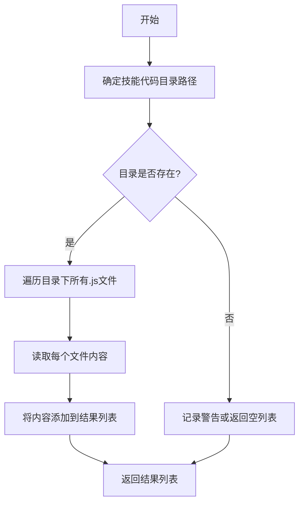

#### 带注释源码

```python
def load_mc_skills_code():
    """
    加载Minecraft技能代码。
    
    从配置的技能目录中读取所有JavaScript文件，并将它们的内容作为字符串列表返回。
    这些技能代码通常包含基础操作或“原始技能”，用于构建更复杂的程序。
    
    返回:
        list[str]: 包含所有技能代码文件内容的字符串列表。
    """
    # 确定技能代码目录路径
    skills_dir = Config.default().skills_dir or DEFAULT_SKILLS_DIR
    
    # 初始化结果列表
    skills_code = []
    
    # 检查目录是否存在
    if not os.path.exists(skills_dir):
        logger.warning(f"技能目录不存在: {skills_dir}")
        return skills_code
    
    # 遍历目录下所有.js文件
    for filename in os.listdir(skills_dir):
        if filename.endswith('.js'):
            file_path = os.path.join(skills_dir, filename)
            try:
                # 读取文件内容
                with open(file_path, 'r', encoding='utf-8') as f:
                    content = f.read()
                skills_code.append(content)
            except Exception as e:
                logger.error(f"读取技能文件失败 {file_path}: {e}")
    
    return skills_code
```


### `read_json_file`

从指定文件路径读取JSON文件内容并返回解析后的Python对象。

参数：

-  `file_path`：`str`，要读取的JSON文件的路径

返回值：`Any`，解析后的JSON内容，通常是字典、列表等Python对象

#### 流程图

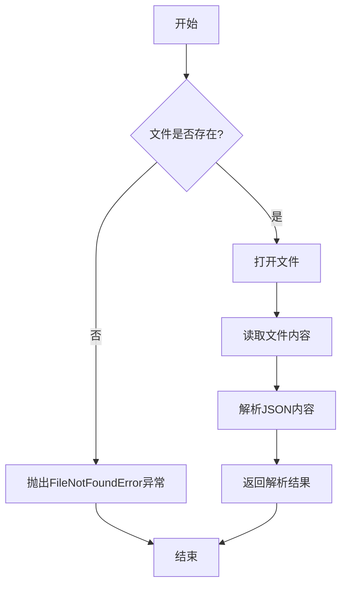

#### 带注释源码

```python
def read_json_file(file_path: str) -> Any:
    """
    读取JSON文件并返回解析后的内容。

    参数:
        file_path (str): JSON文件的路径。

    返回:
        Any: 解析后的JSON内容，通常是字典或列表。

    异常:
        FileNotFoundError: 如果文件不存在。
        json.JSONDecodeError: 如果文件内容不是有效的JSON格式。
    """
    with open(file_path, 'r', encoding='utf-8') as file:
        data = json.load(file)
    return data
```


### `write_json_file`

该函数用于将Python对象序列化为JSON格式并写入到指定的文件路径中。它封装了标准的`json.dump`操作，提供了便捷的JSON文件写入功能。

参数：

-  `file_path`：`str`，目标JSON文件的完整路径。
-  `data`：`Any`，需要被序列化并写入文件的Python对象（通常是字典或列表）。

返回值：`None`，该函数不返回任何值，其作用是将数据写入文件。

#### 流程图

```mermaid
flowchart TD
    A[开始: write_json_file(file_path, data)] --> B[以写入模式打开文件]
    B --> C[使用json.dump将data序列化并写入文件]
    C --> D[关闭文件]
    D --> E[结束]
```

#### 带注释源码

```python
def write_json_file(file_path: str, data: Any) -> None:
    """
    将数据写入JSON文件。

    参数:
        file_path (str): JSON文件的路径。
        data (Any): 要写入文件的数据（可JSON序列化的对象）。
    """
    # 以写入模式('w')和UTF-8编码打开文件。
    # `ensure_ascii=False` 确保非ASCII字符（如中文）能正确存储。
    # `indent=4` 使生成的JSON文件具有缩进，便于人类阅读。
    with open(file_path, "w", encoding="utf-8") as f:
        json.dump(data, f, ensure_ascii=False, indent=4)
```


### `MinecraftEnv.progress`

这是一个只读属性，用于获取当前环境中已完成任务的数量。

参数：无

返回值：`int`，已完成任务的数量。

#### 流程图

```mermaid
flowchart TD
    A[开始] --> B[获取 self.completed_tasks 列表]
    B --> C[计算列表长度 len(self.completed_tasks)]
    C --> D[返回长度值]
    D --> E[结束]
```

#### 带注释源码

```python
    @property
    def progress(self):
        # return len(self.completed_tasks) + 10 # Test only
        return len(self.completed_tasks)
```


### `MinecraftEnv.programs`

这是一个只读属性（property），用于生成并返回当前环境中所有可用技能代码的拼接字符串。它首先从`self.skills`字典中获取已学习的技能代码，然后加载基础的原始技能代码，最后将它们合并成一个字符串返回。

参数：
- 无

返回值：`str`，一个包含所有技能代码的字符串，每个技能代码块之间用两个换行符分隔。

#### 流程图

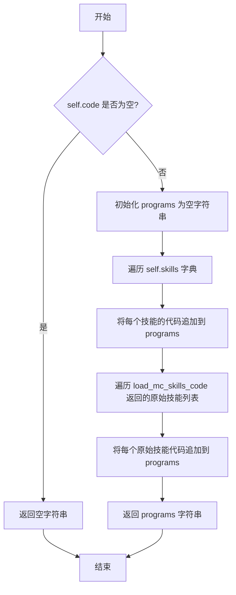

#### 带注释源码

```python
    @property
    def programs(self):
        # 定义一个只读属性 `programs`
        programs = ""
        # 如果当前代码为空，则直接返回空字符串
        # 注释提到这是一个临时修复，更好的方式是像 Voyager 项目那样隔离 env.step()
        if self.code == "":
            return programs  # TODO: maybe fix 10054 now, a better way is isolating env.step() like voyager
        # 遍历 self.skills 字典，将每个已学习技能的代码追加到 programs 字符串中
        for skill_name, entry in self.skills.items():
            programs += f"{entry['code']}\n\n"
        # 加载基础的原始技能代码（例如来自技能目录的代码）
        # 遍历这些原始技能，并将它们的代码也追加到 programs 字符串中
        for primitives in load_mc_skills_code():  # TODO add skills_dir
            programs += f"{primitives}\n\n"
        # 返回包含所有技能代码的完整字符串
        return programs
```


### `MinecraftEnv.set_mc_port`

该方法用于设置Minecraft服务器的端口，并触发环境恢复流程。它首先调用父类方法设置端口，然后执行`set_mc_resume`方法来初始化或恢复环境状态，包括加载向量数据库和从检查点文件恢复任务、技能等数据。

参数：

-  `mc_port`：`Any`，Minecraft服务器的端口号。

返回值：`None`，无返回值。

#### 流程图

```mermaid
flowchart TD
    A[开始: set_mc_port(mc_port)] --> B[调用父类方法 super().set_mc_port(mc_port)]
    B --> C[调用 self.set_mc_resume()]
    C --> D[初始化向量数据库<br/>qa_cache_questions_vectordb 和 skill_vectordb]
    D --> E{配置是否允许恢复?<br/>Config.default().resume}
    E -- 是 --> F[从检查点目录加载数据<br/>chest_memory, completed_tasks,<br/>failed_tasks, skills, qa_cache]
    F --> G{技能向量数据库为空?<br/>self.vectordb._collection.count() == 0}
    G -- 是 --> H[将技能描述添加到技能向量数据库]
    H --> I[持久化技能向量数据库]
    I --> J{问答缓存向量数据库为空?<br/>self.qa_cache_questions_vectordb._collection.count() == 0}
    G -- 否 --> J
    J -- 是 --> K[将问答缓存问题添加到问答向量数据库]
    K --> L[持久化问答向量数据库]
    L --> M[执行数据一致性检查<br/>断言向量数据库条目数与文件数据量一致]
    J -- 否 --> N[结束]
    M --> N
    E -- 否 --> N
```

#### 带注释源码

```python
def set_mc_port(self, mc_port):
    # 调用父类 MinecraftExtEnv 的 set_mc_port 方法，设置 Minecraft 服务器端口
    super().set_mc_port(mc_port)
    # 调用本类的 set_mc_resume 方法，执行环境恢复和初始化流程
    self.set_mc_resume()
```


### `MinecraftEnv.set_mc_resume`

该方法用于在设置Minecraft端口后，恢复或初始化MinecraftEnv的持久化状态。它负责加载之前保存的检查点数据（如任务、技能、问答缓存、箱子内存等），并初始化或同步对应的向量数据库（vectordb）。如果配置为恢复模式（`resume=True`），它会从磁盘加载数据并确保向量数据库与加载的JSON文件同步；如果向量数据库为空，它会根据加载的数据重新构建索引。

参数：
-  `self`：`MinecraftEnv`，MinecraftEnv类的实例，代表当前的环境对象。

返回值：`None`，该方法不返回任何值，其作用是通过修改实例属性来恢复环境状态。

#### 流程图

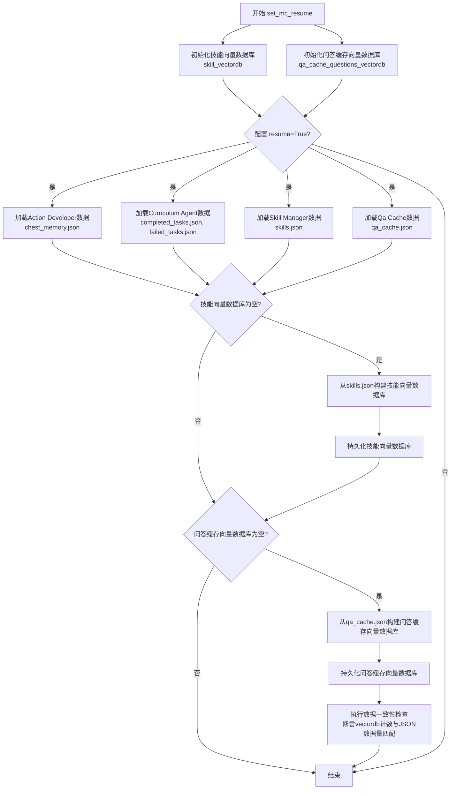

#### 带注释源码

```python
def set_mc_resume(self):
    # 1. 初始化两个Chroma向量数据库，用于存储技能描述和问答缓存问题。
    #    它们将数据持久化到指定的检查点目录。
    self.qa_cache_questions_vectordb = ChromaVectorStore(
        collection_name="qa_cache_questions_vectordb",
        persist_dir=f"{MC_CKPT_DIR}/curriculum/vectordb",
    )

    self.vectordb = ChromaVectorStore(
        collection_name="skill_vectordb",
        persist_dir=f"{MC_CKPT_DIR}/skill/vectordb",
    )

    # 2. 检查全局配置是否启用了恢复模式。
    if Config.default().resume:
        # 2.1 从磁盘加载各个组件之前保存的JSON状态文件。
        logger.info(f"Loading Action Developer from {MC_CKPT_DIR}/action")
        self.chest_memory = read_json_file(f"{MC_CKPT_DIR}/action/chest_memory.json")

        logger.info(f"Loading Curriculum Agent from {MC_CKPT_DIR}/curriculum")
        self.completed_tasks = read_json_file(f"{MC_CKPT_DIR}/curriculum/completed_tasks.json")
        self.failed_tasks = read_json_file(f"{MC_CKPT_DIR}/curriculum/failed_tasks.json")

        logger.info(f"Loading Skill Manager from {MC_CKPT_DIR}/skill\033[0m")
        self.skills = read_json_file(f"{MC_CKPT_DIR}/skill/skills.json")

        logger.info(f"Loading Qa Cache from {MC_CKPT_DIR}/curriculum\033[0m")
        self.qa_cache = read_json_file(f"{MC_CKPT_DIR}/curriculum/qa_cache.json")

        # 3. 如果技能向量数据库是空的（例如首次恢复或数据库损坏），
        #    则根据刚加载的skills.json数据重建索引。
        if self.vectordb._collection.count() == 0:
            logger.info(self.vectordb._collection.count())
            # 准备数据：提取技能描述、程序名，并构建元数据。
            skill_desps = [skill["description"] for program_name, skill in self.skills.items()]
            program_names = [program_name for program_name, skill in self.skills.items()]
            metadatas = [{"name": program_name} for program_name in program_names]
            # 将文本（技能描述）添加到向量数据库，使用程序名作为ID。
            self.vectordb.add_texts(
                texts=skill_desps,
                ids=program_names,
                metadatas=metadatas,
            )
            self.vectordb.persist()  # 将内存中的更改持久化到磁盘。

        # 4. 类似地，检查并初始化问答缓存问题的向量数据库。
        logger.info(self.qa_cache_questions_vectordb._collection.count())
        if self.qa_cache_questions_vectordb._collection.count() == 0:
            questions = [question for question, answer in self.qa_cache.items()]

            self.qa_cache_questions_vectordb.add_texts(texts=questions)

            self.qa_cache_questions_vectordb.persist()

            # 5. 数据一致性验证与日志记录。
            #    确保向量数据库中存储的项目数量与从JSON文件加载的数量一致。
            logger.info(
                f"INIT_CHECK: There are {self.vectordb._collection.count()} skills in vectordb and {len(self.skills)} skills in skills.json."
            )
            # 断言检查，如果不一致则抛出错误，提示可能的配置问题。
            assert self.vectordb._collection.count() == len(self.skills), (
                f"Skill Manager's vectordb is not synced with skills.json.\n"
                f"There are {self.vectordb._collection.count()} skills in vectordb but {len(self.skills)} skills in skills.json.\n"
                f"Did you set resume=False when initializing the manager?\n"
                f"You may need to manually delete the vectordb directory for running from scratch."
            )

            logger.info(
                f"INIT_CHECK: There are {self.qa_cache_questions_vectordb._collection.count()} qa_cache in vectordb and {len(self.qa_cache)} questions in qa_cache.json."
            )
            assert self.qa_cache_questions_vectordb._collection.count() == len(self.qa_cache), (
                f"Curriculum Agent's qa cache question vectordb is not synced with qa_cache.json.\n"
                f"There are {self.qa_cache_questions_vectordb._collection.count()} questions in vectordb "
                f"but {len(self.qa_cache)} questions in qa_cache.json.\n"
                f"Did you set resume=False when initializing the agent?\n"
                f"You may need to manually delete the qa cache question vectordb directory for running from scratch.\n"
            )
    # 如果 resume=False，则跳过所有加载和初始化步骤，仅创建空的向量数据库实例。
```


### `MinecraftEnv.register_roles`

该方法用于将多个 `Minecraft` 角色注册到当前环境实例中，通过调用每个角色的 `set_memory` 方法，将当前环境实例（作为共享内存）传递给这些角色，从而实现角色与环境之间的信息同步和状态共享。

参数：

- `roles`：`Iterable["Minecraft"]`，一个可迭代对象，包含多个 `Minecraft` 角色实例。

返回值：`None`，无返回值。

#### 流程图

```mermaid
flowchart TD
    A[开始] --> B{遍历 roles 中的每个角色}
    B --> C[调用 role.set_memory(self)]
    C --> D{是否还有下一个角色？}
    D -- 是 --> B
    D -- 否 --> E[结束]
```

#### 带注释源码

```python
def register_roles(self, roles: Iterable["Minecraft"]):
    # 遍历传入的角色集合
    for role in roles:
        # 调用每个角色的 set_memory 方法，将当前环境实例 self 作为参数传递
        role.set_memory(self)
```


### `MinecraftEnv.update_event`

该方法用于更新Minecraft环境中的事件信息。当传入的事件字典与当前存储的事件不同时，会更新环境的事件状态，并触发相关的内存和观察更新，如更新箱子内存和箱子观察信息。

参数：

- `event`：`dict`，包含Minecraft事件信息的字典，用于更新环境中的事件状态。

返回值：`None`，该方法不返回任何值。

#### 流程图

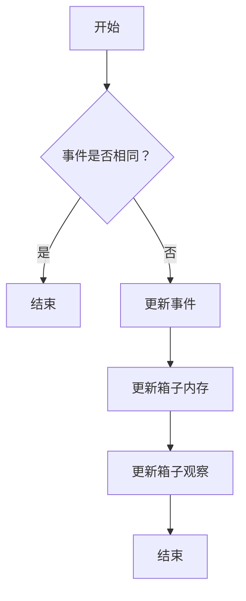

#### 带注释源码

```python
def update_event(self, event: dict):
    # 检查传入的事件是否与当前事件相同，若相同则直接返回，避免重复更新
    if self.event == event:
        return
    # 更新当前事件为传入的事件
    self.event = event
    # 调用方法更新箱子内存，基于新事件中的箱子信息
    self.update_chest_memory(event)
    # 更新箱子观察信息，将箱子内存转换为可读的观察字符串
    self.update_chest_observation()
    # 注释掉的代码：原本用于总结聊天日志，但当前未启用
    # self.event_summary = self.summarize_chatlog(event)
```


### `MinecraftEnv.update_task`

该方法用于更新当前任务。它是`MinecraftEnv`类中的一个简单状态更新方法，负责将传入的新任务字符串赋值给实例的`current_task`字段，从而改变环境当前正在执行或关注的目标任务。

参数：

-  `task`：`str`，新的任务描述字符串。

返回值：`None`，该方法不返回任何值。

#### 流程图

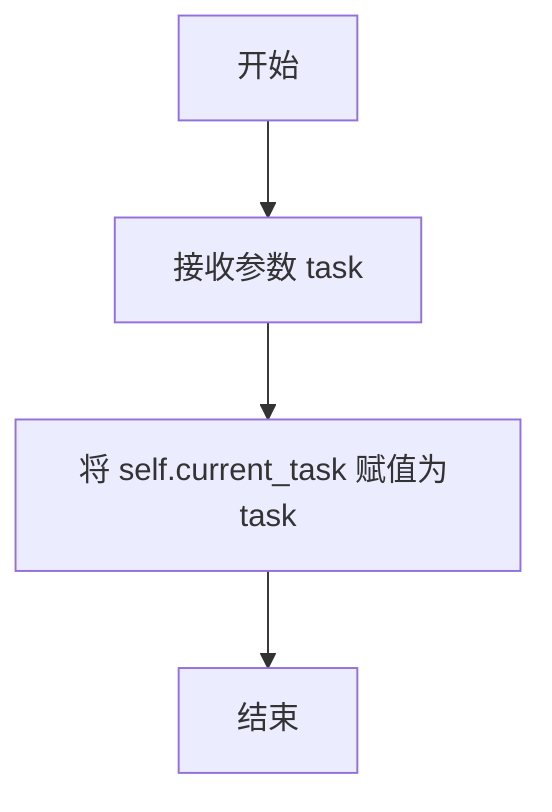

#### 带注释源码

```python
def update_task(self, task: str):
    # 将传入的任务字符串更新为当前环境实例的 current_task 属性
    self.current_task = task
```


### `MinecraftEnv.update_context`

该方法用于更新Minecraft环境中的上下文信息。上下文信息通常用于描述当前任务的环境、约束或提示，例如任务执行的具体条件或可用资源。通过更新上下文，可以确保环境状态与当前任务需求保持一致。

参数：

- `context`：`str`，新的上下文描述字符串，用于替换当前的上下文信息。

返回值：`None`，该方法不返回任何值，仅更新实例的`context`字段。

#### 流程图

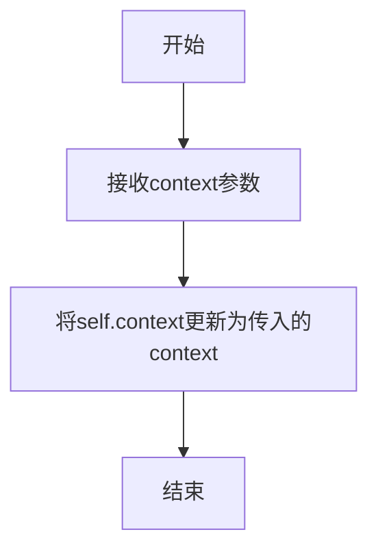

#### 带注释源码

```python
def update_context(self, context: str):
    # 更新实例的context字段为传入的新上下文字符串
    self.context = context
```


### `MinecraftEnv.update_program_code`

该方法用于更新环境中的程序代码。它接收一个字符串参数，并将其赋值给实例的`program_code`字段，该字段存储了当前要执行的程序代码（通常是从技能/代码目录中加载的JavaScript文件内容）。

参数：

- `program_code`：`str`，要更新的程序代码字符串。

返回值：`None`，该方法不返回任何值。

#### 流程图

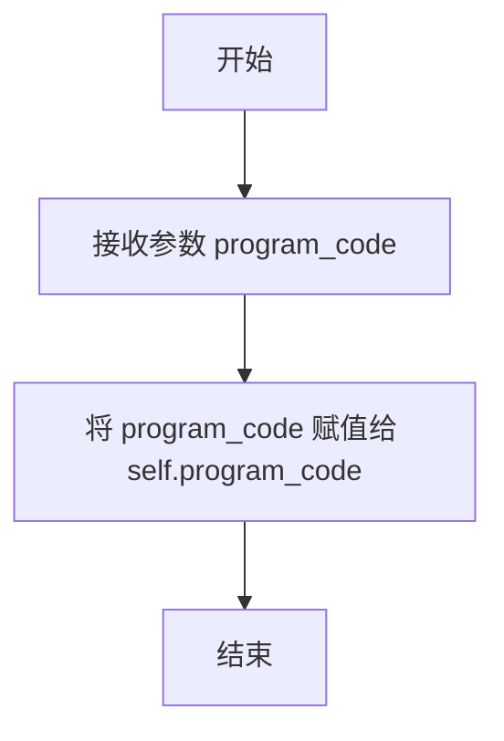

#### 带注释源码

```python
def update_program_code(self, program_code: str):
    self.program_code = program_code  # 将传入的程序代码字符串赋值给实例的 program_code 字段
```

### `MinecraftEnv.update_code`

该方法用于更新当前环境中的代码字段，通常由动作开发器（action_developer）生成的动作代码调用，以设置当前要执行的代码。

参数：

- `code`：`str`，要更新的代码字符串，通常是由动作开发器生成的动作代码。

返回值：`None`，该方法不返回任何值，仅更新实例的`code`字段。

#### 流程图

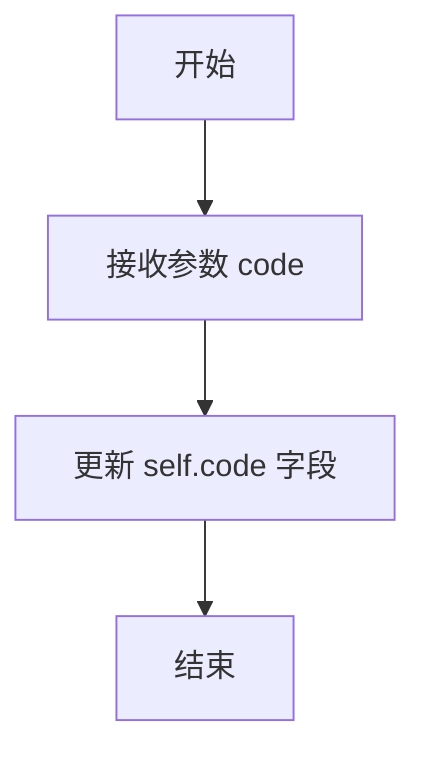

#### 带注释源码

```python
def update_code(self, code: str):
    self.code = code  # action_developer.gen_action_code to HERE
```


### `MinecraftEnv.update_program_name`

该方法用于更新环境实例中当前程序（技能）的名称。它是一个简单的 setter 方法，将传入的 `program_name` 参数赋值给实例的 `self.program_name` 字段，用于记录当前正在处理或生成的技能代码所对应的名称。

参数：
-  `program_name`：`str`，新的程序（技能）名称。

返回值：`None`，该方法不返回任何值。

#### 流程图

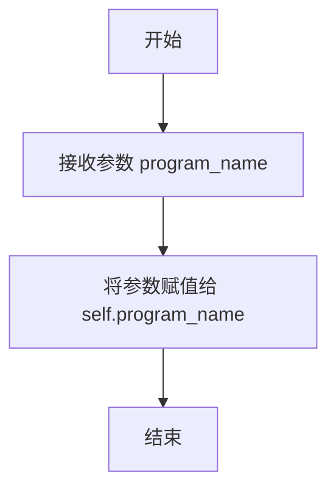

#### 带注释源码

```python
def update_program_name(self, program_name: str):
    # 将传入的程序名称参数赋值给实例的 program_name 字段
    self.program_name = program_name
```


### `MinecraftEnv.update_critique`

该方法用于更新环境中的`critique`字段，该字段存储了由`critic_agent`生成的对当前任务执行情况的评估或批评信息。

参数：

- `critique`：`str`，由批评代理（critic_agent）生成的评估文本，用于描述任务执行的成功、失败或需要改进的地方。

返回值：`None`，该方法不返回任何值，仅用于更新实例的内部状态。

#### 流程图

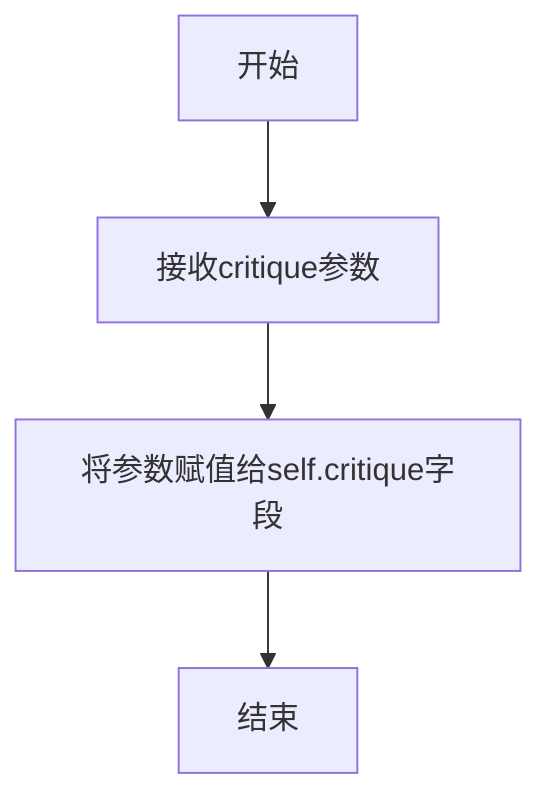

#### 带注释源码

```python
def update_critique(self, critique: str):
    # 将传入的评估文本（critique）赋值给实例的critique字段。
    # 这个字段通常由批评代理（critic_agent）在检查任务成功与否后设置。
    self.critique = critique  # critic_agent.check_task_success to HERE
```


### `MinecraftEnv.append_skill`

该方法用于向环境管理的技能字典中添加一个新技能。它将当前程序名（`self.program_name`）作为键，传入的技能字典作为值，存储到 `self.skills` 中。这是技能管理器（Skill Manager）将新生成或检索到的技能存入环境共享状态的关键步骤。

参数：

-  `skill`：`dict`，一个包含技能信息的字典，例如可能包含 `code`（技能代码）、`description`（技能描述）等字段。

返回值：`None`，该方法不返回任何值，其作用在于修改实例的内部状态。

#### 流程图

```mermaid
flowchart TD
    A[开始: append_skill(skill)] --> B[以 self.program_name 为键<br>将 skill 字典存入 self.skills]
    B --> C[结束]
```

#### 带注释源码

```python
def append_skill(self, skill: dict):
    # 将传入的技能字典 `skill` 添加到 `self.skills` 字典中。
    # 使用当前实例的 `program_name` 字段作为新技能的键。
    # 此操作通常由技能管理器（Skill Manager）在检索或生成新技能后调用，
    # 用于更新环境中的技能库，供其他代理（如行动开发者）后续使用。
    self.skills[self.program_name] = skill  # skill_manager.retrieve_skills to HERE
```


### `MinecraftEnv.update_retrieve_skills`

该方法用于更新当前环境中检索到的技能列表。它接收一个技能名称列表，并将其直接赋值给实例的 `retrieve_skills` 字段，用于后续的技能匹配或执行流程。

参数：

-  `retrieve_skills`：`list`，一个包含技能名称（字符串）的列表，代表从技能库或向量数据库中检索到的相关技能。

返回值：`None`，此方法不返回任何值，仅更新实例的内部状态。

#### 流程图

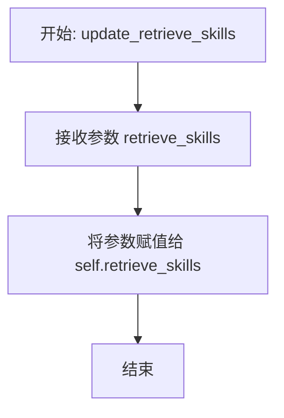

#### 带注释源码

```python
def update_retrieve_skills(self, retrieve_skills: list):
    # 将传入的技能列表直接赋值给实例的 `retrieve_skills` 字段。
    # 这个字段通常用于存储从技能库中检索到的、与当前任务相关的技能名称。
    self.retrieve_skills = retrieve_skills
```


### `MinecraftEnv.update_skill_desp`

该方法用于更新环境实例中存储的技能描述信息。它是一个简单的 setter 方法，将传入的字符串赋值给类的 `skill_desp` 字段，用于记录或更新当前环境中某个技能的详细描述。

参数：
-  `skill_desp`：`str`，新的技能描述字符串。

返回值：`None`，该方法不返回任何值。

#### 流程图

```mermaid
flowchart TD
    A[开始: update_skill_desp(skill_desp)] --> B[将参数 skill_desp 赋值给 self.skill_desp]
    B --> C[结束]
```

#### 带注释源码

```
    def update_skill_desp(self, skill_desp: str):
        # 将传入的技能描述字符串赋值给实例的 skill_desp 字段
        self.skill_desp = skill_desp
```


### `MinecraftEnv.update_qa_cache`

该方法用于异步更新`MinecraftEnv`实例中的问答缓存（`qa_cache`）。它接收一个新的问答缓存字典，并将其赋值给实例的`qa_cache`字段。此操作通常由课程代理（Curriculum Agent）调用，以同步其内部生成的问答对到环境的状态中，供其他组件（如技能管理器）检索和使用。

参数：

-  `qa_cache`：`dict`，一个新的问答缓存字典，其中键为问题（字符串），值为答案（字符串）。

返回值：`None`，此方法不返回任何值。

#### 流程图

```mermaid
flowchart TD
    A[开始: update_qa_cache(qa_cache)] --> B[将实例的qa_cache字段<br>更新为传入的qa_cache字典]
    B --> C[结束]
```

#### 带注释源码

```python
async def update_qa_cache(self, qa_cache: dict):
    # 将传入的qa_cache字典赋值给实例的qa_cache字段，完成状态更新。
    self.qa_cache = qa_cache
```


### `MinecraftEnv.update_chest_memory`

该方法用于更新环境中的箱子内存。它接收来自游戏环境的事件数据，解析其中的`nearbyChests`信息，并根据箱子的状态（有效、无效、未知）来更新或移除内存中的箱子记录。更新完成后，会将最新的箱子内存状态持久化保存到JSON文件中。

参数：

-  `events`：`dict`，包含从Minecraft环境捕获的事件数据，特别是`nearbyChests`字段，该字段记录了附近箱子的位置和状态信息。

返回值：`None`，该方法不返回任何值，其作用是通过更新`self.chest_memory`字段并保存文件来产生副作用。

#### 流程图

```mermaid
flowchart TD
    A[开始: update_chest_memory(events)] --> B[从events中提取nearbyChests]
    B --> C{遍历nearbyChests中的每个位置和箱子状态}
    C --> D{位置是否已在chest_memory中?}
    D -- 是 --> E{箱子状态是否为字典?}
    E -- 是 --> F[更新该位置的箱子信息为字典]
    E -- 否 --> G{箱子状态是否为'Invalid'?}
    G -- 是 --> H[从chest_memory中移除该位置]
    G -- 否 --> I[保持原记录不变]
    D -- 否 --> J{箱子状态是否为'Invalid'?}
    J -- 是 --> K[忽略此无效箱子]
    J -- 否 --> L[将新位置和箱子状态存入chest_memory]
    C --> M[遍历结束]
    M --> N[将更新后的chest_memory保存至JSON文件]
    N --> O[结束]
```

#### 带注释源码

```python
def update_chest_memory(self, events: dict):
    """
    Input: events: Dict
    Result: self.chest_memory update & save to json
    """
    # 1. 从传入的事件字典中提取最后一个事件的'nearbyChests'信息。
    #    这通常是一个字典，键为箱子坐标字符串（如'(x, y, z)'），值为箱子状态。
    nearbyChests = events[-1][1]["nearbyChests"]

    # 2. 遍历所有检测到的附近箱子。
    for position, chest in nearbyChests.items():
        # 情况A: 如果该箱子位置已经在内存记录中
        if position in self.chest_memory:
            # 子情况A1: 如果当前箱子状态是一个字典（表示有具体内容信息）
            if isinstance(chest, dict):
                # 用新的字典信息更新该位置的记录
                self.chest_memory[position] = chest
            # 子情况A2: 如果当前箱子状态是字符串"Invalid"（表示箱子无效或无法访问）
            if chest == "Invalid":
                # 记录日志并从内存中移除该箱子记录
                logger.info(f"Action Developer removing chest {position}: {chest}")
                self.chest_memory.pop(position)
        # 情况B: 如果该箱子位置是新的（不在内存记录中）
        else:
            # 只有当箱子状态不是"Invalid"时，才将其作为新记录添加到内存中
            if chest != "Invalid":
                logger.info(f"Action Developer saving chest {position}: {chest}")
                self.chest_memory[position] = chest

    # 3. 将更新后的整个箱子内存字典持久化保存到指定的JSON文件中。
    write_json_file(f"{MC_CKPT_DIR}/action/chest_memory.json", self.chest_memory)
```


### `MinecraftEnv.update_chest_observation`

该方法用于将存储在 `chest_memory` 中的箱子信息，转换为格式化的字符串描述，并更新到 `chest_observation` 字段中。其核心逻辑是根据箱子内容的不同状态（有物品、空、未知），生成不同格式的描述行，最终将所有箱子的描述合并为一个字符串。

参数：
-  `self`：`MinecraftEnv`，当前 `MinecraftEnv` 类的实例。

返回值：`None`，该方法不返回任何值，其作用是通过更新 `self.chest_observation` 来产生副作用。

#### 流程图

```mermaid
flowchart TD
    A[开始 update_chest_observation] --> B[初始化空列表 chests]
    B --> C{遍历 chest_memory 中的每个箱子?}
    C -- 是 --> D{箱子内容是否为字典且长度>0?}
    D -- 是 --> E[添加格式: “位置: 内容字典”]
    D -- 否 --> F{箱子内容是否为字典且长度==0?}
    F -- 是 --> G[添加格式: “位置: Empty”]
    F -- 否 --> H{箱子内容是否为字符串'Unknown'?}
    H -- 是 --> I[添加格式: “位置: Unknown items inside”]
    I --> C
    G --> C
    E --> C
    C -- 遍历结束 --> J{chests 列表是否为空?}
    J -- 是 --> K[设置 chest_observation 为 “Chests: None\n\n”]
    J -- 否 --> L[将 chests 列表用换行符连接成字符串]
    L --> M[设置 chest_observation 为 “Chests:\n{字符串}\n\n”]
    K --> N[结束]
    M --> N
```

#### 带注释源码

```python
    def update_chest_observation(self):
        """
        update chest_memory to chest_observation.
        Refer to @ https://github.com/MineDojo/Voyager/blob/main/voyager/agents/action.py
        """
        # 初始化一个空列表，用于存储格式化后的每个箱子信息
        chests = []
        # 第一优先级遍历：处理内容为非空字典的箱子（即有具体物品的箱子）
        for chest_position, chest in self.chest_memory.items():
            if isinstance(chest, dict) and len(chest) > 0:
                # 格式：位置: {物品字典}
                chests.append(f"{chest_position}: {chest}")
        # 第二优先级遍历：处理内容为空字典的箱子（即空的箱子）
        for chest_position, chest in self.chest_memory.items():
            if isinstance(chest, dict) and len(chest) == 0:
                # 格式：位置: Empty
                chests.append(f"{chest_position}: Empty")
        # 第三优先级遍历：处理内容为字符串'Unknown'的箱子（内部物品未知的箱子）
        for chest_position, chest in self.chest_memory.items():
            if isinstance(chest, str):
                # 断言确保字符串内容为'Unknown'
                assert chest == "Unknown"
                # 格式：位置: Unknown items inside
                chests.append(f"{chest_position}: Unknown items inside")
        # 断言：确保处理后的箱子数量与原始内存中的数量一致
        assert len(chests) == len(self.chest_memory)
        # 根据是否有箱子信息，格式化最终的观察字符串
        if chests:
            # 如果有箱子，用换行符连接所有描述行
            chests = "\n".join(chests)
            # 更新类字段，添加“Chests:”标题和额外的空行
            self.chest_observation = f"Chests:\n{chests}\n\n"
        else:
            # 如果没有箱子，设置为“None”
            self.chest_observation = "Chests: None\n\n"
```


### `MinecraftEnv.summarize_chatlog`

该方法用于处理Minecraft游戏中的聊天日志事件，通过正则表达式匹配特定的失败消息（如合成失败、挖掘失败等），提取出所需的物品或条件，并将这些信息汇总成一个字符串，存储在`self.event_summary`字段中。

参数：

-  `events`：`list`，一个包含Minecraft事件（事件类型，事件详情）的列表。

返回值：`None`，该方法不返回任何值，其处理结果直接更新到`self.event_summary`字段。

#### 流程图

```mermaid
flowchart TD
    A[开始] --> B[初始化空集合 chatlog]
    B --> C{遍历 events 列表}
    C --> D[取出 event_type 和 event]
    D --> E{event_type 是否为 'onChat'?}
    E -- 是 --> F[调用 filter_item 处理 event['onChat']]
    F --> G{filter_item 返回的 item 是否非空?}
    G -- 是 --> H[将 item 添加到 chatlog 集合]
    H --> C
    G -- 否 --> C
    E -- 否 --> C
    C --> I[遍历结束]
    I --> J{chatlog 集合是否为空?}
    J -- 是 --> K[设置 event_summary 为空字符串]
    J -- 否 --> L[将 chatlog 集合元素用逗号连接<br>并加上前缀 'I also need ' 和后缀 '.']
    L --> M[将结果字符串赋值给 event_summary]
    K --> N[结束]
    M --> N

    subgraph filter_item [内部函数 filter_item]
        F1[接收 message 参数] --> F2{使用正则匹配<br>craft_pattern?}
        F2 -- 匹配成功 --> F3[提取所需物品，赋值给 event_summary]
        F2 -- 匹配失败 --> F4{使用正则匹配<br>craft_pattern2?}
        F4 -- 匹配成功 --> F5[设置 event_summary 为<br>'a nearby crafting table']
        F4 -- 匹配失败 --> F6{使用正则匹配<br>mine_pattern?}
        F6 -- 匹配成功 --> F7[提取所需工具，赋值给 event_summary]
        F6 -- 匹配失败 --> F8[设置 event_summary 为空字符串]
        F3 --> F9[返回 event_summary]
        F5 --> F9
        F7 --> F9
        F8 --> F9
    end
```

#### 带注释源码

```python
def summarize_chatlog(self, events):
    # 内部函数，用于从单条聊天消息中过滤出关键物品信息
    def filter_item(message: str):
        # 正则表达式模式1：匹配因缺少材料而合成失败的聊天消息
        craft_pattern = r"I cannot make \w+ because I need: (.*)"
        # 正则表达式模式2：匹配因附近没有工作台而合成失败的聊天消息
        craft_pattern2 = r"I cannot make \w+ because there is no crafting table nearby"
        # 正则表达式模式3：匹配因工具等级不足而挖掘失败的聊天消息
        mine_pattern = r"I need at least a (.*) to mine \w+!"
        # 尝试匹配第一个模式（合成失败-缺少材料）
        if re.match(craft_pattern, message):
            # 如果匹配成功，提取括号内捕获的所需物品字符串，并赋值给实例变量
            self.event_summary = re.match(craft_pattern, message).groups()[0]
        # 尝试匹配第二个模式（合成失败-无工作台）
        elif re.match(craft_pattern2, message):
            # 如果匹配成功，将事件摘要设置为需要附近的工作台
            self.event_summary = "a nearby crafting table"
        # 尝试匹配第三个模式（挖掘失败-工具不足）
        elif re.match(mine_pattern, message):
            # 如果匹配成功，提取括号内捕获的所需工具字符串，并赋值给实例变量
            self.event_summary = re.match(mine_pattern, message).groups()[0]
        else:
            # 如果所有模式都不匹配，则将事件摘要设置为空字符串
            self.event_summary = ""
        # 返回过滤后的事件摘要（可能为空）
        return self.event_summary

    # 使用集合来存储过滤出的物品，自动去重
    chatlog = set()
    # 遍历传入的事件列表
    for event_type, event in events:
        # 只处理类型为 'onChat' 的事件（聊天事件）
        if event_type == "onChat":
            # 调用内部函数 filter_item 处理聊天内容，获取关键物品信息
            item = filter_item(event["onChat"])
            # 如果返回的物品信息非空，则将其添加到集合中
            if item:
                chatlog.add(item)
    # 处理完所有事件后，根据集合内容构建最终的事件摘要字符串
    # 如果集合不为空，将集合中的元素用逗号和空格连接，并加上前缀和后缀
    # 如果集合为空，则将事件摘要设置为空字符串
    self.event_summary = "I also need " + ", ".join(chatlog) + "." if chatlog else ""
```


### `MinecraftEnv.reset_block_info`

该方法用于重置方块信息，具体功能是撤销上一步中所有放置方块的事件。目前该方法仅包含一个占位符实现，没有实际逻辑。

参数：无

返回值：无返回值

#### 流程图

```mermaid
flowchart TD
    Start[开始] --> Pass[执行空操作<br>（占位符）]
    Pass --> End[结束]
```

#### 带注释源码

```python
def reset_block_info(self):
    # revert all the placing event in the last step
    pass
```


### `MinecraftEnv.update_exploration_progress`

该方法用于根据任务执行的成功与否，更新探索进度。具体来说，它会将当前任务根据执行结果（成功或失败）分别添加到`completed_tasks`（已完成任务列表）或`failed_tasks`（失败任务列表）中。如果任务失败，还会执行额外的步骤来恢复游戏状态（例如，归还放置的物品），并最终保存更新后的任务列表到JSON文件中。

参数：

- `success`：`bool`，表示当前任务是否成功完成。

返回值：`None`，无返回值。

#### 流程图

```mermaid
graph TD
    A[开始] --> B{任务是否成功?};
    B -- 是 --> C[将任务添加到 completed_tasks];
    B -- 否 --> D[将任务添加到 failed_tasks];
    D --> E{任务是否为“Deposit useless items into the chest at”开头?};
    E -- 是 --> F[跳过状态恢复];
    E -- 否 --> G[恢复游戏状态: 归还放置的物品];
    G --> H[更新事件中的 inventory 和 voxels];
    H --> I[保存排序后的任务列表];
    C --> I;
    F --> I;
    I --> J[结束];
```

#### 带注释源码

```python
def update_exploration_progress(self, success: bool):
    """
    Split task into completed_tasks or failed_tasks
    Args: info = {
        "task": self.task,
        "success": success,
        "conversations": self.conversations,
    }
    """
    self.runtime_status = success  # 更新运行时状态为成功或失败
    task = self.current_task  # 获取当前任务

    # 如果任务是以“Deposit useless items into the chest at”开头，则直接返回，不进行后续处理
    if task.startswith("Deposit useless items into the chest at"):
        return

    if success:
        logger.info(f"Completed task {task}.")  # 记录任务完成日志
        self.completed_tasks.append(task)  # 将任务添加到已完成任务列表
    else:
        logger.info(f"Failed to complete task {task}. Skipping to next task.")  # 记录任务失败日志
        self.failed_tasks.append(task)  # 将任务添加到失败任务列表

        # 当任务失败时，恢复游戏状态：归还放置的物品
        blocks = []
        positions = []
        for event_type, event in self.event:
            if event_type == "onSave" and event["onSave"].endswith("_placed"):
                block = event["onSave"].split("_placed")[0]  # 提取放置的方块名称
                position = event["status"]["position"]  # 提取方块位置
                blocks.append(block)
                positions.append(position)

        # 执行游戏步骤，归还放置的物品
        new_events = self._step(
            f"await givePlacedItemBack(bot, {json.dumps(blocks)}, {json.dumps(positions)})",
            programs=self.programs,
        )
        # 更新事件中的 inventory 和 voxels 信息
        self.event[-1][1]["inventory"] = new_events[-1][1]["inventory"]
        self.event[-1][1]["voxels"] = new_events[-1][1]["voxels"]

    self.save_sorted_tasks()  # 保存排序后的任务列表到JSON文件
```


### `MinecraftEnv.save_sorted_tasks`

该方法用于整理并持久化保存当前环境中的任务列表。它主要执行两个操作：1) 对已完成任务列表进行去重（保持顺序），并确保失败任务列表中不包含已完成的任务；2) 将整理后的已完成任务列表和失败任务列表分别写入到对应的JSON文件中进行持久化存储。

参数：
-  `self`：`MinecraftEnv`，当前MinecraftEnv类的实例。

返回值：`None`，该方法不返回任何值，其作用在于更新实例状态并执行文件写入操作。

#### 流程图

```mermaid
flowchart TD
    A[开始] --> B[初始化去重后的<br>已完成任务列表 updated_completed_tasks]
    B --> C[初始化去重后的<br>失败任务列表 updated_failed_tasks<br>（初始为 self.failed_tasks）]
    C --> D{遍历 self.completed_tasks<br>中的每个任务 task}
    D -->|是| E[task 是否已在<br>updated_completed_tasks 中?]
    E -->|否| F[将 task 添加到<br>updated_completed_tasks 末尾]
    F --> D
    E -->|是| D
    D -->|遍历完成| G{遍历 updated_completed_tasks<br>中的每个任务 task}
    G -->|是| H[task 是否在<br>updated_failed_tasks 中?]
    H -->|是| I[从 updated_failed_tasks<br>中移除该 task]
    I --> G
    H -->|否| G
    G -->|遍历完成| J[将 self.completed_tasks 更新为<br>updated_completed_tasks]
    J --> K[将 self.failed_tasks 更新为<br>updated_failed_tasks]
    K --> L[将 updated_completed_tasks 写入<br>completed_tasks.json 文件]
    L --> M[将 updated_failed_tasks 写入<br>failed_tasks.json 文件]
    M --> N[结束]
```

#### 带注释源码

```python
def save_sorted_tasks(self):
    # 1. 初始化一个空列表，用于存放去重后且保持顺序的已完成任务。
    updated_completed_tasks = []
    # 2. 初始化失败任务列表，初始值为当前的失败任务列表（self.failed_tasks）。
    #    后续会从这个列表中移除那些已经完成的任务。
    updated_failed_tasks = self.failed_tasks
    # 3. 对原始已完成任务列表进行去重，同时保持任务首次出现的顺序。
    for task in self.completed_tasks:
        if task not in updated_completed_tasks:
            updated_completed_tasks.append(task)

    # 4. 从失败任务列表中移除所有已经出现在已完成任务列表中的任务。
    #    这确保了失败任务列表和已完成任务列表没有交集。
    for task in updated_completed_tasks:
        while task in updated_failed_tasks:
            updated_failed_tasks.remove(task)

    # 5. 用整理后的列表更新实例的对应属性。
    self.completed_tasks = updated_completed_tasks
    self.failed_tasks = updated_failed_tasks

    # 6. 将整理后的列表持久化到JSON文件中，确保数据在程序重启后可以恢复。
    #    MC_CKPT_DIR 是检查点目录的常量。
    write_json_file(f"{MC_CKPT_DIR}/curriculum/completed_tasks.json", self.completed_tasks)
    write_json_file(f"{MC_CKPT_DIR}/curriculum/failed_tasks.json", self.failed_tasks)
```


### `MinecraftEnv.on_event_retrieve`

该方法用于从Minecraft环境中检索事件。它首先尝试以“软重置”模式重置环境，然后执行游戏内命令（如设置时间和难度）来获取最新的环境事件。如果此过程失败，它将捕获异常，等待一段时间后执行“硬重置”以恢复环境状态，并返回重置后的事件。该方法的核心目的是安全地获取Minecraft环境的当前快照，用于后续的决策和分析。

参数：

-  `*args`：`Any`，可变参数，当前方法实现中未使用，可能为未来扩展预留。

返回值：`list`，一个包含Minecraft环境事件的列表。每个事件通常是一个元组或字典，描述了游戏中的特定动作或状态变化。

#### 流程图

```mermaid
graph TD
    A[开始] --> B{尝试软重置并执行命令};
    B -->|成功| C[更新环境事件];
    C --> D[返回事件列表];
    B -->|失败| E[等待3秒];
    E --> F[执行硬重置以恢复状态];
    F --> G[更新环境事件];
    G --> H[记录错误日志];
    H --> D;
```

#### 带注释源码

```python
async def on_event_retrieve(self, *args):
    """
    Retrieve Minecraft events.

    Returns:
        list: A list of Minecraft events.

        Raises:
            Exception: If there is an issue retrieving events.
    """
    try:
        # 1. 尝试执行“软重置”，等待20个游戏刻，以温和方式初始化或重置环境状态。
        self._reset(
            options={
                "mode": "soft",
                "wait_ticks": 20,
            }
        )
        # 2. 根据任务完成数量动态设置游戏难度（当前逻辑被注释，固定为“peaceful”）。
        # difficulty = "easy" if len(self.completed_tasks) > 15 else "peaceful"
        difficulty = "peaceful"

        # 3. 在游戏中执行命令：设置时间到下一个周期，并设置游戏难度。
        events = self._step("bot.chat(`/time set ${getNextTime()}`);\n" + f"bot.chat('/difficulty {difficulty}');")
        # 4. 成功获取事件后，更新环境内部的事件状态。
        self.update_event(events)
        return events
    except Exception as e:
        # 5. 如果上述步骤出现任何异常，等待3秒（可能是为了等待Minecraft客户端或连接稳定）。
        time.sleep(3)  # wait for mineflayer to exit
        # 6. 执行“硬重置”，传入当前库存、装备和位置信息，以尝试恢复环境到已知状态。
        events = self._reset(
            options={
                "mode": "hard",
                "wait_ticks": 20,
                "inventory": self.event[-1][1]["inventory"],
                "equipment": self.event[-1][1]["status"]["equipment"],
                "position": self.event[-1][1]["status"]["position"],
            }
        )
        # 7. 使用硬重置后的事件更新环境状态。
        self.update_event(events)
        # 8. 记录错误信息，但方法仍返回获取到的事件列表（可能是重置后的状态）。
        logger.error(f"Failed to retrieve Minecraft events: {str(e)}")
        return events
```


### `MinecraftEnv.on_event_execute`

该方法用于在Minecraft环境中执行一段代码（通常是技能或动作代码），并捕获执行过程中产生的事件。它是环境与游戏交互的核心执行入口，负责调用底层的`_step`方法，并处理执行过程中可能出现的异常。当执行失败时，它会尝试进行“硬重置”以恢复游戏状态。

参数：
-  `*args`：`tuple`，此方法设计为接受可变参数，但在当前实现中并未使用这些参数。这可能是为了保持接口灵活性或与异步调用模式兼容。

返回值：`list`，返回一个Minecraft事件列表。每个事件是一个元组，包含事件类型和事件详情字典。

#### 流程图

```mermaid
graph TD
    A[开始执行 on_event_execute] --> B{尝试执行代码};
    B -- 成功 --> C[调用 _step 方法执行代码];
    C --> D[更新环境事件 self.update_event];
    D --> E[返回事件列表];
    B -- 失败/异常 --> F[等待3秒];
    F --> G[进行硬重置 _reset];
    G --> H[更新环境事件 self.update_event];
    H --> I[记录错误日志];
    I --> E;
```

#### 带注释源码

```python
async def on_event_execute(self, *args):
    """
    Execute Minecraft events.

    This function is used to obtain events from the Minecraft environment. Check the implementation in
    the 'voyager/env/bridge.py step()' function to capture events generated within the game.

    Returns:
        list: A list of Minecraft events.

        Raises:
            Exception: If there is an issue retrieving events.
    """
    try:
        # 核心执行步骤：使用当前环境中的代码（self.code）和程序库（self.programs）执行一步操作。
        # self._step 是继承自父类 MinecraftExtEnv 的方法，负责与Minecraft服务器通信并执行代码。
        events = self._step(
            code=self.code,
            programs=self.programs,
        )
        # 执行成功后，用新产生的事件更新环境的状态记录。
        self.update_event(events)
        return events
    except Exception as e:
        # 如果执行过程中发生任何异常（如网络断开、游戏崩溃、代码错误），先等待3秒。
        # 这可能是为了给Minecraft客户端或服务端一些时间进行清理或恢复。
        time.sleep(3)  # wait for mineflayer to exit
        # 执行“硬重置”以尝试恢复游戏状态。重置选项包括：
        # mode: 'hard' - 可能意味着更彻底的重置（如重新连接bot）。
        # wait_ticks: 20 - 等待的游戏刻数。
        # inventory, equipment, position: 使用上一次记录的事件中的状态进行恢复，确保bot重置后物品、装备和位置不变。
        events = self._reset(
            options={
                "mode": "hard",
                "wait_ticks": 20,
                "inventory": self.event[-1][1]["inventory"],
                "equipment": self.event[-1][1]["status"]["equipment"],
                "position": self.event[-1][1]["status"]["position"],
            }
        )
        # 用重置后的事件更新环境状态。
        self.update_event(events)
        # 记录错误信息，但方法本身不抛出异常，而是返回重置后的事件列表，体现了容错设计。
        logger.error(f"Failed to execute Minecraft events: {str(e)}")
        return events
```


## 关键组件


### 环境状态管理

该类作为Minecraft环境的核心状态管理器，维护了任务执行过程中的所有关键状态信息，包括当前任务、事件、技能库、任务完成情况、宝箱记忆、向量数据库等，为智能体提供统一的环境状态接口。

### 向量化技能与知识库

通过集成Chroma向量数据库，实现了技能的向量化存储与语义检索，以及问答缓存的向量化查询，支持基于语义的技能复用和知识检索，提升了智能体的决策效率。

### 任务执行与进度追踪

提供了任务执行、成功/失败判定、进度更新和持久化保存的完整流程，包括任务执行状态更新、已完成/失败任务的去重与同步，确保任务执行历史的准确性和可恢复性。

### 事件驱动更新机制

定义了基于Minecraft游戏事件（如聊天、宝箱交互、物品放置）的响应式更新逻辑，能够自动更新内部状态（如宝箱记忆、事件摘要），并将环境变化反馈给智能体。

### 持久化与恢复机制

实现了环境状态的序列化与反序列化，支持从检查点目录恢复技能库、任务进度、问答缓存和向量数据库，确保了智能体训练的连续性和可中断性。

### 错误处理与状态重置

在执行环境操作（如事件检索、代码执行）时，内置了异常捕获和状态恢复逻辑，在发生错误时尝试进行软/硬重置，以维持环境的稳定性和可用性。


## 问题及建议


### 已知问题

-   **向量数据库同步逻辑存在竞态条件风险**：在 `set_mc_resume` 方法中，当 `resume=True` 时，代码会从文件加载数据（如 `skills.json`, `qa_cache.json`）并尝试将其同步到向量数据库。然而，判断向量数据库是否为空的逻辑（`if self.vectordb._collection.count() == 0`）与后续的断言检查（`assert self.vectordb._collection.count() == len(self.skills)`）存在潜在的不一致风险。如果外部进程或前次运行意外修改了向量数据库文件，可能导致断言失败，且错误提示建议用户手动删除目录，这不够健壮和自动化。
-   **硬编码的路径和配置**：代码中多处使用了硬编码的路径字符串（如 `f"{MC_CKPT_DIR}/curriculum/vectordb"`）和配置逻辑（如 `difficulty = "peaceful"`）。这使得代码难以适应不同的部署环境或配置需求，降低了可维护性和可测试性。
-   **异常处理与状态恢复逻辑可能不完整**：在 `on_event_retrieve` 和 `on_event_execute` 方法中，当捕获到异常时，会尝试进行“硬重置”（`_reset` 方法调用）。然而，传递给 `_reset` 的 `options` 字典中的 `inventory`, `equipment`, `position` 数据来源于 `self.event[-1][1]`。如果 `self.event` 在异常发生时状态异常或为空，此恢复逻辑可能失败或引入新的错误。
-   **`progress` 属性计算方式过于简单**：`progress` 属性仅返回 `len(self.completed_tasks)`。这虽然直接，但未能考虑任务的权重、难度或 `failed_tasks` 的影响，可能无法准确反映智能体在环境中的真实进展或学习效果。
-   **`summarize_chatlog` 方法存在副作用且逻辑固化**：该方法在过滤聊天日志时直接修改了 `self.event_summary` 字段，并且其过滤规则（通过硬编码的正则表达式匹配特定模式）可能无法覆盖 Minecraft 游戏中所有可能的聊天信息类型，导致信息提取不全或错误。方法名“summarize”与实际实现的“过滤提取”行为不完全相符。
-   **`update_exploration_progress` 方法职责过重**：该方法不仅根据成功状态更新任务列表，还在任务失败时包含了复杂的游戏状态回滚逻辑（调用 `_step` 执行 `givePlacedItemBack`）。这违反了单一职责原则，使得方法难以理解、测试和维护。
-   **字段初始化默认值不一致**：`task_execution_time: float = Field(default=float)` 这行代码的 `default=float` 是错误的，它设置默认值为 `float` 这个类对象，而不是一个浮点数（如 `0.0`）。这可能导致类型错误或意外的行为。
-   **潜在的阻塞操作**：`on_event_retrieve` 和 `on_event_execute` 中的 `time.sleep(3)` 是同步阻塞调用，在异步方法中使用会阻塞整个事件循环，影响系统并发性能。

### 优化建议

-   **重构向量数据库的初始化与同步逻辑**：将向量数据库的检查、数据加载和同步过程封装成独立、幂等的方法。可以设计一个 `sync_vectordb_from_disk` 方法，该方法能智能地对比内存中的数据（从JSON加载）与向量数据库中的内容，并进行增量更新，而不是仅依赖“空数据库”这一条件。移除或改进脆弱的断言，改为更健壮的日志警告和自动修复尝试。
-   **引入配置管理**：将硬编码的路径、策略（如难度切换逻辑）提取到配置文件或环境变量中。例如，可以创建一个 `MinecraftEnvConfig` 类来集中管理检查点目录、难度规则、重置参数等。
-   **增强异常恢复的鲁棒性**：在异常恢复路径中，增加对 `self.event` 状态的检查。如果 `self.event` 无效，应回退到更安全的默认重置状态，而不是尝试从中提取数据。考虑将状态恢复逻辑抽象为一个单独的 `recover_from_failure` 方法。
-   **改进进度评估模型**：重新设计 `progress` 属性的计算方式。可以考虑引入任务评分机制，或结合 `completed_tasks`、`failed_tasks` 以及任务执行历史（如尝试次数、耗时）来提供一个更全面的进度指标。
-   **重构 `summarize_chatlog` 方法**：将其拆分为两个部分：一个纯函数用于从聊天事件列表中提取关键信息项，另一个方法负责更新 `self.event_summary`。可以考虑使用更灵活的模式匹配或简单的自然语言处理技术来提升信息提取的覆盖率和准确性。
-   **拆分 `update_exploration_progress` 方法**：将任务状态更新（成功/失败列表维护）和游戏状态回滚逻辑分离。可以创建一个独立的 `rollback_last_action` 或 `compensate_failed_task` 方法来处理失败时的游戏世界状态恢复，使主方法职责更清晰。
-   **修正字段默认值**：将 `task_execution_time` 的默认值修正为 `0.0` 或 `Field(default=0.0)`，以确保正确的类型初始化。
-   **用异步等待替代同步睡眠**：将 `time.sleep(3)` 替换为 `asyncio.sleep(3)`，以避免在异步上下文中阻塞事件循环。
-   **考虑添加类型注解和文档**：为方法参数和返回值添加更详细的类型注解（例如，`events` 的具体结构）。对复杂方法（如 `update_chest_memory`, `update_exploration_progress`）添加更详细的文档字符串，解释其算法和关键步骤。
-   **引入依赖注入以提升可测试性**：考虑将 `ChromaVectorStore` 的实例化、文件读写操作（`read_json_file`, `write_json_file`）通过构造函数或设置方法注入，而不是在方法内部直接创建和调用。这便于在单元测试中进行模拟（mock）。


## 其它


### 设计目标与约束

本环境类的核心设计目标是构建一个支持多智能体协作、具备技能记忆与检索能力的《我的世界》游戏自动化代理框架。它继承自`MinecraftExtEnv`以获取底层游戏交互能力，并实现`Environment`接口以融入MetaGPT多智能体框架。主要约束包括：1) 必须与Mineflayer API兼容以控制游戏内实体；2) 需要持久化存储技能、任务状态和问答缓存以支持长期学习与恢复；3) 状态管理需高效，以应对游戏事件的高频更新；4) 代码执行需安全，避免恶意或错误代码导致游戏客户端崩溃。

### 错误处理与异常设计

系统采用分层错误处理策略。底层游戏交互异常（如连接断开、API调用失败）在`on_event_retrieve`和`on_event_execute`方法中被捕获，触发“硬重置”模式以尝试恢复游戏Bot状态，并记录错误日志。业务逻辑错误（如向量数据库与JSON文件数据不一致）通过断言（`assert`）在初始化阶段进行检查，确保数据完整性。对于任务执行失败，`update_exploration_progress`方法提供了回滚机制，通过执行`givePlacedItemBack`代码尝试恢复被错误放置的方块。所有关键状态（如宝箱内存、任务列表）的更新都伴随文件持久化操作，以防止进程意外终止导致数据丢失。

### 数据流与状态机

系统的核心数据流围绕`event`字典展开，它承载了从游戏底层捕获的原始事件。`update_event`方法作为状态更新的总入口，触发`chest_memory`和`chest_observation`的连锁更新。`current_task`, `code`, `program_name`等字段构成一个任务执行的状态机：`update_task`设置目标 -> `update_code`提供执行代码 -> `on_event_execute`执行 -> `update_critique`接收批评 -> `update_exploration_progress`根据成功与否更新`completed_tasks`或`failed_tasks`。`skills`字典和`vectordb`构成技能库的双重存储（结构化JSON与向量化索引），通过`append_skill`和检索操作进行同步。`qa_cache`及其对应的向量数据库`qa_cache_questions_vectordb`以类似机制管理问答知识。

### 外部依赖与接口契约

1.  **游戏客户端与Mineflayer**: 依赖`MinecraftExtEnv`父类建立的连接，通过`_step`和`_reset`方法发送JavaScript代码到Mineflayer执行，并接收结构化的事件流。这是最核心的外部依赖。
2.  **向量数据库 (ChromaDB)**: 通过`llama_index.vector_stores.chroma.ChromaVectorStore`接口依赖ChromaDB，用于技能描述和缓存问题的语义检索。契约包括`add_texts`、`persist`和通过`_collection.count()`查询数量。
3.  **配置文件系统**: 依赖`metagpt.config2.Config`获取全局配置（如`resume`标志），依赖`MC_CKPT_DIR`常量确定持久化文件的根目录。
4.  **文件I/O工具**: 依赖`metagpt.utils.common`中的`read_json_file`和`write_json_file`进行JSON文件的读写，契约是文件路径和可序列化的Python对象。
5.  **角色接口**: `register_roles`方法接收`Iterable["Minecraft"]`类型的角色对象，并通过`role.set_memory(self)`将本环境实例设置为角色的共享内存，建立了环境与智能体之间的双向引用契约。

### 并发与线程安全

当前代码未显式使用多线程或异步并发原语（如`asyncio.Lock`）。然而，`on_event_retrieve`和`on_event_execute`被定义为`async`方法，暗示它们可能在异步上下文中被调用。环境内部多个字段（如`event`, `skills`, `chest_memory`）可能被多个并发的角色访问或修改。目前缺乏显式的锁机制来保护这些共享状态，存在数据竞争的风险。这是一个需要注意的潜在问题，尤其是在高频率事件更新和多智能体同时决策的场景下。

### 配置管理与持久化

持久化策略是分散式的：不同组件的数据存储在不同的子目录中（如`.../curriculum/`存任务，`.../skill/`存技能）。`set_mc_resume`方法是初始化持久化状态的核心，它根据`Config.default().resume`标志决定是加载现有检查点还是从零开始。加载过程会校验向量数据库与JSON文件的一致性，确保数据同步。所有对`completed_tasks`, `failed_tasks`, `skills`, `qa_cache`, `chest_memory`的更新都通过对应的`write_json_file`调用立即持久化，遵循了“写时持久化”的模式，牺牲部分I/O性能以换取更强的数据可靠性。

### 可观测性与日志

系统通过`metagpt.logs.logger`进行结构化日志记录。关键操作如加载检查点、保存宝箱、完成任务、执行失败、数据一致性校验等都有相应的`INFO`、`ERROR`级别日志。`progress`属性提供了任务完成数量的简单度量。然而，缺乏更细粒度的性能指标（如代码执行耗时、向量检索延迟）和健康检查端点，对于监控长期运行的自动化代理系统的健康状况存在不足。

    