# `.\MetaGPT\metagpt\environment\minecraft\minecraft_ext_env.py` 详细设计文档

该文件定义了一个Minecraft外部环境类（MinecraftExtEnv），它作为MetaGPT框架与Minecraft游戏之间的桥梁。核心功能是通过HTTP服务器（mineflayer）与Minecraft游戏实例进行通信，管理游戏环境的生命周期（如重置、暂停、步进执行），并处理智能体（Agent）与游戏世界之间的交互数据。

## 整体流程

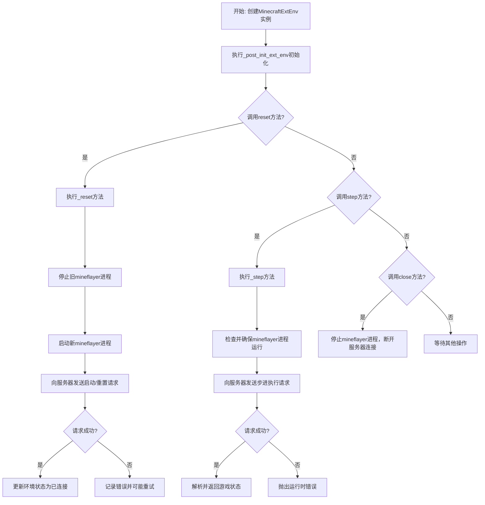

## 类结构

```
ExtEnv (MetaGPT基础环境类)
└── MinecraftExtEnv (Minecraft外部环境实现类)
```

## 全局变量及字段


### `logger`
    
全局日志记录器，用于记录Minecraft外部环境运行过程中的信息、警告和错误。

类型：`logging.Logger`
    


### `MinecraftExtEnv.model_config`
    
Pydantic模型配置，允许使用任意类型，用于定义MinecraftExtEnv类的验证和序列化行为。

类型：`pydantic.ConfigDict`
    


### `MinecraftExtEnv.mc_port`
    
Minecraft游戏服务器的端口号，用于连接实际的Minecraft游戏实例。

类型：`Optional[int]`
    


### `MinecraftExtEnv.server_host`
    
Mineflayer代理服务器的网络主机地址，默认为本地回环地址。

类型：`str`
    


### `MinecraftExtEnv.server_port`
    
Mineflayer代理服务器的端口号，用于与JavaScript桥接服务进行HTTP通信。

类型：`str`
    


### `MinecraftExtEnv.request_timeout`
    
向Mineflayer代理服务器发送HTTP请求时的超时时间（秒）。

类型：`int`
    


### `MinecraftExtEnv.mineflayer`
    
管理Mineflayer Node.js子进程的监控器，负责启动、停止和监控其运行状态。

类型：`Optional[SubprocessMonitor]`
    


### `MinecraftExtEnv.has_reset`
    
标志位，指示Minecraft环境是否已经执行过初始重置（reset）操作。

类型：`bool`
    


### `MinecraftExtEnv.reset_options`
    
存储上一次重置环境时使用的配置选项，用于在后续步骤中维持状态一致性。

类型：`Optional[dict]`
    


### `MinecraftExtEnv.connected`
    
标志位，指示当前是否已成功连接到Mineflayer代理服务器。

类型：`bool`
    


### `MinecraftExtEnv.server_paused`
    
标志位，指示Mineflayer代理服务器当前是否处于暂停（游戏时间停止）状态。

类型：`bool`
    


### `MinecraftExtEnv.warm_up`
    
存储环境热身（warm-up）阶段的配置参数，用于初始化课程学习或任务执行的初始条件。

类型：`dict`
    
    

## 全局函数及方法

### `MinecraftExtEnv.reset`

该方法用于重置Minecraft外部环境，包括停止当前Mineflayer进程、重新启动并连接到Minecraft服务器，以及根据提供的选项配置环境状态。重置后，环境将处于暂停状态，等待后续操作。

参数：

- `seed`：`Optional[int]`，可选参数，用于设置环境的随机种子，当前实现中未使用。
- `options`：`Optional[dict[str, Any]]`，可选参数，包含重置配置的字典，如模式（hard/soft）、库存、装备等。

返回值：`tuple[dict[str, Any], dict[str, Any]]`，返回一个元组，包含两个字典。第一个字典为观察状态，第二个字典为重置后的环境信息（如配置选项）。当前实现中，该方法仅定义了接口，具体逻辑在`_reset`方法中实现。

#### 流程图

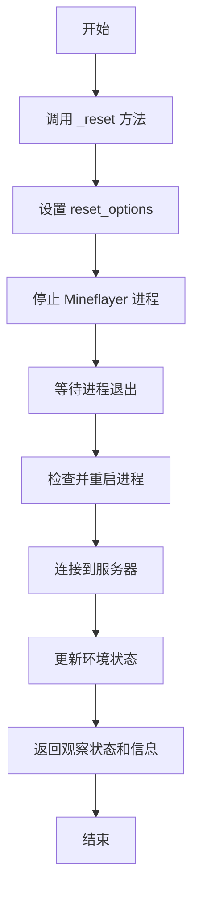

#### 带注释源码

```python
def reset(
    self,
    *,
    seed: Optional[int] = None,
    options: Optional[dict[str, Any]] = None,
) -> tuple[dict[str, Any], dict[str, Any]]:
    pass  # 具体实现在 _reset 方法中
```


### `MinecraftExtEnv.observe`

该方法用于从Minecraft游戏环境中获取观察数据。它接收一个可选的观察参数对象，并返回环境的状态信息。当前实现中，该方法仅是一个占位符，具体逻辑需要根据实际需求进行填充。

参数：

-  `obs_params`：`Optional[BaseEnvObsParams]`，可选的观察参数，用于指定获取观察数据时的特定条件或过滤选项。

返回值：`Any`，返回从Minecraft环境中获取的观察数据，具体类型和结构取决于实际实现。

#### 流程图

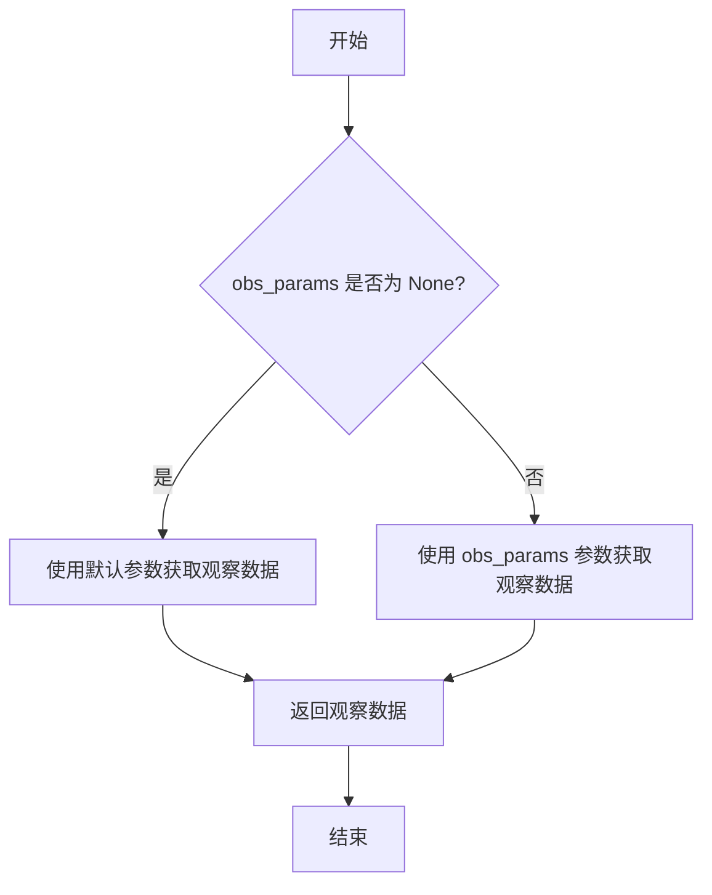

#### 带注释源码

```python
def observe(self, obs_params: Optional[BaseEnvObsParams] = None) -> Any:
    """
    从Minecraft游戏环境中获取观察数据。

    该方法根据提供的观察参数（如果有）从环境中获取当前状态信息。
    如果未提供参数，则使用默认设置获取观察数据。

    Args:
        obs_params (Optional[BaseEnvObsParams]): 可选的观察参数，用于指定获取观察数据时的特定条件或过滤选项。

    Returns:
        Any: 返回从Minecraft环境中获取的观察数据，具体类型和结构取决于实际实现。
    """
    pass  # 占位符，具体实现需要根据实际需求填充
```


### `MinecraftExtEnv.step`

该方法用于在 Minecraft 外部环境中执行一步操作。它接收一个动作（通常包含要执行的代码），将其发送到 Minecraft 服务器，并返回执行结果。该方法会确保环境已重置，检查并维护必要的进程连接，并在执行前后管理服务器的暂停状态以控制游戏时间流。

参数：

-  `action`：`BaseEnvAction`，包含要执行的动作信息，通常封装了代码指令。

返回值：`tuple[dict[str, Any], float, bool, bool, dict[str, Any]]`，返回一个标准的环境步进结果元组，包含：观察状态字典、奖励值、是否终止的标志、是否截断的标志以及额外的信息字典。

#### 流程图

```mermaid
flowchart TD
    A[开始: step(action)] --> B{环境是否已重置?<br>self.has_reset == True?}
    B -- 否 --> C[抛出 RuntimeError]
    B -- 是 --> D[调用 check_process<br>确保 mineflayer 进程运行]
    D --> E[调用 unpause<br>恢复服务器运行]
    E --> F[构造请求数据<br>包含代码和程序]
    F --> G[发送 POST 请求到 /step 端点]
    G --> H{请求状态码 == 200?}
    H -- 否 --> I[抛出 RuntimeError]
    H -- 是 --> J[解析返回的 JSON 数据]
    J --> K[调用 pause<br>暂停服务器]
    K --> L[返回解析后的数据]
    L --> M[结束]
```

#### 带注释源码

```python
@mark_as_writeable
def _step(self, code: str, programs: str = "") -> dict:
    """
    执行一步操作的核心方法。
    参数:
        code (str): 要执行的代码字符串。
        programs (str): 附加的程序信息，默认为空字符串。
    返回:
        dict: 从服务器返回的 JSON 响应解析后的字典。
    """
    # 1. 环境状态检查：确保在调用 step 之前已经调用了 reset
    if not self.has_reset:
        raise RuntimeError("Environment has not been reset yet")
    
    # 2. 进程健康检查：确保与 Minecraft 通信的 Node.js 进程 (mineflayer) 正在运行
    self.check_process()
    
    # 3. 恢复游戏时间：在发送指令前，确保游戏世界不是暂停状态
    self.unpause()
    
    # 4. 准备请求数据：将代码和程序信息封装成字典
    data = {
        "code": code,
        "programs": programs,
    }
    
    # 5. 发送执行请求：向本地代理服务器发送 POST 请求，请求执行代码
    res = requests.post(f"{self.server}/step", json=data, timeout=self.request_timeout)
    
    # 6. 处理请求失败：如果服务器返回非 200 状态码，抛出异常
    if res.status_code != 200:
        raise RuntimeError("Failed to step Minecraft server")
    
    # 7. 解析响应：服务器返回的是 JSON 字符串，需要解析为 Python 字典
    returned_data = res.json()
    
    # 8. 暂停游戏时间：执行完毕后暂停游戏，等待下一次指令，以进行同步控制
    self.pause()
    
    # 9. 返回结果：将解析后的字典返回给调用者
    return json.loads(returned_data)
```


### `MinecraftExtEnv.server`

这是一个只读属性（property），用于获取Minecraft服务器的完整地址。它通过拼接`server_host`和`server_port`两个实例字段，返回一个表示服务器URL的字符串。

参数：无

返回值：`str`，由`server_host`和`server_port`拼接而成的服务器地址字符串，格式为`{host}:{port}`。

#### 流程图

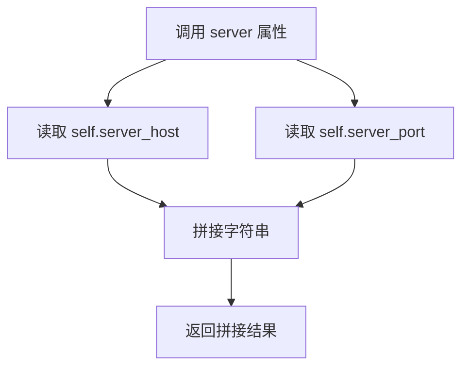

#### 带注释源码

```python
    @property
    def server(self) -> str:
        # 将服务器主机地址和端口号拼接成一个完整的服务器地址字符串
        return f"{self.server_host}:{self.server_port}"
```


### `MinecraftExtEnv._post_init_ext_env`

该方法是一个Pydantic模型验证器，在`MinecraftExtEnv`类实例初始化后自动调用。其核心功能是执行必要的初始化工作，包括：1) 如果`mineflayer`进程监控器未初始化，则创建并启动它；2) 如果`warm_up`字典为空，则使用默认值填充并设置一些初始状态；3) 创建用于存储检查点数据的目录结构。

参数：
-  `self`：`MinecraftExtEnv`，当前`MinecraftExtEnv`类的实例

返回值：`MinecraftExtEnv`，返回初始化后的`MinecraftExtEnv`实例本身。

#### 流程图

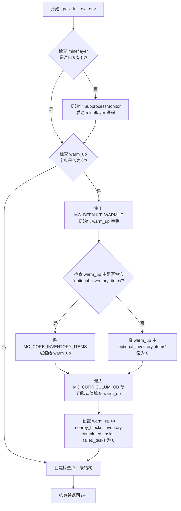

#### 带注释源码

```
    @model_validator(mode="after")  # 这是一个Pydantic模型验证器，在模型实例化后运行
    def _post_init_ext_env(self):
        # 1. 初始化 mineflayer 进程监控器
        if not self.mineflayer:  # 如果 mineflayer 属性为 None
            self.mineflayer = SubprocessMonitor(  # 创建 SubprocessMonitor 实例
                commands=[  # 指定要运行的命令及其参数
                    "node",  # 使用 Node.js 运行
                    METAGPT_ROOT.joinpath("metagpt", "environment", "minecraft", "mineflayer", "index.js"),  # 要运行的 JavaScript 文件路径
                    str(self.server_port),  # 将服务器端口作为参数传递
                ],
                name="mineflayer",  # 进程名称
                ready_match=r"Server started on port (\d+)",  # 用于判断进程是否就绪的正则表达式
            )
        # 2. 初始化 warm_up 配置字典
        if not self.warm_up:  # 如果 warm_up 字典为空
            warm_up = MC_DEFAULT_WARMUP  # 获取默认的 warm_up 配置
            if "optional_inventory_items" in warm_up:  # 如果默认配置中包含 'optional_inventory_items' 键
                assert MC_CORE_INVENTORY_ITEMS is not None  # 确保核心物品列表常量已定义
                # self.core_inv_items_regex = re.compile(MC_CORE_INVENTORY_ITEMS)  # 注释掉的代码：可能用于编译正则表达式
                self.warm_up["optional_inventory_items"] = warm_up["optional_inventory_items"]  # 使用默认值
            else:  # 如果默认配置中不包含 'optional_inventory_items'
                self.warm_up["optional_inventory_items"] = 0  # 将其设置为 0
            # 遍历课程观察键(MC_CURRICULUM_OB)，确保 warm_up 中包含这些键，并使用默认值或现有值
            for key in MC_CURRICULUM_OB:
                self.warm_up[key] = warm_up.get(key, MC_DEFAULT_WARMUP[key])
            # 设置一些初始观察值为 0
            self.warm_up["nearby_blocks"] = 0
            self.warm_up["inventory"] = 0
            self.warm_up["completed_tasks"] = 0
            self.warm_up["failed_tasks"] = 0

        # 3. 初始化检查点目录结构
        # 创建课程向量数据库目录
        MC_CKPT_DIR.joinpath("curriculum/vectordb").mkdir(parents=True, exist_ok=True)
        # 创建动作目录
        MC_CKPT_DIR.joinpath("action").mkdir(exist_ok=True)
        # 创建技能相关目录（代码、描述、向量数据库）
        MC_CKPT_DIR.joinpath("skill/code").mkdir(parents=True, exist_ok=True)
        MC_CKPT_DIR.joinpath("skill/description").mkdir(parents=True, exist_ok=True)
        MC_CKPT_DIR.joinpath("skill/vectordb").mkdir(exist_ok=True)
```


### `MinecraftExtEnv.set_mc_port`

该方法用于设置 Minecraft 游戏服务器的端口号。它接收一个整数参数，并将其赋值给类实例的 `mc_port` 字段，从而更新 Minecraft 服务器连接的目标端口。

参数：

-  `mc_port`：`int`，Minecraft 游戏服务器的端口号。

返回值：`None`，此方法不返回任何值。

#### 流程图

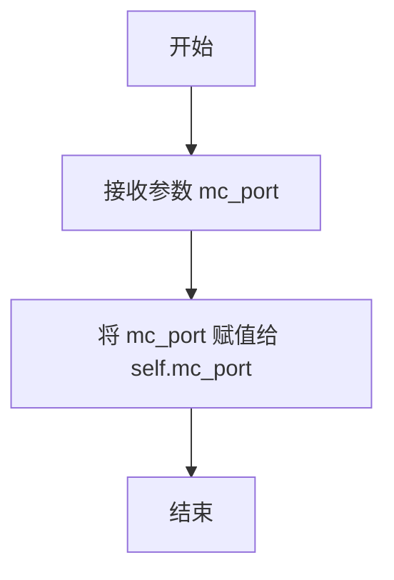

#### 带注释源码

```python
def set_mc_port(self, mc_port: int):
    # 将传入的 mc_port 参数赋值给实例变量 self.mc_port
    self.mc_port = mc_port
```


### `MinecraftExtEnv.close`

该方法用于关闭与Minecraft游戏服务器的连接，并停止相关的Mineflayer进程。首先，它会尝试取消服务器的暂停状态，然后向服务器发送停止请求以断开连接。接着，停止Mineflayer进程。最后，返回一个布尔值，表示连接是否已成功断开。

参数：

- 无

返回值：`bool`，表示连接是否已成功断开。如果连接已断开，返回`True`；否则返回`False`。

#### 流程图

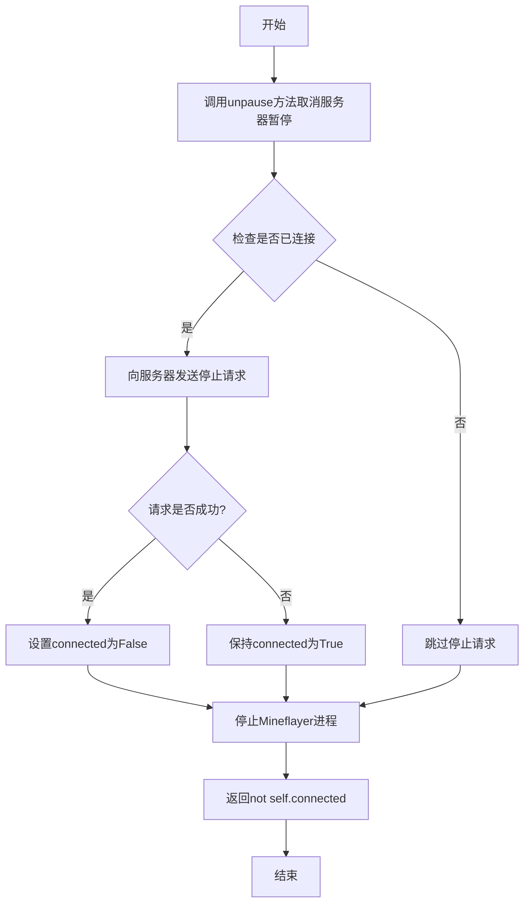

#### 带注释源码

```python
@mark_as_writeable
def close(self) -> bool:
    # 取消服务器的暂停状态
    self.unpause()
    
    # 如果当前已连接到服务器，则发送停止请求
    if self.connected:
        res = requests.post(f"{self.server}/stop")
        # 如果请求成功，将connected标记为False
        if res.status_code == 200:
            self.connected = False
    
    # 停止Mineflayer进程
    self.mineflayer.stop()
    
    # 返回连接是否已成功断开的状态
    return not self.connected
```


### `MinecraftExtEnv.check_process`

该方法用于检查和确保与Minecraft游戏交互的外部进程（`mineflayer`）处于运行状态。如果进程未运行，它会尝试重启进程并重新连接到Minecraft服务器。这是确保环境稳定性的关键健康检查步骤。

参数：
-  `self`：`MinecraftExtEnv`，当前MinecraftExtEnv实例的引用。

返回值：`dict`，当进程成功启动并连接到服务器后，返回服务器对`/start`请求的响应数据（JSON格式）。

#### 流程图

```mermaid
flowchart TD
    A[开始 check_process] --> B{进程 mineflayer 是否在运行?}
    B -- 是 --> C[返回服务器响应]
    B -- 否 --> D[记录日志: 进程已退出，正在重启]
    D --> E[调用 mineflayer.run() 重启进程]
    E --> F{进程是否启动成功?}
    F -- 否 --> G{重试次数 > 3?}
    G -- 是 --> H[记录错误日志并抛出异常]
    G -- 否 --> I[重试次数加1]
    I --> E
    F -- 是 --> J[记录进程启动成功的日志]
    J --> K[向服务器 /start 端点发送POST请求]
    K --> L{服务器响应状态码 == 200?}
    L -- 否 --> M[停止进程，记录错误日志并抛出异常]
    L -- 是 --> N[解析并返回服务器响应数据]
    N --> C
```

#### 带注释源码

```python
@mark_as_writeable
def check_process(self) -> dict:
    # 初始化重试计数器
    retry = 0
    # 循环检查，直到 mineflayer 进程处于运行状态
    while not self.mineflayer.is_running:
        # 记录进程已退出的日志信息
        logger.info("Mineflayer process has exited, restarting")
        # 尝试启动 mineflayer 进程
        self.mineflayer.run()
        # 再次检查进程是否成功启动
        if not self.mineflayer.is_running:
            # 如果启动失败且重试次数超过3次，则记录错误并抛出异常
            if retry > 3:
                logger.error("Mineflayer process failed to start")
                raise {}
            else:
                # 否则，增加重试次数并继续循环
                retry += 1
                continue
        # 进程启动成功，记录启动成功的日志（包含就绪信息）
        logger.info(self.mineflayer.ready_line)
        # 向 Minecraft 服务器发送启动请求，携带重置选项
        res = requests.post(
            f"{self.server}/start",
            json=self.reset_options,
            timeout=self.request_timeout,
        )
        # 检查服务器响应状态码
        if res.status_code != 200:
            # 如果响应非200，停止刚启动的进程，记录错误并抛出异常
            self.mineflayer.stop()
            logger.error(f"Minecraft server reply with code {res.status_code}")
            raise {}
        # 服务器响应成功，返回响应的JSON数据
        return res.json()
```


### `MinecraftExtEnv._reset`

该方法用于重置Minecraft外部环境。它根据提供的选项配置重置参数，停止并重启Mineflayer进程，与Minecraft服务器建立连接，并在重置后暂停服务器以等待后续指令。

参数：

- `seed`：`Optional[int]`，重置时使用的随机种子，当前实现中未使用。
- `options`：`Optional[dict]`，重置配置选项字典，包含模式、物品栏、装备等设置。

返回值：`dict`，包含服务器返回的、表示重置后初始环境状态的JSON数据。

#### 流程图

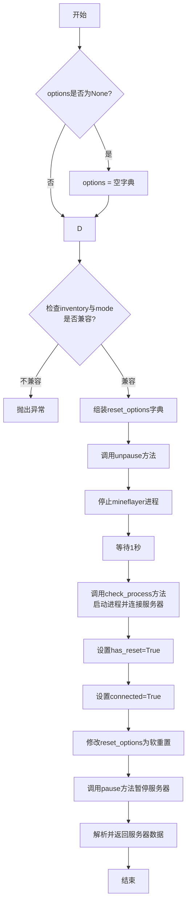

#### 带注释源码

```python
@mark_as_writeable
def _reset(self, *, seed=None, options=None) -> dict:
    # 1. 参数初始化：如果options为None，则初始化为空字典
    if options is None:
        options = {}
    # 2. 参数校验：如果options中指定了inventory，则模式必须为'hard'，否则抛出异常
    if options.get("inventory", {}) and options.get("mode", "hard") != "hard":
        logger.error("inventory can only be set when options is hard")
        raise {}

    # 3. 组装重置配置字典(reset_options)，整合实例属性(mc_port)和传入的options参数
    self.reset_options = {
        "port": self.mc_port,  # Minecraft服务器端口
        "reset": options.get("mode", "hard"),  # 重置模式，默认为'hard'
        "inventory": options.get("inventory", {}),  # 初始物品栏
        "equipment": options.get("equipment", []),  # 初始装备
        "spread": options.get("spread", False),  # 是否分散放置
        "waitTicks": options.get("wait_ticks", 5),  # 等待的游戏刻数
        "position": options.get("position", None),  # 初始位置
    }

    # 4. 环境准备：确保服务器未暂停，然后停止现有的Mineflayer进程并等待其退出
    self.unpause()
    self.mineflayer.stop()
    time.sleep(1)  # 等待mineflayer进程完全退出

    # 5. 进程检查与启动：调用check_process方法，该方法会重启Mineflayer进程并向服务器发送启动/重置请求
    returned_data = self.check_process()
    # 6. 状态更新：标记环境已重置并已连接到服务器
    self.has_reset = True
    self.connected = True
    # 7. 重置模式更新：将后续步骤中的重置模式改为'soft'（软重置），避免完全重启
    self.reset_options["reset"] = "soft"
    # 8. 环境暂停：暂停服务器，等待下一步指令
    self.pause()
    # 9. 返回结果：解析服务器返回的JSON数据并返回
    return json.loads(returned_data)
```


### `MinecraftExtEnv._step`

该方法用于向Minecraft服务器发送一个“步进”请求，执行给定的代码或程序，并返回服务器的响应结果。它确保环境已重置，检查相关进程状态，并在执行前后管理服务器的暂停状态以控制游戏时间流。

参数：

-  `code`：`str`，要发送给Minecraft服务器执行的代码字符串。
-  `programs`：`str`，要发送给Minecraft服务器执行的程序字符串，默认为空字符串。

返回值：`dict`，包含Minecraft服务器执行`code`和`programs`后返回的状态或结果数据。

#### 流程图

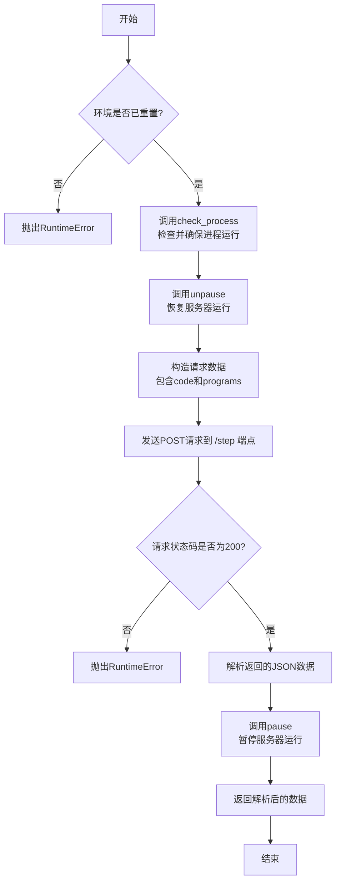

#### 带注释源码

```python
@mark_as_writeable
def _step(self, code: str, programs: str = "") -> dict:
    # 1. 前置检查：确保环境已经通过reset方法初始化
    if not self.has_reset:
        raise RuntimeError("Environment has not been reset yet")
    
    # 2. 进程健康检查：确保底层的mineflayer进程正在运行，必要时重启
    self.check_process()
    
    # 3. 恢复游戏时间：解除服务器的暂停状态，允许游戏内时间推进
    self.unpause()
    
    # 4. 准备请求数据：将代码和程序封装成字典
    data = {
        "code": code,
        "programs": programs,
    }
    
    # 5. 发送执行请求：向本地Minecraft服务端发送POST请求以执行代码
    res = requests.post(f"{self.server}/step", json=data, timeout=self.request_timeout)
    
    # 6. 响应状态检查：如果请求失败（非200状态码），抛出异常
    if res.status_code != 200:
        raise RuntimeError("Failed to step Minecraft server")
    
    # 7. 解析响应：从响应中获取JSON格式的返回数据
    returned_data = res.json()
    
    # 8. 暂停游戏时间：再次暂停服务器，冻结游戏状态，便于后续观察或决策
    self.pause()
    
    # 9. 返回结果：将JSON字符串解析为Python字典并返回
    return json.loads(returned_data)
```


### `MinecraftExtEnv.pause`

暂停 Minecraft 服务器端的游戏逻辑。该方法会向 Minecraft 服务器发送一个暂停请求，如果请求成功，则将内部状态 `server_paused` 标记为 `True`。

参数：
-  `self`：`MinecraftExtEnv`，MinecraftExtEnv 类的实例。

返回值：`bool`，表示服务器是否成功进入暂停状态。如果服务器进程正在运行且之前未暂停，并且暂停请求成功，则返回 `True`；否则返回 `False`。

#### 流程图

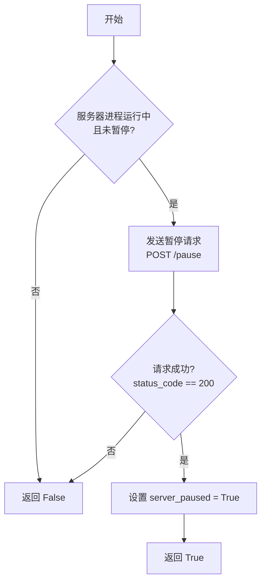

#### 带注释源码

```python
@mark_as_writeable  # 装饰器，标记该方法为可写操作，可能与环境状态管理相关
def pause(self) -> bool:
    # 检查前提条件：Mineflayer 代理进程正在运行，并且服务器当前未处于暂停状态
    if self.mineflayer.is_running and not self.server_paused:
        # 向 Minecraft 服务器发送 HTTP POST 请求，调用暂停接口
        res = requests.post(f"{self.server}/pause")
        # 如果服务器响应状态码为 200，表示请求成功
        if res.status_code == 200:
            # 更新内部状态，标记服务器已暂停
            self.server_paused = True
    # 返回当前的暂停状态。如果条件不满足或请求失败，则返回 False（因为 server_paused 初始为 False）
    # 如果请求成功，则返回 True
    return self.server_paused
```


### `MinecraftExtEnv.unpause`

该方法用于取消暂停Minecraft服务器。它会检查Minecraft代理进程（mineflayer）是否正在运行且服务器当前是否处于暂停状态，如果是，则向服务器发送一个暂停/取消暂停的请求。如果请求成功，它会更新内部状态`server_paused`为`False`，表示服务器已恢复运行。

参数：
-  `self`：`MinecraftExtEnv`，Minecraft外部环境实例自身。

返回值：`bool`，返回一个布尔值，表示操作后服务器的暂停状态。如果服务器成功取消暂停或无需操作，则返回`False`；如果操作失败（例如请求未返回200状态码），则返回`True`（因为`server_paused`字段未被修改）。

#### 流程图

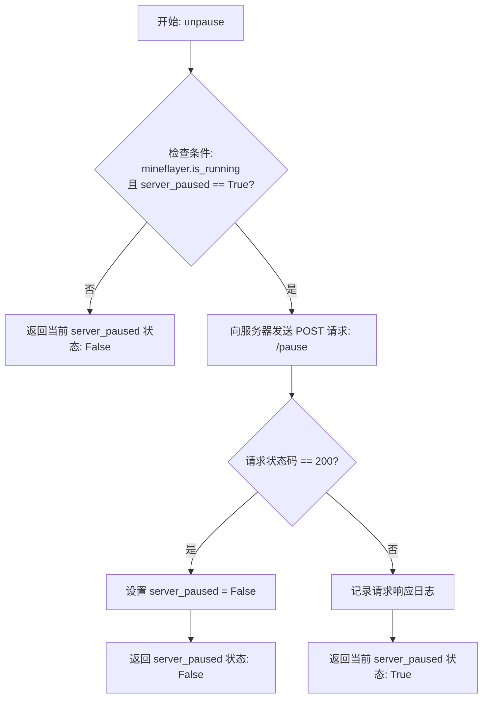

#### 带注释源码

```
    @mark_as_writeable  # 装饰器，标记该方法为可写操作，可能涉及环境状态变更
    def unpause(self) -> bool:
        # 条件判断：仅当mineflayer进程正在运行且服务器当前被标记为暂停状态时，才执行取消暂停操作
        if self.mineflayer.is_running and self.server_paused:
            # 向Minecraft服务器管理接口发送POST请求，'/pause'端点用于切换暂停/继续状态
            res = requests.post(f"{self.server}/pause")
            # 检查HTTP响应状态码，200表示请求成功处理
            if res.status_code == 200:
                # 请求成功，更新内部状态，表示服务器已取消暂停
                self.server_paused = False
            else:
                # 请求失败，记录服务器返回的响应信息（用于调试）
                logger.info(f"mineflayer pause result: {res.json()}")
        # 返回服务器当前的暂停状态。
        # 如果执行了取消暂停且成功，返回False。
        # 如果未执行操作（条件不满足）或操作失败（状态码非200），则返回self.server_paused的当前值。
        # 在失败情况下，由于未执行`self.server_paused = False`，所以返回的仍是原来的True。
        return self.server_paused
```


## 关键组件


### Minecraft 外部环境集成

`MinecraftExtEnv` 类作为 MetaGPT 框架与 Minecraft 游戏服务器之间的桥梁，负责启动、管理 Node.js 端的 Mineflayer 代理进程，并通过 HTTP API 与游戏服务器进行通信，以执行环境重置、动作执行（代码注入）、暂停/继续等核心控制功能。

### 子进程监控与管理

`SubprocessMonitor` 组件（通过 `mineflayer` 字段引入）用于启动和监控运行 Mineflayer 代理的 Node.js 子进程。它确保代理进程在异常退出时能够自动重启，并通过正则表达式匹配启动日志来判断进程是否就绪，为环境提供稳定的底层连接服务。

### HTTP API 客户端

通过 `requests` 库向本地运行的 Minecraft 游戏服务器（地址为 `server_host:server_port`）发送 HTTP 请求，实现了 `/start`、`/stop`、`/step`、`/pause` 等接口的调用。这是环境执行具体游戏动作（如移动、交互）和获取状态信息的主要通道。

### 环境状态与配置管理

管理 Minecraft 环境的运行状态，包括连接状态 (`connected`)、服务器暂停状态 (`server_paused`)、重置选项 (`reset_options`) 和热身配置 (`warm_up`)。它负责在 `_post_init_ext_env` 方法中初始化这些状态和必要的文件目录结构，确保环境具备正确的初始条件。

### 检查点目录初始化

在环境初始化时，根据 `MC_CKPT_DIR` 常量定义的路径，自动创建用于存储课程学习、动作、技能代码、技能描述和向量数据库的系列子目录。这为后续的持久化学习与技能管理提供了必要的文件系统结构。


## 问题及建议


### 已知问题

-   **关键方法未实现**：类 `MinecraftExtEnv` 中的核心方法 `reset`、`observe` 和 `step` 仅定义了函数签名，内部实现为 `pass`。这导致该类无法作为完整的环境接口使用，调用这些方法会直接导致功能缺失或错误。
-   **异常处理不完善**：在 `check_process` 方法中，当进程启动失败时，使用 `raise {}` 抛出一个空字典，这不是有效的异常对象，会导致程序崩溃且错误信息不明确。同样，在 `_reset` 方法中，遇到错误时也使用了 `raise {}`。
-   **硬编码与配置灵活性不足**：服务器地址（`server_host`）、端口（`server_port`）以及请求超时时间（`request_timeout`）虽然可通过字段设置，但初始化逻辑（如 `_post_init_ext_env` 中启动 `mineflayer` 的命令）和部分配置（如 `MC_DEFAULT_WARMUP`）存在硬编码，限制了部署和配置的灵活性。
-   **资源管理风险**：`close` 方法尝试停止 `mineflayer` 进程，但 `_reset` 方法中会先调用 `self.mineflayer.stop()`，然后立即调用 `self.check_process()` 来重启它。这种“先停止再检查重启”的逻辑在异常情况下可能导致进程未正确清理或产生僵尸进程。`time.sleep(1)` 是一种脆弱的同步方式。
-   **状态管理潜在不一致**：`has_reset`、`connected`、`server_paused` 等状态标志的管理分散在多个方法中（如 `_reset`、`_step`、`pause`、`unpause`、`close`）。在复杂的异步或异常场景下，可能难以保证这些状态与后端 Minecraft 服务器实际状态的一致性。
-   **代码健壮性待加强**：`_step` 方法中，如果 `has_reset` 为 False，会抛出 `RuntimeError`，但错误信息较为通用。网络请求（`requests.post`）失败后仅检查状态码，未对连接超时、DNS解析失败等网络层异常进行捕获和处理。

### 优化建议

-   **实现核心抽象方法**：应完整实现从父类 `ExtEnv` 继承的 `reset`、`observe` 和 `step` 方法。`reset` 可包装 `_reset`，`step` 可包装 `_step`，并处理奖励、终止标志等信息。`observe` 方法应实现从环境获取观察值的逻辑。
-   **规范异常处理**：将 `raise {}` 替换为抛出具体的、带有描述性信息的异常类型，例如 `RuntimeError(“Failed to start Mineflayer process after multiple retries”)` 或自定义异常。对 `requests` 调用添加更全面的 `try-except` 块，捕获 `requests.exceptions.RequestException` 等异常。
-   **增强配置化与可扩展性**：考虑将 `mineflayer` 的启动命令、`MC_DEFAULT_WARMUP` 的默认值等通过配置文件或类参数注入，提高环境在不同部署场景下的适应性。使用 `Path` 对象管理路径时，确保其跨平台兼容性。
-   **改进进程与资源管理**：重构进程生命周期管理逻辑。确保 `stop` 和 `start` 操作是幂等的。考虑使用更可靠的进程健康检查机制，替代或补充 `time.sleep`。在 `close` 方法中，确保所有资源（如网络连接、子进程）都被正确清理。
-   **强化状态机与契约**：明确各个状态标志（`has_reset`, `connected`, `server_paused`）的转换条件和依赖关系，可以考虑引入一个集中的状态管理机制或状态机，并在关键方法开始时进行前置状态校验。
-   **提升代码可读性与维护性**：为关键方法添加更详细的文档字符串（Docstring），说明其作用、参数、返回值及可能抛出的异常。将一些魔术数字（如重试次数3）定义为类常量。考虑将 `_reset` 和 `_step` 中的 JSON 数据处理和请求构造提取为独立的小函数，以简化主逻辑。
-   **增加日志与监控**：在关键状态变更、网络请求发起和完成时，增加不同级别的日志输出（DEBUG、INFO、WARNING），便于调试和运行时监控。特别是对于长时间运行的 `step` 操作，记录其耗时。
-   **考虑异步与非阻塞设计**：当前 `_step` 方法是同步阻塞的，直到收到服务器响应。对于需要高性能或并发交互的场景，可以考虑使用异步 HTTP 客户端（如 `aiohttp`）实现非阻塞的请求，但需同步调整整个接口和调用链。


## 其它


### 设计目标与约束

该代码旨在构建一个与Minecraft游戏集成的外部环境（`MinecraftExtEnv`），作为智能体（如Voyager）与Minecraft游戏世界交互的桥梁。其核心设计目标包括：
1.  **环境抽象**：继承`ExtEnv`基类，提供标准的`reset`、`step`、`observe`接口，以便上层强化学习或规划算法使用。
2.  **进程管理**：通过`SubprocessMonitor`启动并监控一个Node.js服务（mineflayer），该服务作为与Minecraft游戏客户端通信的实际后端。
3.  **状态同步**：管理环境状态（如是否已重置`has_reset`、是否连接`connected`、服务器是否暂停`server_paused`），确保外部调用与游戏内部状态的一致性。
4.  **容错与重试**：在`check_process`方法中实现进程崩溃后的自动重启机制，提高系统鲁棒性。
5.  **配置与初始化**：通过Pydantic模型验证器`_post_init_ext_env`完成环境预热配置（`warm_up`）和必要的检查点目录初始化。

主要约束包括：
1.  **依赖外部服务**：必须依赖本地运行的Minecraft Java版游戏客户端以及通过`mineflayer`启动的Node.js HTTP服务。
2.  **网络通信**：所有游戏指令和状态获取均通过HTTP请求（`requests`库）与本地`mineflayer`服务交互，存在网络延迟和单点故障风险。
3.  **同步阻塞**：`_step`和`_reset`中的HTTP请求是同步且可能耗时的（`request_timeout`默认600秒），会阻塞调用线程。
4.  **平台与版本**：功能正确性依赖于特定版本的Minecraft游戏、Minecraft Java版客户端、Node.js环境及`mineflayer`库。

### 错误处理与异常设计

代码中的错误处理主要围绕HTTP请求响应状态、子进程状态以及环境状态逻辑展开：
1.  **HTTP请求错误**：在`close`、`check_process`、`_reset`、`_step`、`pause`、`unpause`方法中，通过检查`res.status_code != 200`来判断请求是否成功。失败时，通常记录错误日志并抛出异常（如`raise {}`或`raise RuntimeError`），但`close`和`pause`/`unpause`方法在失败时仅返回`False`或当前状态，未向外抛出异常，这可能使上层调用者无法感知部分失败。
2.  **进程状态错误**：`check_process`方法负责监控`mineflayer`子进程。如果进程未运行，它会尝试重启。重启失败超过3次后，会记录错误并抛出异常（`raise {}`）。这里抛出的空字典`{}`作为异常对象不符合Python惯例，应使用更具体的异常类型（如`RuntimeError`或自定义异常）。
3.  **环境状态逻辑错误**：
    *   `_reset`方法中，对`options`参数进行了逻辑校验（如`inventory`只能在`mode`为`"hard"`时设置），校验失败时抛出异常。
    *   `_step`方法在执行前检查`has_reset`标志，确保环境已初始化，否则抛出`RuntimeError`。
4.  **异常传播**：大部分关键操作（如重置、执行步骤）中的异常会向上抛出，旨在由环境调用者捕获和处理。然而，`close`方法中的异常被吞没（仅返回布尔值），且`check_process`中不规范的异常抛出方式，可能使得错误处理链条不清晰。
5.  **建议改进**：定义自定义异常类（如`MinecraftEnvError`、`MinecraftServerError`），统一错误类型；确保所有可能失败的操作都有清晰的异常抛出或返回值约定；在`check_process`中使用标准的异常。

### 数据流与状态机

该环境的核心数据流和状态转换如下：
1.  **主要数据流**：
    *   **指令下发**：上层智能体通过`step(action)`方法（最终调用`_step`）将代码指令`code`和程序`programs`通过HTTP POST请求发送至`mineflayer`服务（`{server}/step`）。
    *   **状态获取**：`mineflayer`服务执行指令后，将游戏状态（如玩家位置、背包、附近方块等）封装为JSON数据，通过HTTP响应返回给`_step`方法，并最终应通过`observe`方法（当前为空实现）提供给上层。
    *   **环境重置**：`reset`方法（最终调用`_reset`）通过HTTP POST请求（`{server}/start`）向`mineflayer`服务发送重置配置（`reset_options`），包括游戏模式、初始物品、出生点等，以初始化或重置游戏世界。
2.  **关键内部状态及其转换**：
    *   `has_reset`：标志环境是否已完成首次重置。由`False` -> `True`（在`_reset`成功完成后设置）。此状态用于阻止在未重置前执行`_step`。
    *   `connected`：标志是否已成功连接到Minecraft服务器（通过`mineflayer`服务）。由`False` -> `True`（在`_reset`中的`check_process`成功后设置）；由`True` -> `False`（在`close`方法成功停止服务器后设置）。
    *   `server_paused`：标志游戏服务器是否处于暂停状态。通过`pause`和`unpause`方法切换，并用于控制`_step`和`_reset`前后游戏的时间流逝。
    *   `mineflayer.is_running`：监控子进程的运行状态，是许多操作（如`pause`、`unpause`、`check_process`）的前提条件。
3.  **状态机简述**：环境生命周期可大致描述为：**未初始化** -> (`reset`成功) -> **已连接且暂停** -> (`step`循环: 暂停 -> 执行 -> 暂停) -> (`close`) -> **已断开**。`check_process`方法负责维持`mineflayer`子进程的**运行**状态，在其退出时尝试重启以恢复**已连接**状态。

### 外部依赖与接口契约

1.  **外部依赖**：
    *   **Minecraft Java Edition Client**：必须在本地运行，并且监听着`mc_port`指定的端口。这是所有游戏交互的最终目标。
    *   **Node.js 服务 (`mineflayer/index.js`)**：一个自定义的Node.js应用，使用`mineflayer`库连接Minecraft客户端，并暴露HTTP API供本Python环境调用。它负责翻译HTTP请求为Minecraft游戏指令，并收集游戏状态。
    *   **Python 第三方库**：`requests`（HTTP客户端）、`pydantic`（数据验证与设置管理）。
    *   **项目内部模块**：`metagpt.base.base_env_space`、`metagpt.environment.base_env`、`metagpt.environment.minecraft.const`、`metagpt.environment.minecraft.process_monitor`、`metagpt.logs`。

2.  **接口契约**：
    *   **与`mineflayer` HTTP服务的契约**：
        *   服务根地址：`{server_host}:{server_port}`（默认`http://127.0.0.1:3000`）。
        *   `POST /start`：用于重置/启动环境。请求体为`reset_options`字典。期望返回200状态码及包含初始状态信息的JSON。
        *   `POST /step`：用于执行一步操作。请求体为`{"code": str, "programs": str}`。期望返回200状态码及包含步骤结果（新状态、奖励、完成标志等）的JSON。
        *   `POST /pause` 与 `POST /unpause`：用于暂停/恢复游戏时间。本代码中均使用`/pause`端点，依靠服务端状态切换。期望返回200状态码。
        *   `POST /stop`：用于停止服务。期望返回200状态码。
        *   所有端点均应在请求失败时返回非200状态码。
    *   **与上层框架 (`ExtEnv`) 的契约**：需实现`reset`, `step`, `observe`, `close`等抽象方法。当前`observe`和`step`（顶层）为空实现，`reset`（顶层）仅声明，实际功能在`_reset`和`_step`中，这可能导致接口不完整或混淆。
    *   **配置契约**：依赖`metagpt.environment.minecraft.const`模块中定义的常量，如`MC_DEFAULT_WARMUP`、`MC_CURRICULUM_OB`、`MC_CKPT_DIR`等，用于初始化`warm_up`字典和创建目录结构。

    