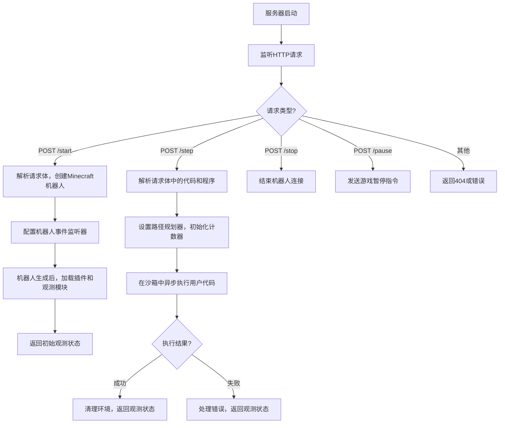
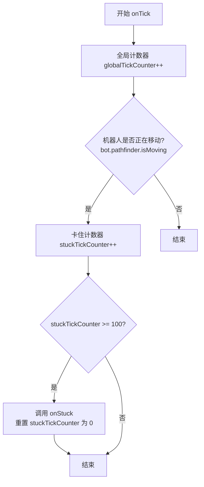
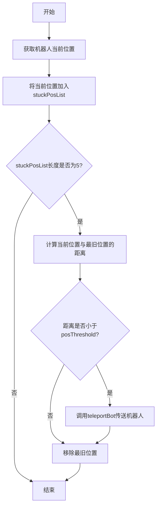
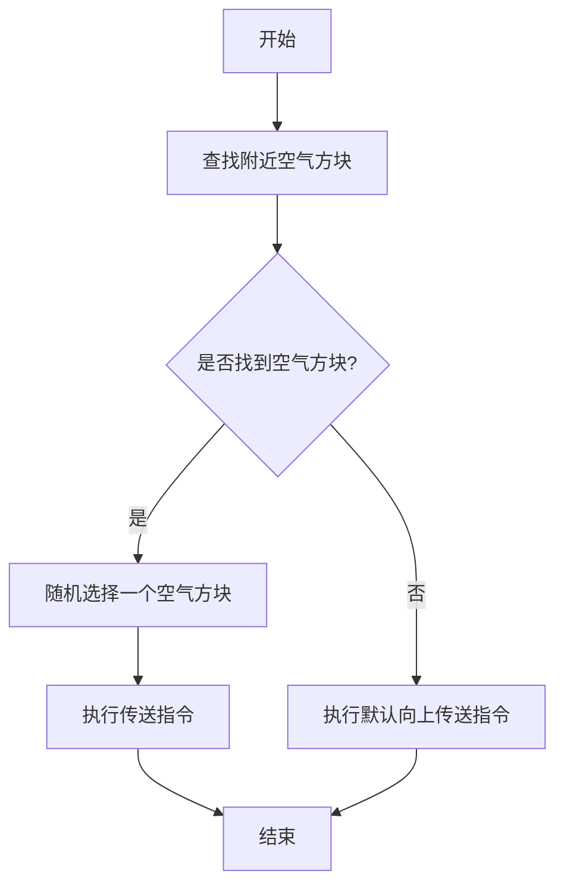
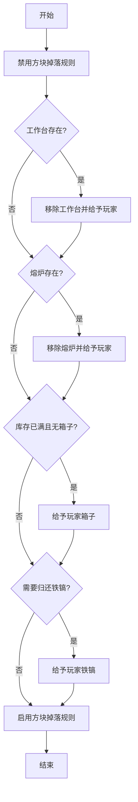

# `.\MetaGPT\metagpt\environment\minecraft\mineflayer\index.js` 详细设计文档

该代码实现了一个基于Express.js的HTTP服务器，用于远程控制一个Minecraft机器人（bot）。它通过RESTful API接收指令，启动、停止、暂停机器人，并执行用户提供的代码来控制机器人在游戏中的行为（如移动、采集、合成等）。核心功能是作为一个游戏AI的远程执行环境，将高级指令转化为具体的游戏内操作。

## 整体流程



## 类结构

```
全局作用域
├── 全局变量: bot, app
├── 外部模块导入: fs, express, body-parser, mineflayer等
├── Express应用路由处理器
│   ├── POST /start
│   ├── POST /step
│   │   ├── 内部函数: otherError, onTick, onStuck, teleportBot, returnItems, handleError, evaluateCode
│   ├── POST /stop
│   └── POST /pause
└── 服务器监听
```

## 全局变量及字段


### `bot`
    
Minecraft 机器人的主实例，用于控制游戏内角色和监听游戏事件，初始为 null 表示未启动

类型：`mineflayer.Bot | null`
    


### `app`
    
Express.js 应用实例，用于处理 HTTP 请求和响应

类型：`express.Application`
    


### `DEFAULT_PORT`
    
HTTP 服务器的默认监听端口，值为 3000

类型：`number`
    


### `PORT`
    
HTTP 服务器的实际监听端口，可通过命令行参数覆盖默认值

类型：`string | number`
    


    

## 全局函数及方法

### `onConnectionFailed`

`onConnectionFailed` 是一个在 `/start` 路由处理函数中定义的内部函数，用于处理 Minecraft 机器人（bot）在初始连接服务器时发生的错误。当连接失败时，它会记录错误信息，清理 `bot` 实例，并向客户端返回一个包含错误详情的 400 状态响应。

参数：
- `e`：`Error` 或 `string`，连接失败时抛出的错误对象或错误信息。

返回值：`void`，此函数不返回任何值。

#### 流程图

```mermaid
flowchart TD
    A[开始: onConnectionFailed(e)] --> B[打印错误信息到控制台]
    B --> C[将全局 bot 变量设为 null]
    C --> D[向客户端发送 400 状态码及错误详情]
    D --> E[结束]
```

#### 带注释源码

```javascript
// 定义在 /start 路由的 POST 请求处理函数内部
function onConnectionFailed(e) {
    // 将错误信息输出到服务器控制台，便于调试
    console.log(e);
    // 清理全局 bot 变量，防止后续操作引用一个无效的 bot 实例
    bot = null;
    // 使用 Express 的响应对象，向发起 /start 请求的客户端返回 HTTP 400 状态码
    // 并将错误对象 e 以 JSON 格式返回，通知客户端连接失败
    res.status(400).json({ error: e });
}
```

### `onDisconnect`

`onDisconnect` 是一个全局函数，用于处理 Minecraft 机器人的断开连接事件。当机器人被踢出服务器或需要主动结束时，该函数负责清理资源（如关闭可视化查看器）并重置机器人实例。

参数：

- `message`：`string`，断开连接的原因或消息，用于日志记录。

返回值：`void`，无返回值。

#### 流程图

```mermaid
flowchart TD
    A[开始: onDisconnect(message)] --> B{bot.viewer 存在?};
    B -- 是 --> C[关闭 bot.viewer];
    B -- 否 --> D;
    C --> D[结束 bot 连接];
    D --> E[打印断开消息];
    E --> F[重置 bot 为 null];
    F --> G[结束];
```

#### 带注释源码

```javascript
function onDisconnect(message) {
    // 如果机器人有可视化查看器（viewer），则关闭它以释放资源
    if (bot.viewer) {
        bot.viewer.close();
    }
    // 结束机器人的连接
    bot.end();
    // 在控制台打印断开连接的消息，便于调试和日志记录
    console.log(message);
    // 将全局 bot 变量重置为 null，表示当前没有活动的机器人实例
    bot = null;
}
```

### `otherError`

`otherError` 是一个用于处理未捕获异常的回调函数。当在 `/step` 路由的处理过程中发生未捕获的异常时，此函数会被触发。它的主要功能是记录错误信息，通过机器人实例触发一个自定义的 `error` 事件，并在等待一定数量的游戏刻后，如果尚未发送响应，则发送一个包含机器人当前观察状态的 JSON 响应。

参数：

- `err`：`Error`，表示发生的未捕获异常对象。

返回值：`undefined`，此函数不返回任何值。

#### 流程图

```mermaid
flowchart TD
    A[开始: otherError(err)] --> B[打印“Uncaught Error”到控制台]
    B --> C[通过bot.emit触发'error'事件<br>并传递处理后的错误信息]
    C --> D[等待bot.waitTicks个游戏刻]
    D --> E{检查response_sent是否为false?}
    E -- 是 --> F[将response_sent标记为true]
    F --> G[发送bot.observe()的结果作为JSON响应]
    E -- 否 --> H[结束]
    G --> H
```

#### 带注释源码

```javascript
function otherError(err) {
    // 1. 在控制台打印错误标识
    console.log("Uncaught Error");
    
    // 2. 将错误对象通过handleError函数处理，然后作为'error'事件触发
    //    这允许其他监听'error'事件的代码（如OnError观察器）进行响应。
    bot.emit("error", handleError(err));
    
    // 3. 等待指定的游戏刻数（bot.waitTicks），这通常是为了让游戏状态稳定下来。
    bot.waitForTicks(bot.waitTicks).then(() => {
        // 4. 检查是否已经发送过响应（通过response_sent标志位）。
        //    这是为了防止在异步操作中多次发送响应。
        if (!response_sent) {
            // 5. 将标志位设为true，标记响应已发送。
            response_sent = true;
            // 6. 发送机器人当前观察到的状态作为JSON响应。
            res.json(bot.observe());
        }
    });
}
```

### `onTick`

`onTick` 函数是 `/step` 端点中定义的一个事件处理函数，它被注册为 `bot` 对象的 `"physicTick"` 事件的监听器。该函数的主要功能是监控机器人的移动状态，并在检测到机器人可能被卡住时触发处理逻辑。它通过跟踪全局和卡住计数器，并在机器人持续移动但位置变化极小时，调用 `onStuck` 函数尝试解除卡住状态。

参数：
- 无显式参数。作为事件监听器，它接收由 `mineflayer` 框架在每次物理引擎 tick 时自动触发的事件对象（通常为空或包含内部数据）。

返回值：`undefined`，该函数不返回任何值，其作用是通过副作用（更新计数器和可能触发解卡逻辑）来影响程序状态。

#### 流程图



#### 带注释源码

```javascript
// 定义 onTick 函数，作为 'physicTick' 事件监听器
function onTick() {
    // 每次物理 tick，全局计数器加1，用于跟踪总 tick 数
    bot.globalTickCounter++;
    
    // 检查机器人当前是否正在通过路径查找器移动
    if (bot.pathfinder.isMoving()) {
        // 如果正在移动，则增加“卡住”计数器
        bot.stuckTickCounter++;
        
        // 如果连续移动了100个tick（可能意味着在原地踏步或移动极慢）
        if (bot.stuckTickCounter >= 100) {
            // 调用 onStuck 函数尝试解决卡住问题，传入位置阈值参数 1.5
            onStuck(1.5);
            // 重置卡住计数器，准备下一轮检测
            bot.stuckTickCounter = 0;
        }
    }
}
```

### `onStuck`

`onStuck` 函数用于检测机器人是否卡住。它通过记录机器人最近的位置，并计算这些位置之间的距离变化来判断机器人是否在移动。如果机器人在一段时间内移动距离小于设定的阈值，则认为机器人卡住，并触发传送函数。

参数：

- `posThreshold`：`number`，位置阈值，用于判断机器人是否卡住的距离阈值。

返回值：`void`，无返回值。

#### 流程图



#### 带注释源码

```javascript
function onStuck(posThreshold) {
    // 获取机器人当前的位置
    const currentPos = bot.entity.position;
    // 将当前位置添加到stuckPosList数组中
    bot.stuckPosList.push(currentPos);

    // 检查stuckPosList数组是否已满（长度为5）
    if (bot.stuckPosList.length === 5) {
        // 获取数组中最旧的位置
        const oldestPos = bot.stuckPosList[0];
        // 计算当前位置与最旧位置之间的欧几里得距离
        const posDifference = currentPos.distanceTo(oldestPos);

        // 如果距离小于设定的阈值，则认为机器人卡住
        if (posDifference < posThreshold) {
            teleportBot(); // 调用传送函数，将机器人传送到随机位置
        }

        // 移除数组中最旧的位置，保持数组长度为4，为下一次记录做准备
        bot.stuckPosList.shift();
    }
}
```

### `teleportBot`

该函数用于在机器人（bot）卡住时，将其随机传送到附近的一个空气方块位置，以解决路径规划中的卡顿问题。如果找不到空气方块，则执行默认的向上传送指令。

参数：无

返回值：无

#### 流程图



#### 带注释源码

```javascript
function teleportBot() {
    // 查找机器人周围距离为1格内的所有空气方块（类型ID为0），最多查找27个
    const blocks = bot.findBlocks({
        matching: (block) => {
            return block.type === 0;
        },
        maxDistance: 1,
        count: 27,
    });

    // 如果找到了空气方块
    if (blocks) {
        // 从找到的方块列表中随机选择一个
        const randomIndex = Math.floor(Math.random() * blocks.length);
        const block = blocks[randomIndex];
        // 使用游戏内命令将机器人传送到选中的空气方块位置
        bot.chat(`/tp @s ${block.x} ${block.y} ${block.z}`);
    } else {
        // 如果没有找到空气方块，执行默认传送：将机器人向上传送1.25格（Y轴）
        bot.chat("/tp @s ~ ~1.25 ~");
    }
}
```

### `returnItems`

该函数用于在Minecraft游戏会话结束时，清理和归还特定的游戏物品。它会禁用方块掉落规则，查找并移除工作台和熔炉，然后根据库存情况给予玩家必要的物品（如箱子、铁镐），最后重新启用方块掉落规则。

参数：无

返回值：无（`undefined`）

#### 流程图



#### 带注释源码

```javascript
function returnItems() {
    // 1. 临时禁用方块掉落，防止清理物品时产生额外掉落物
    bot.chat("/gamerule doTileDrops false");
    
    // 2. 查找并清理工作台
    const crafting_table = bot.findBlock({
        matching: mcData.blocksByName.crafting_table.id,
        maxDistance: 128,
    });
    if (crafting_table) {
        // 2.1 使用/setblock命令将工作台替换为空气（destroy参数会掉落物品，但已被规则禁用）
        bot.chat(
            `/setblock ${crafting_table.position.x} ${crafting_table.position.y} ${crafting_table.position.z} air destroy`
        );
        // 2.2 给予玩家一个新的工作台作为补偿
        bot.chat("/give @s crafting_table");
    }
    
    // 3. 查找并清理熔炉（逻辑同工作台）
    const furnace = bot.findBlock({
        matching: mcData.blocksByName.furnace.id,
        maxDistance: 128,
    });
    if (furnace) {
        bot.chat(
            `/setblock ${furnace.position.x} ${furnace.position.y} ${furnace.position.z} air destroy`
        );
        bot.chat("/give @s furnace");
    }
    
    // 4. 库存管理：如果库存已满（>=32格）且玩家没有箱子，则给予一个箱子用于存储
    if (bot.inventoryUsed() >= 32) {
        // 检查库存中是否已有箱子
        if (!bot.inventory.items().find((item) => item.name === "chest")) {
            bot.chat("/give @s chest");
        }
    }
    
    // 5. 铁镐归还逻辑：如果会话开始时玩家有铁镐（bot.iron_pickaxe为true），但现在没有了，则归还一把
    if (
        bot.iron_pickaxe &&
        !bot.inventory.items().find((item) => item.name === "iron_pickaxe")
    ) {
        bot.chat("/give @s iron_pickaxe");
    }
    
    // 6. 恢复游戏原有的方块掉落规则
    bot.chat("/gamerule doTileDrops true");
}
```

### `handleError`

该函数用于处理JavaScript执行过程中捕获的错误，提取并格式化错误信息，以便在Minecraft机器人环境中提供更友好的错误反馈。它解析错误堆栈，定位错误发生的具体行号，并尝试关联到用户代码或程序代码中的对应行，最终返回一个包含错误上下文和消息的字符串。

参数：

- `err`：`Error` 或 `any`，捕获到的错误对象，可能包含堆栈信息。

返回值：`string`，格式化后的错误信息字符串，包含错误来源和具体消息。

#### 流程图

```mermaid
flowchart TD
    A[开始: handleError(err)] --> B{err.stack 是否存在?}
    B -- 否 --> C[返回 err 本身]
    B -- 是 --> D[打印堆栈到控制台]
    D --> E[提取堆栈第二行 final_line]
    E --> F[计算 programs 行数 programs_length]
    F --> G[遍历堆栈行<br>寻找匹配行号]
    G --> H{找到匹配行 match_line?}
    H -- 否 --> I[返回 err.message]
    H -- 是 --> J[解析 final_line<br>获取文件、行、列信息]
    J --> K{文件存在且非匿名?}
    K -- 是 --> L[读取文件内容<br>构建错误源信息 source]
    L --> M[从用户代码中提取对应行<br>构建代码源信息 code_source]
    M --> N[返回 source + err.message + code_source]
    K -- 否 --> O{文件是匿名?}
    O -- 是 --> P[从用户代码中提取对应行<br>构建错误源信息 source]
    P --> Q{错误行在 programs 内?}
    Q -- 是 --> R[从 programs 中提取行<br>更新 source]
    R --> S[构建代码源信息 code_source]
    S --> T[返回 source + err.message + code_source]
    Q -- 否 --> S
    O -- 否 --> I
```

#### 带注释源码

```javascript
function handleError(err) {
    // 1. 检查错误对象是否有堆栈信息，如果没有，直接返回原错误对象
    let stack = err.stack;
    if (!stack) {
        return err;
    }
    // 2. 将堆栈信息打印到控制台，便于调试
    console.log(stack);
    // 3. 提取堆栈的第二行，通常包含最相关的错误位置信息
    const final_line = stack.split("\n")[1];
    // 4. 定义正则表达式，用于匹配堆栈行中的行号（针对匿名函数）
    const regex = /<anonymous>:(\d+):\d+\)/;

    // 5. 计算预加载的程序代码（programs）的行数
    const programs_length = programs.split("\n").length;
    // 6. 初始化匹配到的行号（在用户代码中的行号）
    let match_line = null;
    // 7. 遍历堆栈的每一行，寻找第一个匹配匿名函数且行号在用户代码范围内的行
    for (const line of stack.split("\n")) {
        const match = regex.exec(line);
        if (match) {
            const line_num = parseInt(match[1]);
            // 如果匹配到的行号大于等于程序代码长度，说明错误发生在用户代码部分
            if (line_num >= programs_length) {
                // 计算在用户代码中的实际行号（减去程序代码行数）
                match_line = line_num - programs_length;
                break;
            }
        }
    }
    // 8. 如果未在用户代码中找到匹配的行，则直接返回错误消息
    if (!match_line) {
        return err.message;
    }
    // 9. 尝试从 final_line 中解析出文件名、行号和列号
    let f_line = final_line.match(
        /\((?<file>.*):(?<line>\d+):(?<pos>\d+)\)/
    );
    // 10. 如果解析成功，且文件存在（不是匿名文件）
    if (f_line && f_line.groups && fs.existsSync(f_line.groups.file)) {
        const { file, line, pos } = f_line.groups;
        // 读取文件内容，并获取错误发生的那一行
        const f = fs.readFileSync(file, "utf8").split("\n");
        // 构建错误源信息字符串，包含文件名和代码行
        let source = file + `:${line}\n${f[line - 1].trim()}\n `;

        // 从用户代码中提取对应的行，构建代码源信息
        const code_source =
            "at " +
            code.split("\n")[match_line - 1].trim() +
            " in your code";
        // 返回组合后的错误信息：文件上下文 + 错误消息 + 用户代码上下文
        return source + err.message + "\n" + code_source;
    } else if (
        // 11. 如果文件是匿名文件（如 eval 代码）
        f_line &&
        f_line.groups &&
        f_line.groups.file.includes("<anonymous>")
    ) {
        const { file, line, pos } = f_line.groups;
        // 构建基于用户代码的错误源信息
        let source =
            "Your code" +
            `:${match_line}\n${code.split("\n")[match_line - 1].trim()}\n `;
        let code_source = "";
        // 12. 检查错误是否发生在预加载的程序代码中
        if (line < programs_length) {
            // 如果是，则从 programs 中提取代码行
            source =
                "In your program code: " +
                programs.split("\n")[line - 1].trim() +
                "\n";
            // 构建指向用户代码的上下文信息
            code_source = `at line ${match_line}:${code
                .split("\n")
                [match_line - 1].trim()} in your code`;
        }
        // 返回组合后的错误信息
        return source + err.message + "\n" + code_source;
    }
    // 13. 如果以上情况都不匹配，返回原始错误消息
    return err.message;
}
```

### `evaluateCode`

`evaluateCode` 是一个异步函数，用于在沙箱环境中动态执行传入的 JavaScript 代码字符串。它首先将预定义的 `programs` 代码与用户提供的 `code` 代码拼接，然后使用 `eval` 函数执行。该函数主要用于在 Minecraft 机器人（bot）的上下文中运行用户定义的技能或行为逻辑。

参数：

- `code`：`string`，用户提供的待执行的 JavaScript 代码字符串。
- `programs`：`string`，预定义的 JavaScript 代码字符串，通常包含一些基础函数或库，会在用户代码之前执行。

返回值：`Promise<string>`，返回一个 Promise，解析为字符串。如果代码执行成功，返回 `"success"`；如果执行过程中抛出异常，则返回该异常对象。

#### 流程图

```mermaid
graph TD
    A[开始: evaluateCode(code, programs)] --> B[拼接代码: programs + code]
    B --> C{尝试执行 eval}
    C -->|成功| D[返回 'success']
    C -->|捕获异常 err| E[返回 err]
    D --> F[结束]
    E --> F
```

#### 带注释源码

```javascript
async function evaluateCode(code, programs) {
    // Echo the code produced for players to see it. Don't echo when the bot code is already producing dialog or it will double echo
    try {
        // 1. 将预定义的 programs 代码和用户提供的 code 代码拼接成一个完整的匿名异步函数字符串。
        // 2. 使用 eval 动态执行该字符串。eval 在此处用于在当前的 bot 执行上下文中运行用户代码。
        await eval("(async () => {" + programs + "\n" + code + "})()");
        // 3. 如果执行没有抛出异常，则返回成功标志。
        return "success";
    } catch (err) {
        // 4. 如果执行过程中发生任何异常，捕获该异常并直接返回异常对象。
        //    外层调用者（如 `/step` 路由）会处理这个返回值，将其转换为错误信息。
        return err;
    }
}
```

## 关键组件


### 技能系统 (Skill System)

通过 `skills.inject(bot)` 注入，提供了一系列预定义的高级行为（如 `craftItem`, `killMob`, `mineBlock`, `placeItem`, `smeltItem`），封装了复杂的 Minecraft 操作逻辑，使上层代码可以通过简单的函数调用执行复杂任务。

### 观察系统 (Observation System)

通过 `obs.inject(bot, [...])` 注入，包含多个观察模块（如 `OnChat`, `Voxels`, `Status`, `Inventory` 等），用于收集和格式化游戏世界及机器人自身的状态信息，并通过 `bot.observe()` 方法统一输出，为决策提供环境感知数据。

### 路径规划与移动 (Pathfinding and Movement)

通过加载 `mineflayer-pathfinder` 插件并配置 `Movements` 实现，负责计算从当前位置到目标位置（如方块、实体）的可行走路径，并控制机器人沿路径移动，是自主导航的核心组件。

### 插件集成 (Plugin Integration)

集成了多个 Mineflayer 社区插件（如 `mineflayer-tool`, `mineflayer-collectblock`, `mineflayer-pvp`, `minecrafthawkeye`），扩展了机器人的基础能力，使其能够使用工具、收集方块、进行战斗等。

### 代码执行与沙箱 (Code Execution and Sandbox)

`/step` 端点中的 `evaluateCode` 函数负责动态执行用户提交的代码（`code` 和 `programs`），通过 `eval` 在异步上下文中运行，实现了对机器人行为的编程式控制，是系统与外部指令交互的关键接口。

### 状态恢复与物品管理 (State Recovery and Item Management)

在任务执行前后，通过 `returnItems` 函数和硬重置逻辑（`/start` 中的物品给予和传送命令）来管理机器人的物品栏和世界状态，确保每次任务在一个可控的、一致的环境中开始和结束。

### 卡死检测与恢复 (Stuck Detection and Recovery)

通过 `onTick` 函数和 `onStuck` 逻辑监控机器人的移动状态。当检测到机器人在一定时间内移动距离过小时，触发 `teleportBot` 进行随机短距离传送，以摆脱可能的地形或路径规划导致的卡死状态。

### 错误处理与反馈 (Error Handling and Feedback)

`handleError` 函数负责捕获和解析代码执行过程中产生的异常。它尝试定位错误在用户代码中的具体行数，并生成包含源代码上下文和错误信息的友好反馈，是调试用户提交代码的重要工具。


## 问题及建议


### 已知问题

-   **全局状态管理混乱**：代码重度依赖全局变量 `bot` 来管理机器人的状态。这导致多个HTTP请求（如并发调用 `/start` 或 `/step`）可能产生竞态条件，导致状态不一致或不可预测的行为。例如，在 `/start` 处理过程中，另一个请求可能访问到未完全初始化的 `bot` 对象。
-   **错误处理不完善**：`/step` 端点中的 `otherError` 函数通过监听 `uncaughtException` 来捕获异步错误，这是一种过于宽泛且危险的做法。它会捕获整个进程的未捕获异常，可能掩盖其他模块的错误，并导致难以调试的问题。错误处理逻辑与正常业务逻辑耦合过紧。
-   **代码注入安全风险**：`/step` 端点使用 `eval()` 函数直接执行用户提供的代码 (`code` 和 `programs`)。这是一个极高的安全漏洞，恶意用户可以注入任意代码，导致服务器被完全控制（RCE）。
-   **资源泄漏风险**：在 `/start` 和 `/step` 端点中，事件监听器（如 `bot.once("error", onConnectionFailed)`，`bot.on("physicTick", onTick)`）的添加和移除管理不善。如果请求处理过程中发生异常或提前返回，可能导致监听器未被正确清理，造成内存泄漏或重复执行。
-   **硬编码与配置缺失**：服务器主机 (`localhost`)、机器人用户名 (`bot`) 等关键参数被硬编码在 `/start` 端点中。这使得代码缺乏灵活性，难以适配不同的Minecraft服务器或配置。
-   **`minecraft-data` 补丁代码脆弱**：在 `/step` 端点中，通过直接修改 `mcData` 对象的属性来“修复”物品和方块的名称不一致问题（如 `leather_cap` -> `leather_helmet`）。这种做法依赖于 `minecraft-data` 库的内部数据结构，如果库升级导致结构变化，此代码将失效或引发错误。
-   **`bot.waitForTicks` 等待策略可能低效**：代码中大量使用 `await bot.waitForTicks(bot.waitTicks)` 来同步状态。这是一种被动等待，可能造成不必要的延迟，尤其是在网络延迟或服务器卡顿时，无法智能地等待特定条件达成。
-   **`teleportBot` 函数逻辑缺陷**：当机器人卡住时，`teleportBot` 函数尝试寻找空气方块进行传送。如果找不到任何空气方块（`blocks` 为 `null` 或空数组），它会执行 `bot.chat("/tp @s ~ ~1.25 ~")`。这个命令是相对坐标，可能无法解决卡在方块内的问题，甚至可能导致机器人卡在更糟糕的位置。

### 优化建议

-   **引入会话或连接池管理**：重构代码，为每个机器人实例创建一个独立的会话对象，并将其与HTTP请求的某个标识符（如Session ID）关联。使用Map或专用类来管理这些会话，避免使用全局 `bot` 变量。这能从根本上解决并发和状态隔离问题。
-   **重构错误处理机制**：移除对 `process.on('uncaughtException')` 的依赖。改为在 `evaluateCode` 返回的Promise链中使用 `.catch()`，或使用 `try...catch` 包裹可能抛出异常的异步操作。将错误处理逻辑模块化，与核心业务逻辑解耦。
-   **彻底移除 `eval()`，实现安全的代码执行沙箱**：这是最高优先级的任务。必须删除 `eval()`。替代方案包括：
    1.  使用安全的沙箱环境，如 Node.js 的 `vm` 模块（配置严格的上下文）。
    2.  或更好的方法是，设计一套安全的、预先定义好的指令集或API，用户代码通过调用这些安全的API来与机器人交互，而不是直接执行任意JavaScript。
-   **完善资源生命周期管理**：为每个机器人会话实现明确的初始化、清理和销毁流程。使用 `try...finally` 块或类似机制确保事件监听器、定时器、文件句柄等资源在会话结束（无论成功或失败）时被正确释放。考虑为机器人会话创建一个类来封装这些生命周期方法。
-   **外部化配置**：将服务器地址、端口、用户名、默认等待Tick数等配置项移出代码，放入配置文件（如 `config.json`）或环境变量中。这提高了部署的灵活性。
-   **使用库的官方支持或创建适配层**：对于 `minecraft-data` 的名称映射问题，应优先查看库是否提供了官方的方法来处理别名。如果没有，应创建一个独立的适配模块或函数来集中处理这些映射，而不是在业务逻辑中直接修改库的内部数据。
-   **实现基于事件的等待或条件轮询**：用更智能的等待机制替代简单的 `waitForTicks`。例如，等待特定的事件发生（如 `bot.once(‘eventName’)`），或轮询直到某个条件为真（如 `bot.inventory.items().find(...)`）。这可以提高代码的响应速度和效率。
-   **改进防卡住逻辑**：优化 `teleportBot` 函数。首先，确保查找空气方块的逻辑足够健壮（例如，扩大搜索范围）。其次，当找不到合适位置时，应有一个更安全的备用方案，比如传送到一个已知的、绝对的安全坐标，或者执行一个更可靠的脱困指令序列（如先向上传送再寻找空地）。
-   **代码模块化与重构**：当前主文件包含了HTTP服务器、机器人生命周期管理、技能评估、错误处理等多种职责。建议将其拆分为多个模块，例如：`server.js` (HTTP路由)、`BotSessionManager.js` (会话管理)、`SafeCodeExecutor.js` (安全代码执行)、`ErrorHandler.js` (错误处理) 等。这能极大提高代码的可读性、可测试性和可维护性。


## 其它


### 设计目标与约束

本系统旨在构建一个基于Mineflayer的、可通过HTTP API远程控制的Minecraft机器人代理服务器。其核心设计目标是为上层AI智能体（如大型语言模型驱动的Agent）提供一个稳定、可控且信息丰富的Minecraft环境交互接口。主要约束包括：1) 必须通过HTTP RESTful API暴露控制接口；2) 必须能够动态加载和执行用户提供的JavaScript代码片段以实现复杂行为；3) 需要集成多种Mineflayer插件以扩展基础能力（如路径查找、工具使用、PVP等）；4) 必须提供全面的环境观测数据（状态、库存、体素、聊天等）供AI决策；5) 运行环境需具备容错性，能处理机器人卡死、连接中断、用户代码异常等情况，并尝试自动恢复。

### 错误处理与异常设计

系统采用多层错误处理机制。在HTTP请求层面，通过`try-catch`和Promise的`.catch`处理同步与异步错误，并返回适当的HTTP状态码和JSON错误信息。在机器人生命周期层面，通过订阅`error`、`kicked`等事件处理连接和游戏内错误，触发清理和重置流程。在执行用户代码层面，`/step`端点将用户代码包裹在`try-catch`中执行，捕获的异常通过`handleError`函数进行精细化处理，旨在从调用栈中剥离出用户代码行，生成对用户友好的错误提示，而非暴露内部堆栈。此外，通过`process.on('uncaughtException')`全局捕获未处理的异常，防止单个请求导致整个服务器崩溃。关键操作（如传送、等待）后均插入`bot.waitForTicks`以等待游戏状态稳定，减少时序错误。

### 数据流与状态机

系统数据流围绕HTTP请求和Minecraft游戏事件驱动。主要状态包括：`离线`、`连接中`、`在线空闲`、`在线执行中`。`/start`请求触发从`离线`到`连接中`的转换，成功生成`bot`实例后进入`在线空闲`状态。`/step`请求携带用户代码，使系统进入`在线执行中`状态，执行完毕后通过`bot.observe()`收集综合观测数据返回，并返回`在线空闲`状态。`/stop`和`/pause`请求以及内部的`onDisconnect`事件处理会将状态重置为`离线`。观测数据（`obs`）的注入和`skills`的加载在`spawn`事件后完成，构成了机器人的感知与执行能力基础。用户代码的执行是单向数据流的核心，它读取观测、调用技能、改变游戏状态，并最终产生新的观测。

### 外部依赖与接口契约

**外部依赖：**
1.  **Mineflayer 生态**: 核心依赖，包括`mineflayer`本体及`mineflayer-pathfinder`、`mineflayer-tool`、`mineflayer-collectblock`、`mineflayer-pvp`等插件，提供与Minecraft服务器交互的底层能力。
2.  **Express.js**: 用于构建HTTP API服务器。
3.  **body-parser**: 用于解析HTTP请求体。
4.  **minecraft-data**: 提供与Minecraft版本相关的物品、方块等元数据。
5.  **vec3**: 提供三维向量运算。

**接口契约（HTTP API）：**
1.  `POST /start`: 启动并连接机器人。请求体需包含`port`(服务器端口)、`waitTicks`(基础等待间隔)、`reset`(重置类型)、`inventory`(初始物品)、`equipment`(初始装备)、`position`(初始位置)、`spread`(是否随机散布)等参数。成功返回初始观测JSON，失败返回错误信息。
2.  `POST /step`: 执行一步操作。请求体需包含`code`(用户行为代码)和`programs`(预定义函数库)。执行用户代码后，返回执行后的环境观测JSON。内部处理所有错误并尝试恢复。
3.  `POST /stop`: 停止并断开机器人连接。
4.  `POST /pause`: (功能待明确，当前实现为发送`/pause`聊天命令，可能用于游戏暂停)。

### 安全与配置考虑

1.  **代码执行安全**: 系统通过`eval`动态执行用户提供的代码，存在较高的安全风险。当前设计假设运行在受信任的隔离环境（如Docker容器）或内部网络中。在生产环境中，必须实施严格的沙箱机制（如VM2、Secure VM）来隔离和限制用户代码的访问权限（文件系统、网络、进程等）。
2.  **资源限制**: 缺乏对用户代码执行时间、内存占用的限制，恶意或低效代码可能导致服务器资源耗尽。需要引入超时控制和资源配额。
3.  **配置管理**: 服务器端口(`PORT`)、请求体大小限制(`limit: "50mb"`)等配置硬编码在代码中。应考虑通过环境变量或配置文件进行管理，提高部署灵活性。
4.  **身份验证与授权**: API端点完全开放，无任何身份验证。在需要多用户或多环境隔离的场景下，必须添加API密钥、JWT令牌等认证机制。
5.  **Minecraft服务器配置**: 代码中预设了`/gamerule keepInventory true`和`/gamerule doDaylightCycle false`等命令，这依赖于服务器允许作弊命令。设计需明确对服务器配置的要求。

### 性能与可观测性

1.  **性能瓶颈**: `bot.observe()`可能涉及大量数据计算（如`Voxels`观测），频繁调用可能影响性能。`/step`端点执行用户代码是同步的，会阻塞该HTTP工作线程直到代码执行完毕，可能影响并发请求处理。
2.  **日志与监控**: 当前仅使用`console.log`进行基础日志输出。缺乏结构化日志、请求指标（如延迟、错误率）、机器人状态监控（如TPS、内存使用）和告警机制。
3.  **并发性**: 全局变量`bot`意味着服务器同一时间只能管理一个Minecraft机器人实例，不支持多机器人并发。架构上为单例模式。
4.  **状态持久化**: 机器人状态（如库存、位置）仅在内存中维护，服务器重启后丢失。`OnSave`观测插件可能涉及持久化，但整体缺乏状态恢复机制。

    