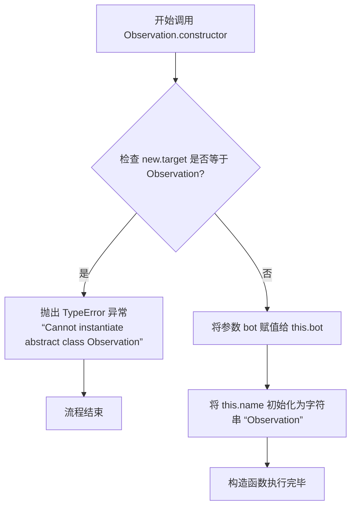
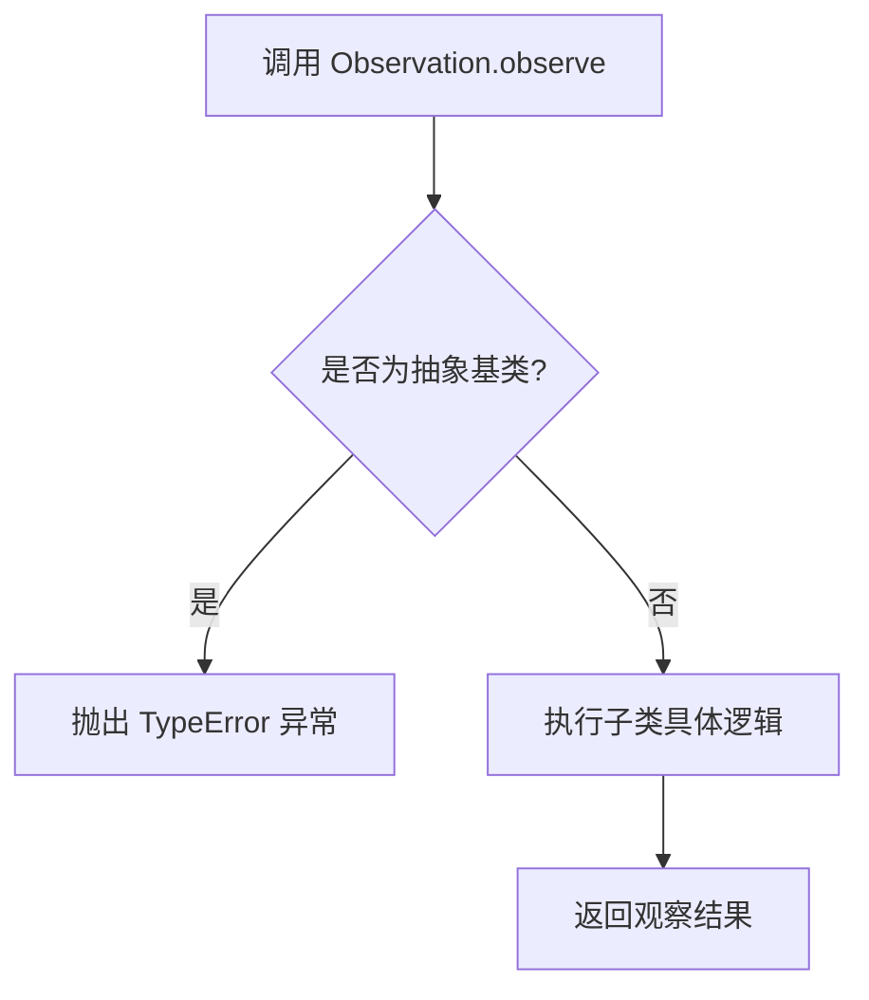
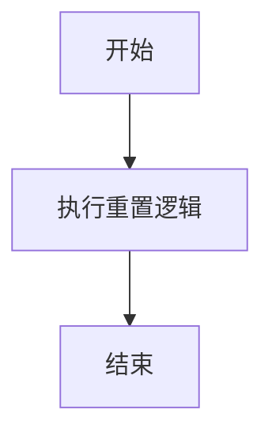

# `.\MetaGPT\metagpt\environment\minecraft\mineflayer\lib\observation\base.js` 详细设计文档

该代码定义了一个用于机器人（bot）行为观察的框架。它提供了一个抽象基类 `Observation`，用于定义具体的观察行为，并通过 `inject` 函数将一组观察器注入到机器人实例中，使其能够响应特定事件并收集、序列化观察数据。

## 整体流程

```mermaid
graph TD
    A[开始] --> B[调用 inject 函数]
    B --> C[初始化 bot.obsList, bot.cumulativeObs, bot.eventMemory]
    C --> D[遍历 obs_list]
    D --> E[实例化每个观察器类并加入 obsList]
    E --> F[为 bot 注入 event 方法]
    F --> G[为 bot 注入 observe 方法]
    G --> H[注入完成]
    H --> I[外部调用 bot.event('some_event')]
    I --> J[遍历 obsList]
    J --> K{obs.name 匹配事件名?}
    K -- 是 --> L[调用 obs.observe() 收集数据]
    K -- 否 --> M[跳过此观察器]
    L --> N[将结果存入 result 对象]
    M --> N
    N --> O[将 [event_name, result] 存入 cumulativeObs]
    O --> P[事件处理结束]
    P --> Q[外部调用 bot.observe()]
    Q --> R[触发 bot.event('observe')]
    R --> S[获取 cumulativeObs 副本]
    S --> T[清空 cumulativeObs]
    T --> U[将副本序列化为 JSON 字符串返回]
    U --> V[观察数据输出]
```

## 类结构

```
Observation (抽象基类)
├── 具体观察器类 (由用户定义，继承自 Observation)
│   ├── 例如: onChatMessage
│   ├── 例如: onPlayerMove
│   └── ...
inject (全局函数)
└── 注入逻辑
```

## 全局变量及字段


### `Observation.bot`
    
对机器人实例的引用，用于观察者获取上下文信息。

类型：`Object`
    


### `Observation.name`
    
观察者的名称，用于标识和过滤特定事件。

类型：`String`
    
    

## 全局函数及方法

### `inject`

`inject` 函数用于初始化一个机器人（`bot`）对象，为其注入观察能力。它通过接收一个观察者类（`Observation` 的子类）列表，为 `bot` 创建对应的观察者实例，并挂载两个核心方法：`event` 用于触发特定事件并收集所有观察者的观测结果；`observe` 用于触发一次“观察”事件，并返回累积的、序列化为 JSON 字符串的观测历史。

参数：
- `bot`：`Object`，需要被注入观察能力的机器人对象。
- `obs_list`：`Array<Class>`，一个由 `Observation` 抽象类的子类（构造函数）组成的数组。

返回值：`undefined`，该函数通过修改传入的 `bot` 对象来产生副作用，无显式返回值。

#### 流程图

```mermaid
flowchart TD
    A[开始: inject(bot, obs_list)] --> B[初始化 bot.obsList,<br/>bot.cumulativeObs,<br/>bot.eventMemory]
    B --> C{遍历 obs_list}
    C -->|对于每个 obs 类| D[实例化 obs(bot)<br/>并加入 bot.obsList]
    D --> C
    C -->|遍历完成| E[为 bot 定义 event 方法]
    E --> F[为 bot 定义 observe 方法]
    F --> G[结束]
```

#### 带注释源码

```javascript
function inject(bot, obs_list) {
    // 1. 初始化 bot 对象上的相关属性
    bot.obsList = []; // 存储所有观察者实例的数组
    bot.cumulativeObs = []; // 累积的观测结果历史，每个元素为 [事件名, 观测结果对象]
    bot.eventMemory = {}; // 事件记忆（当前代码中未使用，为未来扩展预留）

    // 2. 遍历传入的观察者类列表，实例化并存储
    obs_list.forEach((obs) => {
        bot.obsList.push(new obs(bot)); // 创建观察者实例，传入 bot 作为依赖
    });

    // 3. 为 bot 定义 event 方法，用于触发特定事件并收集观测数据
    bot.event = function (event_name) {
        let result = {}; // 本次事件触发的所有观测结果
        // 遍历所有观察者实例
        bot.obsList.forEach((obs) => {
            // 如果观察者的 `name` 以 'on' 开头且不等于当前事件名，则跳过
            // 此逻辑旨在让观察者可以响应特定事件（如 `onChat`），但当前实现中 `observe` 事件会收集所有观察者。
            if (obs.name.startsWith("on") && obs.name !== event_name) {
                return;
            }
            // 调用观察者的 `observe` 方法，并将结果以观察者名称为键存入 result
            result[obs.name] = obs.observe();
        });
        // 将本次事件名和对应的观测结果作为一个元组，存入累积历史
        bot.cumulativeObs.push([event_name, result]);
    };

    // 4. 为 bot 定义 observe 方法，这是对外的主要接口
    bot.observe = function () {
        // 触发一次名为 "observe" 的事件，收集当前所有观察者的数据
        bot.event("observe");
        // 获取累积的历史记录
        const result = bot.cumulativeObs;
        // 清空累积历史，为下一次观察做准备
        bot.cumulativeObs = [];
        // 将结果序列化为 JSON 字符串后返回
        return JSON.stringify(result);
    };
}
```


### `Observation.constructor`

`Observation` 类的构造函数。它用于初始化一个观察实例，并强制该类为抽象类，不能被直接实例化。

参数：

-  `bot`：`Object`，一个机器人实例对象，将被绑定到观察实例上。

返回值：`undefined`，构造函数不显式返回值。

#### 流程图



#### 带注释源码

```javascript
class Observation {
    // 构造函数，用于初始化 Observation 实例
    constructor(bot) {
        // 抽象类检查：如果直接使用 `new Observation()` 调用构造函数，
        // new.target 将指向 Observation 类本身。
        // 此检查确保抽象类不能被直接实例化，必须通过子类继承。
        if (new.target === Observation) {
            // 如果尝试直接实例化，则抛出类型错误异常。
            throw new TypeError(
                "Cannot instantiate abstract class Observation"
            );
        }

        // 将传入的 bot 对象绑定到当前实例的 `this.bot` 属性上。
        // 这使得所有 Observation 子类的实例都能访问到同一个 bot 上下文。
        this.bot = bot;
        // 为当前观察实例设置一个默认名称。
        // 子类应覆盖此属性以提供更具描述性的名称。
        this.name = "Observation";
    }

    // ... 其他方法 ...
}
```


### `Observation.observe`

这是一个抽象方法，用于定义所有具体观察（Observation）子类必须实现的核心行为。它旨在由子类重写，以执行特定的环境感知或数据收集逻辑，并将结果返回给调用者。在基类 `Observation` 中，此方法被定义为必须被覆盖，直接调用会抛出错误。

参数：

-  `this`：`Observation` 实例，表示调用该方法的观察对象实例。

返回值：`any`，由具体子类实现的 `observe` 方法决定其返回值的类型和内容。它代表了该观察实例所感知到的特定信息或数据。

#### 流程图



#### 带注释源码

```javascript
    // 定义观察行为的抽象方法。
    // 所有继承自 Observation 的具体观察类都必须实现此方法。
    // 此方法旨在收集或计算特定的观察数据。
    observe() {
        // 如果子类没有重写此方法，直接调用基类方法将抛出错误，
        // 强制开发者必须在子类中提供具体实现。
        throw new TypeError("Method 'observe()' must be implemented.");
    }
```


### `Observation.reset`

该方法用于重置观察对象的状态。在基类 `Observation` 中，`reset` 方法是一个空实现，旨在被子类重写以提供具体的重置逻辑。当需要清除观察对象内部累积的状态或数据时，应调用此方法。

参数：

-  `无`：`无`，此方法不接受任何参数。

返回值：`undefined`，此方法不返回任何值。

#### 流程图



#### 带注释源码

```
reset() {}
```


## 关键组件


### Observation 抽象基类

定义了所有观测组件的统一接口和基础结构，要求子类必须实现 `observe` 方法，并提供了可选的 `reset` 方法用于状态重置。

### inject 注入函数

负责将一组观测组件（`obs_list`）动态注入到给定的 `bot` 对象中，为其添加事件触发（`event`）和统一观测（`observe`）的能力，并管理观测结果的累积与序列化。


## 问题及建议


### 已知问题

-   **抽象基类检查不完整**：`Observation` 类的构造函数通过检查 `new.target` 来防止自身被实例化，但 `observe` 方法仅通过抛出错误来强制子类实现。这属于运行时检查，而非编译时或更早的静态检查，可能导致错误在较晚的测试或生产阶段才被发现。
-   **事件名称匹配逻辑存在缺陷**：`bot.event` 函数中的判断逻辑 `if (obs.name.startsWith("on") && obs.name !== event_name)` 意图是只触发名称与事件名匹配的观察者。然而，对于名称不以 `"on"` 开头的观察者（例如，名为 `"Observation"` 的基类实例），此逻辑会错误地允许它们在任何事件中被触发，这可能不符合设计预期。
-   **内存泄漏风险**：`bot.eventMemory` 对象在 `inject` 函数中被初始化，但在代码中从未被使用或清理。如果此对象持续累积数据而不被释放，可能导致内存占用不断增加。
-   **数据序列化可能丢失信息**：`bot.observe` 方法使用 `JSON.stringify` 返回累积的观察结果。如果观察结果中包含无法被 JSON 序列化的对象（如函数、`undefined`、循环引用等），会导致序列化失败或数据丢失。
-   **缺乏错误处理机制**：代码中没有对 `obs.observe()` 调用进行 `try-catch` 包装。如果某个观察者的 `observe` 方法抛出异常，将导致整个事件处理过程中断，`bot.cumulativeObs` 可能处于不一致状态，且错误信息可能被吞没。

### 优化建议

-   **使用 TypeScript 或 JSDoc 增强类型安全**：将代码迁移至 TypeScript 或添加详细的 JSDoc 注释，可以明确定义 `Observation` 抽象类、`inject` 函数的参数和返回值类型。这能在开发阶段通过静态类型检查提前发现类型错误和未实现的方法，替代部分运行时检查。
-   **重构事件过滤逻辑**：建议明确观察者的角色。可以定义专门的 `EventObserver` 子类（其 `name` 以特定前缀如 `"on"` 开头）来处理事件，而通用观察者则不参与事件过滤。或者，在观察者类中增加一个 `eventNames` 数组或 `shouldObserve(eventName)` 方法，将过滤逻辑封装在观察者内部，使 `bot.event` 函数的职责更清晰。
-   **清理未使用的变量或明确其用途**：应审查 `bot.eventMemory` 的用途。如果当前无需使用，应将其从 `inject` 函数中移除以避免混淆和内存浪费。如果需要，则应实现其读写逻辑和生命周期管理。
-   **提供可定制的序列化方法**：不要硬编码使用 `JSON.stringify`。可以提供一个默认的序列化器，同时允许用户通过参数传入自定义的序列化函数（如支持 `toJSON` 方法、处理特殊类型等），以增加灵活性并防止数据丢失。
-   **增加健壮的错误处理**：在 `bot.event` 函数中遍历 `obsList` 时，使用 `try-catch` 包裹每个 `obs.observe()` 的调用。可以选择记录错误并继续执行其他观察者，或者将错误信息作为观察结果的一部分收集起来，确保系统不会因为单个观察者的故障而完全崩溃。
-   **考虑性能优化**：`bot.cumulativeObs` 数组会不断增长直到被 `bot.observe()` 调用清空。在高频事件场景下，频繁的数组操作可能成为性能瓶颈。可以考虑使用环形缓冲区或分页机制来限制其最大长度。此外，`bot.event` 中每次事件触发都遍历全部 `obsList`，如果列表很长，可考虑为事件名建立索引映射，快速定位相关的观察者。


## 其它


### 设计目标与约束

该代码库旨在为基于事件的机器人（bot）系统提供一个轻量级、可扩展的观测（Observation）框架。其核心设计目标包括：1. **抽象与可扩展性**：通过抽象基类 `Observation` 定义观测行为的接口，允许开发者通过继承创建具体观测类，实现“开闭原则”。2. **事件驱动与数据聚合**：通过 `inject` 函数将观测系统注入到机器人实例中，支持基于命名事件的观测触发，并自动聚合观测结果。3. **松耦合**：观测逻辑与机器人核心逻辑分离，观测类仅通过 `bot` 参数访问所需环境或状态，降低了模块间的直接依赖。主要约束包括：1. **运行时动态注入**：观测系统通过函数调用动态修改机器人对象，要求机器人对象结构具有一定的灵活性。2. **同步执行模型**：所有观测类的 `observe` 方法在事件触发时同步执行，可能影响主线程性能或响应时间。3. **简单数据序列化**：聚合结果使用 `JSON.stringify` 进行简单序列化，适用于调试或简单日志，但不支持复杂数据类型或循环引用。

### 错误处理与异常设计

当前代码的错误处理机制较为基础，主要依赖于JavaScript的运行时错误和异常抛出：1. **抽象类实例化防护**：在 `Observation` 类的构造函数中，通过检查 `new.target` 来防止直接实例化抽象类，并抛出 `TypeError`。2. **抽象方法强制实现**：基类的 `observe` 方法默认抛出 `TypeError`，强制子类必须实现该方法，否则会在调用时暴露错误。3. **缺乏输入验证与容错**：`inject` 函数未对输入参数 `bot` 和 `obs_list` 进行有效性检查（如类型、非空）。如果 `obs_list` 包含非构造函数项，`new obs(bot)` 会失败。4. **观测执行无隔离**：在 `bot.event` 函数中，遍历 `obsList` 执行 `obs.observe()` 时，如果某个观测类的 `observe` 方法抛出异常，会中断整个事件处理流程，导致后续观测无法执行，且错误可能未被捕获和记录。5. **数据重置风险**：`bot.observe` 方法在返回数据后会清空 `bot.cumulativeObs` 数组。如果调用方未能成功处理返回的字符串，累积的观测数据将永久丢失。

### 数据流与状态机

系统的数据流和状态变化围绕 `bot` 对象上的几个关键属性展开：1. **初始化阶段**：调用 `inject(bot, obs_list)`。`bot` 对象被注入 `obsList`（观测实例数组）、`cumulativeObs`（累积观测结果数组，初始为空）、`eventMemory`（未使用对象，可能为预留）以及 `event` 和 `observe` 两个方法。2. **事件触发阶段**：通过 `bot.event(event_name)` 触发观测。系统遍历 `obsList`，对于每个观测实例 `obs`：首先检查其 `obs.name` 是否以 “on” 开头且不等于当前 `event_name`，若是则跳过（此逻辑意图是让特定事件只触发特定观测，但当前实现可能相反或存在歧义）。然后调用 `obs.observe()` 并将其结果以 `{obs.name: result}` 的形式存入 `result` 对象。最后，将 `[event_name, result]` 这一对数据推入 `bot.cumulativeObs` 数组。3. **数据获取与重置阶段**：通过 `bot.observe()` 方法获取数据。该方法首先触发一个名为 “observe” 的事件（`bot.event("observe")`），然后将 `bot.cumulativeObs` 的当前值赋给局部变量，紧接着清空 `bot.cumulativeObs` 数组，最后将局部变量序列化为JSON字符串返回。这是一个典型的数据“消费”模式，状态在 `cumulativeObs` 的“累积”和“清空”之间切换。

### 外部依赖与接口契约

该模块对外部环境的依赖和提供的接口契约如下：1. **外部依赖**：代码本身不依赖任何外部NPM包或特定运行时环境（Node.js 或 浏览器）。它依赖于传入的 `bot` 对象具有可扩展性（能够动态添加属性），并且期望具体的 `Observation` 子类在实现 `observe()` 方法时，能够通过 `this.bot` 访问到完成任务所需的所有上下文或数据。这是一种隐式的、基于约定的依赖。2. **导出接口**：模块通过 `module.exports` 导出两个实体：`Observation` 抽象基类和 `inject` 函数。这是模块对外的明确契约。使用者必须：a) 继承 `Observation` 类并实现 `observe` 方法。b) 调用 `inject` 函数，传入一个机器人实例和一个由观测类构造函数组成的数组，以完成系统集成。3. **事件命名契约**：`bot.event` 方法的内部逻辑与观测类的 `name` 属性存在隐含契约。代码中 `if (obs.name.startsWith("on") && obs.name !== event_name) { return; }` 这行意图是让名称以 “on” 开头的观测类只响应与其名称（去掉“on”前缀？）匹配的事件，但当前逻辑（`obs.name !== event_name`）可能导致其只响应**不匹配**的事件，这很可能是一个逻辑错误或未完成的特性。使用者需要了解这一潜在行为。

### 性能考量

1. **同步遍历与执行**：`bot.event` 函数同步遍历所有观测实例并执行其 `observe` 方法。如果观测数量众多或单个观测执行耗时较长，会阻塞事件循环，影响机器人整体的响应性。2. **数组增长与内存**：`bot.cumulativeObs` 数组会随着事件触发不断增长，直到调用 `bot.observe()` 被清空。在长时间运行或高频事件场景下，如果未及时消费数据，可能导致内存占用持续升高。3. **序列化开销**：`bot.observe()` 每次调用都会使用 `JSON.stringify` 序列化整个累积观测数组。对于大型或复杂的观测数据，序列化可能成为性能瓶颈。4. **无观测执行优化**：当前实现没有对不响应特定事件的观测类进行过滤或优化，每次事件触发都会遍历全部观测实例并执行条件判断。

### 安全与可维护性

1. **原型污染风险**：`inject` 函数直接向传入的 `bot` 对象添加属性（`obsList`, `cumulativeObs` 等）。如果 `bot` 对象来自不可信来源或其原型链已被污染，可能存在风险，但在此上下文中通常可控。2. **缺乏类型安全**：整个代码库使用纯JavaScript，缺乏类型定义（如TypeScript）。`bot` 对象的结构、观测结果的格式、事件名称的约定等都依赖于文档和口头约定，增加了在大型项目或多人协作中出错的概率。3. **魔法字符串**：事件名称（如 `"observe"`）和观测类 `name` 属性的使用都以字符串形式硬编码在逻辑中，难以重构且容易拼写错误。4. **可测试性**：由于观测逻辑与 `bot` 对象紧密耦合，对单个 `Observation` 子类或 `inject` 函数的单元测试需要构造完整的 `bot` 上下文模拟，增加了测试复杂度。`bot.event` 和 `bot.observe` 作为匿名函数被注入，也难以直接进行独立测试。

    