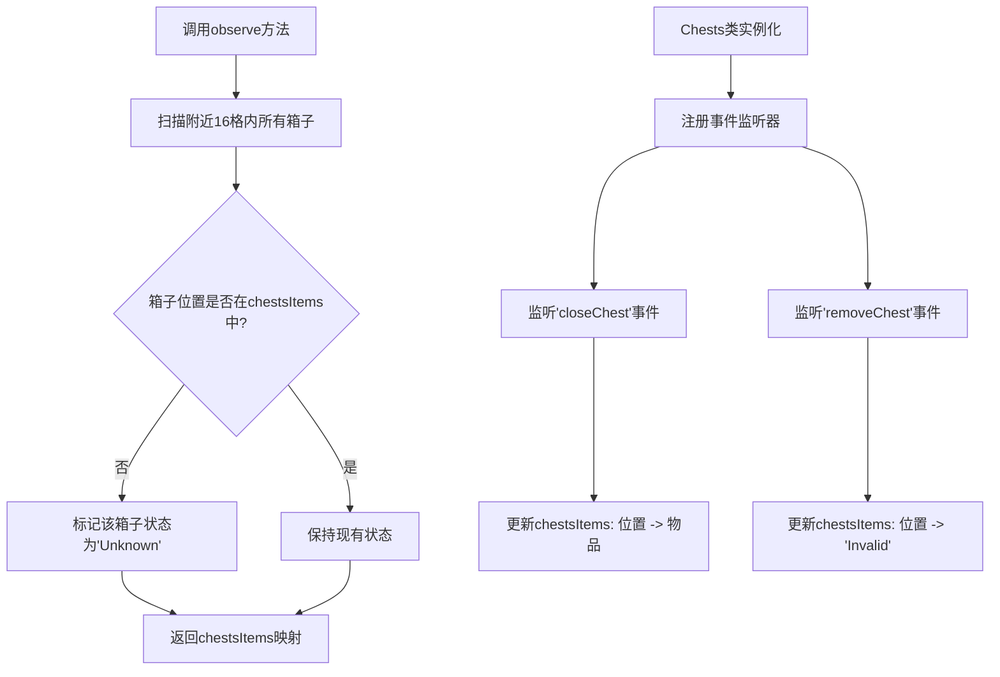
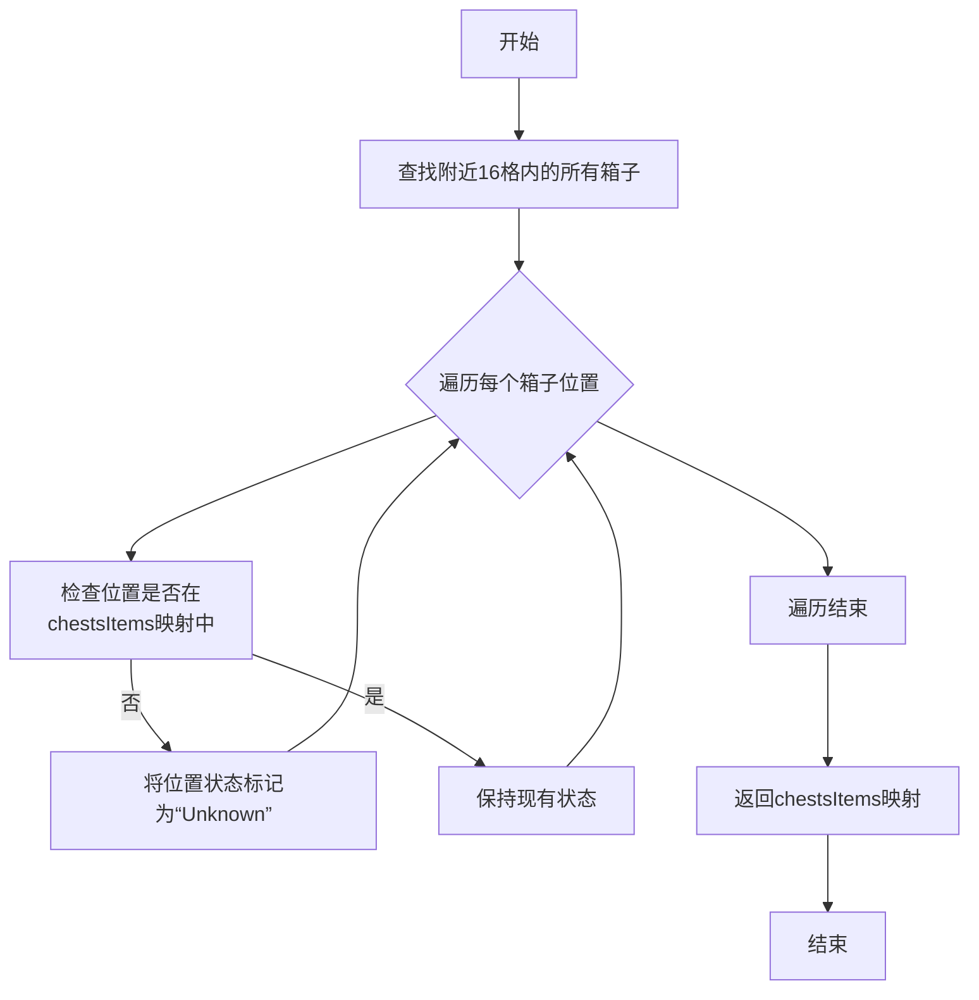

# `.\MetaGPT\metagpt\environment\minecraft\mineflayer\lib\observation\chests.js` 详细设计文档

该代码定义了一个名为 `Chests` 的观察者类，用于监控Minecraft机器人（bot）附近箱子（chest）的状态。它通过监听游戏事件来跟踪箱子的物品内容，并在需要时主动扫描附近区域以发现新箱子，最终返回一个包含所有已知箱子位置及其物品状态（已知、未知或无效）的映射对象。

## 整体流程



## 类结构

```
Observation (基类，来自./base)
└── Chests (箱子观察者)
```

## 全局变量及字段


### `Chests.name`
    
观察实例的名称，用于标识该观察对象，此处固定为 'nearbyChests'。

类型：`string`
    


### `Chests.chestsItems`
    
一个映射对象，用于存储附近箱子的位置（作为键）与其物品状态（作为值）。状态可以是物品数组、'Unknown' 或 'Invalid'。

类型：`Object`
    
    

## 全局函数及方法


### `Chests.constructor`

`Chests` 类的构造函数，用于初始化一个观察附近箱子的实例。它继承自 `Observation` 基类，设置观察名称，初始化存储箱子物品的字典，并注册两个事件监听器以响应箱子关闭和移除事件，从而动态更新内部状态。

参数：

-  `bot`：`Object`，一个机器人实例对象，提供了事件监听、方块查找等功能，是 `Chests` 观察器与游戏世界交互的核心接口。

返回值：`undefined`，构造函数不显式返回值。

#### 流程图

```mermaid
flowchart TD
    A[开始 Chests.constructor(bot)] --> B[调用父类 Observation 的构造函数 super(bot)]
    B --> C[设置观察名称 this.name = 'nearbyChests']
    C --> D[初始化箱子物品字典 this.chestsItems = {}]
    D --> E[注册 'closeChest' 事件监听器<br>更新对应位置的箱子物品]
    E --> F[注册 'removeChest' 事件监听器<br>将对应位置的箱子标记为 'Invalid']
    F --> G[结束]
```

#### 带注释源码

```
class Chests extends Observation {
    // 构造函数，接收一个 bot 实例作为参数
    constructor(bot) {
        // 调用父类 Observation 的构造函数，传递 bot 实例
        super(bot);
        // 设置此观察实例的名称为 'nearbyChests'
        this.name = "nearbyChests";
        // 初始化一个空对象，用于存储箱子位置与物品的映射关系
        // 键：箱子位置（坐标字符串或对象），值：箱子物品数组或状态字符串
        this.chestsItems = {};
        // 为 bot 注册 'closeChest' 事件监听器
        // 当箱子关闭时，更新 chestsItems 字典中对应位置的物品列表
        bot.on("closeChest", (chestItems, position) => {
            this.chestsItems[position] = chestItems;
        });
        // 为 bot 注册 'removeChest' 事件监听器
        // 当箱子被移除时，将 chestsItems 字典中对应位置的值标记为 'Invalid'
        bot.on("removeChest", (chestPosition) => {
            this.chestsItems[chestPosition] = "Invalid";
        });
        // 构造函数执行完毕，隐式返回 undefined
    }
    // ... 类的其他方法（如 observe）在此省略
}
```


### `Chests.observe`

该方法用于观察机器人周围指定范围内的所有箱子，并返回一个包含箱子位置及其物品状态的映射。如果箱子状态未知，则标记为"Unknown"。

参数：无

返回值：`Object`，一个以箱子位置为键、箱子物品状态为值的对象。状态可能为"Unknown"（未知）、"Invalid"（无效）或具体的物品列表。

#### 流程图



#### 带注释源码

```javascript
observe() {
    // 1. 查找机器人周围16格内所有类型为箱子的方块位置
    const chests = this.bot.findBlocks({
        matching: this.bot.registry.blocksByName.chest.id, // 匹配箱子方块ID
        maxDistance: 16, // 最大搜索距离
        count: 999, // 最大数量限制
    });

    // 2. 遍历找到的每个箱子位置
    chests.forEach((chest) => {
        // 3. 如果该位置尚未在chestsItems映射中记录
        if (!this.chestsItems.hasOwnProperty(chest)) {
            // 4. 将其状态初始化为“Unknown”（未知）
            this.chestsItems[chest] = "Unknown";
        }
        // 注意：如果位置已存在，则保持现有状态（可能是“Invalid”或具体的物品列表）
    });

    // 5. 返回更新后的箱子物品状态映射
    return this.chestsItems;
}
```

## 关键组件


### 事件驱动的物品缓存管理

通过监听 `closeChest` 和 `removeChest` 事件，动态维护一个以箱子位置为键的物品缓存字典 (`chestsItems`)，实现了箱子物品状态的实时更新与失效标记。

### 基于距离的箱子发现与状态初始化

通过调用 `bot.findBlocks` 方法，在指定半径内搜索所有箱子方块，并对缓存中不存在的箱子位置进行状态初始化（标记为“未知”），确保观察范围覆盖所有可见箱子。

### 惰性状态查询与返回

`observe` 方法不直接与游戏世界交互获取每个箱子的实时物品列表，而是返回内部维护的缓存字典。物品数据的实际获取依赖于外部触发的 `closeChest` 事件，这是一种惰性加载策略。


## 问题及建议


### 已知问题

-   **数据一致性风险**：`chestsItems` 字典中存储的值类型不一致（`"Invalid"` 为字符串，`"Unknown"` 为字符串，而正常数据为物品数组）。这可能导致下游处理逻辑需要进行复杂的类型检查，容易出错。
-   **内存泄漏风险**：`removeChest` 事件监听器将箱子位置对应的值设置为 `"Invalid"`，但并未从 `chestsItems` 字典中删除该键。随着游戏进程，无效条目会不断累积，可能导致内存占用无限制增长。
-   **事件监听器未清理**：在 `Chests` 实例的生命周期中，向 `bot` 对象注册的事件监听器（`closeChest`, `removeChest`）没有提供对应的清理方法（如 `destroy`）。如果创建多个 `Chests` 实例或实例不再需要时，这些监听器会残留，可能引起错误或内存泄漏。
-   **“Unknown”状态可能过时**：`observe` 方法遍历发现的箱子，将新箱子状态设为 `"Unknown"`。然而，对于之前已知但当前未扫描到的箱子（例如，玩家移动后超出扫描范围），其状态不会更新为 `"Unknown"`，这可能提供误导性的“最后已知状态”。

### 优化建议

-   **统一数据表示**：建议使用一个更结构化的方式来表示箱子状态。例如，可以定义一个状态枚举（如 `{ UNKNOWN: 'unknown', INVALID: 'invalid', VALID: 'valid' }`），并将物品数据与状态分开存储。或者，使用 `null` 或 `undefined` 表示未知/无效，用数组表示有效数据，但需在文档中明确约定。
-   **清理无效数据**：在 `removeChest` 事件处理中，应使用 `delete this.chestsItems[chestPosition];` 来彻底移除条目，而不是将其标记为 `"Invalid"`。同时，`observe` 方法也应考虑移除那些本次扫描未发现、且之前状态不是由事件驱动的箱子条目（可选，取决于设计意图）。
-   **实现资源管理接口**：为 `Chests` 类添加一个 `destroy()` 或 `cleanup()` 方法，在其中移除所有注册的事件监听器。确保在实例不再使用时被调用。
-   **增强状态管理逻辑**：在 `observe` 方法中，可以考虑重置所有非事件驱动的箱子状态为 `"Unknown"`（或删除），然后根据本次扫描结果重新设置。这样可以保证 `observe()` 返回的数据严格反映当前扫描范围内的状态。但需注意这与事件驱动的数据（`closeChest`）的优先级问题，可能需要更精细的设计（例如，为事件更新的数据添加时间戳或来源标记）。
-   **添加容量限制**：为 `chestsItems` 字典的容量设置一个上限，并实现LRU（最近最少使用）等淘汰策略，以防止在极端情况下内存过度增长。
-   **考虑并发访问**：虽然Node.js是单线程的，但事件循环中异步操作可能交错。如果 `observe()` 方法可能被频繁调用，且与事件回调（`closeChest`, `removeChest`）同时修改 `this.chestsItems`，应考虑使用简单的锁机制或原子操作来避免状态损坏。


## 其它


### 设计目标与约束

本模块的设计目标是实现对游戏世界中附近箱子（Chests）状态的实时观察与缓存管理。核心约束包括：1) 依赖底层机器人框架（`bot`）提供的事件和API；2) 观察范围限制在16格以内；3) 需要高效处理箱子打开、关闭和移除事件以维护缓存的一致性；4) 作为`Observation`基类的具体实现，需遵循其定义的观察者模式接口。

### 错误处理与异常设计

当前代码缺乏显式的错误处理机制。潜在风险包括：1) `bot.findBlocks`可能因内部错误或无效参数而失败，但未进行`try-catch`包装或错误传播；2) `bot.on`事件监听器未处理回调函数中的异常，可能导致程序静默崩溃；3) 对`this.chestsItems`字典的访问（如`hasOwnProperty`）虽然安全，但将无效箱子标记为`"Invalid"`字符串是一种隐式的错误状态表示，而非结构化的错误处理。建议引入明确的错误类或状态枚举，并在关键操作中添加异常捕获和日志记录。

### 数据流与状态机

数据流始于`bot`对象发出的事件（`closeChest`, `removeChest`）和主动调用的`observe`方法。`chestsItems`对象作为核心状态存储，其生命周期和状态变迁如下：
1.  **初始化**：空对象`{}`。
2.  **事件驱动更新**：
    *   `closeChest`事件：以`position`为键，更新为具体的`chestItems`（物品列表）。
    *   `removeChest`事件：以`chestPosition`为键，更新为字符串`"Invalid"`，表示箱子已不存在。
3.  **主动观察更新**：`observe`方法调用时，遍历附近找到的箱子位置。如果某个位置不在`chestsItems`中，则将其状态初始化为`"Unknown"`。
4.  **状态输出**：`observe`方法返回当前的`chestsItems`状态副本。
状态机模型相对简单，但缺乏对状态（如`"Unknown"`、`"Invalid"`、具体物品列表）之间合法转换的明确定义和验证。

### 外部依赖与接口契约

1.  **外部依赖**：
    *   `./base`模块：必须提供`Observation`基类，定义了`constructor`和`observe`方法的契约。
    *   `bot`对象：必须提供`on`方法用于事件监听，`findBlocks`方法用于查找方块，以及`registry.blocksByName.chest.id`属性用于识别箱子方块。必须能触发`closeChest`和`removeChest`事件。
2.  **接口契约**：
    *   **模块导出**：导出一个继承自`Observation`的类`Chests`。
    *   **构造函数**：接受一个`bot`实例作为参数。
    *   **实例方法**：`observe()`方法返回一个对象，其键为箱子位置（格式依赖`bot`），值为该箱子的状态（物品列表、`"Unknown"`或`"Invalid"`）。
    *   **事件响应**：类实例监听`bot`的特定事件并更新内部状态，这是隐式的行为契约。

### 性能考量与扩展性

1.  **性能**：`observe`方法每次调用都会执行`bot.findBlocks`，在箱子密集区域可能产生开销。缓存箱子位置列表并仅在必要时更新可能更高效。`chestsItems`对象可能无限增长（只标记`"Invalid"`，未删除旧条目），存在内存泄漏风险。
2.  **扩展性**：当前设计专注于附近箱子的物品和存在性。若需观察箱子其他属性（如类型、锁定状态）或更复杂的交互（如过滤、搜索），需要在类中添加新字段、事件监听和方法，可能造成类职责膨胀。考虑将箱子数据抽象为独立的值对象，并将不同维度的观察逻辑分离到不同策略类中。

### 测试策略建议

1.  **单元测试**：应模拟`bot`对象，测试：a) 构造函数是否正确设置事件监听器；b) `observe`方法是否正确初始化未知箱子状态并返回缓存；c) 模拟`closeChest`和`removeChest`事件后，内部状态是否按预期更新。
2.  **集成测试**：与真实或模拟的`bot`环境集成，验证在游戏场景中事件触发与观察结果的一致性。
3.  **状态验证测试**：确保`"Unknown"`、`"Invalid"`和有效物品列表状态在业务逻辑中均被正确处理，避免因状态值混淆导致的bug。

    