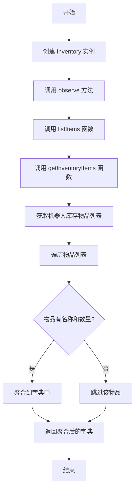
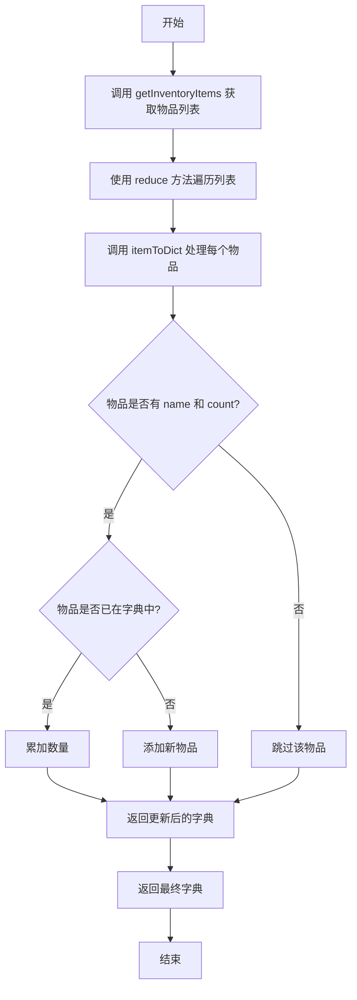
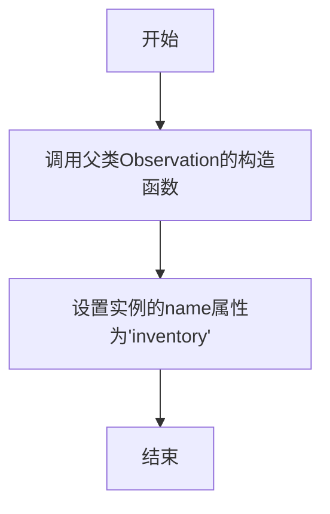

# `.\MetaGPT\metagpt\environment\minecraft\mineflayer\lib\observation\inventory.js` 详细设计文档

该代码定义了一个名为 Inventory 的观察者类，用于监控和管理游戏或模拟环境中机器人的物品库存。它通过遍历机器人当前窗口或库存中的物品，将物品名称和数量聚合到一个字典对象中，以便于其他系统查询和使用。

## 整体流程



## 类结构

```
Observation (基类)
└── Inventory (库存观察者类)
```

## 全局变量及字段


### `Inventory`
    
表示库存观察的类，继承自Observation基类，用于获取和汇总Minecraft机器人背包中的物品信息。

类型：`class`
    


### `Inventory.name`
    
观察实例的名称，固定为'inventory'，用于标识此观察的类型。

类型：`string`
    
    

## 全局函数及方法

### `listItems`

该函数用于获取并整理机器人的物品栏信息。它首先调用 `getInventoryItems` 函数获取物品列表，然后使用 `itemToDict` 函数将物品列表转换为一个字典对象，其中键为物品名称，值为该物品的总数量。

参数：
- `bot`：`object`，代表一个机器人实例，用于访问其物品栏。

返回值：`object`，一个字典对象，键为物品名称（字符串），值为该物品的总数量（数字）。

#### 流程图



#### 带注释源码

```javascript
function listItems(bot) {
    // 调用 getInventoryItems 函数获取机器人的物品列表
    const items = getInventoryItems(bot);
    // 使用 reduce 方法遍历物品列表，将每个物品通过 itemToDict 函数处理，最终累积成一个字典对象
    return items.reduce(itemToDict, {});
}
```


### `getInventoryItems`

该函数用于从给定的机器人对象中获取当前库存物品列表。它首先尝试从机器人的当前窗口获取物品，如果当前窗口不存在，则回退到机器人的默认库存。

参数：

- `bot`：`Object`，一个机器人对象，包含当前窗口或库存信息。

返回值：`Array`，一个物品对象数组，每个对象包含物品的名称和数量等信息。

#### 流程图

```mermaid
flowchart TD
    A[开始] --> B{bot.currentWindow 存在?}
    B -- 是 --> C[inventory = bot.currentWindow]
    B -- 否 --> D[inventory = bot.inventory]
    C --> E[返回 inventory.items()]
    D --> E
    E --> F[结束]
```

#### 带注释源码

```javascript
function getInventoryItems(bot) {
    // 尝试获取当前窗口，如果不存在则使用默认库存
    const inventory = bot.currentWindow || bot.inventory;
    // 调用 inventory 的 items 方法获取物品列表并返回
    return inventory.items();
}
```


### `itemToDict`

`itemToDict` 是一个用于聚合物品信息的函数。它接收一个累积对象和一个当前物品对象，检查当前物品是否具有有效的 `name` 和 `count` 属性。如果有效，则将该物品的数量累加到累积对象中对应的物品名键下；如果该物品名在累积对象中尚不存在，则创建该键并设置其值为当前物品的数量。最后，函数返回更新后的累积对象。

参数：

- `acc`：`Object`，累积的对象，用于存储物品名到数量的映射。
- `cur`：`Object`，当前处理的物品对象，应包含 `name` 和 `count` 属性。

返回值：`Object`，更新后的累积对象，包含所有已处理物品的聚合数量。

#### 流程图

```mermaid
flowchart TD
    A[开始: itemToDict(acc, cur)] --> B{cur.name 且 cur.count 存在?}
    B -- 是 --> C{acc[cur.name] 存在?}
    B -- 否 --> D[返回 acc]
    C -- 是 --> E[acc[cur.name] += cur.count]
    C -- 否 --> F[acc[cur.name] = cur.count]
    E --> D
    F --> D
```

#### 带注释源码

```javascript
function itemToDict(acc, cur) {
    // 检查当前物品对象是否包含必要的属性
    if (cur.name && cur.count) {
        // 如果物品名已存在于累积对象中
        if (acc[cur.name]) {
            // 累加数量
            acc[cur.name] += cur.count;
        } else {
            // 否则，初始化该物品名的数量
            acc[cur.name] = cur.count;
        }
    }
    // 返回更新后的累积对象
    return acc;
}
```

### `Inventory.constructor`

该构造函数用于初始化 `Inventory` 类的实例，继承自 `Observation` 基类，并设置观察器的名称为 "inventory"。

参数：

- `bot`：`Object`，代表一个机器人实例，用于访问其属性和方法。

返回值：`undefined`，构造函数不显式返回值。

#### 流程图



#### 带注释源码

```javascript
class Inventory extends Observation {
    // 构造函数，接收一个bot对象作为参数
    constructor(bot) {
        // 调用父类Observation的构造函数，传入bot参数
        super(bot);
        // 设置当前实例的name属性为"inventory"，标识这是一个库存观察器
        this.name = "inventory";
    }

    observe() {
        return listItems(this.bot);
    }
}
```

### `Inventory.observe`

该方法用于观察并统计机器人的物品栏内容，将物品名称和数量汇总为一个字典对象。

参数：

- 无显式参数（通过 `this.bot` 访问机器人实例）

返回值：`Object`，一个字典对象，键为物品名称，值为该物品的总数量。

#### 流程图

```mermaid
flowchart TD
    A[开始 observe] --> B[调用 listItems(this.bot)]
    B --> C[调用 getInventoryItems(bot)]
    C --> D[获取 inventory 窗口或物品栏]
    D --> E[获取 items 数组]
    E --> F[调用 items.reduce<br>初始值为空对象 {}]
    F --> G{遍历每个物品 cur}
    G --> H{cur.name 且 cur.count 存在?}
    H -- 是 --> I{acc 中已有 cur.name?}
    I -- 是 --> J[acc[cur.name] += cur.count]
    I -- 否 --> K[acc[cur.name] = cur.count]
    H -- 否 --> L[跳过此物品]
    J --> M[返回 acc 给下一次迭代]
    K --> M
    L --> M
    M --> G
    G -- 遍历结束 --> N[返回最终的 acc 对象]
    N --> O[结束]
```

#### 带注释源码

```javascript
// 观察方法，返回物品栏统计结果
observe() {
    // 调用 listItems 函数，传入当前机器人实例，开始处理物品栏
    return listItems(this.bot);
}
```

## 关键组件


### Inventory 类

继承自基础观察类（Observation），负责封装和管理游戏内物品清单的观察逻辑，通过聚合物品信息并转换为字典格式来提供结构化的库存数据。

### listItems 函数

接收机器人实例（bot）作为参数，调用 `getInventoryItems` 获取原始物品列表，然后使用 `reduce` 方法结合 `itemToDict` 函数将物品列表聚合为一个以物品名称为键、数量为值的字典对象。

### getInventoryItems 函数

从机器人实例（bot）中获取当前窗口或库存的引用，并调用其 `items()` 方法返回一个包含所有物品对象的数组，为后续处理提供原始数据源。

### itemToDict 函数

作为 `reduce` 函数的回调，用于将单个物品对象（cur）累加到字典（acc）中。它检查物品是否具有有效的名称和数量属性，并根据物品名称是否已存在于字典中来更新或初始化其数量值。


## 问题及建议


### 已知问题

-   **`getInventoryItems` 函数健壮性不足**：该函数依赖于 `bot.currentWindow` 或 `bot.inventory` 的存在，并且假设 `inventory.items()` 方法总是可用。如果 `bot` 对象状态异常（例如，未正确初始化或处于特定状态），可能导致运行时错误。
-   **`itemToDict` 函数未处理无效或异常数据**：函数仅检查 `cur.name` 和 `cur.count` 是否存在，但未验证其类型（例如，`count` 应为数字）或值的有效性（例如，`count` 为负数或非整数）。此外，如果 `cur.name` 是 `null` 或 `undefined`，将其用作对象键可能导致 `acc[null]` 这样的意外行为。
-   **代码缺乏错误处理机制**：整个流程（`observe` -> `listItems` -> `getInventoryItems` -> `itemToDict`）没有使用 `try...catch` 或类似的错误处理结构。任何环节的异常都会导致整个观察过程失败，且调用方可能无法获得清晰的错误信息。
-   **潜在的全局命名冲突**：虽然当前模块只导出了 `Inventory` 类，但文件中定义了全局函数 `listItems`、`getInventoryItems` 和 `itemToDict`。如果其他模块无意中定义了同名函数，或在复杂构建过程中发生变量提升问题，可能导致难以调试的行为。
-   **`observe` 方法返回的数据结构可能不明确**：`listItems` 返回一个字典（对象），其中键是物品名称，值是数量。但文档或类型定义中未明确说明这一点，调用方可能需要查看源码才能正确理解返回的数据结构。

### 优化建议

-   **增强数据验证和错误处理**：在 `getInventoryItems` 中，可以添加对 `bot` 对象及其必要属性的存在性检查。在 `itemToDict` 中，应验证 `cur.name` 为字符串且 `cur.count` 为有效数字。考虑在整个调用链中添加 `try...catch`，并抛出或返回具有明确错误信息的自定义错误。
-   **考虑使用 Map 替代对象作为累加器**：虽然当前使用对象作为字典是可行的，但如果物品名称可能包含非字符串键（尽管当前逻辑下不会），或者为了更清晰的意图表达，可以考虑使用 `Map` 数据结构。`Map` 在迭代和键类型上更具灵活性。
-   **将工具函数设为私有或模块内部函数**：将 `listItems`、`getInventoryItems` 和 `itemToDict` 函数移到 `Inventory` 类内部作为私有方法（如果使用较新JS版本），或者至少不要将它们暴露在全局作用域。这可以通过使用模块模式或 IIFE 来封装，避免污染全局命名空间。
-   **添加 JSDoc 注释或 TypeScript 类型定义**：为类和方法添加详细的注释，特别是说明 `observe()` 方法的返回值结构。更好的方式是使用 TypeScript 编写代码或添加 `.d.ts` 类型声明文件，以提供编译时类型检查和提高代码可维护性。
-   **优化 `itemToDict` 的逻辑清晰度**：可以使用更简洁的现代语法来重写 `itemToDict` 函数，例如使用空值合并运算符和条件运算符，或者使用 `reduce` 的初始值更明确地设置为一个空对象 `{}`（虽然当前隐式如此）。这可以提高代码的可读性。
-   **考虑性能优化（如果物品数量很大）**：`itemToDict` 函数在每次迭代中都会进行属性查找和赋值。对于非常大的物品列表，这可能是性能瓶颈。虽然对于Minecraft机器人库存来说可能不必要，但作为通用设计，可以留意这一点。目前的实现对于典型场景是足够的。


## 其它


### 设计目标与约束

该模块的设计目标是提供一个简洁、可复用的“库存观察”组件，用于从Minecraft机器人（bot）中提取物品信息，并将其聚合为以物品名称为键、数量为值的字典对象。核心约束包括：1) 必须继承自基类`Observation`，遵循既定的观察者模式接口；2) 必须兼容bot对象提供的不同库存容器接口（`currentWindow`或`inventory`）；3) 输出格式必须为纯JavaScript对象，便于后续处理或序列化。

### 错误处理与异常设计

当前代码缺乏显式的错误处理机制。`getInventoryItems`函数依赖于bot对象提供正确的`items()`方法，若bot状态异常或接口不符，可能导致运行时错误。`itemToDict`函数假设`cur.name`和`cur.count`存在，若物品对象结构意外变化，可能导致逻辑错误或跳过该物品。建议增加输入验证和try-catch块，或定义明确的错误类型向上层抛出。

### 数据流与状态机

数据流起始于`Inventory.observe()`方法调用，它触发`listItems(bot)`。`listItems`调用`getInventoryItems(bot)`获取原始物品数组，然后通过`reduce`方法，以`itemToDict`为累加器函数，将数组转换为聚合字典。整个流程是无状态的纯函数转换，不涉及内部状态变更。输入为bot实例，输出为物品字典，没有中间状态存储。

### 外部依赖与接口契约

1.  **基类依赖**：强依赖于`./base`模块导出的`Observation`基类，需确保其`constructor`和`observe`方法接口稳定。
2.  **Bot对象契约**：依赖传入的`bot`对象必须满足以下至少一种条件：拥有`currentWindow.items()`方法，或拥有`inventory.items()`方法。`items()`方法需返回一个数组，数组元素应为包含`name`（字符串）和`count`（数字）属性的对象。
3.  **模块导出契约**：模块导出单一的`Inventory`类，供外部实例化和调用。

### 性能考量

`itemToDict`函数使用对象属性累加进行聚合，其时间复杂度为O(n)，n为库存物品数量，对于典型库存容量是高效的。然而，`reduce`遍历整个数组，若库存量极大（例如通过模组扩展），可能成为瓶颈。当前实现未考虑物品的元数据（如损坏值、附魔）区分，仅按名称聚合，这符合设计目标，但限制了信息的粒度。

### 可测试性设计

模块的函数（`listItems`, `getInventoryItems`, `itemToDict`）均为纯函数或仅依赖注入的函数，易于单元测试。可以通过模拟（mock）bot对象及其返回的items数据来测试各种边界情况，如空库存、重复物品、缺失属性的物品等。`Inventory`类本身逻辑简单，测试重点应放在集成的数据转换流程上。

    