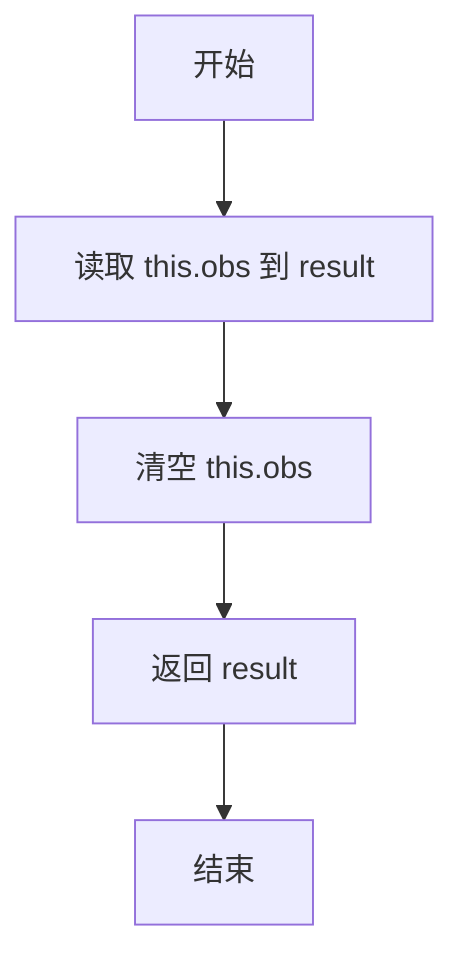

# `.\MetaGPT\metagpt\environment\minecraft\mineflayer\lib\observation\onChat.js` 详细设计文档

该代码实现了一个名为 `onChat` 的观察者类，用于监听 Minecraft 机器人（bot）的聊天事件。它继承自 `Observation` 基类，核心功能是过滤非玩家命令的聊天消息，将这些消息累积到一个内部缓冲区中，并在外部调用 `observe` 方法时返回并清空缓冲区，从而实现对聊天内容的异步、批量化观察。

## 整体流程

```mermaid
graph TD
    A[onChat 类实例化] --> B[注册 chatEvent 监听器]
    B --> C{收到聊天事件}
    C --> D[消息以'/'开头?]
    D -- 是 --> E[忽略，返回]
    D -- 否 --> F[将消息追加到 obs 缓冲区]
    F --> G[触发 bot.event(this.name)]
    H[外部调用 observe()] --> I[读取并返回当前 obs 内容]
    I --> J[清空 obs 缓冲区]
```

## 类结构

```
Observation (基类，来自 ./base.js)
└── onChat (聊天观察者类)
```

## 全局变量及字段


### `onChat.name`
    
观察器的名称标识符，用于在触发事件时识别观察器类型。

类型：`string`
    


### `onChat.obs`
    
用于累积聊天消息的缓冲区，在触发事件时收集非命令消息。

类型：`string`
    
    

## 全局函数及方法


### `onChat.constructor`

`onChat` 类的构造函数，用于初始化一个聊天事件观察器。它继承自 `Observation` 基类，设置观察器名称，并监听机器人（bot）的 `"chatEvent"` 事件。当监听到非命令（不以 `/` 开头）的聊天消息时，将其累积到内部状态 `obs` 中，并触发一个事件通知。

参数：

- `bot`：`Object`，一个机器人实例，用于注册事件监听器并触发事件。

返回值：`undefined`，构造函数不返回值。

#### 流程图

```mermaid
flowchart TD
    A[开始: onChat.constructor(bot)] --> B[调用父类Observation的构造函数 super(bot)]
    B --> C[设置实例属性 this.name = 'onChat']
    C --> D[初始化累积消息的字符串 this.obs = '']
    D --> E[为bot注册'chatEvent'事件监听器]
    E --> F{收到聊天事件<br>参数: username, message}
    F --> G{message是否以'/'开头?}
    G -->|是| H[忽略命令，直接返回]
    G -->|否| I[将message追加到this.obs]
    I --> J[触发事件 this.bot.event(this.name)]
    J --> K[监听器执行完毕]
    H --> K
    K --> L[构造函数执行结束]
```

#### 带注释源码

```javascript
// onChat 类的构造函数
constructor(bot) {
    // 1. 调用父类 Observation 的构造函数，传入 bot 实例
    super(bot);
    
    // 2. 设置当前观察器的名称，用于标识
    this.name = "onChat";
    
    // 3. 初始化一个空字符串，用于累积后续收到的聊天消息
    this.obs = "";
    
    // 4. 为传入的 bot 实例注册一个 'chatEvent' 事件监听器
    bot.on("chatEvent", (username, message) => {
        // 5. 检查收到的消息是否以 '/' 开头（即是否为命令）
        if (message.startsWith("/")) {
            // 6. 如果是命令，则忽略，不进行任何处理，直接返回
            return;
        }

        // 7. 如果不是命令，将消息内容追加到累积字符串 this.obs 中
        this.obs += message;
        
        // 8. 通过 bot 触发一个事件，事件名称为 this.name ("onChat")，
        //    通知其他组件有新的聊天消息被观察到了
        this.bot.event(this.name);
    });
}
```


### `onChat.observe`

该方法用于获取并清空当前累积的聊天消息观察结果。当聊天事件发生时，非命令消息会被累积到内部状态中，调用此方法会返回所有累积的消息并重置状态。

参数：无

返回值：`string`，返回当前累积的所有聊天消息字符串，调用后内部状态被清空。

#### 流程图



#### 带注释源码

```javascript
observe() {
    // 1. 将当前累积的聊天消息保存到局部变量 result 中
    const result = this.obs;
    // 2. 清空内部累积状态，为下一次观察做准备
    this.obs = "";
    // 3. 返回累积的聊天消息
    return result;
}
```

## 关键组件


### 事件监听与处理

通过监听 `chatEvent` 事件，捕获非命令聊天消息，并将其累积到内部状态中，实现聊天内容的实时收集。

### 状态管理与重置

通过 `observe` 方法返回累积的聊天消息，并在返回后立即清空内部状态，确保每次观察获取的都是自上次观察以来的新消息，实现了状态的一次性消费模式。

### 消息过滤

在事件处理逻辑中，通过检查消息是否以 `/` 开头来过滤掉游戏命令，确保只收集玩家之间的普通聊天内容。


## 问题及建议


### 已知问题

-   **内存泄漏风险**：`obs` 字段会持续累积聊天消息，仅在 `observe()` 方法被调用时才会清空。如果 `observe()` 未被定期调用（例如，观察者模式未被正确消费），`obs` 字符串将无限增长，导致内存占用不断增加。
-   **数据丢失风险**：`observe()` 方法在返回当前累积的聊天记录后，会立即清空 `obs` 字段。如果在此之后、下一次 `observe()` 调用之前发生错误或进程崩溃，未被处理的聊天记录将永久丢失。
-   **缺乏消息边界**：所有非命令聊天消息都被简单地拼接成一个字符串 (`this.obs += message`)。这导致无法区分不同消息的边界、发送者或时间戳，丢失了原始数据的结构和关键上下文信息。
-   **潜在的并发问题**：虽然 Node.js 是单线程的，但事件循环中异步事件的交错执行可能导致问题。如果 `bot.on("chatEvent")` 回调（修改 `this.obs`）与 `observe()` 方法（读取并清空 `this.obs`）几乎同时发生，可能会丢失消息或导致数据不一致。例如，在 `observe()` 执行 `const result = this.obs;` 和 `this.obs = "";` 之间，如果插入新的 `chatEvent`，该新消息将在清空操作后丢失。
-   **硬编码的命令过滤逻辑**：命令过滤逻辑 (`if (message.startsWith("/"))`) 直接硬编码在事件监听器中，使得该过滤行为难以修改、扩展或关闭，降低了模块的灵活性。

### 优化建议

-   **引入有界队列**：将 `obs` 字段从字符串改为一个固定长度的队列（例如数组）。当队列满时，可以丢弃最旧的消息或最新的消息，并记录警告，从而防止内存无限增长。这为系统提供了确定性的内存边界。
-   **实现消息持久化**：对于不能丢失的重要聊天记录，在将消息加入队列的同时，可以异步地将其写入一个持久化存储（如文件、数据库）。`observe()` 方法可以改为从持久化存储中读取并标记已处理的消息，提高数据可靠性。
-   **结构化消息存储**：不要简单拼接消息字符串。建议将每条消息作为一个独立对象存储，对象包含 `username`、`message`、`timestamp` 等属性。`obs` 可以是一个对象数组或 `Map`。`observe()` 方法返回这个结构化的列表，为上层提供更丰富的信息。
-   **增加并发控制**：使用互斥锁或类似机制（在Node.js中可以用 `async/await` 配合标志位，或使用 `Mutex` 库）来确保对 `obs` 的修改（写）和读取-清空（读-改-写）操作是互斥的，防止竞态条件导致的数据问题。
-   **将过滤逻辑抽象化**：将命令过滤逻辑提取为一个可配置的策略。例如，可以在构造函数中传入一个 `filter` 函数，默认行为是过滤以“/”开头的消息。这样，使用者可以根据需要轻松替换或移除过滤逻辑，提高代码的可重用性和可测试性。
-   **考虑性能优化**：如果聊天频率极高，频繁的字符串拼接（`+=`）可能成为性能瓶颈。改用数组存储消息字符串，在 `observe()` 时再使用 `join('')` 合并，或在结构化存储中直接返回数组，可能是更高效的做法。


## 其它


### 设计目标与约束

该模块的设计目标是创建一个可复用的聊天事件观察器，用于捕获非命令类聊天消息。主要约束包括：仅处理非命令消息（不以"/"开头）、事件驱动架构、需继承基础Observation类、单次观察后清空缓存。

### 错误处理与异常设计

当前代码未显式处理错误。潜在异常包括：bot对象未正确初始化、事件监听失败、obs属性操作异常。建议增加try-catch块处理事件回调异常，并添加参数验证。

### 数据流与状态机

数据流：chatEvent触发 → 过滤命令消息 → 追加到obs缓冲区 → 触发bot事件 → observe()调用时返回并清空缓冲区。状态机：obs初始为空字符串 → 消息累积状态 → 读取后重置为空字符串。

### 外部依赖与接口契约

依赖项："./base.js"中的Observation基类、bot对象的chatEvent事件接口。契约要求：bot必须实现EventEmitter接口、Observation基类需提供name属性和event()方法、模块必须导出类。

### 并发与线程安全

在Node.js单线程环境下运行，但事件回调可能异步并发。obs属性的读写存在竞态条件（如observe()清空时可能同时触发事件追加）。建议使用锁机制或原子操作。

### 配置与可扩展性

当前硬编码了命令过滤符"/"和事件名"chatEvent"。建议通过构造函数参数配置，支持正则表达式过滤和多事件监听，便于扩展其他消息类型。

### 测试策略

单元测试应覆盖：命令消息过滤、多消息累积、观察后缓冲区重置、事件触发验证。集成测试需模拟bot事件流，验证端到端消息处理。

### 部署与监控

作为插件模块部署，需确保与主bot版本兼容。建议添加消息统计监控（如处理消息数、缓冲区大小），便于性能分析和故障排查。

    