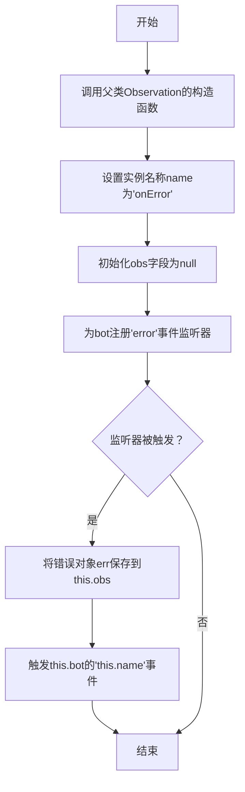
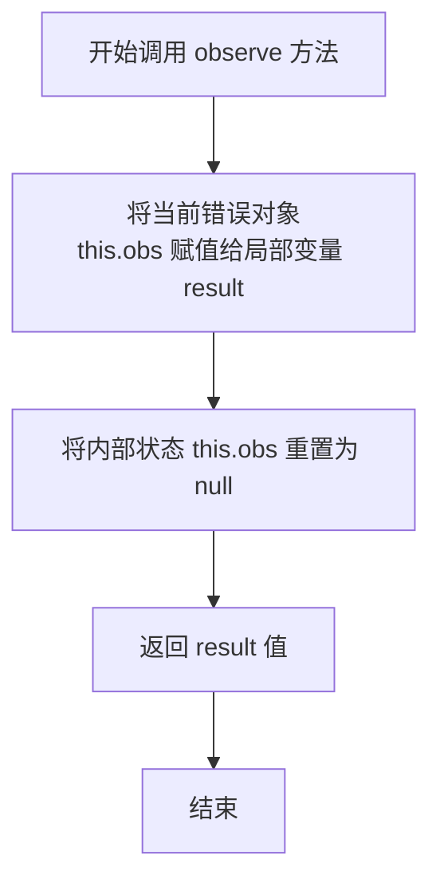

# `.\MetaGPT\metagpt\environment\minecraft\mineflayer\lib\observation\onError.js` 详细设计文档

该代码实现了一个名为 `onError` 的观察者类，用于监听并捕获机器人（bot）实例的 `error` 事件。当错误发生时，该类将错误信息暂存，并通过 `observe` 方法提供对外访问的接口，遵循观察者模式进行事件驱动处理。

## 整体流程

```mermaid
graph TD
    A[onError 类实例化] --> B[注册 bot 的 'error' 事件监听器]
    B --> C{bot 触发 'error' 事件}
    C -- 是 --> D[将错误信息保存到 this.obs]
    D --> E[触发 bot.event('onError') 通知]
    C -- 否 --> F[等待事件]
    G[外部调用 observe()] --> H{this.obs 是否有值?}
    H -- 是 --> I[返回错误信息并清空 this.obs]
    H -- 否 --> J[返回 null]
```

## 类结构

```
Observation (基类，来自 ./base.js)
└── onError (错误观察者类)
```

## 全局变量及字段


### `onError.name`
    
观察器的名称，用于标识该观察器实例。

类型：`string`
    


### `onError.obs`
    
用于临时存储从机器人（bot）接收到的错误对象，在调用 observe 方法后会被清空。

类型：`any`
    
    

## 全局函数及方法

### `onError.constructor`

`onError` 类的构造函数，用于初始化一个错误观察器实例。它继承自 `Observation` 基类，并设置监听机器人（bot）的 `"error"` 事件。当错误事件发生时，它会捕获错误对象，并触发一个自定义事件。

参数：
- `bot`：`Object`，机器人实例，用于监听其错误事件。

返回值：`undefined`，构造函数不显式返回值。

#### 流程图



#### 带注释源码

```javascript
// 定义 onError 类，继承自 Observation 基类
class onError extends Observation {
    // 构造函数，接收一个 bot 参数
    constructor(bot) {
        // 调用父类 Observation 的构造函数，传入 bot 参数
        super(bot);
        // 设置当前观察器的名称为 "onError"
        this.name = "onError";
        // 初始化 obs 字段为 null，用于临时存储观察到的错误对象
        this.obs = null;
        // 为传入的 bot 实例注册一个 "error" 事件监听器
        bot.on("error", (err) => {
            // 当 bot 触发 error 事件时，将错误对象 err 保存到实例的 obs 字段中
            this.obs = err;
            // 通过 bot 实例触发一个名为 this.name（即 "onError"）的自定义事件
            this.bot.event(this.name);
        });
    }

    // observe 方法，用于获取观察到的错误对象
    observe() {
        // 将当前存储的错误对象赋值给局部变量 result
        const result = this.obs;
        // 清空 obs 字段，以便后续观察
        this.obs = null;
        // 返回之前存储的错误对象
        return result;
    }
}

// 导出 onError 类，使其可以被其他模块引入和使用
module.exports = onError;
```


### `onError.observe`

该方法用于获取并清空当前存储的错误观察结果。当机器人触发"error"事件时，错误对象会被暂存，此方法负责返回该对象并重置内部状态，以供外部处理。

参数：
- 无

返回值：`any`，返回最近一次捕获的错误对象。如果自上次调用后未发生新的错误，则返回 `null`。

#### 流程图



#### 带注释源码

```javascript
observe() {
    // 1. 获取当前存储的错误对象
    const result = this.obs;
    // 2. 清空内部存储，为下一次错误事件做准备
    this.obs = null;
    // 3. 返回获取到的错误对象（可能为 null）
    return result;
}
```


## 关键组件


### 错误事件监听器 (onError)

一个用于监听机器人错误事件的观察者类，当机器人触发"error"事件时，捕获并暂存错误信息，供外部通过`observe`方法获取。

### 事件驱动观察者模式

通过继承`Observation`基类并监听特定事件（"error"），实现了事件触发与状态观察的解耦。当事件发生时，内部状态更新并通知外部，外部可在适当时机通过`observe`方法拉取状态。

### 状态暂存与清理机制

在`observe`方法中实现了“读取后清理”的机制。该方法返回当前暂存的错误信息后，立即将内部状态（`this.obs`）重置为`null`，确保错误信息不会被重复消费，并准备接收下一个错误事件。


## 问题及建议


### 已知问题

-   **事件监听器内存泄漏风险**：在构造函数中，每次实例化 `onError` 类都会通过 `bot.on("error", ...)` 注册一个新的事件监听器。如果该类被多次实例化（例如，在热重载或动态创建场景中），会导致同一个错误事件被多个监听器处理，造成内存泄漏和潜在的行为异常（如多次触发 `this.bot.event`）。
-   **观察状态（`this.obs`）的竞态条件**：`observe` 方法在读取 `this.obs` 后会立即将其置为 `null`。如果在极短时间内连续发生多个错误事件，或者 `observe` 方法被异步调用，可能会导致一个错误被覆盖，只能捕获到最后一个错误，丢失之前的错误信息。
-   **缺乏错误信息的持久化或队列机制**：当前设计只能保存最近一次的错误（`this.obs`）。如果错误发生在两次 `observe` 调用之间，或者有多个错误快速连续发生，除了最后一个错误，其他错误信息都会丢失，不利于调试和监控。
-   **基类 `Observation` 的 `observe` 方法语义可能不明确**：`observe` 方法通常意味着“观察”当前状态，但此实现中会清空状态（`this.obs = null`），这更像一个“消费”或“获取并清除”操作。如果其他代码期望 `observe` 是幂等的（多次调用返回相同结果），则会产生意外行为。

### 优化建议

-   **采用单例模式或共享实例**：确保整个应用中对同一个 `bot` 实例只存在一个 `onError` 观察者。可以在模块导出时创建单例，或者通过一个工厂函数/依赖注入容器来管理实例，避免重复注册事件监听器。
-   **实现错误队列**：将 `this.obs` 改为一个错误数组（如 `this.errorQueue = []`）。在事件监听器中将错误推入队列，在 `observe` 方法中返回并清空整个队列（或返回队列的副本）。这样可以确保捕获到所有错误，避免信息丢失。
-   **增加错误信息的丰富化处理**：在保存错误对象时，可以同时记录时间戳、上下文信息（如当前的游戏状态、玩家信息等），使错误日志更具可读性和可调试性。
-   **明确方法命名和职责**：考虑将 `observe` 方法重命名为更贴切的名称，如 `getAndClearError` 或 `popError`，以明确其“消费”行为。或者，提供两个方法：一个 `peekError`（查看但不清除）和一个 `clearError`（清除错误状态）。
-   **增加错误事件的去重或节流机制**：如果 `bot` 可能短时间内抛出大量相同或类似的错误，可以考虑在事件监听器中加入去重逻辑或节流机制，避免队列过快膨胀或重复处理。
-   **考虑继承结构的合理性**：评估 `onError` 作为 `Observation` 子类的合理性。如果 `Observation` 基类主要用于周期性或持续性的状态观察，而错误处理是事件驱动的、一次性的，可能需要重新考虑这种继承关系，或调整基类的设计以更好地适应事件驱动模型。


## 其它


### 设计目标与约束

本模块的设计目标是创建一个可复用的、事件驱动的错误观察器（Observation），用于捕获并临时存储机器人（bot）实例在运行过程中触发的错误事件。其核心约束包括：必须继承自基类 `Observation` 以遵循既定的观察者模式接口；必须与特定的机器人实例（通过构造函数注入）绑定，并监听其 `"error"` 事件；必须实现 `observe` 方法以提供一种“一次性消费”错误信息的方式，即读取后清空内部状态。

### 错误处理与异常设计

本模块自身不主动抛出异常。其主要职责是作为错误事件的监听者和缓存者。错误事件由外部 `bot` 对象触发并传递。`observe` 方法的设计确保了错误信息的单次读取性，防止同一错误被重复处理。如果 `observe` 在无新错误时被调用，它将返回 `null`。模块没有对接收到的错误对象（`err`）进行任何验证、转换或封装，错误处理的责任被委托给了调用 `observe` 方法的客户端代码。

### 数据流与状态机

数据流始于 `bot` 对象触发的 `"error"` 事件，事件负载（错误对象 `err`）被捕获并赋值给实例的 `this.obs` 字段。此时模块状态从“无错误”转变为“有待观察的错误”。当外部调用 `observe()` 方法时，方法返回 `this.obs` 的当前值（可能是一个错误对象或 `null`），并立即将 `this.obs` 重置为 `null`，状态回归“无错误”。这是一个简单的“写入-读取-清除”单状态缓存模型，状态转换由事件监听器和方法调用驱动。

### 外部依赖与接口契约

1.  **基类依赖**：强依赖于 `./base.js` 模块导出的 `Observation` 基类。必须实现基类定义的构造函数和 `observe` 方法。
2.  **事件源依赖**：依赖通过构造函数注入的 `bot` 对象。该对象必须是一个 EventEmitter 或具有兼容接口（即拥有 `on` 方法用于监听事件，以及可能拥有 `event` 方法用于触发事件）。本模块与 `bot` 的契约是监听其 `"error"` 事件。
3.  **导出契约**：模块导出一个类（`onError`），供外部进行实例化。实例化时必须传入一个符合上述要求的 `bot` 对象。

### 并发与线程安全考虑

本模块设计用于 Node.js 的单线程事件循环环境。然而，如果 `bot` 的 `"error"` 事件可能在高并发下快速连续触发（尽管对于错误事件这不常见），则存在竞态条件风险：在 `observe()` 方法执行 `const result = this.obs;` 和 `this.obs = null;` 之间，如果新的错误事件到达并执行 `this.obs = err;`，则新错误会被立即清除，导致丢失。这是一个潜在的技术债务。在需要高可靠性的场景下，应考虑使用线程安全的数据结构或锁机制来保护 `this.obs` 的访问。

### 配置与可扩展性

当前模块没有任何可配置参数（如错误过滤、格式化、忽略特定错误类型等），其行为是固定的。这限制了其可扩展性。例如，无法仅监听特定类型的错误，或对错误信息进行预处理。优化方向可以包括：在构造函数中接受一个配置对象，允许传入错误过滤器（function）或错误转换器（function）；或者提供子类化钩子（protected 方法）让子类可以重写错误处理逻辑。


    