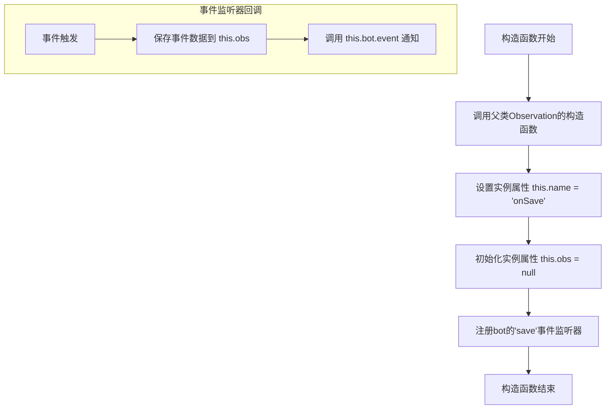
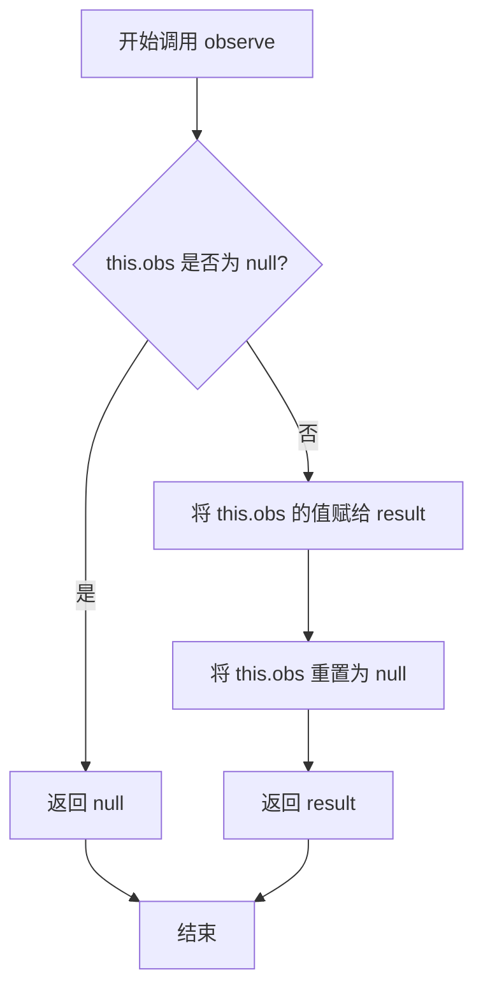

# `.\MetaGPT\metagpt\environment\minecraft\mineflayer\lib\observation\onSave.js` 详细设计文档

该文件定义了一个名为 `onSave` 的观察者类，它继承自 `Observation` 基类。其核心功能是监听机器人（`bot`）的 `'save'` 事件，当事件触发时，捕获事件数据（`eventName`）并暂存。外部可以通过调用 `observe` 方法获取最近一次捕获的事件数据，并在获取后清空暂存区，实现了一种一次性的、事件驱动的数据观察机制。

## 整体流程

```mermaid
graph TD
    A[onSave 类实例化] --> B[注册 bot.on('save') 事件监听器]
    C[外部触发 bot.emit('save', eventName)] --> D[监听器回调执行]
    D --> E[将 eventName 存入 this.obs]
    E --> F[调用 this.bot.event(this.name) 通知观察就绪]
    G[外部调用 observe() 方法] --> H{this.obs 是否为 null?}
    H -- 否 --> I[返回 this.obs 的值]
    I --> J[将 this.obs 重置为 null]
    H -- 是 --> K[返回 null]
```

## 类结构

```
Observation (基类，来自 ./base.js)
└── onSave (事件观察者类)
```

## 全局变量及字段


### `onSave.name`
    
观察者的名称，用于标识该观察实例，此处固定为'onSave'。

类型：`string`
    


### `onSave.obs`
    
用于临时存储从bot的'save'事件中接收到的实体状态信息（eventName），在observe方法被调用后会被重置为null。

类型：`string | null`
    
    

## 全局函数及方法

### `onSave.constructor`

`onSave` 类的构造函数，用于初始化一个监听 `bot` 对象 `"save"` 事件的观察者实例。当 `"save"` 事件被触发时，它会捕获事件数据并通知 `bot` 对象。

参数：
- `bot`：`Object`，一个事件发射器对象，`onSave` 实例将监听其 `"save"` 事件。

返回值：`undefined`，构造函数不返回值。

#### 流程图



#### 带注释源码

```javascript
// onSave 类的构造函数
constructor(bot) {
    // 1. 调用父类 Observation 的构造函数，传入 bot 对象
    super(bot);
    
    // 2. 设置当前观察者的名称为 "onSave"
    this.name = "onSave";
    
    // 3. 初始化内部状态变量 obs，用于临时存储捕获到的事件数据
    this.obs = null;
    
    // 4. 为传入的 bot 对象注册一个 "save" 事件监听器
    bot.on("save", (eventName) => {
        // 当 "save" 事件被触发时，执行此回调函数
        // 4.1 将事件携带的数据（eventName）保存到实例变量 this.obs 中
        this.obs = eventName;
        
        // 4.2 通过父类方法 this.bot.event 发出一个通知，告知 bot 当前观察者（this.name）有数据更新
        this.bot.event(this.name);
    });
}
```


### `onSave.observe`

该方法用于获取并清空当前保存的事件名称。它是`onSave`观察者类的核心方法，当机器人触发“save”事件时，事件名称被暂存，通过调用此方法可以取出该名称并重置内部状态，以便接收下一次事件。

参数：
- 无

返回值：`string | null`，返回最近一次“save”事件的事件名称。如果自上次调用`observe`后没有新事件发生，则返回`null`。

#### 流程图



#### 带注释源码

```javascript
observe() {
    // 1. 获取当前暂存的事件名称
    const result = this.obs;
    // 2. 清空暂存区，为接收下一个事件做准备
    this.obs = null;
    // 3. 返回获取到的事件名称（可能为 null）
    return result;
}
```


## 关键组件


### 事件监听与处理组件

该组件通过继承 `Observation` 基类，实现了对特定事件（`"save"`）的监听。当事件触发时，组件将事件携带的数据（`eventName`）暂存于内部状态变量（`this.obs`）中，并通知观察者系统（`this.bot.event`）有新的观察结果可用。

### 状态管理与数据传递组件

该组件通过 `observe` 方法实现了对暂存状态（`this.obs`）的惰性读取与清理。调用 `observe` 方法会返回当前保存的事件数据，并在返回后立即将内部状态重置为空（`null`），确保了数据的一次性消费和状态的安全管理，防止了旧数据的残留。


## 问题及建议


### 已知问题

-   **事件监听器未移除**：在 `constructor` 中通过 `bot.on("save", ...)` 注册的事件监听器，在类的生命周期内（例如实例被销毁时）没有对应的移除机制。如果创建了多个 `onSave` 实例，会导致同一事件被重复监听，可能引发内存泄漏或逻辑错误。
-   **潜在的竞态条件**：`observe` 方法在读取 `this.obs` 后会立即将其置为 `null`。如果在极短时间内连续触发两次 `"save"` 事件，且第一次的 `observe` 调用尚未发生，那么第一次的事件数据（`this.obs`）将被第二次事件的数据覆盖，导致第一次事件的数据丢失。
-   **有限的观察能力**：当前设计只能保存并返回最近一次 `"save"` 事件的数据。如果 `observe` 方法没有被及时调用，历史事件数据将被丢弃，无法处理事件爆发或观察者消费速度慢于生产速度的场景。

### 优化建议

-   **实现资源清理接口**：为类添加一个 `destroy` 或 `cleanup` 方法，在该方法中调用 `bot.removeListener` 来移除在构造函数中注册的事件监听器。确保在实例不再需要时能够正确释放资源。
-   **使用队列缓冲事件数据**：将 `this.obs` 从单个值改为一个数组（队列）`this.eventQueue`。在事件监听回调中将事件数据 `push` 到队列中。在 `observe` 方法中，从队列头部 `shift` 出一个值返回。这样可以避免数据被覆盖，并能够按顺序处理多个未消费的事件。
-   **增加容量限制与丢弃策略**：如果使用队列，应考虑设置最大长度。当队列满时，可以定义策略，如丢弃最旧的事件、丢弃最新的事件或抛出错误，以防止无限制的内存增长。
-   **考虑异步或流式接口**：如果业务场景复杂，可以考虑将 `observe` 方法改为返回 `Promise` 或使用 `AsyncGenerator`，以更好地支持异步事件流处理。
-   **增强错误处理**：在事件监听回调中，可以考虑添加 `try...catch` 块，防止回调中的异常导致整个事件监听器崩溃，并将错误信息妥善记录或通过特定渠道上报。


## 其它


### 设计目标与约束

该模块的设计目标是创建一个可复用的观察者类，用于监听并响应Minecraft机器人（bot）的“save”事件。其核心约束包括：必须继承自基类Observation以遵循既定的观察者模式；必须实现`observe()`方法以提供事件数据的获取接口；事件处理需异步触发，并在观察后清空临时状态，以避免重复处理。

### 错误处理与异常设计

当前代码未显式包含错误处理逻辑。潜在风险包括：`bot.on`事件监听器注册失败，或`this.bot.event`调用时`bot`对象状态异常。优化方向是：在构造函数中添加`try-catch`块包裹事件监听器注册过程；在`observe()`方法中，若`this.obs`为`null`时返回明确的默认值（如`undefined`）或抛出自定义异常，以区分“无事件”和“逻辑错误”状态。

### 数据流与状态机

数据流始于外部`bot`对象触发的“save”事件，事件数据（`eventName`）被捕获并存储于实例字段`this.obs`中。随后，通过调用`this.bot.event(this.name)`通知外部系统。状态机包含两个核心状态：**等待状态**（`this.obs`为`null`）和**就绪状态**（`this.obs`存储了事件数据）。调用`observe()`方法后，状态从“就绪”转换回“等待”，并返回捕获的数据。

### 外部依赖与接口契约

1.  **外部依赖**：
    *   `./base.js`模块：必须导出`Observation`基类。
    *   `bot`对象：必须是一个EventEmitter实例，支持`on(eventName, callback)`方法用于注册事件监听器，以及`event(eventName)`方法用于触发事件。
2.  **接口契约**：
    *   **构造函数**：接受一个`bot`对象作为参数。
    *   **`observe()`方法**：无参数，返回最近一次“save”事件的数据（类型为构造函数中`eventName`的类型），调用后内部状态重置。这是对基类`Observation.observe()`抽象方法的具体实现。

### 测试策略建议

1.  **单元测试**：应模拟（mock）`bot`对象，验证其`on`方法是否被正确调用，以及当模拟事件触发时，`observe()`方法是否返回预期值且状态被正确清空。
2.  **集成测试**：将`onSave`实例与一个真实的或高度仿真的`bot`对象集成，测试完整的事件监听、存储和观察流程。
3.  **边界测试**：测试在未触发“save”事件前调用`observe()`，应返回`null`或设计约定的默认值。

### 配置与扩展性

当前模块无外部配置项。其扩展性主要体现在：
1.  通过继承`Observation`基类，可遵循同一模式创建监听其他事件（如“chat”, “spawn”）的观察者。
2.  若未来需要持久化事件数据或进行复杂处理，可在`observe()`方法返回前或构造函数的事件回调中添加相应逻辑，但需注意保持接口的简洁性。


    