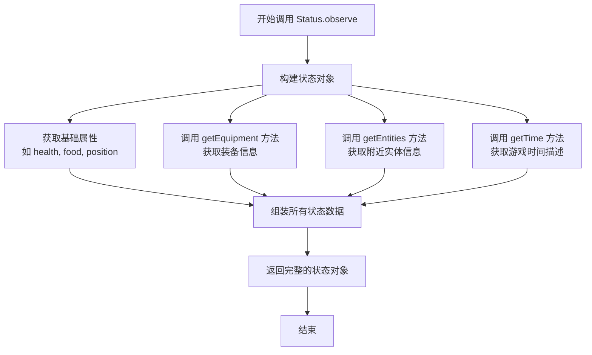
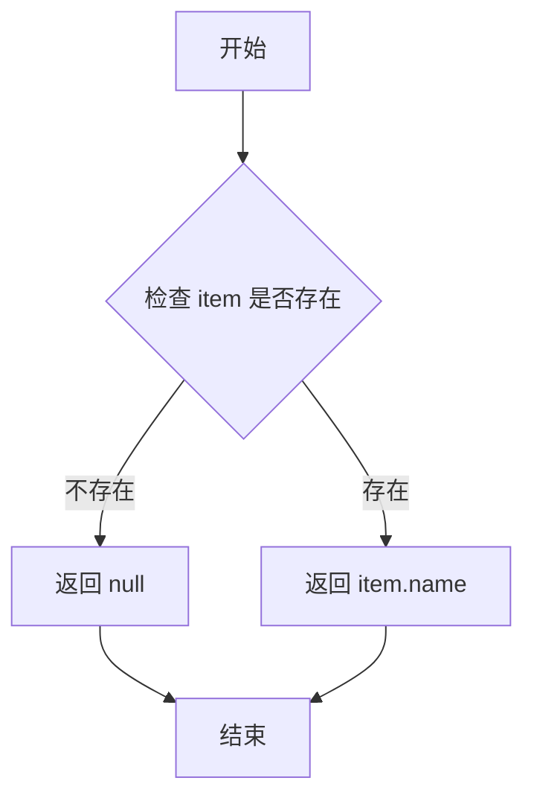
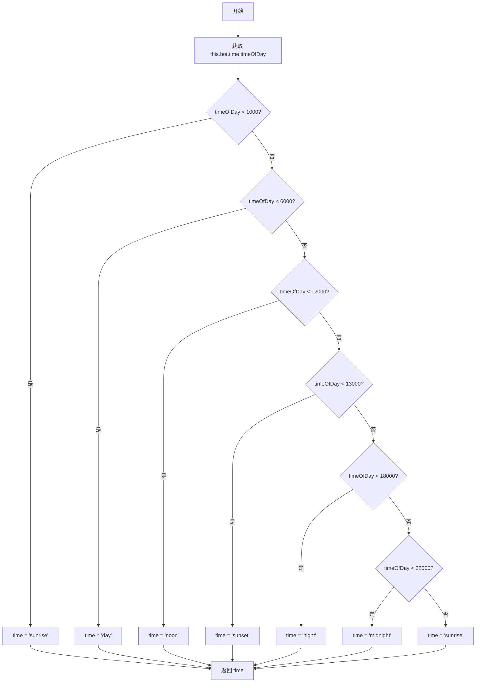

# `.\MetaGPT\metagpt\environment\minecraft\mineflayer\lib\observation\status.js` 详细设计文档

该文件定义了一个名为 Status 的类，它继承自 Observation 基类。其核心功能是作为一个 Minecraft 游戏机器人的状态观察器，通过访问机器人的内部属性（如生命值、饥饿值、位置、装备、周围实体等），将这些游戏状态信息收集、转换并组织成一个结构化的 JSON 对象，以供上层决策系统（如AI）使用。

## 整体流程

```mermaid
graph TD
    A[外部调用 Status.observe()] --> B[收集基础状态]
    B --> C[调用 getEquipment()]
    C --> D[遍历装备槽位]
    D --> E[通过 itemToObs 转换物品]
    B --> F[调用 getEntities()]
    F --> G[遍历附近实体]
    G --> H{过滤玩家和物品实体}
    H -- 是 --> I[计算并记录最近距离]
    H -- 否 --> J[跳过]
    B --> K[调用 getTime()]
    K --> L[根据游戏时间转换为时间段]
    B --> M[整合所有数据]
    M --> N[返回结构化状态对象]
```

## 类结构

```
Observation (基类，来自 ./base.js)
└── Status (状态观察器)
```

## 全局变量及字段


### `Status.name`
    
Observation 的名称，用于标识此观察类型。

类型：`string`
    
    

## 全局函数及方法


### `Status.constructor`

`Status` 类的构造函数，用于初始化一个状态观察器实例。它接收一个 `bot` 对象作为参数，调用父类 `Observation` 的构造函数，并设置当前观察器的名称为 "status"。

参数：

-  `bot`：`Object`，一个代表游戏内机器人（Bot）的对象，提供了访问游戏状态、实体、物品栏等信息的接口。

返回值：`undefined`，构造函数不显式返回值。

#### 流程图

```mermaid
flowchart TD
    A[开始] --> B[接收 bot 参数]
    B --> C[调用 super(bot) 初始化父类]
    C --> D[设置 this.name = 'status']
    D --> E[结束]
```

#### 带注释源码

```
class Status extends Observation {
    // 构造函数，用于初始化 Status 实例
    constructor(bot) {
        // 调用父类 Observation 的构造函数，传入 bot 对象
        super(bot);
        // 设置当前观察器的名称为 "status"
        this.name = "status";
    }
    // ... 类的其他方法
}
```


### `Status.observe`

该方法用于收集并返回游戏机器人（bot）当前的状态快照，包括生命值、位置、装备、周围实体、游戏时间等综合信息。

参数：该方法没有显式定义的参数。

返回值：`Object`，一个包含机器人当前各种状态属性的JavaScript对象。

#### 流程图



#### 带注释源码

```javascript
observe() {
    // 返回一个对象，该对象包含了机器人当前的各种状态信息
    return {
        // 基础生存状态
        health: this.bot.health, // 生命值
        food: this.bot.food, // 饥饿值
        saturation: this.bot.foodSaturation, // 饱和度
        oxygen: this.bot.oxygenLevel, // 氧气水平（用于水下）
        // 位置与运动状态
        position: this.bot.entity.position, // 三维坐标位置
        velocity: this.bot.entity.velocity, // 速度向量
        yaw: this.bot.entity.yaw, // 偏航角（水平朝向）
        pitch: this.bot.entity.pitch, // 俯仰角（垂直朝向）
        onGround: this.bot.entity.onGround, // 是否在地面上
        timeSinceOnGround: this.bot.entity.timeSinceOnGround, // 离地时间
        // 环境碰撞与状态
        isInWater: this.bot.entity.isInWater, // 是否在水中
        isInLava: this.bot.entity.isInLava, // 是否在熔岩中
        isInWeb: this.bot.entity.isInWeb, // 是否在蜘蛛网中
        isCollidedHorizontally: this.bot.entity.isCollidedHorizontally, // 是否水平碰撞
        isCollidedVertically: this.bot.entity.isCollidedVertically, // 是否垂直碰撞
        // 装备与物品
        equipment: this.getEquipment(), // 调用方法获取装备栏物品名称列表
        inventoryUsed: this.bot.inventoryUsed(), // 已使用的背包格子数
        // 实体信息
        name: this.bot.entity.username, // 机器人玩家名
        entities: this.getEntities(), // 调用方法获取附近非玩家实体的距离映射
        // 世界与环境信息
        biome: this.bot.blockAt(this.bot.entity.position) // 获取脚下方块
            ? this.bot.blockAt(this.bot.entity.position).biome.name // 如果方块存在，获取其生物群系名称
            : "None", // 否则返回"None"
        timeOfDay: this.getTime(), // 调用方法获取基于游戏刻的昼夜时段描述
        // 系统与计时信息
        elapsedTime: this.bot.globalTickCounter, // 全局游戏刻计数器
    };
}
```


### `Status.itemToObs`

该方法用于将游戏中的物品对象转换为其名称字符串，以便于观察和记录。如果物品不存在，则返回 `null`。

参数：

- `item`：`Object`，表示游戏中的物品对象，可能包含名称、类型等信息。

返回值：`String` 或 `null`，返回物品的名称字符串，如果物品不存在则返回 `null`。

#### 流程图



#### 带注释源码

```javascript
// 将物品对象转换为可观察的名称字符串
itemToObs(item) {
    // 如果物品不存在，返回 null
    if (!item) return null;
    // 返回物品的名称
    return item.name;
}
```


### `Status.getTime`

该方法根据游戏内的时间值（`timeOfDay`）将其映射为一天中的某个时段（如“日出”、“白天”、“午夜”等）的字符串描述。

参数：
- 无

返回值：`String`，表示当前游戏时间对应的时段名称。

#### 流程图



#### 带注释源码

```javascript
getTime() {
    // 从 bot 对象中获取当前游戏时间（timeOfDay），这是一个从0开始的整数值。
    const timeOfDay = this.bot.time.timeOfDay;
    let time = "";

    // 使用一系列条件判断，将 timeOfDay 的数值范围映射到具体的时段字符串。
    if (timeOfDay < 1000) {
        time = "sunrise"; // 黎明/日出
    } else if (timeOfDay < 6000) {
        time = "day"; // 白天
    } else if (timeOfDay < 12000) {
        time = "noon"; // 正午
    } else if (timeOfDay < 13000) {
        time = "sunset"; // 日落
    } else if (timeOfDay < 18000) {
        time = "night"; // 夜晚
    } else if (timeOfDay < 22000) {
        time = "midnight"; // 午夜
    } else {
        // 当 timeOfDay >= 22000 时，时间循环回到日出
        time = "sunrise";
    }
    // 返回映射后的时段字符串
    return time;
}
```


### `Status.getEquipment`

该方法用于获取机器人的装备信息。它从机器人的库存槽位中提取特定的装备槽（包括主手和副手），并将每个槽位的物品转换为可观察的名称（如果存在物品），否则返回 `null`。

参数：无

返回值：`Array<string | null>`，一个数组，包含装备槽中每个物品的名称（如果存在），否则为 `null`。

#### 流程图

```mermaid
flowchart TD
    A[开始] --> B[获取机器人库存槽位 slots]
    B --> C[获取当前手持物品 mainHand]
    C --> D[提取 slots 索引 5 到 8 的槽位<br>（装备槽：头盔、胸甲、护腿、靴子）]
    D --> E[将 mainHand 和 slots[45]（副手）<br>添加到装备槽数组]
    E --> F[对每个槽位调用 itemToObs 方法<br>转换为物品名称或 null]
    F --> G[返回转换后的数组]
    G --> H[结束]
```

#### 带注释源码

```javascript
    // 获取机器人的装备信息
    getEquipment() {
        // 获取机器人所有库存槽位
        const slots = this.bot.inventory.slots;
        // 获取当前手持（主手）物品
        const mainHand = this.bot.heldItem;
        // 1. 提取 slots 数组中索引 5 到 8 的元素（通常对应装备槽：头盔、胸甲、护腿、靴子）
        // 2. 将主手物品 (mainHand) 和副手物品 (slots[45]) 添加到这个数组中
        // 3. 使用 map 方法遍历这个新数组，对每个元素调用 itemToObs 方法
        //    itemToObs 方法会检查物品是否存在，存在则返回物品名称，否则返回 null
        return slots
            .slice(5, 9)
            .concat(mainHand, slots[45])
            .map(this.itemToObs);
    }
```


### `Status.getEntities`

该方法用于获取机器人周围32格范围内的非玩家、非物品实体，并按实体类型（名称）分组，记录每种类型中距离机器人最近的实体的距离。

参数：
- 无显式参数，但方法内部使用 `this.bot.entities` 作为数据源。

返回值：`Object`，一个对象，其键（key）为实体类型名称（如 `"zombie"`, `"creeper"`），值为该类型实体中距离机器人最近的实体的距离（浮点数）。

#### 流程图

```mermaid
flowchart TD
    A[开始] --> B{this.bot.entities 存在?}
    B -- 否 --> C[返回空对象 {}]
    B -- 是 --> D[初始化空对象 mobs]
    D --> E[遍历 entities 中的每个实体]
    E --> F{实体有 displayName?}
    F -- 否 --> E
    F -- 是 --> G{实体是玩家或物品?}
    G -- 是 --> E
    G -- 否 --> H{实体距离 < 32?}
    H -- 否 --> E
    H -- 是 --> I{实体类型已存在于 mobs?}
    I -- 否 --> J[记录新类型及距离]
    I -- 是 --> K{新距离 < 已记录距离?}
    K -- 是 --> L[更新为更小的距离]
    K -- 否 --> E
    J --> E
    L --> E
    E --> M[遍历结束]
    M --> N[返回 mobs 对象]
```

#### 带注释源码

```javascript
    getEntities() {
        // 获取机器人视野内所有实体的映射对象
        const entities = this.bot.entities;
        // 如果实体映射不存在，返回空对象
        if (!entities) return {};
        // 初始化一个空对象，用于存储按类型分组的最近实体距离
        const mobs = {};
        // 遍历实体映射中的所有实体ID
        for (const id in entities) {
            // 获取当前ID对应的实体对象
            const entity = entities[id];
            // 如果实体没有显示名称（可能是一些非生物实体），跳过
            if (!entity.displayName) continue;
            // 如果实体是玩家或物品，跳过
            if (entity.name === "player" || entity.name === "item") continue;
            // 计算实体与机器人之间的距离
            // 如果距离小于32格，则进行处理
            if (entity.position.distanceTo(this.bot.entity.position) < 32) {
                // 检查当前实体类型是否已存在于mobs对象中
                if (!mobs[entity.name]) {
                    // 如果不存在，则添加该类型，并记录当前距离
                    mobs[entity.name] = entity.position.distanceTo(
                        this.bot.entity.position
                    );
                } else if (
                    // 如果已存在，则比较当前距离与已记录的距离
                    mobs[entity.name] >
                    entity.position.distanceTo(this.bot.entity.position)
                ) {
                    // 如果当前距离更小，则更新记录为更小的距离
                    mobs[entity.name] = entity.position.distanceTo(
                        this.bot.entity.position
                    );
                }
            }
        }
        // 返回包含实体类型及其最近距离的对象
        return mobs;
    }
```


## 关键组件


### 状态观察器 (Status Observer)

继承自基础观察器类 (Observation)，负责收集和聚合游戏机器人的实时状态信息，包括生命值、位置、装备、周围实体、游戏时间等，并将其封装为一个结构化的观察对象。

### 实体数据提取与聚合 (Entity Data Extraction and Aggregation)

通过遍历游戏世界中的实体列表，筛选出非玩家、非物品的敌对或中立生物，并计算它们与机器人的最近距离，最终聚合为一个以生物类型为键、最近距离为值的字典对象。

### 装备信息映射 (Equipment Information Mapping)

将机器人的装备栏（包括主手、副手、盔甲栏）中的物品对象，通过一个映射函数转换为对应的物品名称字符串，对于空槽位则返回 null，从而生成一个简洁的装备状态列表。

### 游戏时间分类器 (Game Time Classifier)

根据游戏内的时间刻度 (timeOfDay) 将一天划分为多个阶段（如日出、白天、正午、日落、夜晚、午夜），并返回对应的阶段名称字符串，用于提供时间上下文信息。


## 问题及建议

### 已知问题

-   **硬编码的装备槽位索引**：`getEquipment` 方法中使用了硬编码的索引（如 `slots.slice(5, 9)` 和 `slots[45]`）来获取装备。这依赖于特定的 Minecraft 客户端或库的内部实现细节，如果底层库的槽位索引发生变化，此代码将失效。
-   **`getTime` 方法逻辑不精确**：该方法将游戏内时间（`timeOfDay`）映射为字符串描述（如“day”、“night”）。其边界条件（如 `timeOfDay < 1000` 为“sunrise”）可能不准确或不符合所有游戏版本或模组的设定，且最后一个 `else` 分支将 `22000` 及以上的时间也归为“sunrise”，逻辑上存在重叠。
-   **`getEntities` 方法中的距离计算冗余**：在 `getEntities` 方法的循环中，`entity.position.distanceTo(this.bot.entity.position)` 被重复计算了最多三次（一次在条件判断，两次在更新 `mobs` 字典时），存在性能浪费。
-   **潜在的 `blockAt` 调用返回 `null`**：在获取 `biome` 属性时，代码直接调用 `this.bot.blockAt(...).biome.name`，如果 `blockAt` 返回 `null`（例如位置无效或区块未加载），将导致 `TypeError: Cannot read properties of null (reading 'biome')` 错误。虽然使用了三元运算符，但逻辑是检查 `this.bot.blockAt` 方法是否存在，而非检查其返回值，这并不能防止上述错误。
-   **`getEntities` 方法可能忽略部分实体**：方法中跳过了 `entity.name === "player"` 和 `entity.name === "item"` 的实体。如果观察逻辑需要包含玩家或掉落物信息，这将导致数据不完整。同时，对于没有 `displayName` 的实体（如某些装饰性实体）也会被跳过，这可能是有意为之，但缺乏明确注释。
-   **`observe` 方法返回对象庞大且可能包含冗余数据**：该方法返回了大量状态信息，但并非所有调用者都需要全部字段。这可能导致不必要的数据传输和内存占用，尤其是在高频调用时。

### 优化建议

-   **抽象装备槽位获取逻辑**：建议将装备槽位的索引定义提取为类常量或配置文件，或者通过库提供的、更稳定的API（如果存在）来获取装备，以提高代码的可维护性和对底层变化的适应性。
-   **重构 `getTime` 方法以提高可读性和可配置性**：可以将时间区间与描述的映射关系提取为一个配置数组或字典，使逻辑更清晰，也便于未来调整时间划分。同时，应确保区间划分互斥且覆盖完整范围。
-   **优化 `getEntities` 方法中的距离计算**：在循环内部，将 `const distance = entity.position.distanceTo(this.bot.entity.position);` 计算一次并存储，然后在条件判断和更新 `mobs` 字典时复用该值，避免重复计算。
-   **安全地访问 `blockAt` 的返回值**：修改 `biome` 属性的获取逻辑，先调用 `blockAt` 并检查其返回值是否为有效对象，再尝试访问其 `biome.name` 属性。例如：`const block = this.bot.blockAt(this.bot.entity.position); this.biome = block ? block.biome.name : “Unknown”;`。
-   **明确 `getEntities` 的过滤策略并考虑可配置性**：在代码中添加注释，说明为何跳过玩家、物品和无显示名称的实体。如果未来需求变化，可以考虑将需要排除的实体类型列表作为可配置项。
-   **考虑按需观察或分块返回数据**：评估是否所有调用者都需要 `observe` 返回的全部字段。如果不需要，可以设计更细粒度的观察方法（如 `observeHealth`, `observePosition`），或者允许调用者通过参数指定需要的字段子集，以减少不必要的数据处理。

## 其它


### 设计目标与约束

该模块的核心设计目标是提供一个轻量级、可扩展的机器人状态观测器。它继承自一个通用的 `Observation` 基类，旨在从 Minecraft 游戏客户端（通过 `mineflayer` 库）中收集并结构化机器人的实时状态信息，以供上层决策系统（如AI代理）使用。主要约束包括：1) 性能敏感，观测方法需快速执行以避免阻塞主循环；2) 数据一致性，观测到的状态应尽可能反映同一逻辑时刻的游戏快照；3) 可读性，输出的状态对象应结构清晰，便于解析。

### 错误处理与异常设计

当前代码中缺乏显式的错误处理机制。`observe()` 方法及其辅助方法（`getEquipment`, `getEntities`, `getTime`）在访问 `this.bot` 对象的属性时，如果 `bot` 对象状态异常（如未完全初始化、断开连接），可能导致 `TypeError`（例如访问 `undefined` 的属性）。`bot.blockAt` 方法可能返回 `null`，代码已通过三元运算符进行了处理。建议的改进是：在 `observe()` 方法入口处增加对 `this.bot` 及其关键属性（如 `this.bot.entity`）的非空检查，或使用 `try...catch` 包裹核心逻辑，返回一个包含错误信息的默认观测状态，确保观测系统的鲁棒性。

### 数据流与状态机

数据流是单向的：外部调用者（如主控制循环）触发 `status.observe()` 方法。该方法作为唯一入口，内部按顺序调用 `getEquipment()`、`getEntities()`、`getTime()` 等私有方法，从 `this.bot` 实例中拉取原始数据，并通过 `itemToObs` 等方法进行数据转换和过滤，最终汇聚并返回一个纯 JavaScript 对象。该对象代表了机器人当前时刻的状态快照。模块本身不维护内部状态（无状态），每次调用 `observe()` 都基于 `bot` 的实时数据生成新的观测结果。`bot` 对象本身的状态由外部框架管理。

### 外部依赖与接口契约

1.  **父类依赖**：强依赖于 `./base.js` 模块导出的 `Observation` 基类。`Status` 类必须实现基类定义的 `observe()` 接口。
2.  **Bot 对象依赖**：强依赖于通过构造函数注入的 `bot` 对象。该对象预期为 `mineflayer` 创建的机器人实例，需提供代码中所访问的所有属性和方法（如 `bot.health`、`bot.entity`、`bot.inventory.slots`、`bot.entities`、`bot.time`、`bot.blockAt` 等）。这是模块的核心外部依赖契约。
3.  **数据格式契约**：`observe()` 方法返回的对象结构构成了对上游调用者的输出契约。任何对此对象字段的增删或类型修改都将破坏下游消费者的兼容性。

### 性能考量

1.  **`getEntities` 方法**：包含一个对 `this.bot.entities` 对象的 `for...in` 循环，并对每个实体计算距离。当实体数量很多时（如服务器人多或生物群系密集），可能成为性能瓶颈。目前通过距离检查（<32）进行了过滤，但循环本身仍有开销。
2.  **数据序列化**：`observe()` 返回一个包含大量属性的新对象。如果调用频率极高（如每 tick），可能会产生显著的垃圾回收压力。
3.  **优化建议**：a) 考虑将 `getEntities` 中的距离计算和过滤逻辑移至需要时再计算，或进行采样。b) 评估是否所有状态都需要每 tick 更新，可以对部分变化缓慢的状态（如 `biome`）进行缓存。c) 如果上游系统只需要部分状态，可以提供更细粒度的观测方法。

### 可测试性

当前代码与 `mineflayer` 的 `bot` 对象紧密耦合，难以进行单元测试。为了提高可测试性，可以：
1.  将 `bot` 对象的依赖抽象为一个接口（例如 `IBotContext`），在测试时注入模拟对象（Mock）。
2.  将 `getTime()` 等纯逻辑函数提取为静态工具函数，便于独立测试。
3.  为 `observe()` 方法设计测试用例，验证在不同 `bot` 状态（健康值低、特定装备、附近有实体等）下输出对象的正确性。

### 配置与扩展点

目前模块行为是硬编码的，缺乏配置性。可能的扩展点包括：
1.  **观测范围**：`getEntities` 方法中的距离阈值（32）可以设计为可配置参数。
2.  **过滤规则**：哪些实体类型需要被观测、装备槽位的映射逻辑可以外部化。
3.  **时间分段**：`getTime` 方法中的时间区间划分可以配置。
4.  可以通过构造函数接收一个配置对象，或在基类 `Observation` 中定义配置机制，使 `Status` 类更具灵活性。

    