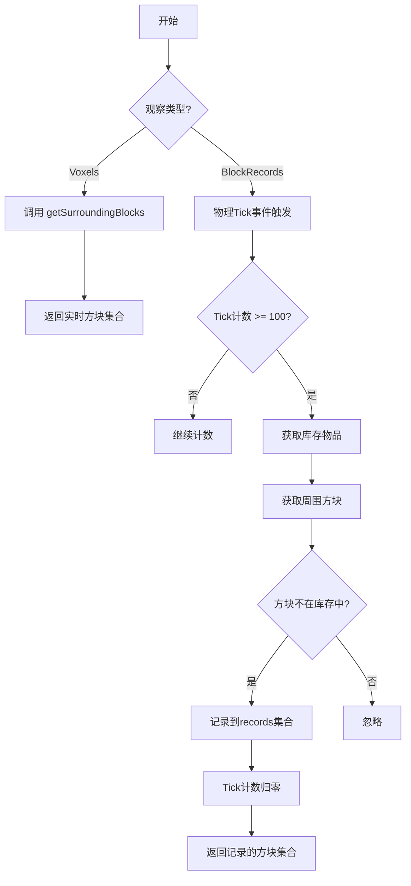
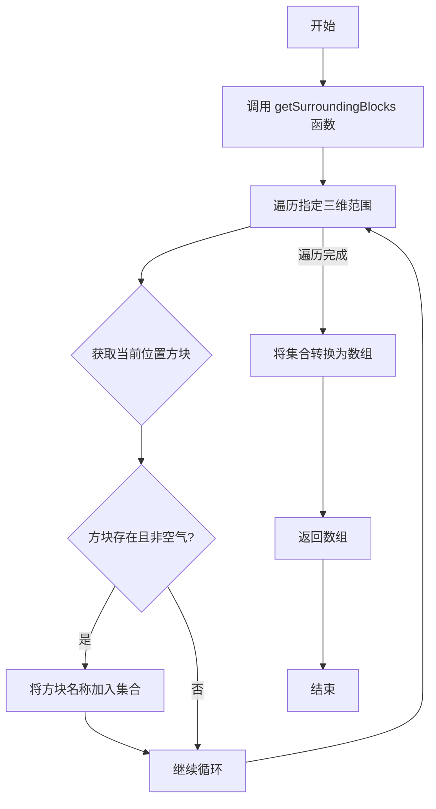
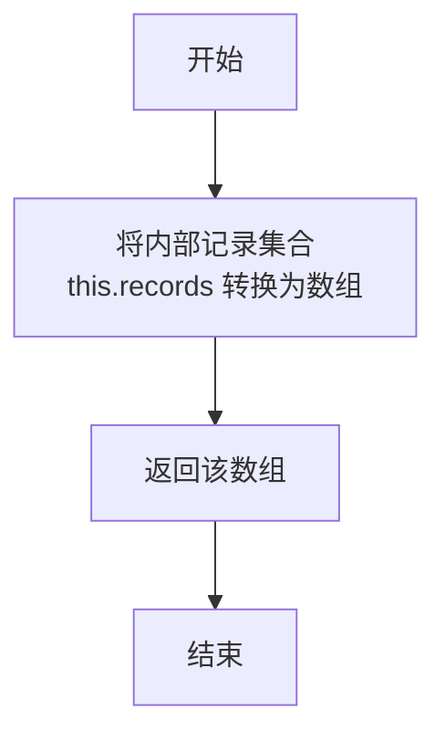
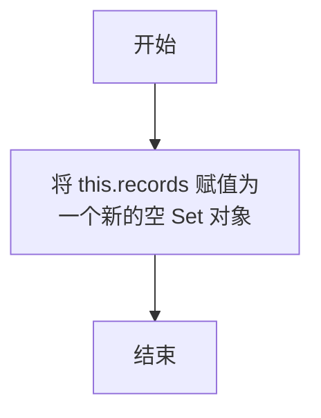

# `.\MetaGPT\metagpt\environment\minecraft\mineflayer\lib\observation\voxels.js` 详细设计文档

该代码定义了两个用于Minecraft机器人（bot）环境感知的观察类（Voxels和BlockRecords），它们继承自一个基础的Observation类。Voxels类用于实时获取机器人周围指定范围内的方块信息，而BlockRecords类则周期性地记录机器人周围存在但库存中没有的方块，用于长期的环境记忆。代码还包含两个工具函数，用于获取周围方块和库存物品。

## 整体流程



## 类结构

```
Observation (基类，来自./base)
├── Voxels (实时体素观察)
└── BlockRecords (周期性方块记录观察)
```

## 全局变量及字段


### `Voxels.name`
    
观察类型的标识符，固定为'voxels'。

类型：`string`
    


### `BlockRecords.name`
    
观察类型的标识符，固定为'blockRecords'。

类型：`string`
    


### `BlockRecords.records`
    
用于存储机器人库存中没有的周围方块名称的集合。

类型：`Set<string>`
    


### `BlockRecords.tick`
    
用于记录物理引擎滴答次数的计数器，用于控制记录方块信息的频率。

类型：`number`
    
    

## 全局函数及方法

### `getSurroundingBlocks`

该函数用于获取机器人（bot）周围指定三维距离内的所有非空气方块，并返回这些方块的名称集合。

参数：
- `bot`：`Object`，代表一个机器人或玩家实体，提供了访问世界方块和位置信息的方法。
- `x_distance`：`Number`，在X轴正负方向上的搜索距离。
- `y_distance`：`Number`，在Y轴正负方向上的搜索距离。
- `z_distance`：`Number`，在Z轴正负方向上的搜索距离。

返回值：`Set<String>`，一个包含所有符合条件的方块名称的集合。

#### 流程图

```mermaid
flowchart TD
    A[开始] --> B[初始化空集合 surroundingBlocks]
    B --> C[循环 x 从 -x_distance 到 x_distance]
    C --> D[循环 y 从 -y_distance 到 y_distance]
    D --> E[循环 z 从 -z_distance 到 z_distance]
    E --> F[计算目标位置<br/>pos = bot.position.offset(x, y, z)]
    F --> G[获取该位置的方块 block]
    G --> H{block 存在且 type != 0?}
    H -- 是 --> I[将 block.name 加入集合]
    H -- 否 --> J[继续循环]
    I --> J
    J --> K{内层循环是否结束?}
    K -- 否 --> E
    K -- 是 --> L{中层循环是否结束?}
    L -- 否 --> D
    L -- 是 --> M{外层循环是否结束?}
    M -- 否 --> C
    M -- 是 --> N[返回 surroundingBlocks 集合]
    N --> O[结束]
```

#### 带注释源码

```javascript
function getSurroundingBlocks(bot, x_distance, y_distance, z_distance) {
    // 初始化一个 Set 用于存储不重复的方块名称
    const surroundingBlocks = new Set();

    // 三层嵌套循环，遍历以 bot 当前位置为中心，指定距离范围内的所有坐标
    for (let x = -x_distance; x <= x_distance; x++) {
        for (let y = -y_distance; y <= y_distance; y++) {
            for (let z = -z_distance; z <= z_distance; z++) {
                // 计算目标位置：当前实体位置加上偏移量 (x, y, z)
                const block = bot.blockAt(bot.entity.position.offset(x, y, z));
                // 检查方块是否存在且不是空气方块（type 为 0 通常代表空气）
                if (block && block.type !== 0) {
                    // 将非空气方块的名称添加到集合中
                    surroundingBlocks.add(block.name);
                }
            }
        }
    }
    // 函数结束，返回包含周围方块名称的集合
    // console.log(surroundingBlocks); // 调试用，已注释
    return surroundingBlocks;
}
```


### `getInventoryItems`

该函数用于获取机器人（bot）当前背包中所有物品的名称集合。

参数：

- `bot`：`object`，代表一个机器人实例，包含背包物品信息。

返回值：`Set<string>`，返回一个包含背包中所有物品名称的集合（去重）。

#### 流程图

```mermaid
flowchart TD
    A[开始] --> B[创建空集合 items]
    B --> C[遍历 bot.inventory.items()]
    C --> D{当前 item 存在?}
    D -- 是 --> E[将 item.name 添加到 items 集合]
    D -- 否 --> F[继续遍历]
    E --> F
    F --> C
    C -- 遍历结束 --> G[返回 items 集合]
    G --> H[结束]
```

#### 带注释源码

```javascript
// 函数：获取背包物品集合
function getInventoryItems(bot) {
    // 创建一个新的 Set 集合，用于存储物品名称（自动去重）
    const items = new Set();
    
    // 遍历机器人背包中的所有物品
    bot.inventory.items().forEach((item) => {
        // 检查物品是否存在（避免空值）
        if (item) {
            // 将物品的名称添加到集合中
            items.add(item.name);
        }
    });
    
    // 返回包含所有物品名称的集合
    return items;
}
```


### `Voxels.constructor`

`Voxels` 类的构造函数。它调用父类 `Observation` 的构造函数以初始化基础功能，并将该观察实例的名称设置为 `"voxels"`。

参数：

-  `bot`：`Object`，一个代表游戏内机器人（Bot）的实例对象，用于与环境交互和获取数据。

返回值：`undefined`，构造函数不显式返回值。

#### 流程图

```mermaid
flowchart TD
    Start[调用 Voxels.constructor(bot)] --> CallSuper[调用 super(bot)<br>执行父类 Observation 的初始化]
    CallSuper --> SetName[设置 this.name = 'voxels']
    SetName --> End[构造函数执行完毕]
```

#### 带注释源码

```
class Voxels extends Observation {
    // Voxels 类的构造函数
    constructor(bot) {
        // 1. 调用父类 Observation 的构造函数，传入 bot 参数，完成基础初始化
        super(bot);
        // 2. 设置当前观察实例的名称为 'voxels'
        this.name = "voxels";
    }
    // ... 类的其他方法（如 observe）在此省略
}
```


### `Voxels.observe`

该方法用于获取机器人周围指定范围内的所有非空气方块名称，并以数组形式返回。

参数：无

返回值：`Array<string>`，包含机器人周围指定范围内所有非空气方块名称的数组。

#### 流程图



#### 带注释源码

```javascript
observe() {
    // 调用 getSurroundingBlocks 函数获取机器人周围 8x2x8 范围内的方块
    // 并将返回的 Set 集合转换为数组
    return Array.from(getSurroundingBlocks(this.bot, 8, 2, 8));
}
```

### `BlockRecords.constructor`

`BlockRecords` 类的构造函数，用于初始化一个记录玩家周围特定方块（不在玩家物品栏中）的观察器。它继承自 `Observation` 基类，设置初始属性，并注册一个每100个物理刻（physics tick）触发一次的事件监听器，用于收集和记录新的方块。

参数：

- `bot`：`Object`，代表Minecraft游戏中的机器人（玩家）实例，用于获取位置、方块和物品栏信息。

返回值：`undefined`，构造函数不显式返回值。

#### 流程图

```mermaid
flowchart TD
    A[开始: BlockRecords.constructor(bot)] --> B[调用super(bot)初始化父类Observation]
    B --> C[设置实例属性<br>name='blockRecords']
    C --> D[初始化实例属性<br>records = new Set()]
    D --> E[初始化实例属性<br>tick = 0]
    E --> F[为bot注册'physicsTick'事件监听器]
    F --> G{监听器触发<br>this.tick++}
    G --> H{this.tick >= 100?}
    H -- 否 --> G
    H -- 是 --> I[获取玩家物品栏物品集合<br>getInventoryItems(bot)]
    I --> J[获取玩家周围方块集合<br>getSurroundingBlocks(bot, 8, 2, 8)]
    J --> K[遍历周围方块集合]
    K --> L{当前方块是否在<br>物品栏集合中?}
    L -- 否 --> M[将方块名称加入<br>this.records]
    L -- 是 --> N[跳过此方块]
    M --> N
    N --> O[遍历完成?]
    O -- 否 --> K
    O -- 是 --> P[重置this.tick = 0]
    P --> G
```

#### 带注释源码

```javascript
class BlockRecords extends Observation {
    // 构造函数，接收一个 bot 实例作为参数
    constructor(bot) {
        // 1. 调用父类 Observation 的构造函数进行初始化
        super(bot);
        // 2. 设置此观察器的名称为 'blockRecords'
        this.name = "blockRecords";
        // 3. 初始化一个 Set 用于存储记录到的方块名称
        this.records = new Set();
        // 4. 初始化一个计数器，用于记录物理刻的次数
        this.tick = 0;
        // 5. 为 bot 注册一个 'physicsTick' 事件监听器
        //    该事件在游戏物理引擎每 tick 更新时触发
        bot.on("physicsTick", () => {
            // 5.1 每次触发，tick 计数器加 1
            this.tick++;
            // 5.2 检查是否累计了 100 个 tick
            if (this.tick >= 100) {
                // 5.2.1 获取玩家当前物品栏中所有物品的名称集合
                const items = getInventoryItems(this.bot);
                // 5.2.2 获取玩家周围 (8,2,8) 范围内的所有非空气方块名称集合
                getSurroundingBlocks(this.bot, 8, 2, 8).forEach((block) => {
                    // 5.2.3 遍历周围方块，如果某个方块不在玩家的物品栏中，则将其记录
                    if (!items.has(block)) this.records.add(block);
                });
                // 5.2.4 重置 tick 计数器，开始下一个计数周期
                this.tick = 0;
            }
        });
    }
    // ... 类的其他方法 (observe, reset)
}
```


### `BlockRecords.observe`

该方法用于获取当前已记录的、不在玩家物品栏中的周围方块名称列表。它返回一个数组，包含自上次重置以来，通过周期性检查发现的所有符合条件的方块名称。

参数：无

返回值：`Array`，一个包含所有已记录方块名称的数组。

#### 流程图



#### 带注释源码

```javascript
observe() {
    // 将内部存储方块名称的 Set 集合 this.records 转换为数组
    return Array.from(this.records);
}
```


### `BlockRecords.reset`

该方法用于重置 `BlockRecords` 类的内部记录集合。它将实例的 `records` 字段清空，创建一个新的空 `Set` 对象，从而丢弃之前收集到的所有方块记录。

参数：
- 无

返回值：`undefined`，该方法不返回任何值。

#### 流程图



#### 带注释源码

```
    // 重置方法，用于清空已记录的方块集合
    reset() {
        // 将 `this.records` 字段重新初始化为一个新的空 Set 对象
        // 这有效地清除了之前通过 `physicsTick` 事件监听器收集的所有方块记录
        this.records = new Set();
    }
```


## 关键组件


### Voxels 类

Voxels 类是一个观察组件，用于实时获取机器人周围指定范围内的方块信息，并将其作为环境状态的一部分返回。

### BlockRecords 类

BlockRecords 类是一个观察组件，用于周期性地记录机器人周围存在但不在其物品栏中的方块，从而追踪环境中“新发现”或“未被收集”的方块。

### getSurroundingBlocks 函数

getSurroundingBlocks 函数是一个核心工具函数，用于计算并返回机器人实体周围一个三维长方体区域内的所有非空气方块。

### getInventoryItems 函数

getInventoryItems 函数是一个辅助工具函数，用于获取机器人当前物品栏中所有物品的名称集合。


## 问题及建议


### 已知问题

-   **硬编码的观察范围**：`Voxels.observe()` 和 `BlockRecords` 构造函数中的 `getSurroundingBlocks` 调用使用了固定的参数（8， 2， 8）。这使得观察范围无法根据不同的任务或环境进行配置，降低了代码的灵活性和可重用性。
-   **潜在的性能瓶颈**：`getSurroundingBlocks` 函数使用三层嵌套循环遍历一个立方体区域（例如 17x5x17 = 1445 个方块）。每次调用都会执行大量 `bot.blockAt` 查询，这在 `physicsTick` 事件中频繁执行（尽管被限制为每100 tick一次）可能会对性能产生影响，尤其是在服务器端或低端硬件上。
-   **`BlockRecords` 内存泄漏风险**：`BlockRecords.records` 是一个 `Set`，会持续添加不在玩家物品栏中的方块名称。该集合只会在调用 `reset()` 方法时被清空。如果没有适当的机制来定期清理或限制其大小（例如，只记录最近N次tick内发现的方块），它可能会无限增长，占用越来越多的内存。
-   **事件监听器未移除**：在 `BlockRecords` 的构造函数中，为 `bot` 对象添加了一个 `"physicsTick"` 事件监听器。如果创建了多个 `BlockRecords` 实例，或者实例不再需要后没有被正确销毁，这些监听器会一直存在，可能导致内存泄漏和意外的重复执行。
-   **缺乏错误处理**：代码中没有对 `bot.blockAt` 或 `bot.inventory.items()` 等可能失败的操作进行错误处理（例如，网络问题、机器人状态异常）。这可能导致未捕获的异常，使程序崩溃。
-   **`BlockRecords` 逻辑缺陷**：`BlockRecords` 的逻辑是“记录玩家物品栏中没有的周围方块”。然而，它每100个物理tick才检查一次。如果玩家在两次检查之间拾起了一个之前被记录的方块，这个方块名称仍然会保留在 `records` 集合中，直到下一次 `reset()` 被调用，这可能导致数据不准确。

### 优化建议

-   **参数化观察范围**：将 `Voxels` 和 `BlockRecords` 的观察范围（x_distance, y_distance, z_distance）作为构造函数的参数，并提供默认值。这样可以提高模块的灵活性。
-   **优化 `getSurroundingBlocks` 性能**：
    -   考虑是否每次都需要遍历整个立方体。对于某些应用，可能只需要特定平面（如脚部层面）或特定形状的方块。
    -   可以引入缓存机制，例如，缓存上一次查询的结果，仅当玩家位置发生显著变化时才重新计算整个区域，或者增量更新变化的方块。
    -   将 `bot.blockAt` 的调用批量处理（如果底层API支持），或者使用更高效的区块/区域查询API（如果存在）。
-   **为 `BlockRecords` 实现记录管理**：
    -   为 `records` 集合设置一个最大容量，当超过时移除最旧的记录。
    -   为每条记录添加时间戳，并提供一个方法来清理超过一定时间的记录。
    -   在 `physicsTick` 的逻辑中，不仅添加新记录，也应检查现有记录中的方块是否已被玩家拾起（通过对比当前物品栏），并将其移除，以保持数据实时性。
-   **添加资源清理机制**：在 `BlockRecords` 类中实现一个 `destroy()` 或 `cleanup()` 方法，用于移除其注册的事件监听器。确保在实例生命周期结束时调用此方法。
-   **增加错误处理与日志**：在 `getSurroundingBlocks` 和 `getInventoryItems` 等函数中，使用 `try...catch` 包裹核心逻辑，记录错误信息并返回安全的默认值（如空集合），而不是让异常向上传播。
-   **考虑使用更高效的数据结构**：如果 `records` 集合变得非常大，并且需要频繁检查存在性，可以评估其性能。但对于目前的需求，`Set` 通常是合适的。确保 `block.name` 是唯一且稳定的标识符。
-   **分离关注点**：`BlockRecords` 类同时负责周期性数据收集（事件监听）和数据提供（`observe`）。考虑将其拆分为一个独立的“数据收集器”服务和一个纯数据的“观察器”类，以提高可测试性和模块化。


## 其它


### 设计目标与约束

该模块的设计目标是提供两种观察游戏世界方块状态的方式：实时获取周围方块信息的 `Voxels` 类，以及周期性记录玩家视野内但物品栏中不存在的方块的 `BlockRecords` 类。核心约束包括：1) 性能约束，`getSurroundingBlocks` 函数通过三重循环扫描指定范围内的方块，需注意扫描范围（`x_distance`, `y_distance`, `z_distance`）对性能的影响；2) 事件驱动约束，`BlockRecords` 类的数据更新依赖于 `physicsTick` 事件，其更新频率（每100个tick）与游戏物理引擎的tick率绑定；3) 内存约束，`BlockRecords.records` 使用 `Set` 存储，可能随时间增长，需通过 `reset` 方法手动管理。

### 错误处理与异常设计

当前代码缺乏显式的错误处理机制。潜在风险点包括：1) `bot.blockAt` 方法可能返回 `null` 或 `undefined`，代码通过 `if (block && block.type !== 0)` 进行了空值和空气方块的检查，但未处理可能的底层API异常；2) `bot.inventory.items()` 的返回值假设始终有效，未考虑物品数据异常情况；3) `BlockRecords` 类在事件监听器中进行数据更新，若更新逻辑抛出异常，可能中断事件流且未被捕获，影响后续 `physicsTick` 事件处理。建议添加 `try-catch` 块包裹核心逻辑，并考虑记录日志或提供错误回调。

### 数据流与状态机

数据流主要分为两类：1) **实时数据流**：`Voxels.observe()` -> `getSurroundingBlocks` -> 扫描区域 -> 返回方块名集合。这是一个无状态的纯数据查询流程。2) **周期性累积数据流**：`physicsTick` 事件 -> 触发 `BlockRecords` 事件监听器 -> 每100个tick，调用 `getInventoryItems` 和 `getSurroundingBlocks` -> 比较并更新 `this.records` Set -> 通过 `observe()` 提供累积数据。`BlockRecords` 类内部存在一个简单的状态机：`this.tick` 计数器从0累加到100，触发更新后重置为0，以此控制数据采集周期。

### 外部依赖与接口契约

模块的外部依赖包括：1) **`mineflayer` 库的 `Bot` 对象**：通过构造函数注入，是核心操作对象。依赖其 `blockAt` 方法获取方块，`inventory.items()` 方法获取物品，以及 `on('physicsTick', ...)` 事件接口。2) **`./base` 模块**：继承自 `Observation` 基类，假设基类定义了 `observe` 等接口。3) **全局未定义函数**：代码中使用了 `getSurroundingBlocks` 和 `getInventoryItems`，它们被定义为模块内的全局函数，是 `Voxels` 和 `BlockRecords` 类的隐式依赖。接口契约方面，`Voxels` 和 `BlockRecords` 类作为 `Observation` 子类，必须实现 `observe()` 方法以返回观察数据。

### 性能与可扩展性考虑

性能方面：`getSurroundingBlocks` 函数的时间复杂度为 O(x_distance * y_distance * z_distance)，当范围参数较大时可能成为瓶颈。可考虑按需扫描或空间分区优化。`BlockRecords` 每100 tick的全量扫描和集合比较也可能在高频tick下带来开销。可扩展性方面：1) 观察范围（8,2,8）硬编码在代码中，缺乏配置化。2) `BlockRecords` 的记录逻辑（比较物品栏）固定，难以适应其他记录策略（如记录所有见过的方块）。3) 模块导出仅两个类，若需增加新的观察维度，需修改本模块或创建新模块。

    