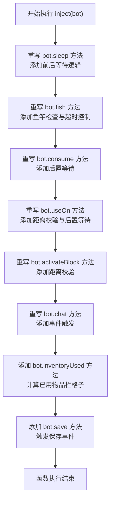
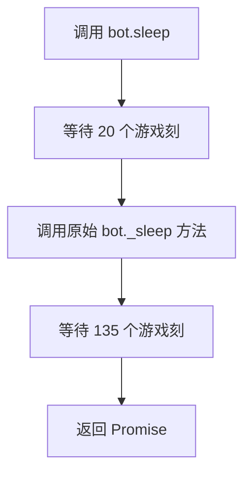
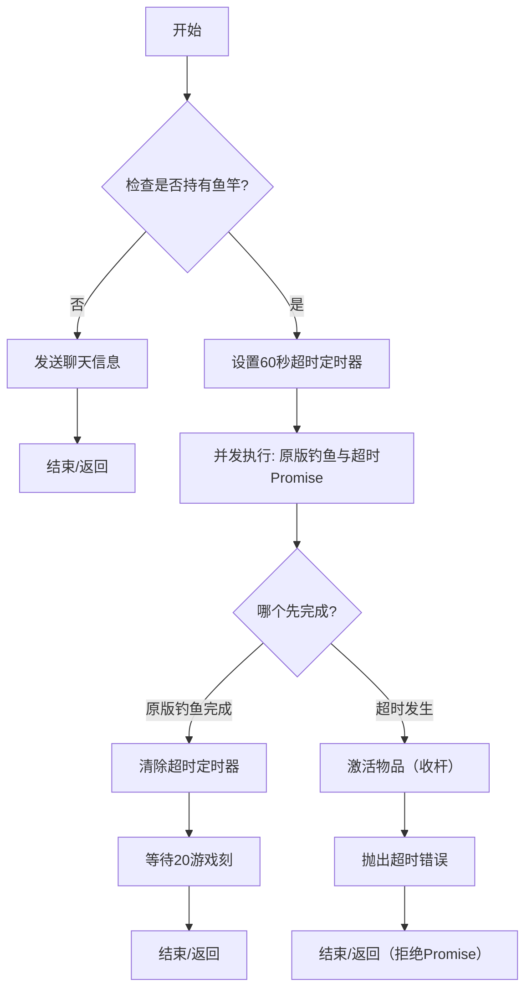
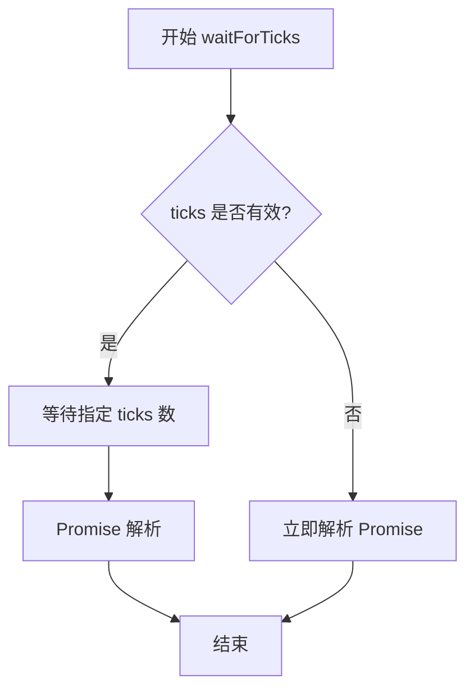
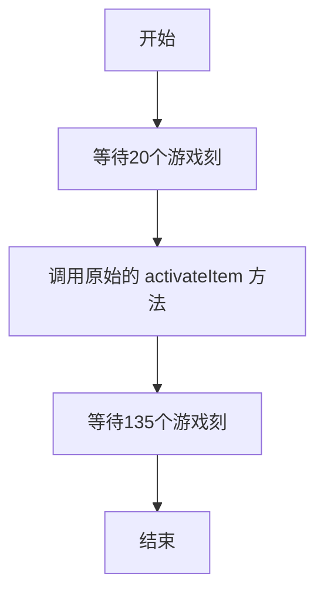

# `.\MetaGPT\metagpt\environment\minecraft\mineflayer\lib\skillLoader.js` 详细设计文档

该代码是一个针对Minecraft机器人（bot）的行为注入器，通过重写bot对象的核心方法（如sleep、fish、consume、useOn、activateBlock、chat），为这些操作添加了前置检查、后置延迟、超时控制、事件触发等增强功能，旨在提高机器人在游戏中的行为可靠性和可观测性。

## 整体流程

```mermaid
graph TD
    A[调用 inject(bot)] --> B[重写 bot.sleep 方法]
    B --> C[重写 bot.fish 方法]
    C --> D[重写 bot.consume 方法]
    D --> E[重写 bot.useOn 方法]
    E --> F[重写 bot.activateBlock 方法]
    F --> G[重写 bot.chat 方法]
    G --> H[添加 bot.inventoryUsed 方法]
    H --> I[添加 bot.save 方法]
    I --> J[注入完成，返回增强后的 bot 对象]
```

## 类结构

```
Bot 对象 (外部传入)
├── 原始方法 (被保存为 _method)
│   ├── _sleep
│   ├── _fish
│   ├── _consume
│   ├── _useOn
│   ├── _activateBlock
│   └── _chat
└── 增强方法 (重写后的方法)
    ├── sleep
    ├── fish
    ├── consume
    ├── useOn
    ├── activateBlock
    ├── chat
    ├── inventoryUsed
    └── save
```

## 全局变量及字段


### `Bot (外部对象，非本文件定义)._sleep`
    
存储原始 sleep 方法的引用，用于在重写方法中调用原始功能。

类型：`Function`
    


### `Bot (外部对象，非本文件定义)._fish`
    
存储原始 fish 方法的引用，用于在重写方法中调用原始功能。

类型：`Function`
    


### `Bot (外部对象，非本文件定义)._consume`
    
存储原始 consume 方法的引用，用于在重写方法中调用原始功能。

类型：`Function`
    


### `Bot (外部对象，非本文件定义)._useOn`
    
存储原始 useOn 方法的引用，用于在重写方法中调用原始功能。

类型：`Function`
    


### `Bot (外部对象，非本文件定义)._activateBlock`
    
存储原始 activateBlock 方法的引用，用于在重写方法中调用原始功能。

类型：`Function`
    


### `Bot (外部对象，非本文件定义)._chat`
    
存储原始 chat 方法的引用，用于在重写方法中调用原始功能。

类型：`Function`
    


### `Bot (外部对象，非本文件定义).heldItem`
    
表示机器人当前手持的物品，用于在钓鱼前检查是否持有鱼竿。

类型：`Object | null`
    


### `Bot (外部对象，非本文件定义).entity`
    
表示机器人自身的实体对象，包含位置等信息，用于计算与目标（方块或实体）的距离。

类型：`Object`
    


### `Bot (外部对象，非本文件定义).inventory`
    
表示机器人的物品栏，包含 slots 属性，用于计算已使用的物品栏格子数量。

类型：`Object`
    
    

## 全局函数及方法

### `inject`

`inject` 函数是一个猴子补丁（Monkey Patch）注入器，用于修改传入的 `bot` 对象的行为。它通过重写 `bot` 的多个核心方法（如 `sleep`、`fish`、`consume`、`useOn`、`activateBlock`、`chat`），为这些方法添加了额外的逻辑，例如操作前的等待、距离校验、超时控制、事件触发和错误处理。同时，它还向 `bot` 对象添加了新的工具方法 `inventoryUsed` 和 `save`。该函数旨在增强 `bot` 的自动化能力，使其在执行特定动作时更加稳定和可控，并提供了扩展的事件机制。

参数：
- `bot`：`Object`，一个代表游戏内机器人或代理的对象，其方法将被修改和增强。

返回值：`undefined`，该函数不返回任何值，其作用是通过副作用修改传入的 `bot` 对象。

#### 流程图



#### 带注释源码

```javascript
function inject(bot) {
    // 1. 重写 sleep 方法：在睡觉前后添加固定的等待时间（游戏刻）
    bot._sleep = bot.sleep; // 保存原方法
    bot.sleep = async (bedBlock) => {
        await bot.waitForTicks(20); // 睡觉前等待
        await bot._sleep(bedBlock); // 调用原睡觉逻辑
        await bot.waitForTicks(135); // 睡觉后等待
    };

    // 2. 重写 fish 方法：添加鱼竿检查和钓鱼超时机制
    bot._fish = bot.fish; // 保存原方法
    bot.fish = async () => {
        // 检查当前手持物品是否为鱼竿
        if (bot.heldItem?.name !== "fishing_rod") {
            bot.chat("I'm not holding a fishing rod!");
            return; // 未持有鱼竿则提前返回
        }
        let timeout = null;
        // 使用 Promise.race 实现超时控制
        await Promise.race([
            bot._fish(), // 执行原钓鱼逻辑
            new Promise(
                (resolve, reject) =>
                    (timeout = setTimeout(() => {
                        bot.activateItem(); // 超时后尝试激活物品（收杆）
                        reject(
                            new Error(
                                "Finishing timeout, make sure you get to and look at a water block!"
                            )
                        ); // 抛出超时错误
                    }, 60000)) // 设置60秒超时
            ),
        ]);
        clearTimeout(timeout); // 清除超时定时器
        await bot.waitForTicks(20); // 钓鱼后等待
    };

    // 3. 重写 consume 方法：在使用物品后添加等待
    bot._consume = bot.consume; // 保存原方法
    bot.consume = async () => {
        // action_count.activateItem++; // 注释掉的统计代码
        await bot._consume(); // 调用原使用物品逻辑
        await bot.waitForTicks(20); // 使用后等待
    };

    // 4. 重写 useOn 方法：在使用物品于实体前检查距离
    bot._useOn = bot.useOn; // 保存原方法
    bot.useOn = async (entity) => {
        // 检查与目标实体的距离是否超过6格
        if (entity.position.distanceTo(bot.entity.position) > 6) {
            bot.chat("Please goto a place near the entity first!");
            return; // 距离过远则提前返回
        }
        await bot._useOn(entity); // 调用原逻辑
        await bot.waitForTicks(20); // 使用后等待
    };

    // 5. 重写 activateBlock 方法：在激活方块前检查距离
    bot._activateBlock = bot.activateBlock; // 保存原方法
    bot.activateBlock = async (block) => {
        // 检查与目标方块的距离是否超过6格
        if (block.position.distanceTo(bot.entity.position) > 6) {
            bot.chat("Please goto a place near the block first!");
            return; // 距离过远则提前返回
        }
        // action_count.activateBlock++; // 注释掉的统计代码
        await bot._activateBlock(block); // 调用原激活逻辑
    };

    // 6. 重写 chat 方法：在发送聊天消息时触发自定义事件
    bot._chat = bot.chat; // 保存原方法
    bot.chat = (message) => {
        // action_count.chat++; // 注释掉的统计代码
        bot.emit("chatEvent", "bot", message); // 触发 'chatEvent' 事件
        bot._chat(message); // 调用原聊天逻辑
    };

    // 7. 添加新方法：计算玩家物品栏（9-45格）中已使用的格子数量
    bot.inventoryUsed = () => {
        return bot.inventory.slots.slice(9, 45).filter((item) => item !== null)
            .length;
    };

    // 8. 添加新方法：触发一个自定义的 'save' 事件
    bot.save = function (eventName) {
        bot.emit("save", eventName);
    };
}

// 导出 inject 函数
module.exports = { inject };
```

### `Bot.sleep`

这是一个对原始 `bot.sleep` 方法的异步包装器。它的核心功能是在机器人执行“睡觉”动作前后，分别插入固定的等待时间（`20` 和 `135` 个游戏刻），以模拟更自然的行为或确保游戏状态同步。

参数：
- `bedBlock`：`Block`，机器人试图睡觉的床方块对象。

返回值：`Promise<void>`，当异步操作完成时解析，不返回具体值。

#### 流程图



#### 带注释源码

```javascript
// 将原始的 bot.sleep 方法备份到 bot._sleep
bot._sleep = bot.sleep;

// 定义新的 bot.sleep 方法，它是一个异步函数
bot.sleep = async (bedBlock) => {
    // 在执行睡觉动作前，等待 20 个游戏刻
    await bot.waitForTicks(20);
    
    // 调用原始的睡觉方法，传入床方块参数
    await bot._sleep(bedBlock);
    
    // 在睡觉动作完成后，等待 135 个游戏刻
    await bot.waitForTicks(135);
    // 函数执行完毕，隐式返回一个已解决的 Promise<void>
};
```

### `Bot.fish`

该函数是原版 `bot.fish` 方法的增强版本，用于执行钓鱼操作。它在调用原方法前会检查玩家是否持有鱼竿，并设置一个60秒的超时机制。如果在超时前未完成钓鱼（例如未看向水体），则会主动激活物品（收杆）并抛出错误。无论成功与否，最后都会等待20个游戏刻。

参数：
- 无

返回值：`Promise<void>`，该异步函数不返回具体值，但会在钓鱼操作完成、超时或失败时解析。

#### 流程图



#### 带注释源码

```javascript
// 增强版的钓鱼方法
bot.fish = async () => {
    // 1. 前置检查：确保玩家手持鱼竿
    if (bot.heldItem?.name !== "fishing_rod") {
        bot.chat("I'm not holding a fishing rod!");
        return; // 未持有鱼竿，直接返回
    }

    let timeout = null; // 用于存储超时定时器的引用

    // 2. 核心逻辑：并发执行原版钓鱼和超时监控
    await Promise.race([
        // 选项A: 执行原版的钓鱼逻辑
        bot._fish(),
        // 选项B: 创建一个60秒后超时的Promise
        new Promise(
            (resolve, reject) =>
                (timeout = setTimeout(() => {
                    // 超时回调：主动收杆并拒绝Promise
                    bot.activateItem(); // 激活物品，相当于右键收杆
                    reject(
                        new Error(
                            "Finishing timeout, make sure you get to and look at a water block!"
                        )
                    );
                }, 60000)) // 60秒超时
        ),
    ]);

    // 3. 后置处理
    clearTimeout(timeout); // 无论哪个Promise完成，都清除另一个（超时定时器）
    await bot.waitForTicks(20); // 等待20个游戏刻，确保游戏状态稳定
};
```

### `Bot.consume`

该方法是对原版 `bot.consume` 方法的包装，用于执行“使用/消耗物品”的动作（例如吃食物、喝药水）。它在调用原始方法后，会等待 20 个游戏刻，以确保动作完成并维持游戏操作的时序稳定性。

参数：
- 无

返回值：`Promise<void>`，一个在异步操作完成后解析的 Promise，不返回具体值。

#### 流程图

```mermaid
flowchart TD
    A[开始调用 bot.consume] --> B[调用原始方法 bot._consume]
    B --> C[等待 20 个游戏刻 bot.waitForTicks(20)]
    C --> D[Promise 解析，方法结束]
```

#### 带注释源码

```javascript
// 保存原始的 consume 方法到 _consume
bot._consume = bot.consume;
// 用新的异步函数覆盖 bot.consume 方法
bot.consume = async () => {
    // 此处可以添加动作计数逻辑（当前被注释）
    // action_count.activateItem++;

    // 调用原始的 consume 方法执行消耗物品的核心逻辑
    await bot._consume();
    
    // 等待 20 个游戏刻，确保动作完成并保持操作间隔
    await bot.waitForTicks(20);
};
```

### `Bot.useOn`

该方法用于让机器人（Bot）对指定的实体（entity）执行“使用”操作，例如喂食、治疗等。在执行操作前，会检查机器人与实体之间的距离是否超过6个方块，如果超过则提示用户靠近实体。操作完成后，会等待20个游戏刻（ticks）以确保动作完成。

参数：
- `entity`：`Entity`，需要被“使用”的目标实体。

返回值：`Promise<void>`，异步操作，不返回具体值，但会在操作完成或失败时解决（resolve）或拒绝（reject）。

#### 流程图

```mermaid
flowchart TD
    A[开始调用 bot.useOn(entity)] --> B{检查距离<br>entity.position.distanceTo<br>大于6?}
    B -- 是 --> C[发送聊天消息<br>“Please goto a place near the entity first!”]
    C --> D[返回]
    B -- 否 --> E[调用原始方法 bot._useOn(entity)]
    E --> F[等待20个游戏刻<br>bot.waitForTicks(20)]
    F --> G[结束]
```

#### 带注释源码

```javascript
// 重写 bot 对象的 useOn 方法，增加距离检查和操作后等待
bot._useOn = bot.useOn; // 保存原始的 useOn 方法
bot.useOn = async (entity) => {
    // 检查机器人与目标实体之间的距离是否超过6个方块
    if (entity.position.distanceTo(bot.entity.position) > 6) {
        // 如果距离过远，发送聊天消息提示用户
        bot.chat("Please goto a place near the entity first!");
        return; // 直接返回，不执行后续操作
    }
    // 调用原始的 useOn 方法执行实际的操作
    await bot._useOn(entity);
    // 操作完成后，等待20个游戏刻，确保动作完成或游戏状态更新
    await bot.waitForTicks(20);
};
```

### `Bot.activateBlock`

该方法用于激活（使用）一个方块，例如打开箱子、使用工作台等。在执行激活操作前，会检查玩家与目标方块的距离，如果距离超过6格，则会发送聊天信息提示玩家靠近，并直接返回。如果距离合适，则调用原始的`activateBlock`方法执行激活操作。

参数：
- `block`：`Block`，需要被激活的目标方块对象。

返回值：`Promise<void>`，异步操作，无返回值。

#### 流程图

```mermaid
flowchart TD
    A[开始: activateBlock(block)] --> B{block.position.distanceTo<br>bot.entity.position > 6?}
    B -- 是 --> C[bot.chat<br>“请先靠近方块！”]
    C --> D[结束/返回]
    B -- 否 --> E[调用原始方法<br>bot._activateBlock(block)]
    E --> F[结束/返回]
```

#### 带注释源码

```javascript
// 重写 bot 对象的 activateBlock 方法
bot._activateBlock = bot.activateBlock; // 保存原始方法引用
bot.activateBlock = async (block) => {
    // 检查玩家与目标方块的距离是否超过6格
    if (block.position.distanceTo(bot.entity.position) > 6) {
        // 如果距离过远，发送聊天信息提示玩家靠近
        bot.chat("Please goto a place near the block first!");
        return; // 直接返回，不执行激活操作
    }
    // 可以在此处增加激活方块的动作计数（当前被注释）
    // action_count.activateBlock++;
    // 调用原始的 activateBlock 方法执行激活操作
    await bot._activateBlock(block);
};
```

### `Bot.chat`

该方法重写了原 `bot.chat` 函数，在发送聊天消息前，会先触发一个自定义的 `"chatEvent"` 事件，然后再调用原始的聊天功能。这允许外部监听器在消息实际发送前或发送后执行自定义逻辑（如日志记录、消息过滤等）。

参数：
- `message`：`string`，要发送的聊天消息内容。

返回值：`void`，无返回值。

#### 流程图

```mermaid
flowchart TD
    A[调用 bot.chat(message)] --> B[触发 'chatEvent' 事件<br>参数: 'bot', message]
    B --> C[调用原始 _chat 方法]
    C --> D[结束]
```

#### 带注释源码

```javascript
// 保存原始的 chat 方法到 _chat，以便后续调用
bot._chat = bot.chat;
// 重写 bot.chat 方法
bot.chat = (message) => {
    // 触发一个自定义的 'chatEvent' 事件，并传递发送者（'bot'）和消息内容
    // 这允许其他模块监听此事件并做出响应
    bot.emit("chatEvent", "bot", message);
    // 调用原始的 chat 方法，实际发送消息
    bot._chat(message);
};
```

### `Bot.waitForTicks`

该方法用于使机器人等待指定的游戏刻（ticks）数。游戏刻是Minecraft中的时间单位，20游戏刻等于1秒。该方法通常用于在动作之间添加延迟，以模拟真实玩家的行为或确保游戏状态同步。

参数：

- `ticks`：`number`，需要等待的游戏刻数量。

返回值：`Promise<void>`，当等待完成后解析的Promise，无返回值。

#### 流程图



#### 带注释源码

```javascript
// 该方法属于外部定义的 Bot 对象，此处仅展示其典型实现或调用方式
// 实际实现可能依赖于具体的Minecraft机器人框架（如mineflayer）
async function waitForTicks(ticks) {
    // 将游戏刻转换为毫秒延迟
    // 标准转换：1 tick = 50ms (因为 20 ticks = 1秒)
    const delayMs = ticks * 50;
    
    // 返回一个Promise，在指定延迟后解析
    return new Promise(resolve => {
        setTimeout(resolve, delayMs);
    });
}
```

**注意**：在提供的代码片段中，`Bot.waitForTicks` 被多次调用（例如在`sleep`、`fish`、`consume`、`useOn`等方法的注入逻辑中），但该方法本身并未在代码中定义。它应作为外部`Bot`对象（可能来自如mineflayer库）的预定义方法存在。上述源码是基于其常见实现的示例性注释。

### `Bot.activateItem`

该方法用于激活当前手持的物品（例如使用钓鱼竿、食用食物等）。它通过调用原始的 `activateItem` 方法，并在调用前后添加了额外的等待逻辑，以确保动作的同步性和稳定性。

参数：无

返回值：`Promise<void>`，异步操作，无返回值。

#### 流程图



#### 带注释源码

```javascript
// 原始的 sleep 方法被保存到 bot._sleep
bot._sleep = bot.sleep;

// 重写 bot.sleep 方法，添加额外的等待逻辑
bot.sleep = async (bedBlock) => {
    // 在睡觉前等待20个游戏刻，确保环境稳定
    await bot.waitForTicks(20);
    // 调用原始的睡觉方法
    await bot._sleep(bedBlock);
    // 睡觉后等待135个游戏刻，确保动作完成
    await bot.waitForTicks(135);
};
```

### `Bot.emit`

该方法用于触发（发射）指定的事件，并可以传递任意数量的参数给该事件的监听器。它是 Node.js 事件驱动架构的核心，允许代码的不同部分通过事件进行通信。

参数：
- `eventName`：`string`，要触发的事件名称。
- `...args`：`any`，传递给事件监听器的任意数量的参数。

返回值：`boolean`，如果该事件有监听器则返回 `true`，否则返回 `false`。

#### 流程图

```mermaid
flowchart TD
    A[调用 Bot.emit(eventName, ...args)] --> B{事件名 eventName<br>是否有监听器?}
    B -- 是 --> C[同步调用所有<br>注册到该事件的监听器函数]
    C --> D[将参数 ...args<br>传递给每个监听器]
    D --> E[返回 true]
    B -- 否 --> F[返回 false]
```

#### 带注释源码

```javascript
// 这是对 Bot 对象（继承自 EventEmitter）的 emit 方法的通用描述。
// 实际实现位于 Node.js 的 `events` 模块中。
/**
 * 触发指定的事件。
 * 同步调用所有注册到 `eventName` 事件的监听器，按照它们被添加的顺序执行。
 * 任何传递给 `emit()` 的参数都会作为参数传递给每个监听器函数。
 *
 * @param {string} eventName - 要触发的事件名称。
 * @param {...any} args - 传递给监听器的参数。
 * @returns {boolean} 如果该事件有监听器则返回 `true`，否则返回 `false`。
 */
function emit(eventName, ...args) {
  // 1. 根据 eventName 查找内部维护的监听器列表。
  // 2. 如果列表存在且不为空，则：
  //    a. 遍历列表中的每一个监听器函数。
  //    b. 使用 .apply() 或 .call() 方法，以 `this`（通常是 Bot 实例）为上下文，以 `args` 为参数，同步执行该函数。
  // 3. 根据监听器列表是否存在且不为空，返回 true 或 false。
}
```

### `Bot.inventoryUsed`

该方法用于计算机器人（Bot）当前已使用的背包槽位数量。它通过检查背包中特定范围的槽位（从第9个到第44个槽位，共36个槽位），统计其中非空槽位的数量，从而返回已使用的背包槽位数。

参数：无

返回值：`number`，表示已使用的背包槽位数量。

#### 流程图

```mermaid
flowchart TD
    A[开始] --> B[获取背包槽位列表<br/>bot.inventory.slots]
    B --> C[截取槽位索引 9 到 44<br/>.slice(9, 45)]
    C --> D[过滤出非空槽位<br/>.filter(item => item !== null)]
    D --> E[计算非空槽位数量<br/>.length]
    E --> F[返回数量]
    F --> G[结束]
```

#### 带注释源码

```javascript
bot.inventoryUsed = () => {
    // 1. 获取机器人的完整背包槽位数组
    // 2. 使用 slice(9, 45) 截取索引从9到44的槽位（共36个），这通常代表玩家的主背包区域
    // 3. 使用 filter 方法过滤出所有不为 null 的槽位（即被物品占用的槽位）
    // 4. 返回过滤后数组的长度，即已使用的背包槽位数量
    return bot.inventory.slots.slice(9, 45).filter((item) => item !== null)
        .length;
};
```

### `bot.save`

该方法用于触发一个自定义的“保存”事件，允许外部监听器（例如，用于数据持久化、状态快照或日志记录）在特定时刻执行相应的操作。

参数：
- `eventName`：`string`，一个标识事件名称的字符串，用于区分不同的保存操作或上下文。

返回值：`undefined`，该方法不返回任何值。

#### 流程图

```mermaid
flowchart TD
    A[调用 bot.save(eventName)] --> B[触发 'save' 事件<br>并传递 eventName 参数]
    B --> C[方法执行完毕]
```

#### 带注释源码

```javascript
// 为 bot 对象添加一个名为 save 的方法
bot.save = function (eventName) {
    // 使用 Node.js 的 EventEmitter 模式，触发一个名为 'save' 的自定义事件。
    // 任何监听了 bot 对象上 'save' 事件的代码都会收到通知。
    // 参数 eventName 会被传递给所有事件监听器，以便它们了解是哪个保存操作被触发了。
    bot.emit("save", eventName);
};
```

## 关键组件


### 动作延迟注入

通过包装原始方法并插入 `bot.waitForTicks` 调用，为 `sleep`、`consume`、`useOn` 等核心动作添加了固定的延迟逻辑，以模拟人类操作间隔或满足游戏机制要求。

### 钓鱼超时控制

包装了 `fish` 方法，增加了装备检查和超时机制。通过 `Promise.race` 在钓鱼动作和60秒超时之间竞争，超时后自动收杆并抛出错误，增强了钓鱼功能的健壮性。

### 交互距离校验

在 `useOn` 和 `activateBlock` 方法中，在执行原始操作前增加了与目标实体或方块的距离检查（>6格）。如果距离过远，则发送聊天信息并中止操作，防止无效或不可能的交互。

### 事件发射与监控

包装了 `chat` 方法，在发送原始聊天消息前，会先发射一个自定义的 `"chatEvent"` 事件。同时，提供了 `save` 函数来发射 `"save"` 事件，便于外部系统监控机器人的特定行为。

### 库存使用量统计

提供了 `inventoryUsed` 方法，用于快速统计机器人背包主存储区域（9-45号槽位）中已被占用的槽位数量，简化了库存管理逻辑。


## 问题及建议


### 已知问题

-   **`fish` 方法中的竞态条件与资源泄漏**：`Promise.race` 的使用方式存在缺陷。如果 `bot._fish()` 先完成，`setTimeout` 回调仍会被执行，导致 `bot.activateItem()` 被意外调用，并抛出一个未被捕获的 `Error`。此外，`clearTimeout(timeout)` 可能无法在超时回调执行前被调用，导致定时器未被正确清理。
-   **`fish` 方法中的错误处理不当**：超时 `Promise` 被拒绝（`reject`）时，产生的 `Error` 没有被捕获和处理，可能导致程序崩溃或未预期的行为。
-   **硬编码的等待时间**：代码中多处使用了硬编码的等待时间（如 `await bot.waitForTicks(20/135)` 和 `setTimeout(..., 60000)`）。这些数值缺乏上下文说明，难以根据不同的网络条件、服务器性能或游戏版本进行调整，降低了代码的适应性和可维护性。
-   **缺乏配置和状态管理**：所有修改（如等待的 tick 数、超时时间、距离检查阈值）都直接硬编码在函数内部。没有提供任何配置接口或状态管理机制，使得动态调整行为或在不同场景下复用这些逻辑变得困难。
-   **`inject` 函数的幂等性问题**：如果 `inject` 函数被多次调用，它会重复包装原始方法（例如，将 `bot.sleep` 再次指向一个新的包装函数，而不是原始的 `bot._sleep`）。这可能导致调用栈过深、行为错乱或内存泄漏。
-   **注释掉的代码**：代码中存在被注释掉的 `// action_count.xxx++` 行。这些“死代码”增加了理解代码真实意图的难度，并可能暗示存在未完成或废弃的功能。

### 优化建议

-   **重构 `fish` 方法以解决竞态和错误处理**：
    1.  将超时逻辑封装在一个可取消的 `Promise` 中。
    2.  确保无论 `bot._fish()` 成功还是失败，都能正确清理定时器。
    3.  妥善处理超时错误，可以选择记录日志、触发事件或返回一个特定的状态，而不是直接抛出未捕获的异常。
    ```javascript
    bot.fish = async () => {
        if (bot.heldItem?.name !== "fishing_rod") {
            bot.chat("I'm not holding a fishing rod!");
            return;
        }
        let timeoutId;
        const timeoutPromise = new Promise((_, reject) => {
            timeoutId = setTimeout(() => reject(new Error('Fishing operation timed out')), 60000);
        });
        try {
            await Promise.race([bot._fish(), timeoutPromise]);
        } catch (error) {
            // 处理超时或其他错误
            bot.activateItem(); // 仅在超时时尝试收回鱼竿？
            console.warn(`Fishing failed: ${error.message}`);
            // 可以考虑触发一个自定义事件，如 bot.emit('fishingError', error)
            throw error; // 或者根据需求决定是否重新抛出
        } finally {
            clearTimeout(timeoutId); // 确保总是清理定时器
        }
        await bot.waitForTicks(20);
    };
    ```
-   **将硬编码值参数化**：创建一个配置对象，将等待 tick 数、超时时间、最大交互距离等作为参数。可以在 `inject` 函数中传入，或通过 `bot` 对象的某个配置属性来管理。
    ```javascript
    const defaultConfig = {
        sleepTicks: { before: 20, after: 135 },
        fishTimeout: 60000,
        maxInteractDistance: 6,
        consumeWaitTicks: 20,
        useOnWaitTicks: 20,
        // ... 其他配置
    };
    function inject(bot, config = {}) {
        const cfg = { ...defaultConfig, ...config };
        // 在函数内部使用 cfg.sleepTicks.before, cfg.maxInteractDistance 等
    }
    ```
-   **确保 `inject` 函数的幂等性**：在覆盖原始方法前，检查是否已经被包装过。可以设置一个标志位（如 `bot.__primitivesInjected`）或通过检查方法属性来实现。
    ```javascript
    function inject(bot) {
        if (bot.__primitivesInjected) return;
        // ... 注入逻辑 ...
        bot.__primitivesInjected = true;
    }
    ```
-   **清理注释代码**：移除所有被注释掉的 `// action_count.xxx++` 代码行。如果这些计数功能是需要的，应该实现一个完整的状态追踪模块，并通过事件或公开的 API 来暴露这些数据。
-   **增强错误处理和事件触发**：考虑将错误和状态变化通过 `bot.emit` 触发更丰富的事件，而不是仅仅在控制台输出或 `chat`。例如，`fishingTimeout`, `tooFarToInteract`, `itemConsumed` 等事件，便于外部监听和响应。
-   **考虑代码组织**：当前所有逻辑都集中在一个 `inject` 函数中。随着功能增长，可以考虑将不同功能的包装（如移动相关、物品交互相关、聊天相关）拆分成独立的模块，并通过 `inject` 函数组合起来，提高代码的可读性和可维护性。


## 其它


### 设计目标与约束

本代码的设计目标是为一个Minecraft机器人（bot）框架提供一组行为增强和监控的“注入式”插件。其核心设计思想是通过猴子补丁（monkey-patching）的方式，在不修改原始bot对象源码的前提下，对关键行为方法（如`sleep`、`fish`、`consume`等）进行包装，以实现以下目标：
1.  **行为标准化与延迟控制**：在所有被包装的动作执行前后，插入固定的等待时间（`bot.waitForTicks`），以模拟更符合人类操作节奏或满足游戏机制要求的延迟，确保动作执行的稳定性和可靠性。
2.  **前置条件校验**：在执行某些动作（如`fish`、`useOn`、`activateBlock`）前，增加必要的状态检查（如是否持有正确工具、距离是否足够近），防止无效或错误的操作，提升脚本的健壮性。
3.  **异步操作超时控制**：为`fish`（钓鱼）这类可能因环境问题而长时间阻塞的操作添加超时机制，防止脚本无限期等待，并在超时后执行恢复操作（如取消激活钓鱼竿）。
4.  **行为监控与事件发射**：通过包装`chat`方法，将聊天内容作为自定义事件`"chatEvent"`发射出去，便于外部监听和记录。同时，代码中预留了用于统计动作次数的注释（如`action_count.activateItem++`），为未来的监控功能打下基础。
5.  **提供实用工具函数**：添加`inventoryUsed`方法，方便查询背包已使用空间。

主要约束包括：
*   **侵入式修改**：必须直接修改传入的`bot`对象，这要求调用方理解此模块的副作用。
*   **依赖特定框架**：代码严重依赖于被注入对象（`bot`）的特定接口（如`sleep`、`fish`、`waitForTicks`等方法的存在和签名）。这些接口由外部Minecraft机器人库（如`mineflayer`）定义。
*   **硬编码参数**：等待的tick数（20、135）、超时时间（60000毫秒）、距离阈值（6格）等均为硬编码，缺乏灵活性。
*   **错误处理简化**：部分错误仅通过`bot.chat`发送消息并`return`，未以标准异常形式抛出，可能不利于上层调用者进行程序化错误处理。

### 错误处理与异常设计

本模块的错误处理策略混合了主动预防、异步超时和简单的用户通知。

1.  **前置条件验证（预防性错误处理）**：
    *   在`fish`方法中，检查`bot.heldItem`，若不满足条件则发送聊天消息并直接返回。
    *   在`useOn`和`activateBlock`方法中，计算与目标实体或方块的距离，若超过阈值（6格），则发送聊天消息并返回。
    *   **处理方式**：这些属于“预期内的错误状态”。当前实现采用非抛出异常的方式（仅打印消息并返回），这使调用流程继续但动作未执行。调用者需要通过其他方式（如监听聊天消息或检查后续状态）来感知失败。

2.  **异步操作超时（运行时错误处理）**：
    *   在`fish`方法中，使用`Promise.race`在原动作和一个60秒后触发的超时Promise之间竞赛。若超时先发生，则执行`bot.activateItem()`（尝试取消钓鱼），并`reject`一个带有描述性信息的`Error`对象。
    *   **处理方式**：这是一种主动的故障恢复机制。超时错误会以`Promise`拒绝（rejection）的形式向上层传递，强制调用者必须通过`.catch()`或`try...catch`（在`async`函数中）来处理这种异常情况，否则可能导致未处理的Promise拒绝。

3.  **底层异常传递**：
    *   被包装的原始方法（如`bot._sleep`, `bot._fish`）在执行过程中可能抛出异常（例如，找不到床、无法使用物品等）。这些异常会穿透包装层，直接传递给调用者。本模块没有捕获或转换这些异常。

4.  **事件通知**：
    *   通过包装`chat`方法，将聊天内容作为`"chatEvent"`发出。这可以作为一种间接的错误或状态通知机制，供其他监听该事件的模块使用。

**总结**：错误处理设计相对简单，侧重于防止无效操作和避免永久阻塞。对于参数校验类错误，采用静默失败加通知的方式；对于潜在的长时间阻塞，采用强制超时并抛出异常的方式。调用者需要妥善处理可能抛出的异常和留意聊天信息。

### 数据流与状态机

本模块不管理复杂的内部状态，其主要数据流体现在对`bot`对象方法的拦截、参数传递、条件判断以及副作用的发生上。

1.  **输入数据流**：
    *   **主输入**：`inject`函数的唯一参数`bot`对象。这是所有操作的目标和上下文。
    *   **方法参数**：各个被包装方法（如`sleep`的`bedBlock`，`useOn`的`entity`，`activateBlock`的`block`）接收的参数，这些参数在验证和延迟后被传递给原始方法。

2.  **内部处理与状态查询**：
    *   **状态读取**：在条件判断时，代码会读取`bot`的当前状态，例如：
        *   `bot.heldItem?.name`（检查手持物品）。
        *   `entity.position.distanceTo(bot.entity.position)`（计算与实体的距离）。
        *   `block.position.distanceTo(bot.entity.position)`（计算与方块的距离）。
        *   `bot.inventory.slots`（计算背包使用情况）。
    *   **定时器管理**：`fish`方法内部创建并管理一个`setTimeout`句柄（`timeout`变量），用于实现超时控制，并在操作完成或超时后使用`clearTimeout`进行清理。

3.  **输出与副作用**：
    *   **方法调用**：最终，经过包装的逻辑会调用原始方法（`bot._xxx()`），执行实际的Minecraft游戏内动作。
    *   **延迟等待**：通过`bot.waitForTicks()`产生异步等待的副作用。
    *   **消息发送**：通过`bot._chat()`发送聊天信息到游戏内。
    *   **事件触发**：通过`bot.emit()`触发自定义事件（`"chatEvent"`, `"save"`）。

4.  **简化的状态机（以`fish`方法为例）**：
    ```mermaid
    graph TD
        A[开始调用 bot.fish] --> B{手持物是否为<br/>钓鱼竿?};
        B -- 否 --> C[发送聊天消息];
        C --> Z[返回/结束];
        B -- 是 --> D[设置60秒超时定时器];
        D --> E[Promise.race: <br/>原始钓鱼 vs 超时];
        E -- 原始钓鱼先完成 --> F[清除定时器];
        F --> G[等待20 ticks];
        G --> Z;
        E -- 60秒超时先发生 --> H[执行 bot.activateItem];
        H --> I[Promise被Reject<br/>抛出超时错误];
        I --> Z;
```
    其他方法（如`useOn`, `activateBlock`）包含类似的距离检查分支，但不存在竞态条件，状态转换更为线性。

### 外部依赖与接口契约

本模块的功能完全建立在与外部`bot`对象的交互之上，因此具有明确的外部依赖和接口契约。

1.  **核心依赖：Bot 对象接口**
    传入的`bot`对象必须实现（或提供）以下特定方法和属性，否则代码将运行失败或行为异常：
    *   **方法（将被包装的）**：
        *   `sleep(bedBlock): Promise<void>`
        *   `fish(): Promise<void>`
        *   `consume(): Promise<void>`
        *   `useOn(entity): Promise<void>`
        *   `activateBlock(block): Promise<void>`
        *   `chat(message): void`
    *   **方法（工具类）**：
        *   `waitForTicks(ticks): Promise<void>`：用于实现游戏刻延迟。
        *   `activateItem(): void`：用于取消物品激活（如收回钓鱼竿）。
    *   **属性**：
        *   `entity.position`: 一个具有`distanceTo`方法的对象，表示机器人的位置。
        *   `heldItem`: 可能为`null`或一个包含`name`属性的对象，表示手持物品。
        *   `inventory.slots`: 一个数组，表示所有物品栏格子。
    *   **事件系统**：
        *   `emit(eventName, ...args): void`：用于触发自定义事件。
        *   （假设bot对象继承自Node.js的`EventEmitter`或具有类似接口）。

2.  **隐式依赖：游戏机制与上下文**
    *   **Minecraft游戏规则**：代码逻辑基于对Minecraft游戏机制的理解，例如：钓鱼需要面对水域、使用物品/方块有距离限制、动作之间需要等待特定游戏刻以避免服务器限制或实现动画效果。
    *   **运行时环境**：假设在Node.js或类似JavaScript环境中运行，支持`Promise`、`async/await`、`setTimeout`/`clearTimeout`。

3.  **接口契约**：
    *   **注入契约**：`inject(bot)`函数承诺会修改传入的`bot`对象，为其增加或覆盖上述方法。调用方在注入后，应使用被修改后的`bot`对象。
    *   **行为契约**：包装后的方法承诺在原始行为基础上，增加指定的延迟、校验和事件发射。对于`fish`方法，还承诺增加超时保护。
    *   **副作用契约**：调用这些方法会产生游戏内动作、聊天消息、以及可能的事件发射。

**总结**：此模块是一个针对特定Minecraft机器人库（如`mineflayer`）的适配层/增强插件。其正确运行的先决条件是传入一个符合预期接口的`bot`对象。模块与外部系统的耦合度非常高。

    