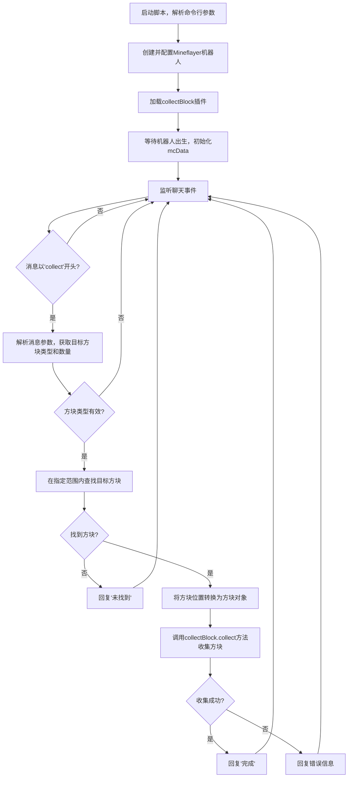

# `.\MetaGPT\metagpt\environment\minecraft\mineflayer\mineflayer-collectblock\examples\collector.js` 详细设计文档

该代码是一个基于 Mineflayer 框架的 Minecraft 机器人脚本，其核心功能是监听游戏内聊天指令，根据指令参数（方块类型和数量）在机器人周围寻找并收集指定的方块。

## 整体流程



## 类结构

```
全局作用域
├── 全局变量: bot, mcData
├── 全局函数: (无)
└── 事件监听器
    ├── bot.once('spawn', ...)
    └── bot.on('chat', ...)
```

## 全局变量及字段


### `bot`
    
Mineflayer机器人实例，用于连接和操作Minecraft服务器

类型：`mineflayer.Bot`
    


### `mcData`
    
存储当前Minecraft版本的数据，用于根据名称查找方块ID等信息

类型：`minecraft-data.MinecraftData`
    


    

## 全局函数及方法


## 关键组件


### 命令行参数解析与机器人初始化

解析命令行参数以获取服务器连接信息，并使用 Mineflayer 库创建和配置一个 Minecraft 机器人实例。

### 插件加载与数据准备

加载 `mineflayer-collectblock` 插件以提供方块收集功能，并在机器人生成后加载对应游戏版本的 `minecraft-data` 以获取方块元数据。

### 聊天命令监听与解析

监听游戏内聊天消息，解析以 `collect` 开头的命令，提取目标方块类型和可选的数量参数。

### 目标方块查找与验证

根据解析出的方块名称，在 `minecraft-data` 中查找对应的方块 ID，并在机器人周围一定范围内查找指定数量的匹配方块。

### 方块收集执行与结果反馈

将查找到的方块转换为目标对象，调用 `collectBlock` 插件的 `collect` 方法进行自动收集，并根据执行结果（成功或失败）在游戏聊天中给出相应的反馈。


## 问题及建议


### 已知问题

-   **参数解析逻辑存在缺陷**：代码中处理 `chat` 命令的参数逻辑（`if (args.length === 3)`）是错误的。当用户输入 `collect 5 diamond` 时，它会错误地将 `count` 赋值为 `5`（字符串），将 `type` 赋值为 `diamond`，然后尝试将字符串 `'5'` 作为方块类型名去查找，这必然失败，导致无法收集。当前的逻辑无法正确处理带数量的收集命令。
-   **缺乏输入验证与错误提示**：对于用户输入，缺少健全性检查。例如，未验证 `count` 参数是否为有效数字，未在找不到方块类型时给用户反馈（代码直接 `return`，用户无感知）。这导致用户体验不佳，且出错时难以排查。
-   **`mcData` 初始化时机存在潜在风险**：`mcData` 在 `spawn` 事件后初始化。如果在 `spawn` 事件触发前就收到 `chat` 命令（理论上可能，取决于连接和登录速度），访问 `mcData` 将是 `undefined`，导致运行时错误。
-   **资源查找范围固定**：`findBlocks` 的 `maxDistance` 硬编码为 64，这限制了 bot 的探索和收集范围，对于分散或较远的资源无法有效处理。
-   **错误处理过于笼统**：在 `collect` 失败时，仅通过 `chat` 输出错误信息。对于网络问题、路径查找失败、物品栏满等不同性质的异常，没有进行分类处理或重试机制，鲁棒性不足。

### 优化建议

-   **重构参数解析逻辑**：明确解析规则，例如将命令格式定义为 `collect <类型> [数量]`。使用更清晰的条件判断来区分参数，并确保 `count` 被正确解析为整数，`type` 被正确解析为字符串。
-   **增强输入验证与用户反馈**：
    -   在解析后验证 `count` 是否为有效正整数。
    -   当 `mcData.blocksByName[type]` 查找失败时，使用 `bot.chat` 通知用户未知方块类型。
    -   在尝试收集前，可以检查 bot 的物品栏是否有足够空间。
-   **确保 `mcData` 可用性**：将依赖 `mcData` 的聊天命令处理逻辑包裹在一个检查中，如果 `mcData` 未初始化，则提示用户稍后再试，或者将命令处理函数注册移到 `spawn` 事件回调内部。
-   **使配置可定制化**：将 `maxDistance`、是否忽略已收集方块等参数设计为可通过命令参数或配置文件调整，以增加 bot 的灵活性。
-   **改进错误处理策略**：
    -   对 `bot.collectBlock.collect` 可能抛出的不同异常进行捕获和分类（如使用 `err.code` 或 `err.message` 匹配）。
    -   针对特定错误（如路径查找失败）实现简单的重试逻辑或尝试寻找替代路径。
    -   在控制台输出更详细的错误堆栈信息，便于调试，同时给用户更友好的提示。
-   **代码结构与可维护性**：
    -   将命令解析、方块查找、收集执行等逻辑拆分为独立的函数，提高代码可读性和可测试性。
    -   考虑使用一个简单的命令分发器来管理不同的聊天命令，便于未来扩展新功能。


## 其它


### 设计目标与约束

本代码是一个基于 Mineflayer 框架的 Minecraft 机器人示例，其核心设计目标是演示如何通过插件机制扩展机器人功能，实现自动收集指定类型方块的能力。主要约束包括：1) 依赖外部命令行参数进行基础配置；2) 功能触发完全依赖于游戏内的聊天指令；3) 收集范围受限于机器人当前位置（最大距离64格）；4) 使用异步操作处理收集任务，需妥善处理潜在错误。

### 错误处理与异常设计

代码中的错误处理主要围绕 `bot.collectBlock.collect` 异步操作展开。当收集过程失败时（例如，目标方块无法到达或被破坏），代码会捕获抛出的异常，并通过游戏内聊天频道向用户报告错误信息，同时在控制台打印详细的错误堆栈以便调试。然而，对于其他潜在错误点（如命令行参数解析、`parseInt` 转换、`mcData.blocksByName[type]` 查询失败等），错误处理不够完善，仅通过静默返回或依赖外部库的默认行为处理，缺乏明确的用户反馈。

### 数据流与状态机

1.  **初始化流**：程序启动 -> 解析命令行参数 -> 创建并配置 `bot` 实例 -> 加载 `collectBlock` 插件 -> 等待 `spawn` 事件以获取 `mcData`。
2.  **指令处理流**：监听 `chat` 事件 -> 解析消息（格式：`collect [count] <blockType>` 或 `collect <blockType>`）-> 验证方块类型是否存在 -> 在指定半径内查找匹配的方块坐标 -> 将坐标转换为方块对象 -> 调用收集插件 -> 根据成功或失败状态发送相应聊天消息。
3.  **状态**：机器人主要存在“空闲监听”和“执行收集任务”两种状态。`chat` 事件触发状态转换至“执行收集任务”，任务完成后（无论成功或失败）返回“空闲监听”状态。

### 外部依赖与接口契约

1.  **mineflayer (核心框架)**：提供创建和控制 Minecraft 机器人的基础 API。代码依赖其 `createBot`, `on`, `once`, `chat`, `findBlocks`, `blockAt` 等方法及 `Bot` 实例。
2.  **mineflayer-collectblock (功能插件)**：提供 `collect` 方法，是实现方块收集能力的核心。代码通过 `bot.loadPlugin` 加载，并通过 `bot.collectBlock` 访问其接口。其内部实现细节（如路径寻找、挖掘动作）对主代码透明。
3.  **minecraft-data (数据提供库)**：根据机器人连接的服务器版本提供方块、物品等元数据。代码依赖其查询方块 ID 的功能 (`mcData.blocksByName`)。
4.  **Node.js 环境与进程接口**：依赖 `process.argv` 获取运行时参数，`process.exit` 用于参数错误时终止程序。
5.  **用户接口契约**：用户必须在游戏内通过聊天窗口发送特定格式的指令（`collect <方块名称>` 或 `collect <数量> <方块名称>`）来触发机器人的收集行为。

### 安全与配置考虑

1.  **身份验证**：支持通过命令行参数传递密码，但密码以明文形式在进程参数中传递，存在安全风险。在生产环境中应考虑更安全的凭据管理方式（如环境变量、配置文件）。
2.  **配置管理**：所有配置（主机、端口、用户名、密码）均通过硬编码的命令行参数输入，缺乏灵活性。对于复杂配置或频繁变更的场景，建议引入配置文件。
3.  **资源与权限**：代码未对查找方块的数量 (`count`) 和距离 (`maxDistance`) 进行上限校验，理论上用户可指令机器人进行极大规模或超远距离的搜索，可能导致性能问题或意外行为。应考虑添加合理的限制。
4.  **输入验证**：对用户输入的聊天指令解析较为简单，未充分验证 `count` 参数是否为有效正整数，也未处理 `type` 参数对应多种方块或别名的情况，可能引发意外错误或行为。


    