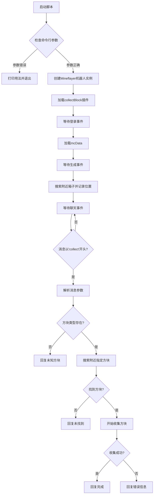
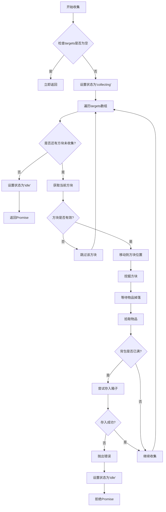

# `.\MetaGPT\metagpt\environment\minecraft\mineflayer\mineflayer-collectblock\examples\storageBot.js` 详细设计文档

这是一个基于Mineflayer框架的Minecraft机器人脚本，其核心功能是自动收集指定类型的方块。当机器人库存满时，它会自动将物品存入附近预先发现的箱子中，从而实现连续收集而无需手动清空库存。

## 整体流程



## 类结构

```
全局脚本 (无显式类定义)
├── 全局变量: mcData
├── 全局函数: (无)
└── 事件监听器
    ├── bot.once('login', ...)
    ├── bot.once('spawn', ...)
    └── bot.on('chat', ...)
```

## 全局变量及字段


### `mcData`
    
存储Minecraft版本数据的对象，用于根据名称查找方块ID等信息。

类型：`object`
    


### `bot.collectBlock.chestLocations`
    
存储已发现的附近箱子的位置坐标数组，用于在背包满时自动存放物品。

类型：`Array<Vec3>`
    
    

## 全局函数及方法


### `bot.findBlocks`

该方法用于在机器人周围查找匹配特定条件的方块，并返回这些方块的坐标列表。它通常用于定位特定类型的方块（如箱子、矿石等），以便后续进行收集、交互或其他操作。

参数：

- `options`：`Object`，一个包含查找选项的对象，具体属性如下：
  - `matching`：`number` 或 `number[]`，要匹配的方块ID。可以是一个单独的ID，也可以是一个ID数组。
  - `maxDistance`：`number`，查找的最大距离（以方块为单位）。机器人将只查找距离自身不超过此距离的方块。
  - `count`：`number`，要查找的最大方块数量。当找到的方块数量达到此值时，停止查找。
  - `point`：`Vec3`（可选），查找的起始点。默认为机器人当前的位置。

返回值：`Array<Vec3>`，一个包含所有找到的方块坐标的数组。每个坐标都是一个三维向量（`Vec3`），表示方块在游戏世界中的位置。

#### 流程图

```mermaid
flowchart TD
    A[开始: bot.findBlocks(options)] --> B{参数验证<br>options存在且合法?}
    B -- 否 --> C[返回空数组 []]
    B -- 是 --> D[初始化结果数组 results = []]
    D --> E[获取机器人当前位置<br>作为查找起点 point]
    E --> F[遍历以 point 为中心<br>maxDistance 为半径的立方体内的所有方块]
    F --> G{当前方块ID<br>是否匹配 matching?}
    G -- 否 --> H[继续遍历下一个方块]
    G -- 是 --> I[将方块坐标加入 results]
    I --> J{results.length >= count?}
    J -- 是 --> K[停止遍历]
    J -- 否 --> H
    H --> L{是否遍历完所有方块?}
    L -- 否 --> F
    L -- 是 --> M[返回结果数组 results]
    K --> M
```

#### 带注释源码

```javascript
// 注意：以下是根据 Mineflayer API 文档和典型实现推断的伪代码，
// 用于解释 `bot.findBlocks` 方法的核心逻辑。实际源码可能更复杂。

Bot.prototype.findBlocks = function (options) {
  // 1. 参数验证和默认值设置
  if (!options) return []; // 如果没有提供选项，返回空数组
  const matching = options.matching; // 要匹配的方块ID或ID数组
  const maxDistance = options.maxDistance || 16; // 最大距离，默认16
  const count = options.count || 1; // 最大数量，默认1
  const point = options.point || this.entity.position; // 起始点，默认为机器人位置

  const results = []; // 用于存储找到的方块坐标

  // 2. 计算查找范围（一个立方体区域）
  const startX = Math.floor(point.x - maxDistance);
  const endX = Math.floor(point.x + maxDistance);
  const startY = Math.max(0, Math.floor(point.y - maxDistance)); // Y轴通常有范围限制
  const endY = Math.min(255, Math.floor(point.y + maxDistance));
  const startZ = Math.floor(point.z - maxDistance);
  const endZ = Math.floor(point.z + maxDistance);

  // 3. 遍历该区域内的每一个方块
  for (let x = startX; x <= endX; x++) {
    for (let y = startY; y <= endY; y++) {
      for (let z = startZ; z <= endZ; z++) {
        // 4. 获取当前方块的ID
        const block = this.blockAt(new Vec3(x, y, z));
        if (!block) continue; // 如果无法获取方块信息，跳过

        let isMatch = false;
        // 5. 检查方块ID是否匹配
        if (Array.isArray(matching)) {
          // 如果 matching 是数组，检查当前方块ID是否在数组中
          isMatch = matching.includes(block.type);
        } else {
          // 如果 matching 是单个数字，直接比较
          isMatch = block.type === matching;
        }

        // 6. 如果匹配，将坐标加入结果列表
        if (isMatch) {
          results.push(new Vec3(x, y, z));
          // 7. 如果已达到所需数量，提前结束查找
          if (results.length >= count) {
            return results;
          }
        }
      }
    }
  }

  // 8. 返回找到的所有方块坐标（可能少于 count）
  return results;
};
```


### `bot.blockAt`

`bot.blockAt` 是 Mineflayer Bot 实例的一个方法，用于根据给定的三维坐标（Vec3 对象）获取该位置对应的方块对象。如果该坐标在游戏世界内，则返回一个 Block 对象，包含该方块的详细信息（如类型、状态等）；如果坐标无效或超出世界边界，则返回 `null`。

参数：

- `point`：`Vec3`，一个包含 x、y、z 坐标的对象，表示要查询的方块位置。

返回值：`Block | null`，返回指定位置的方块对象，如果位置无效则返回 `null`。

#### 流程图

```mermaid
flowchart TD
    A[调用 bot.blockAt(point)] --> B{point 是否为有效 Vec3?}
    B -- 是 --> C[查询世界方块数据]
    C --> D{坐标是否在世界边界内?}
    D -- 是 --> E[创建并返回 Block 对象]
    D -- 否 --> F[返回 null]
    B -- 否 --> F
    E --> G[结束]
    F --> G
```

#### 带注释源码

```javascript
// 在给定的坐标点获取方块对象
// point: 一个包含 x, y, z 坐标的 Vec3 对象
// 返回值: 如果坐标有效，返回 Block 对象；否则返回 null
bot.blockAt = function (point) {
  // 1. 检查输入参数 point 是否为有效的 Vec3 对象
  // 2. 将坐标转换为整数（方块坐标通常是整数）
  const blockPos = new Vec3(Math.floor(point.x), Math.floor(point.y), Math.floor(point.z))
  
  // 3. 检查坐标是否在世界边界内（通常由世界的高度和宽度限制）
  if (!this.world.isValidPosition(blockPos)) {
    return null // 坐标无效，返回 null
  }
  
  // 4. 从世界数据中获取该位置的方块状态信息
  const stateId = this.world.getBlockStateId(blockPos)
  
  // 5. 如果方块状态 ID 有效（不为 0 或 undefined），创建并返回 Block 对象
  if (stateId !== undefined && stateId !== 0) {
    return new Block(stateId, blockPos, this.world) // 包含方块类型、位置和世界引用
  }
  
  // 6. 如果无法获取方块状态（例如，位置为空气或未加载），返回 null
  return null
}
```


### `bot.chat`

`bot.chat` 是 Mineflayer Bot 实例的一个核心方法，用于在 Minecraft 游戏内发送聊天消息。它允许机器人以文本形式与其他玩家或控制台进行交互，是机器人实现自动化、响应指令和报告状态的基础通信手段。

参数：

-  `message`：`string`，要发送到游戏聊天框的文本消息。

返回值：`void`，此方法不返回任何值。

#### 流程图

```mermaid
flowchart TD
    A[调用 bot.chat(message)] --> B{消息是否为空或无效?}
    B -- 是 --> C[内部处理，可能忽略或报错]
    B -- 否 --> D[将消息字符串打包为游戏协议数据包]
    D --> E[通过底层网络连接发送数据包到服务器]
    E --> F[服务器接收并广播消息<br>其他玩家和机器人自身可见]
```

#### 带注释源码

```javascript
// 在 Mineflayer 库内部，chat 方法通常定义在 Bot 类中。
// 以下是一个概念性的实现，展示了其核心逻辑：

class Bot {
  // ... 其他属性和方法 ...

  /**
   * 在 Minecraft 聊天中发送一条消息。
   * @param {string} message - 要发送的消息文本。
   */
  chat(message) {
    // 1. 参数验证（简化表示）
    if (typeof message !== 'string' || message.trim().length === 0) {
      // 在实际库中，可能会触发一个警告或直接忽略。
      // 例如: this.emit('warning', 'Empty or non-string message passed to chat()');
      return;
    }

    // 2. 准备聊天数据包
    // 根据 Minecraft 协议版本，构建一个“聊天包”。
    // 这通常涉及将字符串编码为特定格式（如JSON文本组件或纯文本）。
    const chatPacket = this._createChatPacket(message);

    // 3. 发送数据包
    // 调用底层的网络接口将数据包写入到与 Minecraft 服务器的连接中。
    this._client.write('chat', chatPacket);

    // 4. 触发本地事件（可选但常见）
    // 为了保持内部状态一致并允许插件监听，通常会触发一个“chat”或“messagestr”事件，
    // 参数就是刚刚发送的消息。这使得机器人自己的事件监听器（如代码中的 `bot.on('chat', ...)`）也能捕获到自己发送的消息。
    this.emit('messagestr', message);
    // 注意：有些实现可能触发更具体的事件，如 `bot.emit('chat', { message: message })`。

    // 方法执行完毕，无返回值。
  }

  // ... 私有或内部方法，如 _createChatPacket ...
}
```


### `bot.loadPlugin`

该方法用于向 Mineflayer Bot 实例动态加载一个插件。它接收一个插件对象作为参数，并将其集成到 bot 实例中，通常是为 bot 添加新的功能或行为。

参数：
-  `plugin`：`Object`，一个符合 Mineflayer 插件规范的 JavaScript 对象。该对象通常包含一个 `inject` 方法，用于将插件功能注入到 bot 实例中。

返回值：`undefined`，此方法不返回任何值。

#### 流程图

```mermaid
flowchart TD
    A[调用 bot.loadPlugin(plugin)] --> B{插件对象是否有效?};
    B -- 是 --> C[调用 plugin.inject(bot, options)];
    C --> D[插件功能被注入到 bot 实例中];
    B -- 否 --> E[可能引发错误或静默失败];
    D --> F[方法执行结束];
    E --> F;
```

#### 带注释源码

```javascript
// 这是 Mineflayer 框架内部 `bot.loadPlugin` 方法的典型实现逻辑。
// 实际源码可能因版本不同而略有差异，但核心流程一致。

Bot.prototype.loadPlugin = function (plugin) {
  // 检查传入的 `plugin` 参数是否是一个对象
  // 并且该对象是否包含一个名为 `inject` 的函数。
  if (plugin && typeof plugin.inject === 'function') {
    // 如果插件有效，则调用其 `inject` 方法。
    // 将当前的 bot 实例 (`this`) 作为第一个参数传递给插件，
    // 允许插件访问和扩展 bot 的功能。
    // 第二个参数通常是可选的配置选项，这里传递一个空对象 `{}`。
    plugin.inject(this, {});
  } else {
    // 如果插件对象无效（例如，`plugin` 为 null/undefined，或没有 `inject` 方法），
    // 框架可能会抛出错误或记录警告。此处为示意，仅作注释说明。
    // throw new Error('Invalid plugin: must have an inject method');
    // 或 console.warn('Attempted to load an invalid plugin');
  }
  // 方法执行完毕，没有返回值。
};
```


### `bot.collectBlock.collect`

该方法用于让机器人收集指定的方块列表。它会依次移动到每个方块位置，挖掘方块，并将掉落的物品拾取到背包中。如果背包已满，会尝试将物品存入预先设置的箱子中。

参数：

- `targets`：`Array<Block>`，要收集的方块对象数组

返回值：`Promise<void>`，当所有方块收集完成时解析，如果过程中出现错误则拒绝

#### 流程图



#### 带注释源码

```javascript
// 收集指定方块列表的核心方法
async collect (targets) {
  // 如果目标列表为空，直接返回
  if (targets.length === 0) return
  
  // 设置当前状态为收集状态
  this.state = 'collecting'
  
  try {
    // 遍历所有目标方块
    for (const target of targets) {
      // 检查方块是否有效（存在且不为空气方块）
      if (!target || target.type === 0) continue
      
      // 移动到方块位置
      await this.bot.pathfinder.goto(new GoalGetToBlock(target.position.x, target.position.y, target.position.z))
      
      // 挖掘方块
      await this.bot.dig(target)
      
      // 等待物品掉落（短暂延迟）
      await this.waitForItemDrop()
      
      // 拾取掉落的物品
      await this.pickupItems()
      
      // 检查背包是否已满
      if (this.isInventoryFull()) {
        // 尝试将物品存入箱子
        await this.storeItemsInChest()
      }
    }
    
    // 所有方块收集完成，重置状态
    this.state = 'idle'
  } catch (err) {
    // 发生错误，重置状态并抛出异常
    this.state = 'idle'
    throw err
  }
}
```

## 关键组件

### 存储管理组件

该组件负责在机器人背包满时，自动将物品存入预先发现的箱子中。它通过监听机器人状态，并在需要时执行物品转移操作，实现了背包空间的自动化管理。

### 方块收集组件

该组件负责根据玩家的指令，在游戏世界中寻找并收集指定类型和数量的方块。它集成了路径规划和物品拾取功能，能够高效地完成收集任务。

### 事件驱动通信组件

该组件基于Mineflayer的事件系统，负责处理游戏内的聊天指令和机器人生命周期事件（如登录、生成）。它将用户输入解析为具体的收集任务，并触发相应的收集流程。

### 数据适配组件

该组件通过`minecraft-data`库，根据当前连接的Minecraft服务器版本，动态获取方块ID等游戏数据。它确保了代码在不同版本Minecraft间的兼容性。

## 问题及建议

### 已知问题

-   **参数解析逻辑存在缺陷**：代码中处理 `collect` 命令的参数时，逻辑 `if (args.length === 3)` 假设了用户输入格式为 `collect <数量> <物品>`。如果用户只输入 `collect <物品>`，此逻辑会将物品名错误地解析为数量，导致后续查找物品类型失败。
-   **缺乏错误处理与状态管理**：代码没有处理在收集过程中可能发生的多种异常情况，例如目标方块被破坏、机器人被攻击、路径被阻挡等。`bot.collectBlock.collect` 方法抛出的错误仅被简单打印，没有恢复机制或状态重置，可能导致机器人卡在错误状态。
-   **存储箱位置初始化时机不当**：存储箱位置（`chestLocations`）仅在 `spawn` 事件中查找一次。如果机器人在游戏过程中移动到一个新的区域，或者新的箱子被放置，它将无法发现并使用这些新箱子，导致库存满后无法继续工作。
-   **硬编码的搜索距离和数量**：查找箱子的距离（`maxDistance: 16`）和查找目标方块的距离（`maxDistance: 64`）是硬编码的。这限制了机器人的工作范围，且无法根据环境动态调整。
-   **全局变量 `mcData` 的初始化风险**：`mcData` 在 `login` 事件中初始化，但后续的 `spawn` 事件和 `chat` 事件处理逻辑都依赖它。理论上 `spawn` 在 `login` 之后，但若代码结构变化或事件触发顺序有变，可能导致在 `mcData` 未定义时访问其属性而报错。

### 优化建议

-   **重构参数解析逻辑**：使用更健壮的方法解析聊天命令。例如，可以检查第二个参数是否为数字来决定是数量模式还是单物品模式。或者使用正则表达式或专门的命令解析库来避免歧义。
-   **增强错误处理与状态机**：为收集任务实现一个简单的状态机（如：空闲、收集中、前往箱子、存储中）。在 `catch` 块中，不仅打印错误，还应根据错误类型尝试恢复（例如，重新寻找目标、返回安全点、重置任务状态）。可以添加超时机制，防止任务无限期挂起。
-   **动态更新存储箱位置**：不要只在 `spawn` 时查找箱子。可以定期（例如使用 `setInterval`）或在特定事件（如 `bot.inventory.items().length` 接近满时）重新搜索一定范围内的箱子，并更新 `chestLocations` 列表。这能使机器人适应动态变化的环境。
-   **使配置参数化**：将关键参数如 `maxDistance`、`count` 提取为配置文件或通过命令参数动态设置。例如，允许用户在 `collect` 命令中指定搜索距离，如 `collect diamond 50 128` 表示在128格内收集最多50个钻石。
-   **确保数据依赖安全**：在访问 `mcData` 的代码前（特别是在 `spawn` 和 `chat` 事件回调的开头），添加一个检查 `if (!mcData) return;` 或使用 `bot.waitForEvent('login')` 的变体来确保数据已加载。更好的做法是将依赖 `mcData` 的逻辑封装在确保其初始化的函数中。
-   **代码模块化与可维护性**：将机器人的不同功能（如命令解析、箱子管理、收集任务逻辑）拆分成独立的模块或类。这可以提高代码的可读性、可测试性和可维护性。例如，创建一个 `StorageManager` 类来专门处理箱子的查找和库存转移逻辑。
-   **添加性能监控与日志**：在关键步骤添加更详细的日志（如调试级别），便于追踪机器人的行为。监控关键操作的耗时，例如寻找方块、路径计算、物品转移等，以便在性能成为问题时进行优化。

## 其它


### 设计目标与约束

本代码的设计目标是创建一个能够自动收集指定方块，并在自身背包满时自动将物品存入附近箱子的Minecraft机器人。主要约束包括：依赖mineflayer和mineflayer-collectblock第三方库；机器人行为由玩家聊天指令触发；需要连接到指定的Minecraft服务器；自动寻路和收集功能由插件提供；箱子位置在机器人出生时自动扫描确定。

### 错误处理与异常设计

代码中的错误处理主要采用try-catch结构。在`bot.collectBlock.collect(targets)`执行过程中，任何异常（如路径查找失败、方块无法破坏等）都会被捕获，并通过`bot.chat`向游戏内聊天频道输出错误信息，同时通过`console.log`在控制台打印详细错误堆栈。对于玩家输入错误（如无效的方块名称），代码会进行前置检查并给出友好的聊天提示，例如“I don't know any blocks named ${type}.”。然而，对于网络连接断开、服务器崩溃等外部异常，代码未设置显式的监听和处理机制。

### 数据流与状态机

1.  **初始化数据流**：程序启动 -> 解析命令行参数 -> 创建Bot实例 -> 加载collectBlock插件 -> 登录游戏后加载`mcData`（版本数据）。
2.  **状态触发与数据流**：
    *   **`spawn`事件**：触发箱子位置扫描。数据流：调用`bot.findBlocks` -> 结果存入`bot.collectBlock.chestLocations` -> 聊天输出结果。
    *   **`chat`事件**：触发收集任务。数据流：解析玩家指令 -> 验证方块名称 -> 查找附近目标方块 -> 转换为Block对象数组 -> 调用`bot.collectBlock.collect`执行收集 -> 根据结果（成功/异常）输出聊天信息。
3.  **插件内部状态机**：`mineflayer-collectblock`插件内部管理着机器人的收集状态。当`collect`方法被调用时，插件会控制机器人移动、挖掘方块、拾取物品。当机器人背包满时，插件会根据预设的`chestLocations`，中断收集流程，转而控制机器人前往最近的箱子存放物品，然后再返回继续收集，形成一个“收集-存储-继续收集”的循环子状态机，直到所有目标方块收集完毕或出现错误。

### 外部依赖与接口契约

1.  **mineflayer (核心库)**：
    *   **接口**：提供`createBot`工厂函数创建机器人实例。机器人实例（`bot`对象）提供事件系统（`on`, `once`）、`chat`方法、`findBlocks`方法、`blockAt`方法等。
    *   **契约**：需要有效的Minecraft服务器地址和端口。机器人行为受服务器游戏规则和插件影响。
2.  **mineflayer-collectblock (功能插件)**：
    *   **接口**：通过`bot.loadPlugin`加载。为`bot`对象添加`collectBlock`属性，该属性包含`collect(blocks)`方法和`chestLocations`数组字段。
    *   **契约**：`collect`方法接受一个Block对象数组，并返回一个Promise。调用者需处理可能抛出的异常。`chestLocations`数组应包含Vec3格式的箱子位置。
3.  **minecraft-data (数据提供库)**：
    *   **接口**：根据游戏版本号返回数据对象，提供`blocksByName`等查询接口。
    *   **契约**：需要在机器人登录（获取到版本号）后才能正确初始化。
4.  **Node.js 运行时与进程参数**：
    *   **接口**：通过`process.argv`获取命令行输入。
    *   **契约**：用户必须按照指定格式输入主机、端口等参数。

    