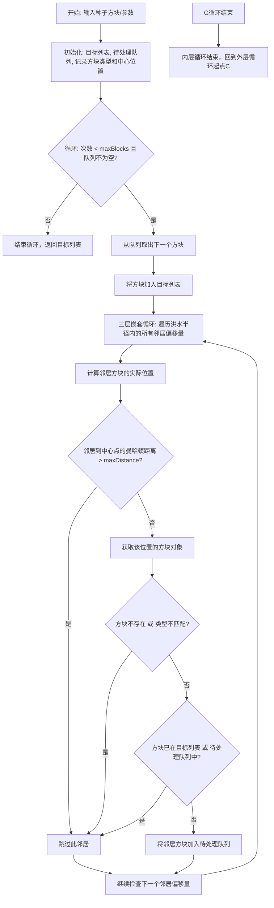
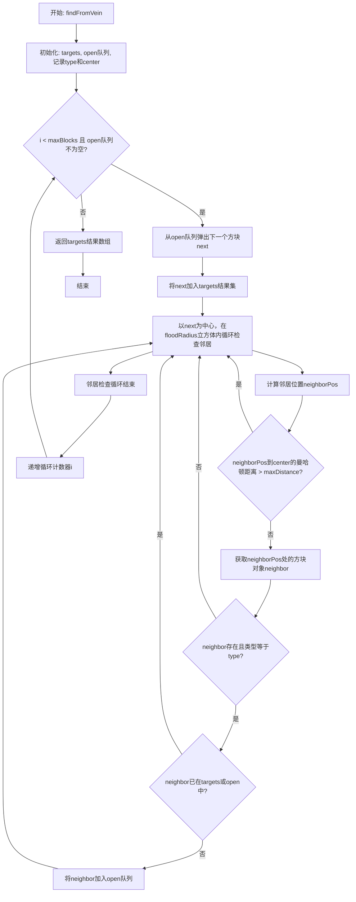

# `.\MetaGPT\metagpt\environment\minecraft\mineflayer\mineflayer-collectblock\src\BlockVeins.ts` 详细设计文档

该代码实现了一个用于《我的世界》机器人的矿脉查找算法。它从一个给定的方块（种子方块）出发，在指定的最大方块数量、最大距离和洪水半径约束下，通过广度优先搜索（BFS）算法，查找并返回所有与种子方块类型相同且连通的方块集合，用于实现类似“连锁挖矿”或矿脉追踪的功能。

## 整体流程



## 类结构

```
外部依赖
├── Bot (来自 'mineflayer')
└── Block (来自 'prismarine-block')
本文件
└── 全局函数 findFromVein
```

## 全局变量及字段


### `targets`
    
存储已发现的同类型方块集合，作为最终结果返回

类型：`Block[]`
    


### `open`
    
待探索的方块队列，用于广度优先搜索

类型：`Block[]`
    


### `type`
    
目标方块的类型ID，用于筛选同类型方块

类型：`number`
    


### `center`
    
起始方块的中心位置，用于计算曼哈顿距离限制搜索范围

类型：`Vec3`
    


### `next`
    
当前正在处理的方块，从待探索队列中弹出

类型：`Block | null`
    


### `neighborPos`
    
邻居方块的坐标位置

类型：`Vec3`
    


### `neighbor`
    
根据坐标获取的邻居方块对象

类型：`Block | null`
    


    

## 全局函数及方法


### `findFromVein`

该函数用于在 Minecraft 世界中，从一个给定的方块（通常为矿石）开始，执行一个受限制的洪水填充算法，以查找所有在指定距离和数量限制内、类型相同的相邻方块，从而模拟“矿脉”的查找过程。

参数：

-  `bot`：`Bot`，Mineflayer 机器人实例，用于与 Minecraft 世界交互和获取方块信息。
-  `block`：`Block`，搜索的起始方块，算法将查找与此方块类型相同的其他方块。
-  `maxBlocks`：`number`，要查找的最大方块数量限制，防止无限搜索。
-  `maxDistance`：`number`，从起始方块位置 (`center`) 算起的最大曼哈顿距离限制，超出此距离的方块将被忽略。
-  `floodRadius`：`number`，洪水填充的搜索半径，定义了从当前检查的方块向各个方向（x, y, z）探索的邻域范围。

返回值：`Block[]`，一个包含所有找到的、符合条件（类型相同且在距离限制内）的方块的数组。数组长度不超过 `maxBlocks`。

#### 流程图



#### 带注释源码

```typescript
// 从给定的起始方块开始，查找指定类型、在最大距离和数量限制内的相连方块（矿脉）
export function findFromVein (bot: Bot, block: Block, maxBlocks: number, maxDistance: number, floodRadius: number): Block[] {
  // targets: 用于存储最终找到的符合条件的所有方块
  const targets: Block[] = []
  // open: 一个栈（使用数组的pop方法实现LIFO），用于存储待检查的方块。初始包含起始方块。
  const open: Block[] = [block]
  // type: 记录我们要查找的目标方块类型（与起始方块相同）
  const type = block.type
  // center: 记录起始方块的位置，用于计算曼哈顿距离
  const center = block.position

  // 主循环：最多查找 maxBlocks 个方块
  for (let i = 0; i < maxBlocks; i++) {
    // 从open栈中取出下一个待处理的方块（深度优先搜索）
    const next = open.pop()
    // 如果open栈为空，提前结束搜索
    if (next == null) break

    // 将当前处理的方块加入结果集
    targets.push(next)

    // 以当前方块(next)为中心，在一个立方体邻域内查找相邻方块
    // 立方体边长为 (2 * floodRadius + 1)
    for (let x = -floodRadius; x <= floodRadius; x++) {
      for (let y = -floodRadius; y <= floodRadius; y++) {
        for (let z = -floodRadius; z <= floodRadius; z++) {
          // 计算邻居方块的绝对位置
          const neighborPos = next.position.offset(x, y, z)
          // 检查1: 邻居位置到起始位置(center)的曼哈顿距离是否超过最大限制
          if (neighborPos.manhattanDistanceTo(center) > maxDistance) continue

          // 通过bot对象获取该位置的实际方块信息
          const neighbor = bot.blockAt(neighborPos)
          // 检查2: 方块是否存在且类型是否与目标类型一致
          if (neighbor == null || neighbor.type !== type) continue

          // 检查3 & 4: 避免重复处理。如果方块已在结果集(targets)或待处理队列(open)中，则跳过。
          if (targets.includes(neighbor)) continue
          if (open.includes(neighbor)) continue

          // 通过所有检查，将新发现的、符合条件的邻居方块加入待处理队列(open)
          open.push(neighbor)
        }
      }
    }
  }

  // 返回找到的所有方块数组
  return targets
}
```


## 关键组件


### 矿脉搜索算法

实现了一个基于三维洪水填充（Flood Fill）的矿脉搜索算法，用于在给定的最大距离和最大方块数量限制内，查找与起始方块类型相同的所有连通方块。

### 空间遍历与邻域探索

通过三层嵌套循环在指定的`floodRadius`半径内探索当前方块的所有三维邻域位置，使用曼哈顿距离作为距离度量，以中心点为基准进行最大距离约束。

### 状态管理与去重

使用`targets`数组记录已发现的符合条件的目标方块，使用`open`数组作为待探索方块的栈。通过检查方块是否已存在于`targets`或`open`数组中来避免重复处理和无限循环。

### 条件过滤与边界检查

在探索每个邻域位置时，依次进行距离检查、方块存在性检查、类型匹配检查和重复性检查，确保只将有效的、未处理过的同类型方块加入待探索列表。


## 问题及建议


### 已知问题

-   **算法效率低下**：使用 `Array.includes()` 在数组（`targets` 和 `open`）中检查邻居方块是否已存在。这是一个 O(n) 的操作，当处理大量方块时（例如大型矿脉），这会显著降低性能，因为每次检查都需要遍历整个数组。
-   **重复计算与边界检查不精确**：`floodRadius` 参数定义了一个立方体区域来搜索邻居，但使用曼哈顿距离 (`manhattanDistanceTo`) 进行最终的距离筛选。这可能导致检查许多不必要的方块（立方体角落的方块），增加了计算开销。算法本质上是广度优先搜索(BFS)，但邻居探索策略不够高效。
-   **缺乏错误处理与边界条件处理**：函数没有对输入参数（如 `maxBlocks`, `maxDistance`, `floodRadius`）进行有效性验证（例如，负数或非数值）。`bot.blockAt` 可能返回 `null`，但仅用于跳过，没有更详细的错误处理或日志记录。
-   **内存使用可能过高**：`targets` 和 `open` 数组会随着发现的方块数量增长而线性增长。对于非常大的矿脉，这可能会消耗大量内存。
-   **代码可读性与维护性**：嵌套的三层 `for` 循环虽然直观，但降低了代码的可读性。使用曼哈顿距离和立方体偏移的组合逻辑可能让初次阅读者感到困惑。

### 优化建议

-   **使用 `Set` 替代数组进行存在性检查**：将 `targets` 和 `open` 的数据结构从 `Array` 改为 `Set`（或至少使用一个 `Set` 用于记录已访问方块）。`Set.has()` 操作的平均时间复杂度是 O(1)，可以极大提升在大型数据集上的性能。
-   **优化邻居探索策略**：考虑使用更精确的邻居定义（例如，仅检查六个直接相邻的方块，即上下左右前后）。如果 `floodRadius` 意图是定义搜索“步长”，那么当前的立方体探索是低效的。可以重构为标准的 BFS，每次从 `open` 队列中取出一个方块，然后检查其六个相邻位置。
-   **添加参数验证与防御性编程**：在函数开始处添加对输入参数的检查，确保它们是有效的数字且符合预期（例如，`maxBlocks > 0`, `maxDistance >= 0`, `floodRadius >= 0`）。可以抛出清晰的错误或返回空数组。
-   **考虑性能与内存的权衡**：如果矿脉可能非常大，可以考虑实现迭代深化搜索或分块处理，以避免一次性加载所有方块到内存中。不过，对于大多数游戏内应用，使用优化的 `Set` 通常足够。
-   **重构代码以提高可读性**：将邻居探索的逻辑提取到一个单独的函数中。使用更具描述性的变量名。如果坚持使用立方体偏移，可以考虑预先计算偏移向量数组，以避免嵌套循环。
-   **添加详细的注释和文档**：说明函数的目的、参数的含义、算法的局限性（例如，使用曼哈顿距离）以及性能特征。
-   **考虑使用更高效的距离计算**：如果 `maxDistance` 是欧几里得距离，而 `manhattanDistanceTo` 是曼哈顿距离，两者不等价，这可能导致距离筛选不准确。需要明确需求并选择正确的距离度量。如果目的是限制搜索范围，使用欧几里得距离平方进行比较可能更高效（避免开方运算）。


## 其它


### 设计目标与约束

该函数旨在高效、准确地从一个给定的方块（通常为矿石）开始，在三维空间内进行有限范围的洪泛搜索，以找到所有同类型的、相互连接的方块，从而模拟“矿脉”的识别。核心设计目标包括：**性能**（通过限制搜索块数和距离来控制计算成本）、**准确性**（确保找到的方块在空间上是连通的，且类型匹配）、**资源友好**（避免无限循环和内存溢出）。主要约束包括：依赖外部库（`mineflayer`和`prismarine-block`）提供的方块数据结构和世界查询接口；使用曼哈顿距离作为距离度量，这可能不如欧几里得距离精确，但计算更快；算法复杂度受`maxBlocks`、`maxDistance`和`floodRadius`立方的影响。

### 错误处理与异常设计

当前代码的异常处理较为隐式，依赖于外部库的行为和前置条件：
1.  **输入验证缺失**：函数未对输入参数（如`maxBlocks`、`maxDistance`、`floodRadius`）进行有效性检查（例如，是否为负数）。调用者需确保传入合理的值。
2.  **外部依赖错误**：`bot.blockAt(neighborPos)`可能返回`null`（例如，位置超出世界边界）。代码通过`if (neighbor == null ...)`进行了处理，将其忽略，这符合“跳过无效位置”的静默处理策略。
3.  **空值处理**：对`open.pop()`的结果进行了`null`检查，以安全地终止循环。
4.  **潜在错误**：如果`block`参数本身无效（例如为`null`或类型未定义），函数将直接抛出异常。`targets.includes`和`open.includes`在数组较大时可能导致性能问题，属于设计上的潜在风险点，但未作为错误抛出。

建议的强化措施包括：在函数开头添加参数验证并抛出清晰的`Error`；考虑将`includes`检查替换为`Set`以提高性能并明确处理重复项。

### 数据流与状态机

函数的数据流清晰，遵循典型的洪泛算法（Flood Fill）模式：
1.  **初始化**：输入起始方块`block`和配置参数。初始化`targets`（结果集）、`open`（待处理队列，初始包含起始方块）、`type`（目标方块类型）、`center`（搜索中心点）。
2.  **循环处理**：
    *   **状态转移**：从`open`队列末尾取出一个方块（`next`）。如果队列为空，则终止。
    *   **状态记录**：将`next`加入`targets`结果集。
    *   **邻居探索**：以`next`为中心，在`floodRadius`定义的立方体范围内生成邻居位置。
    *   **条件过滤**：对每个邻居位置，依次检查：a) 是否超出`maxDistance`（曼哈顿距离）；b) 获取方块对象是否成功且类型匹配；c) 是否已在`targets`或`open`中。只有通过所有检查的邻居才被加入`open`队列。
3.  **终止与输出**：循环在达到`maxBlocks`限制或`open`队列为空时终止。最终返回`targets`数组。

整个函数可以看作一个简单的状态机：`(open队列, targets集合)` 随着每次循环迭代而演变，直到满足终止条件。

### 外部依赖与接口契约

函数强依赖于两个外部库，并定义了清晰的接口契约：
1.  **`mineflayer`库的`Bot`实例**：
    *   **契约**：必须提供`blockAt(position)`方法，该方法接收一个位置向量，返回一个`Block`对象或`null`。
    *   **用途**：用于查询世界在特定位置的方块信息。
2.  **`prismarine-block`库的`Block`类型**：
    *   **契约**：`Block`对象必须包含`type`（数字或标识符，用于类型比较）和`position`属性。`position`对象必须具有`offset(x, y, z)`和`manhattanDistanceTo(otherPosition)`方法。
    *   **用途**：表示方块实体，提供位置操作和距离计算。
3.  **函数自身的接口契约**：
    *   **输入**：
        *   `bot: Bot`：有效的Mineflayer机器人实例。
        *   `block: Block`：搜索的起始方块，必须有效且位于世界内。
        *   `maxBlocks: number`：最大搜索方块数量，应为正整数。
        *   `maxDistance: number`：从起始中心点算起的最大曼哈顿距离，应为非负数。
        *   `floodRadius: number`：每次搜索时检查邻居的半径，应为非负整数。
    *   **输出**：返回一个`Block[]`数组，包含所有找到的、符合条件且连通的同类型方块。可能为空数组（如果起始方块无效或没有邻居），也可能小于`maxBlocks`（如果矿脉较小）。

任何违反上述契约的行为（如传入无效的`Bot`或`Block`）都可能导致运行时错误或不可预期的结果。

    