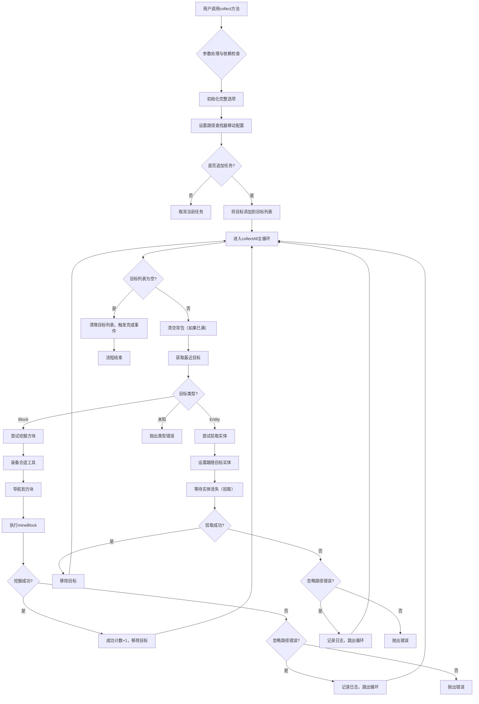
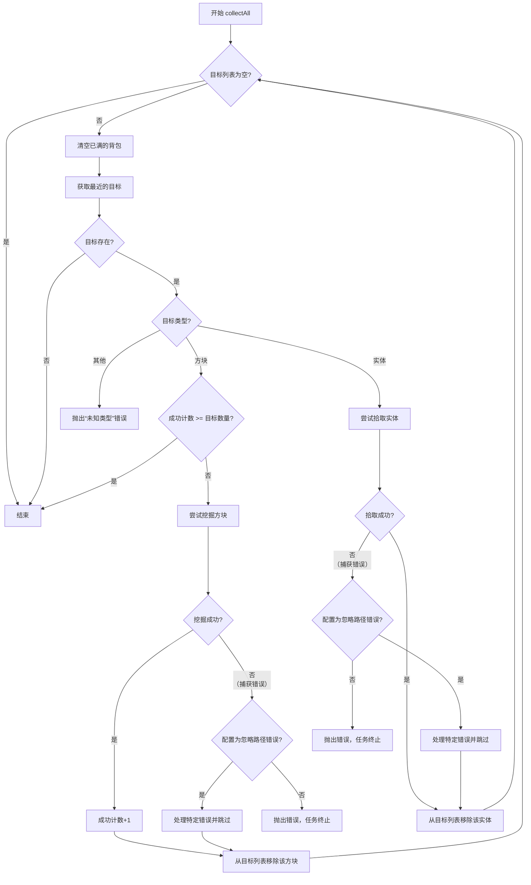
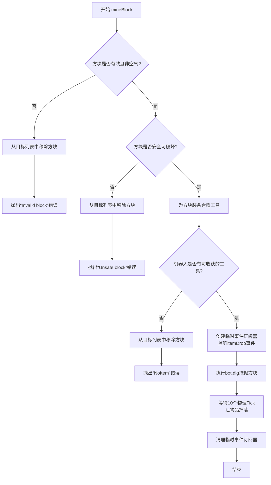
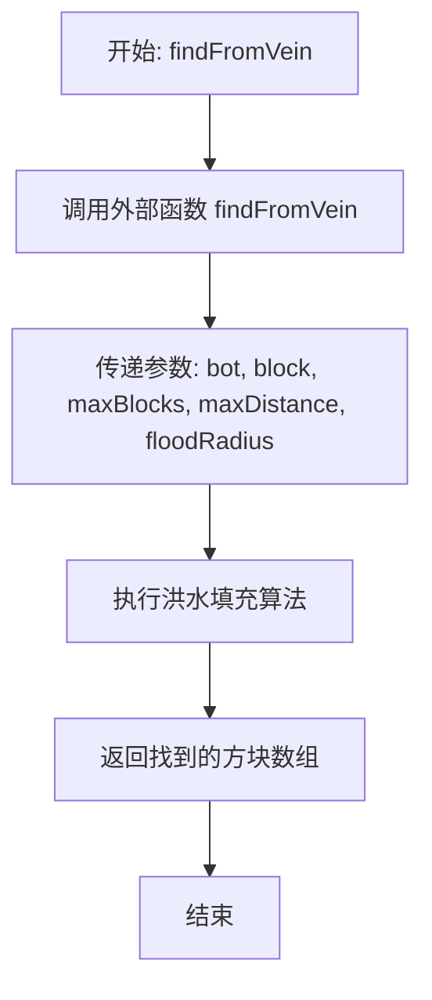
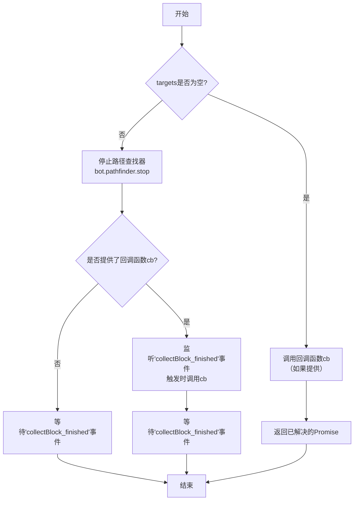

# `.\MetaGPT\metagpt\environment\minecraft\mineflayer\mineflayer-collectblock\src\CollectBlock.ts` 详细设计文档

该文件实现了一个用于Minecraft机器人的‘收集方块’插件。其核心功能是让机器人自动导航到目标方块或实体（如掉落物）的位置，执行挖掘或拾取动作，收集掉落物，并在背包满时自动将物品存入指定的箱子中。插件通过集成路径查找、工具选择、事件监听和任务管理，提供了一个可配置、可中断的资源收集自动化解决方案。

## 整体流程



## 类结构

```
CollectBlock (主插件类)
├── 字段: bot, targets, movements, chestLocations, itemFilter
├── 方法: constructor, collect, findFromVein, cancelTask
├── 内部函数: collectAll, mineBlock
├── 类型定义: Callback, CollectOptions, CollectOptionsFull
└── 常量: equipToolOptions
```

## 全局变量及字段


### `equipToolOptions`
    
配置对象，用于定义机器人挖掘方块时装备工具的行为参数，包括是否要求可收获、是否从箱子获取工具以及最大工具数量限制。

类型：`{ requireHarvest: boolean; getFromChest: boolean; maxTools: number; }`
    


### `CollectBlock.bot`
    
Mineflayer 机器人实例，作为插件操作的核心对象，用于控制机器人的所有行为和状态。

类型：`Bot`
    


### `CollectBlock.targets`
    
目标管理器，用于存储和管理当前待收集的方块或实体目标，支持动态排序和移除操作。

类型：`Targets`
    


### `CollectBlock.movements`
    
路径规划器的移动配置对象，定义了机器人在寻路时的移动行为和约束条件，可动态设置。

类型：`Movements | undefined`
    


### `CollectBlock.chestLocations`
    
箱子位置数组，当机器人背包满时，用于指定允许存放物品的箱子坐标列表。

类型：`Vec3[]`
    


### `CollectBlock.itemFilter`
    
物品过滤器函数，用于判断哪些物品可以在背包满时转移到箱子中，默认排除工具、武器和盔甲类物品。

类型：`ItemFilter`
    
    

## 全局函数及方法


### `collectAll`

`collectAll` 函数是 `mineflayer-collectblock` 插件的核心执行引擎。它循环处理一个目标集合（`Targets`），根据目标的类型（方块或实体）执行不同的收集逻辑。对于方块，它会尝试挖掘并拾取掉落物；对于实体（通常是掉落物），它会尝试靠近并拾取。在每次循环前，会检查并清空已满的背包。该函数持续运行，直到收集到指定数量的物品（`options.count`）或目标列表为空。

参数：

- `bot`：`Bot`，执行收集操作的 Mineflayer 机器人实例。
- `options`：`CollectOptionsFull`，包含完整配置的收集选项，如目标列表、是否忽略路径错误、箱子位置、物品过滤器以及要收集的总数量。

返回值：`Promise<void>`，当收集任务完成（成功或失败）时解析，不返回具体值。

#### 流程图



#### 带注释源码

```typescript
async function collectAll(
    bot: Bot, // Mineflayer 机器人实例，用于执行所有游戏内操作
    options: CollectOptionsFull // 完整的收集配置选项
): Promise<void> {
    let success_count = 0; // 成功收集的计数器
    // 主循环：持续处理，直到目标列表为空
    while (!options.targets.empty) {
        // 1. 背包管理：如果背包满了，将物品转移到指定箱子
        await emptyInventoryIfFull(
            bot,
            options.chestLocations,
            options.itemFilter
        );
        // 2. 路径规划：从目标列表中获取距离最近的一个目标
        const closest = options.targets.getClosest();
        if (closest == null) break; // 如果没有目标，退出循环

        // 3. 类型分发：根据目标的构造函数名判断是方块还是实体
        switch (closest.constructor.name) {
            case "Block": { // 处理方块类型的目标
                try {
                    // 检查是否已达到需要收集的总数量
                    if (success_count >= options.count) {
                        break; // 达到数量，退出循环
                    }
                    // 3.1 装备合适的工具
                    await bot.tool.equipForBlock(
                        closest as Block,
                        equipToolOptions
                    );
                    // 3.2 移动到能“看到”该方块的位置（便于挖掘）
                    const goal = new goals.GoalLookAtBlock(
                        closest.position,
                        bot.world
                    );
                    await bot.pathfinder.goto(goal);
                    // 3.3 执行挖掘逻辑
                    await mineBlock(bot, closest as Block, options);
                    success_count++; // 挖掘成功，计数增加
                    // TODO: options.ignoreNoPath // 待办：处理无路径情况
                } catch (err) {
                    // 错误处理：如果挖掘过程中出现错误
                    // 首先尝试清除路径finder的目标，防止状态残留
                    try {
                        bot.pathfinder.setGoal(null);
                    } catch (err) {}
                    // 如果配置为忽略路径错误，则进行详细错误分类处理
                    if (options.ignoreNoPath) {
                        // @ts-ignore
                        if (err.name === "Invalid block") {
                            console.log(
                                `Block ${closest.name} at ${closest.position} is not valid! Skip it!`
                            );
                        } // @ts-ignore
                        else if (err.name === "Unsafe block") {
                            console.log(
                                `${closest.name} at ${closest.position} is not safe to break! Skip it!`
                            );
                            // @ts-ignore
                        } else if (err.name === "NoItem") {
                            // 处理没有合适工具的错误
                            const properties =
                                bot.registry.blocksByName[closest.name];
                            const leastTool = Object.keys(
                                properties.harvestTools
                            )[0];
                            const item = bot.registry.items[leastTool];
                            bot.chat(
                                `I need at least a ${item.name} to mine ${closest.name}!  Skip it!`
                            );
                            return; // 需要特定工具，直接结束任务
                        } else if (
                            // @ts-ignore
                            err.name === "NoPath" ||
                            // @ts-ignore
                            err.name === "Timeout"
                        ) {
                            // 处理路径查找失败或超时
                            // 如果机器人已经非常接近方块，尝试直接挖掘
                            if (
                                bot.entity.position.distanceTo(
                                    closest.position
                                ) < 0.5
                            ) {
                                await mineBlock(bot, closest as Block, options);
                                break;
                            }
                            console.log(
                                `No path to ${closest.name} at ${closest.position}! Skip it!`
                            );
                            // @ts-ignore
                        } else if (err.message === "Digging aborted") {
                            console.log(`Digging aborted! Skip it!`);
                        } else {
                            // 其他未知错误，通过聊天栏报告
                            // @ts-ignore
                            bot.chat(`Error: ${err.message}`);
                        }
                        break; // 在忽略错误模式下，跳过当前目标，继续下一个
                    }
                    // 如果不是忽略错误模式，则将错误向上抛出，终止整个任务
                    throw err;
                }
                break; // 方块处理完毕，跳出 switch
            }
            case "Entity": { // 处理实体类型的目标（通常是掉落物）
                // 只收集有效的实体
                if (!(closest as Entity).isValid) break;
                try {
                    // 4.1 创建临时事件监听器，用于监听实体消失（被拾取）
                    const tempEvents = new TemporarySubscriber(bot);
                    const waitForPickup = new Promise<void>(
                        (resolve, reject) => {
                            // 设置10秒超时，防止无限等待
                            const timeout = setTimeout(() => {
                                clearTimeout(timeout);
                                tempEvents.cleanup();
                                reject(new Error("Failed to pickup item"));
                            }, 10000);
                            // 监听 entityGone 事件，如果消失的实体是目标，则拾取成功
                            tempEvents.subscribeTo(
                                "entityGone",
                                (entity: Entity) => {
                                    if (entity === closest) {
                                        clearTimeout(timeout);
                                        tempEvents.cleanup();
                                        resolve();
                                    }
                                }
                            );
                        }
                    );
                    // 4.2 设置路径目标：跟随该实体，距离为0
                    bot.pathfinder.setGoal(
                        new goals.GoalFollow(closest as Entity, 0)
                    );
                    // 等待拾取完成（通过 Promise 解析）或超时
                    await waitForPickup;
                } catch (err) {
                    // 实体拾取错误处理
                    // @ts-ignore
                    console.log(err.stack);
                    try {
                        bot.pathfinder.setGoal(null);
                    } catch (err) {}
                    if (options.ignoreNoPath) {
                        // @ts-ignore
                        if (err.message === "Failed to pickup item") {
                            bot.chat(`Failed to pickup item! Skip it!`);
                        }
                        break; // 忽略错误，跳过当前实体
                    }
                    throw err; // 不忽略错误，抛出异常
                }
                break; // 实体处理完毕，跳出 switch
            }
            default: { // 处理未知类型的目标，抛出错误
                throw error(
                    "UnknownType",
                    `Target ${closest.constructor.name} is not a Block or Entity!`
                );
            }
        }
        // 5. 无论成功或失败（在忽略错误模式下），都将当前处理过的目标从列表中移除
        options.targets.removeTarget(closest);
    }
    // 6. 所有目标处理完毕，在聊天栏发送完成消息
    bot.chat(`Collect finish!`);
}
```


### `mineBlock`

该函数是 `mineflayer-collectblock` 插件的核心方法之一，负责执行单个方块的挖掘与物品收集流程。它首先验证目标方块的有效性和安全性，然后为机器人装备合适的工具，接着执行挖掘动作，并监听挖掘过程中掉落的物品实体，将其添加到收集目标列表中。

参数：

- `bot`：`Bot`，执行操作的Mineflayer机器人实例。
- `block`：`Block`，需要挖掘和收集的目标方块。
- `options`：`CollectOptionsFull`，包含完整配置选项的对象，用于控制收集行为（如目标列表、物品过滤器等）。

返回值：`Promise<void>`，异步操作，成功时完成，失败时抛出错误。

#### 流程图



#### 带注释源码

```typescript
async function mineBlock(
    bot: Bot,
    block: Block,
    options: CollectOptionsFull
): Promise<void> {
    // 1. 前置验证：检查目标方块是否仍然存在且有效
    if (
        bot.blockAt(block.position)?.type !== block.type ||
        bot.blockAt(block.position)?.type === 0
    ) {
        // 方块类型不匹配或为空气(0)，视为无效
        options.targets.removeTarget(block);
        throw error("Invalid block", "Block is not valid!");
        // @ts-expect-error
        // 2. 安全性检查：使用pathfinder的movements判断方块是否安全可破坏
    } else if (!bot.pathfinder.movements.safeToBreak(block)) {
        options.targets.removeTarget(block);
        throw error("Unsafe block", "Block is not safe to break!");
    }

    // 3. 工具准备：为挖掘此方块装备最佳工具
    await bot.tool.equipForBlock(block, equipToolOptions);

    // 4. 工具有效性验证：检查当前手持工具是否能收获此方块
    if (!block.canHarvest(bot.heldItem ? bot.heldItem.type : bot.heldItem)) {
        options.targets.removeTarget(block);
        throw error("NoItem", "Bot does not have a harvestable tool!");
    }

    // 5. 事件监听：创建临时事件订阅器，监听挖掘后掉落的物品
    const tempEvents = new TemporarySubscriber(bot);
    tempEvents.subscribeTo("itemDrop", (entity: Entity) => {
        // 判断掉落的物品实体是否来自当前挖掘的方块（位置相近）
        if (
            entity.position.distanceTo(block.position.offset(0.5, 0.5, 0.5)) <=
            0.5
        ) {
            // 将掉落物添加到收集目标列表中
            options.targets.appendTarget(entity);
        }
    });
    try {
        // 6. 执行挖掘：调用bot.dig开始破坏方块
        await bot.dig(block);
        // 7. 等待物品掉落：等待10个游戏刻，确保物品实体已生成并完成初始物理更新
        await new Promise<void>((resolve) => {
            let remainingTicks = 10;
            tempEvents.subscribeTo("physicTick", () => {
                remainingTicks--;
                if (remainingTicks <= 0) {
                    tempEvents.cleanup();
                    resolve();
                }
            });
        });
    } finally {
        // 8. 资源清理：确保临时事件监听器被清理，避免内存泄漏
        tempEvents.cleanup();
    }
}
```

### `CollectBlock.constructor`

构造函数，用于初始化 `CollectBlock` 插件实例。它接收一个 `Bot` 对象，并设置插件运行所需的核心组件，包括目标管理器（`Targets`）和路径规划器的移动配置（`Movements`）。

参数：

- `bot`：`Bot`，代表 Minecraft 机器人的实例，是插件操作的主体对象。

返回值：`void`，构造函数不返回任何值。

#### 流程图

```mermaid
flowchart TD
    A[开始: CollectBlock.constructor(bot)] --> B[将传入的 bot 赋值给 this.bot]
    B --> C[创建 Targets 实例 this.targets]
    C --> D[根据 bot 版本创建 Movements 实例 this.movements]
    D --> E[结束]
```

#### 带注释源码

```typescript
/**
 * Creates a new instance of the create block plugin.
 *
 * @param bot - The bot this plugin is acting on.
 */
constructor(bot: Bot) {
    // 将传入的 Bot 实例存储为类的私有成员，供其他方法使用。
    this.bot = bot;
    // 初始化一个 Targets 实例，用于管理要收集的目标（方块或实体）。
    this.targets = new Targets(bot);
    // 根据当前机器人的 Minecraft 版本，初始化路径规划器的移动配置（Movements）。
    // @ts-ignore 注释用于忽略 TypeScript 的类型检查错误，因为 mcDataLoader 的返回类型可能与 Movements 构造函数期望的类型不完全匹配。
    this.movements = new Movements(bot, mcDataLoader(bot.version));
}
```

### `CollectBlock.collect`

该方法用于收集指定的方块或实体。如果目标是方块，机器人会尝试挖掘并收集掉落物；如果目标是实体（如掉落物），机器人会尝试靠近并拾取。该方法支持批量处理多个目标，并提供了丰富的配置选项来控制收集行为，如是否追加到现有任务、是否忽略路径错误、如何处理背包满的情况等。

参数：

- `target`：`Collectable | Collectable[]`，要收集的目标，可以是单个方块/实体，也可以是它们的数组。
- `options`：`CollectOptions | Callback`，收集行为的配置选项，或者是一个回调函数（用于向后兼容）。
- `cb`：`Callback`，可选的回调函数，当收集任务完成或出错时调用。

返回值：`Promise<void>`，一个 Promise，在收集任务完成时解析，出错时拒绝。

#### 流程图

```mermaid
flowchart TD
    A[开始: collect] --> B{options 是函数?}
    B -- 是 --> C[cb = options, options = {}]
    B -- 否 --> D
    C --> D{cb 不为空?}
    D -- 是 --> E[使用 callbackify 包装并返回]
    D -- 否 --> F[填充完整选项 optionsFull]
    E --> Z[结束]
    F --> G{检查 pathfinder 插件}
    G -- 不存在 --> H[抛出 UnresolvedDependency 错误]
    G -- 存在 --> I{检查 tool 插件}
    I -- 不存在 --> J[抛出 UnresolvedDependency 错误]
    I -- 存在 --> K[设置 pathfinder 的 movements]
    H --> Z
    J --> Z
    K --> L{options.append 为 false?}
    L -- 是 --> M[调用 cancelTask 取消当前任务]
    L -- 否 --> N
    M --> N[将目标添加到 targets 列表]
    N --> O[调用 collectAll 执行收集循环]
    O --> P{collectAll 执行成功?}
    P -- 是 --> Q[清空 targets 列表]
    P -- 否 --> R[清空 targets 列表]
    Q --> S[触发 'collectBlock_finished' 事件]
    R --> T{错误是 PathStopped?}
    T -- 是 --> S
    T -- 否 --> U[抛出错误]
    S --> Z
    U --> Z
```

#### 带注释源码

```typescript
    /**
     * 如果目标是方块：
     * 让机器人挖掘并收集目标方块。
     *
     * 如果目标是掉落物：
     * 让机器人收集该掉落物。
     *
     * 如果目标是包含物品或方块的数组，则对所有目标执行正确的操作，
     * 并动态按距离排序。
     *
     * @param target - 要收集的方块或物品。
     * @param options - 处理这些目标时使用的选项集
     * @param cb - 完成时调用的回调函数。
     */
    async collect(
        target: Collectable | Collectable[], // 要收集的目标，可以是单个或多个
        options: CollectOptions | Callback = {}, // 配置选项或回调函数（用于兼容性）
        cb?: Callback // 可选的回调函数
    ): Promise<void> {
        // 处理向后兼容性：如果第二个参数是函数，则将其视为回调
        if (typeof options === "function") {
            cb = options;
            options = {};
        }
        // 如果提供了回调函数，使用 util.callbackify 将 Promise 风格的方法转换为回调风格
        // @ts-expect-error
        if (cb != null) return callbackify(this.collect)(target, options, cb);

        // 使用默认值填充完整的选项对象
        const optionsFull: CollectOptionsFull = {
            append: options.append ?? false, // 是否追加到现有任务
            ignoreNoPath: options.ignoreNoPath ?? false, // 是否忽略路径错误
            chestLocations: options.chestLocations ?? this.chestLocations, // 箱子位置
            itemFilter: options.itemFilter ?? this.itemFilter, // 物品过滤器
            targets: this.targets, // 目标列表
            count: options.count ?? Infinity, // 要收集的物品数量
        };

        // 检查必需的插件依赖
        if (this.bot.pathfinder == null) {
            throw error(
                "UnresolvedDependency",
                "The mineflayer-collectblock plugin relies on the mineflayer-pathfinder plugin to run!"
            );
        }

        if (this.bot.tool == null) {
            throw error(
                "UnresolvedDependency",
                "The mineflayer-collectblock plugin relies on the mineflayer-tool plugin to run!"
            );
        }

        // 如果配置了移动策略，则应用到 pathfinder
        if (this.movements != null) {
            this.bot.pathfinder.setMovements(this.movements);
        }

        // 如果不是追加模式，先取消当前可能正在运行的任务
        if (!optionsFull.append) await this.cancelTask();
        // 将目标添加到内部目标列表中
        if (Array.isArray(target)) {
            this.targets.appendTargets(target);
        } else {
            this.targets.appendTarget(target);
        }

        try {
            // 执行核心的收集循环逻辑
            await collectAll(this.bot, optionsFull);
            // 成功后清空目标列表
            this.targets.clear();
        } catch (err) {
            // 无论成功失败，都清空目标列表
            this.targets.clear();
            // 忽略由 cancelTask 引起的 PathStopped 错误，其他错误正常抛出
            // @ts-expect-error
            if (err.name !== "PathStopped") throw err;
        } finally {
            // 无论结果如何，都触发完成事件
            // @ts-expect-error
            this.bot.emit("collectBlock_finished");
        }
    }
```


### `CollectBlock.findFromVein`

该方法用于查找与给定方块类型相同且相邻的方块，实现类似洪水填充算法以获取同一矿脉中的所有方块。它通过递归或迭代方式搜索相邻方块，直到达到最大方块数或最大距离限制。

参数：

- `block`：`Block`，起始方块，作为搜索的起点。
- `maxBlocks`：`number`，最大搜索方块数，默认为100，用于限制搜索范围。
- `maxDistance`：`number`，最大搜索距离，默认为16，表示从起始方块开始的最大曼哈顿或欧几里得距离。
- `floodRadius`：`number`，洪水填充半径，默认为1，定义两个方块被视为“相邻”的最大距离。

返回值：`Block[]`，返回一个方块数组，包含所有找到的与起始方块类型相同且满足条件的相邻方块。

#### 流程图



#### 带注释源码

```typescript
/**
 * Loads all touching blocks of the same type to the given block and returns them as an array.
 * This effectively acts as a flood fill algorithm to retrieve blocks in the same ore vein and similar.
 *
 * @param block - The starting block.
 * @param maxBlocks - The maximum number of blocks to look for before stopping.
 * @param maxDistance - The max distance from the starting block to look.
 * @param floodRadius - The max distance distance from block A to block B to be considered "touching"
 */
findFromVein(
    block: Block,
    maxBlocks = 100,
    maxDistance = 16,
    floodRadius = 1
): Block[] {
    // 调用外部模块的 findFromVein 函数，传递当前 bot 实例和所有参数
    return findFromVein(
        this.bot,
        block,
        maxBlocks,
        maxDistance,
        floodRadius
    );
}
```


### `CollectBlock.cancelTask`

取消当前正在执行的收集任务。如果任务正在运行，会停止路径查找器并等待任务完成；如果任务已经完成或未运行，则立即返回。

参数：

- `cb`：`Callback`，可选的回调函数，当任务成功取消后调用

返回值：`Promise<void>`，异步操作，不返回具体值

#### 流程图



#### 带注释源码

```typescript
/**
 * 取消当前正在执行的收集任务。
 * 如果任务正在运行，会停止路径查找器并等待任务完成；
 * 如果任务已经完成或未运行，则立即返回。
 *
 * @param cb - 可选的回调函数，当任务成功取消后调用
 * @returns 异步操作，不返回具体值
 */
async cancelTask(cb?: Callback): Promise<void> {
    // 检查当前是否有活跃的收集目标
    if (this.targets.empty) {
        // 如果没有活跃目标，直接调用回调（如果提供）并返回
        if (cb != null) cb();
        return await Promise.resolve();
    }
    
    // 停止路径查找器的当前任务
    this.bot.pathfinder.stop();
    
    // 如果提供了回调函数，监听任务完成事件
    if (cb != null) {
        // @ts-expect-error - 事件类型可能未在Bot类型中定义
        this.bot.once("collectBlock_finished", cb);
    }
    
    // 等待任务完成事件触发
    await once(this.bot, "collectBlock_finished");
}
```

## 关键组件


### 目标管理系统 (Targets)

负责管理和维护待收集的目标集合（方块或实体），提供添加、移除、获取最近目标等核心操作，是收集任务的核心数据驱动组件。

### 临时事件订阅器 (TemporarySubscriber)

提供一种临时订阅和自动清理Mineflayer Bot事件监听器的机制，用于在特定操作（如挖掘、拾取）期间监听相关事件，并在操作完成后自动移除监听器以避免内存泄漏。

### 方块矿脉查找器 (BlockVeins)

实现基于洪水填充算法的矿脉查找功能，用于从一个起始方块出发，自动查找并返回所有相邻的、同类型的方块，以支持批量收集矿石等资源。

### 库存管理工具 (Inventory)

提供清空库存的功能，当机器人背包满时，可以将指定物品转移到预设的箱子位置，确保收集任务可以持续进行。

### 收集任务主流程 (collectAll)

定义了收集任务的核心循环逻辑，包括处理不同类型的收集目标（方块、实体）、错误处理、路径规划以及与工具、库存管理等子系统的交互。

### 方块挖掘流程 (mineBlock)

封装了挖掘单个方块的具体步骤，包括方块有效性检查、安全挖掘判断、工具装备、挖掘执行以及掉落物监听与收集。

### 收集选项配置接口 (CollectOptions/CollectOptionsFull)

定义了收集任务的可配置参数，如是否追加任务、是否忽略路径错误、箱子位置、物品过滤器、收集数量等，提供了灵活的任务控制能力。

### 收集插件主类 (CollectBlock)

作为整个收集功能模块的入口点和管理器，整合了目标管理、路径规划、工具使用、事件处理等所有子组件，对外提供`collect`、`cancelTask`、`findFromVein`等主要API。


## 问题及建议


### 已知问题

1.  **错误处理不一致且脆弱**：代码中大量使用 `// @ts-ignore` 或 `// @ts-expect-error` 来绕过 TypeScript 类型检查，这掩盖了潜在的类型安全问题，使得错误处理逻辑依赖于运行时属性（如 `err.name` 或 `err.message`）的字符串匹配，容易因依赖库的更新而失效。
2.  **资源清理存在风险**：在 `mineBlock` 和实体收集的 `try-catch` 块中，`TemporarySubscriber` 的清理操作（`tempEvents.cleanup()`）可能不会在所有异常路径下被执行（例如，在 `bot.dig` 抛出同步错误时，`finally` 块会执行，但实体收集中的 `reject` 分支可能不会调用 `cleanup`），可能导致事件监听器泄漏。
3.  **路径规划停止逻辑可能干扰状态**：在 `collectAll` 函数中，当捕获到错误时，会尝试执行 `bot.pathfinder.setGoal(null)`。这个操作可能干扰插件内部状态，且其自身的错误被一个空的 `catch` 块忽略，这不利于调试。
4.  **`collect` 方法参数重载逻辑复杂**：`collect` 方法使用 `typeof options === “function”` 来检测重载，并手动处理回调函数与 Promise 的转换（通过 `callbackify`）。这种模式增加了代码的认知负担，且 `// @ts-expect-error` 的使用表明类型定义不完善。
5.  **硬编码的等待与超时机制**：在等待实体拾取和物品掉落时，使用了硬编码的等待时间（10秒，10个tick）。这些值缺乏配置选项，且可能在不同服务器环境下表现不佳。
6.  **`itemFilter` 默认实现过于具体且低效**：默认的 `itemFilter` 通过一系列 `includes` 调用来检查物品名称，这既效率不高（每次过滤都需检查多个字符串），也不够健壮（无法覆盖所有工具、武器或盔甲，例如模组物品）。
7.  **`CollectOptionsFull` 接口未导出**：`CollectOptionsFull` 是一个内部使用的接口，但未导出。虽然这可能是设计意图，但它限制了高级用户或测试代码对完整配置的引用。

### 优化建议

1.  **重构错误处理，定义明确的错误类型**：创建一个自定义的 `CollectBlockError` 类，包含如 `NoPathError`、`UnsafeBlockError`、`NoToolError` 等子类。在代码中抛出这些类型的错误，并在 `catch` 块中使用 `instanceof` 进行检查。这样可以消除所有 `// @ts-ignore` 注释，使错误处理更健壮、类型安全。
2.  **确保资源的确定清理**：为 `TemporarySubscriber` 实现类似 `using` 的模式或确保在所有可能的退出路径（包括 `reject`）中都调用 `cleanup`。可以考虑使用 `try...finally` 包装主要的异步操作，或将 `TemporarySubscriber` 的创建和清理封装在一个辅助函数中。
3.  **简化路径规划状态管理**：重新评估直接调用 `bot.pathfinder.setGoal(null)` 的必要性。考虑让 `bot.pathfinder.stop()`（已在 `cancelTask` 中调用）来统一管理目标状态。移除那个忽略错误的空 `catch` 块，或者至少记录错误。
4.  **简化 API 设计，分离回调与 Promise 接口**：考虑提供两个独立的公共方法，例如 `collectAsync(...): Promise<void>` 和 `collect(...， callback): void`，以避免在单个方法内进行复杂的参数类型检测和转换。这能显著改善类型提示和代码可读性。
5.  **将等待参数配置化**：将 `mineBlock` 中等待物品掉落的 tick 数、以及实体拾取的超时时间，作为 `CollectOptions` 的可配置项（例如 `dropWaitTicks`, `pickupTimeoutMs`），并提供合理的默认值。
6.  **优化默认的 `itemFilter`**：利用 `minecraft-data` 或 `prismarine-item` 提供的物品分类信息（如 `item.tags` 或 `item.category`）来更准确、高效地判断物品是否为工具、武器或盔甲。例如，可以检查物品是否具有 `is_tool`、`is_weapon` 等标签。
7.  **考虑导出 `CollectOptionsFull` 或提供配置构建器**：如果外部有需要，可以考虑导出 `CollectOptionsFull`。或者，提供一个配置构建器函数来帮助用户创建完整的配置对象，这也能提升内部代码的可读性。
8.  **增加更多可观测性和调试支持**：在关键步骤（如开始挖掘、成功拾取、跳过目标）触发更细粒度的事件（例如 `collectBlock:digging_start`, `collectBlock:item_picked_up`, `collectBlock:target_skipped`），方便用户监控和调试机器人的行为。
9.  **代码结构优化**：`collectAll` 函数体积较大，可以考虑将处理 `Block` 和 `Entity` 的逻辑分别提取到独立的函数（如 `collectBlock` 和 `collectEntity`）中，以提高代码的模块化和可测试性。


## 其它


### 设计目标与约束

该模块的核心设计目标是提供一个可扩展、可靠且易于使用的自动化资源收集插件，用于Minecraft机器人（Bot）。主要约束包括：必须与`mineflayer`生态系统的其他插件（如`mineflayer-pathfinder`、`mineflayer-tool`）无缝集成；需要处理Minecraft游戏世界的动态性和不确定性（如实体移动、方块更新）；性能上需考虑路径查找、物品管理、事件监听等操作的效率，避免阻塞主循环或造成游戏卡顿。

### 错误处理与异常设计

模块采用混合错误处理策略：对于预期内的操作失败（如无法到达目标、无法挖掘方块），通过`options.ignoreNoPath`选项允许用户选择是静默跳过并记录日志还是抛出异常。对于程序错误或意外状态（如依赖插件缺失、目标类型未知），则始终抛出具有特定`name`和`message`的`Error`对象（通过`error`工具函数创建），如`"UnresolvedDependency"`、`"UnknownType"`。在`collectAll`和`mineBlock`函数中，使用`try...catch`块捕获异步操作异常，并根据错误类型进行相应处理（如移除无效目标、清理事件监听器、重置路径目标）。`TemporarySubscriber`的使用确保了事件监听器的及时清理，防止内存泄漏。

### 数据流与状态机

数据流始于用户调用`CollectBlock.collect()`方法，传入目标（方块或实体）和选项。目标被添加到内部的`Targets`集合中。主循环`collectAll`持续从`Targets`中获取最近目标，并根据其类型（`Block`或`Entity`）执行不同的收集逻辑（挖掘或拾取）。在挖掘方块时，可能产生新的物品实体，这些实体会通过事件监听被自动添加到`Targets`中，形成反馈循环。机器人状态（如库存是否已满）会触发子流程`emptyInventoryIfFull`。整个收集过程的状态主要由`Targets`集合（空/非空）和外部路径查找器的状态控制。`cancelTask`方法通过停止路径查找器和发射`collectBlock_finished`事件来中断状态机。

### 外部依赖与接口契约

*   **硬依赖**：
    *   `mineflayer`: 核心机器人框架。
    *   `mineflayer-pathfinder`: 提供路径查找和移动能力（`goals`, `Movements`）。`CollectBlock`要求`bot.pathfinder`存在。
    *   `mineflayer-tool`: 提供自动装备合适工具的能力（`bot.tool.equipForBlock`）。`CollectBlock`要求`bot.tool`存在。
*   **软依赖/数据提供**：
    *   `prismarine-block`, `prismarine-entity`, `prismarine-item`, `minecraft-data`: 提供游戏内对象的数据结构和元信息。
    *   `vec3`: 提供三维向量运算。
*   **内部模块依赖**：
    *   `./TemporarySubscriber`, `./Util`, `./Inventory`, `./BlockVeins`, `./Targets`: 这些是插件内部的工具模块或核心组件，分别负责临时事件订阅、错误生成、库存管理、矿脉查找和目标管理。
*   **接口契约**：
    *   `CollectOptions`接口定义了用户可配置的行为参数。
    *   `Callback`类型定义了传统的Node.js风格回调函数签名。
    *   `CollectBlock`类对外暴露了`collect`、`findFromVein`、`cancelTask`等公共方法，以及`chestLocations`、`itemFilter`等可配置属性。

### 并发与异步控制

模块大量使用`async/await`语法处理异步操作，如路径查找(`bot.pathfinder.goto`)、挖掘(`bot.dig`)、装备工具(`bot.tool.equipForBlock`)。在`collectAll`函数中使用`while`循环顺序处理目标，确保了收集任务的原子性和可预测性，避免了并发操作同一资源可能引发的竞态条件。`TemporarySubscriber`与`Promise`结合，用于处理需要等待特定事件（如`entityGone`、`physicTick`）的超时控制，例如在拾取实体时设置10秒超时。`cancelTask`方法通过`bot.pathfinder.stop()`和事件监听(`once`)来实现任务的异步取消。

### 配置管理与默认值

配置主要通过`CollectOptions`接口和`CollectBlock`类的实例属性管理。`CollectBlock`构造函数设置了`movements`、`chestLocations`（空数组）和`itemFilter`（默认过滤工具和盔甲）的默认值。在`collect`方法中，用户提供的`options`会与实例的默认配置（`this.chestLocations`, `this.itemFilter`）进行合并，生成完整的`CollectOptionsFull`对象。这种设计允许全局默认配置与每次调用时的特定覆盖相结合，提供了灵活性。`equipToolOptions`作为一个模块级常量，定义了挖掘时装备工具的内部策略。

### 事件与钩子机制

模块主要使用两种事件机制：
1.  **Minecraft游戏事件**：通过`TemporarySubscriber`订阅`itemDrop`、`entityGone`、`physicTick`等游戏事件，以响应世界状态变化（如方块被挖掘后掉落物品、实体被拾取）。这些订阅是临时的，在操作完成后立即清理。
2.  **插件生命周期事件**：`CollectBlock`插件在任务完成（无论成功或失败）时，会发射一个自定义事件`collectBlock_finished`。这主要用于支持`cancelTask`的异步等待，也为外部监听器提供了任务结束的钩子。插件本身不广泛使用或暴露复杂的事件系统。

### 测试策略建议

*   **单元测试**：针对`CollectBlock`类的方法（如`findFromVein`、`itemFilter`逻辑）、工具函数（如`mineBlock`中的状态检查）和`Targets`类的核心功能进行隔离测试。使用模拟（Mock）对象替代真实的`bot`、`block`、`entity`。
*   **集成测试**：在模拟的或受控的Minecraft服务器环境中，测试`collect`方法与`mineflayer-pathfinder`、`mineflayer-tool`插件的协同工作。重点测试路径查找成功/失败、工具装备、库存满后转移物品、挖掘不同方块、拾取实体等完整流程。
*   **错误处理测试**：专门测试各种错误场景，如依赖插件缺失、目标无效、路径不可达、挖掘被中断、拾取超时等，验证错误是否被正确抛出或按`ignoreNoPath`选项处理。
*   **性能与压力测试**：测试收集大量目标（如大矿脉）时的内存使用和性能表现，确保`TemporarySubscriber`不会造成监听器堆积，`Targets`管理高效。


    