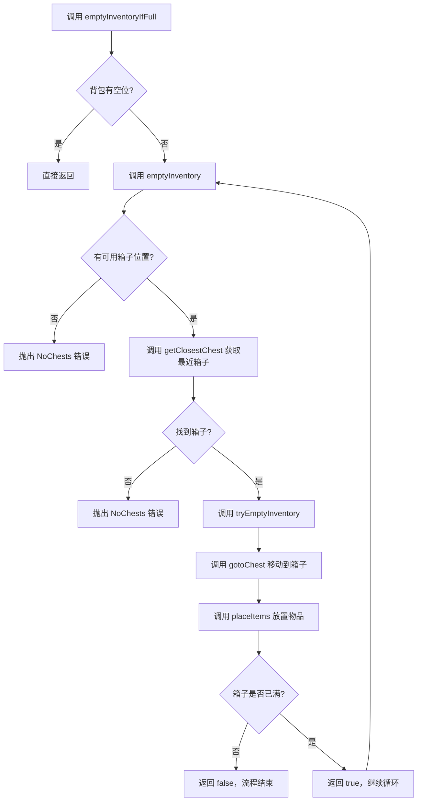
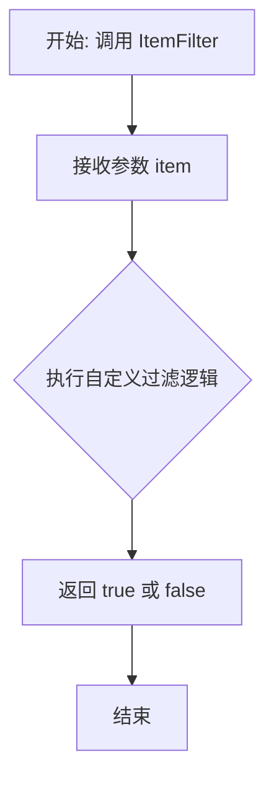
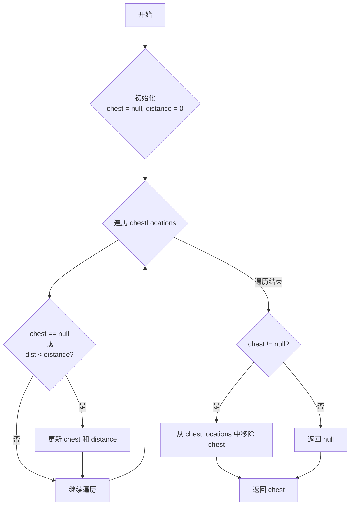
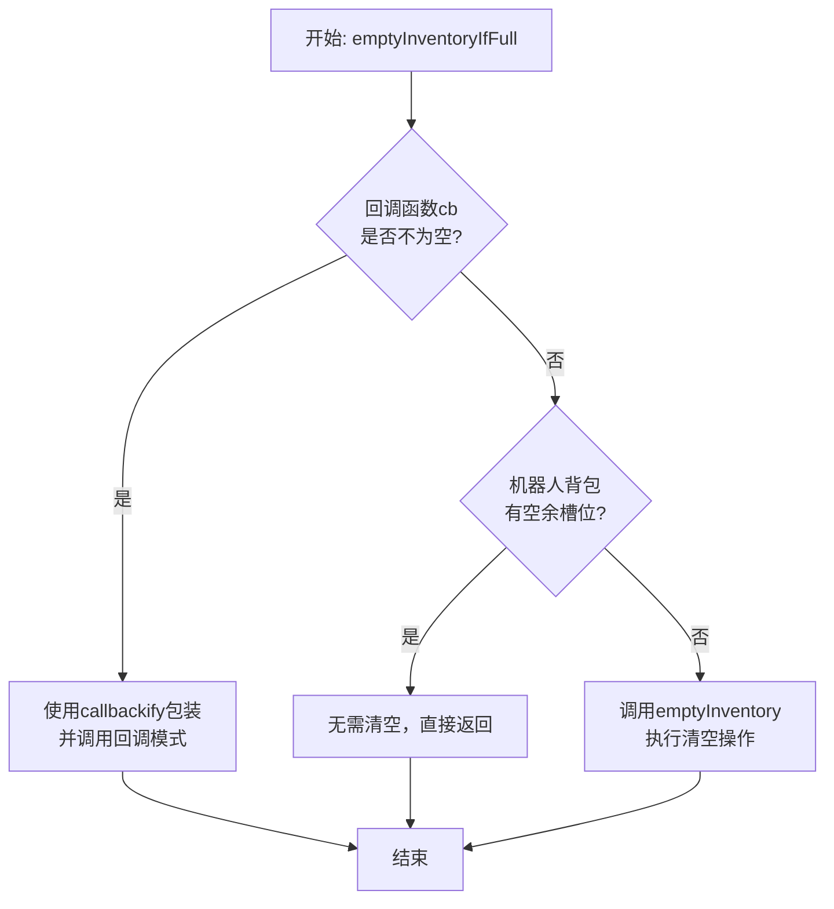
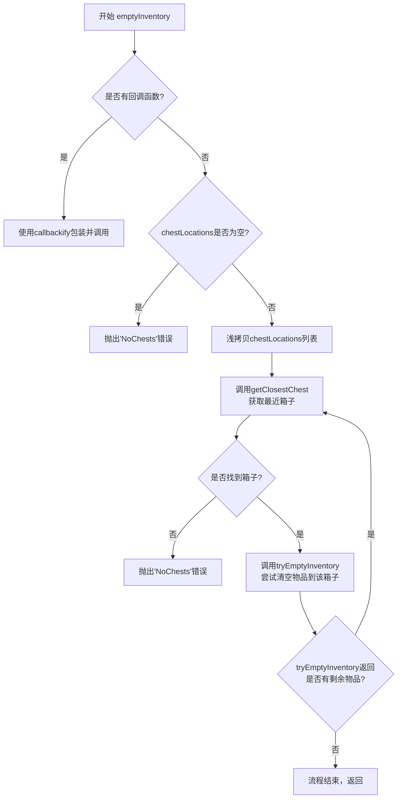
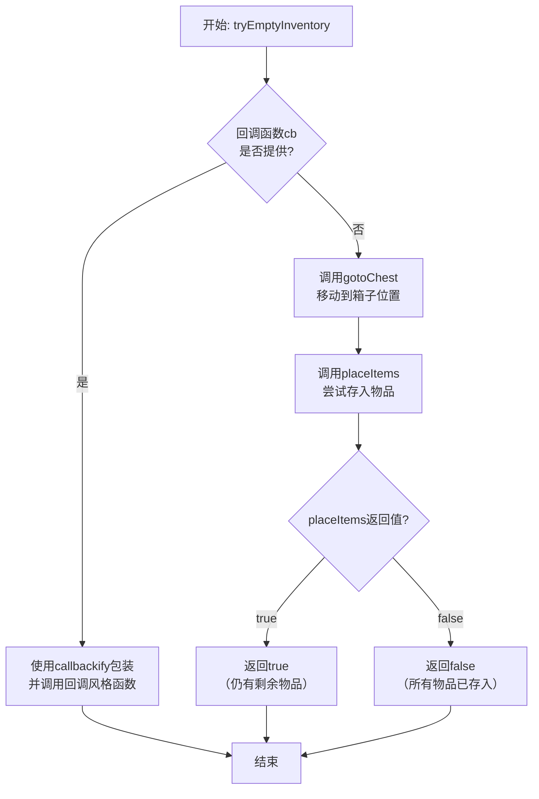
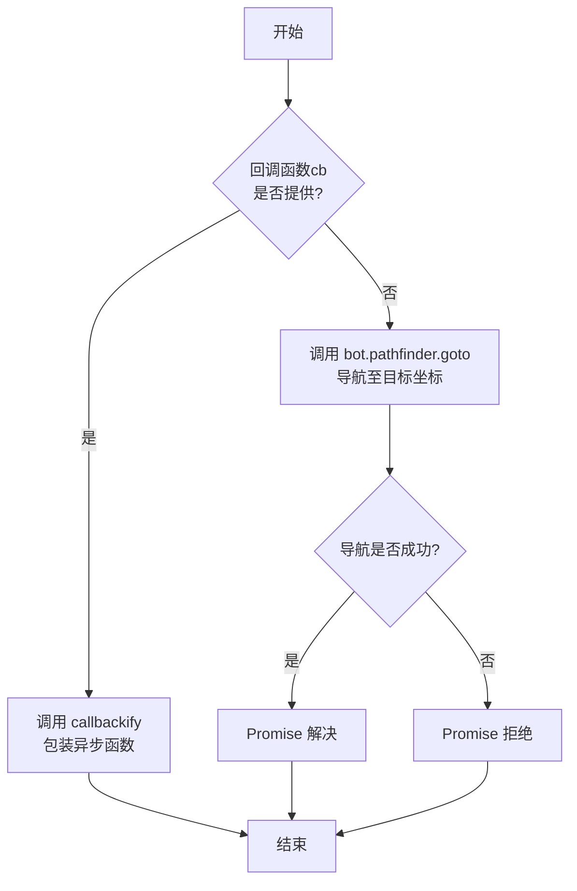
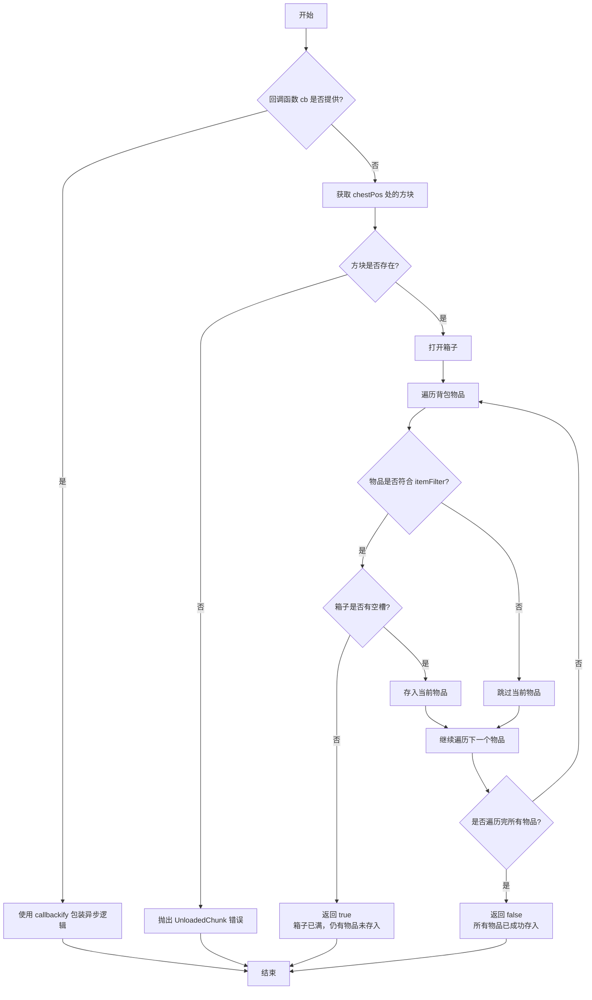

# `.\MetaGPT\metagpt\environment\minecraft\mineflayer\mineflayer-collectblock\src\Inventory.ts` 详细设计文档

该代码是一个用于Minecraft机器人的库存管理模块，核心功能是当机器人背包空间不足时，自动寻找并前往最近的箱子，将背包中符合特定筛选条件的物品存入其中，以清空背包空间。它处理了箱子位置管理、路径规划、箱子交互和物品转移等逻辑。

## 整体流程



## 类结构

```
全局函数与类型定义
├── 类型: ItemFilter
├── 函数: getClosestChest
├── 导出函数: emptyInventoryIfFull
├── 导出函数: emptyInventory
├── 内部函数: tryEmptyInventory
├── 内部函数: gotoChest
└── 内部函数: placeItems
```

## 全局变量及字段


    

## 全局函数及方法


### `ItemFilter`

`ItemFilter` 是一个类型别名，它定义了一个函数签名。该函数用于判断一个给定的 `Item` 对象是否满足特定条件，通常用于在物品列表中筛选出符合条件的物品。

参数：

-  `item`：`Item`，一个 `prismarine-item` 库定义的物品对象，包含物品的类型、元数据、数量等信息。

返回值：`boolean`，如果传入的 `item` 满足过滤条件则返回 `true`，否则返回 `false`。

#### 流程图



#### 带注释源码

```typescript
// 定义一个类型别名 ItemFilter，它是一个函数类型。
// 该函数接受一个 Item 类型的参数，并返回一个布尔值。
export type ItemFilter = (item: Item) => boolean
```


### `getClosestChest`

该函数用于从给定的箱子位置列表中，找出距离机器人（Bot）当前位置最近的一个箱子位置。找到后，会将该位置从原始列表中移除，以避免后续重复使用。

参数：
- `bot`：`Bot`，代表一个Minecraft机器人实例，用于获取其当前位置。
- `chestLocations`：`Vec3[]`，一个包含多个箱子位置（三维坐标）的数组。

返回值：`Vec3 | null`，返回找到的最近箱子位置；如果输入列表为空，则返回`null`。

#### 流程图



#### 带注释源码

```typescript
function getClosestChest (bot: Bot, chestLocations: Vec3[]): Vec3 | null {
  // 初始化最近箱子和距离
  let chest = null
  let distance = 0

  // 遍历所有箱子位置
  for (const c of chestLocations) {
    // 计算当前箱子到机器人的距离
    const dist = c.distanceTo(bot.entity.position)
    // 如果是第一个箱子，或者当前箱子更近，则更新最近箱子和距离
    if (chest == null || dist < distance) {
      chest = c
      distance = dist
    }
  }

  // 如果找到了箱子，将其从列表中移除，防止后续重复使用
  if (chest != null) {
    chestLocations.splice(chestLocations.indexOf(chest), 1)
  }

  // 返回找到的最近箱子位置，如果列表为空则返回 null
  return chest
}
```

### `emptyInventoryIfFull`

该函数是库存管理模块的入口点，用于在机器人的背包已满时，自动将物品转移到指定的箱子中。它首先检查背包是否已满，如果未满则直接返回；如果已满，则调用核心的 `emptyInventory` 函数执行转移操作。该函数支持传统的回调函数模式，但内部已通过 `callbackify` 适配为 `async/await` 的 Promise 模式。

参数：
- `bot`：`Bot`，Mineflayer 的机器人实例，代表游戏中的玩家实体。
- `chestLocations`：`Vec3[]`，一个包含箱子坐标（Vec3 对象）的数组，指定了可以存放物品的箱子位置。
- `itemFilter`：`ItemFilter`，一个函数，用于过滤背包中的物品，决定哪些物品需要被转移。
- `cb`：`Callback`（可选），一个传统的 Node.js 风格的回调函数。如果提供，函数将使用回调模式。

返回值：`Promise<void>`，一个 Promise 对象，在物品转移成功完成或无需转移时解析，在发生错误时拒绝。

#### 流程图



#### 带注释源码

```typescript
export async function emptyInventoryIfFull (
  bot: Bot, // Mineflayer 机器人实例
  chestLocations: Vec3[], // 可用箱子的位置数组
  itemFilter: ItemFilter, // 物品过滤器，决定转移哪些物品
  cb?: Callback // 可选的回调函数，用于传统异步模式
): Promise<void> {
  // 如果提供了回调函数，则使用 util.callbackify 将本函数转换为回调模式并执行。
  // @ts-expect-error 注释用于忽略 TypeScript 对 callbackify 参数类型的检查。
  if (cb != null) return callbackify(emptyInventoryIfFull)(bot, chestLocations, cb)

  // 检查背包是否有空余槽位。如果有，说明背包未满，无需执行清空操作，直接返回。
  if (bot.inventory.emptySlotCount() > 0) return

  // 背包已满，调用核心的 emptyInventory 函数，将物品转移到箱子中。
  return await emptyInventory(bot, chestLocations, itemFilter)
}
```

### `emptyInventory`

该函数是清空机器人（Bot）背包的核心逻辑。当机器人背包中有物品时，它会寻找最近的箱子，移动到箱子旁，打开箱子，并将背包中符合过滤条件的物品存入箱子。如果最近的箱子已满，它会从列表中移除该箱子并尝试下一个最近的箱子，直到所有物品被清空或所有箱子都已满。

参数：
- `bot`：`Bot`，代表Minecraft游戏中的机器人实例，用于执行移动、打开容器等操作。
- `chestLocations`：`Vec3[]`，一个包含箱子位置（三维坐标）的数组，指定了可以存放物品的箱子位置。
- `itemFilter`：`ItemFilter`，一个函数，用于过滤背包中的物品，只有返回`true`的物品才会被存入箱子。
- `cb`：`Callback`，可选的回调函数，用于支持传统的回调风格调用。

返回值：`Promise<void>`，当所有符合条件的物品被成功存入箱子或所有箱子都已满时，Promise解析；如果过程中出现错误（如没有定义箱子位置或所有箱子都满），则Promise拒绝。

#### 流程图



#### 带注释源码

```typescript
export async function emptyInventory (bot: Bot, chestLocations: Vec3[], itemFilter: ItemFilter, cb?: Callback): Promise<void> {
  // @ts-expect-error
  // 如果提供了回调函数cb，则使用Node.js的util.callbackify工具将本异步函数转换为回调风格并立即返回。
  if (cb != null) return callbackify(emptyInventory)(bot, chestLocations, cb)

  // 检查传入的箱子位置数组是否为空，如果为空则抛出错误。
  if (chestLocations.length === 0) {
    throw error('NoChests', 'There are no defined chest locations!')
  }

  // 对箱子位置数组进行浅拷贝，以便在后续循环中安全地移除已满的箱子，而不影响原始数组。
  chestLocations = [...chestLocations]

  // 进入主循环，持续尝试将物品存入箱子，直到没有剩余物品或没有可用箱子。
  while (true) {
    // 调用getClosestChest函数，从列表中找出离机器人当前位置最近的箱子。
    const chest = getClosestChest(bot, chestLocations)
    // 如果getClosestChest返回null，说明列表中所有箱子都已被尝试过并移除（即都满了），抛出错误。
    if (chest == null) {
      throw error('NoChests', 'All chests are full.')
    }
    // 调用tryEmptyInventory函数，尝试将背包物品存入找到的这个最近箱子。
    // 该函数返回一个布尔值，表示是否还有物品未能存入（即箱子已满但背包还有物品）。
    const hasRemaining = await tryEmptyInventory(bot, chest, itemFilter)
    // 如果hasRemaining为false，表示所有物品已成功存入，函数结束。
    if (!hasRemaining) return
    // 如果hasRemaining为true，表示当前箱子已满但背包还有物品，循环继续，尝试下一个最近的箱子。
  }
}
```


### `tryEmptyInventory`

尝试将机器人背包中符合过滤条件的物品存入指定位置的箱子。如果箱子已满或无法完全容纳所有物品，则返回 `true` 表示仍有剩余物品需要处理；否则返回 `false` 表示所有物品已成功存入。

参数：

- `bot`：`Bot`，Mineflayer 机器人实例，用于执行游戏内操作。
- `chestLocation`：`Vec3`，目标箱子的三维坐标位置。
- `itemFilter`：`ItemFilter`，物品过滤函数，用于判断背包中的物品是否符合存入条件。
- `cb`：`(err: Error | undefined, hasRemaining: boolean) => void`，可选的回调函数，用于支持传统的回调风格调用。如果提供此参数，函数将使用回调方式执行。

返回值：`Promise<boolean>`，返回一个 Promise，解析为布尔值。`true` 表示仍有物品未存入（箱子已满），`false` 表示所有符合条件的物品已成功存入。

#### 流程图



#### 带注释源码

```typescript
async function tryEmptyInventory (
  bot: Bot, // Mineflayer 机器人实例
  chestLocation: Vec3, // 目标箱子的坐标
  itemFilter: ItemFilter, // 物品过滤函数
  cb?: (err: Error | undefined, hasRemaining: boolean) => void // 可选的回调函数
): Promise<boolean> {
  // @ts-expect-error
  // 如果提供了回调函数 `cb`，则使用 Node.js 的 `callbackify` 工具将当前 Promise-based 函数转换为回调风格并执行。
  // 这通常是为了向后兼容或支持特定的调用模式。
  if (cb != null) return callbackify(tryEmptyInventory)(bot, chestLocation, itemFilter, cb)

  // 1. 移动到箱子位置：调用 `gotoChest` 函数，使机器人导航到 `chestLocation` 指定的坐标。
  await gotoChest(bot, chestLocation)
  // 2. 尝试存入物品：调用 `placeItems` 函数，将机器人背包中通过 `itemFilter` 筛选的物品存入箱子。
  //    该函数返回一个布尔值，指示是否仍有物品未存入（箱子已满）。
  return await placeItems(bot, chestLocation, itemFilter)
}
```


### `gotoChest`

该函数控制机器人（Bot）移动到指定坐标位置的箱子处，使用 `mineflayer-pathfinder` 模块的路径规划功能导航至目标方块。

参数：

- `bot`：`Bot`，Mineflayer 机器人实例，用于执行移动和路径规划操作。
- `location`：`Vec3`，目标箱子的三维坐标位置。
- `cb`：`Callback`（可选），传统的 Node.js 风格回调函数，用于异步操作完成后的错误处理或结果返回。

返回值：`Promise<void>`，当机器人成功移动到目标位置或发生错误时，Promise 被解决或拒绝。

#### 流程图



#### 带注释源码

```typescript
async function gotoChest (bot: Bot, location: Vec3, cb?: Callback): Promise<void> {
  // @ts-expect-error
  // 如果提供了传统的回调函数 `cb`，则使用 `callbackify` 工具将当前异步函数包装成回调风格并立即返回。
  // 这行 TypeScript 注释用于抑制因动态参数检查可能产生的类型错误警告。
  if (cb != null) return callbackify(gotoChest)(bot, location)

  // 核心功能：使用 Mineflayer 的路径查找器模块，创建一个“到达目标方块”的目标，
  // 并等待机器人移动到该坐标位置。
  // `goals.GoalGetToBlock` 创建一个路径点目标，机器人会尝试寻路并移动到该方块所在位置。
  await bot.pathfinder.goto(new goals.GoalGetToBlock(location.x, location.y, location.z))
}
```

### `placeItems`

`placeItems` 函数负责将机器人背包中符合过滤条件的物品存入指定的箱子中。它会先检查箱子是否在已加载的区块内，然后打开箱子，并遍历背包物品，将符合条件的物品存入箱子。如果箱子已满但仍有物品未存入，则返回 `true`，否则返回 `false`。

参数：

- `bot`：`Bot`，Mineflayer 机器人实例，用于执行游戏内操作。
- `chestPos`：`Vec3`，箱子的三维坐标位置。
- `itemFilter`：`ItemFilter`，物品过滤函数，用于判断哪些物品需要存入箱子。
- `cb`：`(err: Error | undefined, hasRemaining: boolean) => void`，可选的回调函数，用于处理异步操作的结果。

返回值：`Promise<boolean>`，返回一个 Promise，解析为布尔值。`true` 表示箱子已满但仍有物品未存入；`false` 表示所有符合条件的物品已成功存入或没有符合条件的物品。

#### 流程图



#### 带注释源码

```typescript
// 异步函数，用于将背包物品存入指定箱子
async function placeItems (
  bot: Bot,                    // Mineflayer 机器人实例
  chestPos: Vec3,              // 箱子的三维坐标
  itemFilter: ItemFilter,      // 物品过滤函数，决定哪些物品需要存入
  cb?: (err: Error | undefined, hasRemaining: boolean) => void // 可选的回调函数
): Promise<boolean> {          // 返回 Promise，解析为布尔值（是否有剩余物品）
  // @ts-expect-error
  // 如果提供了回调函数 cb，则使用 callbackify 将异步函数转换为回调风格
  if (cb != null) return callbackify(placeItems)(bot, chestPos, itemFilter, cb)

  // 根据坐标获取箱子方块对象
  const chestBlock = bot.blockAt(chestPos)
  // 如果方块不存在（例如区块未加载），则抛出错误
  if (chestBlock == null) {
    throw error('UnloadedChunk', 'Chest is in an unloaded chunk!')
  }

  // 打开箱子，获取箱子容器对象
  const chest = await bot.openChest(chestBlock)

  // 遍历机器人背包中的所有物品
  for (const item of bot.inventory.items()) {
    // 如果物品不符合过滤条件，则跳过
    if (!itemFilter(item)) continue

    // 检查箱子是否已满（没有空槽）
    if (chest.firstEmptyContainerSlot() === null) {
      // 箱子已满，但仍有物品未存入，返回 true
      return true
    }

    // 将当前物品存入箱子
    // 参数：物品类型、元数据、数量
    await chest.deposit(item.type, item.metadata, item.count)
  }

  // 所有符合条件的物品都已成功存入，返回 false
  return false
}
```

## 关键组件


### 物品过滤器 (ItemFilter)

一个用于判断物品是否应该被存入箱子的回调函数类型，允许调用者自定义物品筛选逻辑。

### 箱子位置管理 (ChestLocations Management)

一个用于管理和遍历可用箱子位置的机制，包含查找最近箱子、从列表中移除已满箱子等功能，确保机器人能高效地找到可用的存储空间。

### 库存清空流程 (Inventory Emptying Process)

一个多步骤的异步流程，负责在机器人库存已满时，自动导航至最近的箱子，并按照物品过滤器将物品存入箱子，直到所有符合条件的物品被清空或所有箱子已满。

### 路径查找与导航 (Pathfinding and Navigation)

利用 `mineflayer-pathfinder` 库，实现机器人从当前位置自动寻路并移动到指定箱子位置的功能。

### 箱子交互 (Chest Interaction)

通过 `bot.openChest` 打开箱子，并利用箱子容器的 `deposit` 方法，将机器人库存中的物品安全地存入箱子。

### 回调兼容层 (Callback Compatibility Layer)

通过 `callbackify` 工具函数，为所有异步函数提供可选的基于回调（Callback）的旧式 API 支持，以保持与旧代码的兼容性。


## 问题及建议


### 已知问题

-   **回调函数支持存在类型错误**：代码中使用 `// @ts-expect-error` 注释来抑制 TypeScript 的类型检查错误，这表明 `callbackify` 包装后的函数签名与原始异步函数不匹配，存在潜在的类型安全问题。
-   **`getClosestChest` 函数存在副作用**：该函数在找到最近的箱子后，会从传入的 `chestLocations` 数组中移除该箱子。这个副作用行为未在函数名或文档中明确说明，容易导致调用者困惑和意外的数据修改。
-   **`emptyInventory` 函数中的无限循环风险**：函数使用 `while (true)` 循环，依赖于 `getClosestChest` 返回 `null` 或 `tryEmptyInventory` 返回 `false` 来退出。如果 `tryEmptyInventory` 逻辑有误或箱子状态异常，可能导致无限循环。
-   **资源未正确释放**：`placeItems` 函数中通过 `bot.openChest` 打开了箱子容器，但在函数结束时没有调用 `chest.close()` 来关闭它，可能导致资源泄漏或游戏状态异常。
-   **错误处理粒度较粗**：当箱子区块未加载或所有箱子都满时，直接抛出错误。对于“箱子满”的情况，可能更适合返回一个特定的状态码或让调用者决定后续行为（如等待或寻找新箱子），而不是立即终止流程。

### 优化建议

-   **重构回调支持机制**：建议移除对 `callbackify` 的依赖，或者创建一个包装器函数来正确处理类型签名。更好的做法是统一使用 `async/await` 风格，如果必须支持回调，应明确定义重载函数签名。
-   **分离 `getClosestChest` 的职责**：将“查找最近箱子”和“从列表中移除已使用箱子”两个逻辑拆分成独立的函数。例如，`findClosestChest` 只负责查找，`markChestAsUsed` 负责管理列表。这可以提高代码的可读性和可测试性。
-   **为循环添加安全退出机制**：在 `emptyInventory` 的 `while` 循环中，可以添加一个最大尝试次数限制，或者在每次迭代后检查机器人状态，避免因意外情况导致的无限循环。
-   **确保资源清理**：在 `placeItems` 函数中，使用 `try...finally` 块来确保打开的箱子被正确关闭。例如：
    ```typescript
    const chest = await bot.openChest(chestBlock)
    try {
        // ... 存放物品的逻辑
    } finally {
        chest.close()
    }
    ```
-   **细化错误类型和状态返回**：定义更丰富的错误类型或返回值，以区分“无箱子位置”、“箱子区块未加载”、“箱子已满”等不同情况。这可以让调用者根据不同的失败原因采取更灵活的策略。
-   **增加日志和状态监控**：在关键步骤（如开始清空、选择箱子、前往箱子、存放物品）添加日志输出，便于调试和监控机器人状态。这对于长时间运行的自动化任务尤其重要。
-   **考虑性能优化**：`getClosestChest` 函数每次计算距离时都调用 `c.distanceTo(bot.entity.position)`。如果箱子列表很大，可以预先计算或缓存距离，或者使用更高效的空间数据结构（如四叉树、网格）来管理箱子位置。
-   **增强 `itemFilter` 的灵活性**：当前的 `ItemFilter` 只接收 `Item` 对象。可以考虑允许过滤器访问更多上下文信息（如机器人当前任务、箱子状态），以实现更动态的物品筛选逻辑。


## 其它


### 设计目标与约束

该模块的核心设计目标是提供一个自动化的库存管理功能，允许Minecraft机器人（bot）在其背包空间不足时，自动将物品转移到指定的箱子中。主要约束包括：必须兼容mineflayer的异步API；需要处理箱子位置列表，并智能选择最近的箱子；必须支持自定义的物品过滤器以决定哪些物品需要转移；需要同时支持Promise和传统的回调（callback）两种异步模式以保持向后兼容。

### 错误处理与异常设计

模块定义了自定义错误类型，通过`error`函数创建，主要包含两种错误场景：
1.  `'NoChests'`：当提供的箱子位置列表为空，或在尝试所有箱子后均发现已满时抛出。
2.  `'UnloadedChunk'`：当目标箱子所在的区块未被加载时抛出。
所有异步函数都通过`async/await`处理内部错误，并最终将错误传递给调用者（通过Promise rejection或回调函数的`err`参数）。函数入口处通过`callbackify`将基于Promise的实现适配为回调模式，确保两种调用方式下的错误都能正确传递。

### 数据流与状态机

**数据流**：
1.  **输入**：机器人实例(`bot`)、箱子坐标列表(`chestLocations`)、物品过滤函数(`itemFilter`)。
2.  **处理**：
    *   `emptyInventoryIfFull`检查背包空位，决定是否触发清空流程。
    *   `emptyInventory`循环处理箱子列表，每次调用`getClosestChest`获取最近箱子，然后调用`tryEmptyInventory`进行实际转移。
    *   `tryEmptyInventory`依次执行`gotoChest`（路径查找与移动）和`placeItems`（打开箱子并存入物品）。
3.  **输出**：无返回值。成功时Promise resolve（或回调无错误），失败时Promise reject（或回调携带错误）。

**状态机（简化）**：
*   **空闲** -> **检查库存**（由`emptyInventoryIfFull`触发）。
*   **检查库存** -> **选择箱子**（若库存满）。
*   **选择箱子** -> **移动至箱子** -> **存入物品**。
*   **存入物品** -> **完成**（若所有物品存入）或 **选择箱子**（若当前箱子已满且仍有物品待存）。

### 外部依赖与接口契约

**外部库依赖**：
1.  `mineflayer`：提供机器人核心控制API（`Bot`）、库存访问(`inventory`)和路径查找(`pathfinder`)。
2.  `mineflayer-pathfinder`：提供路径查找目标(`goals.GoalGetToBlock`)。
3.  `prismarine-item`：提供物品类型定义(`Item`)。
4.  `vec3`：提供三维向量操作(`Vec3`)。
5.  `util` (Node.js内置)：提供`callbackify`工具函数。

**接口契约**：
1.  `ItemFilter`：用户提供的函数，接受一个`Item`对象，返回一个布尔值，用于判断该物品是否需要被转移。
2.  `Callback`：从`./CollectBlock`导入的传统错误优先回调函数类型，用于支持旧的调用方式。
3.  所有导出函数(`emptyInventoryIfFull`, `emptyInventory`)均提供重载：既可接受可选的回调函数（遵循`Callback`类型），也可返回`Promise<void>`。

### 并发与异步设计

模块完全基于异步操作构建，核心逻辑使用`async/await`语法编写，确保代码清晰。通过`callbackify`工具函数，为每个核心函数提供了对传统回调模式的支持，这构成了主要的“技术债务”（见下文）。所有函数设计为顺序执行，不涉及多线程或并行操作。`emptyInventory`函数中的`while`循环会依次尝试箱子，直到成功清空库存或所有箱子尝试完毕。

### 配置与可扩展性

当前模块的配置主要通过函数参数传入：
*   `chestLocations`：箱子位置列表，决定了机器人可以使用的存储点。
*   `itemFilter`：物品过滤函数，提供了决定转移哪些物品的灵活性。
模块本身不具备从文件或环境变量加载配置的能力。可扩展性方面，可以通过提供不同的`itemFilter`实现来改变物品转移策略，但箱子选择策略（最近优先）和转移流程是硬编码的，扩展或修改这些行为需要直接修改源代码。

### 安全与边界条件

1.  **输入验证**：对`chestLocations`数组进行了基础检查（是否为空），但未验证每个`Vec3`坐标的有效性（例如是否在游戏世界内）。
2.  **状态依赖**：操作严重依赖游戏世界的实时状态（如区块加载、箱子是否被其他实体占用）。`placeItems`函数中检查了区块加载状态，但未处理打开箱子失败或存入物品过程中的其他游戏内异常。
3.  **资源清理**：`placeItems`函数中打开了箱子容器(`bot.openChest`)，但代码中未见显式的`chest.close()`调用。这可能导致容器接口未正确关闭，依赖于mineflayer或垃圾回收机制，存在潜在资源泄漏风险。
4.  **数组修改**：`getClosestChest`函数会从传入的数组副本中`splice`已使用的箱子，防止重复使用已满箱子。这是通过创建数组浅拷贝实现的，避免影响原始数据。

### 测试策略建议

1.  **单元测试**：
    *   `getClosestChest`：测试距离计算逻辑和数组修改行为。
    *   `itemFilter`：测试不同的过滤条件是否被正确应用。
    *   模拟`bot.inventory`、`bot.pathfinder`、`bot.openChest`等依赖，测试`tryEmptyInventory`、`placeItems`等函数的成功与失败路径（如箱子满、区块未加载）。
2.  **集成测试**：
    *   在真实的或模拟的Minecraft服务器环境中，测试从库存检查到物品存入的完整流程。
    *   测试回调模式和Promise模式是否都能正常工作。
3.  **场景测试**：
    *   多个箱子、箱子已满、无可用箱子、机器人移动中断等边界场景。

    