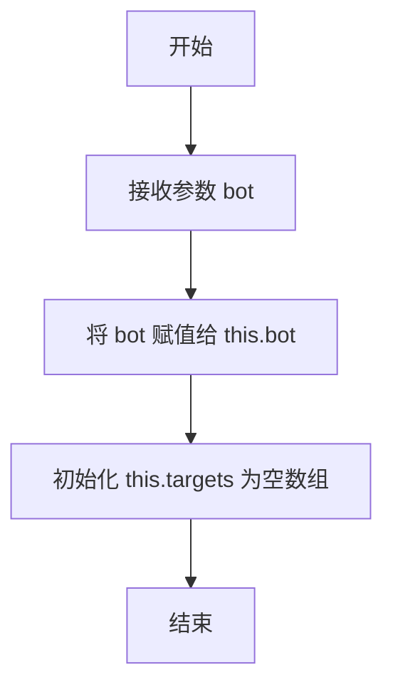
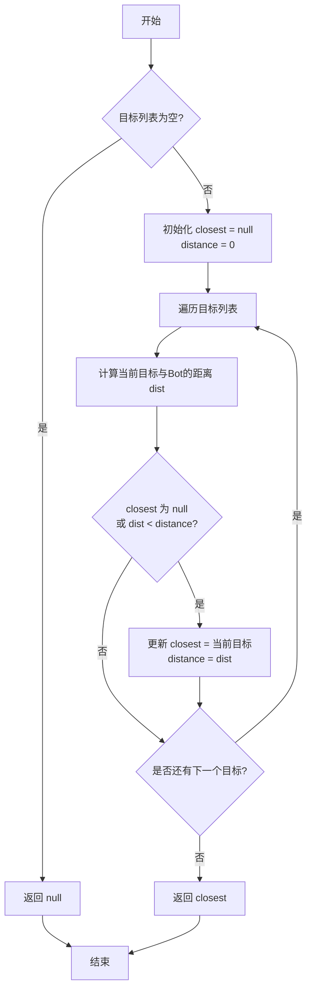
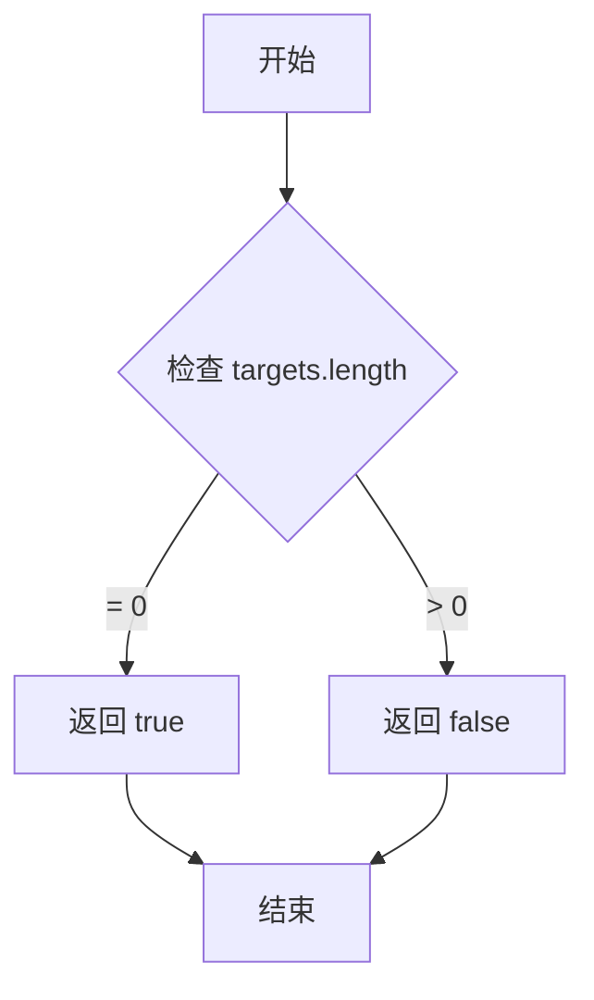
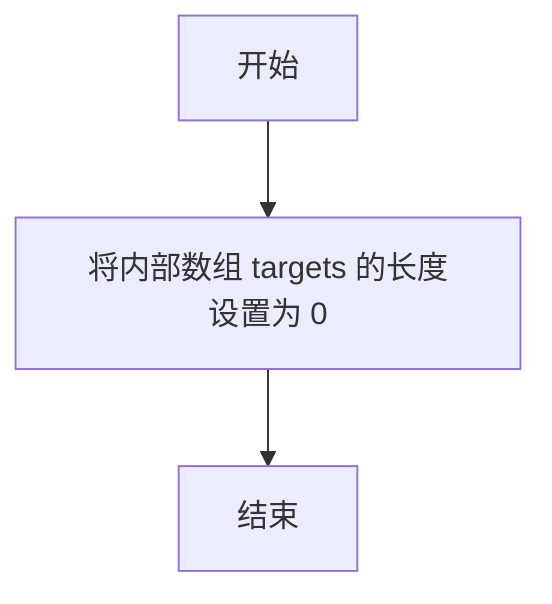

# `.\MetaGPT\metagpt\environment\minecraft\mineflayer\mineflayer-collectblock\src\Targets.ts` 详细设计文档

该代码定义了一个用于管理Minecraft机器人（Bot）可收集目标（如方块或实体）的类。核心功能是维护一个目标列表，提供添加、移除、清空目标的方法，并能根据机器人当前位置智能地计算出最近的目标。

## 整体流程

```mermaid
graph TD
    A[开始] --> B[初始化Targets类]
    B --> C[通过appendTarget(s)添加目标]
    C --> D{目标是否已在列表中?}
    D -- 是 --> E[跳过]
    D -- 否 --> F[将目标加入列表]
    F --> G[调用getClosest]
    G --> H[遍历所有目标]
    H --> I[计算目标与Bot的距离]
    I --> J{是否为第一个目标或距离更近?}
    J -- 是 --> K[更新最近目标和距离]
    J -- 否 --> L[继续遍历]
    K --> L
    L --> M{遍历完成?}
    M -- 否 --> H
    M -- 是 --> N[返回最近目标或null]
    N --> O[结束]
    P[调用removeTarget] --> Q{目标是否在列表中?}
    Q -- 否 --> R[结束]
    Q -- 是 --> S[从列表中移除目标]
    S --> R
    T[调用clear] --> U[清空目标列表]
    U --> R
```

## 类结构

```
Targets
├── 字段: bot (私有, 只读)
├── 字段: targets (私有)
├── 方法: constructor
├── 方法: appendTargets
├── 方法: appendTarget
├── 方法: getClosest
├── 访问器: empty
├── 方法: clear
└── 方法: removeTarget
```

## 全局变量及字段


### `Targets.bot`
    
Mineflayer机器人实例，用于获取机器人位置信息以计算目标距离。

类型：`Bot`
    


### `Targets.targets`
    
存储可收集目标（方块或实体）的数组，作为目标管理器的核心数据容器。

类型：`Collectable[]`
    
    

## 全局函数及方法

### `Targets.constructor`

初始化一个 `Targets` 实例，用于管理机器人（Bot）可收集的目标列表（如方块或实体）。构造函数接收一个 `Bot` 实例并将其存储为私有字段，为后续计算目标距离等操作提供上下文。

参数：

- `bot`：`Bot`，一个 `mineflayer` 库中的机器人实例，代表当前游戏中的机器人实体，用于后续计算目标与机器人之间的距离。

返回值：`void`，构造函数不返回任何值。

#### 流程图



#### 带注释源码

```typescript
constructor (bot: Bot) {
    // 将传入的 Bot 实例存储到类的私有字段中，以便后续方法使用
    this.bot = bot
}
```


### `Targets.appendTargets`

该方法用于将一组可收集目标（`Collectable`）批量添加到当前目标列表中。它会遍历传入的数组，并调用 `appendTarget` 方法将每个目标逐一添加到内部列表中，同时确保不会添加重复的目标。

参数：

-  `targets`：`Collectable[]`，一个包含可收集目标（方块或实体）的数组，这些目标将被添加到当前列表中。

返回值：`void`，该方法不返回任何值。

#### 流程图

```mermaid
flowchart TD
    A[开始: appendTargets(targets)] --> B{遍历 targets 数组};
    B --> C[取出当前目标 target];
    C --> D[调用 appendTarget(target)];
    D --> E{target 是否已在列表中?};
    E -- 是 --> F[跳过，不添加];
    E -- 否 --> G[将 target 添加到列表末尾];
    F --> H;
    G --> H{是否还有下一个目标?};
    H -- 是 --> C;
    H -- 否 --> I[结束];
```

#### 带注释源码

```typescript
  // 将一组目标添加到当前目标列表中
  appendTargets (targets: Collectable[]): void {
    // 遍历传入的目标数组
    for (const target of targets) {
      // 对数组中的每个目标，调用 appendTarget 方法进行添加
      // appendTarget 方法内部会处理重复目标的检查
      this.appendTarget(target)
    }
  }
```


### `Targets.appendTarget`

该方法用于向目标列表中添加一个新的可收集目标（`Collectable`）。如果目标已存在于列表中，则不会重复添加。

参数：
-  `target`：`Collectable`，要添加到列表中的目标，可以是方块（`Block`）或实体（`Entity`）。

返回值：`void`，无返回值。

#### 流程图

```mermaid
flowchart TD
    A[开始: appendTarget(target)] --> B{目标是否已在列表中?<br>this.targets.includes(target)}
    B -- 是 --> C[结束: 直接返回]
    B -- 否 --> D[将目标添加到列表末尾<br>this.targets.push(target)]
    D --> C
```

#### 带注释源码

```typescript
  // 向目标列表中添加一个目标
  appendTarget (target: Collectable): void {
    // 检查目标是否已经存在于当前列表中，避免重复添加
    if (this.targets.includes(target)) return
    // 如果目标不存在，则将其添加到列表的末尾
    this.targets.push(target)
  }
```


### `Targets.getClosest`

该方法用于从当前目标列表中找出距离机器人（Bot）最近的一个目标（Collectable）。它遍历所有目标，计算每个目标与机器人之间的欧几里得距离，并返回距离最小的那个目标。如果目标列表为空，则返回 `null`。

参数：
- 无

返回值：`Collectable | null`，返回距离机器人最近的目标对象（`Block` 或 `Entity`），如果目标列表为空则返回 `null`。

#### 流程图



#### 带注释源码

```typescript
/**
 * Gets the closest target to the bot in this list.
 *
 * @returns The closest target, or null if there are no targets.
 */
getClosest (): Collectable | null {
    // 初始化变量，用于记录最近的目标及其距离
    let closest: Collectable | null = null
    let distance: number = 0

    // 遍历当前存储的所有目标
    for (const target of this.targets) {
        // 计算当前目标位置与机器人实体位置之间的欧几里得距离
        const dist = target.position.distanceTo(this.bot.entity.position)

        // 如果这是第一个目标（closest为null），或者当前距离小于已记录的最小距离
        if (closest == null || dist < distance) {
            // 更新最近目标和对应的距离
            closest = target
            distance = dist
        }
    }

    // 返回找到的最近目标，如果列表为空则返回null
    return closest
}
```


### `Targets.empty`

`Targets.empty` 是一个 getter 属性，用于检查 `Targets` 类内部维护的目标列表是否为空。它不执行任何复杂的逻辑，仅返回一个布尔值，表示当前是否有任何目标被追踪。

参数：
- 无参数。

返回值：`boolean`，如果 `Targets` 实例中的目标列表为空（即长度为 0），则返回 `true`；否则返回 `false`。

#### 流程图



#### 带注释源码

```typescript
// 定义一个 getter 属性 `empty`
get empty (): boolean {
    // 直接返回一个布尔表达式的结果
    // 该表达式检查私有数组 `targets` 的长度是否为 0
    return this.targets.length === 0
}
```


### `Targets.clear`

该方法用于清空当前 `Targets` 实例中存储的所有目标（`Collectable` 对象）。它通过将内部数组 `targets` 的长度设置为 0 来实现高效清空，而不是创建一个新的空数组。

参数：
- 无

返回值：`void`，无返回值。

#### 流程图



#### 带注释源码

```
clear (): void {
    // 通过将数组长度设置为 0 来清空数组。
    // 这是一种高效清空数组的方法，因为它直接修改原数组，
    // 而不是创建一个新的空数组并重新赋值。
    this.targets.length = 0
}
```


### `Targets.removeTarget`

从目标列表中移除指定的目标对象。如果目标不存在于列表中，则不执行任何操作。

参数：

- `target`：`Collectable`，要移除的目标对象，可以是 `Block` 或 `Entity` 类型。

返回值：`void`，无返回值。

#### 流程图

```mermaid
flowchart TD
    A[开始: removeTarget(target)] --> B[在this.targets中查找target的索引]
    B --> C{索引是否 >= 0?}
    C -- 否 --> D[结束: 目标不存在，直接返回]
    C -- 是 --> E[使用splice方法从数组中移除该索引处的元素]
    E --> F[结束: 目标已移除]
```

#### 带注释源码

```typescript
removeTarget (target: Collectable): void {
    // 在内部目标数组 `this.targets` 中查找参数 `target` 的索引位置。
    const index = this.targets.indexOf(target)
    // 如果索引小于0，说明目标不在数组中，直接返回，不执行任何操作。
    if (index < 0) return
    // 使用数组的 `splice` 方法，从找到的索引位置开始，删除1个元素，从而将目标从列表中移除。
    this.targets.splice(index, 1)
}
```


## 关键组件


### Targets 类

一个用于管理和维护机器人（Bot）可收集目标（如方块或实体）集合的核心组件，提供了添加、移除、查找最近目标以及清空集合等功能。

### 目标集合管理

通过内部的 `targets` 数组来存储 `Collectable` 类型的对象，并封装了 `appendTargets`、`appendTarget`、`removeTarget` 和 `clear` 等方法，确保集合操作的安全性和便捷性。

### 最近目标查找算法

实现了 `getClosest` 方法，通过遍历内部目标集合，计算每个目标与机器人当前位置的欧几里得距离，从而找出并返回距离最近的一个目标。

### 集合状态查询

提供了 `empty` 只读属性，用于快速判断当前目标集合是否为空，无需直接访问内部数组。


## 问题及建议


### 已知问题

-   **重复目标检查效率低**：`appendTarget` 方法使用 `Array.includes` 进行重复性检查，其时间复杂度为 O(n)。当 `targets` 数组较大时，频繁添加目标会导致性能下降。
-   **距离计算缺乏缓存**：`getClosest` 方法在每次调用时都会为每个目标重新计算其到机器人的距离。如果目标列表很大或该方法被频繁调用（例如在每帧的循环中），会造成不必要的性能开销。
-   **缺乏迭代器支持**：`Targets` 类内部管理了一个数组，但没有提供标准的迭代接口（如 `[Symbol.iterator]`）。外部代码若需要遍历所有目标，只能通过非公开的途径或依赖未来的类扩展，这降低了代码的灵活性和封装性。
-   **潜在的类型安全风险**：`Collectable` 类型定义为 `Block | Entity`。虽然 `Block` 和 `Entity` 在 `prismarine` 生态中都有 `position` 属性，但该类型定义是结构性的。如果未来有新的类型也符合此结构但不希望被收集，或者 `Block`/`Entity` 的类型定义发生变化，此代码可能不会在编译时给出警告，存在运行时错误的风险。

### 优化建议

-   **使用 Set 替代数组存储目标**：将内部存储 `targets` 从 `Array<Collectable>` 改为 `Set<Collectable>`。`Set` 的 `add` 和 `delete` 操作（对应添加和移除）的平均时间复杂度接近 O(1)，并且自动保证元素的唯一性，可以高效地避免重复添加，从而解决 `includes` 检查的效率问题。
-   **为距离计算实现缓存机制**：考虑在 `Targets` 类内部维护一个从目标到其上次计算距离（或距离平方）的映射（例如 `WeakMap<Collectable, number>`）。在 `getClosest` 中，优先从缓存中读取距离，若不存在或目标位置可能已变化（需定义失效策略，如关联一个位置更新事件）则重新计算并更新缓存。这可以显著减少在高频调用场景下的计算量。
-   **实现可迭代接口**：为 `Targets` 类添加 `[Symbol.iterator]()` 方法，使其可以直接被 `for...of` 循环遍历。这提供了更清晰、更标准的访问内部集合的方式，提高了类的可用性。同时，可以提供一个 `getAll()` 方法返回目标数组的副本，以满足不同的使用场景。
-   **增强类型约束与文档**：考虑定义一个更严格的接口（例如 `interface Positioned { position: Vec3 }`）并让 `Collectable` 扩展它，以提高类型意图的清晰度。同时，在类的文档中明确说明其设计用于管理具有 `position` 属性的对象。如果业务逻辑允许，可以添加运行时类型检查（例如在 `appendTarget` 中），以确保添加的对象符合预期，提升代码的健壮性。


## 其它


### 设计目标与约束

该模块的核心设计目标是提供一个轻量级、高效且类型安全的容器，用于管理Minecraft机器人（Bot）在游戏世界中需要交互的“目标”集合。这些目标可以是方块（Block）或实体（Entity）。设计上遵循单一职责原则，专注于目标的收集、去重、基于距离的查询以及集合管理。主要约束包括：依赖外部库（mineflayer, prismarine-block, prismarine-entity）的类型定义；性能上需要高效处理频繁的添加、删除和最近目标查找操作，尤其是在目标数量可能动态变化的场景下。

### 错误处理与异常设计

当前代码采用防御性编程和静默处理策略，而非主动抛出异常。例如，`appendTarget`和`removeTarget`方法在目标已存在或不存在时直接返回，不产生错误或副作用。`getClosest`方法在目标列表为空时返回`null`，调用者需要负责检查返回值。这种设计将错误处理的职责转移给了调用者，使得API更简洁，但要求调用者具备良好的逻辑以避免空指针错误。没有使用`try-catch`块，因为当前操作（数组查找、距离计算）在给定正确输入的情况下预计不会抛出运行时异常。

### 数据流与状态机

模块的核心数据流围绕内部状态`targets: Collectable[]`数组展开。状态转换由几个公共方法驱动：
1.  **初始化**：通过构造函数注入`bot`，`targets`初始化为空数组。
2.  **状态添加**：`appendTarget`和`appendTargets`是唯一向`targets`添加元素的方法。它们包含去重逻辑，确保同一对象引用不会被重复添加。
3.  **状态查询**：`getClosest`读取`targets`和`bot.entity.position`，计算并返回最近目标；`empty` getter提供状态是否为空的条件检查。
4.  **状态删除**：`removeTarget`从数组中移除特定目标；`clear`将数组清空。
整个模块表现为一个简单的“集合管理器”，没有复杂的状态机。状态的变化是线性的，由外部调用顺序决定。

### 外部依赖与接口契约

1.  **mineflayer Bot**：作为核心依赖注入，用于在`getClosest`方法中获取机器人自身的位置(`this.bot.entity.position`)。`Targets`类不管理Bot的生命周期。
2.  **prismarine-block Block 与 prismarine-entity Entity**：定义了`Collectable`联合类型。依赖这些类型提供的`position`属性（应为`Vec3`类型）及其`distanceTo`方法，用于计算距离。这是模块正常工作的关键接口契约。
3.  **ES模块系统**：使用`import/export`语法，表明这是一个ES模块，依赖现代JavaScript/TypeScript运行环境或打包工具。
模块对外暴露的契约是`Targets`类及其公共方法，以及`Collectable`类型定义。它不修改传入的`Block`或`Entity`对象，仅持有其引用。

    