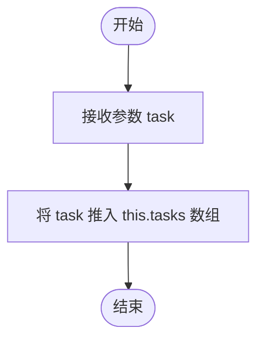

# `.\MetaGPT\metagpt\environment\minecraft\mineflayer\mineflayer-collectblock\src\TaskQueue.ts` 详细设计文档

该代码实现了一个简单的异步任务队列（TaskQueue），用于按顺序执行一系列异步或同步任务。它支持添加异步任务（通过回调通知完成）和同步任务（自动包装为异步），并提供了在任务执行出错时停止队列的选项。核心功能是管理任务执行顺序和错误处理。

## 整体流程

```mermaid
graph TD
    A[开始] --> B[创建TaskQueue实例]
    B --> C[调用add/addSync添加任务]
    C --> D[任务进入内部队列tasks]
    D --> E[调用runAll执行队列]
    E --> F[复制当前任务列表并清空队列]
    F --> G{遍历任务列表}
    G --> H[执行当前任务]
    H --> I{任务执行是否出错?}
    I -- 是 --> J[调用runAll的回调cb(err)]
    J --> K{stopOnError为true?}
    K -- 是 --> L[停止执行后续任务]
    K -- 否 --> M[继续执行下一个任务]
    I -- 否 --> M
    M --> G
    G -- 所有任务执行完毕 --> N[调用runAll的回调cb()]
    N --> O[结束]
```

## 类结构

```
TaskQueue
├── 字段: tasks, stopOnError
├── 方法: add, addSync, runAll
└── 依赖类型: Task, SyncTask, Callback
```

## 全局变量及字段


### `TaskQueue.tasks`
    
一个存储待执行异步任务的数组，是任务队列的核心数据结构。

类型：`Task[]`
    


### `TaskQueue.stopOnError`
    
一个标志位，如果为true，则在队列执行过程中遇到错误时停止执行后续任务。

类型：`boolean`
    
    

## 全局函数及方法


### `TaskQueue.add`

将一个新的异步任务添加到任务队列中。该方法接收一个异步任务函数，该函数在完成时应调用其回调参数。

参数：

- `task`：`Task`，要添加到队列中的异步任务。该任务是一个函数，接收一个回调函数作为参数，并在异步操作完成时调用该回调。

返回值：`void`，无返回值。

#### 流程图



#### 带注释源码

```typescript
/**
 * Adds a new async task to this queue. The provided callback should be executed when
 * the async task is complete.
 *
 * @param task - The async task to add.
 */
add (task: Task): void {
  // 将传入的异步任务函数添加到内部的任务数组 `this.tasks` 的末尾。
  this.tasks.push(task)
}
```


### `TaskQueue.addSync`

将同步任务包装成异步任务并添加到队列中。该方法接收一个同步函数，将其封装在一个异常处理块中，然后通过调用 `add` 方法将封装后的异步任务推入任务队列。封装确保了同步任务的执行结果（成功或抛出的错误）能通过标准的异步回调接口进行传递。

参数：
-  `task`：`SyncTask`，一个无参数、无返回值的同步函数，将被添加到队列中执行。

返回值：`void`，此方法不返回任何值。

#### 流程图

```mermaid
flowchart TD
    A[开始: addSync(task)] --> B[调用 this.add<br>传入包装函数]
    B --> C{执行包装函数}
    C --> D[调用同步任务 task]
    D --> E{任务执行是否抛出异常?}
    E -- 否 --> F[调用回调 cb()<br>表示成功]
    E -- 是 --> G[调用回调 cb(err)<br>传递错误]
    F --> H[结束]
    G --> H
```

#### 带注释源码

```typescript
/**
 * Adds a synchronous task to this queue.
 * 将一个同步任务添加到队列中。
 *
 * @param task - The sync task to add.
 *             - 要添加的同步任务。
 */
addSync (task: SyncTask): void {
  // 调用内部的 add 方法，传入一个包装函数。
  // 这个包装函数将同步任务适配成异步任务接口。
  this.add((cb) => {
    try {
      // 执行传入的同步任务。
      task()
      // 如果同步任务成功执行，调用回调函数 cb，不传递错误参数，表示成功。
      cb()
    } catch (err: any) {
      // 如果同步任务执行过程中抛出异常，捕获该异常，
      // 并通过回调函数 cb 将错误 err 传递出去。
      cb(err)
    }
  })
}
```


### `TaskQueue.runAll`

该方法按顺序执行任务队列中的所有异步任务，并在所有任务执行完毕后（或遇到错误时）调用可选的回调函数。执行过程中，如果 `stopOnError` 为 `true`，则在遇到第一个错误时停止执行后续任务。

参数：

- `cb`：`Callback | undefined`，可选的回调函数，在所有任务执行完毕或发生错误时被调用。如果发生错误，错误对象将作为第一个参数传递给回调。

返回值：`void`，无返回值。

#### 流程图

```mermaid
flowchart TD
    A[开始执行 runAll] --> B[复制当前任务列表并清空队列]
    B --> C[初始化任务索引 index = -1]
    C --> D{定义内部函数 runNext}
    D --> E[调用 runNext]
    E --> F[index++]
    F --> G{检查 index >= taskList.length?}
    G -- 是 --> H{检查 cb 是否定义?}
    H -- 是 --> I[调用 cb]
    H -- 否 --> J[结束]
    I --> J
    G -- 否 --> K[执行 taskList[index]]
    K --> L{任务执行是否抛出同步错误?}
    L -- 是 --> M{检查 cb 是否定义?}
    M -- 是 --> N[调用 cb(err)]
    M -- 否 --> J
    L -- 否 --> O[任务调用其回调]
    O --> P{回调参数 err 是否定义?}
    P -- 是 --> Q{检查 cb 是否定义?}
    Q -- 是 --> R[调用 cb(err)]
    Q -- 否 --> S{检查 stopOnError 是否为 true?}
    S -- 是 --> J
    S -- 否 --> T[调用 runNext]
    P -- 否 --> T
    R --> S
    N --> J
```

#### 带注释源码

```typescript
/**
 * Runs all tasks currently in this queue and empties the queue.
 *
 * @param cb - The optional callback to be executed when all tasks in this queue have
 * finished executing.
 */
runAll (cb?: Callback): void {
    // 1. 获取当前所有任务，并立即清空队列，确保后续添加的任务不会影响本次执行。
    const taskList = this.tasks
    this.tasks = []

    let index = -1 // 2. 初始化任务执行索引。
    const runNext: () => void = () => {
        index++ // 3. 移动到下一个任务。
        // 4. 检查是否所有任务都已执行完毕。
        if (index >= taskList.length) {
            // 4.1 如果提供了回调函数，则调用它（无错误参数，表示成功）。
            if (cb !== undefined) cb()
            return // 4.2 执行结束。
        }

        try {
            // 5. 执行当前索引指向的异步任务。
            //    每个任务都是一个函数，它接收一个回调函数作为参数。
            //    任务需要在完成时调用这个回调。
            taskList[index]((err) => {
                // 6. 这是任务完成时调用的回调。
                // 7. 检查任务执行过程中是否发生了错误（通过回调参数 err 传递）。
                if (err !== undefined) {
                    // 7.1 如果提供了外部回调，则用错误调用它。
                    if (cb !== undefined) cb(err)

                    // 7.2 如果设置了出错时停止，则直接返回，不再执行后续任务。
                    if (this.stopOnError) return
                }

                // 8. 如果没有错误，或者有错误但 `stopOnError` 为 false，则继续执行下一个任务。
                runNext()
            })
        } catch (err: any) {
            // 9. 捕获任务函数本身抛出的同步错误（例如，在 taskList[index] 调用时立即抛出的错误）。
            // 10. 如果提供了外部回调，则用错误调用它。
            if (cb !== undefined) cb(err)
            // 注意：发生同步错误时，无论 `stopOnError` 设置如何，执行都会停止，
            // 因为控制流不会进入第6步的任务回调中，`runNext` 不会被调用。
        }
    }

    // 11. 启动任务链的执行。
    runNext()
}
```

## 关键组件


### TaskQueue 类

一个简单的工具类，用于将一系列异步任务排队并按顺序执行。它支持添加异步任务和同步任务，并提供了在任务执行过程中遇到错误时停止执行的选项。

### 异步任务 (Task) 类型

一个函数类型，代表一个异步任务。该函数接收一个回调函数作为参数，并在任务完成（无论成功或失败）时调用此回调。

### 同步任务 (SyncTask) 类型

一个函数类型，代表一个同步任务。该函数不接收参数，其执行过程中的任何异常都会被捕获并转换为异步错误。

### 任务执行流程控制

通过 `runAll` 方法实现的任务链式执行机制。它按顺序执行队列中的所有任务，并在每个任务完成后触发下一个。该流程支持可选的完成回调，并集成了错误处理逻辑（包括 `stopOnError` 标志）。


## 问题及建议


### 已知问题

-   **错误处理不一致**：`addSync` 方法在同步任务抛出错误时，会通过回调传递错误。然而，`runAll` 方法中直接调用异步任务时，如果任务函数本身同步抛出错误（例如，`taskList[index]` 不是一个函数），会通过 `try...catch` 捕获并调用最终回调，但此时 `stopOnError` 标志不会生效，队列会停止执行，但行为与异步错误的处理路径不完全一致。
-   **`stopOnError` 行为模糊**：当 `stopOnError` 为 `true` 且发生错误时，`runAll` 会提前返回并调用最终回调。但是，队列中剩余的任务状态未被清除或记录，调用者无法得知哪些任务未执行。这可能导致资源未释放或状态不一致。
-   **缺乏并发控制**：该类是一个简单的先进先出队列，所有任务按顺序执行。对于 I/O 密集型任务，无法利用并发性来提高整体执行效率。
-   **任务完成回调（`cb`）被多次调用的风险**：在 `runAll` 方法中，如果某个任务既同步抛出错误，又在异步回调中传递了错误（虽然设计上不应如此），或者任务内部错误地多次调用回调，可能导致外部的 `cb` 被调用多次。
-   **类型安全可以加强**：`Task` 类型定义为 `(cb: Callback) => void`，但 `Callback` 类型（从 `'./index'` 导入）的具体签名未知。如果 `Callback` 允许除 `(err?: any) => void` 之外的签名，可能会在 `runAll` 内部的调用 `taskList[index]((err) => {...})` 时产生类型不匹配的运行时风险。

### 优化建议

-   **重构错误处理逻辑**：将任务执行（包括可能的同步错误）封装到一个统一的执行函数中。确保无论是同步抛出的错误，还是通过回调传递的异步错误，都遵循相同的处理逻辑（包括 `stopOnError` 标志的应用），并只调用最终回调一次。可以考虑使用 `Promise` 进行内部重构以简化流程。
-   **增强队列状态管理**：在 `runAll` 开始时，可以记录原始任务列表的副本或长度。当因错误停止时，可以提供未执行任务的列表或数量给最终回调，或者提供一个方法来继续执行剩余任务。
-   **引入并发执行模式**：可以增加一个 `concurrency` 参数（默认为1，即当前顺序执行）。当 `concurrency > 1` 时，允许同时执行多个任务，并在所有任务完成后调用最终回调。需要小心处理错误和 `stopOnError` 在并发场景下的语义。
-   **添加任务执行超时机制**：为 `add` 或 `runAll` 方法提供超时选项，防止单个任务长时间挂起导致整个队列停滞。超时后应触发错误并继续执行后续逻辑（取决于 `stopOnError` 的设置）。
-   **改进类型定义**：明确并导出 `Callback` 类型为 `(error?: Error | null | undefined) => void`，以提高类型安全性和代码可读性。考虑使用泛型来让 `TaskQueue` 管理特定类型的任务结果（尽管当前设计不关心结果，只关心完成/错误）。
-   **增加队列状态查询方法**：提供如 `isEmpty()`、`getLength()`、`clear()` 等方法，方便外部查询和管理队列状态。
-   **考虑使用 `async/await` 进行内部重构**：虽然会改变 API（`runAll` 可能返回 `Promise`），但可以极大地简化错误处理和流程控制逻辑，使其更易于理解和维护。可以提供一个返回 `Promise` 的新方法（如 `runAllAsync`）作为增量改进。


## 其它


### 设计目标与约束

该代码旨在提供一个轻量级、非侵入式的异步任务队列管理工具。其核心设计目标是实现任务的顺序执行，并支持同步和异步任务的无缝集成。主要约束包括：保持代码简洁，不引入外部依赖；通过回调函数进行异步控制，而非 Promise 或 async/await，以确保在特定环境（如旧版浏览器或无 Promise 的环境）下的兼容性；以及提供可选的错误停止机制来控制任务链的容错行为。

### 错误处理与异常设计

错误处理机制围绕回调函数的第一个参数 `err` 展开。对于异步任务（`Task`），由任务本身在完成时通过 `cb(err)` 传递错误。对于通过 `addSync` 添加的同步任务，方法内部使用 try-catch 包裹，将捕获的异常转换为回调错误参数。在 `runAll` 执行过程中，任何任务抛出的同步异常（例如，任务函数本身执行时抛出）会被 try-catch 捕获，并传递给最终的回调。当 `stopOnError` 为 `true`（默认）时，遇到第一个错误后队列将停止执行后续任务；为 `false` 时，即使某个任务出错，执行也会继续。

### 数据流与状态机

**数据流**：任务以函数形式通过 `add` 或 `addSync` 方法流入 `tasks` 数组。`runAll` 方法启动执行流程，它会复制当前任务列表并清空原队列，然后通过递归调用 `runNext` 函数，依次取出并执行每个任务函数。每个任务执行时接收一个回调函数，任务完成（或失败）时必须调用此回调，从而驱动执行下一个任务或结束整个流程。

**状态机**：队列主要有两种状态：
1.  **空闲/收集态**：`tasks` 数组积累任务，等待执行。
2.  **执行态**：`runAll` 被调用后，进入此状态。在此状态下，`tasks` 被清空，执行逻辑遍历一个内部的任务副本。此状态持续直到所有任务副本处理完毕或因错误提前终止，然后自动回到空闲/收集态。

### 外部依赖与接口契约

**外部依赖**：该模块仅依赖一个类型定义 `import type { Callback } from './index'`。它假定 `Callback` 类型已在别处定义，通常形式为 `(err?: any) => void`。除此之外，无任何第三方库或运行时环境特殊依赖（仅需标准 ES/TypeScript 环境）。

**接口契约**：
*   **`Task` 类型**：契约规定，一个 `Task` 函数必须接收一个 `Callback` 类型的函数作为唯一参数，并在其异步操作完成时调用该回调。如果操作成功，调用 `cb()`；如果失败，调用 `cb(err)`。
*   **`SyncTask` 类型**：契约规定，一个 `SyncTask` 函数应是一个同步函数，不接收参数，执行过程中可能抛出异常。
*   **`add` 和 `addSync` 方法**：调用者契约是提供符合上述类型的函数。
*   **`runAll` 方法**：调用者可以选择提供一个 `Callback`。队列契约是：当所有任务成功完成时，以无参数形式调用该回调；如果任何任务失败，则以错误为参数调用该回调。`stopOnError` 属性进一步细化了失败时的行为契约。

    