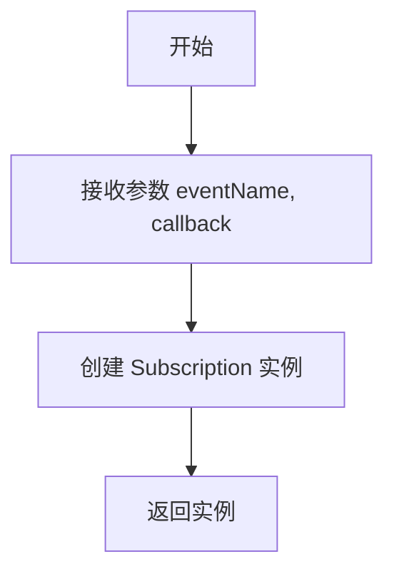
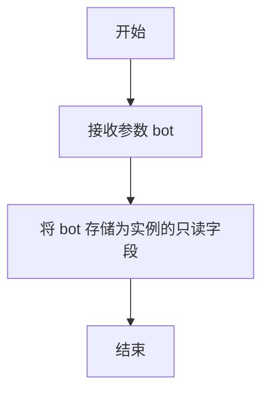
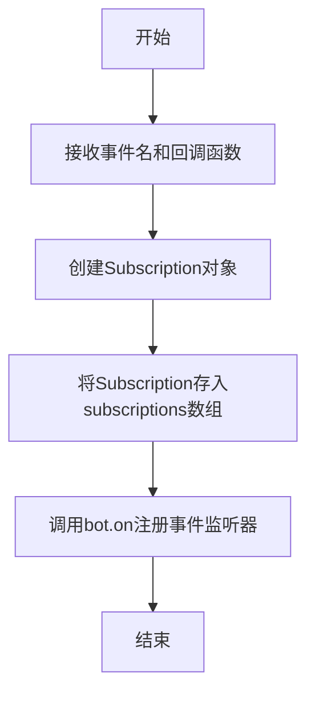

# `.\MetaGPT\metagpt\environment\minecraft\mineflayer\mineflayer-collectblock\src\TemporarySubscriber.ts` 详细设计文档

该代码实现了一个临时事件订阅器（TemporarySubscriber），用于管理Mineflayer机器人（Bot）上的事件监听器。它允许用户订阅特定事件并绑定回调函数，同时提供统一的清理（cleanup）方法，用于在不需要时一次性移除所有已添加的临时监听器，防止内存泄漏和事件监听器堆积。

## 整体流程

```mermaid
graph TD
    A[创建TemporarySubscriber实例] --> B[调用subscribeTo方法]
    B --> C[创建Subscription对象存储事件名和回调]
    C --> D[将Subscription存入内部数组]
    D --> E[调用bot.on()注册事件监听器]
    E --> F[正常使用，事件触发回调]
    F --> G[调用cleanup方法]
    G --> H[遍历内部Subscription数组]
    H --> I[对每个Subscription调用bot.removeListener()]
    I --> J[所有临时监听器被移除，清理完成]
```

## 类结构

```
TemporarySubscriber (临时事件订阅器主类)
└── Subscription (内部数据存储类)
```

## 全局变量及字段


### `Subscription.eventName`
    
要订阅的Mineflayer机器人事件名称。

类型：`string`
    


### `Subscription.callback`
    
当指定事件被触发时要执行的回调函数。

类型：`Function`
    


### `TemporarySubscriber.bot`
    
Mineflayer机器人实例，用于注册和移除事件监听器。

类型：`Bot`
    


### `TemporarySubscriber.subscriptions`
    
存储所有已注册的临时订阅（事件名称和回调函数对）的数组。

类型：`Subscription[]`
    
    

## 全局函数及方法


### `Subscription.constructor`

该构造函数用于创建一个 `Subscription` 类的实例，该实例代表一个事件订阅，封装了事件名称和对应的回调函数。

参数：

-  `eventName`：`string`，要订阅的事件名称。
-  `callback`：`Function`，当事件触发时要执行的回调函数。

返回值：`Subscription`，返回一个新创建的 `Subscription` 对象实例。

#### 流程图



#### 带注释源码

```
// Subscription 类的构造函数
// 使用 TypeScript 的 `readonly` 修饰符，确保实例化后属性不可变
constructor (readonly eventName: string, readonly callback: Function) {}
// 构造函数体为空，因为 `readonly` 参数会自动成为类的属性并完成初始化
```


### `TemporarySubscriber.constructor`

该构造函数用于初始化一个 `TemporarySubscriber` 实例。它接收一个 `Bot` 对象作为参数，并将其存储为实例的只读属性，以便后续用于订阅和清理事件监听器。

参数：

-  `bot`：`Bot`，一个 Mineflayer 机器人实例，`TemporarySubscriber` 将在此实例上管理临时事件监听器。

返回值：`void`，构造函数不返回值。

#### 流程图



#### 带注释源码

```
  // 构造函数，接收一个 Mineflayer Bot 实例
  constructor (readonly bot: Bot) {}
    // `readonly` 关键字将 `bot` 参数声明为类的只读属性。
    // 这意味着 `this.bot` 字段在实例创建后不能被重新赋值。
    // 该属性用于后续的 `subscribeTo` 和 `cleanup` 方法，以在指定的机器人上添加和移除事件监听器。
```


### `TemporarySubscriber.subscribeTo`

该方法用于向机器人（Bot）添加一个临时的事件监听器。它接收一个事件名称和一个回调函数，创建一个订阅记录并将其存储起来，同时将回调函数注册到指定的事件上。

参数：

- `event`：`string`，要订阅的事件名称。
- `callback`：`Function`，当事件触发时要执行的回调函数。

返回值：`void`，无返回值。

#### 流程图



#### 带注释源码

```typescript
/**
 * Adds a new temporary event listener to the bot.
 *
 * @param event - The event to subscribe to.
 * @param callback - The function to execute.
 */
subscribeTo (event: string, callback: Function): void {
    // 创建一个新的Subscription对象，包含事件名和回调函数
    this.subscriptions.push(new Subscription(event, callback))

    // 使用bot.on方法将回调函数注册到指定的事件上
    // @ts-expect-error 注释用于忽略TypeScript的类型检查错误
    this.bot.on(event, callback)
}
```


### `TemporarySubscriber.cleanup`

该方法用于清理所有通过 `TemporarySubscriber` 实例注册到 `bot` 对象上的临时事件监听器。它遍历内部存储的订阅列表，并逐一从 `bot` 对象上移除对应的事件监听器，以防止内存泄漏和意外的回调执行。

参数：
- 无

返回值：`void`，无返回值。

#### 流程图

```mermaid
flowchart TD
    A[开始] --> B[遍历 subscriptions 数组]
    B --> C{是否还有订阅项？}
    C -- 是 --> D[获取当前订阅项 sub]
    D --> E[从 bot 上移除监听器<br>bot.removeListener(sub.eventName, sub.callback)]
    E --> B
    C -- 否 --> F[结束]
```

#### 带注释源码

```typescript
/**
 * Removes all attached event listeners from the bot.
 */
cleanup (): void {
  // 遍历存储在 this.subscriptions 数组中的所有订阅项
  for (const sub of this.subscriptions) {
    // 对于每个订阅项，调用 bot 对象的 removeListener 方法
    // 传入订阅时记录的事件名称 (sub.eventName) 和回调函数 (sub.callback)
    // 从而将该特定的事件监听器从 bot 上移除
    // @ts-expect-error 注释用于忽略 TypeScript 对 bot.on/removeListener 方法的类型检查错误
    this.bot.removeListener(sub.eventName, sub.callback)
  }
}
```


## 关键组件


### TemporarySubscriber 类

一个用于管理临时事件订阅的辅助类，它允许在特定作用域内（例如一个操作或任务）监听机器人（Bot）的事件，并在操作完成后自动清理所有监听器，防止内存泄漏和事件监听器堆积。

### Subscription 类

一个简单的数据持有类，用于封装临时订阅的事件名称和对应的回调函数，作为 TemporarySubscriber 内部管理订阅列表的基本单元。

### 事件订阅与清理机制

通过 `subscribeTo` 方法将事件监听器动态绑定到 Bot 实例，并通过 `cleanup` 方法集中移除所有通过本实例添加的监听器，实现了事件监听资源的生命周期管理。


## 问题及建议


### 已知问题

-   **类型安全缺失**：代码中使用 `Function` 类型和 `@ts-expect-error` 指令来绕过 TypeScript 的类型检查。这导致 `subscribeTo` 方法的 `callback` 参数和 `Subscription` 类的 `callback` 字段失去了具体的参数和返回值类型信息，使得编译器无法在编译时捕获潜在的类型错误，增加了运行时出错的风险。
-   **内存泄漏风险**：`cleanup` 方法在移除所有监听器后，没有清空 `this.subscriptions` 数组。虽然这些 `Subscription` 对象在 `TemporarySubscriber` 实例被垃圾回收时会被释放，但在实例生命周期内重复调用 `cleanup` 和 `subscribeTo` 会导致数组不断增长，持有不再需要的引用，可能影响内存使用效率。
-   **缺乏错误处理**：`subscribeTo` 和 `cleanup` 方法在执行 `bot.on` 和 `bot.removeListener` 时没有进行任何错误处理（例如，尝试移除一个不存在的监听器）。如果底层 `Bot` 对象的方法抛出异常，这些异常会直接传播给调用者，而 `TemporarySubscriber` 类没有提供任何机制来优雅地处理或记录这些错误。

### 优化建议

-   **增强类型安全性**：将 `Function` 类型替换为具体的函数签名。可以利用 TypeScript 的条件类型或泛型来根据 `event` 参数推断出正确的回调函数类型。例如，可以定义一个事件名到回调函数类型的映射，或者使用 `Parameters<Bot['on']>` 和 `ReturnType<Bot['on']>` 等工具类型来获取 `bot.on` 方法的类型，从而确保 `callback` 的类型与 `Bot` 类期望的类型严格匹配，并移除 `@ts-expect-error` 指令。
-   **完善资源管理**：在 `cleanup` 方法中，在移除所有监听器后，应添加 `this.subscriptions.length = 0` 或 `this.subscriptions.splice(0)` 来清空订阅数组。这可以立即释放对 `Subscription` 对象及其 `callback` 的引用，有助于垃圾回收，并防止数组在实例生命周期内无限制增长。
-   **添加健壮的错误处理**：在 `subscribeTo` 和 `cleanup` 方法中引入 `try...catch` 块来捕获并处理 `bot.on` 和 `bot.removeListener` 可能抛出的异常。可以考虑将错误记录到日志中，或者提供一个可选的错误回调函数给类的使用者。对于 `cleanup` 方法，即使某个 `removeListener` 调用失败（例如监听器不存在），也应尝试继续移除剩余的监听器，而不是中途停止。
-   **考虑提供更细粒度的取消订阅**：除了 `cleanup` 方法一次性移除所有监听器，可以增加一个 `unsubscribeFrom(event: string, callback: Function): boolean` 方法，允许移除特定的监听器。这提供了更灵活的资源管理方式。
-   **改进代码可读性**：虽然 `Subscription` 类目前很简单，但可以考虑为其 `callback` 字段添加更具体的类型注释（在类型安全改进后），或者添加 JSDoc 注释来说明其用途，以提升代码的可维护性。


## 其它


### 设计目标与约束

本模块的设计目标是提供一个轻量级的、类型安全的临时事件订阅管理器，用于在Mineflayer机器人实例上注册和清理事件监听器。核心约束包括：1) 必须与现有的Mineflayer Bot事件系统无缝集成；2) 必须确保在清理时能准确移除所有由本管理器注册的监听器，避免内存泄漏；3) 在TypeScript环境下提供尽可能好的类型提示，尽管底层Bot的`on`和`removeListener`方法类型定义可能不完整。

### 错误处理与异常设计

当前代码未显式处理错误。潜在风险包括：1) 传入的`event`字符串可能不是Bot支持的有效事件名，导致监听无效或运行时错误；2) `callback`函数在执行时可能抛出异常，这会向上传播到Mineflayer的事件系统，可能导致程序崩溃。建议的改进是：在`subscribeTo`方法中，可以尝试验证事件名称（如果存在已知的事件列表），并为回调函数添加`try...catch`包装器，或将错误捕获并转发到一个统一的错误处理事件，以增强鲁棒性。

### 数据流与状态机

数据流相对简单：1) 初始化时，`TemporarySubscriber`实例持有一个空的`subscriptions`数组。2) 当调用`subscribeTo`时，创建一个`Subscription`对象（包含事件名和回调引用）存入数组，同时调用`bot.on`注册监听器。这是一个单向的“注册”数据流。3) 当调用`cleanup`时，遍历`subscriptions`数组，对每一项调用`bot.removeListener`，然后该数组的生命周期通常结束（尽管数组本身未被清空）。模块本身没有复杂的状态变迁，其状态由`subscriptions`数组的内容完全定义。

### 外部依赖与接口契约

本模块的核心外部依赖是`mineflayer`库及其导出的`Bot`类。接口契约体现在：1) `TemporarySubscriber`类的构造函数要求传入一个`Bot`实例，这建立了它对Bot的“使用”关系。2) `subscribeTo`和`cleanup`方法隐式依赖`Bot`实例的`on(event: string, callback: Function)`和`removeListener(event: string, callback: Function)`方法。尽管使用了`@ts-expect-error`忽略了TypeScript类型检查，但这意味着与Mineflayer库的特定版本（提供这些方法）存在强耦合。任何破坏此接口的库更新都会导致本模块运行时错误。

    