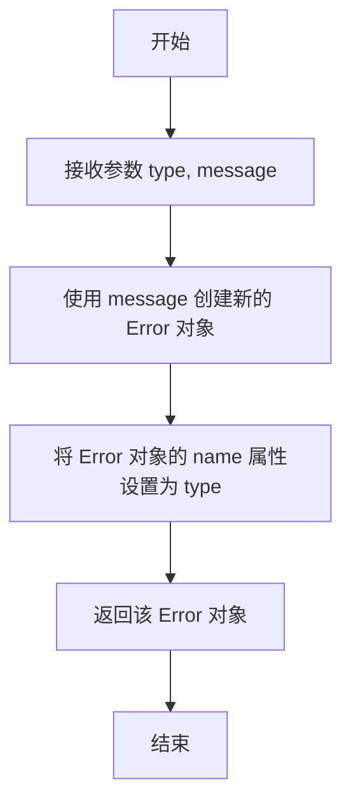

# `.\MetaGPT\metagpt\environment\minecraft\mineflayer\mineflayer-collectblock\src\Util.ts` 详细设计文档

该文件导出了一个名为 `error` 的辅助函数，用于创建一个自定义的 Error 对象。该函数接收错误类型（`type`）和错误消息（`message`）作为参数，创建一个新的 Error 实例，将其 `name` 属性设置为传入的错误类型，并返回该实例。这提供了一种便捷的方式来创建具有特定类型标识的错误，便于在应用程序中进行错误分类和处理。

## 整体流程

```mermaid
graph TD
    A[调用 error(type, message)] --> B[创建新的 Error 对象]
    B --> C[设置 error.name = type]
    C --> D[返回 error 对象]
```

## 类结构

```
无类结构，仅包含一个全局函数。
```

## 全局变量及字段


    

## 全局函数及方法

### `error`

创建一个具有指定类型和消息的新错误对象。

参数：

- `type`：`string`，错误类型，将作为错误对象的 `name` 属性。
- `message`：`string`，错误消息，将作为错误对象的 `message` 属性。

返回值：`Error`，一个 JavaScript `Error` 对象，其 `name` 属性被设置为传入的 `type`，`message` 属性被设置为传入的 `message`。

#### 流程图



#### 带注释源码

```typescript
/**
 * Creates a new error object with the given type and message.
 * 创建一个具有指定类型和消息的新错误对象。
 *
 * @param type - The error type. 错误类型。
 * @param message - The error message. 错误消息。
 *
 * @returns The error object. 错误对象。
 */
export function error (type: string, message: string): Error {
  // 使用传入的 message 创建一个标准的 JavaScript Error 对象
  const e = new Error(message)
  // 将错误对象的 name 属性覆盖为传入的自定义 type
  e.name = type
  // 返回这个自定义的错误对象
  return e
}
```

## 关键组件


### 错误对象创建函数

一个用于创建具有自定义错误类型和消息的Error对象的工具函数，它通过设置Error对象的name属性来指定错误类型，便于在应用程序中进行错误分类和处理。

### 类型化错误处理

通过将错误类型（type）作为Error对象的name属性，该组件支持在代码中创建和区分不同类型的错误，为构建结构化的错误处理机制提供了基础。


## 问题及建议


### 已知问题

-   **错误类型定义不明确**：`type` 参数为简单的 `string` 类型，缺乏约束。这可能导致调用者传入任意、不一致或拼写错误的错误类型，使得在生产环境中难以通过错误名称进行有效的分类、监控和过滤。
-   **缺乏结构化错误信息**：函数仅支持 `type` 和 `message` 两个参数，无法方便地附加额外的错误上下文信息（如错误代码、时间戳、相关对象ID等），限制了错误的可追溯性和调试效率。
-   **与标准 `Error` 构造函数的兼容性**：虽然设置了 `e.name`，但标准的 `Error` 构造函数也接受一个可选的 `options` 参数（如 `cause` 属性用于链接错误）。当前函数没有提供机制来利用或传递这些标准选项，可能限制了与其他库或原生错误处理逻辑的互操作性。

### 优化建议

-   **定义枚举或常量作为错误类型**：建议创建一个枚举（`enum`）或一组常量字符串来定义所有可能的错误类型。这可以在编译时和开发阶段提供类型安全，确保错误类型的一致性，并方便 IDE 的自动补全。
-   **扩展函数签名以支持更多上下文**：重构 `error` 函数，使其接受一个配置对象作为参数，而不是多个独立参数。例如：`error({ type: ErrorType, message: string, code?: number, cause?: Error, metadata?: Record<string, any> })`。这可以保持函数签名的向后兼容性（通过重载），同时允许灵活地添加丰富的错误上下文。
-   **考虑创建自定义错误类**：对于复杂的应用程序，建议创建继承自 `Error` 的自定义错误类（如 `AppError`）。该类可以预定义类型、代码等属性，并提供更规范的构造函数。`error` 函数可以改为这个自定义错误类的工厂函数，或者直接使用 `new AppError(...)` 来替代。这能更好地利用面向对象特性，并可能集成到更高级的错误处理中间件中。
-   **利用标准 `Error` 选项**：更新函数以支持标准的 `Error` 构造函数选项，特别是 `cause` 属性，以便能够链接底层错误，这对于异步操作链中的错误追踪非常有用。


## 其它


### 设计目标与约束

该代码的设计目标是提供一个轻量级、类型安全的工具函数，用于创建具有自定义错误类型（`name`属性）的Error对象。其主要约束包括：1) 保持函数签名简单，仅接受错误类型和消息两个字符串参数；2) 返回标准的JavaScript `Error`对象，确保与现有错误处理机制的兼容性；3) 使用TypeScript编写，提供编译时的类型检查。

### 错误处理与异常设计

该函数本身是用于构造错误对象的工具，不包含内部的错误处理逻辑。它预期被调用者用于创建错误，然后通过`throw`语句抛出。函数内部没有可能抛出异常的操作，因此其本身是异常安全的。调用者需要负责捕获和处理由该函数创建的Error对象。

### 数据流与状态机

该函数的数据流是线性的、无状态的：输入参数（`type`, `message`） -> 内部处理（创建Error对象并设置`name`属性） -> 输出（自定义的Error对象）。整个过程不涉及任何状态维护或状态转换，是一个纯函数。

### 外部依赖与接口契约

该函数没有外部依赖（不依赖任何第三方库或特定的运行时环境）。其接口契约由TypeScript类型定义明确：输入为两个`string`类型参数，输出为一个`Error`类型对象。返回的Error对象保证其`message`属性与输入参数一致，`name`属性被设置为输入的`type`参数值。

    