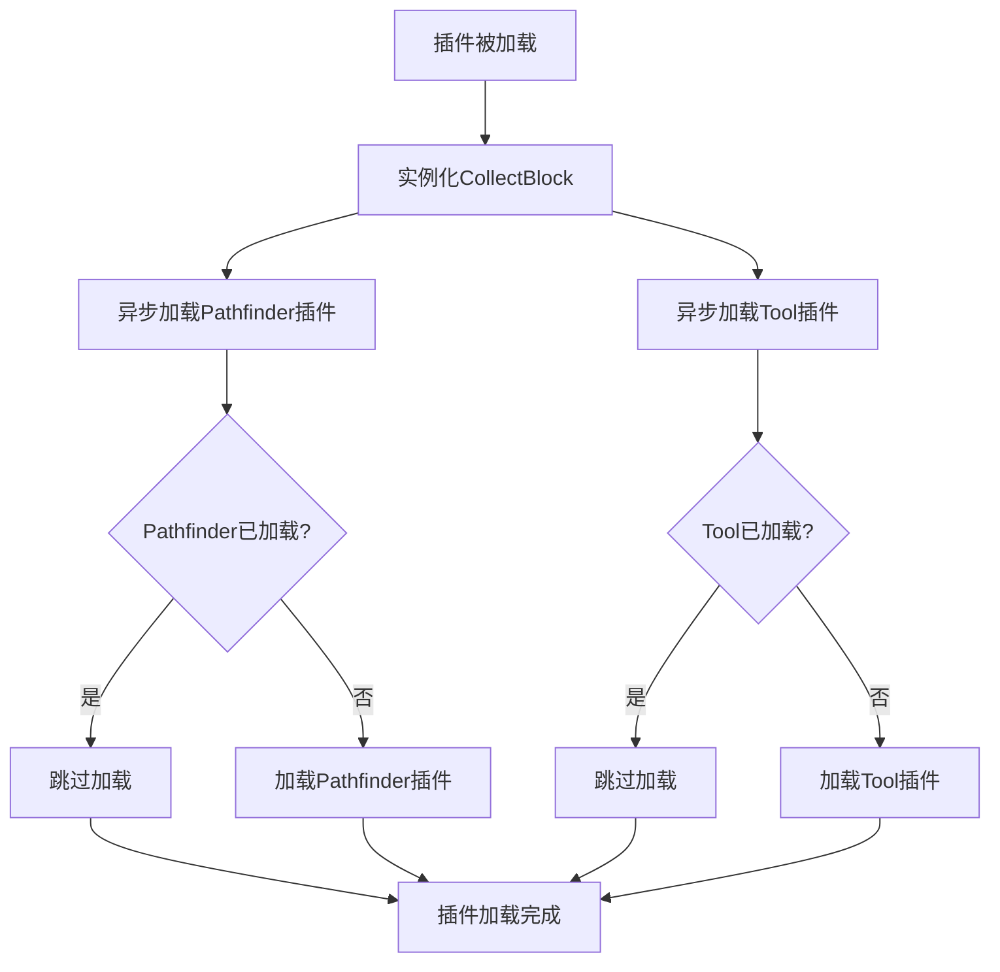

# `.\MetaGPT\metagpt\environment\minecraft\mineflayer\mineflayer-collectblock\src\index.ts` 详细设计文档

该代码是一个用于Mineflayer机器人的插件，其核心功能是扩展机器人的能力，使其能够自动收集指定的方块。它通过加载必要的路径查找和工具使用插件，并实例化一个CollectBlock类来实现这一功能。

## 整体流程



## 类结构

```
collectBlockPlugin.ts (主文件)
├── plugin (全局函数)
├── loadPathfinderPlugin (全局函数)
└── loadToolPlugin (全局函数)
CollectBlock (从'./CollectBlock'导入的类)
├── 类字段 (待分析)
└── 类方法 (待分析)
```

## 全局变量及字段


    

## 全局函数及方法


### `plugin`

该函数是 `mineflayer-collectblock` 插件的入口点。它的核心功能是初始化 `CollectBlock` 实例并将其挂载到 `bot` 对象上，同时确保 `mineflayer-pathfinder` 和 `mineflayer-tool` 这两个必需的依赖插件被加载。

参数：

- `bot`：`Bot`，一个 `mineflayer` 机器人实例，插件将在此实例上运行。

返回值：`void`，该函数不返回任何值。

#### 流程图

```mermaid
flowchart TD
    A[开始: plugin(bot)] --> B[初始化 CollectBlock 实例<br/>并挂载到 bot.collectBlock]
    B --> C[异步调度 loadPathfinderPlugin]
    B --> D[异步调度 loadToolPlugin]
    C --> E{bot.pathfinder 已存在?}
    E -- 是 --> F[跳过加载]
    E -- 否 --> G[调用 bot.loadPlugin 加载 pathfinderPlugin]
    D --> H{bot.tool 已存在?}
    H -- 是 --> I[跳过加载]
    H -- 否 --> J[调用 bot.loadPlugin 加载 toolPlugin]
    F & G & I & J --> K[结束]
```

#### 带注释源码

```typescript
// 插件的主入口函数，接收一个 mineflayer Bot 实例
export function plugin (bot: Bot): void {
  // 初始化 CollectBlock 功能模块，并将其挂载到 bot 对象上，使其可通过 bot.collectBlock 访问。
  // @ts-expect-error 注释用于忽略 TypeScript 对动态添加属性的类型检查警告。
  bot.collectBlock = new CollectBlock(bot)

  // 使用 setTimeout 将插件加载操作异步化，确保在插件初始化阶段不阻塞主线程。
  // 延迟加载依赖插件，如果用户没有手动加载的话。
  setTimeout(() => loadPathfinderPlugin(bot), 0) // 调度加载路径查找插件
  setTimeout(() => loadToolPlugin(bot), 0) // 调度加载工具插件
}

// 辅助函数：加载路径查找插件
function loadPathfinderPlugin (bot: Bot): void {
  // 检查路径查找插件是否已加载，避免重复加载。
  if (bot.pathfinder != null) return
  // 加载 mineflayer-pathfinder 插件
  bot.loadPlugin(pathfinderPlugin)
}

// 辅助函数：加载工具插件
function loadToolPlugin (bot: Bot): void {
  // 检查工具插件是否已加载，避免重复加载。
  if (bot.tool != null) return
  // 加载 mineflayer-tool 插件
  bot.loadPlugin(toolPlugin)
}
```


### `loadPathfinderPlugin`

该函数用于检查并加载 `mineflayer-pathfinder` 插件到给定的 `Bot` 实例中。如果插件已经加载（即 `bot.pathfinder` 已存在），则函数直接返回，避免重复加载。

参数：

- `bot`：`Bot`，一个 `mineflayer` 机器人实例，函数将检查并为其加载路径查找插件。

返回值：`void`，该函数不返回任何值。

#### 流程图

```mermaid
flowchart TD
    A[开始：调用 loadPathfinderPlugin(bot)] --> B{bot.pathfinder 是否已存在？}
    B -- 是 --> C[直接返回]
    B -- 否 --> D[调用 bot.loadPlugin(pathfinderPlugin)]
    D --> E[结束]
```

#### 带注释源码

```typescript
function loadPathfinderPlugin (bot: Bot): void {
  // 检查路径查找插件是否已经加载到机器人实例中
  if (bot.pathfinder != null) return
  // 如果未加载，则调用机器人的 loadPlugin 方法加载 pathfinderPlugin
  bot.loadPlugin(pathfinderPlugin)
}
```


### `loadToolPlugin`

该函数用于检查并加载 `mineflayer-tool` 插件到给定的 `Bot` 实例中。如果插件已经加载（通过检查 `bot.tool` 是否存在），则函数直接返回，避免重复加载。

参数：

- `bot`：`Bot`，一个 `mineflayer` 的机器人实例，函数将尝试为其加载 `mineflayer-tool` 插件。

返回值：`void`，该函数没有返回值。

#### 流程图

```mermaid
flowchart TD
    A[开始: loadToolPlugin(bot)] --> B{bot.tool 已存在?}
    B -- 是 --> C[直接返回]
    B -- 否 --> D[调用 bot.loadPlugin(toolPlugin)]
    D --> E[结束]
    C --> E
```

#### 带注释源码

```typescript
// 定义函数 loadToolPlugin，接收一个 Bot 类型的参数 bot，无返回值
function loadToolPlugin (bot: Bot): void {
  // 检查 bot 实例上是否已经存在 tool 属性（即插件是否已加载）
  if (bot.tool != null) return // 如果已加载，则直接返回，避免重复操作
  // 如果未加载，则调用 bot 的 loadPlugin 方法加载 toolPlugin
  bot.loadPlugin(toolPlugin)
}
```


## 关键组件


### CollectBlock 插件

一个用于在 Minecraft 机器人（bot）中实现自动收集方块功能的插件，它封装了寻找、移动至并挖掘方块的核心逻辑。

### 插件加载机制

一个惰性加载机制，用于确保 `mineflayer-pathfinder` 和 `mineflayer-tool` 这两个核心依赖插件在 `CollectBlock` 功能被使用前已正确加载到机器人实例中。

### 外部依赖插件集成

通过 `bot.loadPlugin` 方法动态集成 `mineflayer-pathfinder`（路径寻找）和 `mineflayer-tool`（工具选择）两个外部插件，为 `CollectBlock` 提供移动和挖掘的基础能力。


## 问题及建议


### 已知问题

-   **插件加载的竞态条件**：使用 `setTimeout` 延迟加载 `pathfinder` 和 `tool` 插件，虽然旨在避免手动加载时的冲突，但这种方式是非确定性的。如果主程序在 `setTimeout` 回调执行前就调用了依赖于这些插件的功能（例如 `bot.collectBlock.collect`），可能会导致运行时错误，因为 `CollectBlock` 内部可能依赖这些插件。
-   **类型安全缺失**：代码中使用了 `// @ts-expect-error` 来抑制 TypeScript 错误，因为 `bot` 对象上原本没有 `collectBlock` 属性。这破坏了类型系统的完整性，使得在其他地方使用 `bot.collectBlock` 时无法获得类型提示和编译时检查，增加了运行时出错的风险。
-   **隐式全局依赖**：`CollectBlock` 类的实现严重依赖 `mineflayer-pathfinder` 和 `mineflayer-tool` 插件提供的 `bot.pathfinder` 和 `bot.tool` 接口。然而，本模块 (`index.ts`) 仅通过 `setTimeout` 尝试加载它们，并没有强制要求或验证这些依赖是否成功加载并可用。如果这些插件因版本不兼容或加载失败，`CollectBlock` 的功能将完全失效，且错误可能直到具体功能调用时才会显现，难以调试。
-   **导出冗余**：代码同时使用了 `export function plugin` 和 `export { CollectBlock, Callback, CollectOptions }`。虽然功能上没问题，但导出风格略显不一致。通常，库的入口点 (`index.ts`) 会统一导出所有公共 API。

### 优化建议

-   **采用显式、同步的依赖管理**：移除 `setTimeout` 逻辑。改为在 `plugin` 函数中，先检查 `bot` 对象上是否已存在所需的插件接口 (`bot.pathfinder`, `bot.tool`)。如果不存在，则立即、同步地调用 `bot.loadPlugin` 进行加载。如果加载失败（例如插件未安装），应抛出清晰的错误信息。这样能确保在 `CollectBlock` 实例化时，其所有依赖都已就绪。
-   **增强类型定义**：为 `Bot` 接口声明模块扩展（Module Augmentation）。创建一个类型定义文件（例如 `index.d.ts`），使用 TypeScript 的声明合并功能，为 `Bot` 接口添加 `collectBlock: CollectBlock` 属性。这样可以移除 `// @ts-expect-error`，使 `bot.collectBlock` 成为类型安全的属性，享受完整的 IDE 支持和编译检查。
-   **提供清晰的依赖说明和错误处理**：在文档中明确说明本插件对 `mineflayer-pathfinder` 和 `mineflayer-tool` 的强依赖。在代码中，如果检测到依赖插件无法加载（例如 `bot.loadPlugin` 可能在某些环境下失败），应抛出带有明确指导信息的错误，而不是静默失败或延迟失败。
-   **统一导出方式**：考虑将主要的 `CollectBlock` 类和相关类型作为默认导出或命名空间的一部分，使导出结构更清晰。例如，可以改为 `export { CollectBlock as default, Callback, CollectOptions }` 或保持现状但确保文档清晰。当前方式也可接受，但确保项目内风格统一。
-   **考虑插件加载的生命周期钩子**：研究 Mineflayer 是否有更正式的插件生命周期管理机制（如 `inject` 钩子）。如果存在，应优先使用官方推荐的机制来管理插件间的依赖加载顺序，而不是依赖 `setTimeout` 这种 hacky 的方式。


## 其它


### 设计目标与约束

该代码模块的核心设计目标是提供一个可扩展的、非侵入式的插件系统，用于增强 `mineflayer` 机器人的功能，使其能够自动收集方块。主要约束包括：
1.  **向后兼容性**：插件应确保在手动加载了 `mineflayer-pathfinder` 和 `mineflayer-tool` 插件的情况下，不会重复加载，避免冲突。
2.  **非阻塞初始化**：使用 `setTimeout` 延迟加载依赖插件，确保主插件（`CollectBlock`）的初始化不会因依赖插件的加载问题而阻塞，并允许用户代码有机会先手动加载这些插件。
3.  **清晰的接口导出**：除了插件安装函数，还需明确导出核心类（`CollectBlock`）及其相关的类型定义（`Callback`, `CollectOptions`），方便其他模块使用。

### 错误处理与异常设计

当前代码中的错误处理机制较为简单：
1.  **依赖插件加载**：`loadPathfinderPlugin` 和 `loadToolPlugin` 函数通过检查 `bot.pathfinder` 和 `bot.tool` 是否存在来避免重复加载，这是一种防御性编程，但未处理插件加载本身可能失败（如插件模块不存在）的情况。这种失败会作为异常向上抛出，由调用 `bot.loadPlugin` 的上下文处理。
2.  **主插件初始化**：`new CollectBlock(bot)` 可能因 `bot` 对象状态无效而抛出异常，此异常会直接导致 `plugin` 函数执行失败，进而可能使整个机器人初始化流程中断。调用方需负责处理此异常。
3.  **TypeScript 类型**：使用 `// @ts-expect-error` 注释暂时忽略了为 `bot` 对象动态添加 `collectBlock` 属性时的类型错误，这依赖于外部类型声明或使用者的类型扩展来完善，属于类型安全上的技术债务。

### 数据流与状态机

本模块自身不管理复杂的数据流或状态机。它的主要作用是**初始化**和**桥接**：
1.  **初始化流**：
    *   输入：一个 `Bot` 实例。
    *   过程：为其挂载 `collectBlock` 实例，并异步安排两个依赖插件的加载。
    *   输出：修改后的 `Bot` 实例（增加了 `collectBlock` 属性，并确保 `pathfinder` 和 `tool` 插件可用）。
2.  **状态依赖**：`CollectBlock` 类的功能严重依赖于 `pathfinder`（用于寻路）和 `tool`（用于选择合适工具）插件提供的功能。本模块确保在 `CollectBlock` 可能被使用之前，这些依赖已加载到 `Bot` 实例上。`CollectBlock` 内部会封装更复杂的数据流（如目标方块队列、收集状态）和状态机（如寻路、挖掘、拾取物品状态），但这不属于本模块的文档范围。

### 外部依赖与接口契约

1.  **外部依赖**：
    *   `mineflayer`: 提供核心 `Bot` 类。
    *   `mineflayer-pathfinder`: 提供路径查找功能，通过 `bot.pathfinder` 访问。
    *   `mineflayer-tool`: 提供工具选择功能，通过 `bot.tool` 访问。
    *   `./CollectBlock`: 本地模块，提供核心收集功能实现。
2.  **接口契约**：
    *   **导出契约**：
        *   `plugin(bot: Bot): void`: 主插件安装函数。
        *   `CollectBlock`: 核心功能类。
        *   `Callback`, `CollectOptions`: 与 `CollectBlock` 相关的类型定义。
    *   **对 Bot 对象的扩展契约**：执行 `plugin` 函数后，`bot` 对象将保证拥有 `collectBlock`（类型为 `CollectBlock`）、`pathfinder` 和 `tool` 属性。这是插件对运行时环境的核心改变。
    *   **依赖加载契约**：模块承诺以非阻塞、幂等（避免重复加载）的方式确保 `pathfinder` 和 `tool` 插件被加载。

### 并发与异步设计

模块采用了简单的异步初始化策略：
*   **机制**：使用 `setTimeout(..., 0)` 将 `loadPathfinderPlugin` 和 `loadToolPlugin` 的调用推迟到当前同步代码执行栈清空之后。
*   **目的**：
    1.  **解耦**：使 `CollectBlock` 的实例化与依赖插件的加载在时间上分离。
    2.  **灵活性**：为调用者在调用 `plugin` 之后、事件循环开始之前，提供了一个时间窗口来手动加载 `pathfinder` 或 `tool` 插件（此时 `setTimeout` 回调尚未执行），从而满足“手动加载优先”的约束。
*   **潜在风险**：虽然延迟很短，但在理论上存在一个极小的窗口期，在此期间 `bot.collectBlock` 已存在，但其依赖的 `bot.pathfinder` 或 `bot.tool` 可能尚未就绪。如果用户代码在 `plugin` 调用后立即同步调用 `bot.collectBlock` 的方法，可能会出错。良好的实践应是在机器人 `spawn` 事件之后或确保插件加载完成后再使用功能。

### 配置与可扩展性

1.  **配置**：本模块没有提供运行时配置选项。所有配置（如收集选项）应在实例化 `CollectBlock` 或调用其方法时通过参数传递。
2.  **可扩展性**：
    *   **功能扩展**：新的收集行为或策略应通过扩展 `CollectBlock` 类或向其提供不同的参数来实现。
    *   **插件集成**：本模块展示了如何集成多个插件（`pathfinder`, `tool`）来构建复合功能。这种模式可以复用于为 `mineflayer` 开发其他需要多插件协作的高级功能模块。
    *   **依赖管理**：当前的依赖加载逻辑是硬编码的。未来如果依赖更多插件，需要修改 `plugin` 函数。一种更可扩展的设计是提供一个配置列表或使用依赖注入容器，但鉴于当前需求简单，直接编码是合理的选择。

    