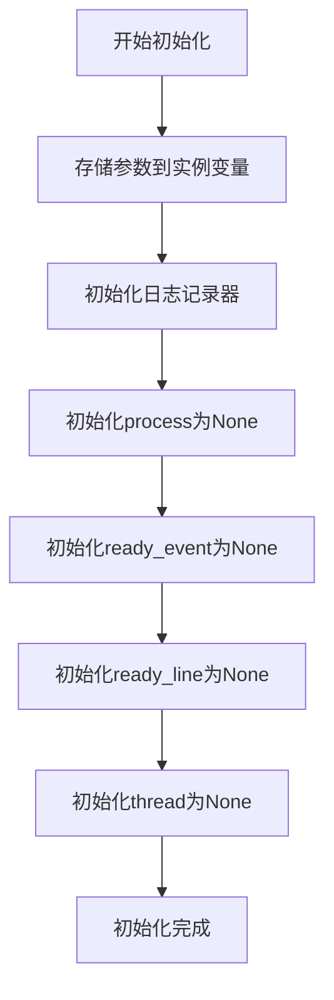
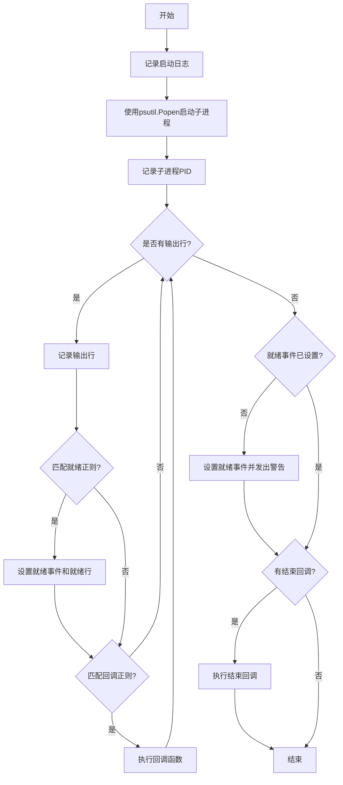
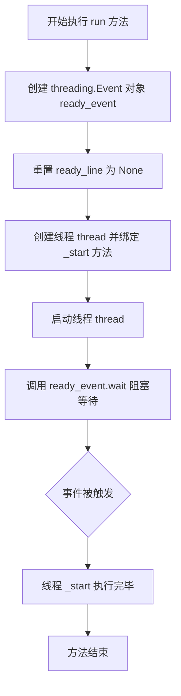
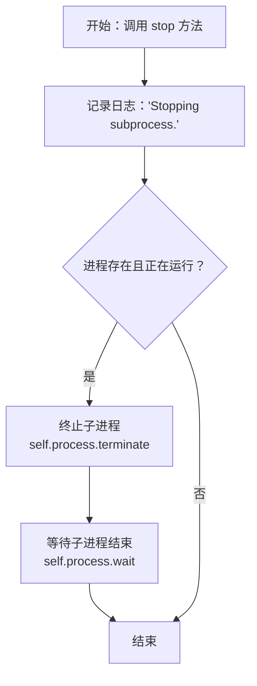

# `.\MetaGPT\metagpt\environment\minecraft\process_monitor.py` 详细设计文档

该代码实现了一个子进程监控器，用于启动、监控和管理外部命令行进程。它通过正则表达式匹配进程输出中的特定模式来检测进程就绪状态和触发回调函数，支持异步运行和优雅停止，适用于需要启动并监控后台服务的场景。

## 整体流程

```mermaid
graph TD
    A[创建SubprocessMonitor实例] --> B[调用run()方法]
    B --> C[创建ready_event和监控线程]
    C --> D[线程执行_start()方法]
    D --> E[使用psutil.Popen启动子进程]
    E --> F[循环读取进程输出]
    F --> G{匹配ready_match?}
    G -- 是 --> H[设置ready_event并记录就绪]
    G -- 否 --> I{匹配callback_match?}
    I -- 是 --> J[执行callback()]
    I -- 否 --> F
    F --> K[进程结束]
    K --> L{ready_event已设置?}
    L -- 否 --> M[设置ready_event并警告]
    L -- 是 --> N[执行finished_callback()]
    N --> O[线程结束]
    H --> F
```

## 类结构

```
SubprocessMonitor (主监控类)
├── __init__ (构造函数)
├── _start (内部启动方法)
├── run (启动监控)
├── stop (停止进程)
└── is_running (运行状态属性)
```

## 全局变量及字段


### `SubprocessMonitor.commands`
    
要执行的子进程命令及其参数列表

类型：`List[str]`
    


### `SubprocessMonitor.name`
    
子进程监控器的名称，用于日志标识

类型：`str`
    


### `SubprocessMonitor.logger`
    
用于记录子进程运行日志的日志记录器

类型：`logging.Logger`
    


### `SubprocessMonitor.process`
    
表示正在运行的子进程的进程对象

类型：`psutil.Popen`
    


### `SubprocessMonitor.ready_match`
    
用于匹配子进程就绪状态的正则表达式模式

类型：`str`
    


### `SubprocessMonitor.ready_event`
    
用于同步子进程就绪状态的线程事件

类型：`threading.Event`
    


### `SubprocessMonitor.ready_line`
    
触发就绪事件时捕获的子进程输出行

类型：`str`
    


### `SubprocessMonitor.callback_match`
    
用于触发回调函数的正则表达式模式

类型：`str`
    


### `SubprocessMonitor.callback`
    
当匹配到callback_match时执行的回调函数

类型：`callable`
    


### `SubprocessMonitor.finished_callback`
    
子进程结束时执行的回调函数

类型：`callable`
    


### `SubprocessMonitor.thread`
    
用于在后台运行子进程的线程对象

类型：`threading.Thread`
    
    

## 全局函数及方法

### `SubprocessMonitor.__init__`

初始化SubprocessMonitor实例，设置监控子进程所需的各项参数和状态。

参数：

- `commands`：`List[str]`，要执行的子进程命令及其参数列表
- `name`：`str`，子进程的名称标识，用于日志记录
- `ready_match`：`str`，用于匹配子进程就绪状态的正则表达式模式，默认为匹配任意字符
- `callback_match`：`str`，用于触发回调函数的正则表达式模式，默认为永不匹配的模式
- `callback`：`callable`，当匹配到callback_match时执行的回调函数
- `finished_callback`：`callable`，子进程结束时执行的回调函数

返回值：`None`，构造函数不返回任何值

#### 流程图



#### 带注释源码

```python
def __init__(
    self,
    commands: List[str],  # 要执行的命令列表
    name: str,  # 进程名称标识
    ready_match: str = r".*",  # 就绪状态匹配模式
    callback_match: str = r"^(?!x)x$",  # 回调触发匹配模式（默认不匹配）
    callback: callable = None,  # 回调函数
    finished_callback: callable = None,  # 结束回调函数
):
    # 存储传入的参数
    self.commands = commands
    self.name = name
    # 初始化日志记录器，使用指定的name作为日志名称
    self.logger = define_log_level(name=name)
    # 初始化进程对象为None，将在_start方法中创建
    self.process = None
    # 存储就绪匹配模式
    self.ready_match = ready_match
    # 就绪事件，将在run方法中初始化为threading.Event
    self.ready_event = None
    # 存储匹配到就绪状态的行内容
    self.ready_line = None
    # 存储回调匹配模式
    self.callback_match = callback_match
    # 存储回调函数
    self.callback = callback
    # 存储结束回调函数
    self.finished_callback = finished_callback
    # 监控线程，将在run方法中初始化为threading.Thread
    self.thread = None
```

### `SubprocessMonitor._start`

该方法用于启动一个子进程，并实时监控其标准输出。它会根据预定义的正则表达式匹配输出行，以判断子进程是否就绪或触发回调函数。方法在子进程结束时执行清理和回调操作。

参数：

- `self`：`SubprocessMonitor`，当前`SubprocessMonitor`实例的引用

返回值：`None`，无返回值

#### 流程图



#### 带注释源码

```python
def _start(self):
    # 记录启动命令的日志
    self.logger.info(f"Starting subprocess with commands: {self.commands}")

    # 使用psutil.Popen启动子进程，捕获标准输出和标准错误
    self.process = psutil.Popen(
        self.commands,
        stdout=subprocess.PIPE,
        stderr=subprocess.STDOUT,
        universal_newlines=True,
    )
    # 记录子进程的PID
    self.logger.info(f"Subprocess {self.name} started with PID {self.process.pid}.")
    
    # 迭代读取子进程的标准输出
    for line in iter(self.process.stdout.readline, ""):
        # 记录每一行输出
        self.logger.info(line.strip())
        
        # 检查是否匹配就绪正则表达式
        if re.search(self.ready_match, line):
            self.ready_line = line  # 保存就绪行
            self.logger.info("Subprocess is ready.")
            self.ready_event.set()  # 设置就绪事件
        
        # 检查是否匹配回调正则表达式
        if re.search(self.callback_match, line):
            self.callback()  # 执行回调函数
    
    # 如果子进程结束但就绪事件未被设置，则设置并发出警告
    if not self.ready_event.is_set():
        self.ready_event.set()
        warnings.warn(f"Subprocess {self.name} failed to start.")
    
    # 如果定义了结束回调，则执行
    if self.finished_callback:
        self.finished_callback()
```

### `SubprocessMonitor.run`

该方法启动一个子进程监控线程，等待子进程就绪信号。它通过创建并启动一个后台线程来执行子进程，同时使用事件机制同步等待子进程就绪或启动失败。

参数：无

返回值：`None`，无返回值

#### 流程图



#### 带注释源码

```python
def run(self):
    # 创建一个线程事件对象，用于同步子进程的就绪状态
    self.ready_event = threading.Event()
    # 重置就绪行记录，确保每次运行都是新的状态
    self.ready_line = None
    # 创建一个新的线程，其目标方法是 `_start`，用于在后台启动和监控子进程
    self.thread = threading.Thread(target=self._start)
    # 启动线程，开始执行 `_start` 方法中的逻辑（启动子进程、监控输出等）
    self.thread.start()
    # 阻塞当前线程，等待 `ready_event` 被设置。
    # 事件会在 `_start` 方法中检测到就绪匹配或进程结束时被设置。
    self.ready_event.wait()
```

### `SubprocessMonitor.stop`

停止由`SubprocessMonitor`管理的子进程。该方法首先记录停止操作，然后检查子进程是否存在且正在运行。如果满足条件，则向子进程发送终止信号（`terminate`），并等待其完全结束（`wait`）。这是一个同步操作，确保在方法返回前子进程已被清理。

参数：
-  `self`：`SubprocessMonitor`，`SubprocessMonitor`类的实例，代表当前监控器对象。

返回值：`None`，该方法不返回任何值。

#### 流程图



#### 带注释源码

```python
def stop(self):
    # 记录停止子进程的日志信息
    self.logger.info("Stopping subprocess.")
    # 检查子进程对象是否存在且当前正在运行
    if self.process and self.process.is_running():
        # 向子进程发送SIGTERM信号，请求其优雅终止
        self.process.terminate()
        # 阻塞等待，直到子进程完全结束，确保资源被清理
        self.process.wait()
```

### `SubprocessMonitor.is_running`

该方法用于检查由`SubprocessMonitor`类管理的子进程当前是否正在运行。它是一个属性（property），通过查询底层的`psutil.Popen`对象的状态来返回一个布尔值，指示进程的活动状态。

参数：
- 无显式参数。作为属性，它通过`self`访问实例的内部状态。

返回值：`bool`，如果子进程存在且正在运行则返回`True`，否则返回`False`。

#### 流程图

```mermaid
flowchart TD
    A[开始] --> B{self.process 是否为 None?}
    B -- 是 --> C[返回 False]
    B -- 否 --> D[调用 self.process.is_running()]
    D --> E[返回调用结果]
    E --> F[结束]
```

#### 带注释源码

```python
    @property
    def is_running(self):
        # 检查内部 process 对象是否已被初始化
        if self.process is None:
            # 如果 process 为 None，说明子进程从未启动，直接返回 False
            return False
        # 如果 process 已初始化，则委托给 psutil.Popen 对象的 is_running() 方法
        # 该方法返回一个布尔值，指示底层操作系统进程是否仍在运行
        return self.process.is_running()
```

## 关键组件


### 子进程启动与管理

负责通过 `psutil.Popen` 启动外部命令，并将其封装为可管理的进程对象，提供进程句柄和状态查询能力。

### 正则匹配与事件驱动就绪检测

通过预定义的正则表达式 (`ready_match`) 匹配子进程的标准输出流，当匹配成功时，设置线程事件 (`ready_event`) 以通知主线程子进程已就绪，实现进程启动的同步等待。

### 回调机制

提供两种基于正则匹配 (`callback_match`) 的回调机制：一种是在子进程运行期间，当输出匹配特定模式时触发的实时回调 (`callback`)；另一种是子进程自然退出或启动失败后触发的完成回调 (`finished_callback`)，用于执行自定义的后处理逻辑。

### 线程隔离的执行与监控

将子进程的启动和输出监控逻辑 (`_start` 方法) 放在一个独立的守护线程中执行，避免阻塞主线程。主线程通过 `run` 方法启动监控线程并等待就绪事件，实现了非阻塞的进程启动与生命周期管理。

### 资源清理与进程终止

提供 `stop` 方法，用于安全地终止正在运行的子进程（通过 `process.terminate()`）并等待其退出，确保系统资源的正确释放。


## 问题及建议


### 已知问题

-   **资源泄漏风险**：`_start` 方法中，`self.process` 的 `stdout` 管道在进程结束后可能未被正确关闭。虽然 `psutil.Popen` 在进程终止时会清理子进程资源，但显式管理文件描述符是更佳实践。
-   **线程安全与状态管理**：`run` 方法每次调用都会创建新的 `ready_event` 和 `thread`，但 `stop` 方法仅检查 `self.process`。如果 `run` 被调用多次，旧的线程和事件对象可能不会被清理，导致状态混乱和潜在的内存泄漏。
-   **异常处理不足**：`_start` 方法在读取 `stdout` 或执行回调时可能抛出异常（例如，正则表达式编译错误、回调函数异常），但这些异常未被捕获和处理，可能导致线程意外终止且主线程无法感知。
-   **`ready_event` 竞争条件**：在 `_start` 方法中，无论进程是否成功启动（例如，命令不存在导致立即失败），`ready_event.set()` 都会被调用（在循环结束后）。这可能导致调用方在 `run()` 中误以为进程已成功启动并进入就绪状态，而实际上进程可能已异常退出。
-   **`warnings.warn` 使用不当**：`warnings.warn` 默认输出到 `stderr`，但在多线程或库上下文中可能不被注意。对于进程启动失败这类关键事件，使用日志记录（`logger.error`）或抛出异常更为合适。
-   **回调执行环境**：`callback` 和 `finished_callback` 在子线程中执行。如果回调函数涉及共享状态或GUI操作，可能引发线程安全问题，需要调用者自行处理。
-   **`is_running` 属性潜在问题**：`is_running` 属性直接返回 `self.process.is_running()`。如果 `self.process` 为 `None`（例如在 `run` 之前或 `stop` 之后），它会返回 `False`。然而，如果进程意外终止，`self.process` 可能仍是一个无效的 `psutil.Process` 对象，调用 `is_running()` 可能抛出异常（如 `psutil.NoSuchProcess`）。

### 优化建议

-   **显式资源管理**：在 `stop` 方法或 `_start` 方法的清理逻辑中，确保关闭 `self.process.stdout` 管道。可以使用 `with` 语句或 `finally` 块来保证资源释放。
-   **改进状态管理**：在 `run` 方法开始时，检查 `self.thread` 是否已存在且存活。如果是，可以选择等待其结束、终止它，或抛出一个异常。确保 `stop` 方法也能安全地处理线程。
-   **增强异常处理**：在 `_start` 方法中使用 `try...except` 块捕获异常，记录错误日志，并确保 `ready_event` 被设置（以避免主线程永久阻塞）。考虑将异常传递给主线程，例如通过一个共享的 `error` 属性。
-   **精确的就绪状态判断**：修改逻辑，仅在成功匹配到 `ready_match` 时才设置 `ready_event`。如果进程在匹配到就绪信号前退出（通过检查 `self.process.poll() is not None`），则设置 `ready_event` 并记录错误或抛出异常。
-   **用日志替代警告**：将 `warnings.warn` 替换为 `self.logger.error` 或 `self.logger.warning`，并提供更详细的错误信息（如退出码、错误输出）。
-   **文档与契约明确化**：在类文档字符串中明确说明回调函数在子线程中执行，提醒调用者注意线程安全。或者，提供选项让回调在主线程序列化执行（通过队列传递消息）。
-   **增强 `is_running` 的健壮性**：将 `is_running` 属性方法改为使用 `try...except` 块包装 `self.process.is_running()` 调用，以处理 `psutil.NoSuchProcess` 等异常，并返回 `False`。
-   **支持超时机制**：为 `run` 方法或 `ready_event.wait()` 添加超时参数，防止因进程启动失败或就绪信号未发出而导致主线程无限期阻塞。
-   **提供进程输出访问**：考虑将进程的 `stdout` 和 `stderr` 输出收集起来，作为属性提供给调用者，便于调试和错误诊断。
-   **考虑使用 `asyncio`**：如果项目整体架构支持，可以考虑使用 `asyncio` 来管理子进程，以获得更好的并发控制和资源管理，避免显式的线程操作。


## 其它


### 设计目标与约束

该代码的设计目标是提供一个可重用的子进程监控组件，用于启动、监控和管理外部命令行进程。主要约束包括：需要实时捕获并处理子进程的标准输出流；支持通过正则表达式匹配特定输出行来触发就绪事件和回调函数；确保在子进程意外终止或启动失败时能够进行适当的清理和通知；同时保持代码的线程安全性，避免资源泄漏。

### 错误处理与异常设计

代码中的错误处理主要通过以下方式实现：在 `_start` 方法中，通过 `warnings.warn` 在子进程未能匹配就绪正则表达式时发出警告；在 `stop` 方法中，通过检查 `self.process.is_running()` 来避免对已终止的进程进行操作。然而，当前设计缺乏对子进程启动失败（如命令不存在、权限不足）的显式异常抛出，也未处理 `psutil.Popen` 可能抛出的异常。此外，回调函数执行过程中的异常未被捕获，可能导致监控线程意外终止。

### 数据流与状态机

数据流主要围绕子进程的标准输出展开：输出行被逐行读取、日志记录，并与两个正则表达式（`ready_match` 和 `callback_match`）进行匹配。匹配成功会触发相应的事件或回调。状态机可以描述为：初始状态 -> `run` 方法调用后进入“启动中”状态 -> 子进程启动后进入“运行中”状态 -> 匹配到 `ready_match` 后进入“就绪”状态（同时设置 `ready_event`）-> 运行过程中可能匹配 `callback_match` 触发回调 -> 通过 `stop` 方法或自然结束进入“停止”状态。`is_running` 属性反映了“运行中”状态。

### 外部依赖与接口契约

外部依赖包括：`psutil` 库（用于跨平台的进程管理，`Popen` 封装）、`threading` 库（用于实现非阻塞监控）、`re` 库（用于正则匹配）。接口契约主要体现在 `__init__` 方法的参数上：`commands` 列表定义了要执行的命令；`ready_match` 和 `callback_match` 是字符串形式的正则表达式，用于匹配输出行；`callback` 和 `finished_callback` 是用户提供的可调用对象，分别在匹配到 `callback_match` 和进程结束时被调用。调用者需要确保提供的正则表达式是有效的，并且回调函数是线程安全的。

### 并发与线程安全

代码使用 `threading.Thread` 在后台运行 `_start` 方法，以实现非阻塞的子进程启动和监控。`threading.Event` (`ready_event`) 用于同步，确保主线程在子进程就绪（或启动失败）前等待。然而，`stop` 方法可能被主线程调用，而 `_start` 方法在另一个线程中运行，这存在潜在的竞态条件（例如，在检查 `is_running` 之后、调用 `terminate` 之前进程状态发生变化）。虽然 `psutil.Process` 的方法本身可能是线程安全的，但整个 `stop` 操作并非原子性。此外，对 `self.ready_line` 等实例变量的并发访问未加锁，在特定时序下可能导致数据不一致。

### 配置与可扩展性

当前组件的配置通过构造函数参数完成，具有一定的灵活性。但是，可扩展性存在局限：监控逻辑（输出行处理、匹配、回调）硬编码在 `_start` 方法中，难以在不修改类代码的情况下改变行为（例如，添加新的匹配模式或改变处理流程）。日志记录器名称固定为 `name` 参数，日志级别和格式依赖于外部 `define_log_level` 函数的实现和全局配置，缺乏独立的日志控制。

### 测试策略建议

建议的测试策略包括：单元测试（测试 `__init__` 参数解析、`is_running` 属性、`stop` 方法在进程不存在时的行为）；集成测试（使用模拟或真实命令测试完整的启动、就绪匹配、回调触发、停止流程）；并发测试（模拟并发调用 `stop` 或与输出读取线程的交互）；错误场景测试（测试无效命令、匹配失败、回调函数抛出异常等情况）。需要模拟 `psutil.Popen` 和进程输出流以进行可控测试。

    