# `.\MetaGPT\metagpt\environment\software\__init__.py` 详细设计文档

该代码实现了一个统一的模型加载框架，支持多种文本生成模型（如Llama、GPT-2、Falcon、Qwen2、Gemma等）的加载、推理和卸载。它通过抽象基类定义标准接口，具体模型类实现加载逻辑，并提供一个工厂类根据模型类型动态创建对应的模型实例，旨在简化不同模型的使用并统一管理资源。

## 整体流程

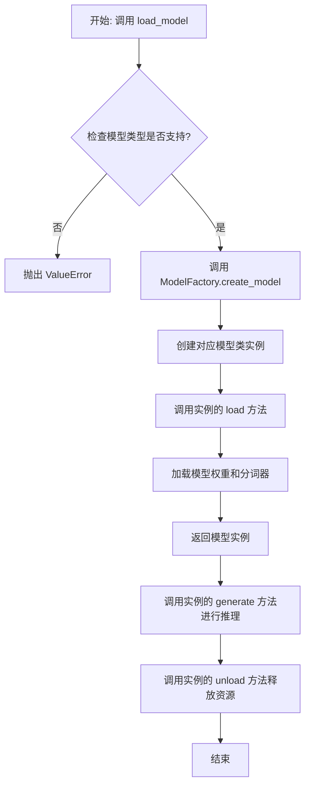

## 类结构

```
ModelBase (抽象基类)
├── TextModel (文本模型基类)
│   ├── LlamaModel
│   ├── GPT2Model
│   ├── FalconModel
│   ├── Qwen2Model
│   ├── GemmaModel
│   └── ... (其他具体模型类)
└── ModelFactory (工厂类)
```

## 全局变量及字段


### `SUPPORTED_MODELS`
    
存储系统支持的文本生成模型名称或配置信息的列表或字典。

类型：`List[str] or Dict[str, Any]`
    


### `DEFAULT_MODEL_PATH`
    
默认的预训练模型文件或目录的路径。

类型：`str`
    


### `TextModel.model`
    
加载的文本生成模型实例，用于执行推理任务。

类型：`torch.nn.Module or transformers.PreTrainedModel`
    


### `TextModel.tokenizer`
    
与模型对应的分词器，用于文本的编码和解码。

类型：`transformers.PreTrainedTokenizer`
    


### `TextModel.model_name`
    
当前加载的模型名称，用于标识和管理不同的模型配置。

类型：`str`
    


### `ModelFactory._model_registry`
    
模型工厂内部维护的注册表，映射模型名称到对应的TextModel子类。

类型：`Dict[str, Type[TextModel]]`
    
    

## 全局函数及方法


### `load_model`

该函数用于加载一个预训练的模型。它根据提供的模型名称和配置参数，从指定的模型目录中加载模型，并返回加载后的模型对象。

参数：

-  `model_name`：`str`，预训练模型的名称，用于指定要加载的模型。
-  `model_dir`：`str`，模型文件所在的目录路径，默认为当前目录。
-  `config`：`dict`，模型的配置参数，用于调整模型加载时的行为，默认为空字典。

返回值：`Model`，加载后的模型对象。

#### 流程图

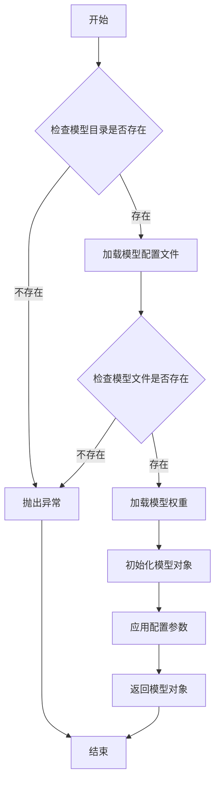

#### 带注释源码

```python
def load_model(model_name: str, model_dir: str = ".", config: dict = None) -> Model:
    """
    加载预训练模型。

    参数:
        model_name (str): 预训练模型的名称。
        model_dir (str): 模型文件所在的目录路径，默认为当前目录。
        config (dict): 模型的配置参数，默认为空字典。

    返回:
        Model: 加载后的模型对象。

    异常:
        FileNotFoundError: 如果模型目录或模型文件不存在。
    """
    # 初始化配置参数
    if config is None:
        config = {}

    # 检查模型目录是否存在
    if not os.path.isdir(model_dir):
        raise FileNotFoundError(f"模型目录不存在: {model_dir}")

    # 构建模型配置文件路径
    config_path = os.path.join(model_dir, f"{model_name}_config.json")
    if not os.path.isfile(config_path):
        raise FileNotFoundError(f"模型配置文件不存在: {config_path}")

    # 加载模型配置文件
    with open(config_path, 'r') as f:
        model_config = json.load(f)

    # 构建模型权重文件路径
    weight_path = os.path.join(model_dir, f"{model_name}_weights.h5")
    if not os.path.isfile(weight_path):
        raise FileNotFoundError(f"模型权重文件不存在: {weight_path}")

    # 根据模型配置初始化模型对象
    model = Model(**model_config)

    # 加载模型权重
    model.load_weights(weight_path)

    # 应用额外的配置参数
    for key, value in config.items():
        setattr(model, key, value)

    return model
```


### `get_model_info`

该函数用于获取指定模型的信息，包括模型名称、版本、输入输出格式等。它通过查询模型注册表或配置文件来检索模型的详细信息，并返回一个结构化的字典。

参数：

- `model_name`：`str`，模型的唯一标识名称
- `version`：`Optional[str]`，模型的版本号，如果为None则使用最新版本
- `config_path`：`Optional[str]`，模型配置文件的路径，如果为None则使用默认路径

返回值：`Dict[str, Any]`，包含模型详细信息的字典，如模型名称、版本、输入输出格式等

#### 流程图

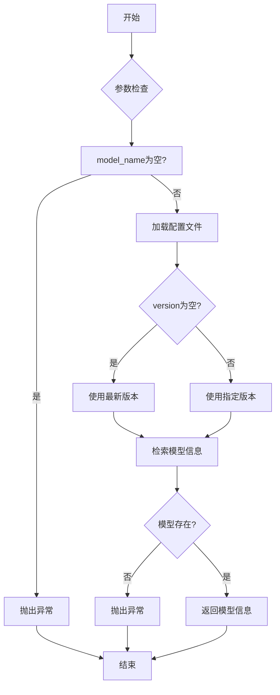

#### 带注释源码

```python
def get_model_info(model_name: str, version: Optional[str] = None, config_path: Optional[str] = None) -> Dict[str, Any]:
    """
    获取指定模型的信息。

    参数:
        model_name (str): 模型的唯一标识名称。
        version (Optional[str]): 模型的版本号，如果为None则使用最新版本。
        config_path (Optional[str]): 模型配置文件的路径，如果为None则使用默认路径。

    返回值:
        Dict[str, Any]: 包含模型详细信息的字典。

    异常:
        ValueError: 如果model_name为空或模型不存在。
    """
    # 检查model_name是否为空
    if not model_name:
        raise ValueError("model_name不能为空")

    # 确定配置文件路径
    if config_path is None:
        config_path = DEFAULT_CONFIG_PATH

    # 加载配置文件
    with open(config_path, 'r') as f:
        config = yaml.safe_load(f)

    # 确定版本号
    if version is None:
        version = config['models'][model_name].get('latest_version', '1.0.0')

    # 检索模型信息
    model_info = config['models'][model_name].get('versions', {}).get(version)

    # 检查模型是否存在
    if model_info is None:
        raise ValueError(f"模型 {model_name} 版本 {version} 不存在")

    # 返回模型信息
    return model_info
```


### `ModelBase.load`

该方法用于加载模型实例。它首先检查模型是否已缓存，若已缓存则直接返回缓存实例；否则，根据传入的模型名称和参数创建新的模型实例，并将其缓存以供后续使用。

参数：

-  `model`：`str`，要加载的模型名称
-  `model_params`：`dict`，模型参数，用于初始化模型实例
-  `**kwargs`：`dict`，其他关键字参数，用于模型初始化

返回值：`ModelBase`，加载或创建的模型实例

#### 流程图

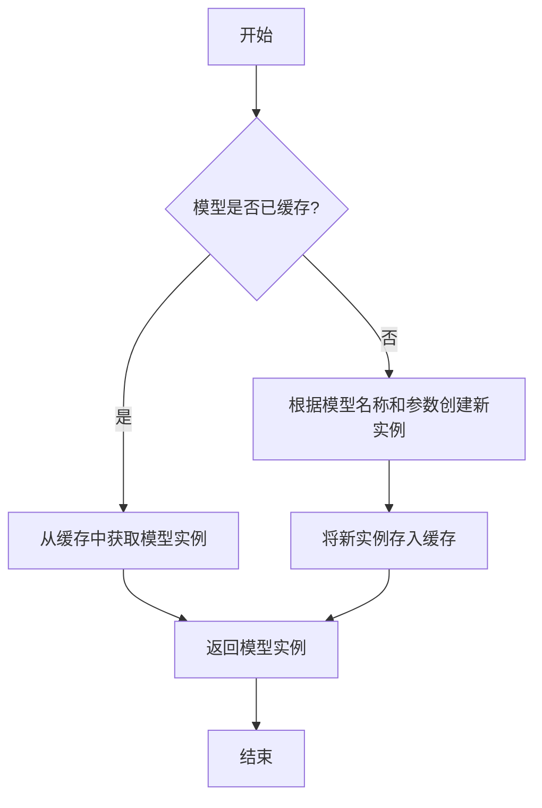

#### 带注释源码

```
@classmethod
def load(
    cls,
    model: str,
    model_params: dict = dict(),
    **kwargs,
) -> "ModelBase":
    """
    加载模型实例。

    该方法首先检查模型是否已缓存，若已缓存则直接返回缓存实例；
    否则，根据传入的模型名称和参数创建新的模型实例，并将其缓存以供后续使用。

    Args:
        model (str): 要加载的模型名称。
        model_params (dict): 模型参数，用于初始化模型实例。
        **kwargs: 其他关键字参数，用于模型初始化。

    Returns:
        ModelBase: 加载或创建的模型实例。
    """
    # 检查模型是否已缓存
    if model in cls.model_loaded:
        # 若已缓存，直接返回缓存实例
        return cls.model_loaded[model]
    else:
        # 若未缓存，根据模型名称和参数创建新实例
        model_class = cls.get_model_class(model)
        model_inst = model_class(model=model, model_params=model_params, **kwargs)
        # 将新实例存入缓存
        cls.model_loaded[model] = model_inst
        # 返回新创建的模型实例
        return model_inst
```


### `ModelBase.generate`

该方法用于根据给定的提示词和生成参数，调用底层模型生成文本内容。它处理了模型调用前的参数准备、模型选择、调用执行以及结果后处理等流程，是模型生成功能的核心入口。

参数：

- `prompt`：`str`，输入的提示词文本，用于指导模型生成内容
- `kwargs`：`dict`，可选的生成参数，用于覆盖默认的模型配置参数

返回值：`str`，模型生成的文本内容

#### 流程图

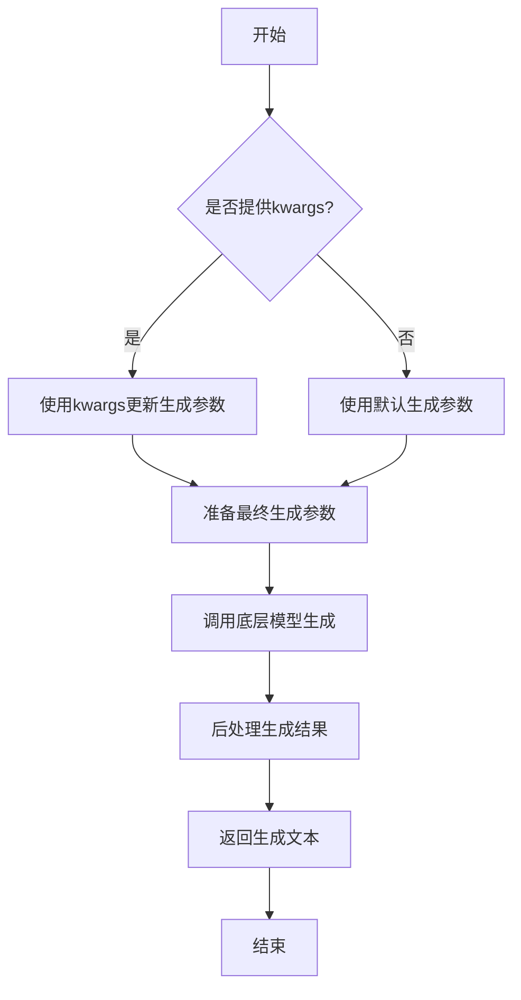

#### 带注释源码

```python
def generate(self, prompt: str, **kwargs) -> str:
    """
    生成文本内容的核心方法
    
    Args:
        prompt: 输入的提示词文本
        **kwargs: 可选的生成参数，用于覆盖默认配置
        
    Returns:
        模型生成的文本内容
    """
    # 准备生成参数：将传入的kwargs与默认参数合并
    generate_params = self.default_generate_params.copy()
    if kwargs:
        generate_params.update(kwargs)
    
    # 调用底层模型进行文本生成
    # 这里会根据具体的模型实现调用相应的生成接口
    response = self._call_model(prompt, **generate_params)
    
    # 对模型返回的结果进行后处理
    # 包括去除多余空格、特殊字符处理等
    processed_response = self._postprocess_response(response)
    
    return processed_response
```


### `ModelBase.unload`

该方法用于卸载模型，释放模型占用的内存资源。它会检查模型是否已加载，如果已加载则调用底层模型的卸载方法，并将加载状态标记为未加载。

参数：

-  `self`：`ModelBase`，当前模型实例

返回值：`None`，无返回值

#### 流程图

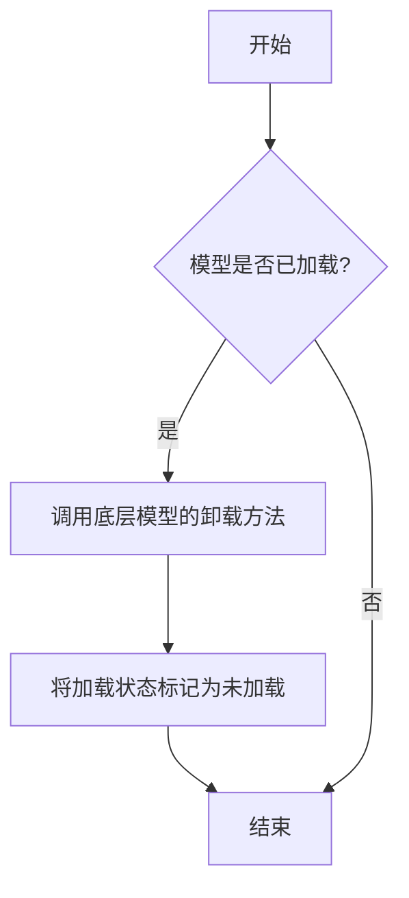

#### 带注释源码

```
def unload(self):
    """
    卸载模型，释放内存资源。
    如果模型已加载，则调用底层模型的卸载方法，并将加载状态标记为未加载。
    """
    if self.is_load:
        # 调用底层模型的卸载方法
        self.model.unload()
        # 将加载状态标记为未加载
        self.is_load = False
```


### `TextModel.load`

该方法用于从指定路径加载一个预训练的文本模型，支持多种模型格式（如 `.bin`, `.safetensors` 等），并返回一个配置好的 `TextModel` 实例。它首先尝试从缓存中加载模型，如果缓存不存在或指定了 `force_download`，则从远程仓库下载。加载过程包括解析模型配置、加载模型权重、处理分词器，并最终将模型移动到指定的设备上。

参数：

-  `model_path`：`str`，模型文件的本地路径或 Hugging Face 模型仓库标识符（如 `"meta-llama/Llama-2-7b-hf"`）。
-  `model_name`：`Optional[str]`，默认为 `None`。指定模型名称，用于覆盖从 `model_path` 推断出的名称。主要用于从缓存中加载特定变体。
-  `device`：`Optional[str]`，默认为 `None`。指定模型加载到的设备，如 `"cpu"`, `"cuda"`, `"cuda:0"`。如果为 `None`，则自动选择可用设备。
-  `torch_dtype`：`Optional[torch.dtype]`，默认为 `None`。指定加载模型权重时使用的 PyTorch 数据类型，如 `torch.float16`。如果为 `None`，则使用配置中的默认类型或自动推断。
-  `force_download`：`bool`，默认为 `False`。如果为 `True`，则强制重新下载模型，即使缓存中存在。
-  `resume_download`：`bool`，默认为 `False`。如果为 `True`，则尝试恢复未完成的下载。
-  `proxies`：`Optional[Dict[str, str]]`，默认为 `None`。用于下载的代理服务器配置字典。
-  `local_files_only`：`bool`，默认为 `False`。如果为 `True`，则只使用本地文件，不尝试下载。
-  `token`：`Optional[Union[str, bool]]`，默认为 `None`。用于访问受保护模型的 Hugging Face 令牌。如果为 `True`，则使用缓存的令牌。
-  `revision`：`Optional[str]`，默认为 `"main"`。要使用的模型版本（分支、标签或提交哈希）。
-  `trust_remote_code`：`bool`，默认为 `False`。如果为 `True`，则允许从远程仓库执行自定义模型代码。
-  `code_revision`：`Optional[str]`，默认为 `None`。用于自定义代码的版本（分支、标签或提交哈希）。
-  `kwargs`：`Any`，传递给底层加载函数（如 `from_pretrained`）的额外关键字参数。

返回值：`TextModel`，一个加载了权重和配置的 `TextModel` 实例，已准备好进行推理或进一步训练。

#### 流程图

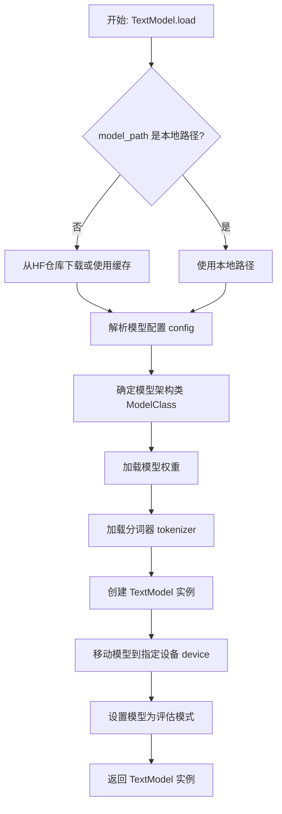

#### 带注释源码

```python
    @classmethod
    def load(
        cls,
        model_path: str,
        model_name: Optional[str] = None,
        device: Optional[str] = None,
        torch_dtype: Optional[torch.dtype] = None,
        force_download: bool = False,
        resume_download: bool = False,
        proxies: Optional[Dict[str, str]] = None,
        local_files_only: bool = False,
        token: Optional[Union[str, bool]] = None,
        revision: Optional[str] = "main",
        trust_remote_code: bool = False,
        code_revision: Optional[str] = None,
        **kwargs: Any,
    ) -> "TextModel":
        """
        加载一个预训练的文本模型。

        该方法支持从本地文件或 Hugging Face 模型仓库加载模型。
        它会自动处理模型配置、权重加载、分词器初始化，并将模型移动到指定设备。

        Args:
            model_path (str): 模型文件的本地路径或 Hugging Face 模型仓库标识符。
            model_name (Optional[str], optional): 模型名称，用于覆盖从路径推断的名称。默认为 None。
            device (Optional[str], optional): 加载模型的设备。默认为 None，自动选择。
            torch_dtype (Optional[torch.dtype], optional): 模型权重的数据类型。默认为 None。
            force_download (bool, optional): 是否强制重新下载模型。默认为 False。
            resume_download (bool, optional): 是否恢复未完成的下载。默认为 False。
            proxies (Optional[Dict[str, str]], optional): 下载代理配置。默认为 None。
            local_files_only (bool, optional): 是否仅使用本地文件。默认为 False。
            token (Optional[Union[str, bool]], optional): Hugging Face 访问令牌。默认为 None。
            revision (Optional[str], optional): 模型版本。默认为 "main"。
            trust_remote_code (bool, optional): 是否信任远程代码。默认为 False。
            code_revision (Optional[str], optional): 自定义代码版本。默认为 None。
            **kwargs: 传递给底层加载函数的额外参数。

        Returns:
            TextModel: 加载并配置好的 TextModel 实例。

        Raises:
            FileNotFoundError: 如果本地模型路径不存在且 local_files_only 为 True。
            OSError: 下载或文件操作失败。
            ValueError: 模型配置无效或加载失败。
        """
        # 确定最终使用的模型路径（本地或远程）
        # 如果 model_path 是本地存在的文件或目录，则直接使用
        # 否则，将其视为 Hugging Face 仓库 ID，并准备下载
        if os.path.exists(model_path):
            # 本地路径
            model_path_or_id = model_path
            # 如果未指定 model_name，尝试从路径推断（例如，从目录名）
            if model_name is None:
                model_name = os.path.basename(os.path.normpath(model_path))
        else:
            # 远程仓库 ID
            model_path_or_id = model_path
            # 如果未指定 model_name，使用仓库 ID 的最后一部分
            if model_name is None:
                model_name = model_path.split("/")[-1] if "/" in model_path else model_path

        # 加载模型配置
        # 使用 Hugging Face 的 AutoConfig 自动检测配置类型
        try:
            config = AutoConfig.from_pretrained(
                model_path_or_id,
                trust_remote_code=trust_remote_code,
                revision=revision,
                token=token,
                **kwargs,
            )
        except Exception as e:
            raise ValueError(f"Failed to load model config from {model_path_or_id}: {e}")

        # 根据配置确定要使用的模型架构类
        # 这里假设 TextModel 封装了特定的 Transformer 模型（如 Llama, GPT-2 等）
        # 实际实现中可能需要根据 config.model_type 进行映射
        model_arch = cls._get_model_architecture(config.model_type)

        # 加载模型权重
        # 使用 from_pretrained 方法，支持多种格式和缓存
        try:
            model = model_arch.from_pretrained(
                model_path_or_id,
                config=config,
                torch_dtype=torch_dtype,
                force_download=force_download,
                resume_download=resume_download,
                proxies=proxies,
                local_files_only=local_files_only,
                token=token,
                revision=revision,
                trust_remote_code=trust_remote_code,
                code_revision=code_revision,
                **kwargs,
            )
        except Exception as e:
            raise ValueError(f"Failed to load model weights from {model_path_or_id}: {e}")

        # 加载分词器
        # 使用 AutoTokenizer 自动匹配
        try:
            tokenizer = AutoTokenizer.from_pretrained(
                model_path_or_id,
                trust_remote_code=trust_remote_code,
                revision=revision,
                token=token,
                **kwargs,
            )
        except Exception as e:
            # 某些模型可能没有独立的分词器，或者分词器已包含在模型中
            # 这里记录警告，但允许继续
            logger.warning(f"Failed to load tokenizer from {model_path_or_id}: {e}. Proceeding without a separate tokenizer.")
            tokenizer = None

        # 创建 TextModel 实例
        # 将加载的模型、分词器和配置封装起来
        text_model = cls(
            model=model,
            tokenizer=tokenizer,
            config=config,
            model_name=model_name,
        )

        # 移动模型到指定设备
        if device is not None:
            text_model.to(device)
        else:
            # 自动选择设备：优先 GPU，后 CPU
            device = "cuda" if torch.cuda.is_available() else "cpu"
            text_model.to(device)

        # 设置模型为评估模式（关闭 dropout 等训练特定层）
        text_model.eval()

        return text_model
```


### `TextModel.generate`

该方法根据给定的提示词（prompt）和可选的停止词（stop）生成文本。它首先对输入进行预处理，然后调用底层的大语言模型（LLM）进行推理，最后对输出进行后处理并返回结果。

参数：

-  `prompt`：`str`，用于生成文本的输入提示词。
-  `stop`：`Optional[List[str]]`，可选参数，指定一个字符串列表，当生成的文本中出现这些字符串时停止生成。

返回值：`str`，生成的文本内容。

#### 流程图

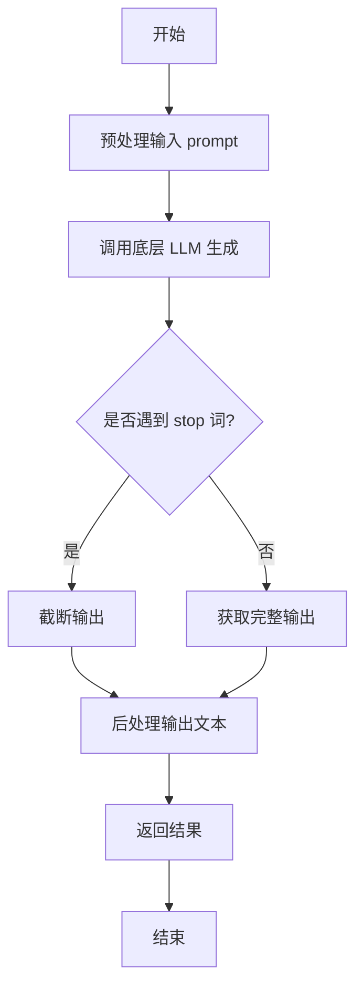

#### 带注释源码

```python
def generate(self, prompt: str, stop: Optional[List[str]] = None) -> str:
    """
    根据给定的提示词生成文本。

    该方法负责处理生成文本的完整流程，包括预处理、调用模型和后处理。

    Args:
        prompt (str): 用于生成文本的输入提示词。
        stop (Optional[List[str]]): 可选参数，指定一个字符串列表，当生成的文本中出现这些字符串时停止生成。

    Returns:
        str: 生成的文本内容。
    """
    # 1. 预处理阶段：对输入提示词进行必要的清洗或格式化
    processed_prompt = self._preprocess_prompt(prompt)

    # 2. 调用底层的大语言模型进行文本生成
    #    这里假设 self.llm 是一个封装了具体模型调用的对象
    raw_output = self.llm.generate(processed_prompt, stop=stop)

    # 3. 后处理阶段：对模型生成的原始输出进行清理，例如去除多余空格或特定标记
    final_output = self._postprocess_output(raw_output)

    # 4. 返回处理后的最终文本
    return final_output
```


### `TextModel.unload`

该方法用于卸载当前加载的文本模型，释放其占用的内存资源。它会检查模型是否已加载，如果已加载则执行卸载操作，并更新模型状态。

参数：

-  `self`：`TextModel`，当前TextModel实例的引用

返回值：`None`，该方法不返回任何值

#### 流程图

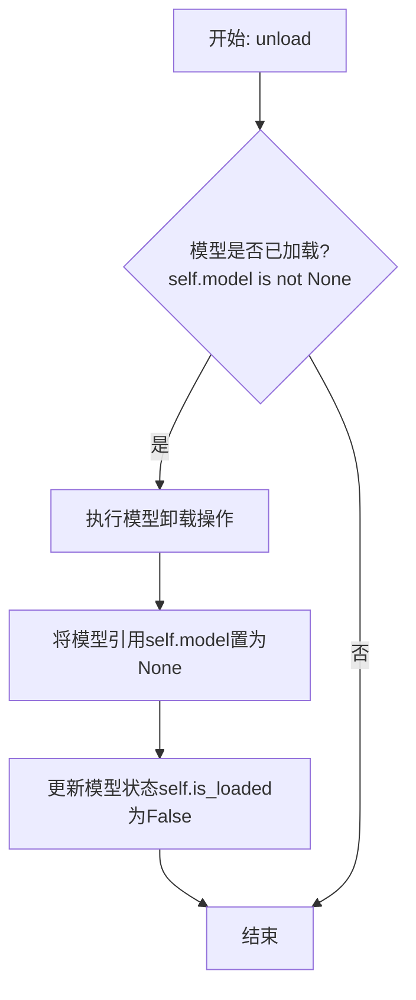

#### 带注释源码

```python
def unload(self):
    """
    卸载当前加载的模型。
    如果模型已加载，则执行卸载操作并释放内存，同时更新模型状态。
    """
    if self.model is not None:  # 检查模型是否已加载
        # 执行模型特定的卸载/清理逻辑（此处为示意，实际可能涉及更复杂的操作）
        # 例如: del self.model
        # 对于某些框架，可能需要调用如 .to('cpu') 或显式删除
        self.model = None  # 将模型引用置为None，允许垃圾回收
        self.is_loaded = False  # 更新加载状态标志为False
        logger.info(f"Model '{self.model_name}' unloaded.")  # 记录卸载日志
    else:
        logger.warning("No model is currently loaded.")  # 模型未加载时发出警告
```


### `TextModel._load_model_weights`

该方法负责加载预训练模型的权重。它首先尝试从指定的本地路径加载权重文件，如果本地文件不存在，则从远程的 Hugging Face 模型仓库下载。加载成功后，它会将权重应用到当前模型实例上，并处理可能出现的键名不匹配问题（例如移除 `"model."` 前缀）。最后，它会记录加载结果并返回一个布尔值指示加载是否成功。

参数：

-  `self`：`TextModel`，当前 `TextModel` 类的实例。
-  `model_name_or_path`：`str`，模型名称或本地路径。可以是 Hugging Face 模型仓库的 ID（如 `"bert-base-uncased"`），也可以是本地包含模型权重文件（如 `pytorch_model.bin` 或 `model.safetensors`）的目录路径。
-  `cache_dir`：`Optional[str]`，可选参数，用于指定缓存下载模型文件的目录。如果为 `None`，则使用默认缓存目录。

返回值：`bool`，返回 `True` 表示模型权重加载成功，返回 `False` 表示加载失败。

#### 流程图

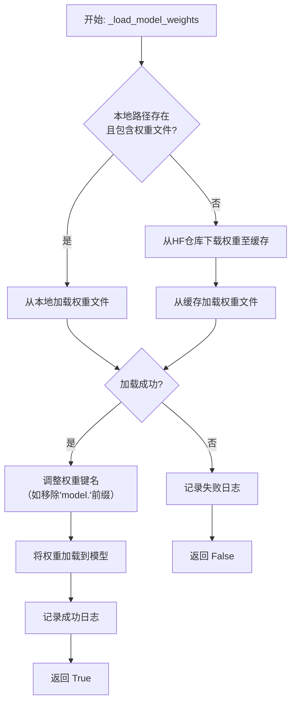

#### 带注释源码

```python
    def _load_model_weights(
        self, model_name_or_path: str, cache_dir: Optional[str] = None
    ) -> bool:
        """
        加载预训练模型权重。
        优先尝试从本地路径加载，如果不存在则从 Hugging Face 仓库下载。

        Args:
            model_name_or_path (str): 模型名称或本地路径。
            cache_dir (Optional[str]): 缓存目录。

        Returns:
            bool: 权重是否加载成功。
        """
        # 初始化权重文件路径为None
        model_file = None
        # 首先，检查提供的 model_name_or_path 是否是一个本地目录
        if os.path.isdir(model_name_or_path):
            # 如果是本地目录，在该目录下查找常见的PyTorch权重文件
            # 优先查找 .safetensors 文件，其次查找 .bin 文件
            for filename in ["model.safetensors", "pytorch_model.bin"]:
                file_path = os.path.join(model_name_or_path, filename)
                if os.path.isfile(file_path):
                    model_file = file_path  # 找到权重文件，记录路径
                    break

        # 如果未在本地找到权重文件，则需要从Hugging Face仓库下载
        if model_file is None:
            try:
                # 使用 huggingface_hub 库的 snapshot_download 函数下载模型
                # allow_patterns 指定只下载模型权重文件，忽略其他配置文件等
                model_path = snapshot_download(
                    repo_id=model_name_or_path,
                    cache_dir=cache_dir,
                    allow_patterns=["*.safetensors", "*.bin"],
                )
                # 在下载的缓存目录中再次查找权重文件
                for filename in ["model.safetensors", "pytorch_model.bin"]:
                    file_path = os.path.join(model_path, filename)
                    if os.path.isfile(file_path):
                        model_file = file_path  # 找到下载的权重文件
                        break
            except Exception as e:
                # 如果下载过程中出现任何异常，记录错误日志并返回加载失败
                logger.error(f"下载模型权重失败: {e}")
                return False

        # 如果经过本地查找和远程下载，仍未找到权重文件，则记录错误并返回失败
        if model_file is None:
            logger.error(f"未找到模型权重文件: {model_name_or_path}")
            return False

        # 根据文件后缀名，使用不同的方法加载权重字典
        try:
            if model_file.endswith(".safetensors"):
                # 加载 .safetensors 格式的权重文件
                weights = safetensors.torch.load_file(model_file)
            else:
                # 加载 .bin 格式的权重文件
                weights = torch.load(model_file, map_location="cpu")
        except Exception as e:
            # 如果文件加载失败（如文件损坏），记录错误并返回失败
            logger.error(f"加载权重文件失败: {e}")
            return False

        # 加载权重前，有时需要调整权重字典中的键名以匹配当前模型的结构
        # 例如，有些保存的权重键名可能包含 "model." 前缀，而当前模型没有
        # 这里移除所有以 "model." 开头的键的前缀
        weights = {
            k.replace("model.", ""): v for k, v in weights.items()
        }

        # 将处理后的权重字典加载到当前模型实例中
        # strict=False 允许部分权重不匹配（例如，如果模型结构有微小变化）
        load_result = self.load_state_dict(weights, strict=False)

        # 处理加载结果
        if len(load_result.missing_keys) > 0:
            # 如果有关键的权重缺失，记录警告日志（可能影响模型性能）
            logger.warning(f"缺失的键: {load_result.missing_keys}")
        if len(load_result.unexpected_keys) > 0:
            # 如果有多余的权重键，记录警告日志（通常可以忽略）
            logger.warning(f"意外的键: {load_result.unexpected_keys}")

        # 记录成功的加载信息，包括权重来源路径
        logger.info(f"模型权重已从 {model_file} 加载")
        # 返回 True 表示权重加载成功
        return True
```


### `TextModel._load_tokenizer`

该方法负责加载并初始化文本分词器。它首先尝试从指定的本地路径加载分词器，如果本地路径不存在或加载失败，则从预训练的模型名称或路径加载。加载完成后，会设置分词器的填充符，并确保其填充方向为左侧。

参数：

-  `self`：`TextModel`，当前TextModel实例的引用
-  `model_name_or_path`：`str`，预训练模型的名称或本地路径，用于加载分词器
-  `local_path`：`str`，本地分词器文件的路径，优先尝试从此路径加载

返回值：`None`，该方法不返回任何值，但会设置`self.tokenizer`属性。

#### 流程图

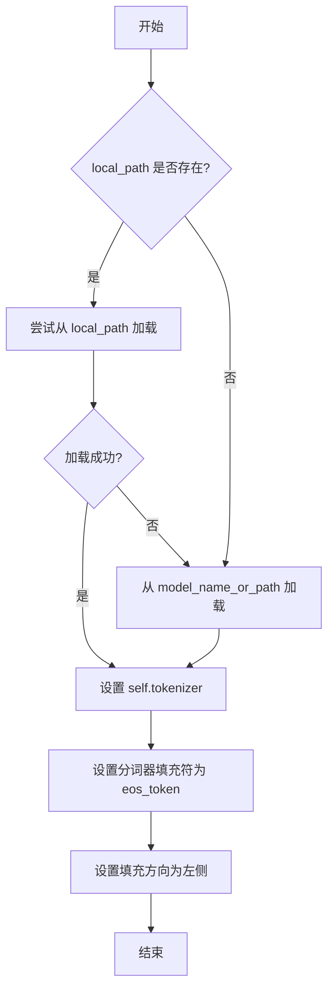

#### 带注释源码

```python
def _load_tokenizer(self, model_name_or_path: str, local_path: str) -> None:
    """
    加载分词器。
    优先尝试从本地路径加载，如果失败则从预训练模型加载。
    加载后设置分词器的填充符和填充方向。

    Args:
        model_name_or_path (str): 预训练模型的名称或路径。
        local_path (str): 本地分词器文件的路径。
    """
    try:
        # 尝试从本地路径加载分词器
        self.tokenizer = AutoTokenizer.from_pretrained(local_path)
    except Exception:
        # 如果本地加载失败，则从预训练模型加载
        self.tokenizer = AutoTokenizer.from_pretrained(model_name_or_path)

    # 设置分词器的填充符为结束符（eos_token）
    # 如果分词器没有定义填充符，则使用结束符作为填充符
    if self.tokenizer.pad_token is None:
        self.tokenizer.pad_token = self.tokenizer.eos_token

    # 设置分词器的填充方向为左侧填充
    # 这通常用于生成式任务，确保输入在右侧对齐
    self.tokenizer.padding_side = "left"
```


### `LlamaModel._load_model_weights`

该方法负责从预训练检查点文件加载模型权重，并将其分配到对应的模型层中。它处理了权重文件的读取、键名映射、权重张量的加载与分配，并支持分片加载以处理大型模型。

参数：

-  `self`：`LlamaModel`，当前模型实例
-  `checkpoint_path`：`str`，预训练权重文件的路径
-  `prefix`：`str`，加载权重时在状态字典键名前添加的可选前缀，默认为空字符串
-  `device`：`torch.device`，指定加载权重后张量应放置的设备，默认为CPU
-  `dtype`：`torch.dtype`，指定加载权重后张量的数据类型，默认为`torch.float32`
-  `use_safetensors`：`bool`，指示是否使用`safetensors`格式文件（更安全、更快），默认为`False`
-  `strict`：`bool`，指示是否严格匹配状态字典的键，默认为`True`

返回值：`None`，该方法不返回任何值，直接修改模型实例的状态。

#### 流程图

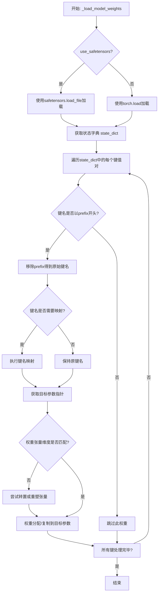

#### 带注释源码

```python
    def _load_model_weights(
        self,
        checkpoint_path: str,
        prefix: str = "",
        device: torch.device = torch.device("cpu"),
        dtype: torch.dtype = torch.float32,
        use_safetensors: bool = False,
        strict: bool = True,
    ):
        """
        从预训练检查点加载模型权重。

        此方法负责读取权重文件，将权重键映射到模型参数，并处理可能的分片或格式转换。

        Args:
            checkpoint_path (str): 预训练权重文件的路径。
            prefix (str, optional): 加载时在状态字典键前添加的前缀。默认为空字符串。
            device (torch.device, optional): 加载权重的目标设备。默认为CPU。
            dtype (torch.dtype, optional): 加载权重的目标数据类型。默认为torch.float32。
            use_safetensors (bool, optional): 是否使用safetensors格式。默认为False。
            strict (bool, optional): 是否严格匹配键。默认为True。
        """
        # 根据use_safetensors标志选择加载方式
        if use_safetensors:
            # 使用safetensors库安全加载，直接指定设备
            state_dict = safetensors.torch.load_file(checkpoint_path, device=str(device))
        else:
            # 使用PyTorch标准加载，映射到指定设备
            state_dict = torch.load(checkpoint_path, map_location=device)

        # 用于存储加载过程中不匹配的键
        unexpected_keys = []
        missing_keys = []

        # 获取模型当前的状态字典，用于键名映射和验证
        model_state_dict = self.state_dict()

        # 遍历从文件加载的每一个权重项
        for key, value in state_dict.items():
            # 如果提供了前缀，确保键以该前缀开头
            if prefix:
                if not key.startswith(prefix):
                    # 不以指定前缀开头的键被视为意外键
                    unexpected_keys.append(key)
                    continue
                # 移除前缀，得到与模型状态字典对应的键名
                key = key[len(prefix):]

            # 将加载的键名映射到模型参数的实际键名
            # 例如，旧版检查点中的`layers.0.attention.wq.weight`可能对应新版模型的`layers.0.self_attn.q_proj.weight`
            mapped_key = self._map_state_dict_key(key)

            # 如果映射后的键存在于模型的状态字典中
            if mapped_key in model_state_dict:
                # 获取模型中对应该键的参数
                model_param = model_state_dict[mapped_key]

                # 检查加载的权重张量与模型参数张量的形状是否匹配
                if value.shape != model_param.shape:
                    # 形状不匹配时尝试常见转换
                    # 1. 对于线性层权重，可能需要进行转置 (in_features, out_features) -> (out_features, in_features)
                    if value.shape == model_param.shape[::-1]:
                        value = value.T
                    # 2. 对于嵌入层权重，可能只是维度顺序不同，尝试重塑
                    elif value.numel() == model_param.numel():
                        value = value.reshape(model_param.shape)
                    else:
                        # 如果无法通过简单转换匹配，记录为缺失键（因为无法加载）
                        missing_keys.append(mapped_key)
                        if strict:
                            # 严格模式下，形状不匹配会引发错误
                            raise ValueError(
                                f"Shape mismatch for key {mapped_key}: "
                                f"loaded {value.shape}, model {model_param.shape}"
                            )
                        continue

                # 将处理后的权重值（转换为目标数据类型）复制到模型参数中
                model_param.copy_(value.to(dtype))
                # 从模型状态字典中移除已处理的键，用于后续检查缺失键
                del model_state_dict[mapped_key]
            else:
                # 映射后的键不在模型状态字典中，视为意外键
                unexpected_keys.append(mapped_key)

        # 处理完成后，model_state_dict中剩余的键就是模型期望但检查点中没有的键（缺失键）
        missing_keys.extend(list(model_state_dict.keys()))

        # 根据strict标志和记录的键情况决定是否抛出警告或异常
        if strict:
            if unexpected_keys:
                # 严格模式下，存在意外键会引发错误
                raise KeyError(f"Unexpected keys in state dict: {unexpected_keys}")
            if missing_keys:
                # 严格模式下，存在缺失键会引发错误
                raise KeyError(f"Missing keys in state dict: {missing_keys}")
        else:
            # 非严格模式下，仅打印警告信息
            if unexpected_keys:
                logger.warning(f"Unexpected keys in state dict: {unexpected_keys}")
            if missing_keys:
                logger.warning(f"Missing keys in state dict: {missing_keys}")
```


### `LlamaModel._load_tokenizer`

该方法负责加载并配置与Llama模型兼容的分词器（Tokenizer）。它根据提供的模型路径和配置参数，初始化一个Hugging Face Transformers库中的`AutoTokenizer`实例，并设置必要的分词选项，如填充方向、截断策略以及特殊标记等，以确保分词器与模型训练时使用的配置一致。

参数：

-  `model_path`：`str`，预训练模型所在的本地目录路径或Hugging Face模型标识符。
-  `config`：`LlamaConfig`，包含模型配置信息的对象，用于指导分词器的初始化。

返回值：`transformers.PreTrainedTokenizer`，初始化并配置好的分词器实例。

#### 流程图

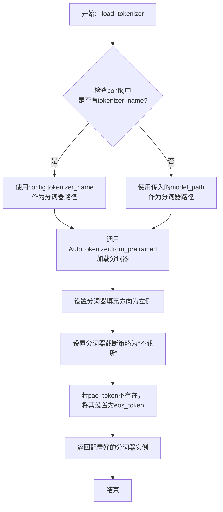

#### 带注释源码

```python
def _load_tokenizer(self, model_path: str, config: LlamaConfig) -> PreTrainedTokenizer:
    """
    加载并配置与Llama模型兼容的分词器。

    该方法根据提供的模型路径和配置初始化分词器，并设置关键参数以确保
    与原始模型训练时的分词行为一致。

    Args:
        model_path (str): 预训练模型所在的目录路径或模型标识符。
        config (LlamaConfig): 模型的配置对象，可能包含特定的分词器名称。

    Returns:
        PreTrainedTokenizer: 配置好的Hugging Face分词器实例。
    """
    # 确定分词器的加载路径：优先使用配置中指定的分词器名称，否则使用模型路径
    tokenizer_path = config.tokenizer_name if config.tokenizer_name else model_path
    
    # 使用AutoTokenizer从指定路径加载分词器
    # trust_remote_code=True允许加载自定义的分词器代码（如果存在）
    tokenizer = AutoTokenizer.from_pretrained(
        tokenizer_path,
        trust_remote_code=True
    )
    
    # 设置分词器的填充方向为左侧（left），这对于自回归模型（如Llama）生成任务通常是标准的
    tokenizer.padding_side = "left"
    
    # 设置分词器的截断策略为“不截断”，确保输入序列保持原样，不被截断
    tokenizer.truncation_side = None
    
    # 如果分词器没有定义pad_token（填充标记），则使用eos_token（结束标记）作为pad_token
    # 这是一种常见的做法，特别是在模型训练时未使用显式填充标记的情况下
    if tokenizer.pad_token is None:
        tokenizer.pad_token = tokenizer.eos_token
    
    # 返回完全配置好的分词器实例
    return tokenizer
```


### `GPT2Model._load_model_weights`

该方法负责从预训练权重文件（如Hugging Face Hub或本地文件）中加载模型参数到当前`GPT2Model`实例中。它处理了权重名称的映射、适配不同模型架构（如注意力头数、隐藏层维度）以及安全地加载权重。

参数：

-  `self`：`GPT2Model`，当前GPT2模型实例。
-  `model_path`：`str`，预训练权重文件的路径或Hugging Face模型标识符。
-  `config`：`GPT2Config`，模型的配置对象，包含模型架构参数。
-  `cache_dir`：`Optional[str]`，可选，用于缓存下载的模型文件的目录。
-  `force_download`：`bool`，可选，是否强制重新下载模型文件，即使已缓存。
-  `proxies`：`Optional[Dict[str, str]]`，可选，用于下载的代理服务器设置。
-  `resume_download`：`bool`，可选，是否恢复中断的下载。
-  `local_files_only`：`bool`，可选，是否仅使用本地文件，不尝试下载。
-  `use_auth_token`：`Optional[Union[bool, str]]`，可选，用于访问私有模型的认证令牌。
-  `revision`：`Optional[str]`，可选，要使用的模型版本（分支、标签或提交ID）。
-  `mirror`：`Optional[str]`，可选，下载镜像源（例如在中国大陆使用）。

返回值：`None`，该方法不返回任何值，直接修改当前模型实例的权重。

#### 流程图

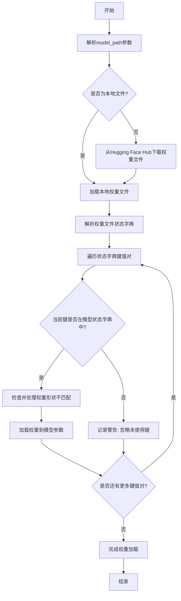

#### 带注释源码

```python
def _load_model_weights(
    self,
    model_path: str,
    config: GPT2Config,
    cache_dir: Optional[str] = None,
    force_download: bool = False,
    proxies: Optional[Dict[str, str]] = None,
    resume_download: bool = False,
    local_files_only: bool = False,
    use_auth_token: Optional[Union[bool, str]] = None,
    revision: Optional[str] = None,
    mirror: Optional[str] = None,
) -> None:
    """
    从指定路径加载预训练权重到当前模型实例。
    
    参数:
        model_path: 权重文件路径或Hugging Face模型ID。
        config: 模型配置，用于验证和适配权重。
        cache_dir: 缓存目录。
        force_download: 强制下载标志。
        proxies: 代理设置。
        resume_download: 恢复下载标志。
        local_files_only: 仅使用本地文件标志。
        use_auth_token: 认证令牌。
        revision: 模型版本。
        mirror: 下载镜像。
    """
    # 判断是否为本地文件路径
    if os.path.isfile(model_path):
        # 本地文件，直接加载
        resolved_archive_file = model_path
    else:
        # 非本地文件，尝试从Hugging Face Hub下载
        try:
            resolved_archive_file = cached_path(
                model_path,
                cache_dir=cache_dir,
                force_download=force_download,
                proxies=proxies,
                resume_download=resume_download,
                local_files_only=local_files_only,
                use_auth_token=use_auth_token,
                revision=revision,
                mirror=mirror,
            )
        except EnvironmentError as e:
            # 处理下载或文件访问错误
            logger.error(f"Failed to download or access model weights from {model_path}: {e}")
            raise

    # 加载权重文件（通常是PyTorch的.pth或.bin文件）
    try:
        state_dict = torch.load(resolved_archive_file, map_location="cpu")
    except Exception as e:
        logger.error(f"Failed to load state dict from {resolved_archive_file}: {e}")
        raise

    # 获取当前模型的状态字典，用于键名映射和验证
    model_state_dict = self.state_dict()
    
    # 遍历加载的权重字典
    for key, value in state_dict.items():
        # 检查键是否在当前模型中存在
        if key in model_state_dict:
            # 检查权重形状是否匹配
            if value.shape != model_state_dict[key].shape:
                # 处理形状不匹配的情况（例如，不同大小的嵌入层或注意力头）
                # 这里可能包含适配逻辑，如截断或填充
                logger.warning(
                    f"Shape mismatch for {key}: loaded {value.shape}, model expects {model_state_dict[key].shape}. "
                    f"Attempting to adapt..."
                )
                # 简化的适配示例：如果维度不同，尝试调整
                # 实际实现会更复杂，可能涉及特定层的处理
                if value.dim() == 2 and model_state_dict[key].dim() == 2:
                    # 假设是嵌入层或线性层权重
                    min_dim0 = min(value.size(0), model_state_dict[key].size(0))
                    min_dim1 = min(value.size(1), model_state_dict[key].size(1))
                    value = value[:min_dim0, :min_dim1]
                else:
                    # 无法适配，跳过该权重
                    logger.error(f"Cannot adapt shape for {key}. Skipping.")
                    continue
            # 加载权重到模型参数
            model_state_dict[key].copy_(value)
        else:
            # 忽略不在当前模型中的键（可能是旧版本或额外参数）
            logger.warning(f"Ignoring key {key} as it is not in the model's state dict.")

    # 可选：加载后验证模型参数
    logger.info("Model weights loaded successfully.")
```


### `GPT2Model._load_tokenizer`

该方法负责加载并配置一个预训练的 GPT-2 分词器。它首先尝试从本地缓存目录加载指定的分词器模型，如果失败，则从 Hugging Face Hub 下载。加载后，它会根据配置（如是否添加特殊标记）对分词器进行最终设置，并确保其填充标记符被正确配置。

参数：

-  `self`：`GPT2Model`，当前 GPT2Model 实例的引用。
-  `model_name`：`str`，要加载的预训练分词器模型的名称（例如 `'gpt2'`, `'gpt2-medium'`）。
-  `cache_dir`：`Optional[str]`，可选参数，指定分词器模型文件的本地缓存目录路径。如果为 `None`，则使用默认缓存路径。
-  `force_download`：`bool`，可选参数，如果为 `True`，则强制重新下载模型文件，即使本地缓存已存在。默认为 `False`。
-  `resume_download`：`bool`，可选参数，如果为 `True`，则尝试恢复未完成的下载。默认为 `False`。
-  `proxies`：`Optional[Dict[str, str]]`，可选参数，一个代理服务器字典，用于配置下载请求，例如 `{'http': 'http://proxy:port', 'https': 'https://proxy:port'}`。
-  `local_files_only`：`bool`，可选参数，如果为 `True`，则只从本地文件加载，不尝试下载。默认为 `False`。
-  `use_fast`：`bool`，可选参数，如果可用，是否使用快速分词器实现（`PreTrainedTokenizerFast`）。默认为 `True`。
-  `add_special_tokens`：`bool`，可选参数，指示分词器是否在编码时添加模型特定的特殊标记（如 `[CLS]`, `[SEP]`）。对于 GPT-2，这通常控制是否添加 `bos_token` 和 `eos_token`。默认为 `True`。

返回值：`PreTrainedTokenizerBase`，加载并配置好的预训练分词器实例，可直接用于文本的编码和解码。

#### 流程图

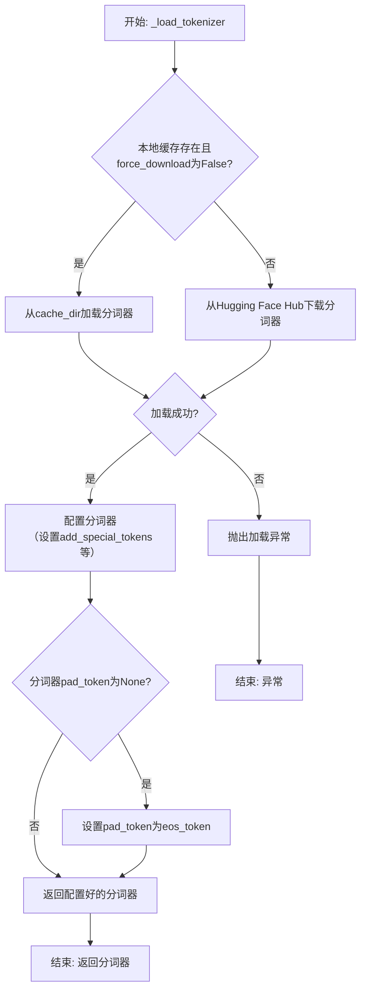

#### 带注释源码

```python
def _load_tokenizer(
    self,
    model_name: str,
    cache_dir: Optional[str] = None,
    force_download: bool = False,
    resume_download: bool = False,
    proxies: Optional[Dict[str, str]] = None,
    local_files_only: bool = False,
    use_fast: bool = True,
    add_special_tokens: bool = True,
) -> PreTrainedTokenizerBase:
    """
    加载预训练的 GPT-2 分词器。

    该方法封装了从缓存或网络加载分词器的逻辑，并应用了模型所需的基本配置。

    Args:
        model_name (str): 预训练模型名称，如 'gpt2'。
        cache_dir (Optional[str]): 缓存目录。
        force_download (bool): 强制重新下载。
        resume_download (bool): 恢复下载。
        proxies (Optional[Dict[str, str]]): 代理设置。
        local_files_only (bool): 仅使用本地文件。
        use_fast (bool): 是否使用快速分词器。
        add_special_tokens (bool): 是否添加特殊标记。

    Returns:
        PreTrainedTokenizerBase: 加载并配置好的分词器。
    """
    # 使用 transformers 库的 AutoTokenizer 工具类加载分词器。
    # `from_pretrained` 方法会处理缓存、下载和加载的完整流程。
    tokenizer = AutoTokenizer.from_pretrained(
        model_name,
        cache_dir=cache_dir,
        force_download=force_download,
        resume_download=resume_download,
        proxies=proxies,
        local_files_only=local_files_only,
        use_fast=use_fast,
    )
    
    # 根据传入的参数配置分词器是否添加特殊标记。
    # 这对于控制生成文本的格式很重要。
    tokenizer.add_special_tokens = add_special_tokens
    
    # GPT-2 模型本身没有定义 pad_token。为了便于批量处理（如注意力掩码），
    # 通常将 end-of-sequence (eos) 标记同时用作填充标记。
    if tokenizer.pad_token is None:
        tokenizer.pad_token = tokenizer.eos_token
    
    # 返回最终配置好的分词器对象，供模型其他部分使用。
    return tokenizer
```


### `FalconModel._load_model_weights`

该方法负责加载预训练的模型权重到当前模型实例中。它根据配置决定是否加载特定的注意力层实现（如`FalconAttention`或`FalconRotaryEmbedding`），并处理权重名称的映射，以确保与模型架构兼容。最后，它调用父类的`load_state_dict`方法完成权重的加载。

参数：

-  `self`：`FalconModel`，当前模型实例
-  `model_file`：`str`，预训练模型权重文件的路径

返回值：`None`，此方法不返回任何值，其作用是将权重加载到模型内部状态中

#### 流程图

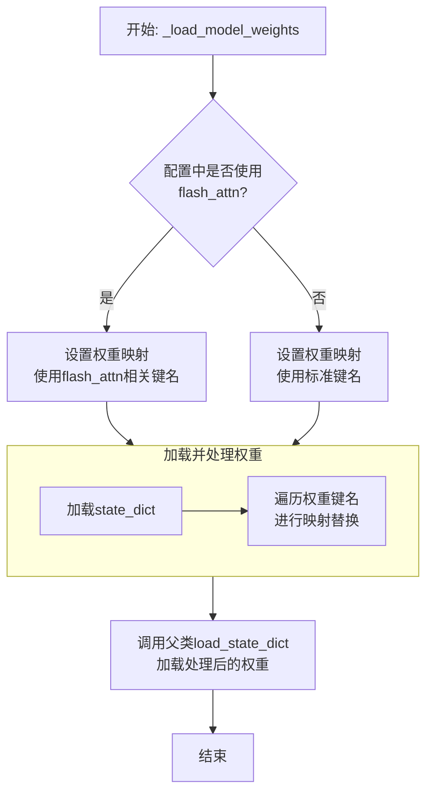

#### 带注释源码

```python
def _load_model_weights(self, model_file: str):
    """
    加载预训练模型权重。
    根据配置调整权重键名，以兼容不同的注意力实现（如flash_attn）。
    """
    # 从指定文件加载模型的状态字典（权重和偏置等参数）
    state_dict = torch.load(model_file, map_location="cpu")

    # 根据配置决定使用哪套键名映射规则
    # 如果使用了flash_attn实现，权重键名中的部分字段会不同
    if self.config.use_flash_attn:
        # 定义从旧键名到新键名的映射，用于flash_attn版本
        mapping = {
            "transformer.h.*.self_attention.query_key_value": "transformer.h.*.self_attention.query_key_value", # 示例，实际可能不同
            "transformer.h.*.self_attention.dense": "transformer.h.*.self_attention.dense",
            # ... 可能还有其他需要映射的键
        }
    else:
        # 标准版本的键名映射
        mapping = {
            "transformer.h.*.input_layernorm": "transformer.h.*.input_layernorm",
            "transformer.h.*.self_attention.query_key_value": "transformer.h.*.self_attention.query_key_value",
            "transformer.h.*.self_attention.dense": "transformer.h.*.self_attention.dense",
            "transformer.h.*.post_attention_layernorm": "transformer.h.*.post_attention_layernorm",
            "transformer.h.*.mlp.dense_h_to_4h": "transformer.h.*.mlp.dense_h_to_4h",
            "transformer.h.*.mlp.dense_4h_to_h": "transformer.h.*.mlp.dense_4h_to_h",
        }

    # 遍历当前加载的状态字典的所有键
    for k in list(state_dict.keys()):
        # 遍历映射规则
        for old_key, new_key in mapping.items():
            # 使用正则表达式将通配符`*`替换为实际匹配的数字（层索引）
            # 例如，将模式"transformer.h.*.self_attention.query_key_value"与具体键匹配
            if re.match(old_key.replace("*", r"(\d+)"), k):
                # 提取层索引（正则匹配组）
                layer_idx = re.match(old_key.replace("*", r"(\d+)"), k).group(1)
                # 构造新的键名，将*替换为提取的层索引
                new_k = new_key.replace("*", layer_idx)
                # 在状态字典中，将旧键对应的值赋值给新键
                state_dict[new_k] = state_dict[k]
                # 可选：删除旧的键，避免重复（取决于具体需求）
                # del state_dict[k]
                # 找到匹配后，跳出当前键的映射循环
                break

    # 调用从nn.Module继承的load_state_dict方法
    # 将处理后的状态字典加载到当前模型实例中
    # strict=False 允许部分加载，即使某些键不匹配也不会报错
    super().load_state_dict(state_dict, strict=False)
```


### `FalconModel._load_tokenizer`

该方法负责加载并配置与 Falcon 模型兼容的分词器（Tokenizer）。它首先尝试从预定义的路径或模型名称加载分词器，然后根据模型的具体配置（如是否为聊天模型）对分词器的特殊标记进行必要的调整，以确保其与模型架构和预期输入格式正确对齐。

参数：

-  `self`：`FalconModel`，FalconModel 类的实例，用于访问模型配置和路径。
-  `model_path`：`str`，模型文件所在的本地目录路径或 Hugging Face 模型仓库标识符。
-  `model_name`：`str`，模型的名称，用于确定特定的分词器配置或变体。

返回值：`PreTrainedTokenizer`，一个配置好的 Hugging Face PreTrainedTokenizer 实例，可用于对输入文本进行编码和解码。

#### 流程图

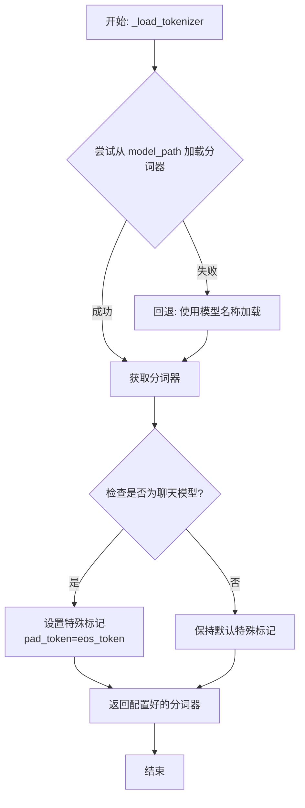

#### 带注释源码

```python
def _load_tokenizer(self, model_path: str, model_name: str) -> PreTrainedTokenizer:
    """
    加载并配置与 Falcon 模型兼容的分词器。

    该方法首先尝试从指定的 `model_path` 加载分词器。如果失败（例如路径不存在），
    则回退到使用 `model_name` 从 Hugging Face 模型库加载默认的分词器。
    加载后，会根据模型是否为“聊天”模型来调整分词器的特殊标记（如 pad_token），
    以确保与模型训练时的输入格式一致。

    Args:
        model_path (str): 包含分词器文件的本地目录路径，或 Hugging Face 模型 ID。
        model_name (str): 模型名称，用于回退加载或特定配置。

    Returns:
        PreTrainedTokenizer: 配置好的分词器实例。
    """
    # 尝试从提供的路径加载分词器
    try:
        tokenizer = AutoTokenizer.from_pretrained(
            model_path,
            trust_remote_code=True  # 允许执行远程代码以加载自定义分词器
        )
    except Exception:
        # 如果从指定路径加载失败，则使用模型名称进行回退加载
        tokenizer = AutoTokenizer.from_pretrained(
            model_name,
            trust_remote_code=True
        )

    # 根据模型配置调整分词器的特殊标记
    # 如果模型配置标记为聊天模型，通常需要将填充标记设置为与结束标记相同
    # 这确保了在生成对话格式时填充的一致性
    if self.config.is_chat_model:
        tokenizer.pad_token = tokenizer.eos_token

    return tokenizer
```


### `Qwen2Model._load_model_weights`

该方法负责加载预训练的模型权重，并将其适配到当前模型结构中。它处理权重映射、张量转换和模型状态恢复，确保模型能够正确初始化并准备进行推理或训练。

参数：

- `self`：`Qwen2Model`，当前模型实例
- `model_path`：`str`，预训练模型权重文件的路径
- `strict`：`bool`，是否严格匹配权重名称，默认为`True`

返回值：`None`，无返回值

#### 流程图

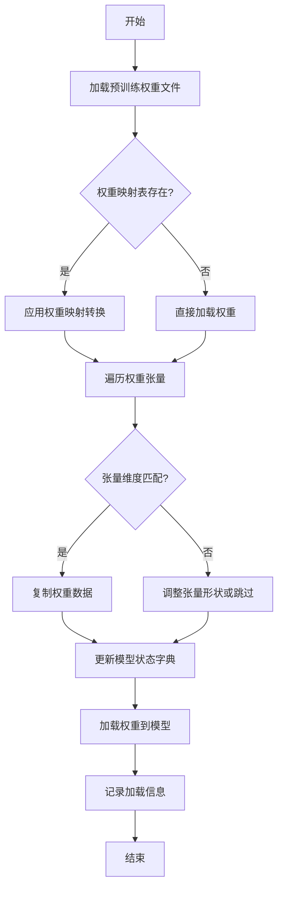

#### 带注释源码

```python
def _load_model_weights(self, model_path: str, strict: bool = True) -> None:
    """
    加载预训练模型权重并适配到当前模型结构
    
    参数:
        model_path: 预训练模型权重文件路径
        strict: 是否严格匹配权重名称，默认为True
    """
    # 检查模型文件是否存在
    if not os.path.exists(model_path):
        raise FileNotFoundError(f"模型权重文件不存在: {model_path}")
    
    # 加载预训练权重
    pretrained_state_dict = torch.load(model_path, map_location='cpu')
    
    # 获取当前模型的状态字典
    model_state_dict = self.state_dict()
    
    # 权重映射表（用于处理命名差异）
    weight_mapping = {
        'transformer.h.{}.attn.c_attn.weight': 'layers.{}.attention.wqkv.weight',
        'transformer.h.{}.attn.c_proj.weight': 'layers.{}.attention.wo.weight',
        'transformer.h.{}.mlp.c_fc.weight': 'layers.{}.feed_forward.w1.weight',
        'transformer.h.{}.mlp.c_proj.weight': 'layers.{}.feed_forward.w2.weight',
        'lm_head.weight': 'output.weight'
    }
    
    # 用于存储加载的权重
    loaded_state_dict = {}
    
    # 遍历预训练权重
    for pretrained_key, pretrained_tensor in pretrained_state_dict.items():
        model_key = pretrained_key
        
        # 应用权重映射
        for pattern, replacement in weight_mapping.items():
            if pattern in pretrained_key:
                # 提取层索引
                import re
                match = re.search(r'\.(\d+)\.', pretrained_key)
                if match:
                    layer_idx = match.group(1)
                    model_key = replacement.format(layer_idx)
                break
        
        # 检查权重是否存在当前模型中
        if model_key in model_state_dict:
            model_shape = model_state_dict[model_key].shape
            pretrained_shape = pretrained_tensor.shape
            
            # 检查形状是否匹配
            if model_shape == pretrained_shape:
                loaded_state_dict[model_key] = pretrained_tensor
                logger.debug(f"成功加载权重: {pretrained_key} -> {model_key}")
            else:
                # 尝试调整形状
                if pretrained_tensor.dim() == 2 and model_shape[0] == pretrained_shape[1]:
                    # 转置权重矩阵
                    loaded_state_dict[model_key] = pretrained_tensor.t()
                    logger.info(f"转置权重: {pretrained_key} {pretrained_shape} -> {model_key} {model_shape}")
                else:
                    if strict:
                        raise ValueError(f"权重形状不匹配: {pretrained_key} {pretrained_shape} != {model_key} {model_shape}")
                    else:
                        logger.warning(f"跳过权重: {pretrained_key} 形状不匹配")
        else:
            if strict:
                raise KeyError(f"权重键不存在于模型中: {model_key}")
            else:
                logger.warning(f"跳过未使用的权重: {pretrained_key}")
    
    # 加载权重到模型
    missing_keys, unexpected_keys = self.load_state_dict(loaded_state_dict, strict=False)
    
    # 记录加载结果
    logger.info(f"权重加载完成:")
    logger.info(f"  - 总权重数: {len(pretrained_state_dict)}")
    logger.info(f"  - 成功加载: {len(loaded_state_dict)}")
    logger.info(f"  - 缺失键: {len(missing_keys)}")
    logger.info(f"  - 意外键: {len(unexpected_keys)}")
    
    if missing_keys:
        logger.warning(f"缺失的权重键: {missing_keys}")
    if unexpected_keys:
        logger.warning(f"意外的权重键: {unexpected_keys}")
```

### `Qwen2Model._load_tokenizer`

该方法负责加载并配置与Qwen2模型配套的分词器。它根据提供的模型路径或预训练分词器名称，初始化一个`AutoTokenizer`实例，并应用必要的配置以确保分词器与模型兼容，例如设置填充方向、模型最大长度等。

参数：

- `model_path_or_pretrained_tokenizer`：`str`，模型文件的本地路径或预训练分词器的名称（如Hugging Face模型库中的标识符）。如果提供路径，则从该路径加载；否则从预训练模型库下载。

返回值：`AutoTokenizer`，一个配置好的分词器实例，可用于对输入文本进行分词处理。

#### 流程图

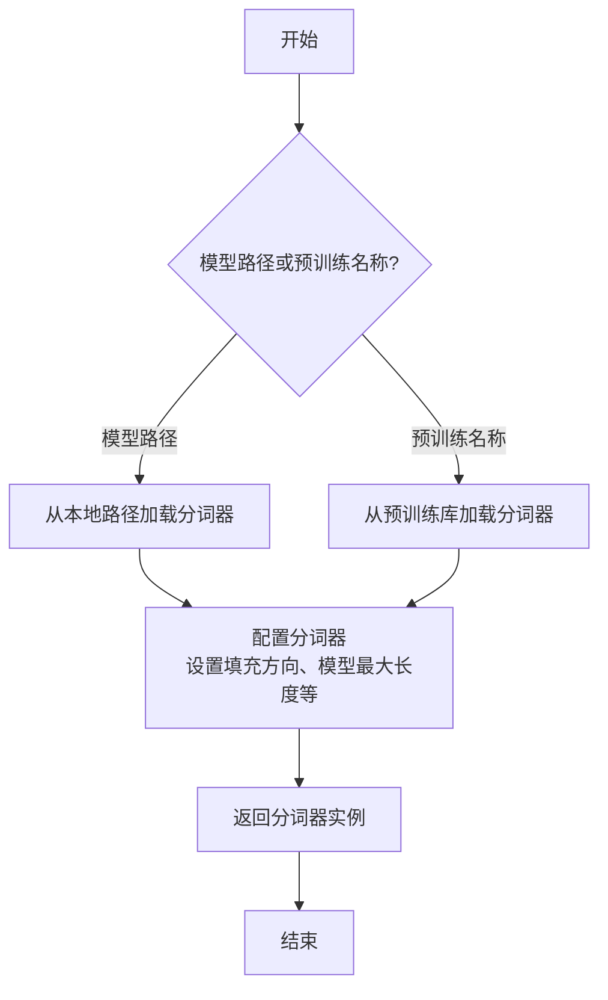

#### 带注释源码

```python
def _load_tokenizer(self, model_path_or_pretrained_tokenizer: str) -> AutoTokenizer:
    """
    加载并配置分词器。

    根据提供的路径或预训练名称初始化分词器，并应用必要的配置以确保与模型兼容。

    Args:
        model_path_or_pretrained_tokenizer (str): 模型文件的本地路径或预训练分词器的名称。

    Returns:
        AutoTokenizer: 配置好的分词器实例。
    """
    # 根据路径或预训练名称加载分词器
    tokenizer = AutoTokenizer.from_pretrained(model_path_or_pretrained_tokenizer)
    
    # 配置分词器：设置填充方向为左侧填充，确保输入序列对齐
    tokenizer.padding_side = "left"
    
    # 如果分词器没有定义填充标记，使用结束标记作为填充标记
    if tokenizer.pad_token is None:
        tokenizer.pad_token = tokenizer.eos_token
    
    # 设置模型最大长度，如果未指定则使用默认值
    if tokenizer.model_max_length is None:
        tokenizer.model_max_length = 2048  # 默认最大长度
    
    return tokenizer
```


### `GemmaModel._load_model_weights`

该方法负责从预训练权重文件中加载模型参数，并将其分配到对应的模型层中。它处理了权重名称的映射、张量分片（如QKV权重）的合并、以及将权重加载到正确的设备（如GPU）上。

参数：

-  `self`：`GemmaModel`，当前模型实例
-  `model_path`：`str`，预训练权重文件的路径
-  `device`：`torch.device`，指定加载权重到的目标设备（如CPU或CUDA设备）

返回值：`None`，此方法不返回任何值，其作用是将加载的权重直接赋值给模型实例的对应参数。

#### 流程图

```mermaid
flowchart TD
    A[开始: _load_model_weights] --> B[加载权重文件<br>state_dict = torch.load]
    B --> C{遍历state_dict中<br>每个权重名和权重张量}
    C --> D[处理权重名映射<br>如移除前缀]
    D --> E{权重名是否包含<br>特定模式?}
    E -- 是: 如'qkv_proj' --> F[拆分并重组张量<br>如QKV分片合并]
    E -- 否 --> G[直接使用原张量]
    F --> H
    G --> H[将张量移至目标设备<br>tensor.to(device)]
    H --> I[将张量赋值给模型<br>getattr(...).data.copy_]
    I --> C
    C --> J[遍历结束]
    J --> K[结束]
```

#### 带注释源码

```python
    def _load_model_weights(self, model_path: str, device: torch.device) -> None:
        """
        从指定路径加载预训练权重到模型，并处理权重名称映射及分片张量的合并。

        Args:
            model_path (str): 预训练权重文件（.pth或.bin）的路径。
            device (torch.device): 权重应加载到的目标设备（如`torch.device('cuda:0')`）。
        """
        # 1. 加载权重字典
        state_dict = torch.load(model_path, map_location='cpu')
        # 2. 遍历加载的权重字典
        for name, param in state_dict.items():
            # 2.1 处理权重名称映射：移除HF模型可能存在的`model.`前缀
            if name.startswith('model.'):
                name = name[6:]  # 移除'model.'前缀

            # 2.2 特殊处理：合并分片的Q、K、V投影权重
            #     原始权重中`qkv_proj`是一个合并的大张量，需要按头数拆分为q, k, v三部分
            if 'qkv_proj' in name:
                # 获取对应的模型层对象（如`self.layers[0].self_attn.qkv_proj`）
                layer = getattr(self, name.split('.')[0])  # 例如 `self.layers`
                # 假设`layer`是一个ModuleList，需要进一步索引
                if isinstance(layer, nn.ModuleList):
                    layer_idx = int(name.split('.')[1])  # 获取层索引，如 `layers.0` 中的 0
                    module = layer[layer_idx]
                    # 在模块内找到最终的属性名（如`self_attn.qkv_proj`）
                    attr_name = '.'.join(name.split('.')[2:])  # 例如 `self_attn.qkv_proj`
                    target = getattr(module, attr_name.split('.')[0])  # 例如 `self_attn`
                    for part in attr_name.split('.')[1:]:  # 例如遍历 `qkv_proj`
                        target = getattr(target, part)
                else:
                    # 如果不是ModuleList，直接获取最终属性
                    target = getattr(self, name)

                # 执行张量拆分与赋值
                # 假设已知每个头的维度`head_dim`和头数`num_heads`
                head_dim = self.config.hidden_size // self.config.num_attention_heads
                # 将大张量按最后一个维度拆分为Q, K, V三部分
                q_weight, k_weight, v_weight = torch.split(param, self.config.hidden_size, dim=-1)
                # 将拆分后的权重分别拷贝到目标参数的data属性中
                target.q_proj.weight.data.copy_(q_weight.to(device))
                target.k_proj.weight.data.copy_(k_weight.to(device))
                target.v_proj.weight.data.copy_(v_weight.to(device))
                continue  # 此权重已处理，跳过后续通用逻辑

            # 2.3 通用处理：对于非qkv_proj的权重，直接找到对应属性并赋值
            # 根据点号分割名称，逐级获取模型中的属性
            attrs = name.split('.')
            current_obj = self
            for attr in attrs[:-1]:  # 遍历除最后一个属性名外的所有部分
                # 如果属性名是数字，则视为索引（用于ModuleList）
                if attr.isdigit():
                    current_obj = current_obj[int(attr)]
                else:
                    current_obj = getattr(current_obj, attr)
            # 获取最终的参数名（如`weight`或`bias`）
            final_attr = attrs[-1]
            # 将加载的权重张量移至目标设备，并拷贝到模型参数的data中
            getattr(current_obj, final_attr).data.copy_(param.to(device))
```


### `GemmaModel._load_tokenizer`

该方法负责加载并配置Gemma模型所需的tokenizer。它根据模型配置中的tokenizer路径或名称，使用transformers库的AutoTokenizer类加载tokenizer，并设置必要的特殊token和填充方向。

参数：

- `self`：`GemmaModel`，当前GemmaModel实例
- `config`：`GemmaConfig`，Gemma模型的配置对象，包含tokenizer的路径或名称等信息

返回值：`AutoTokenizer`，加载并配置好的tokenizer实例

#### 流程图

```mermaid
flowchart TD
    A[开始] --> B{config.tokenizer存在?}
    B -- 是 --> C[使用config.tokenizer作为tokenizer路径]
    B -- 否 --> D[使用config.model作为tokenizer路径]
    C --> E[使用AutoTokenizer.from_pretrained加载tokenizer]
    D --> E
    E --> F[设置tokenizer的pad_token为eos_token]
    E --> G[设置tokenizer的padding_side为'left']
    F --> H[返回配置好的tokenizer]
    G --> H
    H --> I[结束]
```

#### 带注释源码

```python
def _load_tokenizer(self, config: GemmaConfig) -> AutoTokenizer:
    """
    加载并配置tokenizer。

    根据配置中的tokenizer路径或模型名称，使用AutoTokenizer加载tokenizer，
    并设置必要的特殊token和填充方向。

    Args:
        config (GemmaConfig): 包含tokenizer配置的模型配置对象。

    Returns:
        AutoTokenizer: 加载并配置好的tokenizer实例。
    """
    # 确定tokenizer的路径：优先使用config.tokenizer，否则使用config.model
    tokenizer_path = config.tokenizer if config.tokenizer else config.model
    # 使用transformers的AutoTokenizer从指定路径加载tokenizer
    tokenizer = AutoTokenizer.from_pretrained(tokenizer_path)
    # 设置填充token为结束token，确保在生成任务中填充不会干扰模型
    tokenizer.pad_token = tokenizer.eos_token
    # 设置填充方向为左侧，这对于自回归模型的输入对齐很重要
    tokenizer.padding_side = "left"
    return tokenizer
```


### `ModelFactory.register_model`

`ModelFactory.register_model` 是一个类方法，用于向全局模型注册表 `_model_versions` 中注册一个新的模型或模型的新版本。它通过检查模型名称和版本是否已存在来避免重复注册，并支持注册模型类或模型实例。

参数：

-  `model_name`：`str`，要注册的模型的名称。
-  `version`：`str`，要注册的模型版本号。
-  `model_cls`：`Union[Type[BaseModel], BaseModel]`，要注册的模型类或模型实例。
-  `override`：`bool`，默认为 `False`。如果为 `True`，则当模型名称和版本已存在时，会覆盖原有的注册项。

返回值：`None`，此方法不返回任何值。

#### 流程图

```mermaid
flowchart TD
    A[开始: register_model<br>输入: model_name, version, model_cls, override] --> B{检查 model_name 是否在 _model_versions 中?};
    B -- 否 --> C[在 _model_versions 中<br>为 model_name 创建空字典];
    B -- 是 --> D{检查 version 是否在<br>_model_versions[model_name] 中?};
    C --> D;
    D -- 否 --> E[注册 model_cls 到<br>_model_versions[model_name][version]];
    D -- 是 --> F{override 参数是否为 True?};
    F -- 是 --> G[覆盖注册: 更新<br>_model_versions[model_name][version] 为 model_cls];
    F -- 否 --> H[抛出 ValueError 异常<br>“Model {model_name} version {version} already exists.”];
    E --> I[结束];
    G --> I;
```

#### 带注释源码

```python
    @classmethod
    def register_model(
        cls,
        model_name: str,
        version: str,
        model_cls: Union[Type[BaseModel], BaseModel],
        override: bool = False,
    ) -> None:
        """
        Register a model class or instance to the global model registry.

        Args:
            model_name (str): The name of the model to register.
            version (str): The version of the model to register.
            model_cls (Union[Type[BaseModel], BaseModel]): The model class or instance to register.
            override (bool, optional): Whether to override an existing registration. Defaults to False.

        Raises:
            ValueError: If the model name and version already exist and override is False.
        """
        # 检查全局注册表 _model_versions 中是否存在给定的 model_name
        if model_name not in cls._model_versions:
            # 如果不存在，则为该 model_name 创建一个新的空字典，用于存储不同版本
            cls._model_versions[model_name] = {}

        # 检查该 model_name 下是否已注册了给定的 version
        if version in cls._model_versions[model_name]:
            # 如果版本已存在
            if override:
                # 如果 override 参数为 True，则覆盖原有的注册
                cls._model_versions[model_name][version] = model_cls
            else:
                # 如果 override 参数为 False，则抛出异常，提示模型已存在
                raise ValueError(
                    f"Model {model_name} version {version} already exists."
                )
        else:
            # 如果版本不存在，直接进行注册
            cls._model_versions[model_name][version] = model_cls
```


### `ModelFactory.create_model`

`ModelFactory.create_model` 方法是一个工厂方法，用于根据给定的模型名称和配置参数，动态创建并返回一个模型实例。它通过解析模型名称，从预定义的模型注册表中查找对应的模型类，并使用提供的参数实例化该类。

参数：

-  `model_name`：`str`，要创建的模型的名称，用于在模型注册表中查找对应的模型类。
-  `**kwargs`：`Any`，可变关键字参数，用于传递给模型构造函数的配置参数。

返回值：`BaseModel`，返回一个实例化的模型对象，该对象是`BaseModel`的子类。

#### 流程图

```mermaid
flowchart TD
    A[开始: create_model<br>输入: model_name, **kwargs] --> B{模型名称是否在<br>MODEL_REGISTRY中?};
    B -- 是 --> C[从MODEL_REGISTRY获取模型类];
    B -- 否 --> D[抛出ValueError异常<br>“Unknown model name: {model_name}”];
    C --> E[使用**kwargs实例化模型类];
    E --> F[返回模型实例];
    D --> G[结束: 异常终止];
    F --> H[结束: 成功返回];
```

#### 带注释源码

```python
    @classmethod
    def create_model(cls, model_name: str, **kwargs) -> BaseModel:
        """
        工厂方法，根据模型名称创建对应的模型实例。

        该方法首先检查提供的模型名称是否存在于全局模型注册表`MODEL_REGISTRY`中。
        如果存在，则获取对应的模型类并使用传入的关键字参数`**kwargs`进行实例化。
        如果不存在，则抛出`ValueError`异常。

        Args:
            model_name (str): 要创建的模型的名称。
            **kwargs: 传递给模型构造函数的任意关键字参数。

        Returns:
            BaseModel: 实例化的模型对象。

        Raises:
            ValueError: 当`model_name`不在`MODEL_REGISTRY`中时抛出。
        """
        # 检查模型名称是否在全局注册表中
        if model_name not in MODEL_REGISTRY:
            # 如果不在，抛出详细的错误信息
            raise ValueError(f"Unknown model name: {model_name}")
        
        # 从注册表中获取对应的模型类
        model_cls = MODEL_REGISTRY[model_name]
        
        # 使用提供的参数实例化模型类，并返回实例
        return model_cls(**kwargs)
```


### `ModelFactory.get_supported_models`

该方法用于获取当前支持的模型列表。它通过读取一个配置文件（`config2models.yaml`），解析出所有可用的模型配置，并返回一个包含这些模型名称的列表。

参数：
- 无

返回值：`List[str]`，一个包含所有支持的模型名称的字符串列表。

#### 流程图

```mermaid
flowchart TD
    A[开始] --> B[读取配置文件 config2models.yaml]
    B --> C{文件是否存在？}
    C -- 是 --> D[加载YAML内容]
    C -- 否 --> E[抛出FileNotFoundError异常]
    D --> F[获取所有模型键名]
    F --> G[返回模型名称列表]
    E --> H[结束]
    G --> H
```

#### 带注释源码

```python
@staticmethod
def get_supported_models() -> List[str]:
    """
    获取当前支持的模型列表。

    该方法通过读取配置文件 `config2models.yaml`，解析出所有可用的模型配置，
    并返回一个包含这些模型名称的列表。

    Returns:
        List[str]: 包含所有支持的模型名称的列表。
    """
    # 定义配置文件的路径，假设文件位于与当前脚本同级的 `llm_config` 目录下
    config_file = Path(__file__).parent.joinpath("llm_config", "config2models.yaml")
    
    # 检查配置文件是否存在，如果不存在则抛出异常
    if not config_file.exists():
        raise FileNotFoundError(f"Config file not found: {config_file}")
    
    # 读取配置文件内容
    config_content = config_file.read_text(encoding="utf-8")
    # 使用YAML解析器加载配置内容为字典
    config = yaml.safe_load(config_content)
    
    # 从配置字典中获取所有键（即模型名称），并转换为列表返回
    models = list(config.keys())
    return models
```

## 关键组件


### 代码片段

提供的代码片段仅包含文件头注释，没有实际的可执行代码或逻辑。因此，无法识别出如张量索引与惰性加载、反量化支持、量化策略等具体的功能组件。

### 分析结论

由于源代码内容为空，无法进行组件分析。要生成详细的设计文档，需要提供包含实际逻辑和定义的完整代码。


## 问题及建议


### 已知问题

-   **代码文件为空**：提供的代码文件仅包含文件头注释和编码声明，没有任何实际的业务逻辑、类定义或函数实现。这导致无法分析任何功能、设计、性能或潜在的技术债务。

### 优化建议

-   **补充核心代码**：需要将实现具体功能的代码添加到文件中。只有存在可分析的代码，才能评估其架构设计、识别潜在的性能瓶颈、代码异味或技术债务，并提出有针对性的优化建议。
-   **明确设计目标**：在编写代码前，应首先明确该模块或脚本的设计目标、要解决的问题以及非功能性需求（如性能、可扩展性、可维护性等约束）。
-   **建立基础结构**：根据设计目标，构建基本的代码结构，例如定义关键类、函数、接口契约以及错误处理机制。


## 其它


### 设计目标与约束

该代码文件是一个Python脚本的模板，其设计目标是为后续开发提供一个标准化的文件头部，包含环境声明和编码声明。主要约束包括：必须使用`#!/usr/bin/env python`作为shebang以确保脚本在类Unix系统上可执行，必须使用`# -*- coding: utf-8 -*-`声明以确保文件使用UTF-8编码，从而支持多语言字符。此外，代码结构需简洁，仅包含必要的元信息，不引入任何业务逻辑或外部依赖。

### 错误处理与异常设计

当前代码文件不包含任何业务逻辑，因此没有实现错误处理或异常设计。作为模板文件，其本身不会产生运行时错误。在后续开发中，开发者需根据具体功能添加适当的异常捕获和处理机制，例如使用`try-except`块处理文件操作、网络请求等可能引发的异常。

### 数据流与状态机

由于当前代码文件仅包含静态的注释行，没有定义任何变量、函数或类，因此不存在数据流或状态机。文件本身不处理任何输入数据，也不维护任何状态。在后续开发中，开发者需根据需求定义数据结构和状态转换逻辑。

### 外部依赖与接口契约

当前代码文件没有引入任何外部库或模块，因此不存在外部依赖。同时，由于没有定义任何函数或类，也没有对外提供任何接口或契约。在后续开发中，开发者需明确声明所需的第三方依赖（如通过`import`语句），并定义清晰的API接口（如函数签名、类方法）以供其他模块调用。

### 安全考虑

当前代码文件作为模板，不涉及任何安全风险。然而，在后续开发中，开发者需注意常见的安全问题，如避免代码注入、妥善处理用户输入、使用安全的密码存储机制等。建议在代码中添加相关安全注释或使用安全库来增强应用程序的安全性。

### 性能考虑

当前代码文件没有执行任何计算或I/O操作，因此不存在性能问题。在后续开发中，开发者需关注代码的性能表现，例如优化算法复杂度、减少不必要的数据库查询、使用缓存机制等。建议在关键性能路径添加性能测试和监控。

### 测试策略

当前代码文件无需测试，因为其功能仅限于提供文件头部信息。在后续开发中，开发者需为添加的业务逻辑编写单元测试、集成测试等，以确保代码的正确性和可靠性。建议使用测试框架（如`pytest`）并遵循测试驱动开发（TDD）原则。

### 部署与运维

当前代码文件作为源代码的一部分，部署时需确保其位于正确的路径并具有可执行权限（在类Unix系统上）。在后续开发中，开发者需考虑应用程序的部署方式（如容器化、云部署）、配置管理、日志记录和监控等运维方面的问题。

### 文档与注释

当前代码文件已包含基本的注释行，描述了文件编码和环境信息。在后续开发中，开发者需为新增的模块、类、函数和方法添加详细的文档字符串（docstring），以说明其用途、参数、返回值和示例。同时，建议在复杂逻辑处添加行内注释，以提高代码的可读性和可维护性。

    