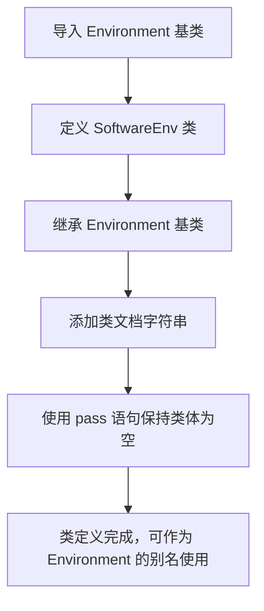

# `.\MetaGPT\metagpt\environment\software\software_env.py` 详细设计文档

该文件定义了一个名为 SoftwareEnv 的软件环境类，它继承自一个通用的基础环境类 Environment，主要用于在元编程框架中表示和管理软件相关的运行环境，目前仅作为 Environment 的一个特定别名，未添加额外功能。

## 整体流程



## 类结构

```
Environment (基础环境类，来自 metagpt.environment.base_env)
└── SoftwareEnv (软件环境类，作为 Environment 的特定别名)
```

## 全局变量及字段


    

## 全局函数及方法


## 关键组件


### SoftwareEnv

一个具体的环境别名，继承自基础环境类，用于表示软件环境。

### Environment

基础环境类，为软件环境提供通用的环境接口和基础功能。


## 问题及建议


### 已知问题

-   **功能空实现**：`SoftwareEnv` 类目前仅作为 `Environment` 基类的别名，未添加任何特定于软件环境的功能、状态或行为，导致其存在意义不明确。
-   **缺乏具体上下文**：作为“软件环境”的抽象，该类未定义任何与软件交互相关的接口（如执行命令、读取文件、检查状态等），无法在具体场景中直接使用。
-   **文档缺失**：类文档字符串过于简单（“a specific alias name”），未说明其设计目的、预期用途以及如何扩展，不利于后续开发和维护。

### 优化建议

-   **明确职责并实现核心接口**：应明确 `SoftwareEnv` 在项目中的角色（例如，是用于模拟IDE、命令行终端还是软件运行时环境？），并据此实现关键方法，如 `execute_command`, `get_file_content`, `check_process_status` 等。
-   **丰富状态与属性**：根据其定义的软件环境类型，添加必要的类字段来维护环境状态，例如当前工作目录、打开的文件列表、环境变量、运行的进程句柄等。
-   **完善文档与示例**：更新类文档字符串，详细说明其设计目标、使用场景以及如何实例化和交互。提供简单的使用示例代码将极大提升可用性。
-   **考虑扩展性与插件机制**：如果软件环境需要支持多种工具或平台（如Windows CMD vs. Linux Bash， VS Code vs. PyCharm），可考虑设计为基类，并通过插件或配置方式支持不同后端，而不是硬编码单一行为。
-   **添加单元测试**：一旦实现了具体功能，应为其编写单元测试，验证环境交互的各个接口是否按预期工作，确保代码质量。


## 其它


### 设计目标与约束

该代码的设计目标是创建一个名为 `SoftwareEnv` 的类，作为 `metagpt.environment.base_env.Environment` 类的具体实现或别名。其主要约束是保持极简设计，不添加任何新的功能或属性，仅通过继承来提供一个特定于“软件环境”的语义化类名，以满足项目中对环境类型进行更具体分类或标识的需求。这遵循了“约定优于配置”和通过继承实现多态的设计原则。

### 错误处理与异常设计

当前代码未定义任何显式的错误处理逻辑。所有的错误处理将完全依赖于其父类 `Environment` 的实现。如果 `Environment` 类中定义了相应的异常处理机制（例如，在初始化、状态更新或交互方法中抛出 `ValueError`, `RuntimeError` 等），那么 `SoftwareEnv` 的实例将继承这些行为。开发者在使用 `SoftwareEnv` 时，需要查阅 `Environment` 基类的文档以了解其可能抛出的异常及处理方式。目前代码本身没有引入新的异常风险。

### 数据流与状态机

由于 `SoftwareEnv` 类体为空（`pass`），其数据流和状态机完全由父类 `Environment` 定义和驱动。任何通过 `SoftwareEnv` 实例进行的数据输入、状态转换或输出，都将遵循 `Environment` 类中设定的流程。例如，如果 `Environment` 定义了 `step`, `reset` 等方法并维护内部状态，那么 `SoftwareEnv` 实例将拥有相同的状态属性和转换逻辑。本类自身不定义独立的数据流或状态。

### 外部依赖与接口契约

1.  **继承依赖**：`SoftwareEnv` 的核心外部依赖是其父类 `metagpt.environment.base_env.Environment`。它强依赖于该基类的接口（方法）和实现。对 `Environment` 的任何修改都可能直接影响 `SoftwareEnv` 的行为。
2.  **接口契约**：`SoftwareEnv` 的公共接口与其父类 `Environment` 的公共接口完全一致。它隐式地承诺提供 `Environment` 所定义的所有公共方法和属性。使用 `SoftwareEnv` 的代码可以将其视为一个 `Environment` 对象，并调用 `Environment` 中定义的任何方法。
3.  **模块导入**：代码依赖于通过 `from metagpt.environment.base_env import Environment` 成功导入 `Environment` 类。这要求 `metagpt` 包及其子模块必须存在于 Python 解释器的可访问路径中。

    