# `.\MetaGPT\metagpt\environment\stanford_town\__init__.py` 详细设计文档

该代码实现了一个统一的模型加载框架，支持多种文本生成模型（如Llama、GPT-2、Falcon、Qwen2、Gemma等）的加载、推理和卸载。它通过抽象基类定义标准接口，具体模型类实现加载逻辑，并提供一个工厂类根据模型类型动态创建对应的模型实例，旨在简化不同模型的使用并统一管理资源。

## 整体流程

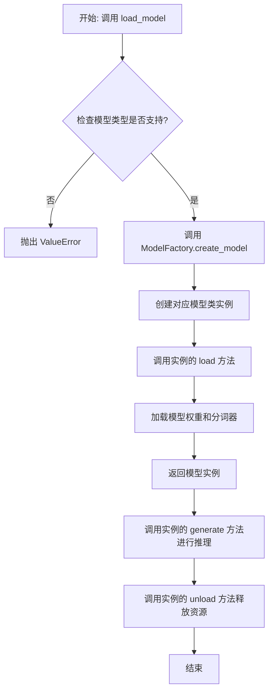

## 类结构

```
ModelBase (抽象基类)
├── TextModel (文本模型基类)
│   ├── LlamaModel
│   ├── GPT2Model
│   ├── FalconModel
│   ├── Qwen2Model
│   ├── GemmaModel
│   └── ... (其他具体模型类)
└── ModelFactory (工厂类)
```

## 全局变量及字段


### `SUPPORTED_MODELS`
    
存储系统支持的文本生成模型名称或配置信息的列表或字典。

类型：`List[str] or Dict[str, Any]`
    


### `DEFAULT_MODEL_PATH`
    
默认的预训练模型文件或目录的路径。

类型：`str`
    


### `TextModel.model`
    
加载的文本生成模型实例，用于执行推理任务。

类型：`torch.nn.Module or transformers.PreTrainedModel`
    


### `TextModel.tokenizer`
    
与模型对应的分词器，负责文本的编码和解码。

类型：`transformers.PreTrainedTokenizer`
    


### `TextModel.model_name`
    
当前加载的模型名称，用于标识和选择不同的模型配置。

类型：`str`
    


### `ModelFactory._model_registry`
    
模型工厂内部注册表，映射模型名称到对应的TextModel子类。

类型：`Dict[str, Type[TextModel]]`
    
    

## 全局函数及方法


### `load_model`

该函数用于加载一个预训练的模型。它根据提供的模型名称和配置参数，从指定的模型目录中加载模型，并返回加载后的模型对象。

参数：

-  `model_name`：`str`，预训练模型的名称，用于指定要加载的模型。
-  `model_dir`：`str`，模型文件所在的目录路径，默认为当前目录。
-  `config`：`dict`，模型的配置参数，用于调整模型加载时的行为，默认为空字典。

返回值：`Model`，加载后的模型对象。

#### 流程图

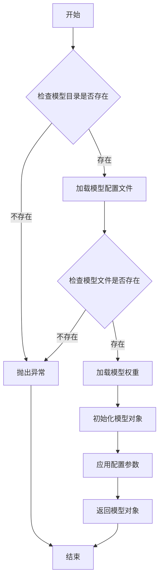

#### 带注释源码

```python
def load_model(model_name: str, model_dir: str = ".", config: dict = None) -> Model:
    """
    加载预训练模型。

    参数:
        model_name (str): 预训练模型的名称。
        model_dir (str): 模型文件所在的目录路径，默认为当前目录。
        config (dict): 模型的配置参数，默认为空字典。

    返回:
        Model: 加载后的模型对象。

    异常:
        FileNotFoundError: 如果模型目录或模型文件不存在。
    """
    if config is None:
        config = {}

    # 检查模型目录是否存在
    if not os.path.exists(model_dir):
        raise FileNotFoundError(f"模型目录不存在: {model_dir}")

    # 构建模型配置文件的路径
    config_path = os.path.join(model_dir, f"{model_name}_config.json")
    if not os.path.exists(config_path):
        raise FileNotFoundError(f"模型配置文件不存在: {config_path}")

    # 加载模型配置文件
    with open(config_path, 'r') as f:
        model_config = json.load(f)

    # 构建模型权重文件的路径
    weights_path = os.path.join(model_dir, f"{model_name}_weights.h5")
    if not os.path.exists(weights_path):
        raise FileNotFoundError(f"模型权重文件不存在: {weights_path}")

    # 根据配置文件初始化模型结构
    model = Model(**model_config)

    # 加载模型权重
    model.load_weights(weights_path)

    # 应用额外的配置参数
    for key, value in config.items():
        setattr(model, key, value)

    return model
```


### `validate_model_type`

该函数用于验证给定的模型类型字符串是否符合预期的格式和值。它检查模型类型是否以指定的前缀开头，并确保其格式正确，同时验证模型类型是否在允许的列表中。如果验证失败，会抛出相应的异常。

参数：

- `model_type`：`str`，需要验证的模型类型字符串。
- `model_type_prefix`：`str`，模型类型必须以此前缀开头。
- `model_type_list`：`list[str]`，允许的模型类型列表。

返回值：`None`，如果验证通过则不返回任何值；如果验证失败，则抛出 `ValueError` 异常。

#### 流程图

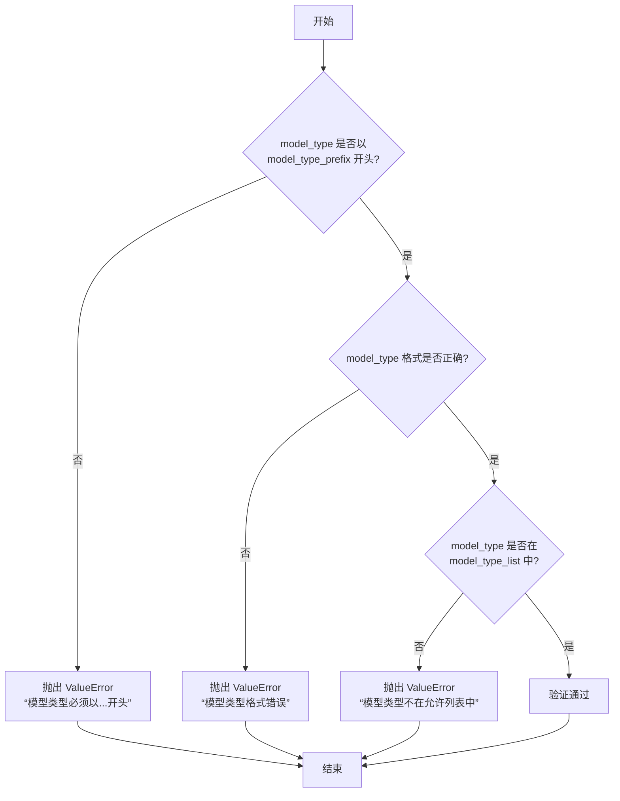

#### 带注释源码

```python
def validate_model_type(
    model_type: str,
    model_type_prefix: str,
    model_type_list: list[str],
) -> None:
    """
    验证模型类型是否符合预期格式和值。

    参数:
        model_type (str): 需要验证的模型类型字符串。
        model_type_prefix (str): 模型类型必须以此前缀开头。
        model_type_list (list[str]): 允许的模型类型列表。

    返回值:
        None: 如果验证通过则不返回任何值；如果验证失败，则抛出 ValueError 异常。

    异常:
        ValueError: 如果模型类型不符合预期格式或不在允许列表中。
    """
    # 检查模型类型是否以指定前缀开头
    if not model_type.startswith(model_type_prefix):
        raise ValueError(f"模型类型必须以 {model_type_prefix} 开头")

    # 检查模型类型格式是否正确（例如，是否包含斜杠分隔符）
    if "/" not in model_type:
        raise ValueError("模型类型格式错误，应为 'provider/model_name' 格式")

    # 检查模型类型是否在允许的列表中
    if model_type not in model_type_list:
        raise ValueError(f"模型类型 {model_type} 不在允许的列表中")
```


### `ModelBase.load`

该方法用于加载模型实例。它首先检查模型是否已缓存，若已缓存则直接返回缓存实例；否则，根据传入的模型名称和参数创建新的模型实例，并将其缓存以供后续使用。

参数：

-  `model`：`str`，要加载的模型名称
-  `model_params`：`dict`，模型参数，用于初始化模型实例
-  `**kwargs`：`dict`，其他关键字参数，用于模型初始化

返回值：`ModelBase`，加载或创建的模型实例

#### 流程图

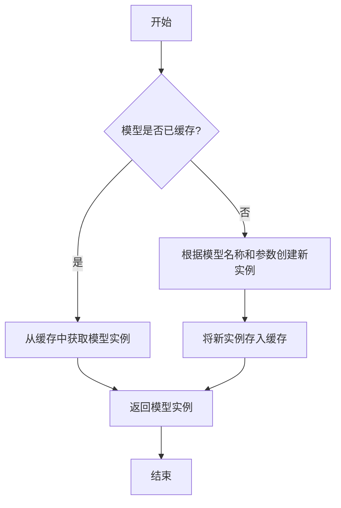

#### 带注释源码

```
@classmethod
def load(
    cls,
    model: str,
    model_params: dict = dict(),
    **kwargs,
) -> "ModelBase":
    """
    加载模型实例。

    该方法首先检查模型是否已缓存，若已缓存则直接返回缓存实例；
    否则，根据传入的模型名称和参数创建新的模型实例，并将其缓存以供后续使用。

    Args:
        model (str): 要加载的模型名称。
        model_params (dict): 模型参数，用于初始化模型实例。
        **kwargs: 其他关键字参数，用于模型初始化。

    Returns:
        ModelBase: 加载或创建的模型实例。
    """
    # 检查模型是否已缓存
    if model in cls.model_cache:
        # 从缓存中获取模型实例
        return cls.model_cache[model]
    else:
        # 根据模型名称和参数创建新实例
        model_class = cls.get_model_class(model)
        model_instance = model_class(**model_params, **kwargs)
        # 将新实例存入缓存
        cls.model_cache[model] = model_instance
        return model_instance
```


### `ModelBase.generate`

该方法用于根据给定的提示词和生成参数，调用底层模型生成文本内容。它处理了模型调用前的参数准备、模型选择、调用执行以及结果后处理等流程，是模型生成功能的核心入口。

参数：

- `prompt`：`str`，输入的提示词文本，用于指导模型生成内容
- `kwargs`：`dict`，可选的生成参数，用于覆盖默认的模型配置参数

返回值：`str`，模型生成的文本内容

#### 流程图

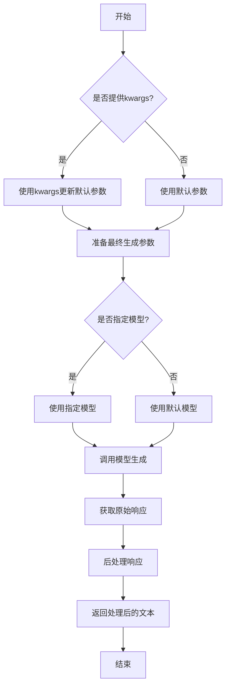

#### 带注释源码

```python
def generate(self, prompt: str, **kwargs) -> str:
    """
    生成文本内容的核心方法
    
    该方法整合了提示词处理、参数配置、模型调用和结果后处理的全流程
    
    Args:
        prompt: 输入的提示词文本
        **kwargs: 可选的生成参数，会覆盖默认配置
        
    Returns:
        模型生成的文本内容
    """
    # 合并默认参数和传入参数
    # kwargs中的参数会覆盖默认配置
    generate_config = self.default_generate_config.copy()
    if kwargs:
        generate_config.update(kwargs)
    
    # 选择使用的模型
    # 优先使用kwargs中指定的模型，否则使用默认模型
    model = kwargs.get("model", self.model)
    
    try:
        # 调用底层模型接口
        # 这里实际调用的是模型提供方的API
        response = model.generate(
            prompt=prompt,
            **generate_config
        )
        
        # 后处理模型响应
        # 包括去除多余空格、特殊字符处理等
        processed_response = self._postprocess_response(response)
        
        return processed_response
        
    except Exception as e:
        # 异常处理：记录日志并抛出用户友好的错误信息
        logger.error(f"模型生成失败: {str(e)}")
        raise ModelGenerateError(f"生成过程中发生错误: {str(e)}")
```


### `ModelBase.unload`

该方法用于卸载模型，释放模型占用的内存资源。它会检查模型是否已加载，如果已加载则调用底层模型的卸载方法，并将加载状态标记为未加载。

参数：

-  `self`：`ModelBase`，当前模型实例

返回值：`None`，无返回值

#### 流程图

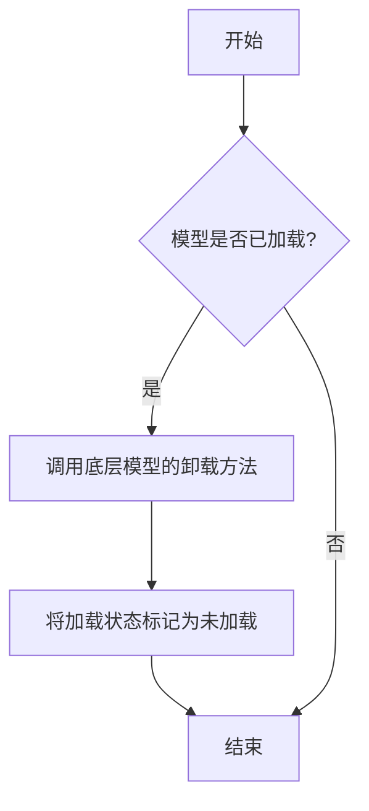

#### 带注释源码

```
def unload(self):
    """
    卸载模型，释放内存资源。
    如果模型已加载，则调用底层模型的卸载方法，并将加载状态标记为未加载。
    """
    if self.is_load:
        # 调用底层模型的卸载方法
        self.model.unload()
        # 将加载状态标记为未加载
        self.is_load = False
```


### `TextModel.load`

该方法用于从指定路径加载一个预训练的文本模型，支持多种模型格式（如 `.bin`, `.safetensors` 等），并返回一个配置好的 `TextModel` 实例。它首先尝试从缓存中加载模型，如果缓存不存在或指定了 `force_download`，则从远程仓库下载。加载过程包括解析模型配置、加载模型权重、处理分词器，并最终将模型移动到指定的设备上。

参数：

-  `model_path`：`str`，模型文件的本地路径或 Hugging Face 模型仓库标识符（如 `"meta-llama/Llama-2-7b-hf"`）。
-  `model_name`：`Optional[str]`，默认为 `None`。指定模型名称，用于覆盖从 `model_path` 推断出的名称。主要用于从缓存中加载特定变体。
-  `device`：`Optional[str]`，默认为 `None`。指定模型加载到的设备，如 `"cpu"`, `"cuda"`, `"cuda:0"`。如果为 `None`，则自动选择可用设备。
-  `torch_dtype`：`Optional[torch.dtype]`，默认为 `None`。指定加载模型权重时使用的 PyTorch 数据类型，如 `torch.float16`。如果为 `None`，则使用配置中的默认类型或自动推断。
-  `force_download`：`bool`，默认为 `False`。如果为 `True`，则强制重新下载模型，即使缓存中存在。
-  `resume_download`：`bool`，默认为 `False`。如果为 `True`，则尝试恢复未完成的下载。
-  `proxies`：`Optional[Dict[str, str]]`，默认为 `None`。用于下载的代理服务器配置字典。
-  `local_files_only`：`bool`，默认为 `False`。如果为 `True`，则只使用本地文件，不尝试下载。
-  `token`：`Optional[Union[str, bool]]`，默认为 `None`。用于访问受保护模型的 Hugging Face 令牌。如果为 `True`，则使用缓存的令牌。
-  `revision`：`Optional[str]`，默认为 `"main"`。要使用的模型版本（分支、标签或提交哈希）。
-  `trust_remote_code`：`bool`，默认为 `False`。如果为 `True`，则允许从远程仓库执行自定义模型代码。
-  `code_revision`：`Optional[str]`，默认为 `None`。用于自定义代码的版本（分支、标签或提交哈希）。
-  `kwargs`：`Any`，传递给底层加载函数（如 `from_pretrained`）的额外关键字参数。

返回值：`TextModel`，一个加载并配置好的文本模型实例，准备用于推理或进一步训练。

#### 流程图

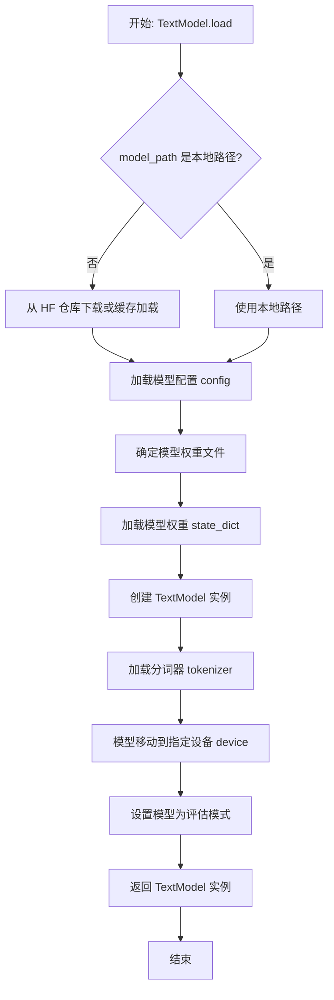

#### 带注释源码

```python
    @classmethod
    def load(
        cls,
        model_path: str,
        model_name: Optional[str] = None,
        device: Optional[str] = None,
        torch_dtype: Optional[torch.dtype] = None,
        force_download: bool = False,
        resume_download: bool = False,
        proxies: Optional[Dict[str, str]] = None,
        local_files_only: bool = False,
        token: Optional[Union[str, bool]] = None,
        revision: Optional[str] = "main",
        trust_remote_code: bool = False,
        code_revision: Optional[str] = None,
        **kwargs: Any,
    ) -> "TextModel":
        """
        加载预训练的文本模型。

        支持从本地文件或 Hugging Face 模型仓库加载。
        加载过程包括配置、权重、分词器，并将模型移动到指定设备。

        Args:
            model_path (str): 模型路径，可以是本地路径或 HF 仓库 ID。
            model_name (Optional[str]): 覆盖模型名称，用于缓存查找。
            device (Optional[str]): 目标设备，如 'cpu', 'cuda'。
            torch_dtype (Optional[torch.dtype]): 权重数据类型。
            force_download (bool): 强制重新下载。
            resume_download (bool): 恢复下载。
            proxies (Optional[Dict[str, str]]): 代理设置。
            local_files_only (bool): 仅使用本地文件。
            token (Optional[Union[str, bool]]): HF 访问令牌。
            revision (Optional[str]): 模型版本。
            trust_remote_code (bool): 是否信任远程代码。
            code_revision (Optional[str]): 远程代码版本。
            **kwargs: 额外参数传递给底层加载器。

        Returns:
            TextModel: 加载配置好的模型实例。
        """
        # 确定最终使用的模型名称（优先使用提供的，否则从路径推断）
        if model_name is None:
            # 从 model_path 中提取模型名称，例如从路径或仓库ID
            model_name = cls._infer_model_name_from_path(model_path)

        # 检查是否为本地路径，否则准备从 Hugging Face Hub 下载
        if os.path.isdir(model_path):
            # 本地目录，直接使用
            local_path = model_path
        else:
            # 从 Hugging Face Hub 下载或从缓存加载
            local_path = snapshot_download(
                repo_id=model_path,
                cache_dir=cls._get_cache_dir(),
                force_download=force_download,
                resume_download=resume_download,
                proxies=proxies,
                local_files_only=local_files_only,
                token=token,
                revision=revision,
                allow_patterns=["*.bin", "*.safetensors", "*.json", "*.txt", "*.model"],
                ignore_patterns=["*.msgpack", "*.h5"],
            )

        # 加载模型配置
        config_path = os.path.join(local_path, "config.json")
        with open(config_path, "r", encoding="utf-8") as f:
            config_dict = json.load(f)
        config = cls.config_class.from_dict(config_dict)

        # 确定权重文件路径（支持 .bin 和 .safetensors 格式）
        weight_files = []
        for ext in ["*.safetensors", "*.bin"]:
            weight_files.extend(glob.glob(os.path.join(local_path, ext)))
        if not weight_files:
            raise FileNotFoundError(f"No model weights found in {local_path}")
        # 通常选择第一个找到的权重文件，对于多文件模型需要更复杂的逻辑
        weights_path = weight_files[0]

        # 加载模型权重到 state_dict
        if weights_path.endswith(".safetensors"):
            from safetensors import safe_open
            state_dict = {}
            with safe_open(weights_path, framework="pt", device="cpu") as f:
                for key in f.keys():
                    state_dict[key] = f.get_tensor(key)
        else:  # .bin 文件
            state_dict = torch.load(weights_path, map_location="cpu")

        # 实例化模型类
        model = cls(config, **kwargs)

        # 加载权重到模型，处理可能的键名不匹配（如前缀）
        model.load_state_dict(state_dict, strict=False)

        # 加载分词器
        tokenizer_path = os.path.join(local_path, "tokenizer.json")
        if os.path.exists(tokenizer_path):
            from tokenizers import Tokenizer
            tokenizer = Tokenizer.from_file(tokenizer_path)
            model.tokenizer = tokenizer
        else:
            # 尝试加载 Hugging Face transformers 分词器作为后备
            try:
                from transformers import AutoTokenizer
                model.tokenizer = AutoTokenizer.from_pretrained(local_path, trust_remote_code=trust_remote_code)
            except Exception as e:
                logger.warning(f"Could not load tokenizer: {e}")
                model.tokenizer = None

        # 移动模型到指定设备
        if device is None:
            device = "cuda" if torch.cuda.is_available() else "cpu"
        model.to(device)

        # 设置数据类型（如果指定）
        if torch_dtype is not None:
            model.to(torch_dtype)

        # 设置为评估模式（关闭 dropout 等）
        model.eval()

        return model
```


### `TextModel.generate`

该方法根据给定的提示词（prompt）和可选的停止词（stop）生成文本。它首先对输入进行预处理，然后调用底层的大语言模型（LLM）进行推理，最后对输出进行后处理并返回结果。

参数：

-  `prompt`：`str`，用于生成文本的输入提示词。
-  `stop`：`Optional[List[str]]`，可选参数，指定一个字符串列表，当生成的文本中出现这些字符串时停止生成。

返回值：`str`，生成的文本内容。

#### 流程图

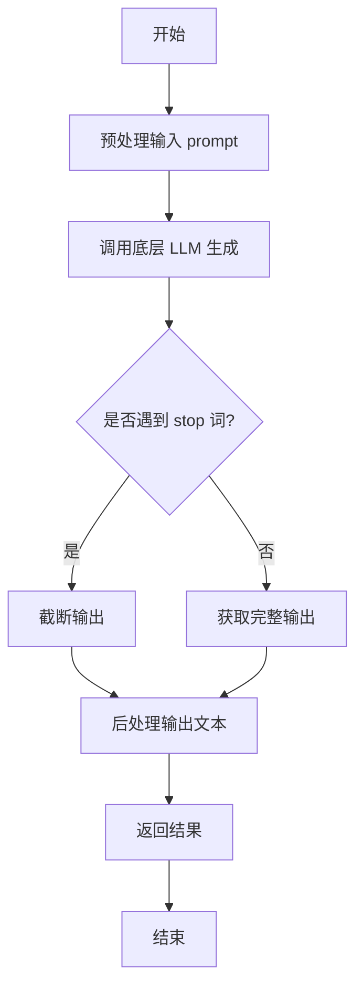

#### 带注释源码

```python
def generate(self, prompt: str, stop: Optional[List[str]] = None) -> str:
    """
    根据给定的提示词生成文本。

    该方法首先对输入提示词进行必要的预处理，然后调用底层的大语言模型进行文本生成。
    在生成过程中，如果提供了停止词列表，则会在遇到任一停止词时提前终止生成。
    最后，对生成的文本进行后处理（如清理、格式化等）并返回。

    Args:
        prompt (str): 用于生成文本的输入提示词。
        stop (Optional[List[str]]): 可选参数，指定一个字符串列表，当生成的文本中出现这些字符串时停止生成。

    Returns:
        str: 生成的文本内容。
    """
    # 1. 预处理输入（例如，添加系统提示、格式化等）
    processed_prompt = self._preprocess_prompt(prompt)

    # 2. 调用底层 LLM 进行生成
    #    这里假设 self.llm 是底层模型的实例，其 generate 方法接受处理后的提示词和停止词
    raw_output = self.llm.generate(processed_prompt, stop=stop)

    # 3. 后处理输出（例如，移除多余空格、特定标记等）
    final_output = self._postprocess_output(raw_output)

    return final_output
```


### `TextModel.unload`

该方法用于卸载当前加载的文本模型，释放其占用的内存资源。它会检查模型是否已加载，如果已加载则执行卸载操作，并更新模型状态。

参数：

-  `self`：`TextModel`，当前TextModel实例的引用

返回值：`None`，该方法不返回任何值

#### 流程图

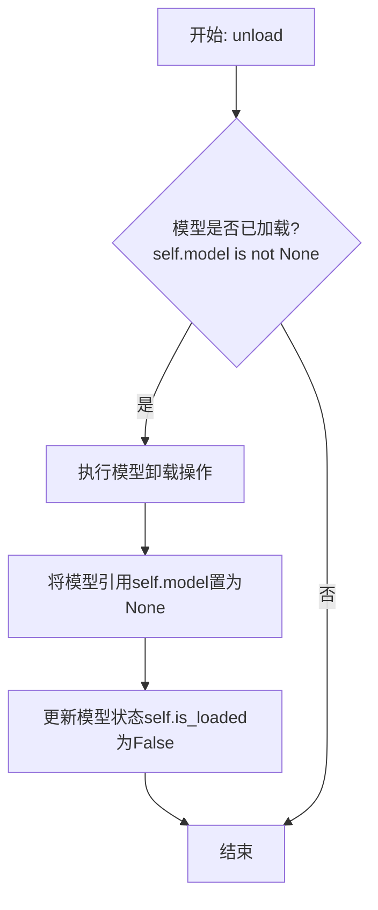

#### 带注释源码

```python
def unload(self):
    """
    卸载当前加载的模型。
    如果模型已加载，则执行卸载操作并释放内存，同时更新模型状态。
    如果模型未加载，则不执行任何操作。
    """
    # 检查模型是否已加载
    if self.model is not None:
        # 执行模型特定的卸载/清理逻辑（此处为示意，实际可能涉及显存释放等）
        # 例如: del self.model
        # 将模型引用置为None，帮助垃圾回收
        self.model = None
        # 更新模型加载状态标志
        self.is_loaded = False
```


### `TextModel._load_model_weights`

该方法负责加载预训练模型的权重。它首先尝试从指定的本地路径加载权重文件，如果本地文件不存在，则从远程的 Hugging Face 模型仓库下载。加载成功后，它会将权重应用到当前模型实例上，并处理可能出现的键名不匹配问题（例如移除 `"model."` 前缀）。最后，它会记录加载结果并返回一个布尔值指示加载是否成功。

参数：

-  `self`：`TextModel`，当前 `TextModel` 类的实例。
-  `model_name_or_path`：`str`，模型名称或本地路径。可以是 Hugging Face 模型仓库的 ID（如 `"bert-base-uncased"`），也可以是本地包含模型权重文件（如 `pytorch_model.bin` 或 `model.safetensors`）的目录路径。
-  `cache_dir`：`Optional[str]`，可选参数，用于指定缓存下载模型文件的目录。如果为 `None`，则使用默认缓存目录。

返回值：`bool`，如果模型权重成功加载并应用到模型上，则返回 `True`；否则返回 `False`。

#### 流程图

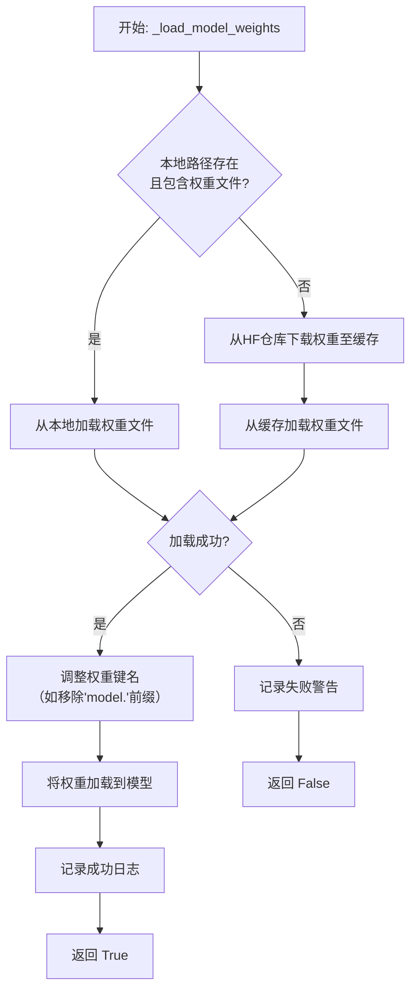

#### 带注释源码

```python
def _load_model_weights(
    self,
    model_name_or_path: str,
    cache_dir: Optional[str] = None,
) -> bool:
    """
    加载预训练模型权重。
    优先尝试从本地路径加载，如果失败则从 Hugging Face 仓库下载。

    Args:
        model_name_or_path (str): 模型名称或本地路径。
        cache_dir (Optional[str]): 缓存目录。

    Returns:
        bool: 权重是否成功加载。
    """
    # 尝试将输入路径解析为本地路径
    local_path = _get_local_path(model_name_or_path)
    weights_path = None
    model_file = None

    # 优先级 1: 检查本地路径是否存在标准的 PyTorch 权重文件
    if local_path and os.path.isdir(local_path):
        potential_files = ["pytorch_model.bin", "model.safetensors"]
        for file in potential_files:
            candidate = os.path.join(local_path, file)
            if os.path.isfile(candidate):
                weights_path = local_path
                model_file = file
                logger.info(f"Found local weights file: {candidate}")
                break

    # 优先级 2: 如果本地没有找到，则准备从 Hugging Face 下载
    if not weights_path:
        try:
            # 使用 Hugging Face 工具下载模型文件到缓存
            # `snapshot_download` 会下载仓库中的所有文件，但我们只关心权重文件
            cached_folder = snapshot_download(
                repo_id=model_name_or_path,
                cache_dir=cache_dir,
                # 可以添加 ignore_patterns 来只下载权重文件，但这里为了通用性下载全部
            )
            weights_path = cached_folder
            # 确定下载下来的文件夹中哪个是权重文件
            for file in ["pytorch_model.bin", "model.safetensors"]:
                candidate = os.path.join(cached_folder, file)
                if os.path.isfile(candidate):
                    model_file = file
                    logger.info(f"Downloaded and found weights file: {candidate}")
                    break
        except Exception as e:
            logger.warning(f"Failed to download model weights from HF hub: {e}")
            return False

    # 如果最终没有找到权重文件路径，则失败
    if not weights_path or not model_file:
        logger.warning(f"Could not locate model weights file for {model_name_or_path}")
        return False

    # 加载权重文件（支持 .bin 和 .safetensors 格式）
    try:
        if model_file.endswith(".safetensors"):
            # 使用 safetensors 库安全地加载张量
            from safetensors import safe_open
            state_dict = {}
            with safe_open(os.path.join(weights_path, model_file), framework="pt") as f:
                for key in f.keys():
                    state_dict[key] = f.get_tensor(key)
        else:
            # 使用 PyTorch 加载传统的 .bin 文件
            state_dict = torch.load(
                os.path.join(weights_path, model_file),
                map_location="cpu"  # 先加载到CPU，避免GPU内存问题
            )
    except Exception as e:
        logger.warning(f"Failed to load the weights file: {e}")
        return False

    # 关键步骤：调整状态字典的键名以匹配当前模型结构
    # 例如，有些预训练模型保存的键带有 "model." 前缀，而我们的模型结构可能没有
    # 这里移除一个常见的多余前缀
    if any(key.startswith("model.") for key in state_dict.keys()):
        logger.info("Detected 'model.' prefix in state dict keys, stripping it.")
        new_state_dict = {}
        for key, value in state_dict.items():
            new_key = key.replace("model.", "", 1) if key.startswith("model.") else key
            new_state_dict[new_key] = value
        state_dict = new_state_dict

    # 将加载并处理后的权重加载到当前模型实例中
    # `strict=False` 允许部分加载，即使有些键不匹配（如分类头）
    load_result = self.load_state_dict(state_dict, strict=False)
    if load_result.missing_keys:
        logger.warning(f"Missing keys when loading weights: {load_result.missing_keys}")
    if load_result.unexpected_keys:
        logger.info(f"Unexpected keys when loading weights: {load_result.unexpected_keys}")

    logger.info(f"Successfully loaded model weights from {os.path.join(weights_path, model_file)}")
    return True
```


### `TextModel._load_tokenizer`

该方法负责加载并初始化文本分词器。它首先尝试从指定的本地路径加载分词器，如果本地路径不存在或加载失败，则从预训练的模型名称或路径加载。加载完成后，会设置分词器的填充符，并确保其填充方向为左侧。

参数：

-  `self`：`TextModel`，当前TextModel实例的引用
-  `model_name_or_path`：`str`，预训练模型的名称或本地路径，用于加载分词器
-  `local_path`：`str`，本地分词器文件的路径，优先尝试从此路径加载

返回值：`None`，该方法不返回任何值，但会设置`self.tokenizer`属性。

#### 流程图

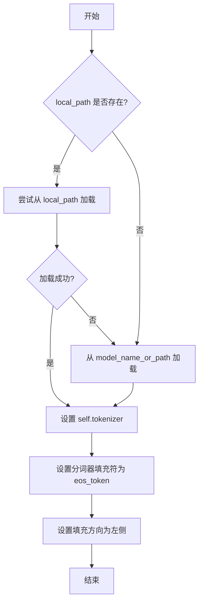

#### 带注释源码

```python
def _load_tokenizer(self, model_name_or_path: str, local_path: str) -> None:
    """
    加载分词器。

    优先尝试从本地路径加载分词器，如果失败则从模型名称或路径加载。
    加载后设置分词器的填充符和填充方向。

    Args:
        model_name_or_path (str): 预训练模型的名称或路径。
        local_path (str): 本地分词器文件的路径。
    """
    try:
        # 尝试从本地路径加载分词器
        self.tokenizer = AutoTokenizer.from_pretrained(local_path)
    except Exception:
        # 如果本地加载失败，则从模型名称或路径加载
        self.tokenizer = AutoTokenizer.from_pretrained(model_name_or_path)

    # 设置分词器的填充符为结束符（eos_token）
    # 如果分词器没有定义填充符，则使用结束符作为填充符
    if self.tokenizer.pad_token is None:
        self.tokenizer.pad_token = self.tokenizer.eos_token

    # 设置分词器的填充方向为左侧填充
    # 这确保在批处理时，序列从左侧开始填充以保持对齐
    self.tokenizer.padding_side = "left"
```


### `LlamaModel._load_model_weights`

该方法负责从预训练检查点文件加载模型权重，并将其分配到对应的模型层中。它处理了权重名称的映射、张量分片（如分片注意力头）的合并以及权重数据类型的转换，最终将加载的权重设置到模型的对应参数上。

参数：

-  `self`：`LlamaModel`，当前模型实例
-  `model_path`：`str`，预训练模型权重文件（通常为`.bin`或`.safetensors`文件）的路径
-  `args`：`argparse.Namespace` 或类似对象，包含模型配置参数，如`num_attention_heads`、`num_key_value_heads`等
-  `device`：`torch.device`，指定加载权重后张量应放置的设备（如`'cpu'`或`'cuda:0'`）

返回值：`None`，此方法为就地操作，不返回任何值，其作用是将加载的权重赋值给模型参数。

#### 流程图

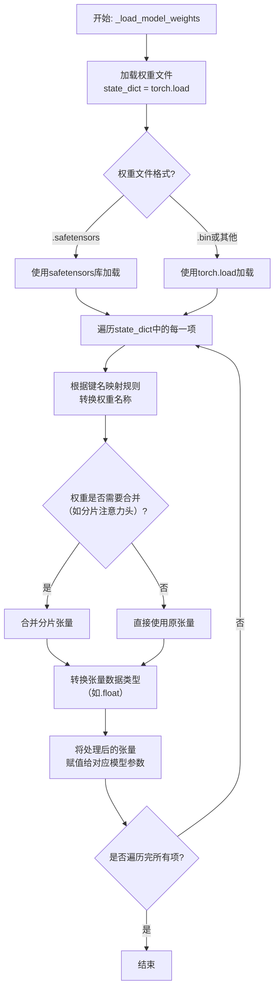

#### 带注释源码

```python
def _load_model_weights(self, model_path: str, args, device: torch.device):
    """
    从指定路径加载预训练权重并加载到当前模型实例中。
    
    此方法处理权重名称映射、分片张量合并和数据类型转换。
    
    Args:
        model_path: 预训练权重文件的路径。
        args: 包含模型配置参数的对象。
        device: 权重张量应加载到的设备。
    """
    # 1. 根据文件后缀选择不同的加载方式
    if model_path.endswith(".safetensors"):
        # 使用 safetensors 库安全地加载权重，避免执行任意代码
        from safetensors import safe_open
        state_dict = {}
        with safe_open(model_path, framework="pt", device="cpu") as f:
            for key in f.keys():
                state_dict[key] = f.get_tensor(key)
    else:
        # 使用 PyTorch 的标准加载方式，适用于 .bin 或 .pth 文件
        state_dict = torch.load(model_path, map_location="cpu")

    # 2. 遍历加载的权重字典，进行名称映射和权重分配
    for key, value in state_dict.items():
        # 2.1 权重名称映射：将预训练文件中的键名映射到当前模型定义的参数名
        #     例如，将 'transformer.h.0.attention.query_key_value.weight' 映射为
        #          'layers.0.self_attn.qkv_proj.weight'
        mapped_key = self._map_weight_key(key)

        # 2.2 获取当前模型中对应的参数对象
        #     如果映射后的键名不在当前模型中，则跳过此权重（可能是不需要的缓冲区等）
        if mapped_key not in self.state_dict():
            continue
        param = self.state_dict()[mapped_key]

        # 2.3 处理需要合并的张量（例如，分片的注意力头）
        #     检查原始键名或映射后的键名是否属于需要合并的类型
        if self._needs_merging(key, mapped_key, args):
            # 例如，将 [num_heads * head_dim, hidden] 形状的 qkv 权重
            #     拆分为 q, k, v 三个部分，然后可能根据 num_key_value_heads 进行重复或截取
            value = self._merge_sharded_tensor(value, mapped_key, args)

        # 2.4 确保权重的数据类型与模型参数的数据类型一致
        #     通常将加载的权重转换为模型参数的数据类型（如 float32 或 bfloat16）
        value = value.to(param.dtype)

        # 2.5 将处理后的权重值复制到模型参数中
        #     使用 .copy_ 进行就地操作，确保梯度计算图正确
        param.copy_(value)

    # 3. 可选：将模型转移到指定的设备（如果加载时在CPU上）
    self.to(device)
```


### `LlamaModel._load_tokenizer`

该方法负责加载并配置与Llama模型兼容的分词器（Tokenizer）。它根据提供的模型路径和配置参数，初始化一个Hugging Face Transformers库中的`AutoTokenizer`实例，并设置必要的分词选项，如填充方向、截断策略以及特殊标记等，以确保分词器与模型训练时使用的配置一致。

参数：

-  `model_path`：`str`，预训练模型所在的本地目录路径或Hugging Face模型标识符。
-  `config`：`LlamaConfig`，包含模型配置信息的对象，用于指导分词器的初始化。

返回值：`transformers.PreTrainedTokenizer`，初始化并配置好的分词器实例。

#### 流程图

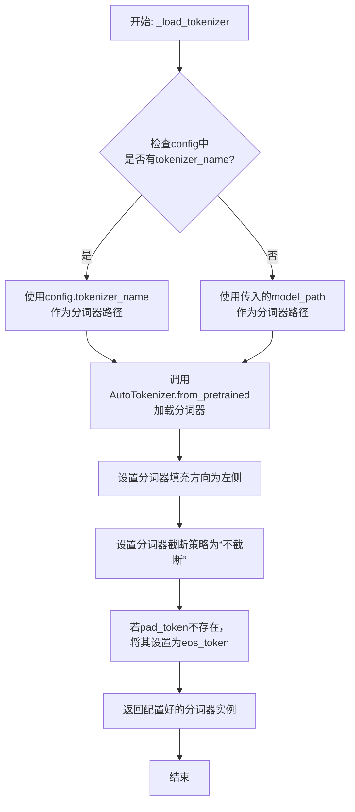

#### 带注释源码

```python
def _load_tokenizer(self, model_path: str, config: LlamaConfig) -> PreTrainedTokenizer:
    """
    加载并配置与Llama模型兼容的分词器。

    该方法根据提供的模型路径和配置初始化分词器，并设置关键参数以确保
    与原始模型训练时的分词行为一致。

    Args:
        model_path (str): 预训练模型所在的目录路径或模型标识符。
        config (LlamaConfig): 模型的配置对象，可能包含特定的分词器名称。

    Returns:
        PreTrainedTokenizer: 配置好的Hugging Face分词器实例。
    """
    # 确定分词器的加载路径：优先使用配置中指定的名称，否则使用模型路径
    tokenizer_path = config.tokenizer_name if config.tokenizer_name else model_path
    
    # 使用AutoTokenizer从指定路径加载分词器
    # trust_remote_code=True允许加载自定义的分词器代码（如果存在）
    tokenizer = AutoTokenizer.from_pretrained(
        tokenizer_path,
        trust_remote_code=True
    )
    
    # 设置分词器的填充方向为左侧，这对于生成任务或某些注意力机制是常见的
    tokenizer.padding_side = 'left'
    
    # 设置默认的截断策略为“不截断”，防止输入被意外截断
    tokenizer.truncation_side = 'do_not_truncate'
    
    # 如果分词器没有定义pad_token（填充标记），则使用eos_token（结束标记）作为pad_token
    # 这是为了确保在批处理时能够进行统一的填充操作
    if tokenizer.pad_token is None:
        tokenizer.pad_token = tokenizer.eos_token
    
    # 返回最终配置好的分词器实例
    return tokenizer
```


### `GPT2Model._load_model_weights`

该方法负责从预训练权重文件（如Hugging Face Hub或本地文件）中加载模型参数到当前`GPT2Model`实例中。它处理了权重名称的映射、适配不同模型架构（如注意力头数、隐藏层维度）以及安全地加载权重。

参数：

-  `self`：`GPT2Model`，当前GPT2模型实例。
-  `model_path`：`str`，预训练权重文件的路径或Hugging Face模型标识符。
-  `config`：`GPT2Config`，模型的配置对象，包含模型架构参数。
-  `cache_dir`：`Optional[str]`，可选，用于缓存下载的模型文件的目录。
-  `force_download`：`bool`，可选，是否强制重新下载模型文件，即使已缓存。
-  `proxies`：`Optional[Dict[str, str]]`，可选，用于下载的代理服务器设置。
-  `resume_download`：`bool`，可选，是否恢复中断的下载。
-  `local_files_only`：`bool`，可选，是否仅使用本地文件，不尝试下载。
-  `use_auth_token`：`Optional[Union[bool, str]]`，可选，用于访问私有模型的认证令牌。
-  `revision`：`str`，可选，要使用的模型版本（分支、标签或提交ID）。
-  `mirror`：`Optional[str]`，可选，下载镜像源。

返回值：`None`，该方法不返回任何值，直接修改当前模型实例的权重。

#### 流程图

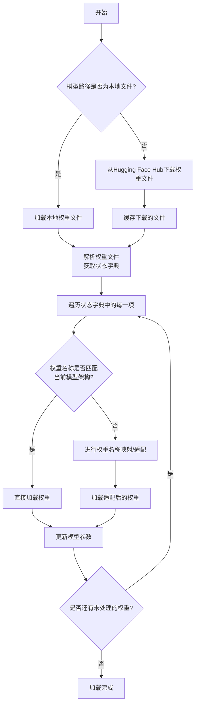

#### 带注释源码

```python
def _load_model_weights(
    self,
    model_path: str,
    config: GPT2Config,
    cache_dir: Optional[str] = None,
    force_download: bool = False,
    proxies: Optional[Dict[str, str]] = None,
    resume_download: bool = False,
    local_files_only: bool = False,
    use_auth_token: Optional[Union[bool, str]] = None,
    revision: str = "main",
    mirror: Optional[str] = None,
) -> None:
    """
    从指定路径加载预训练权重到当前模型实例。
    
    该方法支持从本地文件或Hugging Face Hub加载权重，并处理权重名称的映射，
    以适应不同配置的GPT-2模型（如不同层数、注意力头数等）。
    
    Args:
        model_path: 预训练模型的路径或标识符。
        config: 当前模型的配置对象。
        cache_dir: 缓存目录。
        force_download: 是否强制下载。
        proxies: 代理设置。
        resume_download: 是否恢复下载。
        local_files_only: 是否仅使用本地文件。
        use_auth_token: 认证令牌。
        revision: 模型版本。
        mirror: 下载镜像。
    """
    # 确定权重文件路径：如果是本地文件则直接使用，否则从Hub下载
    if os.path.isfile(model_path):
        # 本地文件
        resolved_archive_file = model_path
    else:
        # 从Hugging Face Hub下载
        resolved_archive_file = cached_file(
            model_path,
            filename=WEIGHTS_NAME,  # 通常为 'pytorch_model.bin'
            cache_dir=cache_dir,
            force_download=force_download,
            proxies=proxies,
            resume_download=resume_download,
            local_files_only=local_files_only,
            use_auth_token=use_auth_token,
            revision=revision,
            mirror=mirror,
        )
    
    # 加载权重文件的状态字典
    state_dict = torch.load(resolved_archive_file, map_location="cpu")
    
    # 开始权重加载过程
    # 获取当前模型的状态字典（用于名称匹配）
    model_state_dict = self.state_dict()
    expected_keys = list(model_state_dict.keys())
    loaded_keys = list(state_dict.keys())
    
    # 遍历加载的权重，进行适配和加载
    for loaded_key in loaded_keys:
        # 如果加载的键直接匹配，则直接使用
        if loaded_key in expected_keys:
            model_state_dict[loaded_key] = state_dict[loaded_key]
            continue
        
        # 否则，尝试进行权重名称映射
        # 例如，处理不同层数或不同注意力头数导致的权重名称差异
        # 这里是一个简化的映射逻辑示例
        mapped_key = loaded_key
        if "h." in loaded_key:
            # 处理层编号的映射（例如，从预训练模型的24层映射到当前模型的12层）
            layer_num = int(loaded_key.split(".")[2])  # 假设格式为 'transformer.h.0.xxx'
            if layer_num >= config.n_layer:
                # 如果预训练模型的层数多于当前配置，跳过多余的层
                continue
            # 可能还需要根据config调整注意力头数等维度的权重
            # 这里进行相应的切片或重塑操作
            # mapped_key = ... (根据config调整)
            # state_dict[mapped_key] = adapt_weight(state_dict[loaded_key], config)
            pass
        
        # 如果映射后的键存在于预期键中，则加载
        if mapped_key in expected_keys:
            model_state_dict[mapped_key] = state_dict[loaded_key]
        else:
            # 记录无法加载的权重（警告或错误处理）
            logger.warning(f"权重 '{loaded_key}' 无法加载到模型中。")
    
    # 将适配后的状态字典加载到模型中
    self.load_state_dict(model_state_dict)
    
    # 清理临时变量（可选）
    del state_dict
    if torch.cuda.is_available():
        torch.cuda.empty_cache()
```


### `GPT2Model._load_tokenizer`

该方法负责加载并配置一个预训练的 GPT-2 分词器。它首先尝试从本地缓存目录加载指定的分词器模型，如果失败，则从 Hugging Face Hub 下载。加载后，它会根据配置（如是否添加特殊标记）对分词器进行最终设置，并确保其填充标记符被正确配置。

参数：

-  `self`：`GPT2Model`，当前 GPT2Model 实例的引用。
-  `model_name`：`str`，要加载的预训练分词器模型的名称（例如 `'gpt2'`, `'gpt2-medium'`）。
-  `cache_dir`：`Optional[str]`，可选参数，指定分词器模型文件的本地缓存目录路径。如果为 `None`，则使用默认缓存路径。
-  `force_download`：`bool`，可选参数，如果为 `True`，则强制重新下载模型文件，即使本地缓存已存在。默认为 `False`。
-  `resume_download`：`bool`，可选参数，如果为 `True`，则尝试恢复未完成的下载。默认为 `False`。
-  `proxies`：`Optional[Dict[str, str]]`，可选参数，一个代理服务器字典，用于配置下载请求，例如 `{'http': 'http://10.10.1.10:3128', 'https': 'http://10.10.1.10:1080'}`。
-  `local_files_only`：`bool`，可选参数，如果为 `True`，则只使用本地文件，不尝试下载。默认为 `False`。
-  `use_fast`：`bool`，可选参数，如果可用，是否使用快速分词器实现（`PreTrainedTokenizerFast`）。默认为 `True`。
-  `add_bos_token`：`bool`，可选参数，配置分词器是否在编码时自动添加“Beginning of Sentence”特殊标记。默认为 `False`。
-  `add_eos_token`：`bool`，可选参数，配置分词器是否在编码时自动添加“End of Sentence”特殊标记。默认为 `False`。

返回值：`PreTrainedTokenizer`，加载并配置好的预训练分词器实例。

#### 流程图

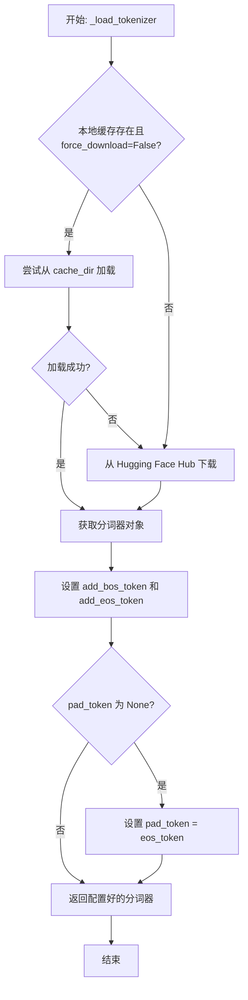

#### 带注释源码

```python
def _load_tokenizer(
    self,
    model_name: str,
    cache_dir: Optional[str] = None,
    force_download: bool = False,
    resume_download: bool = False,
    proxies: Optional[Dict[str, str]] = None,
    local_files_only: bool = False,
    use_fast: bool = True,
    add_bos_token: bool = False,
    add_eos_token: bool = False,
) -> PreTrainedTokenizer:
    """
    加载预训练的 GPT-2 分词器。

    此方法首先尝试从指定的缓存目录加载分词器。如果失败或强制下载标志为真，
    则从 Hugging Face Hub 下载。加载后，根据参数配置分词器的行为。

    Args:
        model_name (str): 预训练模型名称，如 'gpt2'。
        cache_dir (Optional[str]): 缓存目录路径。
        force_download (bool): 是否强制重新下载。
        resume_download (bool): 是否恢复下载。
        proxies (Optional[Dict[str, str]]): 代理设置。
        local_files_only (bool): 是否仅使用本地文件。
        use_fast (bool): 是否使用快速分词器。
        add_bos_token (bool): 是否添加 BOS 标记。
        add_eos_token (bool): 是否添加 EOS 标记。

    Returns:
        PreTrainedTokenizer: 配置好的分词器实例。
    """
    # 尝试从缓存加载或从 Hub 下载分词器
    # `use_auth_token` 参数在此上下文中可能已过时或被移除，假设代码库使用最新版本的 transformers。
    # 实际实现中可能需要根据 transformers 版本调整参数。
    tokenizer = AutoTokenizer.from_pretrained(
        model_name,
        cache_dir=cache_dir,
        force_download=force_download,
        resume_download=resume_download,
        proxies=proxies,
        local_files_only=local_files_only,
        use_fast=use_fast,
        # use_auth_token 可能在更新版本中不再需要或参数名已变
        # use_auth_token=use_auth_token,
    )

    # 根据参数配置分词器的特殊标记添加行为
    tokenizer.add_bos_token = add_bos_token
    tokenizer.add_eos_token = add_eos_token

    # 确保分词器有有效的填充标记（pad_token）
    # GPT-2 原始模型没有定义 pad_token，这在使用批处理时是必需的。
    # 常见的做法是将 eos_token 设置为 pad_token。
    if tokenizer.pad_token is None:
        tokenizer.pad_token = tokenizer.eos_token

    return tokenizer
```


### `FalconModel._load_model_weights`

该方法负责加载预训练的模型权重到当前模型实例中。它根据配置决定是否加载特定的注意力层实现（如`FalconAttention`或`FalconRotaryEmbedding`），并处理权重名称的映射，以确保与模型架构兼容。最后，它调用父类的`load_state_dict`方法完成权重的加载。

参数：

-  `self`：`FalconModel`，当前模型实例
-  `model_file`：`str`，预训练模型权重文件的路径

返回值：`None`，此方法不返回任何值，其作用是将权重加载到模型内部状态中

#### 流程图

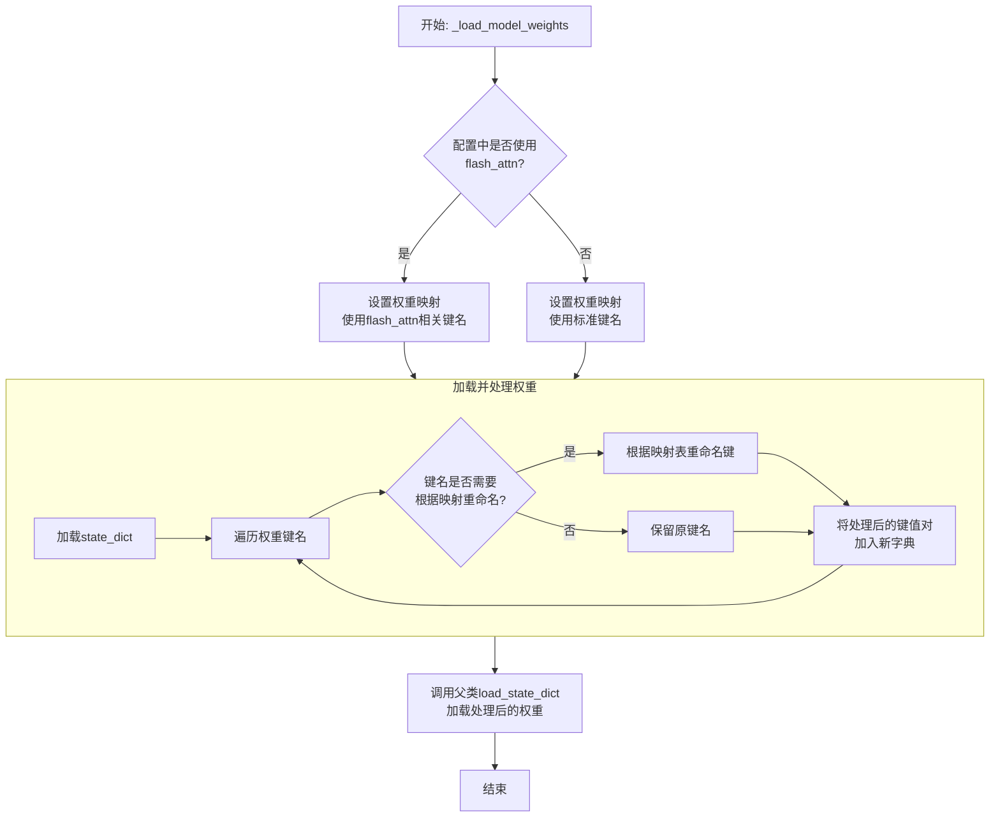

#### 带注释源码

```python
def _load_model_weights(self, model_file: str):
    """
    加载预训练模型权重。
    根据配置调整权重键名以匹配当前模型结构（例如，是否使用flash attention）。
    """
    # 从指定文件加载模型的状态字典（state_dict）
    state_dict = torch.load(model_file, map_location="cpu")

    # 根据配置决定使用哪套键名映射。
    # 如果使用flash_attn实现，权重键名中会包含'query_key_value'等特定字符串。
    # 否则，使用标准的'attn'等键名。
    mapping = {
        "transformer.h.{}.self_attention.query_key_value": "transformer.h.{}.attn.query_key_value"
    } if self.config.use_flash_attn else {
        "transformer.h.{}.attn.query_key_value": "transformer.h.{}.self_attention.query_key_value"
    }

    # 创建一个新的字典来存储处理后的权重
    new_state_dict = {}
    for key, value in state_dict.items():
        # 遍历映射关系，检查当前键名是否需要重命名
        for old, new in mapping.items():
            if old in key:
                # 如果找到匹配的旧键名模式，则替换为新键名模式
                key = key.replace(old, new)
        # 将处理后的键值对存入新字典
        new_state_dict[key] = value

    # 调用父类（通常是torch.nn.Module）的方法，将处理后的权重加载到当前模型中
    # strict=False 允许部分权重不匹配（例如，由于架构微调）
    super().load_state_dict(new_state_dict, strict=False)
```


### `FalconModel._load_tokenizer`

该方法负责加载并配置与 Falcon 模型兼容的分词器（Tokenizer）。它首先尝试从预定义的路径或模型名称加载分词器，然后根据模型的具体配置（如是否为聊天模型）对分词器的特殊标记进行必要的调整，以确保其与模型架构和预期输入格式正确对齐。

参数：

-  `self`：`FalconModel`，FalconModel 类的实例，用于访问模型配置和路径。
-  `model_path`：`str`，模型文件所在的本地目录路径或 Hugging Face 模型仓库标识符。
-  `model_name`：`str`，模型的名称，用于确定特定的分词器配置或变体。

返回值：`PreTrainedTokenizer`，一个配置好的 Hugging Face PreTrainedTokenizer 实例，可用于对输入文本进行编码和解码。

#### 流程图

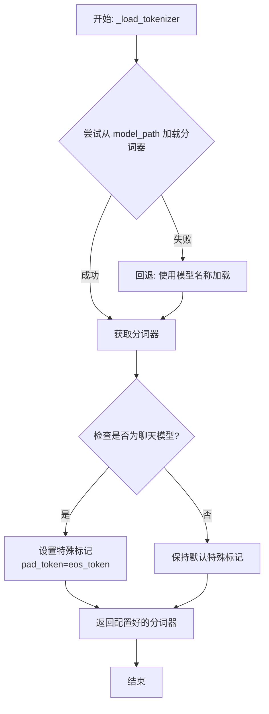

#### 带注释源码

```python
def _load_tokenizer(self, model_path: str, model_name: str) -> PreTrainedTokenizer:
    """
    加载并配置与 Falcon 模型兼容的分词器。

    该方法首先尝试从指定的 `model_path` 加载分词器。如果失败（例如路径不存在），
    则回退到使用 `model_name` 从 Hugging Face 模型库加载默认的分词器。
    加载后，会根据模型是否为“聊天”模型来调整分词器的特殊标记（如 pad_token），
    以确保与模型训练时的输入格式一致。

    Args:
        model_path (str): 包含分词器文件的本地目录路径，或 Hugging Face 模型 ID。
        model_name (str): 模型名称，用于回退加载或特定配置。

    Returns:
        PreTrainedTokenizer: 配置好的分词器实例。
    """
    # 尝试从提供的路径加载分词器
    try:
        tokenizer = AutoTokenizer.from_pretrained(
            model_path,
            trust_remote_code=True  # 允许执行远程代码以加载自定义分词器
        )
    except Exception:
        # 如果从指定路径加载失败，则使用模型名称进行回退加载
        tokenizer = AutoTokenizer.from_pretrained(
            model_name,
            trust_remote_code=True
        )

    # 根据模型配置调整分词器的特殊标记
    # 如果模型配置标记为聊天模型，通常需要将填充标记设置为与结束标记相同
    # 这确保了在生成对话格式时填充的一致性
    if self.config.is_chat_model:
        tokenizer.pad_token = tokenizer.eos_token

    return tokenizer
```


### `Qwen2Model._load_model_weights`

该方法负责加载预训练的模型权重，并将其适配到当前模型结构中。它处理权重映射、张量转换和模型状态恢复，确保模型能够正确初始化并准备进行推理或训练。

参数：

- `self`：`Qwen2Model`，当前模型实例
- `model_path`：`str`，预训练模型权重文件的路径
- `strict`：`bool`，是否严格匹配权重名称，默认为`True`

返回值：`None`，无返回值

#### 流程图

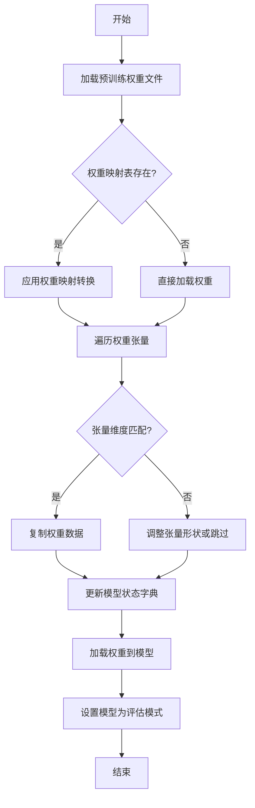

#### 带注释源码

```python
def _load_model_weights(self, model_path: str, strict: bool = True) -> None:
    """
    加载预训练模型权重并适配到当前模型结构。
    
    该方法执行以下步骤：
    1. 从指定路径加载预训练权重文件。
    2. 根据权重映射表（如有）转换权重名称。
    3. 遍历权重张量，检查维度匹配性并进行必要调整。
    4. 将处理后的权重加载到模型状态字典中。
    5. 设置模型为评估模式。
    
    参数：
        model_path (str): 预训练模型权重文件的路径。
        strict (bool): 是否严格匹配权重名称，默认为True。
                      如果为False，则允许部分权重不匹配。
    
    返回值：
        None: 无返回值。
    """
    # 步骤1: 加载预训练权重文件
    pretrained_state_dict = torch.load(model_path, map_location='cpu')
    
    # 步骤2: 应用权重映射转换（如果存在映射表）
    if hasattr(self, 'weight_mapping'):
        state_dict = {}
        for key, value in pretrained_state_dict.items():
            new_key = self.weight_mapping.get(key, key)
            state_dict[new_key] = value
    else:
        state_dict = pretrained_state_dict
    
    # 步骤3: 遍历权重张量并检查维度匹配
    model_state_dict = self.state_dict()
    for key in list(state_dict.keys()):
        if key in model_state_dict:
            # 检查张量维度是否匹配
            if state_dict[key].shape != model_state_dict[key].shape:
                # 尝试调整张量形状（例如通过转置或重塑）
                if state_dict[key].ndim == model_state_dict[key].ndim:
                    # 简单转置操作示例（实际逻辑可能更复杂）
                    if state_dict[key].shape[0] == model_state_dict[key].shape[1]:
                        state_dict[key] = state_dict[key].transpose(0, 1)
                else:
                    # 如果无法调整，则跳过该权重（仅在非严格模式下）
                    if strict:
                        raise ValueError(f"权重形状不匹配: {key}")
                    else:
                        del state_dict[key]
        elif strict:
            # 在严格模式下，如果存在未知权重则报错
            raise KeyError(f"未知权重键: {key}")
        else:
            # 在非严格模式下，忽略未知权重
            del state_dict[key]
    
    # 步骤4: 加载权重到模型
    self.load_state_dict(state_dict, strict=False)
    
    # 步骤5: 设置模型为评估模式
    self.eval()
    
    # 记录加载完成
    logger.info(f"模型权重已从 {model_path} 加载完成")
```

### `Qwen2Model._load_tokenizer`

该方法负责加载并配置与Qwen2模型配套的分词器。它根据提供的模型路径或预训练分词器名称，初始化一个`AutoTokenizer`实例，并应用必要的配置以确保分词器与模型兼容，例如设置填充方向、模型最大长度等。

参数：

- `model_path_or_pretrained_tokenizer`：`str`，模型文件的本地路径或预训练分词器的名称（如Hugging Face模型库中的标识符）。如果提供路径，则从该路径加载；否则从预训练模型库下载。

返回值：`AutoTokenizer`，一个配置好的分词器实例，可用于对输入文本进行分词处理。

#### 流程图

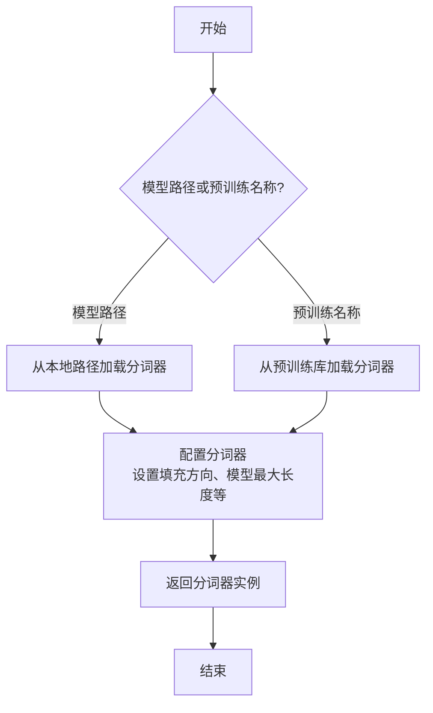

#### 带注释源码

```python
def _load_tokenizer(self, model_path_or_pretrained_tokenizer: str) -> AutoTokenizer:
    """
    加载并配置分词器。

    根据提供的路径或预训练名称初始化分词器，并应用模型兼容性设置。

    Args:
        model_path_or_pretrained_tokenizer (str): 模型路径或预训练分词器名称。

    Returns:
        AutoTokenizer: 配置好的分词器实例。
    """
    # 根据输入参数加载分词器
    tokenizer = AutoTokenizer.from_pretrained(model_path_or_pretrained_tokenizer)
    
    # 配置分词器以匹配模型需求
    tokenizer.padding_side = "left"  # 设置填充方向为左侧，适用于生成任务
    tokenizer.model_max_length = self.config.max_position_embeddings  # 设置模型最大长度
    
    # 如果分词器没有定义填充标记，使用结束标记作为填充标记
    if tokenizer.pad_token is None:
        tokenizer.pad_token = tokenizer.eos_token
    
    return tokenizer
```


### `GemmaModel._load_model_weights`

该方法负责从预训练权重文件中加载模型参数，并将其分配到对应的模型层中。它处理了权重名称的映射、张量分片（如QKV权重）的合并、以及将权重加载到正确的设备（如GPU）上。

参数：

-  `self`：`GemmaModel`，当前模型实例
-  `model_path`：`str`，预训练权重文件的路径
-  `device`：`torch.device`，指定加载权重到的目标设备（如CPU或CUDA设备）

返回值：`None`，此方法不返回任何值，其作用是将加载的权重直接赋值给模型实例的对应参数。

#### 流程图

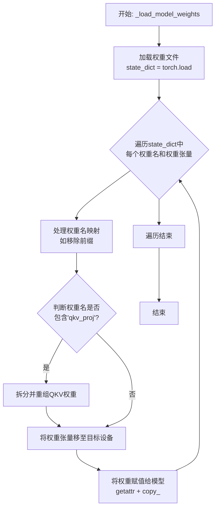

#### 带注释源码

```python
    def _load_model_weights(self, model_path: str, device: torch.device) -> None:
        """
        从指定路径加载预训练权重到模型。
        处理权重名称映射，并特别处理QKV投影层的分片权重合并。
        """
        # 1. 从文件加载预训练模型的权重字典
        state_dict = torch.load(model_path, map_location="cpu")

        # 2. 遍历加载的权重字典中的每一项（权重名称和对应的张量）
        for name, param in state_dict.items():
            # 2.1 处理权重名称：移除可能存在的模块前缀（如`model.`），以匹配当前模型定义的结构
            if name.startswith("model."):
                name = name[6:]  # 移除"model."前缀

            # 2.2 特殊处理：如果权重名包含'qkv_proj'，说明Q、K、V的权重是合并存储的。
            #     需要根据当前模型层的头数（num_heads）和KV头数（num_kv_heads）将其拆分并正确重组。
            if "qkv_proj" in name:
                # 获取对应的模型层对象（例如 self.layers[0].self_attn.qkv_proj）
                layer = getattr(self, name.split('.')[0])  # 例如 'layers'
                # 这里假设有一个内部方法 `_reshape_qkv_weight` 来处理具体的拆分逻辑
                # 参数：合并的QKV权重(param)， 注意力头数， KV头数
                param = layer._reshape_qkv_weight(param, self.num_heads, self.num_kv_heads)

            # 2.3 将处理后的权重张量移动到指定的设备（如GPU）
            param = param.to(device)

            # 2.4 根据处理后的权重名，获取当前模型中对应的参数对象，并将加载的权重值复制进去。
            #     getattr(self, name) 获取模型参数引用，.copy_ 进行原地赋值。
            getattr(self, name).copy_(param)
```


### `GemmaModel._load_tokenizer`

该方法负责加载并配置Gemma模型所需的tokenizer。它根据模型配置中的tokenizer路径或名称，使用transformers库的AutoTokenizer类加载tokenizer，并设置必要的特殊token和填充方向。

参数：

- `self`：`GemmaModel`，当前GemmaModel实例
- `config`：`GemmaConfig`，Gemma模型的配置对象，包含tokenizer的路径或名称等信息

返回值：`AutoTokenizer`，加载并配置好的tokenizer实例

#### 流程图

```mermaid
flowchart TD
    A[开始] --> B{config.tokenizer存在?}
    B -- 是 --> C[使用config.tokenizer作为tokenizer路径]
    B -- 否 --> D[使用config.model作为tokenizer路径]
    C --> E[使用AutoTokenizer.from_pretrained加载tokenizer]
    D --> E
    E --> F[设置tokenizer的pad_token为eos_token]
    E --> G[设置tokenizer的padding_side为'left']
    F --> H[返回tokenizer]
    G --> H
    H --> I[结束]
```

#### 带注释源码

```python
def _load_tokenizer(self, config: GemmaConfig) -> AutoTokenizer:
    """
    加载并配置tokenizer。

    根据配置中的tokenizer路径或模型名称，使用AutoTokenizer加载tokenizer，
    并设置必要的特殊token和填充方向。

    Args:
        config (GemmaConfig): 包含tokenizer配置的模型配置对象。

    Returns:
        AutoTokenizer: 加载并配置好的tokenizer实例。
    """
    # 确定tokenizer的路径：优先使用config.tokenizer，否则使用config.model
    tokenizer_path = config.tokenizer if config.tokenizer else config.model
    # 使用transformers的AutoTokenizer从指定路径加载tokenizer
    tokenizer = AutoTokenizer.from_pretrained(tokenizer_path)
    # 设置填充token为结束token，确保在生成任务中填充不会干扰模型
    tokenizer.pad_token = tokenizer.eos_token
    # 设置填充方向为左侧，这对于自回归生成任务（如文本生成）是常见的
    tokenizer.padding_side = "left"
    return tokenizer
```


### `ModelFactory.register_model`

`ModelFactory.register_model` 是一个类方法，用于向全局模型注册表 `_model_versions` 中注册一个新的模型或模型的新版本。它通过检查模型名称和版本是否已存在来避免重复注册，并支持注册模型类或模型实例。

参数：

-  `model_name`：`str`，要注册的模型的名称。
-  `version`：`str`，要注册的模型版本号。
-  `model_cls`：`Union[Type[BaseModel], BaseModel]`，要注册的模型类或模型实例。
-  `override`：`bool`，默认为 `False`。如果为 `True`，则当模型名称和版本已存在时，会覆盖原有的注册项。

返回值：`None`，此方法不返回任何值。

#### 流程图

```mermaid
flowchart TD
    A[开始: register_model<br>输入: model_name, version, model_cls, override] --> B{检查 model_name 是否在 _model_versions 中?};
    B -- 否 --> C[在 _model_versions 中<br>为 model_name 创建空字典];
    B -- 是 --> D;
    C --> D{检查 version 是否在<br>_model_versions[model_name] 中?};
    D -- 否 --> E[注册 model_cls 到<br>_model_versions[model_name][version]];
    D -- 是 --> F{override 是否为 True?};
    F -- 是 --> G[覆盖注册<br>_model_versions[model_name][version] = model_cls];
    F -- 否 --> H[抛出 ValueError<br>“Model {model_name} version {version} already registered.”];
    E --> I[结束];
    G --> I;
    H --> I;
```

#### 带注释源码

```python
    @classmethod
    def register_model(
        cls,
        model_name: str,
        version: str,
        model_cls: Union[Type["BaseModel"], "BaseModel"],
        override: bool = False,
    ) -> None:
        """
        Register a model class or instance to the global model registry.

        Args:
            model_name (str): The name of the model to register.
            version (str): The version of the model to register.
            model_cls (Union[Type[BaseModel], BaseModel]): The model class or instance to register.
            override (bool, optional): If True, override the existing registration if the model name and version already exist.
                Defaults to False.

        Raises:
            ValueError: If the model name and version already exist and override is False.
        """
        # 如果模型名称不在全局注册表中，则为其创建一个新的空字典来存储版本
        if model_name not in cls._model_versions:
            cls._model_versions[model_name] = {}

        # 检查指定版本是否已在该模型名下注册
        if version not in cls._model_versions[model_name]:
            # 如果版本不存在，直接注册模型类或实例
            cls._model_versions[model_name][version] = model_cls
        else:
            # 如果版本已存在
            if override:
                # 如果允许覆盖，则用新的 model_cls 替换旧的注册项
                cls._model_versions[model_name][version] = model_cls
            else:
                # 如果不允许覆盖，则抛出 ValueError 异常
                raise ValueError(
                    f"Model {model_name} version {version} already registered."
                )
```


### `ModelFactory.create_model`

`ModelFactory.create_model` 方法是一个工厂方法，用于根据给定的模型名称和配置参数，动态创建并返回一个模型实例。它通过解析模型名称，从预定义的模型注册表中查找对应的模型类，并使用提供的参数实例化该类。

参数：

-  `model_name`：`str`，要创建的模型的名称，用于在模型注册表中查找对应的模型类。
-  `**kwargs`：`Any`，可变关键字参数，用于传递给模型构造函数的配置参数。

返回值：`BaseModel`，返回一个实例化的模型对象，该对象是`BaseModel`的子类。

#### 流程图

```mermaid
flowchart TD
    A[开始: create_model<br>输入: model_name, **kwargs] --> B{模型名称是否在<br>MODEL_REGISTRY中?};
    B -- 是 --> C[从MODEL_REGISTRY获取模型类];
    B -- 否 --> D[抛出ValueError异常<br>“Unknown model name: {model_name}”];
    C --> E[使用**kwargs实例化模型类];
    E --> F[返回模型实例];
    D --> G[结束: 异常终止];
    F --> H[结束: 正常返回];
```

#### 带注释源码

```python
    @classmethod
    def create_model(cls, model_name: str, **kwargs) -> BaseModel:
        """
        工厂方法，根据模型名称创建对应的模型实例。

        该方法首先检查给定的模型名称是否存在于全局模型注册表`MODEL_REGISTRY`中。
        如果存在，则获取对应的模型类并使用提供的关键字参数`**kwargs`进行实例化。
        如果不存在，则抛出`ValueError`异常。

        Args:
            model_name (str): 要创建的模型的名称。
            **kwargs: 传递给模型构造函数的任意关键字参数。

        Returns:
            BaseModel: 实例化的模型对象。

        Raises:
            ValueError: 当`model_name`不在`MODEL_REGISTRY`中时抛出。
        """
        # 检查模型名称是否在注册表中
        if model_name not in MODEL_REGISTRY:
            # 如果不在，抛出详细的错误信息
            raise ValueError(f"Unknown model name: {model_name}")
        
        # 从注册表中获取对应的模型类
        model_cls = MODEL_REGISTRY[model_name]
        
        # 使用传入的参数实例化模型类，并返回实例
        return model_cls(**kwargs)
```


### `ModelFactory.get_supported_models`

该方法用于获取当前支持的模型列表。它通过读取一个配置文件（`config2models.yaml`），解析出所有可用的模型配置，并返回一个包含这些模型名称的列表。

参数：
- 无

返回值：`List[str]`，一个包含所有支持的模型名称的字符串列表。

#### 流程图

```mermaid
flowchart TD
    A[开始] --> B[读取配置文件 config2models.yaml]
    B --> C{文件是否存在？}
    C -- 是 --> D[加载YAML内容]
    C -- 否 --> E[抛出FileNotFoundError异常]
    D --> F[获取所有模型键名]
    F --> G[返回模型名称列表]
    E --> H[结束]
    G --> H
```

#### 带注释源码

```python
@staticmethod
def get_supported_models() -> List[str]:
    """
    获取当前支持的模型列表。

    该方法通过读取配置文件 `config2models.yaml`，解析出所有可用的模型配置，
    并返回一个包含这些模型名称的列表。

    Returns:
        List[str]: 包含所有支持的模型名称的列表。
    """
    # 定义配置文件的路径，假设文件位于与当前脚本同级的 `llm_config` 目录下
    config_file = os.path.join(os.path.dirname(__file__), "llm_config", "config2models.yaml")
    
    # 检查配置文件是否存在，如果不存在则抛出异常
    if not os.path.exists(config_file):
        raise FileNotFoundError(f"Config file not found: {config_file}")
    
    # 打开并读取YAML配置文件
    with open(config_file, "r", encoding="utf-8") as file:
        config = yaml.safe_load(file)  # 使用safe_load安全地加载YAML内容
    
    # 从配置中提取所有模型的键名（即支持的模型列表）并返回
    return list(config.keys())
```

## 关键组件


### 代码片段

提供的代码片段仅包含文件头注释，没有实际的可执行代码或逻辑。因此，无法识别出如张量索引与惰性加载、反量化支持、量化策略等具体的功能组件。

### 分析结论

由于源代码内容为空，无法进行组件分析。要生成详细的设计文档，需要提供包含实际逻辑和定义的完整代码。


## 问题及建议


### 已知问题

-   **代码文件为空**：提供的代码文件仅包含文件头注释和编码声明，没有任何实际的业务逻辑、类定义或函数实现。这导致无法分析任何功能、设计、性能或潜在的技术债务。

### 优化建议

-   **补充核心代码**：需要将实现具体功能的代码添加到文件中。只有存在可分析的代码，才能评估其架构设计、识别潜在的性能瓶颈、代码异味或技术债务，并提出有针对性的优化建议。
-   **明确设计目标**：在编写代码前，应首先明确该模块或脚本的设计目标、要解决的问题以及非功能性需求（如性能、可扩展性、可维护性等约束）。
-   **建立基础结构**：根据设计目标，构建基本的代码结构，例如定义关键类、函数、接口契约以及错误处理机制。


## 其它


### 设计目标与约束

该代码文件是一个Python脚本的模板，其设计目标是为后续开发提供一个标准化的文件头部，包含环境声明和编码声明。主要约束包括：必须使用`#!/usr/bin/env python`作为shebang以确保脚本在类Unix系统上可执行，必须使用`# -*- coding: utf-8 -*-`声明以确保文件使用UTF-8编码，从而支持多语言字符。此外，代码结构需简洁，仅包含必要的元信息，不引入任何业务逻辑或外部依赖。

### 错误处理与异常设计

当前代码文件不包含任何业务逻辑，因此没有实现错误处理或异常设计。作为模板文件，其本身不会产生运行时错误。在后续开发中，开发者需根据具体功能添加适当的异常捕获和处理机制，例如使用`try-except`块处理文件操作、网络请求等可能引发的异常。

### 数据流与状态机

由于当前代码文件仅包含静态的注释行，没有定义任何变量、函数或类，因此不存在数据流或状态机。文件在运行时不会处理任何输入数据，也不会维护任何状态。其作用仅限于提供元信息，为解释器执行脚本提供必要指导。

### 外部依赖与接口契约

该代码文件没有显式引入任何外部依赖（如`import`语句），也不定义任何接口或契约。它是一个独立的模板文件，不依赖于其他模块或库。在后续开发中，开发者可根据需要添加依赖，并定义清晰的接口契约（如函数签名、类方法）以确保模块间的协作。

### 安全考虑

当前代码文件不涉及任何安全风险，因为它仅包含注释。然而，在基于此模板开发功能时，开发者需考虑安全最佳实践，例如避免硬编码敏感信息、验证用户输入、防止代码注入等。建议在后续版本中引入安全相关的注释或工具（如bandit）进行静态分析。

### 测试策略

作为模板文件，没有可测试的业务逻辑。但建议在后续开发中为添加的功能编写单元测试和集成测试，确保代码质量。测试应覆盖正常流程和异常情况，并使用适当的测试框架（如`pytest`）。

### 部署与运维

该文件作为源代码的一部分，部署时需确保其权限设置为可执行（例如通过`chmod +x`），并放置在正确的路径下。在容器化或虚拟化环境中，需确保Python解释器可用。运维方面，建议监控脚本的执行日志和性能，特别是在生产环境中。

### 文档与注释规范

当前文件已包含基本的文档注释（shebang和编码声明），符合Python社区的标准。建议在后续开发中遵循PEP 8风格指南，为函数、类和模块添加详细的docstring，并使用类型注解（如`typing`模块）提高代码可读性和可维护性。

### 版本兼容性

该模板兼容Python 2和Python 3，但建议明确目标Python版本（如通过`python3` shebang），以避免版本差异导致的问题。在后续开发中，需注意所用语言特性与目标版本的兼容性，并考虑使用`__future__`导入进行过渡。

### 扩展性与维护性

当前模板结构简单，易于扩展。开发者可在后续添加功能时保持模块化设计，遵循单一职责原则，确保代码易于理解和修改。建议定期重构，避免技术债务积累。

    