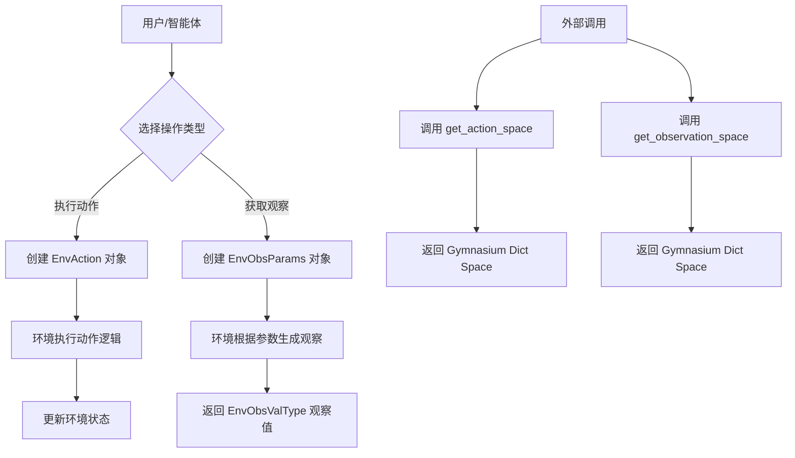

# `.\MetaGPT\metagpt\environment\stanford_town\env_space.py` 详细设计文档

该代码定义了一个基于网格（Tile）的环境空间，用于强化学习或模拟环境。它提供了环境动作（EnvAction）和观察（EnvObsParams）的数据结构定义，包括动作类型（如添加/移除网格事件）和观察类型（如获取网格详情、邻居信息）。同时，代码还提供了用于强化学习框架（如Gymnasium）的动作空间（action space）和观察空间（observation space）的构建函数。

## 整体流程



## 类结构

```
BaseEnvActionType (来自 metagpt.base.base_env_space)
└── EnvActionType
BaseEnvAction (来自 metagpt.base.base_env_space)
└── EnvAction
BaseEnvObsType (来自 metagpt.base.base_env_space)
└── EnvObsType
BaseEnvObsParams (来自 metagpt.base.base_env_space)
└── EnvObsParams
```

## 全局变量及字段


### `EnvObsValType`
    
定义环境观测值的类型，可以是字符串列表的列表、坐标集合字典或字典列表的列表，用于表示不同粒度的观测数据。

类型：`Union[list[list[str]], dict[str, set[tuple[int, int]]], list[list[dict[str, Any]]]]`
    


### `EnvActionType.NONE`
    
表示无动作类型，仅用于获取环境观测而不执行任何操作。

类型：`int`
    


### `EnvActionType.ADD_TILE_EVENT`
    
表示向指定瓦片添加事件三元组的动作类型。

类型：`int`
    


### `EnvActionType.RM_TILE_EVENT`
    
表示从指定瓦片移除事件三元组的动作类型。

类型：`int`
    


### `EnvActionType.TURN_TILE_EVENT_IDLE`
    
表示将指定瓦片上的事件三元组转为空闲状态的动作类型。

类型：`int`
    


### `EnvActionType.RM_TITLE_SUB_EVENT`
    
表示从指定瓦片移除具有特定主体的事件三元组的动作类型。

类型：`int`
    


### `EnvAction.model_config`
    
Pydantic模型配置，允许任意类型以支持numpy数组等复杂字段。

类型：`ConfigDict`
    


### `EnvAction.action_type`
    
动作类型，指定要执行的环境操作，默认为EnvActionType.NONE。

类型：`int`
    


### `EnvAction.coord`
    
瓦片坐标，表示动作目标位置的二维整数数组。

类型：`npt.NDArray[np.int64]`
    


### `EnvAction.subject`
    
事件主体的名称，即事件三元组中的第一个元素。

类型：`str`
    


### `EnvAction.event`
    
瓦片事件，由四个字符串组成的元组，表示事件的详细信息。

类型：`tuple[str, Optional[str], Optional[str], Optional[str]]`
    


### `EnvObsType.NONE`
    
表示获取完整环境观测的观测类型。

类型：`int`
    


### `EnvObsType.GET_TITLE`
    
表示获取指定瓦片详细信息的观测类型。

类型：`int`
    


### `EnvObsType.TILE_PATH`
    
表示获取指定瓦片地址的观测类型。

类型：`int`
    


### `EnvObsType.TILE_NBR`
    
表示获取指定瓦片及其视野半径内邻居信息的观测类型。

类型：`int`
    


### `EnvObsParams.model_config`
    
Pydantic模型配置，允许任意类型以支持numpy数组等复杂字段。

类型：`ConfigDict`
    


### `EnvObsParams.obs_type`
    
观测类型，指定要获取的环境观测类型，默认为EnvObsType.NONE。

类型：`int`
    


### `EnvObsParams.coord`
    
瓦片坐标，表示观测目标位置的二维整数数组。

类型：`npt.NDArray[np.int64]`
    


### `EnvObsParams.level`
    
瓦片层级，用于区分不同级别的瓦片信息。

类型：`str`
    


### `EnvObsParams.vision_radius`
    
视野半径，定义观测时考虑的邻居范围。

类型：`int`
    
    

## 全局函数及方法

### `get_observation_space`

该函数用于定义并返回一个Gymnasium环境中的观测空间（observation space）。观测空间是一个字典空间（`spaces.Dict`），它定义了智能体（Agent）能够从环境中观测到的信息结构。当前实现中，该空间包含三个离散的（`Discrete`）子空间，分别代表“碰撞迷宫”、“瓦片”和“地址瓦片”，每个子空间只有两个可能的状态（0或1）。这通常是一个占位符或简化实现，用于在环境开发初期快速搭建框架。

参数：
- 无

返回值：`gymnasium.spaces.Dict`，一个包含三个键值对的字典空间，用于描述环境的观测结构。

#### 流程图

```mermaid
flowchart TD
    A[开始] --> B[创建字典空间<br>spaces.Dict]
    B --> C[定义子空间<br>collision_maze: Discrete(2)]
    C --> D[定义子空间<br>tiles: Discrete(2)]
    D --> E[定义子空间<br>address_tiles: Discrete(2)]
    E --> F[返回构建好的<br>观测空间对象]
    F --> G[结束]
```

#### 带注释源码

```python
def get_observation_space() -> spaces.Dict:
    # 创建一个Gymnasium的字典空间（Dict Space），用于定义观测的结构。
    # 当前实现是一个占位符，它定义了三个键，每个键对应一个只有两个可能值（0或1）的离散空间。
    # 这通常需要在后续开发中根据环境的实际观测内容进行扩展和细化。
    space = spaces.Dict(
        {
            "collision_maze": spaces.Discrete(2),  # 表示迷宫碰撞状态的离散空间，有2个可能值
            "tiles": spaces.Discrete(2),           # 表示瓦片状态的离散空间，有2个可能值
            "address_tiles": spaces.Discrete(2)    # 表示地址瓦片状态的离散空间，有2个可能值
        }
    )

    return space  # 返回构建好的观测空间对象
```


### `get_action_space`

该函数用于创建一个描述智能体在环境中可执行动作空间的Gymnasium `spaces.Dict`对象。该动作空间定义了智能体可以采取的动作类型（`action_type`）以及执行这些动作所需的参数（`coord`, `subject`, `event`）的取值范围和格式。

参数：

-  `maze_shape`：`tuple[int, int]`，表示迷宫环境的形状（高度，宽度），用于约束坐标参数`coord`的取值范围。

返回值：`spaces.Dict`，返回一个Gymnasium字典空间对象，该对象定义了动作空间中每个字段（键）对应的子空间（值），用于验证和采样智能体的动作。

#### 流程图

```mermaid
flowchart TD
    A[开始: get_action_space(maze_shape)] --> B["创建 spaces.Dict 字典空间"]
    B --> C["添加键 'action_type': spaces.Discrete(len(EnvActionType))"]
    B --> D["添加键 'coord': spaces.Box(low=[0,0], high=maze_shape)"]
    B --> E["添加键 'subject': spaces.Text(256)"]
    B --> F["添加键 'event': spaces.Tuple((spaces.Text(256), ...))"]
    C --> G["返回构建好的动作空间 space"]
    D --> G
    E --> G
    F --> G
    G --> H[结束]
```

#### 带注释源码

```python
def get_action_space(maze_shape: tuple[int, int]) -> spaces.Dict:
    """The fields defined by the space correspond to the input parameters of the action except `action_type`"""
    # 创建一个Gymnasium字典空间，其键对应EnvAction类的字段（除了action_type本身，但action_type也作为动作的一部分被定义）
    space = spaces.Dict(
        {
            # 动作类型：离散空间，取值范围为0到EnvActionType枚举值的数量-1
            "action_type": spaces.Discrete(len(EnvActionType)),
            # 坐标：连续（整数）空间，二维数组，x和y坐标的范围分别由maze_shape[0]和maze_shape[1]限定
            "coord": spaces.Box(
                np.array([0, 0], dtype=np.int64), np.array([maze_shape[0], maze_shape[1]], dtype=np.int64)
            ),  # coord of the tile
            # 主体名称：文本空间，最大长度为256个字符
            "subject": spaces.Text(256),  # the first element of an tile event
            # 事件：元组空间，包含四个元素，每个元素都是最大长度为256的文本空间
            "event": spaces.Tuple(
                (spaces.Text(256), spaces.Text(256), spaces.Text(256), spaces.Text(256))
            ),  # event is a tuple of four str
        }
    )
    return space
```


### `EnvAction.check_coord`

`EnvAction.check_coord` 是一个类方法，作为 Pydantic 模型的字段验证器。它的核心功能是确保传入 `EnvAction` 类 `coord` 字段的值是一个 `numpy.ndarray` 类型。如果传入的值不是 `numpy.ndarray`，则将其转换为该类型。

参数：

-  `cls`：`type`，指向 `EnvAction` 类本身的引用。
-  `coord`：`Any`，待验证的 `coord` 字段的输入值。

返回值：`npt.NDArray[np.int64]`，验证并转换后的坐标数组。

#### 流程图

```mermaid
flowchart TD
    A[开始验证coord字段] --> B{coord是numpy.ndarray类型吗？}
    B -- 是 --> C[直接返回原coord值]
    B -- 否 --> D[使用np.array(coord)进行转换]
    D --> E[返回转换后的numpy数组]
    C --> F[结束]
    E --> F
```

#### 带注释源码

```
    @field_validator("coord", mode="before")  # 这是一个Pydantic字段验证器，作用于"coord"字段，在数据赋值给模型字段之前运行（mode="before"）。
    @classmethod  # 声明这是一个类方法，第一个参数是类本身（cls）。
    def check_coord(cls, coord) -> npt.NDArray[np.int64]:  # 方法定义。接收类引用和待验证的coord值，返回类型为numpy整数数组。
        if not isinstance(coord, np.ndarray):  # 检查传入的coord参数是否已经是numpy.ndarray类型。
            return np.array(coord)  # 如果不是，则使用np.array()函数将其转换为numpy数组。这里依赖np.array的默认行为，通常能处理列表、元组等可迭代对象。
        # 注意：如果coord已经是np.ndarray，此方法隐式返回None，Pydantic会使用原始值。
```


### `EnvObsParams.check_coord`

`EnvObsParams.check_coord` 是一个类方法，作为 Pydantic 模型的字段验证器。它的核心功能是确保传入 `EnvObsParams` 类 `coord` 字段的值是一个 `numpy.ndarray` 类型。如果传入的值不是 `numpy.ndarray`，则将其转换为该类型。这保证了后续代码在处理坐标数据时类型的一致性。

参数：

-  `cls`：`type[EnvObsParams]`，类方法的标准参数，指向 `EnvObsParams` 类本身。
-  `coord`：`Any`，需要进行类型检查和转换的坐标数据。

返回值：`numpy.typing.NDArray[numpy.int64]`，返回一个类型为 `numpy.int64` 的二维 `numpy` 数组。

#### 流程图

```mermaid
flowchart TD
    A[开始: 输入coord参数] --> B{coord是numpy.ndarray实例吗?}
    B -- 是 --> C[直接返回原coord值]
    B -- 否 --> D[调用np.array(coord)进行转换]
    D --> E[返回转换后的numpy数组]
    C --> F[结束: 返回numpy数组]
    E --> F
```

#### 带注释源码

```
    @field_validator("coord", mode="before")  # 这是一个Pydantic字段验证器装饰器，指定验证'coord'字段，并在字段赋值前（'before'模式）执行。
    @classmethod  # 声明这是一个类方法，第一个参数是类本身（cls）。
    def check_coord(cls, coord) -> npt.NDArray[np.int64]:  # 方法定义。接收待验证的`coord`值，返回类型为`npt.NDArray[np.int64]`。
        if not isinstance(coord, np.ndarray):  # 检查传入的`coord`参数是否已经是`numpy.ndarray`类型。
            return np.array(coord)  # 如果不是，则使用`np.array`函数将其转换为`numpy`数组。Pydantic验证器需要返回处理后的值。
        # 如果已经是`numpy.ndarray`，则Pydantic会隐式地返回原值。此处无需显式返回。
```


## 关键组件


### 环境动作类型 (EnvActionType)

定义了环境支持的核心操作类型，包括无操作、添加/移除/闲置化瓦片事件以及移除特定主体的子事件。

### 环境动作 (EnvAction)

封装了执行环境动作所需的所有参数，包括动作类型、目标瓦片坐标、事件主体以及事件四元组，并提供了数据验证功能。

### 环境观察类型 (EnvObsType)

定义了环境支持的观察模式，包括获取完整观察、获取指定瓦片详情、瓦片路径以及瓦片邻居信息。

### 环境观察参数 (EnvObsParams)

封装了执行环境观察所需的所有参数，包括观察类型、目标瓦片坐标、层级以及视野半径，并提供了数据验证功能。

### 观察空间生成函数 (get_observation_space)

定义并返回了环境的观察空间结构，该空间是一个包含多个离散子空间的字典。

### 动作空间生成函数 (get_action_space)

根据迷宫形状动态定义并返回环境的动作空间结构，该空间是一个字典，其字段与`EnvAction`类的参数（除`action_type`外）相对应。


## 问题及建议


### 已知问题

-   **`event` 字段的默认值类型不匹配**：`EnvAction` 类中 `event` 字段的类型注解为 `tuple[str, Optional[str], Optional[str], Optional[str]]`，但其 `Field` 的 `default` 参数被设置为一个列表 `["", None, None, None]`。这会导致类型检查器（如 mypy）报错，因为列表与元组类型不兼容，虽然运行时可能不会立即出错，但破坏了类型安全约定。
-   **`get_observation_space` 函数实现不完整**：函数返回的 `spaces.Dict` 中，所有值（如 `"collision_maze"`, `"tiles"`, `"address_tiles"`）都被硬编码为 `spaces.Discrete(2)`。这显然是一个占位符实现，没有根据实际环境观测数据的结构和取值范围来定义合理的观测空间，无法用于实际的强化学习训练。
-   **`get_action_space` 函数中 `event` 空间定义可能不准确**：该函数将 `event` 的动作空间定义为 `spaces.Tuple((spaces.Text(256), ...))`，即四个长度最多为256的字符串。然而，`EnvAction.event` 的类型定义中包含 `Optional[str]`，而 `spaces.Text` 可能无法直接表示 `None` 值。这可能导致动作采样或验证时出现类型不匹配的问题。
-   **`EnvObsValType` 类型别名定义过于宽泛**：`EnvObsValType` 被定义为三种可能数据结构的联合类型。这种过于宽泛的定义降低了代码的可读性和类型安全性，使得处理该类型返回值的函数难以确定具体的数据形状，增加了出错风险。
-   **缺少输入验证和错误处理**：`EnvAction` 和 `EnvObsParams` 中的 `@field_validator` 仅处理了 `coord` 字段从非 `np.ndarray` 到 `np.ndarray` 的转换，但没有对转换后的数组形状（是否为二维坐标）、数据类型、以及 `subject`, `event` 等字段的内容进行有效性校验（例如，`coord` 是否在迷宫范围内，`event` 元组结构是否正确）。这可能导致无效数据进入环境，引发难以调试的运行时错误。

### 优化建议

-   **修正 `event` 字段的默认值**：将 `EnvAction.event` 字段的 `default` 参数从列表 `["", None, None, None]` 改为元组 `("", None, None, None)`，以匹配其类型注解 `tuple[...]`，确保类型一致性。
-   **完善 `get_observation_space` 函数**：根据环境实际返回的观测数据结构（参考 `EnvObsValType` 可能的形式），定义具有正确形状和值范围的观测空间。例如，如果 `"tiles"` 是一个二维网格，应使用 `spaces.Box` 或 `spaces.MultiDiscrete`；如果 `"address_tiles"` 是坐标集合，可能需要自定义空间或使用 `spaces.Dict` 嵌套。
-   **审查并修正 `get_action_space` 中的 `event` 空间**：考虑 `Optional[str]` 类型。一种方案是使用 `spaces.MultiBinary` 或自定义空间来同时表示字符串内容和“是否存在”的状态。或者，重新评估动作设计，是否必须支持 `None`，或许可以用空字符串 `""` 替代。
-   **细化 `EnvObsValType` 类型定义**：避免使用过于宽泛的联合类型。可以创建多个更具体的类型别名（如 `TileGridObs`, `TileAddressObs`, `TileNeighborObs`），或者使用 `TypedDict` 来定义结构化的观测返回值，使类型提示更具表达力和约束力。
-   **增强数据验证**：
    1.  在 `EnvAction` 和 `EnvObsParams` 的验证器中，增加对 `coord` 数组形状和值范围的检查（例如，确保是 `(2,)` 形状且坐标值非负）。
    2.  为 `subject` 和 `event` 字段添加验证器，检查其内容是否符合业务逻辑（例如，`event` 元组长度是否为4）。
    3.  考虑使用 Pydantic 的 `@model_validator` 进行跨字段的复杂验证。
-   **考虑使用枚举类代替整型常量**：`EnvActionType` 和 `EnvObsType` 目前是继承自 `BaseEnvActionType` 和 `BaseEnvObsType` 的整型常量类。建议将其明确定义为 `enum.IntEnum` 类，这样可以获得更好的类型安全、可读性以及防止无效的整数值。
-   **添加文档字符串**：为 `EnvAction`、`EnvObsParams` 等类的字段以及 `get_observation_space`、`get_action_space` 函数添加更详细的文档字符串，说明每个参数的具体含义、格式和取值范围，特别是 `event` 字段的结构和 `EnvObsValType` 各种情况下的数据格式。


## 其它


### 设计目标与约束

该代码模块的核心设计目标是定义强化学习环境中动作（Action）和观察（Observation）的数据结构、类型枚举以及相应的动作/观察空间（Space）。它作为环境接口的契约层，确保智能体（Agent）与环境（Environment）之间交互数据的类型安全和结构一致性。主要约束包括：1) 与 `gymnasium` 库的 `spaces` 模块兼容，以定义标准化的动作和观察空间；2) 使用 `pydantic` 进行数据验证和序列化，确保输入数据的正确性；3) 使用 `numpy` 数组表示坐标等数值数据，以支持高效的数值计算。

### 错误处理与异常设计

代码中的错误处理主要通过 `pydantic` 的字段验证器（`field_validator`）实现。在 `EnvAction` 和 `EnvObsParams` 类中，`check_coord` 验证器确保 `coord` 字段在赋值前被转换为 `numpy.ndarray` 类型，增强了数据的健壮性。然而，当前的错误处理较为基础，缺乏对数据内容（如坐标是否在有效范围内、事件元组格式是否正确）的验证，也未定义自定义异常类型。更完善的异常设计应包括输入数据范围校验、类型深度校验，并抛出具有明确语义的自定义异常（如 `InvalidCoordinateError`, `InvalidEventFormatError`），以便于上层调用者进行捕获和处理。

### 数据流与状态机

本模块定义的是静态的数据结构和类型，不直接管理数据流或实现状态机。它定义了环境交互中“动作请求”和“观察参数”的格式。在完整的强化学习流程中，数据流大致为：智能体根据当前策略，生成符合 `EnvAction` 规范的动作数据 -> 环境接收动作，更新内部状态 -> 智能体根据 `EnvObsParams` 指定参数请求观察 -> 环境返回符合 `EnvObsValType` 联合类型定义的观察值。模块本身没有状态变化，但 `EnvActionType` 和 `EnvObsType` 的枚举值定义了可能发生的“动作类型”和“观察类型”，间接描述了环境支持的操作模式。

### 外部依赖与接口契约

1.  **外部依赖**:
    *   `gymnasium.spaces`: 用于定义符合 OpenAI Gym/ Gymnasium 标准的动作和观察空间，这是与主流强化学习框架集成的基础。
    *   `pydantic.BaseModel`: 作为 `EnvAction` 和 `EnvObsParams` 的基类，提供数据验证、序列化及配置管理功能。
    *   `numpy`: 用于定义和操作 `coord` 字段的数值数组类型。
2.  **接口契约**:
    *   **动作接口**: `get_action_space` 函数返回的动作空间定义了智能体输出动作时必须遵循的格式和取值范围。`EnvAction` 类是该空间的具体数据实例。
    *   **观察接口**: `get_observation_space` 函数定义了环境返回的观察数据的整体结构（尽管当前实现仅为占位符）。`EnvObsParams` 类用于向环境请求特定类型的观察数据，`EnvObsValType` 联合类型定义了环境可能返回的各种观察值的类型。
    *   **类型枚举**: `EnvActionType` 和 `EnvObsType` 枚举了所有合法的动作和观察类型，是智能体与环境之间关于“能做什么”和“能看什么”的约定。

### 配置管理与序列化

配置管理主要通过 `pydantic` 的 `model_config` 属性实现。在 `EnvAction` 和 `EnvObsParams` 类中，`ConfigDict(arbitrary_types_allowed=True)` 的设置允许模型字段接受非Pydantic原生类型（如 `numpy.ndarray`），这是集成 `numpy` 等第三方库所必需的。序列化/反序列化能力由 `pydantic.BaseModel` 内置提供，支持将模型实例转换为字典（`.model_dump()`）或JSON字符串（`.model_dump_json()`），以及从这些格式还原，这对于在分布式系统、网络通信或持久化存储中传递动作和观察数据至关重要。

### 扩展性与维护性

模块通过面向对象和枚举类型的设计提供了良好的扩展性：
1.  **动作/观察类型扩展**：要新增一种动作（如`MODIFY_TILE_EVENT`）或观察类型（如`GET_ENTITY_COUNT`），只需在对应的枚举类（`EnvActionType`/`EnvObsType`）中添加新成员，并在环境实现中处理该新类型即可，无需修改本模块的核心数据结构。
2.  **参数扩展**：若新的动作或观察类型需要额外的参数，可以在 `EnvAction` 或 `EnvObsParams` 类中添加新的字段，并确保 `get_action_space` 函数返回的空间包含对新字段的约束。
3.  **维护性**：将动作、观察的类型、参数、空间定义集中于此模块，符合单一职责原则，使得与强化学习环境接口相关的变更高度内聚，降低了代码的维护成本。

    