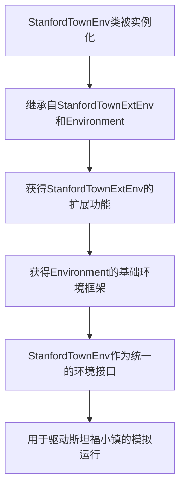

# `.\MetaGPT\metagpt\environment\stanford_town\stanford_town_env.py` 详细设计文档

该文件定义了一个名为StanfordTownEnv的类，它通过多重继承将StanfordTownExtEnv的功能与基础的Environment框架相结合，为斯坦福小镇（Stanford Town）项目提供了一个具体的环境实现。

## 整体流程



## 类结构

```
Environment (基础环境类)
├── StanfordTownExtEnv (斯坦福小镇扩展环境)
└── StanfordTownEnv (斯坦福小镇环境，继承上述两者)
```

## 全局变量及字段


    

## 全局函数及方法


## 关键组件


### 环境基类继承

通过继承 `Environment` 基类，`StanfordTownEnv` 获得了标准环境交互、状态管理和智能体协调等核心框架能力。

### 扩展功能集成

通过继承 `StanfordTownExtEnv`，`StanfordTownEnv` 集成了针对 Stanford Town 模拟环境的特定扩展功能，如自定义的地图、角色行为规则或交互接口。


## 问题及建议


### 已知问题

-   **空实现类**：`StanfordTownEnv` 类仅通过多重继承组合了 `StanfordTownExtEnv` 和 `Environment` 类，自身未定义任何新的字段、方法或逻辑。这种“空壳”类可能表明设计意图不明确，或者是为了满足某个接口要求而进行的临时性设计，缺乏实质性的功能封装。
-   **潜在的命名混淆**：类名 `StanfordTownEnv` 与父类 `StanfordTownExtEnv` 名称高度相似，容易造成混淆，可能让开发者误解两者的职责和区别。
-   **紧耦合风险**：该类直接继承了 `StanfordTownExtEnv` 的具体实现，而非其抽象接口（如果存在的话）。这可能导致 `StanfordTownEnv` 与 `StanfordTownExtEnv` 的实现细节紧密耦合，降低了代码的灵活性和可测试性。

### 优化建议

-   **明确类的职责**：应重新审视 `StanfordTownEnv` 类的设计目标。如果它确实不需要添加任何特定于 `StanfordTown` 环境的额外行为或状态，考虑是否可以直接使用 `StanfordTownExtEnv` 实例，从而消除这个冗余的类。如果需要它作为一个统一的、不可修改的“最终”环境接口，则应添加明确的文档说明。
-   **考虑使用组合替代继承**：如果 `StanfordTownEnv` 的目的是为了整合或包装 `StanfordTownExtEnv` 的功能，并可能添加一些环境相关的通用逻辑（如初始化、状态重置等），可以考虑使用组合模式。即，让 `StanfordTownEnv` 持有一个 `StanfordTownExtEnv` 实例作为成员，并通过委托调用其方法，这样可以更灵活地控制行为并降低耦合度。
-   **改进命名**：如果该类必须保留，建议为其赋予一个能更清晰反映其独特角色或用途的名称，例如 `StanfordTownFinalEnv` 或 `StanfordTownRuntimeEnv`，以区别于其父类。
-   **添加文档字符串**：为 `StanfordTownEnv` 类添加详细的文档字符串，明确说明其存在的理由、设计意图以及它与其父类的关系，避免未来的开发者产生困惑。


## 其它


### 设计目标与约束

该代码的设计目标是创建一个名为 `StanfordTownEnv` 的环境类，用于在 MetaGPT 框架中集成 StanfordTown 扩展环境。其核心约束是：
1.  **继承性**：该类必须同时继承自 `StanfordTownExtEnv`（提供 StanfordTown 特定的环境功能）和 `Environment`（提供 MetaGPT 框架内环境的基础接口和通用行为）。
2.  **最小化实现**：作为两个父类的具体组合，`StanfordTownEnv` 类本身不添加任何新的字段或方法，其存在的主要目的是提供一个符合 MetaGPT `Environment` 接口的、具备 StanfordTown 扩展功能的统一环境类。
3.  **接口兼容性**：确保通过多重继承，`StanfordTownEnv` 的实例能够无缝替换 MetaGPT 框架中期望 `Environment` 类型对象的地方，同时具备 `StanfordTownExtEnv` 的所有能力。

### 错误处理与异常设计

由于 `StanfordTownEnv` 类本身是空实现（`pass`），其错误处理和异常机制完全依赖于其父类：
1.  **错误传播**：任何在 `StanfordTownEnv` 实例上调用方法时发生的错误或异常，都将直接由 `StanfordTownExtEnv` 或 `Environment` 父类中对应的方法抛出。例如，如果 `step`、`reset` 等方法在父类中定义了异常处理，那么这些处理将生效。
2.  **无新增异常**：`StanfordTownEnv` 类自身不定义、不捕获、也不转换任何新的异常类型。
3.  **依赖父类契约**：使用者需要查阅 `StanfordTownExtEnv` 和 `Environment` 的文档或源码，以了解具体操作可能抛出的异常类型（如 `ValueError`, `RuntimeError`, 或自定义的环境异常等）及其触发条件。

### 数据流与状态机

`StanfordTownEnv` 作为环境类，其数据流和状态管理逻辑封装于父类中：
1.  **状态持有**：环境内部的状态（如智能体位置、对象状态、任务进度等）由 `StanfordTownExtEnv` 管理。`Environment` 基类可能定义了状态访问和更新的通用接口。
2.  **数据输入**：外部系统（如 MetaGPT 的模拟引擎或驱动脚本）通过调用继承自父类的方法（如 `step(action)`）向环境输入动作或指令。
3.  **数据输出**：环境通过方法返回值（通常是观察、奖励、完成标志等信息）将执行结果反馈给外部系统。具体的数据格式和内容由 `StanfordTownExtEnv` 的实现决定。
4.  **状态转移**：每次 `step` 调用都可能触发环境状态的内部转移，这个转移逻辑完全在 `StanfordTownExtEnv` 中定义。`StanfordTownEnv` 仅作为一个透明的管道。

### 外部依赖与接口契约

1.  **外部依赖**：
    *   **Python**：特定的解释器版本（由 `#!/usr/bin/env python` 暗示）。
    *   **MetaGPT 框架**：强依赖 `metagpt.environment.base_env` 和 `metagpt.environment.stanford_town.stanford_town_ext_env` 模块。项目的成功运行需要这些模块被正确安装和导入。
    *   **StanfordTownExtEnv 的实现**：强依赖 `StanfordTownExtEnv` 类的具体实现，包括其可能依赖的第三方库（如特定模拟器、数据库客户端等）。

2.  **接口契约**：
    *   **实现契约**：`StanfordTownEnv` 隐式地承诺提供 `StanfordTownExtEnv` 和 `Environment` 两个父类所定义的所有公共方法和属性的实现。
    *   **使用契约**：其他代码可以将 `StanfordTownEnv` 的实例当作 `Environment` 类型来使用，并期望它能响应 `Environment` 接口定义的所有操作，同时具备 StanfordTown 的特殊行为。它也必须满足 `StanfordTownExtEnv` 可能对使用方式提出的任何额外要求（如初始化参数、调用顺序等）。

    