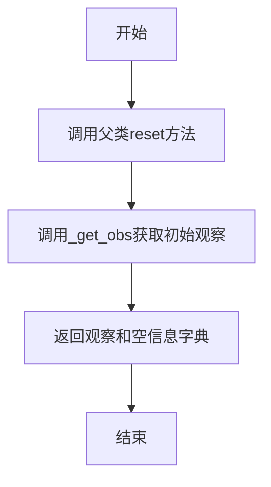
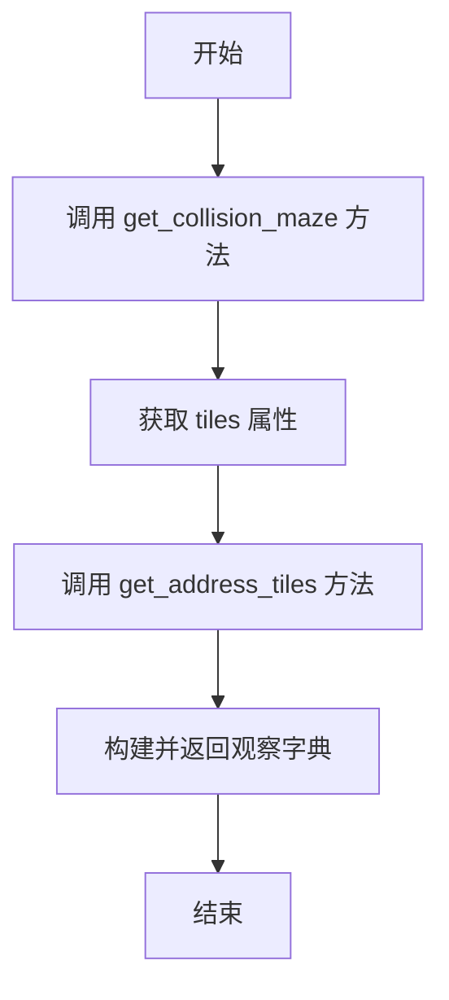
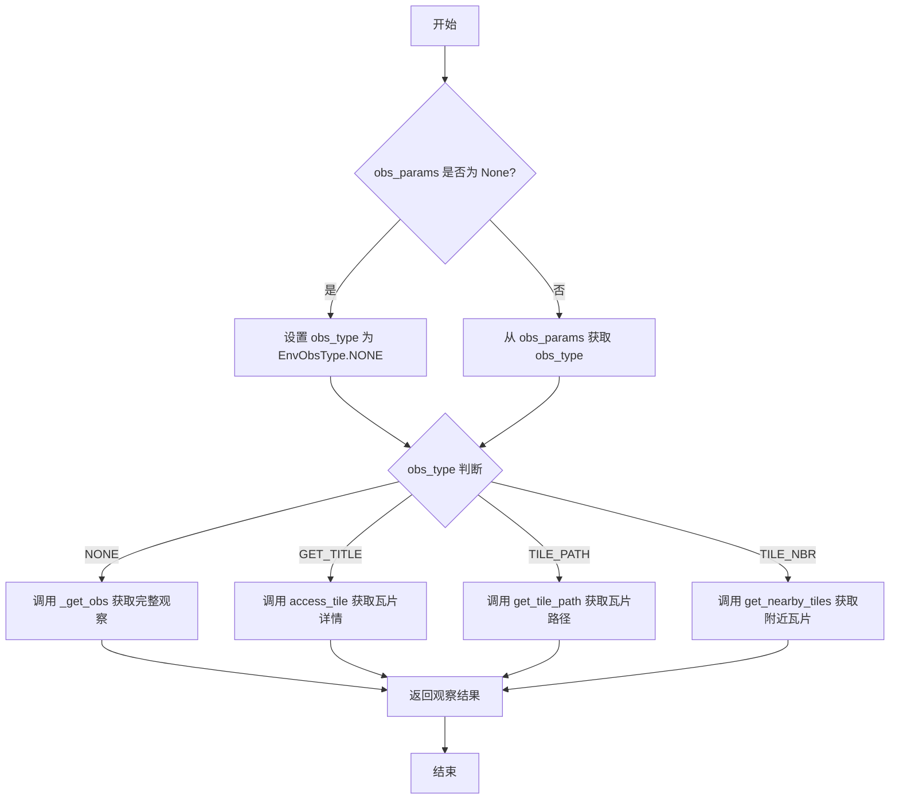
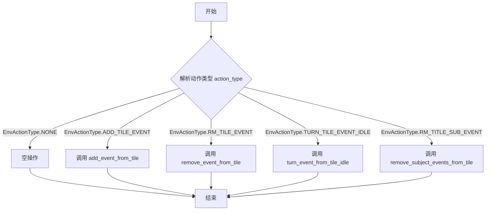
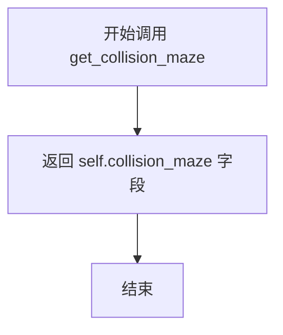
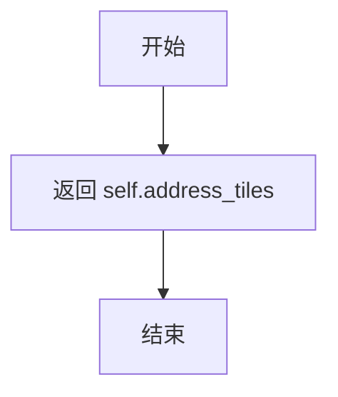
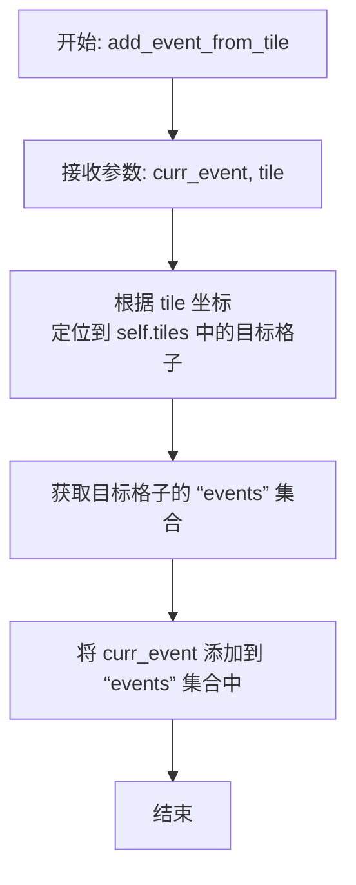
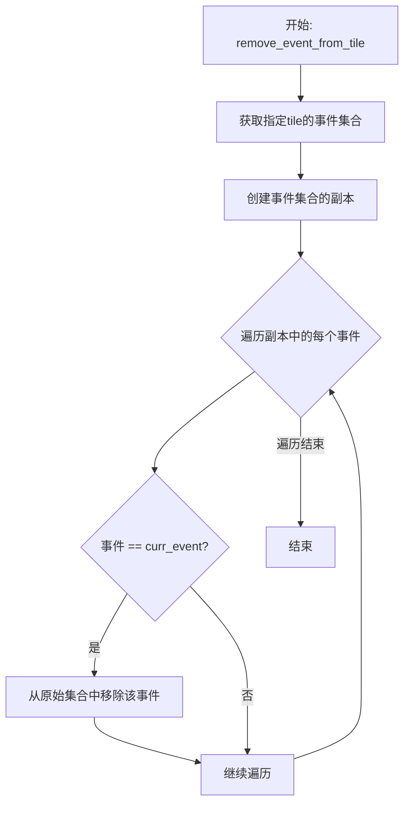
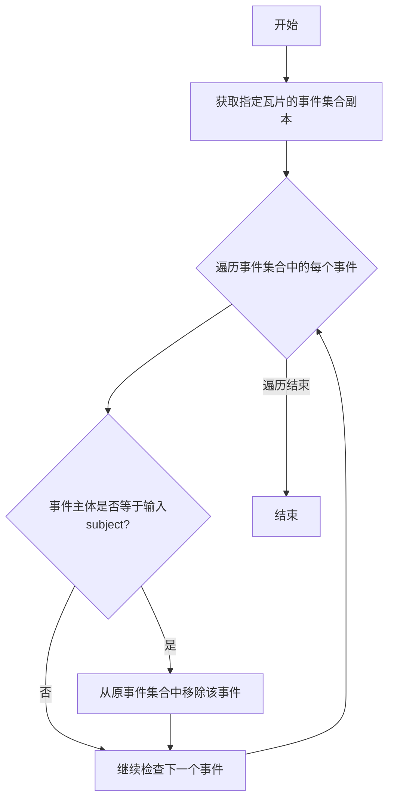

# `.\MetaGPT\metagpt\environment\stanford_town\stanford_town_ext_env.py` 详细设计文档

该文件实现了一个名为StanfordTownExtEnv的类，它继承自ExtEnv，用于模拟斯坦福小镇的外部环境。其核心功能是加载和管理一个基于网格的迷宫地图，该地图定义了虚拟世界的空间布局、碰撞检测、区域划分（世界、区域、竞技场、游戏对象）以及生成点。环境支持智能体（如生成式代理）通过动作（如添加/移除事件）与之交互，并获取观察结果（如碰撞信息、附近瓦片、瓦片详情），从而为基于网格的模拟或游戏提供一个可交互的底层环境框架。

## 整体流程

```mermaid
graph TD
    A[开始: 初始化StanfordTownExtEnv] --> B[调用模型验证器 _init_maze]
    B --> C[读取迷宫元信息 maze_meta_info.json]
    C --> D[读取特殊区块定义文件 (CSV)]
    D --> E[读取迷宫矩阵文件 (CSV)]
    E --> F[将一维CSV数据转换为二维网格 tiles]
        F --> G[为每个瓦片构建详细信息字典]
        G --> H[为游戏对象瓦片初始化默认事件]
        H --> I[构建地址到瓦片坐标的反向映射 address_tiles]
        I --> J[设置动作空间和观察空间]
        J --> K[环境就绪，等待 reset/step/observe 调用]
        K --> L{调用环境方法}
        L -->|reset| M[调用 _get_obs 返回初始观察]
        L -->|step| N[执行 _execute_env_action]
        N --> O[根据动作类型调用对应方法 (如 add_event_from_tile)]
        O --> P[调用 _get_obs 返回新观察]
        L -->|observe| Q[根据观察参数类型调用对应方法 (如 access_tile)]
        M --> R[返回观察结果]
        P --> R
        Q --> R
```

## 类结构

```
ExtEnv (基础环境类，来自 metagpt.environment.base_env)
└── StanfordTownExtEnv (斯坦福小镇外部环境实现类)
```

## 全局变量及字段


### `StanfordTownExtEnv.model_config`
    
Pydantic模型配置，允许任意类型以支持复杂字段。

类型：`pydantic.ConfigDict`
    


### `StanfordTownExtEnv.maze_asset_path`
    
存储迷宫资源文件（如地图矩阵、特殊区块定义）的目录路径。

类型：`Optional[Path]`
    


### `StanfordTownExtEnv.maze_width`
    
迷宫地图的宽度（以瓦片为单位）。

类型：`int`
    


### `StanfordTownExtEnv.maze_height`
    
迷宫地图的高度（以瓦片为单位）。

类型：`int`
    


### `StanfordTownExtEnv.sq_tile_size`
    
每个正方形瓦片的像素高度/宽度，用于坐标转换。

类型：`int`
    


### `StanfordTownExtEnv.special_constraint`
    
描述世界可能具有的任何相关特殊约束的字符串。

类型：`str`
    


### `StanfordTownExtEnv.tiles`
    
二维列表，表示迷宫中每个瓦片的详细信息，包括世界、区域、游戏对象、碰撞状态和事件集合。

类型：`list[list[dict]]`
    


### `StanfordTownExtEnv.address_tiles`
    
反向索引字典，将字符串地址（如'世界:区域:竞技场:对象'）映射到属于该地址的所有瓦片坐标集合，用于路径查找优化。

类型：`dict[str, set]`
    


### `StanfordTownExtEnv.collision_maze`
    
二维列表，表示迷宫的碰撞矩阵，其中非'0'值表示该瓦片存在碰撞障碍。

类型：`list[list]`
    
    

## 全局函数及方法


### `StanfordTownExtEnv._init_maze`

这是一个Pydantic模型验证器方法，在类实例化之前被调用。它的核心功能是初始化迷宫环境，从指定的资产路径加载迷宫元数据、特殊区块定义以及多个二维矩阵（如碰撞、区域、游戏对象等），并将这些原始数据转换为内部数据结构（如`tiles`和`address_tiles`），最终设置环境的动作空间和观察空间。

参数：

-  `cls`：`type`，指向`StanfordTownExtEnv`类本身的类对象。
-  `values`：`dict`，包含待验证和初始化的模型字段原始值的字典。

返回值：`dict`，返回一个更新后的字典，其中包含了所有初始化后的字段值（如`maze_width`, `tiles`, `collision_maze`, `address_tiles`, `action_space`, `observation_space`等），Pydantic将使用此字典来创建最终的模型实例。

#### 流程图

```mermaid
flowchart TD
    A[开始: _init_maze(cls, values)] --> B{检查 maze_asset_path};
    B -- 存在 --> C[加载迷宫元信息 JSON];
    B -- 不存在/断言失败 --> Z[抛出异常];
    C --> D[从元信息设置<br/>maze_width, maze_height 等];
    D --> E[加载特殊区块 CSV 文件<br/>(world, sector, arena, game_object, spawning_location)];
    E --> F[加载迷宫矩阵 CSV 文件<br/>(collision, sector, arena, game_object, spawning_location)];
    F --> G[将一维CSV数据<br/>转换为二维矩阵];
    G --> H[遍历所有格子 (i, j)<br/>构建 tiles 字典];
    H --> I[为每个有 game_object 的格子<br/>创建默认事件];
    I --> J[构建反向索引 address_tiles<br/>(地址 -> 坐标集合)];
    J --> K[设置 action_space 和 observation_space];
    K --> L[返回更新后的 values 字典];
```

#### 带注释源码

```python
    @model_validator(mode="before")
    @classmethod
    def _init_maze(cls, values):
        # 1. 获取并验证迷宫资源路径
        maze_asset_path = values["maze_asset_path"]
        assert maze_asset_path
        maze_asset_path = Path(maze_asset_path)

        # 2. 加载迷宫元数据（宽、高、瓦片大小、特殊约束）
        maze_matrix_path = maze_asset_path.joinpath("matrix")
        meta_info = read_json_file(maze_matrix_path.joinpath("maze_meta_info.json"))

        maze_width = int(meta_info["maze_width"])
        maze_height = int(meta_info["maze_height"])
        values["maze_width"] = maze_width
        values["maze_height"] = maze_height
        values["sq_tile_size"] = int(meta_info["sq_tile_size"])
        values["special_constraint"] = meta_info["special_constraint"]

        # 3. 读取特殊区块定义文件（CSV格式），将区块ID映射到描述字符串
        blocks_folder = maze_matrix_path.joinpath("special_blocks")

        _wb = blocks_folder.joinpath("world_blocks.csv")
        wb_rows = read_csv_to_list(_wb, header=False)
        wb = wb_rows[0][-1]  # 世界区块（通常只有一个）

        _sb = blocks_folder.joinpath("sector_blocks.csv")
        sb_rows = read_csv_to_list(_sb, header=False)
        sb_dict = dict()
        for i in sb_rows:
            sb_dict[i[0]] = i[-1]  # 映射：区块ID -> 描述

        _ab = blocks_folder.joinpath("arena_blocks.csv")
        ab_rows = read_csv_to_list(_ab, header=False)
        ab_dict = dict()
        for i in ab_rows:
            ab_dict[i[0]] = i[-1]  # 映射：区块ID -> 描述

        _gob = blocks_folder.joinpath("game_object_blocks.csv")
        gob_rows = read_csv_to_list(_gob, header=False)
        gob_dict = dict()
        for i in gob_rows:
            gob_dict[i[0]] = i[-1]  # 映射：区块ID -> 描述

        _slb = blocks_folder.joinpath("spawning_location_blocks.csv")
        slb_rows = read_csv_to_list(_slb, header=False)
        slb_dict = dict()
        for i in slb_rows:
            slb_dict[i[0]] = i[-1]  # 映射：区块ID -> 描述

        # 4. 加载迷宫矩阵（碰撞、区域、游戏对象、出生点等）
        maze_folder = maze_matrix_path.joinpath("maze")

        _cm = maze_folder.joinpath("collision_maze.csv")
        collision_maze_raw = read_csv_to_list(_cm, header=False)[0]  # 读取为单行列表
        _sm = maze_folder.joinpath("sector_maze.csv")
        sector_maze_raw = read_csv_to_list(_sm, header=False)[0]
        _am = maze_folder.joinpath("arena_maze.csv")
        arena_maze_raw = read_csv_to_list(_am, header=False)[0]
        _gom = maze_folder.joinpath("game_object_maze.csv")
        game_object_maze_raw = read_csv_to_list(_gom, header=False)[0]
        _slm = maze_folder.joinpath("spawning_location_maze.csv")
        spawning_location_maze_raw = read_csv_to_list(_slm, header=False)[0]

        # 5. 将一维的CSV数据根据迷宫宽度转换为二维矩阵
        collision_maze = []
        sector_maze = []
        arena_maze = []
        game_object_maze = []
        spawning_location_maze = []
        for i in range(0, len(collision_maze_raw), maze_width):
            tw = maze_width
            collision_maze += [collision_maze_raw[i : i + tw]]
            sector_maze += [sector_maze_raw[i : i + tw]]
            arena_maze += [arena_maze_raw[i : i + tw]]
            game_object_maze += [game_object_maze_raw[i : i + tw]]
            spawning_location_maze += [spawning_location_maze_raw[i : i + tw]]
        values["collision_maze"] = collision_maze  # 存储碰撞矩阵

        # 6. 构建核心的 `tiles` 数据结构：一个二维列表，每个元素是一个包含该格子所有属性的字典。
        tiles = []
        for i in range(maze_height):
            row = []
            for j in range(maze_width):
                tile_details = dict()
                tile_details["world"] = wb  # 世界属性（全局一致）

                # 根据矩阵中的ID，从对应的字典中查找并设置描述
                tile_details["sector"] = ""
                if sector_maze[i][j] in sb_dict:
                    tile_details["sector"] = sb_dict[sector_maze[i][j]]

                tile_details["arena"] = ""
                if arena_maze[i][j] in ab_dict:
                    tile_details["arena"] = ab_dict[arena_maze[i][j]]

                tile_details["game_object"] = ""
                if game_object_maze[i][j] in gob_dict:
                    tile_details["game_object"] = gob_dict[game_object_maze[i][j]]

                tile_details["spawning_location"] = ""
                if spawning_location_maze[i][j] in slb_dict:
                    tile_details["spawning_location"] = slb_dict[spawning_location_maze[i][j]]

                # 碰撞属性：如果碰撞矩阵中对应值不为"0"，则表示有碰撞
                tile_details["collision"] = False
                if collision_maze[i][j] != "0":
                    tile_details["collision"] = True

                tile_details["events"] = set()  # 初始化事件集合为空
                row += [tile_details]
            tiles += [row]
        values["tiles"] = tiles  # 存储完整的格子信息

        # 7. 为每个有游戏对象的格子创建一个默认事件
        for i in range(maze_height):
            for j in range(maze_width):
                if tiles[i][j]["game_object"]:
                    # 构建游戏对象的完整地址字符串
                    object_name = ":".join(
                        [tiles[i][j]["world"], tiles[i][j]["sector"], tiles[i][j]["arena"], tiles[i][j]["game_object"]]
                    )
                    go_event = (object_name, None, None, None)  # 创建事件元组
                    tiles[i][j]["events"].add(go_event)  # 添加到该格子的事件集合中

        # 8. 构建反向索引 `address_tiles`：一个字典，键是地址字符串，值是该地址对应的所有格子坐标的集合。
        #    用于高效地根据地址查找位置，例如路径规划。
        address_tiles = dict()
        for i in range(maze_height):
            for j in range(maze_width):
                addresses = []
                # 根据格子属性构建不同层级的地址
                if tiles[i][j]["sector"]:
                    add = f'{tiles[i][j]["world"]}:'
                    add += f'{tiles[i][j]["sector"]}'
                    addresses += [add]
                if tiles[i][j]["arena"]:
                    add = f'{tiles[i][j]["world"]}:'
                    add += f'{tiles[i][j]["sector"]}:'
                    add += f'{tiles[i][j]["arena"]}'
                    addresses += [add]
                if tiles[i][j]["game_object"]:
                    add = f'{tiles[i][j]["world"]}:'
                    add += f'{tiles[i][j]["sector"]}:'
                    add += f'{tiles[i][j]["arena"]}:'
                    add += f'{tiles[i][j]["game_object"]}'
                    addresses += [add]
                if tiles[i][j]["spawning_location"]:
                    add = f'<spawn_loc>{tiles[i][j]["spawning_location"]}'
                    addresses += [add]

                # 将当前坐标 (j, i) 添加到每个地址对应的集合中
                for add in addresses:
                    if add in address_tiles:
                        address_tiles[add].add((j, i))
                    else:
                        address_tiles[add] = set([(j, i)])
        values["address_tiles"] = address_tiles  # 存储反向索引

        # 9. 设置强化学习环境所需的空间定义
        values["action_space"] = get_action_space((maze_width, maze_height))
        values["observation_space"] = get_observation_space()
        
        # 10. 返回更新后的所有字段值，供Pydantic创建实例
        return values
```


### `StanfordTownExtEnv.reset`

该方法用于重置StanfordTown外部环境，并获取初始观察状态。它继承并调用了父类的`reset`方法，然后通过内部方法`_get_obs`获取环境的初始观察数据，最后返回一个包含初始观察状态和一个空信息字典的元组。

参数：

- `seed`：`Optional[int]`，可选参数，用于设置随机数生成器的种子，确保环境重置的可重复性。
- `options`：`Optional[dict[str, Any]]`，可选参数，一个字典，包含重置环境时可能需要的额外选项或配置。

返回值：`tuple[dict[str, EnvObsValType], dict[str, Any]]`，返回一个元组，第一个元素是初始观察状态的字典，第二个元素是一个空的信息字典（在本实现中始终为空）。

#### 流程图



#### 带注释源码

```python
def reset(
    self,
    *,
    seed: Optional[int] = None,
    options: Optional[dict[str, Any]] = None,
) -> tuple[dict[str, EnvObsValType], dict[str, Any]]:
    """reset env and get the init observation
    Return results corresponding to `observation, info`
    """
    # 调用父类ExtEnv的reset方法，传递种子和选项参数
    super().reset(seed=seed, options=options)

    # 调用内部方法_get_obs获取环境的初始观察状态
    obs = self._get_obs()

    # 返回一个元组，包含初始观察状态和一个空的信息字典
    return obs, {}
```


### `StanfordTownExtEnv._get_obs`

该方法用于获取斯坦福小镇外部环境的完整观察状态。它返回一个字典，包含碰撞迷宫信息、所有瓦片的详细信息以及地址到瓦片坐标的映射关系，为智能体提供环境状态的全面快照。

参数：无

返回值：`dict[str, EnvObsValType]`，返回一个字典，包含以下键值对：
- `"collision_maze"`：表示碰撞迷宫的二维列表，用于检测移动障碍。
- `"tiles"`：表示所有瓦片的详细信息列表，包含每个瓦片的世界、区域、竞技场、游戏对象、生成位置、碰撞状态和事件信息。
- `"address_tiles"`：表示地址到瓦片坐标集合的映射字典，用于快速查找特定地址对应的瓦片位置。

#### 流程图



#### 带注释源码

```python
def _get_obs(self) -> dict[str, EnvObsValType]:
    """Get observation"""
    return {
        "collision_maze": self.get_collision_maze(),  # 获取碰撞迷宫信息
        "tiles": self.tiles,  # 获取所有瓦片的详细信息
        "address_tiles": self.get_address_tiles(),  # 获取地址到瓦片坐标的映射
    }
```

### `StanfordTownExtEnv.observe`

该方法根据传入的观察参数（`obs_params`）返回环境的不同类型的观察结果。它支持获取完整环境状态、特定瓦片详情、瓦片路径或附近瓦片列表。

参数：

- `obs_params`：`Optional[EnvObsParams]`，观察参数对象，包含观察类型、坐标、层级和视野半径等信息。如果为`None`，则返回完整环境观察。

返回值：`Any`，根据观察类型返回相应的观察结果，可能是字典、列表或字符串。

#### 流程图



#### 带注释源码

```python
def observe(self, obs_params: Optional[EnvObsParams] = None) -> Any:
    """Get partial or full observation from the env"""
    # 确定观察类型：如果未提供参数，则默认为 NONE 类型
    obs_type = obs_params.obs_type if obs_params else EnvObsType.NONE
    
    # 根据观察类型调用不同的内部方法获取观察结果
    if obs_type == EnvObsType.NONE:
        # 获取完整环境观察，包括碰撞迷宫、瓦片详情和地址瓦片映射
        obs = self._get_obs()
    elif obs_type == EnvObsType.GET_TITLE:
        # 获取指定坐标瓦片的详细信息
        obs = self.access_tile(tile=obs_params.coord)
    elif obs_type == EnvObsType.TILE_PATH:
        # 获取指定坐标瓦片的路径字符串（根据层级）
        obs = self.get_tile_path(tile=obs_params.coord, level=obs_params.level)
    elif obs_type == EnvObsType.TILE_NBR:
        # 获取指定坐标附近指定视野半径内的瓦片列表
        obs = self.get_nearby_tiles(tile=obs_params.coord, vision_r=obs_params.vision_radius)
    
    # 返回观察结果
    return obs
```


### `StanfordTownExtEnv.step`

该方法执行给定的环境动作，更新环境状态，并返回执行后的观察结果、奖励、终止标志、截断标志和额外信息。它是环境交互的核心方法，遵循标准的强化学习环境接口。

参数：

- `action`：`EnvAction`，表示要执行的环境动作，包含动作类型、坐标、事件等信息。

返回值：`tuple[dict[str, EnvObsValType], float, bool, bool, dict[str, Any]]`，返回一个五元组，包含：
  - 观察结果：一个字典，包含碰撞迷宫、所有瓦片信息、地址到瓦片的映射。
  - 奖励：一个浮点数，当前固定返回1.0。
  - 终止标志：一个布尔值，表示环境是否因执行动作出错而终止。
  - 截断标志：一个布尔值，表示环境是否因达到最大步数而被截断（当前固定返回False）。
  - 额外信息：一个字典，包含其他调试或状态信息（当前返回空字典）。

#### 流程图

```mermaid
flowchart TD
    A[开始: step(action)] --> B{执行动作 action};
    B --> C[调用 _execute_env_action(action)];
    C --> D{执行过程是否发生异常?};
    D -- 是 --> E[设置 terminated = True];
    D -- 否 --> F[保持 terminated = False];
    E --> G;
    F --> G[获取环境观察 obs = _get_obs()];
    G --> H[构造返回元组 ret];
    H --> I[返回 ret];
```

#### 带注释源码

```python
def step(self, action: EnvAction) -> tuple[dict[str, EnvObsValType], float, bool, bool, dict[str, Any]]:
    """Execute action and then return observation
    Return results corresponding to `observation, reward, terminated, truncated, info`
    """
    # 初始化终止标志为False
    terminated = False
    try:
        # 尝试执行传入的动作
        self._execute_env_action(action)
    except Exception:
        # 如果执行过程中发生任何异常，则将环境状态标记为终止
        terminated = True

    # 无论动作执行成功与否，都获取当前的环境观察状态
    obs = self._get_obs()

    # 构造标准的强化学习环境step返回值
    # obs: 观察状态
    # 1.0: 固定奖励值
    # terminated: 是否因错误终止
    # False: 是否因步数限制被截断（当前未实现）
    # {}: 额外的信息字典（当前为空）
    ret = (obs, 1.0, terminated, False, {})
    return ret
```


### `StanfordTownExtEnv._execute_env_action`

该方法根据传入的环境动作类型，执行相应的地图瓦片事件操作，包括添加事件、移除事件、将事件转为空闲状态以及移除特定主体的事件。

参数：

- `action`：`EnvAction`，包含动作类型、坐标、事件或主体等信息的环境动作对象

返回值：`None`，无返回值

#### 流程图



#### 带注释源码

```python
def _execute_env_action(self, action: EnvAction):
    # 从动作对象中提取动作类型
    action_type = action.action_type
    # 根据不同的动作类型，调用相应的内部方法处理瓦片事件
    if action_type == EnvActionType.NONE:
        # 空操作，直接跳过
        pass
    elif action_type == EnvActionType.ADD_TILE_EVENT:
        # 向指定坐标的瓦片添加一个事件
        self.add_event_from_tile(curr_event=action.event, tile=action.coord)
    elif action_type == EnvActionType.RM_TILE_EVENT:
        # 从指定坐标的瓦片移除一个特定事件
        self.remove_event_from_tile(curr_event=action.event, tile=action.coord)
    elif action_type == EnvActionType.TURN_TILE_EVENT_IDLE:
        # 将指定坐标瓦片上的一个特定事件转为空闲状态（即清空其非主体字段）
        self.turn_event_from_tile_idle(curr_event=action.event, tile=action.coord)
    elif action_type == EnvActionType.RM_TITLE_SUB_EVENT:
        # 从指定坐标的瓦片移除所有属于特定主体的事件
        self.remove_subject_events_from_tile(subject=action.subject, tile=action.coord)
```


### `StanfordTownExtEnv.turn_coordinate_to_tile`

将像素坐标系中的坐标转换为迷宫网格（Tile）坐标系中的坐标。该方法通过将像素坐标的X和Y分量分别除以单个网格的像素尺寸（`sq_tile_size`）并向上取整，计算出对应的网格坐标。

参数：
-  `px_coordinate`：`tuple[int, int]`，输入的像素坐标，格式为 (x, y)。

返回值：`tuple[int, int]`，转换后的网格坐标，格式为 (x, y)。

#### 流程图

```mermaid
flowchart TD
    A[开始: turn_coordinate_to_tile(px_coordinate)] --> B[计算x: ceil(px_x / sq_tile_size)]
    A --> C[计算y: ceil(px_y / sq_tile_size)]
    B --> D[返回转换后的网格坐标 (x, y)]
    C --> D
```

#### 带注释源码

```
def turn_coordinate_to_tile(self, px_coordinate: tuple[int, int]) -> tuple[int, int]:
    """
    Turns a pixel coordinate to a tile coordinate.
    """
    # 将像素坐标的X分量除以网格像素尺寸，并向上取整，得到网格X坐标
    x = math.ceil(px_coordinate[0] / self.sq_tile_size)
    # 将像素坐标的Y分量除以网格像素尺寸，并向上取整，得到网格Y坐标
    y = math.ceil(px_coordinate[1] / self.sq_tile_size)
    # 返回转换后的网格坐标 (x, y)
    return x, y
```


### `StanfordTownExtEnv.get_collision_maze`

该方法是一个简单的读取器（getter），用于获取环境中的碰撞迷宫数据。它被 `@mark_as_readable` 装饰器标记，表明该方法用于安全地读取内部状态，而不进行任何修改。

参数：
-  `self`：`StanfordTownExtEnv`，当前 `StanfordTownExtEnv` 类的实例。

返回值：`list`，返回存储在 `self.collision_maze` 中的二维列表，该列表表示整个地图的碰撞信息。列表中的每个元素对应地图上的一个图块（tile），非零值通常表示该位置存在碰撞障碍。

#### 流程图



#### 带注释源码

```
    @mark_as_readable  # 装饰器，标记此方法为“可读”操作，通常用于权限控制或日志记录。
    def get_collision_maze(self) -> list:  # 方法定义，返回类型为 list。
        return self.collision_maze  # 直接返回实例的 collision_maze 字段。
```


### `StanfordTownExtEnv.get_address_tiles`

该方法用于获取环境中的地址到瓦片坐标的映射字典。该字典是一个反向索引，允许通过地址字符串（如“double studio:recreation:pool table”）快速查找到所有属于该地址的瓦片坐标集合。这主要用于优化角色移动路径的查找。

参数：无

返回值：`dict`，返回一个字典，其中键为地址字符串，值为包含该地址所有瓦片坐标的集合。

#### 流程图



#### 带注释源码

```python
@mark_as_readable
def get_address_tiles(self) -> dict:
    # 返回预先计算好的地址到瓦片坐标的映射字典
    # 该字典在类初始化时通过 _init_maze 方法构建
    return self.address_tiles
```


### `StanfordTownExtEnv.access_tile`

该方法用于获取指定坐标位置的瓦片（tile）的详细信息。它接收一个瓦片坐标，返回该坐标在迷宫地图中对应的瓦片数据字典，其中包含了该瓦片所属的世界、区域、竞技场、游戏对象、生成点、碰撞状态以及发生的事件等信息。

参数：
- `tile`：`tuple[int, int]`，目标瓦片的坐标，格式为 (x, y)。

返回值：`dict`，返回指定坐标处瓦片的详细信息字典。

#### 流程图

```mermaid
flowchart TD
    A[开始: access_tile(tile)] --> B[解析坐标: x = tile[0], y = tile[1]]
    B --> C[访问二维数组: self.tiles[y][x]]
    C --> D[返回瓦片详情字典]
    D --> E[结束]
```

#### 带注释源码

```python
@mark_as_readable  # 装饰器，标记此方法为环境可读接口
def access_tile(self, tile: tuple[int, int]) -> dict:
    """
    Returns the tiles details dictionary that is stored in self.tiles of the
    designated x, y location.

    INPUT
      tile: The tile coordinate of our interest in (x, y) form.
    OUTPUT
      The tile detail dictionary for the designated tile.
    EXAMPLE OUTPUT
      Given (58, 9),
      self.tiles[9][58] = {'world': 'double studio',
            'sector': 'double studio', 'arena': 'bedroom 2',
            'game_object': 'bed', 'spawning_location': 'bedroom-2-a',
            'collision': False,
            'events': {('double studio:double studio:bedroom 2:bed',
                       None, None)}}
    """
    x = tile[0]  # 从输入元组中提取横坐标x
    y = tile[1]  # 从输入元组中提取纵坐标y
    return self.tiles[y][x]  # 返回self.tiles二维列表中对应位置的字典。
    # 注意：数据结构中y（行）在前，x（列）在后。
```


### `StanfordTownExtEnv.get_tile_path`

根据给定的瓦片坐标和层级，返回该瓦片的字符串地址。该方法通过拼接瓦片在不同层级（world、sector、arena、game_object）上的信息来构建地址。

参数：
- `tile`：`tuple[int, int]`，目标瓦片的坐标，格式为 (x, y)。
- `level`：`str`，指定要获取的地址层级，可选值为 "world"、"sector"、"arena" 或 "game_object"。

返回值：`str`，返回指定层级的瓦片字符串地址。

#### 流程图

```mermaid
flowchart TD
    A[开始] --> B[获取瓦片坐标 (x, y)]
    B --> C[从 self.tiles 中获取瓦片详情字典]
    C --> D[初始化路径为 world 信息]
    D --> E{level 是否为 'world'?}
    E -- 是 --> F[返回路径]
    E -- 否 --> G[拼接 sector 信息]
    G --> H{level 是否为 'sector'?}
    H -- 是 --> F
    H -- 否 --> I[拼接 arena 信息]
    I --> J{level 是否为 'arena'?}
    J -- 是 --> F
    J -- 否 --> K[拼接 game_object 信息]
    K --> F
    F --> L[结束]
```

#### 带注释源码

```python
@mark_as_readable
def get_tile_path(self, tile: tuple[int, int], level: str) -> str:
    """
    Get the tile string address given its coordinate. You designate the level
    by giving it a string level description.

    INPUT:
      tile: The tile coordinate of our interest in (x, y) form.
      level: world, sector, arena, or game object
    OUTPUT
      The string address for the tile.
    EXAMPLE OUTPUT
      Given tile=(58, 9), and level=arena,
      "double studio:double studio:bedroom 2"
    """
    x = tile[0]  # 获取瓦片的 x 坐标
    y = tile[1]  # 获取瓦片的 y 坐标
    tile = self.tiles[y][x]  # 从 tiles 列表中获取对应坐标的瓦片详情字典

    path = f"{tile['world']}"  # 初始化路径，包含 world 信息
    if level == "world":  # 如果层级为 world，直接返回路径
        return path
    else:
        path += f":{tile['sector']}"  # 否则拼接 sector 信息

    if level == "sector":  # 如果层级为 sector，返回路径
        return path
    else:
        path += f":{tile['arena']}"  # 否则拼接 arena 信息

    if level == "arena":  # 如果层级为 arena，返回路径
        return path
    else:
        path += f":{tile['game_object']}"  # 否则拼接 game_object 信息

    return path  # 返回最终拼接的路径
```

### `StanfordTownExtEnv.get_nearby_tiles`

给定当前瓦片坐标和视野半径，返回一个列表，包含所有在指定半径范围内的瓦片坐标。该方法采用正方形边界来确定哪些瓦片在半径内，即对于给定的视野半径，返回一个以目标瓦片为中心、边长为 `2 * vision_r + 1` 的正方形区域内的所有瓦片坐标。

参数：

- `tile`：`tuple[int, int]`，目标瓦片的坐标，格式为 (x, y)。
- `vision_r`：`int`，视野半径，用于确定搜索范围。

返回值：`list[tuple[int, int]]`，一个包含所有在视野半径范围内的瓦片坐标的列表。

#### 流程图

```mermaid
flowchart TD
    A[开始] --> B[计算左边界 left_end]
    B --> C[计算右边界 right_end]
    C --> D[计算上边界 top_end]
    D --> E[计算下边界 bottom_end]
    E --> F[初始化 nearby_tiles 列表]
    F --> G[遍历 i 从 left_end 到 right_end]
    G --> H[遍历 j 从 top_end 到 bottom_end]
    H --> I[将 (i, j) 添加到 nearby_tiles]
    I --> J{是否遍历完所有 j?}
    J -->|否| H
    J -->|是| K{是否遍历完所有 i?}
    K -->|否| G
    K -->|是| L[返回 nearby_tiles]
    L --> M[结束]
```

#### 带注释源码

```python
@mark_as_readable
def get_nearby_tiles(self, tile: tuple[int, int], vision_r: int) -> list[tuple[int, int]]:
    """
    给定当前瓦片和视野半径，返回一个列表，包含所有在半径范围内的瓦片。
    注意，此实现使用正方形边界来确定哪些瓦片在半径内。
    即，对于视野半径 vision_r，返回 x 标记的瓦片。
    x x x x x
    x x x x x
    x x P x x
    x x x x x
    x x x x x

    输入：
      tile: 目标瓦片的坐标，格式为 (x, y)。
      vision_r: 角色的视野半径。
    输出：
      nearby_tiles: 一个包含所有在半径范围内的瓦片坐标的列表。
    """
    # 计算左边界，确保不小于 0
    left_end = 0
    if tile[0] - vision_r > left_end:
        left_end = tile[0] - vision_r

    # 计算右边界，确保不超过迷宫宽度减 1
    right_end = self.maze_width - 1
    if tile[0] + vision_r + 1 < right_end:
        right_end = tile[0] + vision_r + 1

    # 计算下边界，确保不超过迷宫高度减 1
    bottom_end = self.maze_height - 1
    if tile[1] + vision_r + 1 < bottom_end:
        bottom_end = tile[1] + vision_r + 1

    # 计算上边界，确保不小于 0
    top_end = 0
    if tile[1] - vision_r > top_end:
        top_end = tile[1] - vision_r

    # 初始化 nearby_tiles 列表
    nearby_tiles = []
    # 遍历从 left_end 到 right_end 的 x 坐标
    for i in range(left_end, right_end):
        # 遍历从 top_end 到 bottom_end 的 y 坐标
        for j in range(top_end, bottom_end):
            # 将当前坐标 (i, j) 添加到 nearby_tiles 列表中
            nearby_tiles += [(i, j)]
    # 返回包含所有在视野半径范围内的瓦片坐标的列表
    return nearby_tiles
```


### `StanfordTownExtEnv.add_event_from_tile`

该方法用于向迷宫地图中指定的坐标（Tile）添加一个事件（Event）。事件是一个包含特定信息的元组，通常用于表示游戏对象或角色在该位置的活动状态。此操作会直接修改环境内部的状态数据。

参数：

-  `curr_event`：`tuple[str]`，要添加的事件元组。通常包含事件的主体、动作、对象等信息。
-  `tile`：`tuple[int, int]`，目标坐标，格式为 (x, y)，表示要添加事件的格子位置。

返回值：`None`，该方法不返回任何值，直接修改类内部的 `self.tiles` 数据结构。

#### 流程图



#### 带注释源码

```python
@mark_as_writeable  # 装饰器，标记此方法为可写入操作，可能用于权限或状态管理
def add_event_from_tile(self, curr_event: tuple[str], tile: tuple[int, int]) -> None:
    """
    Add an event triple to a tile.

    INPUT:
      curr_event: Current event triple.
        e.g., ('double studio:double studio:bedroom 2:bed', None,
                None)
      tile: The tile coordinate of our interest in (x, y) form.
    OUPUT:
      None
    """
    # 根据坐标 (x, y) 访问 self.tiles 二维列表。
    # tile[1] 是 y 坐标（行索引），tile[0] 是 x 坐标（列索引）。
    # 获取该格子对应的详细信息字典，并访问其 “events” 键对应的集合。
    # 使用集合的 add 方法将传入的 curr_event 元组添加到该集合中。
    # 由于 Python 集合自动处理重复项，因此不会添加重复的事件。
    self.tiles[tile[1]][tile[0]]["events"].add(curr_event)
```


### `StanfordTownExtEnv.remove_event_from_tile`

该方法用于从指定地图瓦片（tile）的事件集合中移除一个特定的事件元组。它首先复制当前瓦片的事件集合以避免在迭代过程中修改集合，然后遍历副本，找到与给定事件完全匹配的项并将其从原始集合中移除。

参数：

- `curr_event`：`tuple[str]`，需要被移除的事件元组，例如 `('double studio:double studio:bedroom 2:bed', None, None, None)`。
- `tile`：`tuple[int, int]`，目标瓦片的坐标，格式为 `(x, y)`。

返回值：`None`，该方法不返回任何值，直接修改类内部的 `self.tiles` 数据结构。

#### 流程图



#### 带注释源码

```python
@mark_as_writeable
def remove_event_from_tile(self, curr_event: tuple[str], tile: tuple[int, int]) -> None:
    """
    Remove an event triple from a tile.

    INPUT:
      curr_event: Current event triple.
        e.g., ('double studio:double studio:bedroom 2:bed', None,
                None)
      tile: The tile coordinate of our interest in (x, y) form.
    OUPUT:
      None
    """
    # 1. 获取指定坐标瓦片的事件集合，并创建一个副本。
    #    这是为了避免在迭代原始集合时修改它，这会导致运行时错误。
    curr_tile_ev_cp = self.tiles[tile[1]][tile[0]]["events"].copy()
    
    # 2. 遍历事件集合的副本。
    for event in curr_tile_ev_cp:
        # 3. 检查当前遍历到的事件是否与要移除的事件完全匹配。
        if event == curr_event:
            # 4. 如果匹配，则从原始事件集合中移除该事件。
            self.tiles[tile[1]][tile[0]]["events"].remove(event)
    # 5. 方法结束，无返回值。
```


### `StanfordTownExtEnv.turn_event_from_tile_idle`

该方法用于将指定瓦片（Tile）上的一个特定事件（Event）标记为“空闲”（Idle）状态。其核心逻辑是：在目标瓦片的事件集合中，找到与给定事件完全匹配的事件元组，将其移除，然后添加一个仅保留事件主体（subject）而将其他属性（如谓词、对象、描述）置为 `None` 的新事件元组。这通常用于表示一个交互对象（如床、桌子）从“被使用”状态恢复到“可用”状态。

参数：

-  `curr_event`：`tuple[str]`，需要被置为“空闲”状态的事件元组。通常是一个四元组 `(subject, predicate, object, description)`，其中 `subject` 是事件主体（如游戏对象地址）。
-  `tile`：`tuple[int, int]`，目标瓦片的坐标，格式为 `(x, y)`。

返回值：`None`，该方法不返回任何值，直接修改类实例的 `self.tiles` 属性。

#### 流程图

```mermaid
flowchart TD
    A[开始: turn_event_from_tile_idle] --> B[获取目标瓦片事件集合的副本]
    B --> C{遍历副本中的每个事件}
    C --> D{当前事件 == curr_event?}
    D -- 是 --> E[从原集合中移除该事件]
    E --> F[创建新事件: (原事件[0], None, None, None)]
    F --> G[将新事件添加到原集合中]
    G --> H[结束循环]
    D -- 否 --> C
    C --> I[遍历结束]
    I --> J[方法结束]
```

#### 带注释源码

```python
@mark_as_writeable  # 装饰器，标记该方法会修改环境状态，可能用于同步或权限控制
def turn_event_from_tile_idle(self, curr_event: tuple[str], tile: tuple[int, int]) -> None:
    # 1. 获取目标瓦片（通过tile坐标索引）上事件集合的一个副本。
    #    使用副本进行遍历是为了避免在遍历原集合时修改它可能引发的运行时错误。
    curr_tile_ev_cp = self.tiles[tile[1]][tile[0]]["events"].copy()
    
    # 2. 遍历副本中的每一个事件。
    for event in curr_tile_ev_cp:
        # 3. 检查当前遍历到的事件是否与传入的`curr_event`完全相等。
        if event == curr_event:
            # 4. 如果相等，则从原事件集合中移除这个具体的事件实例。
            self.tiles[tile[1]][tile[0]]["events"].remove(event)
            
            # 5. 创建一个新的“空闲”事件。
            #    - `event[0]`：保留原事件的第一个元素，即事件主体（subject），
            #      例如游戏对象的完整地址 'double studio:double studio:bedroom 2:bed'。
            #    - 将后续三个位置（通常代表谓词、对象、描述）设置为`None`，
            #      表示该事件没有具体的动作或状态，处于空闲。
            new_event = (event[0], None, None, None)
            
            # 6. 将新创建的“空闲”事件添加回原事件集合中。
            self.tiles[tile[1]][tile[0]]["events"].add(new_event)
    # 7. 方法执行完毕，无返回值。
```


### `StanfordTownExtEnv.remove_subject_events_from_tile`

该方法用于从指定地图瓦片（tile）中移除所有与给定主体（subject）相关的事件。它遍历瓦片上的事件集合，如果事件的第一个元素（即主体标识）与输入的主体字符串匹配，则将该事件从集合中移除。

参数：

- `subject`：`str`，要移除的事件主体标识，例如人物名称 "Isabella Rodriguez"。
- `tile`：`tuple[int, int]`，目标瓦片的坐标，格式为 (x, y)。

返回值：`None`，该方法不返回任何值，直接修改类内部的 `self.tiles` 数据结构。

#### 流程图



#### 带注释源码

```python
@mark_as_writeable
def remove_subject_events_from_tile(self, subject: str, tile: tuple[int, int]) -> None:
    """
    从指定瓦片中移除所有与给定主体相关的事件。

    输入:
      subject: 要移除的事件主体标识，例如 "Isabella Rodriguez"。
      tile: 目标瓦片的坐标，格式为 (x, y)。
    输出:
      无
    """
    # 获取指定瓦片位置的事件集合的一个副本，以避免在迭代过程中修改集合。
    curr_tile_ev_cp = self.tiles[tile[1]][tile[0]]["events"].copy()
    # 遍历副本中的每一个事件。
    for event in curr_tile_ev_cp:
        # 检查事件的第一个元素（即主体标识）是否与输入的主体字符串匹配。
        if event[0] == subject:
            # 如果匹配，则从原始事件集合中移除该事件。
            self.tiles[tile[1]][tile[0]]["events"].remove(event)
```

## 关键组件


### 迷宫数据加载与初始化组件

负责从指定的资产路径加载迷宫元数据、特殊区块定义（世界、区域、竞技场、游戏对象、生成点）以及多个二维迷宫矩阵（碰撞、区域、竞技场、游戏对象、生成点），并将其转换为内部数据结构（`tiles` 列表和 `address_tiles` 字典），完成环境的初始化。

### 坐标与地址映射组件

提供双向坐标与地址映射功能。`tiles` 数据结构通过坐标（x, y）索引，获取该坐标点对应的世界、区域、竞技场、游戏对象、生成点地址及事件集合。`address_tiles` 反向字典则通过地址字符串（如 `'double studio:recreation:pool table'`）快速查找所有属于该地址的坐标集合，用于优化路径查找等操作。

### 观察空间组件

提供多种环境观察模式。支持获取完整环境状态（碰撞迷宫、所有瓦片详情、地址映射），也支持按需获取特定坐标的瓦片详情、瓦片的层级地址路径或指定视野半径内的附近瓦片坐标列表。

### 动作执行组件

处理外部传入的环境动作（`EnvAction`）。支持的动作类型包括：无操作、向指定瓦片添加事件、从指定瓦片移除特定事件、将指定瓦片上的事件置为空闲状态、从指定瓦片移除与特定主体相关的所有事件。

### 瓦片事件管理组件

管理附着在迷宫瓦片上的事件集合。提供对事件集合的增、删、改（置闲）操作，以及按事件主体进行批量移除的功能，用于模拟环境中游戏对象状态的变化或智能体行为的痕迹。


## 问题及建议


### 已知问题

-   **初始化逻辑耦合度高且复杂**：`_init_maze` 方法作为 `model_validator`，在 Pydantic 模型初始化时执行，承担了过重的职责。它一次性读取多个文件、解析多种迷宫矩阵、构建 `tiles` 和 `address_tiles` 等核心数据结构，并将结果直接写入 `values` 字典。这使得初始化过程难以测试、复用和维护，任何文件读取或数据格式错误都可能导致整个对象创建失败。
-   **硬编码的文件路径和结构**：代码中假设 `maze_asset_path` 下存在固定的子目录结构（如 `matrix/`、`special_blocks/`、`maze/`）和特定的文件名（如 `world_blocks.csv`）。这种强耦合使得环境配置不灵活，难以适配不同的地图数据源或格式。
-   **数据结构的可变性与潜在状态不一致**：`tiles` 是一个包含嵌套字典和集合的复杂列表。通过 `add_event_from_tile`、`remove_event_from_tile` 等方法直接修改其内部状态（如 `tiles[y][x]["events"].add(...)`），在多线程或异步环境下可能导致竞态条件。同时，`address_tiles` 在初始化后是静态的，但 `tiles` 中的事件是动态的，两者之间可能存在状态不一致的风险。
-   **错误处理不足**：`step` 方法在执行 `_execute_env_action` 时，仅通过一个宽泛的 `except Exception` 捕获异常并将 `terminated` 标记为 `True`。这掩盖了具体的错误原因，不利于调试和恢复。此外，文件读取操作（`read_csv_to_list`, `read_json_file`）没有显式的错误处理，如果文件缺失或格式错误，程序会直接崩溃。
-   **性能瓶颈**：`get_nearby_tiles` 方法通过双重循环计算方形区域内的所有坐标点，当 `vision_r` 较大时，计算量会显著增加。`remove_event_from_tile` 和类似方法在操作事件集合时，先进行完整复制（`copy()`），再遍历查找，对于频繁的事件更新操作可能成为性能瓶颈。
-   **代码注释与文档字符串不一致**：`remove_event_from_tile` 方法的文档字符串中包含无意义的占位文本“dswaq”。部分方法的输入/输出描述可以更精确，例如 `observe` 方法对 `obs_params` 为 `None` 时的处理逻辑在文档中未明确说明。

### 优化建议

-   **重构初始化过程，解耦与拆分**：
    -   将迷宫数据的加载、解析和构建拆分为独立的组件或服务类（如 `MazeLoader`, `TileFactory`）。
    -   将 `_init_maze` 中的逻辑分解为多个职责单一的方法（如 `_load_meta_info`, `_load_special_blocks`, `_parse_maze_matrix`, `_build_tiles`, `_build_address_tiles`）。
    -   考虑使用依赖注入，将文件路径配置和读取器作为参数传入，提高可测试性。
-   **抽象数据源接口，提高灵活性**：
    -   定义迷宫数据提供者接口（如 `IMazeDataProvider`），支持从本地文件系统、数据库或网络加载数据。
    -   将硬编码的文件路径和结构提取到配置文件或环境变量中。
-   **增强状态管理与线程安全**：
    -   考虑对 `tiles` 等核心可变数据结构的访问进行封装，提供原子操作方法。
    -   如果有多线程访问需求，引入适当的锁机制（如 `threading.Lock`）或使用线程安全的数据结构。
    -   评估 `address_tiles` 是否需要随 `tiles` 中的事件动态更新，如果需要，应设计相应的同步机制。
-   **改进错误处理与日志记录**：
    -   在 `step` 方法中，捕获更具体的异常，并将错误信息记录到日志或返回给调用者。
    -   为文件 I/O 操作添加 `try-except` 块，提供有意义的错误信息。
    -   使用 `logging` 模块记录关键操作和错误，便于监控和调试。
-   **优化关键算法性能**：
    -   对于 `get_nearby_tiles`，可以预先计算并缓存每个坐标在给定半径内的邻居列表，或者优化循环边界条件。
    -   对于事件集合操作，考虑使用更高效的数据结构或算法，例如直接使用集合的差集或交集操作，避免不必要的复制和遍历。
-   **完善代码文档与类型注解**：
    -   修复 `remove_event_from_tile` 中的错误注释。
    -   为所有公共方法补充清晰的文档字符串，说明其用途、参数、返回值及可能抛出的异常。
    -   确保类型注解的完整性和准确性，特别是对于复杂嵌套结构（如 `list[list[dict]]`）可以定义 `TypedDict` 或 `Pydantic` 模型来增强类型安全。
-   **考虑引入事件系统**：
    -   鉴于环境的核心是管理“事件”，可以引入一个轻量级的事件发布/订阅系统。当 `tiles` 中的事件发生变化时，发布相应的事件通知，其他组件（如路径查找、状态同步）可以订阅并作出反应，进一步解耦系统组件。


## 其它


### 设计目标与约束

本环境类旨在为斯坦福小镇模拟提供一个基于网格地图的外部环境接口。其核心设计目标是：1) 从Tiled地图编辑器导出的资产文件中加载并解析迷宫地图数据，构建一个包含碰撞、区域、游戏对象等多层信息的内部表示；2) 提供标准的强化学习环境接口（`reset`, `step`, `observe`），支持智能体与环境进行交互；3) 实现高效的空间查询功能，如通过坐标访问图块详情、通过地址反向查找坐标、获取附近图块等，以支持智能体的感知与移动决策。主要约束包括：地图数据格式必须符合特定的CSV和JSON结构；环境状态（图块事件）的读写操作需通过装饰器（`@mark_as_readable`/`@mark_as_writeable`）进行标记，可能用于同步或权限控制；环境动作空间和观察空间由外部模块（`env_space`）定义。

### 错误处理与异常设计

代码中的错误处理相对基础。在`_init_maze`验证器中，使用`assert`语句确保`maze_asset_path`不为空，若断言失败将抛出`AssertionError`。在`step`方法中，`_execute_env_action`的执行被包裹在`try-except`块中，任何异常都会导致环境`terminated`为`True`，但异常本身未被记录或处理，这可能掩盖了调试信息。其他方法（如`access_tile`）未对输入的坐标进行边界检查，如果传入越界坐标可能导致`IndexError`。整体缺乏对文件读取失败（如`FileNotFoundError`）、数据格式错误等情况的显式处理。

### 数据流与状态机

环境的核心数据流始于`_init_maze`方法，它从文件系统读取多种CSV和JSON文件，解析并构建出`tiles`（二维图块详情列表）、`collision_maze`（碰撞矩阵）、`address_tiles`（地址到坐标集合的映射）等核心数据结构，构成环境的初始静态状态。动态状态主要体现在`tiles`中每个图块的`events`集合上，通过`add_event_from_tile`、`remove_event_from_tile`等方法进行增删改。`step`方法是主要的状态转换驱动：接收一个`EnvAction`，根据其`action_type`调用对应的`_execute_env_action`方法修改`events`，然后通过`_get_obs`生成新的观察值返回。环境本身没有复杂的内部状态机，其“状态”即为所有图块数据的集合，动作直接修改此集合中的事件部分。

### 外部依赖与接口契约

**外部依赖：**
1.  **文件系统**：依赖特定目录结构（`maze_asset_path`）下的JSON和CSV文件作为地图数据源。
2.  **`metagpt.environment.stanford_town.env_space`模块**：依赖其定义的`EnvAction`, `EnvActionType`, `EnvObsParams`, `EnvObsType`, `EnvObsValType`等类型，以及`get_action_space`和`get_observation_space`函数来定义动作与观察空间。
3.  **`metagpt.environment.base_env`模块**：继承自`ExtEnv`基类，并使用其提供的`@mark_as_readable`和`@mark_as_writeable`装饰器。
4.  **`metagpt.utils.common`模块**：使用`read_csv_to_list`和`read_json_file`工具函数读取文件。

**接口契约：**
1.  **强化学习环境标准接口**：实现了`reset(options)` -> `(obs, info)`和`step(action)` -> `(obs, reward, terminated, truncated, info)`，符合常见RL库（如Gymnasium）的接口规范。
2.  **扩展观察接口**：`observe(obs_params)`方法允许根据`EnvObsParams`参数获取不同类型的部分观察（如特定图块详情、路径、附近图块）。
3.  **图块事件管理接口**：提供了一组以`_from_tile`结尾的方法（如`add_event_from_tile`），用于对特定坐标图块的事件集合进行增、删、置空闲操作，这些是环境状态更新的主要写入点。

    