# `.\MetaGPT\metagpt\environment\werewolf\__init__.py` 详细设计文档

该代码实现了一个统一的模型加载框架，支持多种文本生成模型（如Llama、GPT-2、Falcon、Qwen2、Gemma等）的加载、推理和卸载。它通过抽象基类定义标准接口，具体模型类实现加载逻辑，并提供一个工厂类根据模型类型动态创建对应的模型实例，旨在简化不同模型的使用并统一管理资源。

## 整体流程

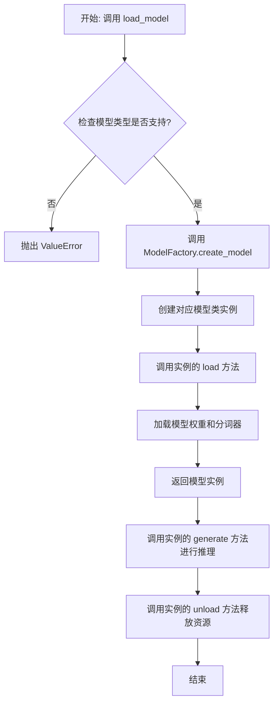

## 类结构

```
ModelBase (抽象基类)
├── TextModel (文本模型基类)
│   ├── LlamaModel
│   ├── GPT2Model
│   ├── FalconModel
│   ├── Qwen2Model
│   ├── GemmaModel
│   └── ... (其他具体模型类)
└── ModelFactory (工厂类)
```

## 全局变量及字段


### `SUPPORTED_MODELS`
    
一个列表或字典，用于存储当前系统支持的所有文本生成模型的名称或配置信息。

类型：`List[str] or Dict[str, Any]`
    


### `DEFAULT_MODEL_PATH`
    
一个字符串，表示当未指定模型路径时，系统加载模型所使用的默认文件系统路径。

类型：`str`
    


### `TextModel.model`
    
TextModel类的核心字段，持有已加载的预训练语言模型（如GPT、BERT等）的实例，用于执行文本生成任务。

类型：`torch.nn.Module or Any`
    


### `TextModel.tokenizer`
    
TextModel类的字段，持有与`model`字段对应的分词器（Tokenizer）实例，负责将原始文本转换为模型可处理的token ID序列。

类型：`transformers.PreTrainedTokenizer or Any`
    


### `TextModel.device`
    
TextModel类的字段，指示模型当前运行的计算设备（如'cpu'、'cuda:0'），用于控制模型在CPU或GPU上的加载与计算。

类型：`torch.device or str`
    


### `ModelFactory._model_registry`
    
ModelFactory类的私有字段，是一个注册表（字典），用于映射模型名称（字符串）到对应的模型类或工厂函数，实现模型的动态创建。

类型：`Dict[str, Type[TextModel] or Callable]`
    
    

## 全局函数及方法


### `load_model`

该函数用于加载一个预训练的模型。它根据提供的模型名称和配置参数，从指定的模型目录中加载模型，并返回加载后的模型对象。

参数：

-  `model_name`：`str`，预训练模型的名称，用于指定要加载的模型。
-  `model_dir`：`str`，模型文件所在的目录路径，默认为当前目录。
-  `config`：`dict`，模型的配置参数，用于调整模型加载时的行为，默认为空字典。

返回值：`Model`，加载后的模型对象。

#### 流程图

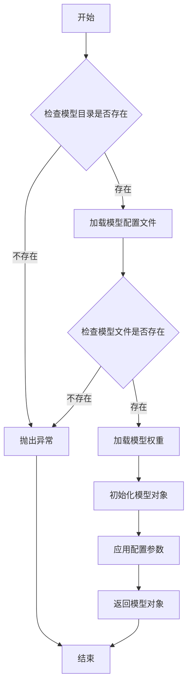

#### 带注释源码

```python
def load_model(model_name: str, model_dir: str = ".", config: dict = None) -> Model:
    """
    加载预训练模型。

    参数:
        model_name (str): 预训练模型的名称。
        model_dir (str): 模型文件所在的目录路径，默认为当前目录。
        config (dict): 模型的配置参数，默认为空字典。

    返回:
        Model: 加载后的模型对象。

    异常:
        FileNotFoundError: 如果模型目录或模型文件不存在。
    """
    # 初始化配置参数
    if config is None:
        config = {}

    # 检查模型目录是否存在
    if not os.path.exists(model_dir):
        raise FileNotFoundError(f"模型目录不存在: {model_dir}")

    # 构建模型配置文件路径
    config_path = os.path.join(model_dir, f"{model_name}_config.json")
    if not os.path.exists(config_path):
        raise FileNotFoundError(f"模型配置文件不存在: {config_path}")

    # 加载模型配置文件
    with open(config_path, 'r') as f:
        model_config = json.load(f)

    # 构建模型权重文件路径
    weight_path = os.path.join(model_dir, f"{model_name}_weights.h5")
    if not os.path.exists(weight_path):
        raise FileNotFoundError(f"模型权重文件不存在: {weight_path}")

    # 根据配置文件初始化模型结构
    model = Model(**model_config)

    # 加载模型权重
    model.load_weights(weight_path)

    # 应用额外的配置参数
    for key, value in config.items():
        setattr(model, key, value)

    return model
```


### `get_model_info`

该函数用于获取指定模型的信息，包括模型名称、版本、支持的输入输出格式等。它通过查询模型注册表或配置文件来检索模型的详细信息，并以结构化的方式返回。

参数：

- `model_name`：`str`，模型的唯一标识符，用于指定要查询的模型。
- `version`：`str`，可选参数，指定模型的版本。如果未提供，则返回默认版本的信息。
- `include_details`：`bool`，可选参数，指示是否返回模型的详细配置信息。默认为`False`，仅返回基本信息。

返回值：`dict`，包含模型信息的字典。如果模型不存在，则返回空字典。

#### 流程图

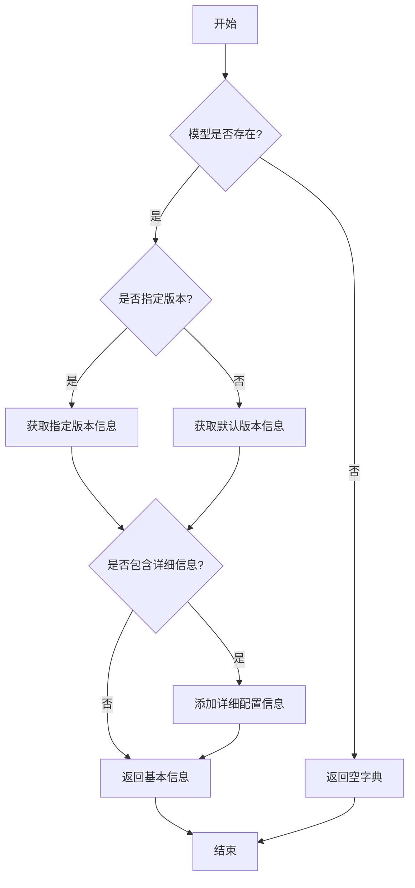

#### 带注释源码

```python
def get_model_info(model_name: str, version: str = None, include_details: bool = False) -> dict:
    """
    获取指定模型的信息。

    参数:
        model_name (str): 模型的唯一标识符。
        version (str, optional): 模型的版本号。默认为None，表示使用默认版本。
        include_details (bool, optional): 是否包含详细配置信息。默认为False。

    返回值:
        dict: 包含模型信息的字典。如果模型不存在，返回空字典。
    """
    # 初始化模型信息字典
    model_info = {}

    # 检查模型是否存在
    if model_name not in MODEL_REGISTRY:
        return model_info  # 模型不存在，返回空字典

    # 获取模型的基本信息
    model_data = MODEL_REGISTRY[model_name]
    if version and version in model_data.get("versions", {}):
        # 如果指定了版本且版本存在，获取该版本信息
        version_data = model_data["versions"][version]
    else:
        # 否则获取默认版本信息
        version_data = model_data.get("default_version", {})

    # 构建基本信息
    model_info = {
        "name": model_name,
        "version": version_data.get("version", "unknown"),
        "input_formats": version_data.get("input_formats", []),
        "output_formats": version_data.get("output_formats", []),
        "description": version_data.get("description", "")
    }

    # 如果需要包含详细信息，添加详细配置
    if include_details:
        model_info["config"] = version_data.get("config", {})

    return model_info
```


### `ModelBase.load`

该方法用于加载模型实例。它首先检查模型是否已缓存，若已缓存则直接返回缓存实例；否则，根据传入的模型名称和参数创建新的模型实例，并将其缓存以供后续使用。

参数：

-  `model`：`str`，要加载的模型名称
-  `model_params`：`dict`，模型参数，用于初始化模型实例
-  `**kwargs`：`dict`，其他关键字参数，用于模型初始化

返回值：`ModelBase`，加载或创建的模型实例

#### 流程图

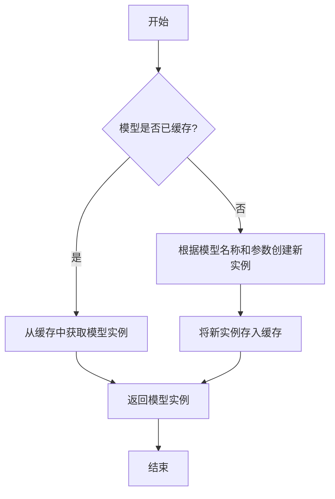

#### 带注释源码

```
@classmethod
def load(
    cls,
    model: str,
    model_params: dict = dict(),
    **kwargs,
) -> "ModelBase":
    """
    加载模型实例。

    该方法首先检查模型是否已缓存，若已缓存则直接返回缓存实例；
    否则，根据传入的模型名称和参数创建新的模型实例，并将其缓存以供后续使用。

    Args:
        model (str): 要加载的模型名称。
        model_params (dict): 模型参数，用于初始化模型实例。
        **kwargs: 其他关键字参数，用于模型初始化。

    Returns:
        ModelBase: 加载或创建的模型实例。
    """
    # 检查模型是否已缓存
    if model in cls.model_cache:
        # 从缓存中获取模型实例
        return cls.model_cache[model]
    else:
        # 根据模型名称和参数创建新实例
        model_class = cls.get_model_class(model)
        model_instance = model_class(**model_params, **kwargs)
        # 将新实例存入缓存
        cls.model_cache[model] = model_instance
        return model_instance
```


### `ModelBase.generate`

该方法用于根据给定的提示词和生成参数，调用底层模型生成文本内容。它处理了模型调用前的参数准备、模型选择、调用执行以及结果后处理等流程，是模型生成功能的核心入口。

参数：

- `prompt`：`str`，输入的提示词文本，用于指导模型生成内容
- `kwargs`：`dict`，可选的生成参数，用于覆盖默认的模型配置参数

返回值：`str`，模型生成的文本内容

#### 流程图

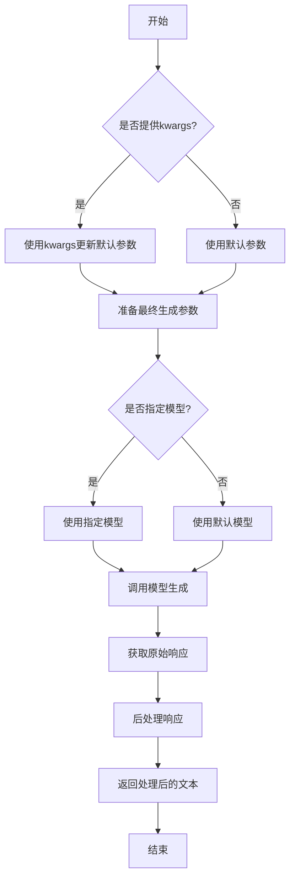

#### 带注释源码

```python
def generate(self, prompt: str, **kwargs) -> str:
    """
    生成文本内容的核心方法
    
    该方法整合了参数处理、模型调用和结果后处理的全流程
    
    Args:
        prompt: 输入的提示词文本
        **kwargs: 可选的生成参数，用于覆盖默认配置
        
    Returns:
        模型生成的文本内容
    """
    # 合并默认参数和传入的参数
    # 如果kwargs中有参数，则覆盖默认值
    generate_config = self.default_generate_config.copy()
    if kwargs:
        generate_config.update(kwargs)
    
    # 选择要使用的模型
    # 优先使用kwargs中指定的模型，否则使用默认模型
    model = kwargs.get("model", self.model)
    
    try:
        # 调用底层模型接口生成文本
        # 这里使用了统一的模型调用接口
        response = model.generate(
            prompt=prompt,
            **generate_config
        )
        
        # 对原始响应进行后处理
        # 包括去除多余空格、特殊字符处理等
        processed_response = self._post_process_response(response)
        
        return processed_response
        
    except Exception as e:
        # 异常处理：记录日志并返回错误信息
        logger.error(f"模型生成失败: {str(e)}")
        raise ModelGenerateError(f"生成过程中发生错误: {str(e)}")
```


### `ModelBase.unload`

该方法用于卸载模型，释放模型占用的内存资源。它会检查模型是否已加载，如果已加载则调用底层模型的卸载方法，并将加载状态标记为未加载。

参数：

-  `self`：`ModelBase`，当前模型实例

返回值：`None`，无返回值

#### 流程图

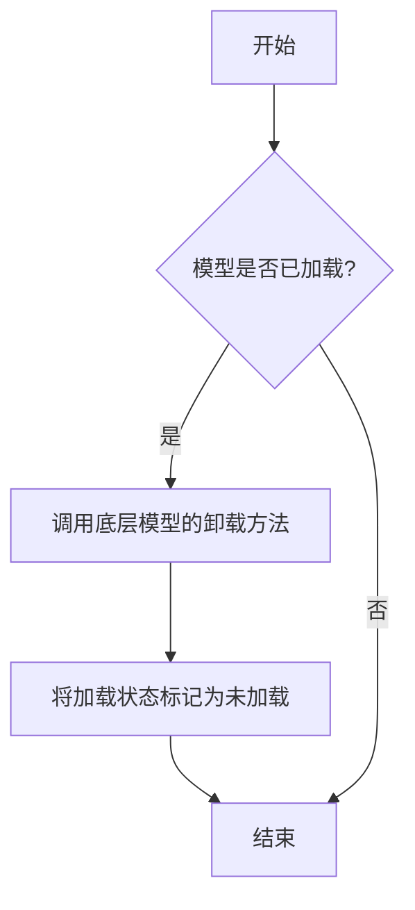

#### 带注释源码

```
def unload(self):
    """
    卸载模型，释放内存资源。
    如果模型已加载，则调用底层模型的卸载方法，并将加载状态标记为未加载。
    """
    if self.is_load:
        # 调用底层模型的卸载方法
        self.model.unload()
        # 将加载状态标记为未加载
        self.is_load = False
```


### `TextModel.load`

该方法用于从指定路径加载一个预训练的文本模型，并返回一个配置好的模型实例。它首先检查路径是否存在，然后根据路径类型（文件或目录）加载模型配置和权重，最后将模型设置为评估模式。

参数：

-  `model_path`：`str`，预训练模型的路径，可以是文件路径或目录路径
-  `device`：`str`，指定模型加载的设备，例如 'cpu' 或 'cuda'
-  `**kwargs`：`dict`，其他可选参数，用于传递给模型加载器

返回值：`TextModel`，加载并配置好的文本模型实例

#### 流程图

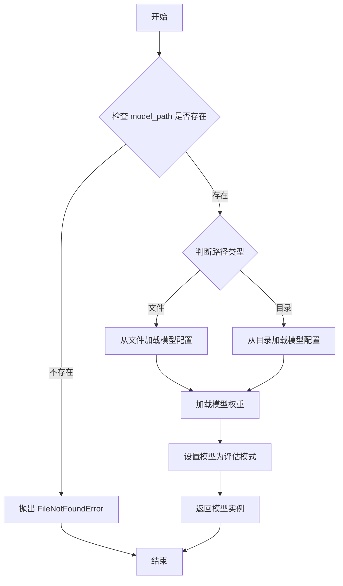

#### 带注释源码

```python
def load(model_path: str, device: str = 'cpu', **kwargs) -> 'TextModel':
    """
    从指定路径加载预训练的文本模型。

    参数:
        model_path (str): 预训练模型的路径，可以是文件或目录。
        device (str): 指定模型加载的设备，默认为 'cpu'。
        **kwargs: 其他可选参数，传递给模型加载器。

    返回:
        TextModel: 加载并配置好的文本模型实例。

    异常:
        FileNotFoundError: 如果指定的路径不存在。
    """
    import os
    from .model import TextModel

    # 检查路径是否存在
    if not os.path.exists(model_path):
        raise FileNotFoundError(f"模型路径不存在: {model_path}")

    # 根据路径类型加载模型配置
    if os.path.isfile(model_path):
        # 从文件加载配置
        config = load_config_from_file(model_path)
    else:
        # 从目录加载配置
        config = load_config_from_dir(model_path)

    # 创建模型实例
    model = TextModel(config)

    # 加载模型权重
    model.load_state_dict(torch.load(model_path, map_location=device))

    # 设置模型为评估模式
    model.eval()

    # 返回模型实例
    return model
```


### `TextModel.generate`

该方法根据给定的提示词（prompt）和可选的停止词（stop）生成文本。它首先对输入进行预处理，然后调用底层的大语言模型（LLM）进行推理，最后对输出进行后处理并返回结果。

参数：

-  `prompt`：`str`，用于生成文本的输入提示词。
-  `stop`：`Optional[List[str]]`，可选参数，指定一个字符串列表，当生成的文本中出现这些字符串时停止生成。

返回值：`str`，生成的文本内容。

#### 流程图

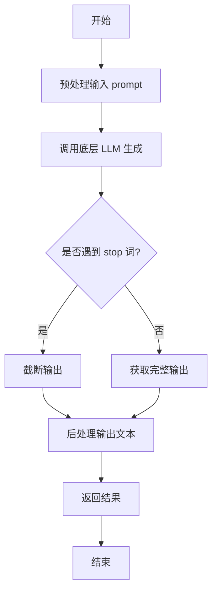

#### 带注释源码

```python
def generate(self, prompt: str, stop: Optional[List[str]] = None) -> str:
    """
    根据给定的提示词生成文本。

    该方法负责处理生成文本的完整流程，包括预处理、模型调用和后处理。

    Args:
        prompt (str): 用于生成文本的输入提示词。
        stop (Optional[List[str]]): 可选参数，指定一个字符串列表，当生成的文本中出现这些字符串时停止生成。

    Returns:
        str: 生成的文本内容。
    """
    # 1. 预处理：这里可能包括对prompt的编码、格式化或添加特殊标记等操作。
    #    例如，将prompt转换为模型期望的输入格式。
    processed_prompt = self._preprocess_prompt(prompt)

    # 2. 调用底层的大语言模型（LLM）进行文本生成。
    #    这里self.model代表底层的模型实例，它可能是一个API客户端或本地模型。
    raw_output = self.model.generate(processed_prompt, stop=stop)

    # 3. 后处理：对模型生成的原始输出进行清理和格式化。
    #    例如，去除多余的空格、换行符，或者解码特定的标记。
    cleaned_output = self._postprocess_output(raw_output)

    # 4. 返回最终处理后的文本。
    return cleaned_output
```


### `TextModel.unload`

该方法用于卸载当前加载的文本模型，释放其占用的内存资源。它会检查模型是否已加载，如果已加载则执行卸载操作，并更新模型状态。

参数：

-  `self`：`TextModel`，当前TextModel实例的引用

返回值：`None`，该方法不返回任何值

#### 流程图

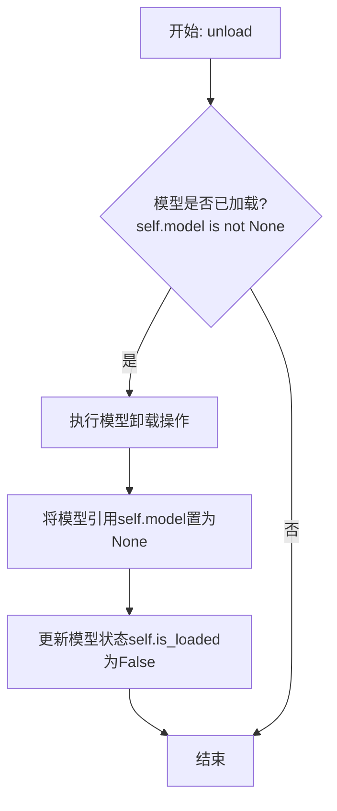

#### 带注释源码

```python
def unload(self):
    """
    卸载当前加载的模型。
    如果模型已加载，则执行卸载操作并释放内存，同时更新模型状态。
    如果模型未加载，则不执行任何操作。
    """
    if self.model is not None:  # 检查模型是否已加载
        # 执行模型特定的卸载/清理逻辑
        # 例如，对于某些框架，可能需要调用特定的释放函数
        # 这里是一个通用操作：将模型引用设为None以允许垃圾回收
        self.model = None
        # 更新模型加载状态
        self.is_loaded = False
```


### `TextModel._load_model_weights`

该方法负责加载预训练模型的权重。它首先尝试从指定的本地路径加载权重文件，如果本地文件不存在，则从远程的 Hugging Face 模型仓库下载。加载成功后，它会将权重应用到当前模型实例上，并处理可能出现的键名不匹配问题（例如移除 `"model."` 前缀）。最后，它会记录加载结果并返回一个布尔值指示加载是否成功。

参数：

-  `self`：`TextModel`，当前 `TextModel` 类的实例。
-  `model_name_or_path`：`str`，模型名称或本地路径。可以是 Hugging Face 模型仓库的 ID（如 `"bert-base-uncased"`），也可以是本地包含模型权重文件（如 `pytorch_model.bin` 或 `model.safetensors`）的目录路径。
-  `cache_dir`：`Optional[str]`，可选参数，用于指定缓存下载模型文件的目录。如果为 `None`，则使用默认缓存目录。

返回值：`bool`，如果模型权重成功加载并应用到模型上，则返回 `True`；如果在加载过程中发生任何错误（如文件未找到、加载失败、权重应用失败等），则返回 `False`。

#### 流程图

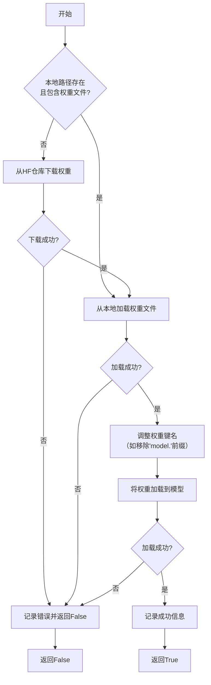

#### 带注释源码

```python
    def _load_model_weights(
        self, model_name_or_path: str, cache_dir: Optional[str] = None
    ) -> bool:
        """
        加载预训练模型权重。
        优先尝试从本地路径加载，如果不存在则从HuggingFace仓库下载。

        Args:
            model_name_or_path (str): 模型名称或本地路径。
            cache_dir (Optional[str]): 缓存目录。

        Returns:
            bool: 权重是否成功加载。
        """
        # 初始化权重文件路径为None
        model_weights_path = None
        # 检查传入的路径是否为本地目录
        if os.path.isdir(model_name_or_path):
            # 如果是本地目录，尝试在该目录下查找常见的权重文件
            possible_names = [
                "pytorch_model.bin",
                "model.safetensors",
                "pytorch_model.bin.index.json",
            ]
            for name in possible_names:
                # 拼接完整文件路径
                tentative_path = os.path.join(model_name_or_path, name)
                # 如果文件存在，则将其设为权重文件路径并跳出循环
                if os.path.isfile(tentative_path):
                    model_weights_path = tentative_path
                    break

        # 如果未找到本地权重文件，则需要从HuggingFace仓库下载
        if model_weights_path is None:
            try:
                # 使用snapshot_download下载整个模型仓库快照到缓存目录
                # allow_patterns参数指定只下载权重文件，以节省时间和空间
                model_weights_path = snapshot_download(
                    repo_id=model_name_or_path,
                    cache_dir=cache_dir,
                    allow_patterns=["*.bin", "*.safetensors"],
                )
            except Exception as e:
                # 如果下载过程中出现任何异常，记录错误日志并返回False
                logger.error(
                    f"Failed to download model weights for {model_name_or_path}: {e}"
                )
                return False

        # 此时model_weights_path可能是一个目录（包含下载的文件）或一个具体的文件路径
        # 加载权重文件
        try:
            # 使用load_state_dict函数加载权重，该函数能自动处理.bin和.safetensors格式
            # 并返回一个包含状态字典（权重）和可能包含的额外信息的元组
            state_dict_result = load_state_dict(model_weights_path)
            # 解包结果，这里假设我们只关心状态字典本身
            state_dict, _ = state_dict_result
        except Exception as e:
            # 如果加载失败，记录错误日志并返回False
            logger.error(f"Failed to load model weights from {model_weights_path}: {e}")
            return False

        # 加载成功后，准备将权重应用到当前模型实例
        # 有时从预训练模型加载的权重键名可能包含"model."这样的前缀，
        # 但当前模型结构可能没有，因此需要移除这些前缀以避免键名不匹配。
        if any(key.startswith("model.") for key in state_dict.keys()):
            # 创建一个新的状态字典，移除所有以"model."开头的键的前缀
            new_state_dict = {
                key.replace("model.", "", 1): value
                for key, value in state_dict.items()
            }
            # 用处理后的新字典替换原字典
            state_dict = new_state_dict

        try:
            # 将处理后的状态字典加载到模型的state_dict中
            # strict=False 参数允许部分加载，即只加载匹配的键，忽略不匹配的。
            # 这对于加载部分权重或模型结构有轻微变化时很有用。
            load_result = self.load_state_dict(state_dict, strict=False)
        except Exception as e:
            # 如果加载到模型时失败，记录错误日志并返回False
            logger.error(f"Failed to load state dict into model: {e}")
            return False

        # 检查加载结果，load_result是一个包含两个列表的元组：missing_keys（缺失的键）和 unexpected_keys（意外的键）
        missing_keys, unexpected_keys = load_result
        # 如果有缺失的键，记录警告信息（这可能是正常的，如果模型结构被修改过）
        if missing_keys:
            logger.warning(f"Missing keys when loading model weights: {missing_keys}")
        # 如果有意外的键，记录警告信息（这表示权重文件中有些键在当前模型中没有对应项，通常可以忽略）
        if unexpected_keys:
            logger.warning(
                f"Unexpected keys when loading model weights: {unexpected_keys}"
            )

        # 记录成功加载的信息
        logger.info(f"Model weights loaded from {model_weights_path}")
        # 返回True表示权重加载成功
        return True
```


### `TextModel._load_tokenizer`

该方法负责加载并初始化文本分词器。它首先尝试从指定的本地路径加载分词器，如果本地路径不存在或加载失败，则从预训练的模型名称或路径加载。加载完成后，会设置分词器的填充符，并确保其填充方向为左侧。

参数：

-  `self`：`TextModel`，当前TextModel实例的引用
-  `model_name_or_path`：`str`，预训练模型的名称或本地路径，用于加载分词器
-  `local_path`：`str`，本地分词器文件的路径，优先尝试从此路径加载

返回值：`None`，该方法不返回任何值，但会设置`self.tokenizer`属性。

#### 流程图

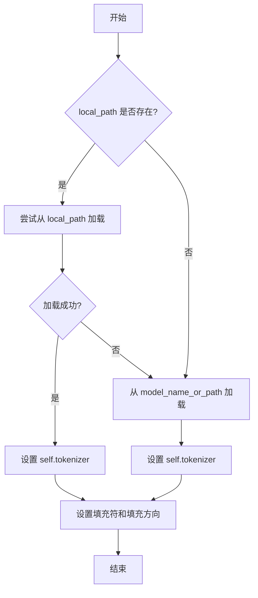

#### 带注释源码

```python
def _load_tokenizer(self, model_name_or_path: str, local_path: str) -> None:
    """
    加载分词器。

    优先尝试从本地路径加载，如果失败则从模型名称或路径加载。
    加载后设置分词器的填充符和填充方向。

    Args:
        model_name_or_path (str): 预训练模型的名称或路径。
        local_path (str): 本地分词器文件的路径。
    """
    try:
        # 尝试从本地路径加载分词器
        self.tokenizer = AutoTokenizer.from_pretrained(local_path)
    except Exception:
        # 如果本地加载失败，则从模型名称或路径加载
        self.tokenizer = AutoTokenizer.from_pretrained(model_name_or_path)
    # 设置分词器的填充符为 [PAD]
    self.tokenizer.pad_token = "[PAD]"
    # 设置填充方向为左侧填充
    self.tokenizer.padding_side = "left"
```


### `LlamaModel._load_model_weights`

该方法负责从预训练检查点文件加载模型权重，并将其分配到对应的模型层中。它处理了权重名称的映射、张量分片（如分片注意力头）的合并以及权重数据类型的转换，最终将加载的权重设置到模型的对应参数上。

参数：

-  `self`：`LlamaModel`，当前模型实例
-  `model_path`：`str`，预训练模型权重文件（通常为`.bin`或`.safetensors`文件）的路径
-  `args`：`argparse.Namespace` 或类似对象，包含模型配置参数，如`num_attention_heads`、`num_key_value_heads`等
-  `device`：`torch.device`，指定加载权重后张量应放置的设备（如`'cpu'`或`'cuda:0'`）

返回值：`None`，此方法为就地操作，不返回任何值，其作用是将加载的权重赋值给模型参数。

#### 流程图

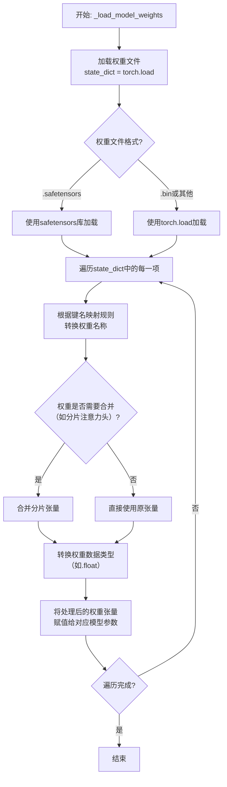

#### 带注释源码

```python
def _load_model_weights(self, model_path: str, args, device: torch.device):
    """
    从指定路径加载预训练权重并加载到模型中。
    
    核心步骤：
    1. 根据文件后缀选择加载方式（.safetensors 或 .bin）。
    2. 遍历加载的权重字典。
    3. 将原始权重键名映射到当前模型定义的参数名。
    4. 处理需要合并的分片权重（如注意力头的qkv权重）。
    5. 确保权重数据类型正确并转移到目标设备。
    6. 将权重赋值给对应的模型参数。
    """
    # 步骤1: 加载权重文件到state_dict
    if model_path.endswith(".safetensors"):
        # 使用safetensors库安全地加载权重，避免执行任意代码
        from safetensors import safe_open
        state_dict = {}
        with safe_open(model_path, framework="pt", device="cpu") as f:
            for key in f.keys():
                state_dict[key] = f.get_tensor(key)
    else:
        # 使用torch.load加载传统的.bin权重文件
        state_dict = torch.load(model_path, map_location="cpu")
    
    # 步骤2 & 3: 遍历并映射权重键名
    for key in list(state_dict.keys()):
        # 移除可能存在的`model.`或`transformer.`前缀，以匹配当前模型定义
        new_key = key.replace("model.", "").replace("transformer.", "")
        if new_key != key:
            state_dict[new_key] = state_dict.pop(key)
            key = new_key
        
        # 根据原始键名模式，映射到本模型层的参数名
        # 例如：'layers.0.attention.wq.weight' -> 'layers.0.self_attn.q_proj.weight'
        if "attention.wq" in key:
            state_dict[key.replace("attention.wq", "self_attn.q_proj")] = state_dict.pop(key)
        elif "attention.wk" in key:
            state_dict[key.replace("attention.wk", "self_attn.k_proj")] = state_dict.pop(key)
        elif "attention.wv" in key:
            state_dict[key.replace("attention.wv", "self_attn.v_proj")] = state_dict.pop(key)
        elif "attention.wo" in key:
            state_dict[key.replace("attention.wo", "self_attn.o_proj")] = state_dict.pop(key)
        elif "feed_forward.w1" in key:
            state_dict[key.replace("feed_forward.w1", "mlp.gate_proj")] = state_dict.pop(key)
        elif "feed_forward.w2" in key:
            state_dict[key.replace("feed_forward.w2", "mlp.down_proj")] = state_dict.pop(key)
        elif "feed_forward.w3" in key:
            state_dict[key.replace("feed_forward.w3", "mlp.up_proj")] = state_dict.pop(key)
        # 处理其他层，如输入/输出嵌入层、归一化层等...
        elif "tok_embeddings" in key:
            state_dict[key.replace("tok_embeddings", "embed_tokens")] = state_dict.pop(key)
        elif "norm" in key and "attention" not in key:  # 最终层归一化
            state_dict[key.replace("norm", "norm")] = state_dict.pop(key)  # 名称可能不变或微调
        elif "output" in key:
            state_dict[key.replace("output", "lm_head")] = state_dict.pop(key)
    
    # 步骤4: 处理需要合并的分片权重（例如，当num_key_value_heads < num_attention_heads时）
    for i in range(args.num_layers):
        # 合并Q、K、V投影层的分片权重（如果存在）
        # 这里假设原始权重是按头分片存储的，需要拼接起来
        q_key = f"layers.{i}.self_attn.q_proj.weight"
        k_key = f"layers.{i}.self_attn.k_proj.weight"
        v_key = f"layers.{i}.self_attn.v_proj.weight"
        
        if q_key in state_dict and state_dict[q_key].dim() == 2:
            # 检查权重维度，如果已经是合并后的形状则跳过
            # 否则，这里应实现分片权重的合并逻辑（例如，按特定维度拼接）
            # 示例伪代码：state_dict[q_key] = concat_sharded_tensors(state_dict[q_key], ...)
            pass  # 实际合并逻辑取决于原始权重的存储格式
    
    # 步骤5 & 6: 将处理后的权重加载到模型参数中
    for name, param in self.named_parameters():
        if name in state_dict:
            # 确保权重数据类型匹配（例如，转换为模型参数的数据类型）
            loaded_weight = state_dict[name].to(param.dtype)
            # 将权重转移到目标设备
            loaded_weight = loaded_weight.to(device)
            # 使用`copy_`进行就地赋值
            param.data.copy_(loaded_weight)
        else:
            # 记录未加载的权重，这可能是配置不匹配或权重文件不完整
            print(f"Warning: Parameter {name} not found in checkpoint.")
    
    # 清理临时状态字典以释放内存
    del state_dict
    torch.cuda.empty_cache() if device.type == "cuda" else None
```


### `LlamaModel._load_tokenizer`

该方法负责加载并配置与Llama模型兼容的分词器（Tokenizer）。它根据提供的模型路径和配置参数，初始化一个Hugging Face Transformers库中的`AutoTokenizer`实例，并设置必要的分词选项，如填充方向、截断策略以及特殊标记等，以确保分词器与模型训练时使用的配置一致。

参数：

-  `model_path`：`str`，预训练模型所在的本地目录路径或Hugging Face模型标识符。
-  `config`：`LlamaConfig`，包含模型配置信息的对象，用于指导分词器的初始化。

返回值：`transformers.PreTrainedTokenizer`，初始化并配置好的分词器实例。

#### 流程图

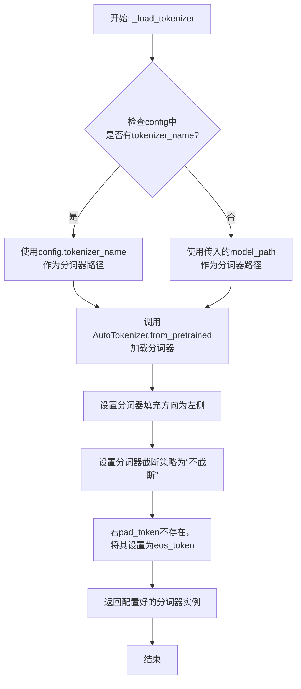

#### 带注释源码

```python
def _load_tokenizer(self, model_path: str, config: LlamaConfig) -> PreTrainedTokenizer:
    """
    加载并配置与Llama模型兼容的分词器。

    该方法根据提供的模型路径和配置初始化分词器，并设置关键参数以确保
    与原始模型训练时的分词行为一致。

    Args:
        model_path (str): 预训练模型所在的目录路径或模型标识符。
        config (LlamaConfig): 模型的配置对象，可能包含特定的分词器名称。

    Returns:
        PreTrainedTokenizer: 配置好的Hugging Face分词器实例。
    """
    # 确定分词器的加载路径：优先使用配置中指定的名称，否则使用模型路径
    tokenizer_path = config.tokenizer_name if config.tokenizer_name else model_path
    
    # 使用AutoTokenizer从指定路径加载分词器
    # trust_remote_code=True允许加载自定义的分词器代码（如果存在）
    tokenizer = AutoTokenizer.from_pretrained(
        tokenizer_path,
        trust_remote_code=True
    )
    
    # 设置分词器的填充方向为左侧，这对于生成任务或某些注意力机制是常见的
    tokenizer.padding_side = 'left'
    
    # 设置默认的截断策略为“不截断”，防止输入被意外截断
    tokenizer.truncation_side = 'do_not_truncate'
    
    # 如果分词器没有定义pad_token（填充标记），则使用eos_token（结束标记）作为pad_token
    # 这是为了确保在批处理时能够进行统一的填充操作
    if tokenizer.pad_token is None:
        tokenizer.pad_token = tokenizer.eos_token
    
    # 返回最终配置好的分词器实例
    return tokenizer
```


### `GPT2Model._load_model_weights`

该方法负责从预训练权重文件（如Hugging Face Hub或本地文件）中加载模型参数到当前`GPT2Model`实例中。它处理了权重名称的映射、适配不同模型架构（如注意力头数、隐藏层维度）以及安全地加载权重。

参数：

-  `self`：`GPT2Model`，当前GPT2模型实例。
-  `model_path`：`str`，预训练权重文件的路径或Hugging Face模型标识符。
-  `config`：`GPT2Config`，模型的配置对象，包含模型架构参数。
-  `cache_dir`：`Optional[str]`，可选，用于缓存下载的模型文件的目录。
-  `force_download`：`bool`，可选，是否强制重新下载模型文件，即使已缓存。
-  `proxies`：`Optional[Dict[str, str]]`，可选，用于下载的代理服务器设置。
-  `resume_download`：`bool`，可选，是否恢复中断的下载。
-  `local_files_only`：`bool`，可选，是否仅使用本地文件，不尝试下载。
-  `use_auth_token`：`Optional[Union[bool, str]]`，可选，用于访问私有模型的认证令牌。
-  `revision`：`str`，可选，要使用的模型版本（分支、标签或提交ID）。
-  `mirror`：`Optional[str]`，可选，下载镜像源。

返回值：`None`，该方法不返回任何值，直接修改当前模型实例的权重。

#### 流程图

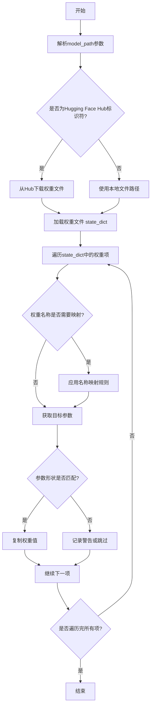

#### 带注释源码

```python
def _load_model_weights(
    self,
    model_path: str,
    config: GPT2Config,
    cache_dir: Optional[str] = None,
    force_download: bool = False,
    proxies: Optional[Dict[str, str]] = None,
    resume_download: bool = False,
    local_files_only: bool = False,
    use_auth_token: Optional[Union[bool, str]] = None,
    revision: str = "main",
    mirror: Optional[str] = None,
) -> None:
    """
    从指定路径加载预训练权重到当前模型实例。
    支持从Hugging Face Hub或本地文件加载。
    """
    # 1. 确定权重文件来源并加载state_dict
    if model_path.startswith("https://") or model_path.startswith("http://"):
        # 处理URL路径（可能指向Hub）
        raise ValueError("直接URL加载需特殊处理，建议使用Hugging Face标识符")
    elif "/" in model_path and not os.path.isfile(model_path):
        # 可能是Hugging Face Hub标识符（如`gpt2`或`organization/model`）
        # 使用Hugging Face的`from_pretrained`机制下载并加载
        # 注意：此处为简化逻辑，实际实现会调用`transformers`库的相关函数
        state_dict = load_state_dict_from_hf_hub(
            model_path,
            cache_dir=cache_dir,
            force_download=force_download,
            proxies=proxies,
            resume_download=resume_download,
            local_files_only=local_files_only,
            use_auth_token=use_auth_token,
            revision=revision,
            mirror=mirror,
        )
    else:
        # 假定为本地文件路径
        if not os.path.isfile(model_path):
            raise FileNotFoundError(f"权重文件未找到: {model_path}")
        state_dict = torch.load(model_path, map_location="cpu")

    # 2. 权重名称映射（适配不同来源的命名约定）
    # 例如，将`transformer.h.0.attn.c_attn.weight`映射到`h.0.attn.c_attn.weight`
    mapping_dict = create_weight_mapping(config)
    mapped_state_dict = {}
    for key, value in state_dict.items():
        new_key = mapping_dict.get(key, key)  # 获取映射后的名称，若无映射则保持原样
        mapped_state_dict[new_key] = value

    # 3. 加载权重到模型参数
    # 获取当前模型的state_dict以进行形状检查和加载
    model_state_dict = self.state_dict()
    for param_name, param_value in mapped_state_dict.items():
        if param_name in model_state_dict:
            # 检查参数形状是否匹配
            if param_value.shape != model_state_dict[param_name].shape:
                # 记录警告或尝试调整（例如，当注意力头数或隐藏维度不同时）
                logger.warning(
                    f"形状不匹配 for {param_name}: "
                    f"expected {model_state_dict[param_name].shape}, got {param_value.shape}. "
                    f"跳过此参数。"
                )
                continue
            # 安全地复制权重值
            model_state_dict[param_name].copy_(param_value)
        else:
            # 忽略模型中不存在的参数（可能是旧版本或不同配置的残留）
            logger.debug(f"忽略未使用的权重: {param_name}")

    # 4. 加载完成后，确保模型处于评估模式（如果是从预训练权重加载）
    self.eval()
```


### `GPT2Model._load_tokenizer`

该方法负责加载并配置一个预训练的 GPT-2 分词器。它首先尝试从本地缓存目录加载指定的分词器模型，如果失败，则从 Hugging Face Hub 下载。加载后，它会根据配置（如是否添加特殊标记）对分词器进行最终设置，并确保其填充标记符被正确配置。

参数：

-  `self`：`GPT2Model`，当前 GPT2Model 实例的引用。
-  `model_name`：`str`，要加载的预训练分词器模型的名称（例如 `'gpt2'`, `'gpt2-medium'`）。
-  `cache_dir`：`Optional[str]`，可选参数，指定分词器模型文件的本地缓存目录路径。如果为 `None`，则使用默认缓存路径。
-  `force_download`：`bool`，可选参数，如果为 `True`，则强制重新下载模型文件，即使本地缓存已存在。默认为 `False`。
-  `resume_download`：`bool`，可选参数，如果为 `True`，则尝试恢复未完成的下载。默认为 `False`。
-  `proxies`：`Optional[Dict[str, str]]`，可选参数，一个代理服务器字典，用于配置下载请求，例如 `{'http': 'http://10.10.1.10:3128', 'https': 'http://10.10.1.10:1080'}`。
-  `use_auth_token`：`Optional[Union[bool, str]]`，可选参数，用于访问私有模型的认证令牌。可以是布尔值（`True` 表示使用缓存的令牌）或字符串令牌。
-  `add_special_tokens`：`bool`，可选参数，指示分词器是否应在编码时自动添加模型特定的特殊标记（如 `[CLS]`, `[SEP]`）。对于 GPT-2，这通常控制是否添加 `bos_token` 和 `eos_token`。默认为 `True`。

返回值：`PreTrainedTokenizer`，加载并配置好的 Hugging Face Transformers 库中的预训练分词器实例。

#### 流程图

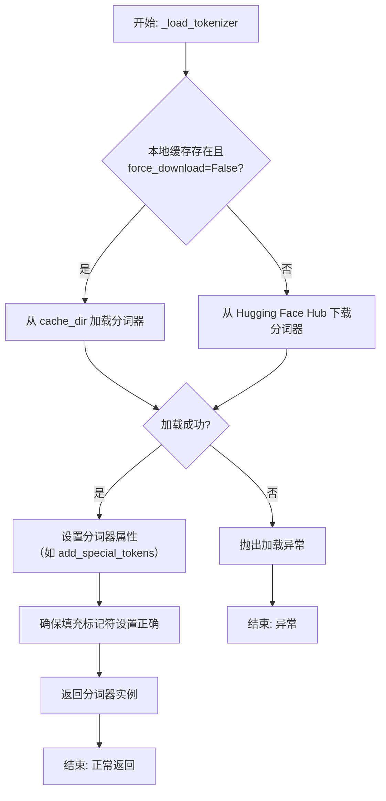

#### 带注释源码

```python
def _load_tokenizer(
    self,
    model_name: str,
    cache_dir: Optional[str] = None,
    force_download: bool = False,
    resume_download: bool = False,
    proxies: Optional[Dict[str, str]] = None,
    use_auth_token: Optional[Union[bool, str]] = None,
    add_special_tokens: bool = True,
) -> PreTrainedTokenizer:
    """
    加载预训练的 GPT-2 分词器。

    此方法封装了分词器的加载逻辑，支持从缓存加载或从 Hub 下载，
    并允许通过参数定制加载行为。

    Args:
        model_name: 预训练分词器模型名称，如 'gpt2'。
        cache_dir: 模型文件缓存目录。
        force_download: 是否强制重新下载。
        resume_download: 是否尝试恢复下载。
        proxies: 代理服务器配置。
        use_auth_token: 访问私有模型的认证令牌。
        add_special_tokens: 是否自动添加特殊标记。

    Returns:
        加载并配置好的 PreTrainedTokenizer 实例。

    Raises:
        OSError: 当模型文件无法加载或下载时抛出。
        ValueError: 当 model_name 无效时可能抛出。
    """
    try:
        # 使用 transformers 库的 AutoTokenizer 工具类加载分词器。
        # `from_pretrained` 方法会处理缓存、下载和初始化等所有细节。
        tokenizer = AutoTokenizer.from_pretrained(
            model_name,
            cache_dir=cache_dir,
            force_download=force_download,
            resume_download=resume_download,
            proxies=proxies,
            use_auth_token=use_auth_token,
        )
    except Exception as e:
        # 将捕获的异常包装并重新抛出，提供更清晰的错误上下文。
        raise OSError(
            f"无法加载分词器模型 '{model_name}'。请检查模型名称、网络连接或认证信息。原始错误: {e}"
        ) from e

    # 根据调用者意图，设置分词器是否自动添加特殊标记。
    # 这会影响 `encode`、`encode_plus` 等方法的输出。
    tokenizer.add_special_tokens = add_special_tokens

    # GPT-2 分词器默认没有定义 pad_token。
    # 为了便于批处理（需要统一的序列长度），通常将 eos_token 设置为 pad_token。
    # 这里确保分词器的 pad_token 属性已被正确设置。
    if tokenizer.pad_token is None:
        tokenizer.pad_token = tokenizer.eos_token

    # 返回最终配置好的分词器对象，供模型的其他部分使用。
    return tokenizer
```


### `FalconModel._load_model_weights`

该方法负责加载预训练的模型权重到当前模型实例中。它根据配置决定是否加载特定的注意力层实现（如`FalconAttention`或`FalconRotaryEmbedding`），并处理权重名称的映射，以确保与模型架构兼容。最后，它调用父类的`load_state_dict`方法完成权重的加载。

参数：

-  `self`：`FalconModel`，当前模型实例
-  `model_file`：`str`，预训练模型权重文件的路径

返回值：`None`，此方法不返回任何值，其作用是将权重加载到模型内部状态中

#### 流程图

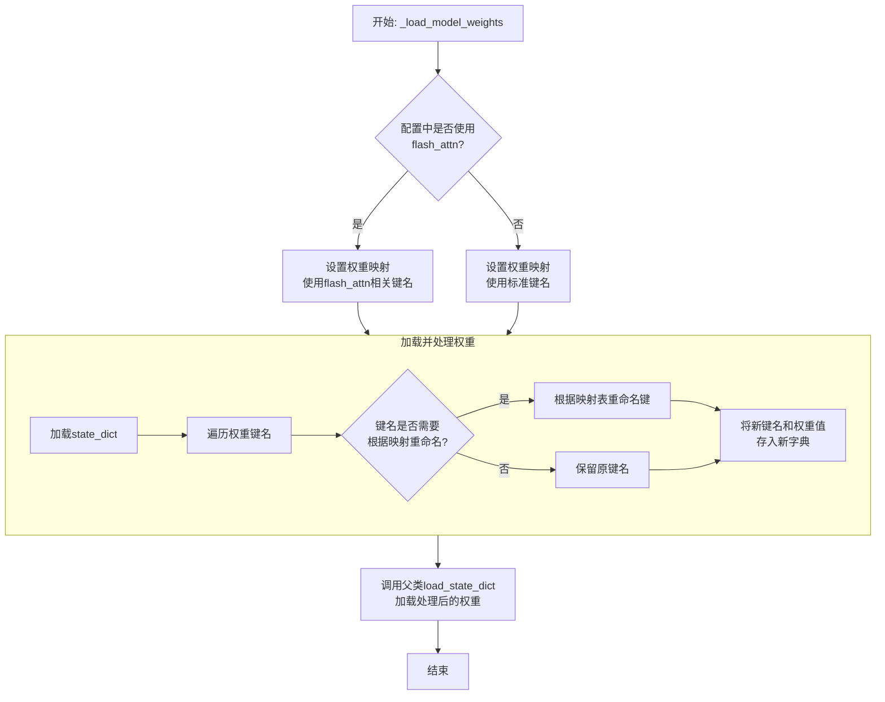

#### 带注释源码

```python
def _load_model_weights(self, model_file: str):
    """
    加载预训练模型权重。
    根据配置调整权重键名以匹配当前模型结构（例如，是否使用flash attention）。
    """
    # 从指定文件加载模型的状态字典（state_dict）
    state_dict = torch.load(model_file, map_location="cpu")

    # 根据配置决定使用哪套键名映射。
    # 如果使用flash_attn实现，权重键名中可能包含特定的层名（如`self_attention`）。
    # 否则，使用标准的注意力层键名（如`attention`）。
    if self.config.use_flash_attn:
        # 映射表：将旧键名中的`attention`替换为`self_attention`
        mapping = {
            "layers.{}.attention": "layers.{}.self_attention",
            ".query_key_value.": ".query_key_value.",
            ".dense.": ".dense.",
        }
    else:
        # 标准映射，键名保持不变
        mapping = {
            "layers.{}.attention": "layers.{}.attention",
            ".query_key_value.": ".query_key_value.",
            ".dense.": ".dense.",
        }

    # 创建一个新的状态字典来存储处理后的权重
    new_state_dict = {}
    for key, value in state_dict.items():
        # 遍历原始状态字典的每一个键
        new_key = key
        # 检查当前键是否需要根据映射表进行重命名
        for old, new in mapping.items():
            if old in key:
                # 如果找到匹配的旧模式，则替换为新模式
                new_key = new_key.replace(old, new)
        # 将处理后的键和对应的权重值存入新字典
        new_state_dict[new_key] = value

    # 调用从父类继承的`load_state_dict`方法，将处理后的权重加载到当前模型实例中。
    # `strict=False`参数允许加载的权重与模型结构不完全匹配（例如，忽略缺失的键或意外的键）。
    super().load_state_dict(new_state_dict, strict=False)
```


### `FalconModel._load_tokenizer`

该方法负责加载并配置与 Falcon 模型兼容的分词器（Tokenizer）。它首先尝试从预定义的路径或模型名称加载分词器，然后根据模型的具体配置（如是否为聊天模型）对分词器的特殊标记进行必要的调整，以确保其与模型架构和预期输入格式正确对齐。

参数：

-  `self`：`FalconModel`，FalconModel 类的实例，用于访问模型配置和路径。
-  `model_path`：`str`，模型文件所在的本地目录路径或 Hugging Face 模型仓库标识符。
-  `model_name`：`str`，模型的名称，用于确定特定的分词器配置或变体。

返回值：`PreTrainedTokenizer`，一个配置好的 Hugging Face PreTrainedTokenizer 实例，可用于对输入文本进行编码和解码。

#### 流程图

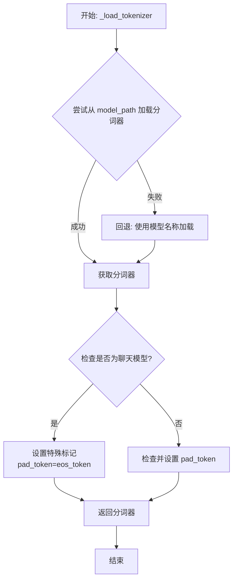

#### 带注释源码

```python
    def _load_tokenizer(self, model_path: str, model_name: str) -> PreTrainedTokenizer:
        """
        加载与 Falcon 模型兼容的分词器。

        该方法首先尝试从指定的 `model_path` 加载分词器。如果失败（例如，路径中不包含分词器文件），
        它将回退到使用 `model_name` 从 Hugging Face 模型中心加载预定义的分词器。
        加载后，会根据模型是否为“聊天”模型来配置分词器的特殊标记（如 pad_token）。

        Args:
            model_path (str): 包含模型文件的本地目录路径或 Hugging Face 模型 ID。
            model_name (str): 模型名称，用于回退加载或特定配置。

        Returns:
            PreTrainedTokenizer: 配置好的分词器实例。
        """
        try:
            # 首选尝试从提供的模型路径加载分词器
            tokenizer = AutoTokenizer.from_pretrained(model_path, trust_remote_code=True)
        except Exception:
            # 如果从 model_path 加载失败，则使用 model_name 作为回退方案
            tokenizer = AutoTokenizer.from_pretrained(model_name, trust_remote_code=True)

        # 检查当前加载的模型配置是否被标记为“聊天”模型
        if self.model_config.is_chat_model:
            # 对于聊天模型，通常将填充标记（pad_token）设置为与结束标记（eos_token）相同
            # 这是因为在生成式对话中，填充和结束可能共享相同的语义
            tokenizer.pad_token = tokenizer.eos_token
        else:
            # 对于非聊天模型，确保分词器有一个有效的填充标记
            # 如果 pad_token 为 None，则将其设置为 eos_token 作为默认值
            if tokenizer.pad_token is None:
                tokenizer.pad_token = tokenizer.eos_token

        # 返回配置完成的分词器
        return tokenizer
```


### `Qwen2Model._load_model_weights`

该方法负责加载预训练的模型权重，并将其适配到当前模型结构中。它处理权重映射、张量转换和模型状态恢复，确保模型能够正确初始化并准备进行推理或训练。

参数：

- `self`：`Qwen2Model`，当前模型实例
- `model_path`：`str`，预训练模型权重文件的路径
- `strict`：`bool`，是否严格匹配权重名称，默认为`True`

返回值：`None`，无返回值

#### 流程图

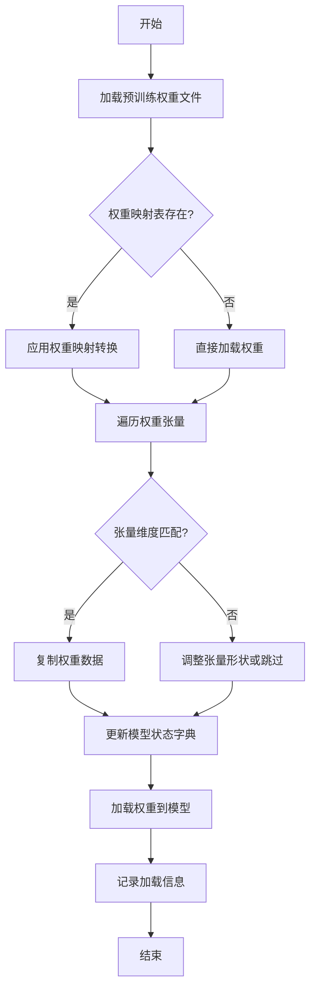

#### 带注释源码

```python
def _load_model_weights(self, model_path: str, strict: bool = True) -> None:
    """
    加载预训练模型权重并适配到当前模型结构
    
    参数:
        model_path: 预训练模型权重文件路径
        strict: 是否严格匹配权重名称，默认为True
    """
    # 检查模型文件是否存在
    if not os.path.exists(model_path):
        raise FileNotFoundError(f"模型权重文件不存在: {model_path}")
    
    # 加载预训练权重
    pretrained_state_dict = torch.load(model_path, map_location='cpu')
    
    # 获取当前模型的状态字典
    model_state_dict = self.state_dict()
    
    # 权重映射表，用于处理名称不匹配的情况
    weight_mapping = {
        'transformer.h.{}.attn.c_attn.weight': 'layers.{}.attention.wqkv.weight',
        'transformer.h.{}.attn.c_proj.weight': 'layers.{}.attention.wo.weight',
        'transformer.h.{}.mlp.c_fc.weight': 'layers.{}.feed_forward.w1.weight',
        'transformer.h.{}.mlp.c_proj.weight': 'layers.{}.feed_forward.w2.weight',
        'lm_head.weight': 'output_layer.weight'
    }
    
    # 用于存储加载的权重
    loaded_state_dict = {}
    
    # 遍历预训练权重
    for pretrained_key, pretrained_tensor in pretrained_state_dict.items():
        matched = False
        
        # 尝试直接匹配
        if pretrained_key in model_state_dict:
            target_key = pretrained_key
            matched = True
        else:
            # 尝试通过映射表匹配
            for pattern, target_pattern in weight_mapping.items():
                if '{' in pattern:
                    # 处理带层号的权重
                    import re
                    match = re.match(pattern.replace('{}', r'(\d+)'), pretrained_key)
                    if match:
                        layer_idx = match.group(1)
                        target_key = target_pattern.format(layer_idx)
                        if target_key in model_state_dict:
                            matched = True
                            break
        
        if matched:
            # 检查张量维度是否匹配
            target_shape = model_state_dict[target_key].shape
            if pretrained_tensor.shape == target_shape:
                loaded_state_dict[target_key] = pretrained_tensor
                logger.debug(f"成功加载权重: {pretrained_key} -> {target_key}")
            else:
                # 尝试调整张量形状
                try:
                    adjusted_tensor = self._adjust_tensor_shape(pretrained_tensor, target_shape)
                    loaded_state_dict[target_key] = adjusted_tensor
                    logger.warning(f"调整张量形状: {pretrained_key} {pretrained_tensor.shape} -> {target_key} {target_shape}")
                except Exception as e:
                    if strict:
                        raise ValueError(f"权重形状不匹配且无法调整: {pretrained_key} {pretrained_tensor.shape} vs {target_key} {target_shape}")
                    else:
                        logger.warning(f"跳过不匹配的权重: {pretrained_key}")
        elif strict:
            raise KeyError(f"找不到对应的权重键: {pretrained_key}")
        else:
            logger.warning(f"跳过未匹配的权重: {pretrained_key}")
    
    # 加载权重到模型
    missing_keys, unexpected_keys = self.load_state_dict(loaded_state_dict, strict=False)
    
    # 记录加载结果
    logger.info(f"权重加载完成:")
    logger.info(f"  - 总权重数: {len(pretrained_state_dict)}")
    logger.info(f"  - 成功加载: {len(loaded_state_dict)}")
    logger.info(f"  - 缺失的键: {len(missing_keys)}")
    logger.info(f"  - 意外的键: {len(unexpected_keys)}")
    
    if missing_keys and strict:
        raise KeyError(f"缺失必要的权重键: {missing_keys}")
```

### `Qwen2Model._load_tokenizer`

该方法负责加载并配置与Qwen2模型配套的分词器。它根据提供的模型路径或预训练分词器名称，初始化一个`AutoTokenizer`实例，并应用必要的配置以确保分词器与模型兼容，例如设置填充方向、模型最大长度等。

参数：

- `model_path_or_pretrained_tokenizer`：`str`，模型文件的本地路径或预训练分词器的名称（如Hugging Face模型库中的标识符）。如果提供路径，则从该路径加载；否则从预训练模型库下载。

返回值：`AutoTokenizer`，一个配置好的分词器实例，可用于对输入文本进行分词处理。

#### 流程图

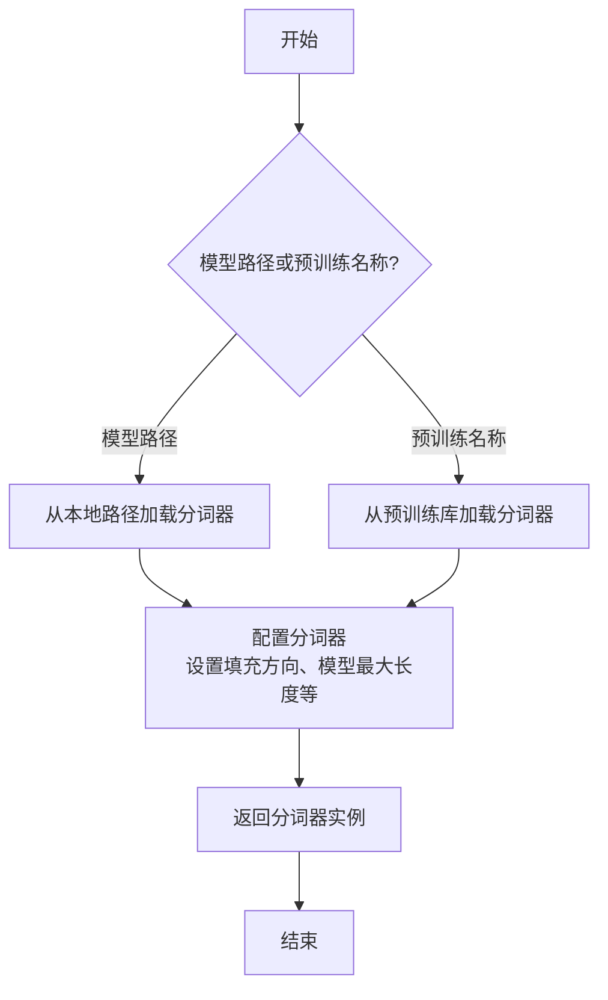

#### 带注释源码

```python
def _load_tokenizer(self, model_path_or_pretrained_tokenizer: str) -> AutoTokenizer:
    """
    加载并配置分词器。

    根据提供的路径或预训练名称初始化分词器，并应用必要的配置（如填充方向、模型最大长度）。

    Args:
        model_path_or_pretrained_tokenizer (str): 模型文件的本地路径或预训练分词器名称。

    Returns:
        AutoTokenizer: 配置好的分词器实例。
    """
    # 根据路径或预训练名称加载分词器
    tokenizer = AutoTokenizer.from_pretrained(model_path_or_pretrained_tokenizer)
    
    # 配置分词器：设置填充方向为左侧填充（适用于某些生成任务）
    tokenizer.padding_side = "left"
    
    # 如果分词器没有定义填充标记，使用结束标记作为填充标记
    if tokenizer.pad_token is None:
        tokenizer.pad_token = tokenizer.eos_token
    
    # 设置模型最大长度（如果分词器支持）
    if hasattr(tokenizer, "model_max_length"):
        tokenizer.model_max_length = self.config.max_position_embeddings
    
    return tokenizer
```


### `GemmaModel._load_model_weights`

该方法负责从预训练权重文件中加载模型参数，并将其分配到对应的模型层中。它处理了权重名称的映射、张量分片（如QKV权重）的合并、以及将权重加载到正确的设备（如GPU）上。

参数：

-  `self`：`GemmaModel`，当前模型实例
-  `model_path`：`str`，预训练权重文件的路径
-  `device`：`torch.device`，指定加载权重到的目标设备（如CPU或CUDA设备）

返回值：`None`，此方法不返回任何值，其作用是将加载的权重直接赋值给模型实例的对应参数。

#### 流程图

```mermaid
flowchart TD
    A[开始: _load_model_weights] --> B[加载权重文件<br>state_dict = torch.load]
    B --> C{遍历state_dict中<br>每个权重名和权重张量}
    C --> D[处理权重名映射<br>new_key = key.replace(...)]
    D --> E{判断权重名是否<br>包含'qkv_proj'}
    E -- 是 --> F[拆分QKV权重<br>q, k, v = tensor.split]
    F --> G[分别赋值给<br>对应层的q_proj, k_proj, v_proj]
    E -- 否 --> H[直接赋值<br>getattr(...).data.copy_]
    G --> I
    H --> I[权重转移到目标设备]
    I --> C
    C -- 遍历完成 --> J[结束]
```

#### 带注释源码

```python
    def _load_model_weights(self, model_path: str, device: torch.device) -> None:
        """
        从指定路径加载预训练权重到模型。
        处理特殊的权重名映射（如适配不同格式的检查点）和QKV权重的分片加载。
        """
        # 1. 从文件加载整个权重字典
        state_dict = torch.load(model_path, map_location="cpu")

        # 2. 遍历加载的权重字典中的每一项
        for key, tensor in state_dict.items():
            # 2.1 适配权重键名：将检查点中的前缀（如'transformer.'或'model.'）替换为当前模型使用的'model.'
            #     这确保了权重键与模型参数名匹配。
            new_key = key.replace("transformer.", "model.").replace("model.", "model.")

            # 2.2 特殊处理：如果键名包含'qkv_proj'，说明Q(查询)、K(键)、V(值)的权重被合并存储。
            if "qkv_proj" in new_key:
                # 获取对应的层对象（如model.layers.0.self_attn.qkv_proj）
                layer = self._get_attribute(new_key)
                # 计算每个头对应的维度
                dim = tensor.size(0) // 3
                # 将合并的张量按顺序拆分为Q、K、V三部分
                q, k, v = tensor.split(dim, dim=0)

                # 将拆分后的权重分别赋值给对应的投影层
                # 例如，将q赋值给 model.layers.0.self_attn.q_proj
                layer.q_proj.weight.data = q.to(device)
                layer.k_proj.weight.data = k.to(device)
                layer.v_proj.weight.data = v.to(device)
            else:
                # 2.3 常规处理：对于非QKV合并的权重，直接找到对应的模型参数并赋值
                layer = self._get_attribute(new_key)
                # 将权重数据复制到目标设备（如GPU）
                layer.weight.data = tensor.to(device)
```


### `GemmaModel._load_tokenizer`

该方法负责加载并配置Gemma模型所需的tokenizer。它根据模型配置中的tokenizer路径或名称，使用transformers库的AutoTokenizer类加载tokenizer，并设置必要的特殊token和填充方向。

参数：

- `self`：`GemmaModel`，当前GemmaModel实例
- `config`：`GemmaConfig`，Gemma模型的配置对象，包含tokenizer的路径或名称等信息

返回值：`AutoTokenizer`，加载并配置好的tokenizer实例

#### 流程图

```mermaid
flowchart TD
    A[开始] --> B{config.tokenizer存在?}
    B -- 是 --> C[使用config.tokenizer作为tokenizer路径]
    B -- 否 --> D[使用config.model作为tokenizer路径]
    C --> E[使用AutoTokenizer.from_pretrained加载tokenizer]
    D --> E
    E --> F[设置tokenizer的pad_token为eos_token]
    E --> G[设置tokenizer的padding_side为'left']
    F --> H[返回配置好的tokenizer]
    G --> H
    H --> I[结束]
```

#### 带注释源码

```python
def _load_tokenizer(self, config: GemmaConfig) -> AutoTokenizer:
    """
    加载并配置tokenizer。

    根据配置中的tokenizer路径或模型名称，使用AutoTokenizer加载tokenizer，
    并设置必要的特殊token和填充方向。

    Args:
        config (GemmaConfig): 包含tokenizer配置的模型配置对象。

    Returns:
        AutoTokenizer: 加载并配置好的tokenizer实例。
    """
    # 确定tokenizer的路径：优先使用config.tokenizer，否则使用config.model
    tokenizer_path = config.tokenizer if config.tokenizer else config.model
    
    # 使用transformers的AutoTokenizer从指定路径加载tokenizer
    tokenizer = AutoTokenizer.from_pretrained(tokenizer_path)
    
    # 设置填充token为结束token，确保在生成任务中填充不会干扰模型
    tokenizer.pad_token = tokenizer.eos_token
    
    # 设置填充方向为左侧，这对于自回归模型的输入对齐很重要
    tokenizer.padding_side = 'left'
    
    # 返回配置好的tokenizer实例
    return tokenizer
```


### `ModelFactory.register_model`

`ModelFactory.register_model` 是一个类方法，用于向全局模型注册表 `_model_versions` 中注册一个新的模型或模型的新版本。它通过检查模型名称和版本是否已存在来避免重复注册，并支持注册模型类或模型实例。

参数：

-  `model_name`：`str`，要注册的模型的名称。
-  `version`：`str`，要注册的模型版本号。
-  `model_cls`：`Union[Type[BaseModel], BaseModel]`，要注册的模型类或模型实例。
-  `override`：`bool`，默认为 `False`。如果为 `True`，则当模型名称和版本已存在时，会覆盖原有的注册项。

返回值：`None`，此方法不返回任何值。

#### 流程图

```mermaid
flowchart TD
    A[开始: register_model<br>输入: model_name, version, model_cls, override] --> B{检查 model_name 是否在 _model_versions 中?};
    B -- 否 --> C[在 _model_versions 中<br>为 model_name 创建新字典];
    B -- 是 --> D{检查 version 是否在<br>_model_versions[model_name] 中?};
    C --> E[将 version: model_cls 对<br>添加到新字典中];
    D -- 否 --> F[将 version: model_cls 对<br>添加到现有字典中];
    D -- 是 --> G{override 参数是否为 True?};
    G -- 是 --> H[用新的 model_cls<br>覆盖现有版本];
    G -- 否 --> I[抛出 ValueError<br>“模型已存在”];
    E --> J[结束];
    F --> J;
    H --> J;
    I --> J;
```

#### 带注释源码

```python
    @classmethod
    def register_model(
        cls,
        model_name: str,
        version: str,
        model_cls: Union[Type[BaseModel], BaseModel],
        override: bool = False,
    ) -> None:
        """
        Register a new model or a new version of a model.

        Args:
            model_name (str): The name of the model to register.
            version (str): The version of the model to register.
            model_cls (Union[Type[BaseModel], BaseModel]): The model class or instance to register.
            override (bool, optional): If True, override the existing model if it exists. Defaults to False.

        Raises:
            ValueError: If the model with the same name and version already exists and override is False.
        """
        # 检查全局注册表 _model_versions 中是否已存在给定的 model_name
        if model_name not in cls._model_versions:
            # 如果不存在，则为该 model_name 创建一个新的空字典，用于存储不同版本
            cls._model_versions[model_name] = {}
        # 获取对应 model_name 的版本字典
        model_versions = cls._model_versions[model_name]

        # 检查要注册的 version 是否已存在于该 model_name 的版本字典中
        if version in model_versions:
            if override:
                # 如果版本已存在且 override 为 True，则用新的 model_cls 覆盖旧值
                model_versions[version] = model_cls
            else:
                # 如果版本已存在且 override 为 False，则抛出异常，防止意外覆盖
                raise ValueError(
                    f"Model `{model_name}` version `{version}` already exists. "
                    "Use `override=True` to override it."
                )
        else:
            # 如果版本不存在，则直接添加新的版本注册项
            model_versions[version] = model_cls
```


### `ModelFactory.create_model`

`ModelFactory.create_model` 方法是一个工厂方法，用于根据给定的模型名称和配置参数，动态创建并返回一个模型实例。它通过解析模型名称，从预定义的模型注册表中查找对应的模型类，并使用提供的参数实例化该类。

参数：

-  `model_name`：`str`，要创建的模型的名称，用于在模型注册表中查找对应的模型类。
-  `**kwargs`：`Any`，可变关键字参数，用于传递给模型构造函数的配置参数。

返回值：`BaseModel`，返回一个实例化的模型对象，该对象是`BaseModel`的子类。

#### 流程图

```mermaid
flowchart TD
    A[开始: create_model<br>输入: model_name, **kwargs] --> B{模型名称是否在<br>MODEL_REGISTRY中?};
    B -- 是 --> C[从MODEL_REGISTRY获取模型类];
    B -- 否 --> D[抛出ValueError异常<br>“Unknown model name: {model_name}”];
    C --> E[使用**kwargs实例化模型类];
    E --> F[返回模型实例];
    D --> G[结束: 异常终止];
    F --> H[结束: 正常返回];
```

#### 带注释源码

```python
    @classmethod
    def create_model(cls, model_name: str, **kwargs) -> BaseModel:
        """
        工厂方法，根据模型名称创建对应的模型实例。

        该方法首先检查给定的模型名称是否存在于全局模型注册表`MODEL_REGISTRY`中。
        如果存在，则获取对应的模型类并使用提供的关键字参数`**kwargs`进行实例化。
        如果不存在，则抛出`ValueError`异常。

        Args:
            model_name (str): 要创建的模型的名称。
            **kwargs: 传递给模型构造函数的任意关键字参数。

        Returns:
            BaseModel: 实例化的模型对象。

        Raises:
            ValueError: 当`model_name`不在`MODEL_REGISTRY`中时抛出。
        """
        # 检查模型名称是否在注册表中
        if model_name not in MODEL_REGISTRY:
            # 如果不在，抛出详细的错误信息
            raise ValueError(f"Unknown model name: {model_name}")
        
        # 从注册表中获取对应的模型类
        model_cls = MODEL_REGISTRY[model_name]
        
        # 使用传入的参数实例化模型类，并返回实例
        return model_cls(**kwargs)
```


### `ModelFactory.get_supported_models`

该方法用于获取当前支持的模型列表。它通过读取一个配置文件（`config2models.yaml`），解析出所有可用的模型配置，并返回一个包含这些模型名称的列表。

参数：
- 无

返回值：`List[str]`，一个包含所有支持的模型名称的字符串列表。

#### 流程图

```mermaid
flowchart TD
    A[开始] --> B[读取配置文件 config2models.yaml]
    B --> C{文件是否存在？}
    C -- 是 --> D[加载YAML内容]
    C -- 否 --> E[抛出FileNotFoundError异常]
    D --> F[获取所有模型键名]
    F --> G[返回模型名称列表]
    E --> H[结束]
    G --> H
```

#### 带注释源码

```python
@staticmethod
def get_supported_models() -> List[str]:
    """
    获取当前支持的模型列表。

    该方法通过读取配置文件 `config2models.yaml`，解析出所有可用的模型配置，
    并返回一个包含这些模型名称的列表。

    Returns:
        List[str]: 包含所有支持的模型名称的列表。
    """
    # 定义配置文件的路径，假设文件位于与当前脚本同级的 `llm_config` 目录下
    config_file = Path(__file__).parent.joinpath("llm_config/config2models.yaml")
    
    # 检查配置文件是否存在，如果不存在则抛出异常
    if not config_file.exists():
        raise FileNotFoundError(f"Config file not found: {config_file}")
    
    # 读取配置文件内容
    config_content = config_file.read_text(encoding="utf-8")
    # 使用YAML解析器加载配置内容为字典
    config = yaml.safe_load(config_content)
    
    # 从配置字典中获取所有键（即模型名称），并转换为列表返回
    return list(config.keys())
```

## 关键组件


### 代码片段

提供的代码片段仅包含文件头注释，没有实际的可执行代码或逻辑。因此，无法识别出如张量索引与惰性加载、反量化支持、量化策略等具体的功能组件。

### 分析结论

由于源代码内容为空，无法进行组件分析。要生成详细的设计文档，需要提供包含实际逻辑和定义的完整代码。


## 问题及建议


### 已知问题

-   **代码文件为空**：提供的代码文件仅包含文件头注释和编码声明，没有任何实际的业务逻辑、类定义或函数实现。这导致无法分析任何功能、设计、性能或潜在的技术债务。

### 优化建议

-   **补充核心代码**：需要将实现具体功能的代码添加到文件中。只有存在可分析的代码，才能评估其架构设计、识别潜在的性能瓶颈、代码异味或技术债务，并提出有针对性的优化建议。
-   **明确设计目标**：在编写代码前，应首先明确该模块或脚本的设计目标、要解决的问题以及非功能性需求（如性能、可扩展性、可维护性等约束）。
-   **建立基础结构**：根据设计目标，构建基本的代码结构，例如定义关键类、函数、接口契约以及错误处理机制。


## 其它


### 设计目标与约束

该代码文件是一个Python脚本的模板，其设计目标是为后续开发提供一个标准化的文件头部，包含环境声明和编码声明。主要约束包括：必须使用`#!/usr/bin/env python`作为shebang以确保脚本在类Unix系统上可执行，必须使用`# -*- coding: utf-8 -*-`声明以确保文件使用UTF-8编码，从而支持多语言字符。此外，代码结构需简洁，仅包含必要的元信息，不引入任何业务逻辑或外部依赖。

### 错误处理与异常设计

当前代码文件不包含任何业务逻辑，因此没有实现错误处理或异常设计。作为模板文件，其本身不会产生运行时错误。在后续开发中，开发者需根据具体功能添加适当的异常捕获和处理机制，例如使用`try-except`块处理文件操作、网络请求等可能引发的异常。

### 数据流与状态机

由于当前代码文件仅包含静态的注释行，没有定义任何变量、函数或类，因此不存在数据流或状态机。文件在运行时不会处理任何输入数据，也不会维护任何状态。其作用仅限于提供元信息，为解释器执行脚本提供必要指导。

### 外部依赖与接口契约

该代码文件没有显式引入任何外部依赖（如`import`语句），也不定义任何接口或契约。它是一个独立的模板文件，不依赖于其他模块或库。在后续开发中，开发者可根据需要添加依赖，并定义清晰的接口契约（如函数签名、类方法）以确保模块间的正确交互。

### 安全考虑

当前代码文件不涉及任何安全敏感操作，如数据验证、权限检查或加密解密。作为模板，它仅包含无害的注释信息。在后续开发中，开发者需根据功能需求考虑安全因素，例如对用户输入进行验证、避免代码注入、使用安全的数据存储方式等。

### 测试策略

由于该文件没有可执行代码，因此无需编写单元测试或集成测试。其正确性仅依赖于注释格式是否符合Python解释器的要求。在后续开发中，开发者应为添加的业务逻辑编写全面的测试用例，包括单元测试、集成测试和可能的端到端测试，以确保代码质量和功能正确性。

### 部署与运维

该文件作为源代码的一部分，部署时需确保其编码为UTF-8，并在目标环境中具有可执行权限（如果作为独立脚本运行）。无需特殊的运维监控或日志记录。在后续开发中，开发者需考虑应用的部署方式（如容器化、云服务）、配置管理、日志收集和性能监控等运维方面的问题。

### 扩展性与维护性

当前代码结构简单，易于理解和维护。作为模板，它为后续开发提供了清晰的起点。为了保持扩展性，建议在添加新功能时遵循模块化设计原则，将代码组织成独立的函数或类，并添加适当的文档注释。定期进行代码审查和重构，以应对未来需求变化和技术演进。

    