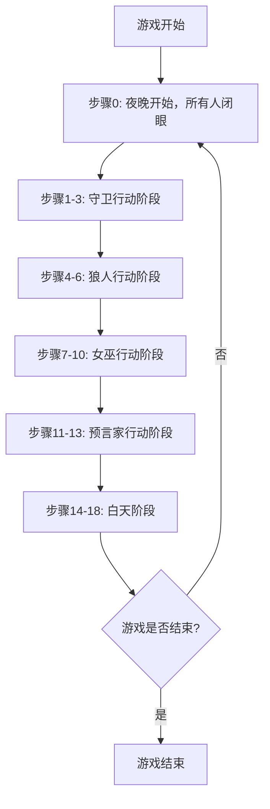

# `.\MetaGPT\metagpt\environment\werewolf\const.py` 详细设计文档

该代码定义了一个狼人杀游戏的核心配置，包括角色类型枚举、角色状态枚举、角色行动结果枚举，以及一个详细的游戏步骤指令字典。这些配置用于在游戏过程中控制不同角色的行动顺序、通信范围和状态流转，为游戏引擎提供结构化的规则和流程定义。

## 整体流程



## 类结构

```
Enums
├── RoleType (角色类型)
├── RoleState (角色状态)
└── RoleActionRes (角色行动结果)
Variables
├── empty_set (空集合)
└── STEP_INSTRUCTIONS (游戏步骤指令字典)
```

## 全局变量及字段


### `empty_set`
    
一个空集合，用于表示没有限制的发送或接收对象。

类型：`set`
    


### `STEP_INSTRUCTIONS`
    
一个字典，键为步骤编号，值为包含指令内容、发送目标和限制目标的字典，定义了游戏主持人按顺序宣布的规则。

类型：`dict[int, dict[str, Union[str, set]]]`
    


    

## 全局函数及方法


## 关键组件


### 角色类型枚举 (RoleType)

定义了游戏中的角色类型，包括村民、狼人、守卫、预言家、女巫和主持人。

### 角色状态枚举 (RoleState)

定义了角色可能处于的状态，如存活、死亡（被杀死或毒死）、被杀死、被毒死、被解救和被保护。

### 角色行动结果枚举 (RoleActionRes)

定义了角色行动的可能结果，如“保存”和“通过”（忽略当前行动输出）。

### 游戏步骤指令字典 (STEP_INSTRUCTIONS)

一个有序字典，定义了游戏主持人（Moderator）在每个游戏步骤中需要宣布的指令内容、指令发送对象以及指令的接收限制范围，用于驱动游戏流程。


## 问题及建议


### 已知问题

-   **硬编码的游戏流程**：游戏步骤（`STEP_INSTRUCTIONS`）被硬编码为一个固定的字典。这导致游戏流程僵化，难以支持规则变体（例如，加入新角色、调整行动顺序或修改胜利条件）或动态调整游戏阶段。
-   **字符串模板与逻辑耦合**：`STEP_INSTRUCTIONS` 中的 `content` 字段包含了需要运行时填充的占位符（如 `{living_players}`）。这些占位符的填充逻辑与步骤定义分离，增加了维护复杂度和出错风险，且缺乏对占位符有效性的编译时或结构化的验证。
-   **状态管理分散**：角色状态（`RoleState`）与游戏步骤指令、角色行动结果（`RoleActionRes`）之间的关联是隐式的。游戏的核心状态（如谁存活、谁被保护、女巫药水数量）没有在一个集中的数据结构中管理，容易导致状态不一致。
-   **枚举值使用不一致**：`STEP_INSTRUCTIONS` 中的 `send_to` 和 `restricted_to` 字段混合使用了 `RoleType` 枚举的 `.value`（字符串）和全局常量 `MESSAGE_ROUTE_TO_ALL`。这种不一致性降低了代码的可读性和类型安全性。
-   **缺乏扩展性设计**：当前设计将角色类型、状态、行动和游戏步骤紧密耦合。添加一个新角色（如“猎人”）需要修改多个枚举和硬编码的步骤字典，违反了开闭原则，扩展成本高。
-   **潜在的魔法字符串**：代码中存在如 `"Protect ..."`, `"Kill ..."`, `"Poison PlayerX"`, `"I vote to eliminate ..."` 等用于解析玩家输入的字符串模板。这些字符串分散在步骤定义中，难以统一管理和修改，且解析逻辑可能脆弱。

### 优化建议

-   **将游戏流程配置化与引擎化**：
    -   **建议**：将 `STEP_INSTRUCTIONS` 抽象为一个可配置的“游戏阶段”或“回合”对象列表。每个阶段对象应包含：阶段名称、目标角色集合、执行的动作（或动作工厂）、输入/输出消息模板等。创建一个游戏引擎（`GameEngine` 或 `RoundManager`）来读取配置并按顺序驱动这些阶段。
    -   **收益**：实现规则与代码解耦，支持通过配置文件或数据库定义游戏流程，极大提升可扩展性和可维护性。

-   **集中化游戏状态管理**：
    -   **建议**：引入一个 `GameState` 类，集中管理所有玩家的状态（引用、角色、存活状态、是否被保护、是否被查验等）、女巫的药水存量、守卫的保护对象、当前的夜晚/白天轮次等信息。游戏引擎和各个角色的行动逻辑都围绕这个核心状态进行操作和查询。
    -   **收益**：提供单一可信源，简化状态同步逻辑，减少bug，并便于实现游戏状态的序列化/反序列化（用于保存/加载游戏）。

-   **重构角色系统为策略模式**：
    -   **建议**：为每个 `RoleType` 定义一个对应的 `Role` 基类及具体子类（如 `VillagerRole`, `WerewolfRole`）。每个角色类负责实现其特定的夜间行动逻辑（如狼人选择击杀目标、女巫选择使用解药/毒药）。游戏引擎在相应阶段调用对应角色集合的行动方法。
    -   **收益**：将角色行为逻辑封装在独立的类中，符合单一职责原则。添加新角色只需新增一个类并注册到引擎中，无需修改核心流程代码。

-   **统一消息通信与解析机制**：
    -   **建议**：设计一个 `Message` 类，包含发送者、接收者、内容、类型等属性。创建一个 `ActionParser` 或使用命令模式来解析玩家输入的字符串，将其转换为内部可执行的行动指令（如 `KillAction(player)`， `VoteAction(player)`）。`STEP_INSTRUCTIONS` 中的提示语应作为生成 `Message` 的模板。
    -   **收益**：将输入输出与内部逻辑分离，提高代码的清晰度和可测试性。可以更容易地支持不同的输入方式（如GUI选择代替文本输入）。

-   **增强枚举与类型提示**：
    -   **建议**：确保 `STEP_INSTRUCTIONS` 中的 `send_to` 和 `restricted_to` 使用统一的类型（如 `Set[Union[RoleType, str]]`，并用 `Literal` 或自定义类型约束 `MESSAGE_ROUTE_TO_ALL`）。为所有函数和方法添加完整的类型注解。
    -   **收益**：利用静态类型检查工具（如mypy）提前发现潜在的类型错误，提高代码健壮性。

-   **提取常量与配置**：
    -   **建议**：将 `empty_set` 和 `STEP_INSTRUCTIONS` 移至单独的配置文件（如 `game_config.py` 或 `rules/werewolf.yaml`）中。`empty_set` 可以直接用 `frozenset()` 或在需要处使用 `set()` 内联，避免一个全局的可变空集合引用。
    -   **收益**：使核心代码更专注于逻辑，配置与代码分离，便于进行A/B测试或支持多套游戏规则。


## 其它


### 设计目标与约束

本模块旨在为“狼人杀”游戏提供一个核心的、声明式的规则与状态定义框架。其核心设计目标是：**通过枚举和字典等静态数据结构，清晰地定义游戏中的角色类型、角色状态、行动结果以及标准化的游戏流程指令**，为上层游戏逻辑（如游戏引擎、角色代理、消息路由）提供统一、无歧义的数据契约和配置基础。

主要设计约束包括：
1.  **静态性**：所有定义（`RoleType`, `RoleState`, `RoleActionRes`, `STEP_INSTRUCTIONS`）在运行时应为常量，不包含动态逻辑，以确保游戏规则的一致性和可预测性。
2.  **可读性与可配置性**：`STEP_INSTRUCTIONS` 字典的结构设计需易于人类阅读和修改，以支持未来游戏规则（如角色技能、流程步骤）的调整。
3.  **松耦合**：本模块仅定义数据和类型，不包含任何游戏状态管理、角色行为逻辑或消息处理的具体实现，与游戏引擎保持接口契约上的松耦合。

### 错误处理与异常设计

当前模块作为纯数据定义模块，本身不包含运行时逻辑，因此**没有显式的错误处理或异常抛出机制**。其错误处理是隐式的，依赖于使用方（如游戏引擎）的正确使用：

1.  **类型安全**：通过 `Enum` 类定义，强制使用方在引用角色类型、状态、行动结果时使用预定义的枚举值，避免了字符串拼写错误。使用方若传入非法值，将在其自身的类型检查或逻辑判断中暴露问题。
2.  **键值访问**：`STEP_INSTRUCTIONS` 的访问依赖于正确的整数键。使用方（如游戏引擎）需要确保其内部的状态机或步骤索引与字典键匹配。键不存在将引发 `KeyError`，这应在游戏引擎的逻辑中被捕获和处理（例如，视为游戏流程结束或重置）。
3.  **模板字符串**：`STEP_INSTRUCTIONS` 中的 `content` 字段包含如 `{living_players}` 的模板变量。使用方在渲染这些消息前，有责任提供正确的上下文变量。若变量缺失，字符串格式化将失败，此错误应在消息组装层被处理。

### 数据流与状态机

本模块定义了游戏状态机的**静态骨架和事件模板**，而非动态的状态机本身。

1.  **状态定义**：`RoleState` 枚举定义了角色可能处于的原子状态（如 `ALIVE`, `DEAD`, `KILLED`）。这些状态是游戏引擎内部角色对象状态字段的合法取值集合。
2.  **流程定义**：`STEP_INSTRUCTIONS` 字典隐式定义了一个**线性的、步骤驱动的游戏流程状态机**。每个整数键（0, 1, 2...）代表流程中的一个特定步骤或阶段。`content` 是该步骤的指令或公告，`send_to` 和 `restricted_to` 定义了该步骤消息的发送目标和可见范围。
3.  **数据流提示**：`STEP_INSTRUCTIONS` 中的模板变量（如 `{living_players}`, `{werewolf_players}`, `{player_hunted}`）指明了在相应步骤，游戏引擎需要从当前游戏上下文中提取并注入的数据。这描述了从游戏引擎状态到消息内容的数据流需求。
4.  **角色动作接口**：`RoleActionRes` 枚举定义了角色行动（如女巫的 `SAVE`、`PASS`）的标准输出格式，为角色代理与游戏引擎之间的动作反馈提供了契约。

### 外部依赖与接口契约

1.  **外部常量依赖**：模块导入了 `metagpt.const` 中的 `MESSAGE_ROUTE_TO_ALL`。这是一个**硬编码的字符串常量依赖**，用于在 `STEP_INSTRUCTIONS` 中标识需要向所有玩家广播的消息。此依赖意味着本模块与 `metagpt` 项目的消息路由系统存在编译时耦合。如果 `MESSAGE_ROUTE_TO_ALL` 的值发生变化，本模块的 `STEP_INSTRUCTIONS` 配置必须同步更新。
2.  **对游戏引擎的接口契约**：
    *   **角色类型契约**：游戏引擎中任何代表游戏角色的对象，其“角色类型”字段应使用 `RoleType` 枚举值。
    *   **角色状态契约**：游戏引擎中角色的“状态”字段应使用 `RoleState` 枚举值。
    *   **流程驱动契约**：游戏引擎应实现一个控制器，能够按 `STEP_INSTRUCTIONS` 定义的键序推进，并根据 `send_to` 和 `restricted_to` 分发消息，同时根据步骤内容中的模板变量查询当前游戏状态并渲染完整消息。
    *   **动作响应契约**：角色代理（如AI玩家）在执行特定步骤动作后，应返回符合 `RoleActionRes` 枚举值格式的字符串，或遵循步骤 `content` 中指定的自然语言格式（如“Protect PlayerA”, “I vote to eliminate PlayerB”）。游戏引擎需解析这些响应。

### 配置与扩展性

1.  **配置化设计**：游戏的核心流程 `STEP_INSTRUCTIONS` 被完全配置化。修改游戏流程（如调整发言顺序、增加新角色环节）理论上只需修改此字典，而无需修改游戏引擎的核心循环逻辑，体现了良好的关注点分离。
2.  **扩展点**：
    *   **新增角色**：需要在 `RoleType` 枚举中添加新类型，并可能在 `STEP_INSTRUCTIONS` 中插入新的步骤来定义该角色的夜间行动环节。
    *   **新增角色状态**：需要在 `RoleState` 枚举中添加新状态。
    *   **新增全局动作**：需要在 `RoleActionRes` 枚举中添加新的结果类型。
    *   **流程调整**：通过调整 `STEP_INSTRUCTIONS` 字典的键值对顺序和内容来实现。需要注意保持键的连续性和 `send_to`/`restricted_to` 设置的合理性。
3.  **局限性**：当前的 `STEP_INSTRUCTIONS` 结构是一个简单的有序字典，它天然支持线性流程，但对**分支流程**（例如，根据女巫是否使用解药决定是否询问毒药步骤）的支持较弱。实现分支需要游戏引擎在运行时根据上下文条件跳过某些步骤，这超出了当前静态配置的能力，需要引擎逻辑的配合。

    