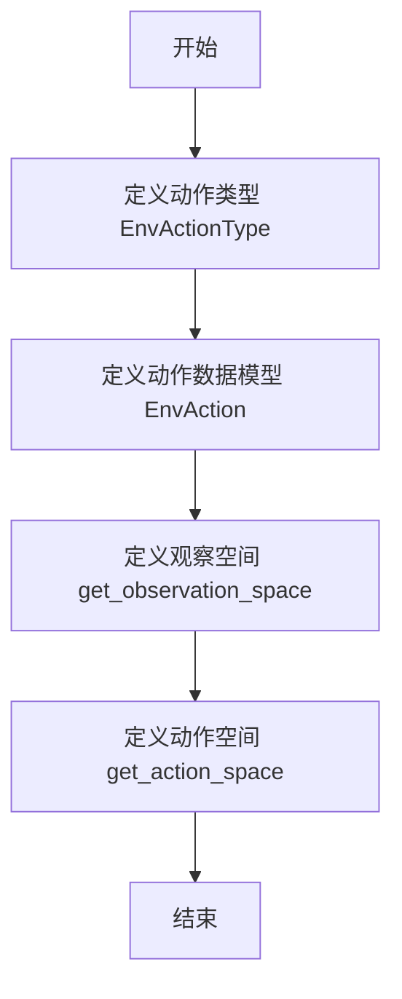
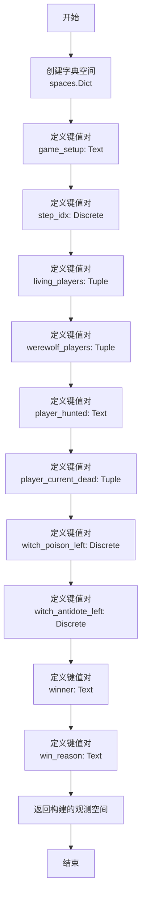
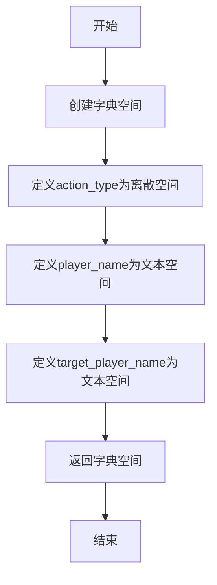

# `.\MetaGPT\metagpt\environment\werewolf\env_space.py` 详细设计文档

该代码定义了狼人杀游戏环境中的观察空间和动作空间，包括动作类型枚举、动作数据模型以及用于强化学习的Gymnasium空间定义。

## 整体流程



## 类结构

```
BaseEnvActionType (抽象基类)
├── EnvActionType (狼人杀动作类型枚举)
BaseEnvAction (抽象基类)
└── EnvAction (狼人杀动作数据模型)
```

## 全局变量及字段


### `STEP_INSTRUCTIONS`
    
存储狼人杀游戏各步骤的指令说明，用于定义游戏流程和步骤索引

类型：`module-level constant (likely a list or dict)`
    


### `EnvActionType.NONE`
    
无操作动作类型，仅用于获取观察状态而不执行任何动作

类型：`int (class attribute)`
    


### `EnvActionType.WOLF_KILL`
    
狼人杀人动作类型，表示狼人阵营在夜晚选择击杀一名玩家

类型：`int (class attribute)`
    


### `EnvActionType.VOTE_KILL`
    
投票杀人动作类型，表示所有玩家在白天通过投票处决一名玩家

类型：`int (class attribute)`
    


### `EnvActionType.WITCH_POISON`
    
女巫毒药动作类型，表示女巫在夜晚使用毒药使一名玩家死亡

类型：`int (class attribute)`
    


### `EnvActionType.WITCH_SAVE`
    
女巫解药动作类型，表示女巫在夜晚使用解药拯救一名被狼人击杀的玩家

类型：`int (class attribute)`
    


### `EnvActionType.GUARD_PROTECT`
    
守卫保护动作类型，表示守卫在夜晚选择保护一名玩家免受狼人攻击

类型：`int (class attribute)`
    


### `EnvActionType.PROGRESS_STEP`
    
步骤推进动作类型，用于控制游戏流程从一个阶段进入下一个阶段

类型：`int (class attribute)`
    


### `EnvAction.model_config`
    
Pydantic模型配置，允许任意类型以支持gymnasium空间等复杂类型

类型：`pydantic.ConfigDict`
    


### `EnvAction.action_type`
    
动作类型标识，对应EnvActionType中定义的具体动作枚举值

类型：`int (pydantic field)`
    


### `EnvAction.player_name`
    
执行动作的玩家名称，标识哪个角色执行当前动作

类型：`str (pydantic field)`
    


### `EnvAction.target_player_name`
    
动作目标玩家名称，标识动作作用的对象（如被击杀、被保护等）

类型：`str (pydantic field)`
    
    

## 全局函数及方法

### `get_observation_space`

该函数用于定义并返回狼人杀游戏环境的观测空间（Observation Space）。观测空间是一个字典结构，描述了智能体（Agent）在环境中可以观察到的所有状态信息，包括游戏设置、当前步骤、存活玩家、狼人玩家、被猎杀的玩家、当前死亡的玩家、女巫的毒药和解药剩余次数、获胜者及获胜原因等。

参数：无

返回值：`gymnasium.spaces.Dict`，返回一个字典类型的观测空间，其中每个键对应一个特定的游戏状态信息，值定义了该信息的类型和取值范围。

#### 流程图



#### 带注释源码

```python
def get_observation_space() -> spaces.Dict:
    # 创建一个字典类型的观测空间，用于描述游戏环境的完整状态
    space = spaces.Dict(
        {
            # 游戏设置信息，使用文本空间，最大长度为256个字符
            "game_setup": spaces.Text(256),
            # 当前步骤索引，使用离散空间，取值范围为0到STEP_INSTRUCTIONS的长度减1
            "step_idx": spaces.Discrete(len(STEP_INSTRUCTIONS)),
            # 存活玩家列表，使用元组空间，每个元素为最大长度16的文本
            # TODO: 当前固定为两个元素，应支持可变长度
            "living_players": spaces.Tuple(
                (spaces.Text(16), spaces.Text(16))
            ),
            # 狼人玩家列表，使用元组空间，每个元素为最大长度16的文本
            # TODO: 当前固定为两个元素，应支持可变长度
            "werewolf_players": spaces.Tuple(
                (spaces.Text(16), spaces.Text(16))
            ),
            # 被猎杀的玩家，使用文本空间，最大长度为16个字符
            "player_hunted": spaces.Text(16),
            # 当前死亡的玩家列表，使用元组空间，每个元素为最大长度16的文本
            # TODO: 当前固定为两个元素，应支持可变长度
            "player_current_dead": spaces.Tuple(
                (spaces.Text(16), spaces.Text(16))
            ),
            # 女巫毒药剩余次数，使用离散空间，取值为0或1
            "witch_poison_left": spaces.Discrete(2),
            # 女巫解药剩余次数，使用离散空间，取值为0或1
            "witch_antidote_left": spaces.Discrete(2),
            # 获胜者，使用文本空间，最大长度为16个字符
            "winner": spaces.Text(16),
            # 获胜原因，使用文本空间，最大长度为64个字符
            "win_reason": spaces.Text(64),
        }
    )
    # 返回构建好的观测空间对象
    return space
```

### `get_action_space`

该函数用于定义狼人杀游戏环境中的动作空间，返回一个包含动作类型、执行动作的玩家名称和目标玩家名称的字典空间。

参数：无

返回值：`gymnasium.spaces.Dict`，返回一个字典空间，定义了游戏中所有可能的动作及其参数的数据结构。

#### 流程图



#### 带注释源码

```python
def get_action_space() -> spaces.Dict:
    # 创建一个字典空间，用于定义游戏中的动作空间
    space = spaces.Dict(
        {
            # 动作类型：离散空间，取值范围为EnvActionType枚举的长度
            "action_type": spaces.Discrete(len(EnvActionType)),
            # 执行动作的玩家名称：文本空间，最大长度为16个字符
            "player_name": spaces.Text(16),  # the player to do the action
            # 目标玩家名称：文本空间，最大长度为16个字符
            "target_player_name": spaces.Text(16),  # the target player who take the action
        }
    )
    # 返回定义好的动作空间
    return space
```

## 关键组件


### 狼人杀环境动作类型定义 (EnvActionType)

定义了狼人杀游戏环境中所有可能的动作类型枚举，包括无操作、狼人杀人、投票杀人、女巫毒人、女巫救人、守卫保护以及推进游戏步骤。

### 狼人杀环境动作模型 (EnvAction)

基于Pydantic的狼人杀环境动作数据模型，用于封装和验证一个具体的游戏动作，包含动作类型、执行动作的玩家名称和目标玩家名称三个核心字段。

### 观察空间构建函数 (get_observation_space)

构建并返回一个描述狼人杀游戏环境状态的Gymnasium观察空间字典，定义了游戏配置、步骤索引、存活玩家、狼人玩家、被狩猎玩家、当前死亡玩家、女巫药水状态以及胜利信息等多个维度的状态表示。

### 动作空间构建函数 (get_action_space)

构建并返回一个描述狼人杀游戏环境可执行动作的Gymnasium动作空间字典，定义了动作类型、执行玩家和目标玩家三个维度的动作表示。


## 问题及建议


### 已知问题

-   **观察空间数据结构固定**：`get_observation_space` 函数中，`living_players`、`werewolf_players` 和 `player_current_dead` 字段被定义为固定长度为2的元组 (`spaces.Tuple((spaces.Text(16), spaces.Text(16)))`)。这限制了游戏的灵活性，无法支持玩家数量不等于2的游戏对局，违反了狼人杀游戏支持多玩家的基本设定。
-   **动作空间定义不精确**：`get_action_space` 函数返回的动作空间是一个通用的字典，包含了所有动作类型可能需要的参数（`player_name`, `target_player_name`）。然而，并非所有动作类型都需要这两个参数（例如，`PROGRESS_STEP` 可能不需要任何玩家参数）。这可能导致代理（Agent）在不需要参数的步骤中仍被要求提供无效或冗余的参数，增加了策略学习的复杂度和动作空间的无效维度。
-   **硬编码的文本长度限制**：观察空间和动作空间中的多个 `spaces.Text` 字段（如 `player_name`, `target_player_name` 等）使用了硬编码的长度（如16, 64, 256）。这些长度限制可能缺乏充分的依据，如果玩家名称或其他文本信息超过此长度，将会导致数据被截断或环境错误。
-   **`EnvAction` 模型字段类型约束不足**：`EnvAction` 类中的 `action_type` 字段类型为 `int`，虽然使用了 `Field` 的 `default` 和 `description`，但并未强制其取值必须在 `EnvActionType` 枚举的范围内。这可能导致传入无效的整数值，而类型检查工具（如mypy）或运行时验证（如Pydantic）在默认配置下可能无法捕获此错误。
-   **潜在的魔法数字**：代码中直接使用了数字（如 `spaces.Text(16)` 中的16）和 `len(STEP_INSTRUCTIONS)`、`len(EnvActionType)` 作为空间维度大小。虽然后者与常量关联，但集中管理这些维度大小或使其可配置会更好，以提升代码的可维护性。

### 优化建议

-   **使用可变长度观察空间**：将 `living_players`、`werewolf_players` 和 `player_current_dead` 的观察空间从固定长度的 `spaces.Tuple` 改为 `spaces.Sequence` 或 `spaces.Box`（配合掩码）来表示可变长度的列表。例如，可以使用 `spaces.Box` 定义一个最大玩家数量的固定长度数组，并配合一个 `spaces.MultiBinary` 掩码来指示哪些位置是有效的。这能更好地匹配游戏状态。
-   **实现参数化的动作空间**：考虑为不同的 `action_type` 定义不同的动作空间结构，或者使用 `spaces.Dict` 的嵌套结构，其中某些字段仅在特定动作类型下有效且必需。更高级的做法是使用 `gymnasium.spaces.Union` 空间（如果支持）或自定义复合空间，以精确匹配每个动作的语义需求。
-   **定义合理的文本长度常量**：将硬编码的文本长度（如16, 64, 256）提取为模块级常量或配置文件参数。例如，`MAX_PLAYER_NAME_LEN = 32`。这些常量的值应基于业务逻辑（如数据库字段限制、UI显示限制）进行合理设定，并添加注释说明其依据。
-   **增强 `EnvAction` 的类型安全**：将 `EnvAction` 的 `action_type` 字段类型从 `int` 改为 `EnvActionType`（枚举类型）。Pydantic 默认支持标准库 `enum.Enum`。这样可以确保该字段的值只能是预定义的枚举成员，提高类型安全性和代码可读性。同时，可以移除 `model_config` 中的 `arbitrary_types_allowed=True` 如果不再需要。
-   **集中管理空间维度配置**：创建一个配置类或字典，集中管理所有观察空间和动作空间的维度参数，如最大玩家数、各种文本字段的最大长度等。这使游戏规模的调整（如支持更多玩家）变得更加容易和清晰。
-   **添加输入验证**：在 `EnvAction` 模型或使用它的函数中，可以添加自定义验证器（Pydantic validator），确保 `action_type`、`player_name` 和 `target_player_name` 之间的组合逻辑正确。例如，验证当 `action_type` 为 `WOLF_KILL` 时，`target_player_name` 不能为空。


## 其它


### 设计目标与约束

本模块的设计目标是定义狼人杀游戏环境中的观察空间（Observation Space）和动作空间（Action Space），并为游戏中的各类动作提供结构化的定义。其核心约束包括：1) 与Gymnasium框架兼容，确保观察和动作空间符合其`spaces` API规范；2) 使用Pydantic进行数据验证和序列化，保证动作数据的结构正确性；3) 模块需清晰区分游戏状态（观察）和玩家可执行操作（动作），为智能体（Agent）提供明确的交互接口；4) 代码需具备可扩展性，便于未来增加新的角色或动作类型。

### 错误处理与异常设计

当前代码未显式定义错误处理逻辑。潜在的异常可能包括：1) 当`EnvAction`中的`action_type`值超出`EnvActionType`枚举范围时，Pydantic可能引发验证错误；2) 在构建观察/动作空间时，如果提供的参数（如文本长度、离散值范围）不合理，Gymnasium可能抛出异常；3) 外部调用者（如游戏引擎）传入不符合空间定义的数据时，可能导致运行时错误。建议未来增加输入验证，例如在`EnvAction`模型中使用`Field`的`ge`和`le`参数约束`action_type`，或在空间构建函数中加入参数校验。

### 数据流与状态机

本模块定义了环境状态（观察）和动作的静态结构，是游戏核心状态机与外部智能体之间的数据契约。数据流通常为：1) 游戏引擎根据内部状态，生成符合`get_observation_space()`结构的观察数据；2) 智能体接收观察数据，并输出符合`get_action_space()`结构的动作数据；3) 动作数据被封装为`EnvAction`实例，传递给游戏引擎执行，驱动游戏状态变迁。`EnvActionType`枚举实质上定义了状态机中可触发状态转移的事件类型（如`WOLF_KILL`, `VOTE_KILL`）。

### 外部依赖与接口契约

1.  **Gymnasium (`gymnasium.spaces`)**: 核心依赖，用于定义符合强化学习标准的环境观察与动作空间。本模块必须返回`spaces.Dict`或其它`Space`子类的实例。
2.  **Pydantic (`pydantic.BaseModel`, `Field`, `ConfigDict`)**: 用于定义并验证动作数据模型(`EnvAction`)，确保数据的类型和结构。
3.  **父级模块 (`metagpt.base.base_env_space`)**: `EnvAction`和`EnvActionType`继承自该模块的基类，需遵循其定义的接口。
4.  **常量模块 (`metagpt.environment.werewolf.const`)**: 依赖`STEP_INSTRUCTIONS`来定义`step_idx`观察空间的离散值范围。
5.  **调用方契约**: 任何使用本模块的游戏引擎或环境类，必须生成符合`get_observation_space()`定义格式的观察字典，并能解析和处理符合`get_action_space()`及`EnvAction`定义格式的动作输入。

### 配置管理与序列化

配置管理主要通过Pydantic模型完成。`EnvAction.model_config = ConfigDict(arbitrary_types_allowed=True)`允许模型字段接受非Pydantic原生类型（虽然当前未使用），提供了灵活性。`EnvAction`类本身即是一个可序列化的数据容器，其字段通过`Field`进行描述和配置（如设置默认值）。观察和动作空间的配置（如文本长度16/256、离散值数量）则硬编码在`get_observation_space`和`get_action_space`函数中，未来可考虑提取为配置参数以增强可维护性。

### 性能考量

当前实现为轻量的数据结构定义，性能开销极小。主要考量点在于空间定义中`spaces.Tuple`的使用，其内部被固定为长度为2的元组（代码中TODO提示应为可变长度）。对于玩家数量变化的游戏，这会导致空间定义不准确或需要填充/截断数据。未来改为可变长度结构（如`spaces.Sequence`）可能带来微小的运行时开销，但能更精确地建模。`spaces.Text`的长度限制需要在内存使用和表达能力之间取得平衡。

    