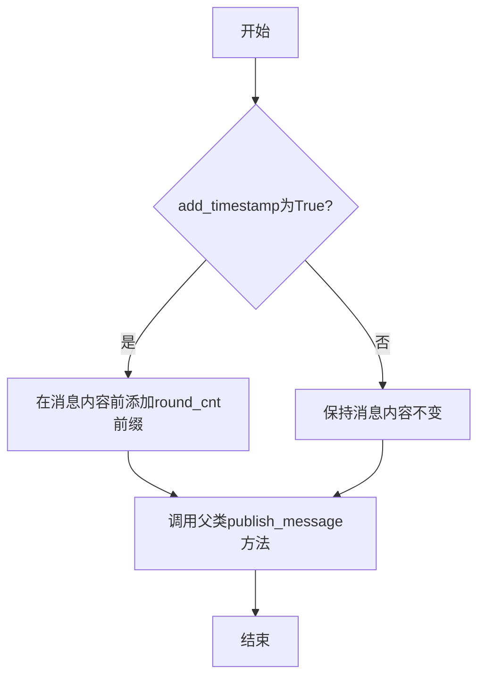
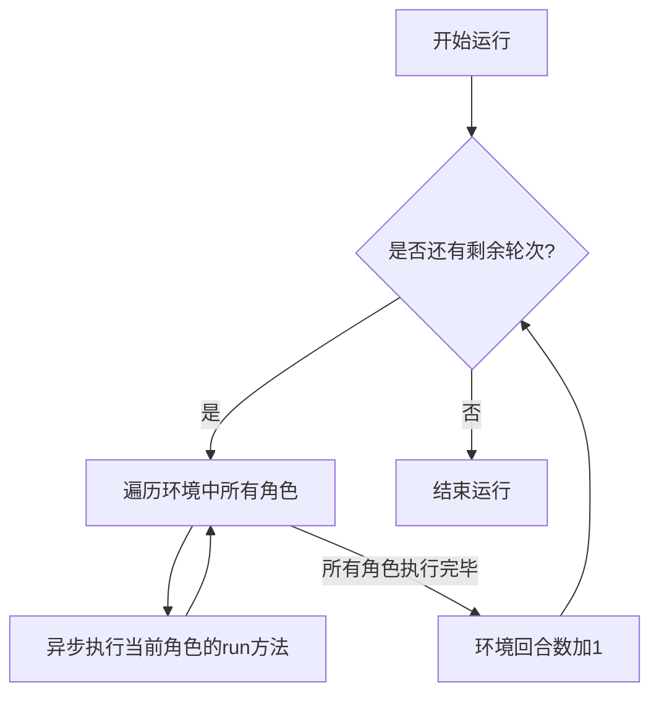

# `.\MetaGPT\metagpt\environment\werewolf\werewolf_env.py` 详细设计文档

该文件定义了一个狼人杀游戏环境类 `WerewolfEnv`，它继承自 `WerewolfExtEnv` 和 `Environment` 基类，用于管理游戏中的角色（`Role`）、处理角色间的消息传递以及控制游戏回合的进行。核心功能包括：批量添加并初始化游戏角色、为环境内发布的消息添加唯一的时间戳前缀以防止重复消息被去重，以及按顺序异步运行所有角色的行动逻辑以推进游戏回合。

## 整体流程

```mermaid
graph TD
    A[游戏环境初始化] --> B[调用 add_roles 添加角色]
    B --> C[为每个角色设置上下文和环境]
    C --> D[游戏主循环开始]
    D --> E{是否达到指定回合数 k?}
    E -- 否 --> F[遍历所有角色]
    F --> G[异步执行 role.run()]
    G --> H[所有角色执行完毕]
    H --> I[round_cnt 回合计数加1]
    I --> D
    E -- 是 --> J[游戏结束]
    K[发布消息 publish_message] --> L{add_timestamp 为 True?}
    L -- 是 --> M[为消息内容添加 'round_cnt | ' 前缀]
    L -- 否 --> N[直接发布消息]
    M --> O[调用父类 publish_message 方法]
    N --> O
```

## 类结构

```
Environment (基类，来自 metagpt.environment.base_env)
├── WerewolfExtEnv (父类，来自 metagpt.environment.werewolf.werewolf_ext_env)
└── WerewolfEnv (本文件定义的主类)
    └── (通过组合管理) Role (角色类，来自外部，非本文件定义)
```

## 全局变量及字段


### `WerewolfEnv.round_cnt`
    
记录狼人杀游戏当前进行的轮次数，用于在消息前添加唯一前缀以避免重复消息被去重

类型：`int`
    
    

## 全局函数及方法

### `WerewolfEnv.add_roles`

该方法用于向当前狼人杀游戏环境中批量添加角色，并初始化这些角色的上下文和环境引用。

参数：

- `roles`：`Iterable["Role"]`，一个可迭代对象，包含要添加到环境中的角色实例。

返回值：`None`，无返回值。

#### 流程图

```mermaid
flowchart TD
    A[开始] --> B{遍历roles中的每个角色}
    B --> C[将角色以name为键存入self.roles字典]
    C --> D{是否遍历完所有角色？}
    D -- 否 --> B
    D -- 是 --> E[再次遍历roles中的每个角色]
    E --> F[设置角色的context为self.context]
    F --> G[调用role.set_env(self)设置环境]
    G --> H{是否遍历完所有角色？}
    H -- 否 --> E
    H -- 是 --> I[结束]
```

#### 带注释源码

```python
def add_roles(self, roles: Iterable["Role"]):
    """增加一批在当前环境的角色
    Add a batch of characters in the current environment
    """
    # 第一遍遍历：将所有角色实例以角色名（role.name）为键存储到环境字典self.roles中。
    # 使用角色名作为键是为了处理多个玩家可能具有相同配置（profile）但名字不同的情况。
    for role in roles:
        self.roles[role.name] = role  # use name as key here, due to multi-player can have same profile

    # 第二遍遍历：为每个角色设置其运行上下文（context）和环境引用（env）。
    # 这确保了每个角色都知道自己属于哪个环境，并能访问环境的共享上下文。
    for role in roles:  # setup system message with roles
        role.context = self.context
        role.set_env(self)
```

### `WerewolfEnv.publish_message`

发布消息到当前环境，并在需要时为消息内容添加时间戳前缀以确保消息的唯一性，避免重复消息被自动去重。

参数：

- `message`：`Message`，要发布的消息对象
- `add_timestamp`：`bool`，是否添加时间戳前缀，默认为True

返回值：`None`，无返回值

#### 流程图



#### 带注释源码

```python
def publish_message(self, message: Message, add_timestamp: bool = True):
    """Post information to the current environment"""
    if add_timestamp:
        # Because the content of the message may be repeated, for example, killing the same person in two nights
        # Therefore, a unique round_cnt prefix needs to be added so that the same message will not be automatically deduplicated when added to the memory.
        message.content = f"{self.round_cnt} | " + message.content
    super().publish_message(message)
```

### `WerewolfEnv.run`

该方法用于按顺序执行环境中所有角色的行动，每完成一轮所有角色的行动后，环境回合数加1。

参数：
- `k`：`int`，指定要运行的轮次数，默认为1。

返回值：`None`，无返回值。

#### 流程图



#### 带注释源码

```python
async def run(self, k=1):
    """Process all Role runs by order"""
    # 外层循环，控制运行的轮次
    for _ in range(k):
        # 内层循环，按顺序遍历环境中的所有角色
        for role in self.roles.values():
            # 异步执行当前角色的run方法，驱动角色行动
            await role.run()
        # 每完成一轮所有角色的行动，环境回合数加1
        self.round_cnt += 1
```

## 关键组件


### 环境基类集成

该类通过多重继承整合了 `WerewolfExtEnv` 的扩展功能和 `Environment` 的基础环境框架，构成了狼人杀游戏环境的核心。

### 角色管理

通过 `add_roles` 方法将一批角色对象添加到环境中，并以角色名称为键进行存储，同时为每个角色设置共享的上下文和环境引用。

### 消息发布与去重

`publish_message` 方法在发布消息时，通过添加基于 `round_cnt` 的唯一前缀，确保即使消息内容相同（如连续两晚刀同一人）也不会在后续处理中被错误地自动去重。

### 回合制运行引擎

`run` 方法提供了游戏的主循环引擎，它按顺序异步执行环境中所有角色的 `run` 方法，每完成一轮所有角色的行动，`round_cnt` 回合计数器递增。


## 问题及建议


### 已知问题

-   **角色键值冲突风险**：`add_roles` 方法中使用 `role.name` 作为字典键。如果多个角色具有相同的 `name` 属性（例如，多个玩家使用相同的预设身份名称），将导致后添加的角色覆盖先添加的角色，造成数据丢失和逻辑错误。
-   **消息去重逻辑依赖单一计数器**：`publish_message` 方法通过添加 `self.round_cnt` 前缀来防止消息去重。然而，在同一轮次（`round_cnt` 相同）内，如果产生两条内容完全相同的消息（例如，两个不同的角色说了完全相同的话），此机制将失效，可能导致有效消息被错误去重。
-   **缺乏运行状态控制与错误处理**：`run` 方法顺序执行所有角色的 `run` 方法。如果某个角色的 `run` 方法抛出异常，整个环境运行将中断，且没有异常处理或恢复机制。同时，缺乏对运行状态（如暂停、停止）的控制。
-   **潜在的循环依赖与紧耦合**：`WerewolfEnv` 同时继承自 `WerewolfExtEnv` 和 `Environment`，并直接操作 `Role` 对象的内部状态（如 `context`, `env`）。这种设计可能带来复杂的继承关系（菱形继承问题）和模块间紧耦合，增加代码维护和理解的难度。

### 优化建议

-   **使用唯一标识符作为角色键**：修改 `add_roles` 方法，为每个 `Role` 实例生成或要求提供一个唯一标识符（如 UUID、`id` 属性），并使用该标识符作为 `self.roles` 字典的键，以避免名称冲突。
-   **增强消息唯一性标识**：改进 `publish_message` 方法中的消息前缀生成逻辑。建议结合 `round_cnt` 和一个更细粒度的唯一标识（如毫秒级时间戳、递增序列号或角色ID）来构造前缀，确保每条消息在全局范围内的唯一性。
-   **增加运行容错与状态管理**：
    1.  在 `run` 方法中，对每个 `role.run()` 的调用进行 `try-except` 包装，记录错误并允许其他角色继续运行，或提供可配置的错误处理策略。
    2.  考虑引入运行状态标志（如 `is_running`）和相应的控制方法（如 `stop`, `pause`），使环境运行更可控。
-   **重构以减少耦合与明确职责**：
    1.  审查 `WerewolfExtEnv` 和 `Environment` 的继承关系，考虑使用组合替代继承（例如，让 `WerewolfEnv` 持有 `WerewolfExtEnv` 的实例），以简化类层次结构。
    2.  考虑将角色与环境绑定的逻辑（`role.set_env(self)`）和上下文设置逻辑移至 `Role` 的初始化或一个明确的“加入环境”方法中，减少 `WerewolfEnv` 对 `Role` 内部细节的直接操作，通过定义清晰的接口来降低耦合度。


## 其它


### 设计目标与约束

1.  **设计目标**：
    *   提供一个支持多角色（玩家）交互的狼人杀游戏环境。
    *   实现游戏回合的自动化推进，支持多轮次（`k`轮）运行。
    *   确保消息在环境中的可靠发布与传递，避免因内容重复导致的自动去重问题。
    *   作为`WerewolfExtEnv`和`Environment`的子类，继承并扩展基础环境功能，实现狼人杀特定的逻辑。

2.  **设计约束**：
    *   必须继承自`metagpt.environment.base_env.Environment`和`metagpt.environment.werewolf.werewolf_ext_env.WerewolfExtEnv`，遵循其接口契约。
    *   角色管理使用角色名称（`role.name`）作为字典键，以支持具有相同配置文件的多个玩家。
    *   消息发布时需要添加时间戳（`round_cnt`）前缀以保证唯一性，防止消息去重。
    *   环境运行方法`run`必须是异步的，以兼容角色可能执行的异步操作。

### 错误处理与异常设计

1.  **错误处理**：
    *   `add_roles`方法：假设传入的`roles`参数是可迭代的，未对`roles`为空或非迭代对象进行显式检查。调用方需确保传入有效数据。
    *   `publish_message`方法：直接修改传入`message`对象的`content`属性。如果`message`对象在外部被其他代码引用，此修改将产生副作用。调用方需注意此行为。
    *   `run`方法：循环内直接`await role.run()`，未对角色运行过程中可能抛出的异常进行捕获和处理。任何角色运行时的异常都会导致整个环境运行中断。

2.  **异常设计**：
    *   当前代码未定义任何自定义异常。所有错误均依赖Python内置异常或父类方法可能抛出的异常。
    *   建议的改进：可定义环境特定的异常（如`RoleAddError`、`RoundExecutionError`），并在关键操作中进行更精细的异常捕获与处理，提高系统健壮性。

### 数据流与状态机

1.  **数据流**：
    *   **角色添加**：外部通过`add_roles`将角色对象注入环境。环境将角色存储于`self.roles`字典（继承），并为每个角色设置上下文和环境引用。
    *   **消息发布**：环境内部或角色通过`publish_message`发布消息。环境对消息内容添加当前回合计数（`self.round_cnt`）作为前缀后，调用父类方法将消息发布到环境上下文中。
    *   **环境运行**：调用`run(k)`启动`k`轮游戏。每轮中，按`self.roles`中的顺序（注意：Python 3.7+字典保持插入顺序）异步执行每个角色的`run`方法。一轮所有角色执行完毕后，`self.round_cnt`加1。

2.  **状态机**：
    *   **核心状态**：`round_cnt`（整数），表示当前已完成的游戏回合数。它在`run`方法中每完成一轮递增，是环境推进的标志。
    *   **状态转移**：环境从“初始”状态（`round_cnt=0`）开始，每次成功执行`run(1)`（或`run(k)`的一轮）后，转移到“第N轮完成”状态（`round_cnt=N`）。`round_cnt`是单调递增的。
    *   **角色状态**：角色的状态（如存活、死亡、技能使用情况）由角色自身管理，环境不直接维护，但通过`role.run()`驱动其状态转移。

### 外部依赖与接口契约

1.  **外部依赖**：
    *   **父类**：`WerewolfExtEnv`（预计包含狼人杀扩展逻辑）和`Environment`（基础环境类）。本类依赖它们提供的基础设施（如`roles`字典、`publish_message`方法、`context`）。
    *   **类型定义**：依赖`typing.Iterable`用于类型注解。
    *   **数据模型**：依赖`pydantic.Field`用于字段定义和验证。
    *   **消息格式**：依赖`metagpt.schema.Message`作为消息传递的标准格式。
    *   **角色接口**：依赖`Role`类（通过字符串引用来避免循环导入）必须提供`name`、`context`属性，以及`set_env`方法和异步的`run`方法。

2.  **接口契约**：
    *   **`add_roles(roles: Iterable[“Role”]) -> None`**：契约要求调用方提供可迭代的`Role`对象集合。环境负责将其加入管理并为它们设置上下文和环境。
    *   **`publish_message(message: Message, add_timestamp: bool = True) -> None`**：契约要求调用方提供`Message`对象。环境根据`add_timestamp`决定是否修改消息内容后，将其发布。
    *   **`async def run(k: int = 1) -> None`**：契约要求调用方在异步上下文中调用此方法。环境负责顺序执行`k`轮角色行动，并更新内部回合状态。不返回结果，执行效果通过环境状态和消息体现。

    