# `.\MetaGPT\metagpt\environment\werewolf\werewolf_ext_env.py` 详细设计文档

该代码实现了一个狼人杀游戏的外部环境（WerewolfExtEnv），它继承自一个通用的外部环境基类（ExtEnv）。该环境负责管理游戏的核心状态（如玩家角色、生命状态、回合/步骤索引）、处理游戏动作（如狼人杀人、投票、女巫用药、守卫保护）并推进游戏流程。它通过一系列标记为可读或可写的类方法来提供游戏信息交互接口，并内置了游戏胜负判定逻辑。

## 整体流程

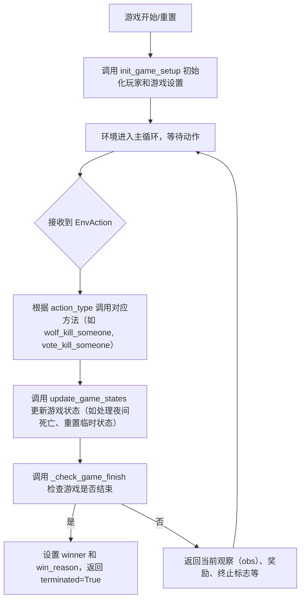

## 类结构

```
ExtEnv (外部环境基类)
└── WerewolfExtEnv (狼人杀游戏外部环境)
    ├── 类字段 (Pydantic Field): players_state, round_idx, step_idx, ...
    ├── 属性 (Property): living_players, werewolf_players, villager_players
    ├── 核心方法: step, _check_game_finish, init_game_setup
    ├── 动作处理方法: wolf_kill_someone, vote_kill_someone, witch_poison_someone, ...
    ├── 状态更新方法: update_game_states, _update_players_state
    └── 辅助方法: _get_obs, _role_type_players, _check_valid_role, ...
```

## 全局变量及字段


### `WerewolfExtEnv.players_state`
    
存储所有玩家的角色类型和当前状态，键为玩家名，值为（角色类型，状态）元组。

类型：`dict[str, tuple[str, RoleState]]`
    


### `WerewolfExtEnv.round_idx`
    
当前游戏进行的轮次索引。

类型：`int`
    


### `WerewolfExtEnv.step_idx`
    
当前轮次内的步骤索引，用于跟踪游戏流程。

类型：`int`
    


### `WerewolfExtEnv.eval_step_idx`
    
记录已评估过的步骤索引，防止在同一游戏步骤中重复评估状态。

类型：`list[int]`
    


### `WerewolfExtEnv.per_round_steps`
    
每轮游戏包含的步骤总数，通常等于预定义步骤指令的长度。

类型：`int`
    


### `WerewolfExtEnv.game_setup`
    
游戏初始设置信息，包含所有玩家的角色分配详情。

类型：`str`
    


### `WerewolfExtEnv.special_role_players`
    
持有特殊角色（非狼人和普通村民）的玩家名称列表。

类型：`list[str]`
    


### `WerewolfExtEnv.winner`
    
游戏获胜方标识，例如“good guys”或“werewolf”。

类型：`Optional[str]`
    


### `WerewolfExtEnv.win_reason`
    
游戏结束的原因描述，解释为何某一方获胜。

类型：`Optional[str]`
    


### `WerewolfExtEnv.witch_poison_left`
    
女巫剩余的毒药使用次数，通常为1或0。

类型：`int`
    


### `WerewolfExtEnv.witch_antidote_left`
    
女巫剩余的解毒剂使用次数，通常为1或0。

类型：`int`
    


### `WerewolfExtEnv.round_hunts`
    
记录当前轮次夜间狼人猎杀投票结果，键为狼人玩家名，值为被猎杀目标玩家名。

类型：`dict[str, str]`
    


### `WerewolfExtEnv.round_votes`
    
记录当前轮次日间所有玩家投票结果，键为投票者名，值为被投票者名。

类型：`dict[str, str]`
    


### `WerewolfExtEnv.player_hunted`
    
当前轮次被狼人猎杀的目标玩家名。

类型：`Optional[str]`
    


### `WerewolfExtEnv.player_protected`
    
当前轮次被守卫保护的玩家名。

类型：`Optional[str]`
    


### `WerewolfExtEnv.is_hunted_player_saved`
    
标识被狼人猎杀的玩家是否被女巫的解毒剂救活。

类型：`bool`
    


### `WerewolfExtEnv.player_poisoned`
    
当前轮次被女巫毒药毒杀的玩家名。

类型：`Optional[str]`
    


### `WerewolfExtEnv.player_current_dead`
    
当前轮次结束时确定死亡的玩家名称列表。

类型：`list[str]`
    
    

## 全局函数及方法


### `WerewolfExtEnv.reset`

该方法用于重置狼人杀游戏的外部环境状态，但目前尚未实现具体功能，仅作为占位符存在。

参数：

- `seed`：`Optional[int]`，可选参数，用于设置随机数生成器的种子，以确保环境重置后随机行为的一致性。
- `options`：`Optional[dict[str, Any]]`，可选参数，一个字典，可用于传递额外的重置选项或配置。

返回值：`tuple[dict[str, Any], dict[str, Any]]`，返回一个元组，包含两个字典。第一个字典通常表示环境的初始观察状态，第二个字典包含额外的信息（如调试信息）。由于方法未实现，当前返回空值。

#### 流程图

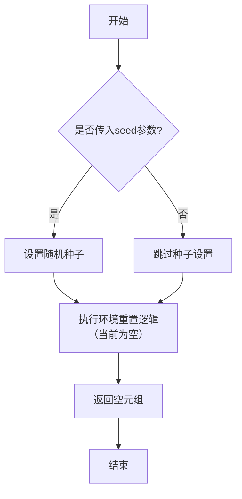

#### 带注释源码

```python
    def reset(
        self,
        *,
        seed: Optional[int] = None,
        options: Optional[dict[str, Any]] = None,
    ) -> tuple[dict[str, Any], dict[str, Any]]:
        """currently unused"""  # 当前未使用，仅作为占位符
        pass  # 方法体为空，未实现任何重置逻辑
```


### `WerewolfExtEnv.observe`

该方法用于获取当前狼人杀游戏环境的观察状态。它接收一个可选的观察参数对象，但目前未实现具体功能，直接返回 `None`。

参数：

-  `obs_params`：`Optional[BaseEnvObsParams]`，可选的观察参数，用于定制观察行为，当前未使用。

返回值：`Any`，当前实现中始终返回 `None`。

#### 流程图

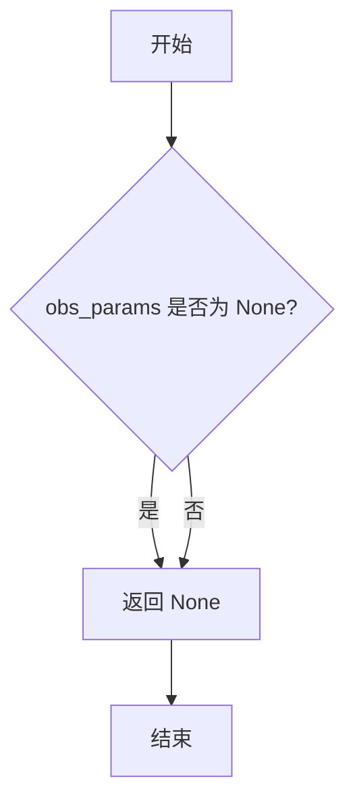

#### 带注释源码

```python
def observe(self, obs_params: Optional[BaseEnvObsParams] = None) -> Any:
    """currently unused"""  # 方法描述：当前未使用
    pass  # 占位符，表示方法体为空，直接返回 None
```


### `WerewolfExtEnv._get_obs`

该方法用于获取狼人杀游戏环境的当前观察状态。它返回一个字典，包含了游戏的核心状态信息，如游戏设置、当前步骤索引、存活玩家列表、狼人玩家列表、被狼人猎杀的玩家、当前回合死亡的玩家、女巫的药水剩余情况以及游戏获胜者和获胜原因。这些信息为智能体（玩家）提供了决策所需的环境上下文。

参数：无

返回值：`dict`，包含以下键值对的字典：
- `game_setup`：游戏设置信息，包括角色及其数量。
- `step_idx`：当前步骤索引。
- `living_players`：当前存活的玩家列表。
- `werewolf_players`：狼人玩家列表（目前缺乏观察隔离）。
- `player_hunted`：被狼人猎杀的玩家。
- `player_current_dead`：当前回合死亡的玩家列表。
- `witch_poison_left`：女巫毒药剩余次数。
- `witch_antidote_left`：女巫解药剩余次数。
- `winner`：游戏获胜者。
- `win_reason`：获胜原因。

#### 流程图

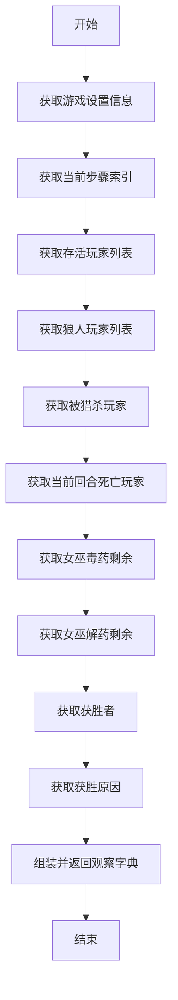

#### 带注释源码

```python
def _get_obs(self):
    # 返回一个字典，包含游戏环境的当前观察状态
    return {
        "game_setup": self.game_setup,  # 游戏设置信息，包括角色及其数量
        "step_idx": self.step_idx,  # 当前步骤索引
        "living_players": self.living_players,  # 当前存活的玩家列表
        "werewolf_players": self.werewolf_players,  # 狼人玩家列表（目前缺乏观察隔离）
        "player_hunted": self.player_hunted,  # 被狼人猎杀的玩家
        "player_current_dead": self.player_current_dead,  # 当前回合死亡的玩家列表
        "witch_poison_left": self.witch_poison_left,  # 女巫毒药剩余次数
        "witch_antidote_left": self.witch_antidote_left,  # 女巫解药剩余次数
        "winner": self.winner,  # 游戏获胜者
        "win_reason": self.win_reason,  # 获胜原因
    }
```

### `WerewolfExtEnv.step`

该方法处理狼人杀游戏环境中的一步动作，根据传入的动作类型执行相应的游戏逻辑（如狼人杀人、投票、女巫用药等），然后更新游戏状态并检查游戏是否结束，最后返回新的观察值、奖励、终止标志等信息。

参数：

- `action`：`EnvAction`，包含动作类型、执行玩家和目标玩家的动作对象

返回值：`tuple[dict[str, Any], float, bool, bool, dict[str, Any]]`，返回一个五元组，包含：
  - 观察值字典（游戏状态信息）
  - 奖励值（固定为1.0）
  - 游戏是否终止的标志
  - 截断标志（固定为False）
  - 额外信息字典（固定为空字典）

#### 流程图

```mermaid
flowchart TD
    A[开始] --> B[解析action参数<br>获取action_type, player_name, target_player_name]
    B --> C{根据action_type<br>执行对应操作}
    C -->|WOLF_KILL| D[调用wolf_kill_someone]
    C -->|VOTE_KILL| E[调用vote_kill_someone]
    C -->|WITCH_POISON| F[调用witch_poison_someone]
    C -->|WITCH_SAVE| G[调用witch_save_someone]
    C -->|GUARD_PROTECT| H[调用guard_protect_someone]
    C -->|PROGRESS_STEP| I[调用progress_step]
    C -->|NONE| J[无操作]
    C -->|其他| K[抛出ValueError异常]
    D --> L[调用update_game_states<br>更新游戏状态]
    E --> L
    F --> L
    G --> L
    H --> L
    I --> L
    J --> L
    L --> M[调用_check_game_finish<br>检查游戏是否结束]
    M --> N[获取观察值obs]
    N --> O[返回obs, 1.0, terminated, False, {}]
```

#### 带注释源码

```python
def step(self, action: EnvAction) -> tuple[dict[str, Any], float, bool, bool, dict[str, Any]]:
    # 解析动作类型、执行玩家和目标玩家
    action_type = action.action_type
    player_name = action.player_name
    target_player_name = action.target_player_name
    
    # 根据动作类型执行相应的游戏逻辑
    if action_type == EnvActionType.WOLF_KILL:
        self.wolf_kill_someone(wolf_name=player_name, player_name=target_player_name)
    elif action_type == EnvActionType.VOTE_KILL:
        self.vote_kill_someone(voter_name=player_name, player_name=target_player_name)
    elif action_type == EnvActionType.WITCH_POISON:
        self.witch_poison_someone(witch_name=player_name, player_name=target_player_name)
    elif action_type == EnvActionType.WITCH_SAVE:
        self.witch_save_someone(witch_name=player_name, player_name=target_player_name)
    elif action_type == EnvActionType.GUARD_PROTECT:
        self.guard_protect_someone(guard_name=player_name, player_name=target_player_name)
    elif action_type == EnvActionType.PROGRESS_STEP:
        self.progress_step()
    elif action_type == EnvActionType.NONE:
        pass  # 无操作
    else:
        raise ValueError(f"not supported action_type: {action_type}")
    
    # 更新游戏状态
    self.update_game_states()
    # 检查游戏是否结束
    terminated = self._check_game_finish()
    # 获取当前观察值
    obs = self._get_obs()
    # 返回标准的环境步进结果：观察值、奖励、终止标志、截断标志、额外信息
    return obs, 1.0, terminated, False, {}
```


### `WerewolfExtEnv._check_game_finish`

该方法检查狼人杀游戏是否满足结束条件。它通过分析当前存活的狼人、村民和特殊角色（如女巫、预言家等）的数量来判断游戏是否应该终止。如果狼人全部死亡，则好人阵营获胜；如果村民或特殊角色全部死亡，则狼人阵营获胜。游戏结束时，会设置获胜方（`winner`）和获胜原因（`win_reason`）。

参数：
-  `self`：`WerewolfExtEnv`，当前狼人游戏外部环境的实例。

返回值：`bool`，如果游戏结束则返回 `True`，否则返回 `False`。

#### 流程图

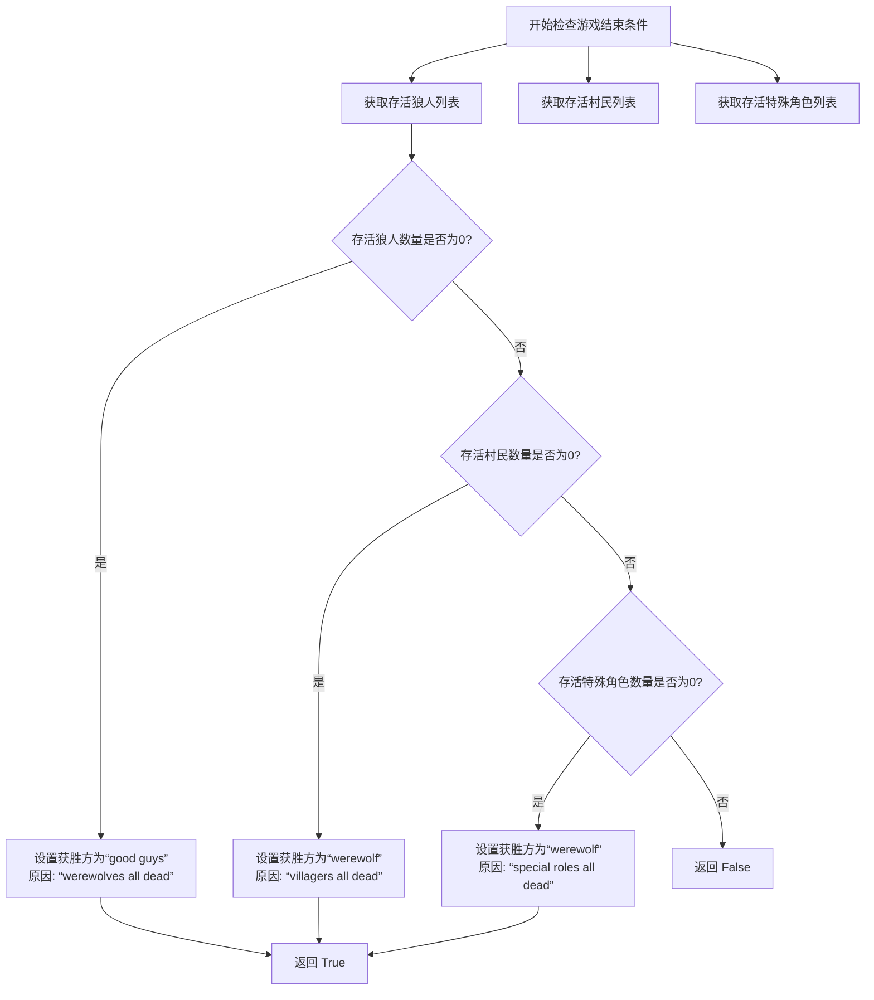

#### 带注释源码

```python
def _check_game_finish(self) -> bool:
    """return True if game finished else False"""
    # game's termination condition
    terminated = False
    # 计算当前存活的狼人玩家列表
    living_werewolf = [p for p in self.werewolf_players if p in self.living_players]
    # 计算当前存活的村民玩家列表
    living_villagers = [p for p in self.villager_players if p in self.living_players]
    # 计算当前存活的特殊角色玩家列表（非狼人、非村民）
    living_special_roles = [p for p in self.special_role_players if p in self.living_players]
    
    # 条件1: 如果存活狼人数量为0，则好人阵营获胜
    if not living_werewolf:
        self.winner = "good guys"
        self.win_reason = "werewolves all dead"
        terminated = True
    # 条件2: 如果存活村民数量为0 或 存活特殊角色数量为0，则狼人阵营获胜
    elif not living_villagers or not living_special_roles:
        self.winner = "werewolf"
        # 根据具体是村民还是特殊角色全部死亡来设置获胜原因
        self.win_reason = "villagers all dead" if not living_villagers else "special roles all dead"
        terminated = True
    # 返回游戏是否终止的布尔值
    return terminated
```


### `WerewolfExtEnv.living_players`

该属性用于获取当前游戏中所有存活玩家的名称列表。它通过遍历`players_state`字典，筛选出状态为`ALIVE`或`SAVED`的玩家，并返回他们的名称。

参数：无

返回值：`list[str]`，返回一个包含所有存活玩家名称的列表。

#### 流程图

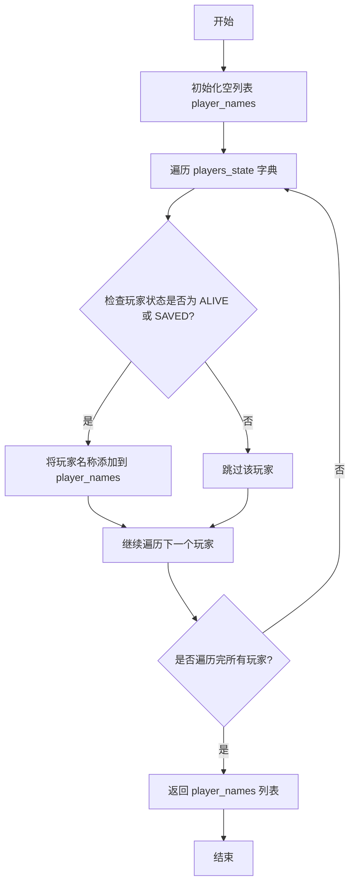

#### 带注释源码

```python
@property
def living_players(self) -> list[str]:
    # 初始化一个空列表，用于存储存活玩家的名称
    player_names = []
    # 遍历 players_state 字典，其中键为玩家名称，值为一个元组（角色类型, 状态）
    for name, roletype_state in self.players_state.items():
        # 检查玩家的状态是否为 ALIVE 或 SAVED
        if roletype_state[1] in [RoleState.ALIVE, RoleState.SAVED]:
            # 如果是，则将玩家名称添加到列表中
            player_names.append(name)
    # 返回包含所有存活玩家名称的列表
    return player_names
```


### `WerewolfExtEnv._role_type_players`

该方法根据给定的角色类型（如“狼人”、“村民”），从游戏状态中筛选出所有属于该角色的玩家名称列表。

参数：

-  `role_type`：`str`，需要筛选的特定角色类型字符串，例如 `RoleType.WEREWOLF.value`。

返回值：`list[str]`，一个包含所有属于指定 `role_type` 的玩家名称的列表。

#### 流程图

```mermaid
flowchart TD
    A[开始: 输入 role_type] --> B[初始化空列表 player_names]
    B --> C{遍历 players_state 字典?}
    C -- 是 --> D[获取玩家名 name 和状态 roletype_state]
    D --> E{role_type 是否在 roletype_state[0] 中?}
    E -- 是 --> F[将 name 加入 player_names 列表]
    F --> C
    E -- 否 --> C
    C -- 遍历结束 --> G[返回 player_names 列表]
    G --> H[结束]
```

#### 带注释源码

```python
    def _role_type_players(self, role_type: str) -> list[str]:
        """return player name of particular role type"""
        # 初始化一个空列表，用于存储符合条件的玩家名称
        player_names = []
        # 遍历 self.players_state 字典，该字典存储了所有玩家的状态
        # 键 (name) 是玩家名称，值 (roletype_state) 是一个元组 (角色类型字符串, 角色状态枚举)
        for name, roletype_state in self.players_state.items():
            # 检查传入的 role_type 字符串是否包含在玩家的角色类型字符串 (roletype_state[0]) 中
            # 例如，如果 role_type 是 "werewolf"，玩家的 roletype_state[0] 是 "werewolf"，则条件为真
            if role_type in roletype_state[0]:
                # 如果条件满足，将该玩家的名称添加到结果列表中
                player_names.append(name)
        # 返回包含所有指定角色类型玩家名称的列表
        return player_names
```


### `WerewolfExtEnv.werewolf_players`

这是一个计算属性（property），用于获取当前游戏中所有狼人角色（RoleType.WEREWOLF）的玩家名称列表。它通过调用内部辅助方法 `_role_type_players` 来实现，筛选出 `players_state` 字典中角色类型包含“狼人”的玩家。

参数：
-  `self`：`WerewolfExtEnv`，当前 `WerewolfExtEnv` 类的实例。

返回值：`list[str]`，包含所有狼人玩家名称的列表。

#### 流程图

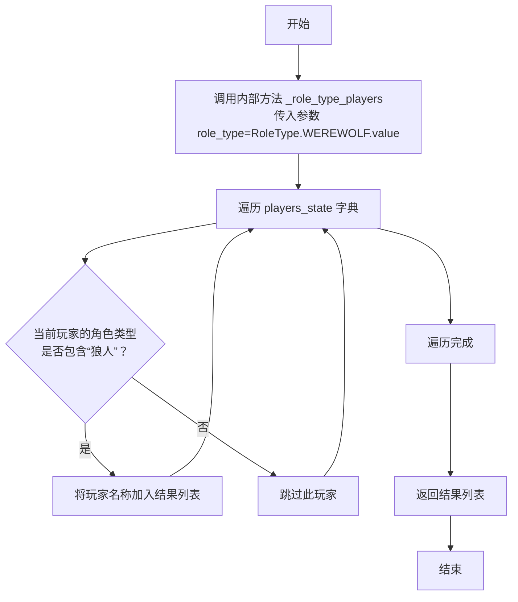

#### 带注释源码

```python
    @property
    def werewolf_players(self) -> list[str]:
        # 调用内部辅助方法 _role_type_players，传入狼人角色的类型标识符
        player_names = self._role_type_players(role_type=RoleType.WEREWOLF.value)
        # 返回筛选出的狼人玩家名称列表
        return player_names
```


### `WerewolfExtEnv.villager_players`

该属性用于获取当前游戏中所有村民角色（`RoleType.VILLAGER`）的玩家名称列表。它通过调用内部辅助方法 `_role_type_players`，根据角色类型筛选出对应的玩家。

参数：
-  `self`：`WerewolfExtEnv`，当前 `WerewolfExtEnv` 类的实例。

返回值：`list[str]`，包含所有村民角色玩家名称的列表。

#### 流程图

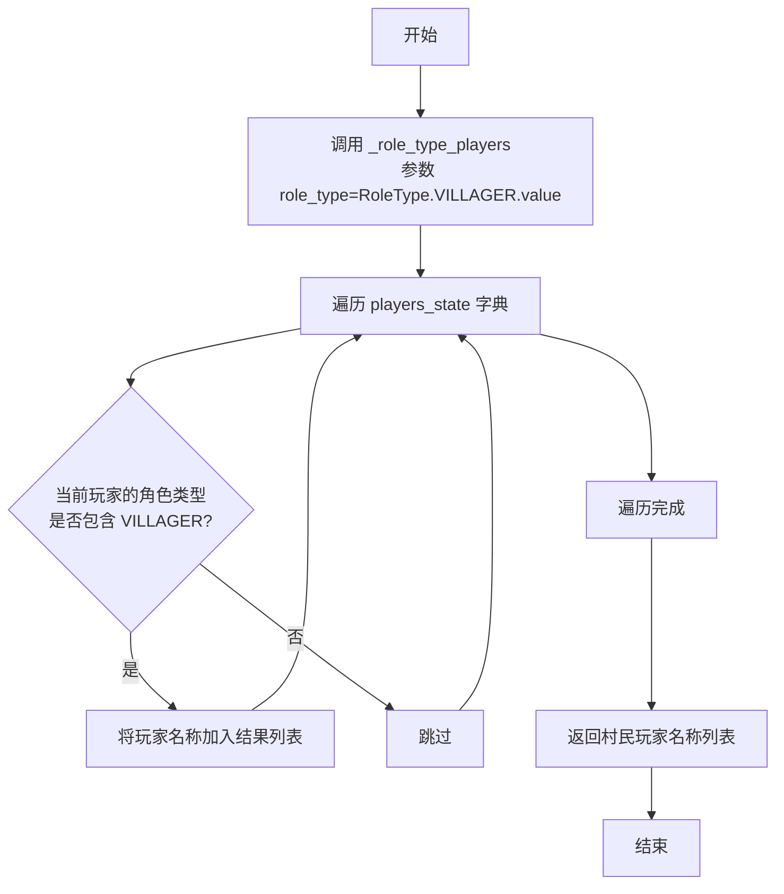

#### 带注释源码

```python
    @property
    def villager_players(self) -> list[str]:
        # 调用内部辅助方法，传入村民角色的类型标识符，获取对应的玩家名称列表
        player_names = self._role_type_players(role_type=RoleType.VILLAGER.value)
        # 返回村民玩家名称列表
        return player_names
```

### `WerewolfExtEnv._init_players_state`

该方法用于初始化游戏环境中所有玩家的状态。它接收一个玩家角色列表，将每个玩家的名称、角色类型和初始状态（存活）记录到`players_state`字典中，并更新特殊角色玩家的列表。

参数：

- `players`：`list["Role"]`，包含所有玩家角色实例的列表。

返回值：`None`，无返回值。

#### 流程图

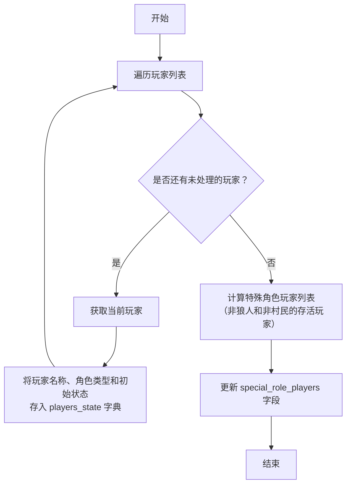

#### 带注释源码

```python
def _init_players_state(self, players: list["Role"]):
    # 遍历传入的玩家角色列表
    for play in players:
        # 将每个玩家的名称作为键，其角色类型（play.profile）和初始状态（RoleState.ALIVE）作为值存入 players_state 字典
        self.players_state[play.name] = (play.profile, RoleState.ALIVE)

    # 更新特殊角色玩家列表：从所有存活玩家中，排除狼人玩家和村民玩家，剩下的即为特殊角色玩家（如女巫、预言家、守卫等）
    self.special_role_players = [
        p for p in self.living_players if p not in self.werewolf_players + self.villager_players
    ]
```


### `WerewolfExtEnv.init_game_setup`

该方法用于初始化狼人杀游戏的玩家配置。它根据指定的村民和狼人数量，结合传入的特殊角色对象列表，构建完整的玩家角色列表，并进行随机洗牌。可选地，它可以添加一个人类玩家，并最终初始化游戏环境的状态。

参数：

-  `role_uniq_objs`：`list[object]`，包含游戏中所有独特角色类对象的列表（例如，预言家、女巫、守卫等）。
-  `num_villager`：`int`，村民角色的数量，默认为2。
-  `num_werewolf`：`int`，狼人角色的数量，默认为2。
-  `shuffle`：`bool`，是否对最终的角色列表进行随机洗牌，默认为True。
-  `add_human`：`bool`，是否在游戏中添加一个人类玩家，默认为False。
-  `use_reflection`：`bool`，传递给角色构造函数的参数，控制是否使用反思机制。
-  `use_experience`：`bool`，传递给角色构造函数的参数，控制是否使用经验。
-  `use_memory_selection`：`bool`，传递给角色构造函数的参数，控制是否使用记忆选择。
-  `new_experience_version`：`str`，传递给角色构造函数的参数，指定新经验的版本。
-  `prepare_human_player`：`Callable`，一个可调用对象，用于准备人类玩家角色，接收一个角色对象并返回一个处理后的角色对象（当前为TODO状态）。

返回值：`tuple[str, list]`，返回一个元组，包含游戏设置的字符串描述（列出所有玩家及其角色）和实例化后的玩家对象列表。

#### 流程图

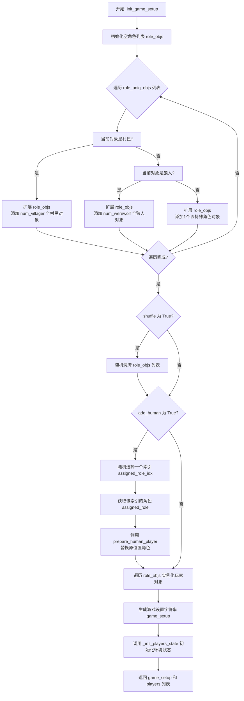

#### 带注释源码

```python
    def init_game_setup(
        self,
        role_uniq_objs: list[object],
        num_villager: int = 2,
        num_werewolf: int = 2,
        shuffle=True,
        add_human=False,
        use_reflection=True,
        use_experience=False,
        use_memory_selection=False,
        new_experience_version="",
        prepare_human_player=Callable,
    ) -> tuple[str, list]:
        """init players using different roles' num"""
        # 1. 根据角色类型和指定数量，构建基础角色对象列表
        role_objs = []
        for role_obj in role_uniq_objs:
            if RoleType.VILLAGER.value in str(role_obj):
                role_objs.extend([role_obj] * num_villager)  # 添加指定数量的村民
            elif RoleType.WEREWOLF.value in str(role_obj):
                role_objs.extend([role_obj] * num_werewolf)  # 添加指定数量的狼人
            else:
                role_objs.append(role_obj)  # 特殊角色（预言家、女巫等）各添加一个
        # 2. 可选：随机洗牌角色顺序
        if shuffle:
            random.shuffle(role_objs)
        # 3. 可选：添加人类玩家（替换其中一个角色）
        if add_human:
            assigned_role_idx = random.randint(0, len(role_objs) - 1)  # 随机选择被替换的角色索引
            assigned_role = role_objs[assigned_role_idx]  # 获取被替换的角色对象
            role_objs[assigned_role_idx] = prepare_human_player(assigned_role)  # TODO: 用人类玩家角色替换

        # 4. 实例化所有角色对象，创建玩家列表
        players = [
            role(
                name=f"Player{i + 1}",  # 为每个玩家生成名称，如 Player1, Player2...
                use_reflection=use_reflection,
                use_experience=use_experience,
                use_memory_selection=use_memory_selection,
                new_experience_version=new_experience_version,
            )
            for i, role in enumerate(role_objs)
        ]

        # 5. 如果添加了人类玩家，记录其信息
        if add_human:
            logger.info(f"You are assigned {players[assigned_role_idx].name}({players[assigned_role_idx].profile})")

        # 6. 生成游戏设置的文本描述
        game_setup = ["Game setup:"] + [f"{player.name}: {player.profile}," for player in players]
        self.game_setup = "\n".join(game_setup)

        # 7. 初始化环境内部的玩家状态字典
        self._init_players_state(players)  # init players state

        # 8. 返回游戏设置文本和玩家对象列表
        return self.game_setup, players
```


### `WerewolfExtEnv._update_players_state`

该方法用于批量更新指定玩家的游戏状态。它遍历给定的玩家名称列表，如果玩家存在于`players_state`字典中，则将其状态更新为指定的新状态（默认为`RoleState.KILLED`）。这是狼人杀游戏环境中用于处理玩家状态变化（如死亡、被救、被毒等）的核心方法。

参数：

- `player_names`：`list[str]`，需要更新状态的玩家名称列表。
- `state`：`RoleState`，可选，默认为`RoleState.KILLED`，要设置的新状态。

返回值：`None`，该方法不返回任何值，直接修改类实例的`players_state`字段。

#### 流程图

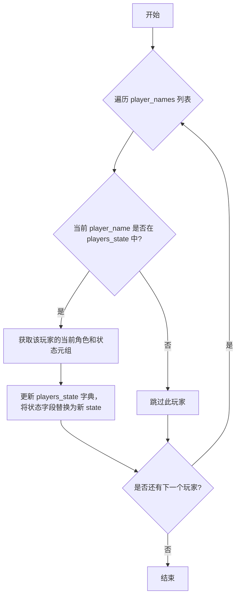

#### 带注释源码

```python
def _update_players_state(self, player_names: list[str], state: RoleState = RoleState.KILLED):
    # 遍历传入的玩家名称列表
    for player_name in player_names:
        # 检查玩家是否存在于游戏状态字典中
        if player_name in self.players_state:
            # 获取玩家当前的角色类型和状态元组
            roletype_state = self.players_state[player_name]
            # 更新玩家的状态为新状态，角色类型保持不变
            self.players_state[player_name] = (roletype_state[0], state)
```


### `WerewolfExtEnv._check_valid_role`

检查指定玩家是否拥有指定的角色类型。

参数：

- `player_name`：`str`，要检查的玩家名称。
- `role_type`：`str`，要检查的角色类型。

返回值：`bool`，如果玩家存在且其角色类型包含指定的 `role_type`，则返回 `True`；否则返回 `False`。

#### 流程图

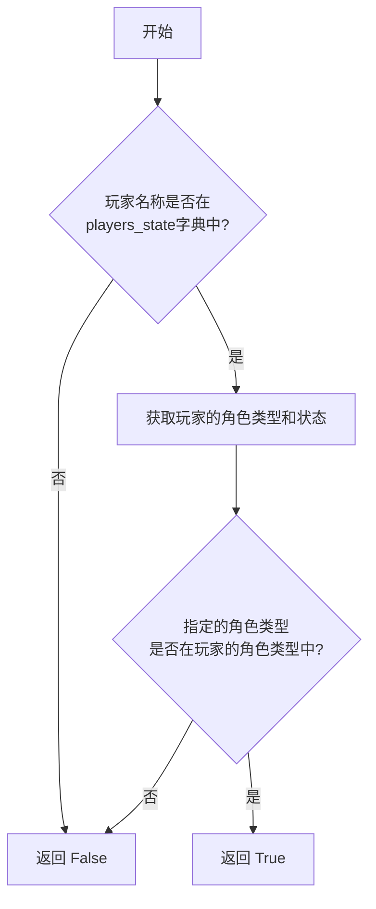

#### 带注释源码

```python
def _check_valid_role(self, player_name: str, role_type: str) -> bool:
    # 从 players_state 字典中获取指定玩家的角色类型和状态信息。
    # 如果玩家不存在，roletype_state 将为 None。
    roletype_state = self.players_state.get(player_name)
    # 如果玩家存在（roletype_state 不为 None）并且其角色类型字符串中包含指定的 role_type，
    # 则返回 True，否则返回 False。
    return True if roletype_state and role_type in roletype_state[0] else False
```


### `WerewolfExtEnv._check_player_continue`

该方法用于检查在游戏当前步骤下，是否可以对指定玩家执行操作。它验证玩家是否存活，并且（如果指定了特定步骤）当前步骤是否与特定步骤匹配。

参数：

- `player_name`：`str`，要检查的玩家名称。
- `particular_step`：`int`，可选参数，指定必须匹配的特定步骤编号。默认值为-1，表示不检查特定步骤。

返回值：`bool`，如果玩家可以继续（即存活且在正确的步骤），返回`True`；否则返回`False`。

#### 流程图

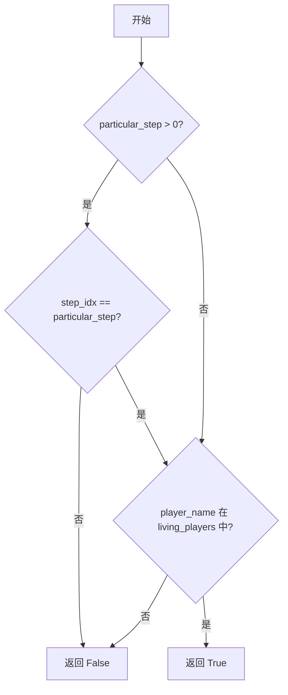

#### 带注释源码

```python
def _check_player_continue(self, player_name: str, particular_step: int = -1) -> bool:
    """to check if can do the operation to the player"""
    # 计算当前步骤在每轮步骤中的索引
    step_idx = self.step_idx % self.per_round_steps
    # 如果指定了特定步骤且当前步骤不匹配，则返回False
    if particular_step > 0 and step_idx != particular_step:  # step no
        # particular_step = 18, not daytime vote time, ignore
        # particular_step = 15, not nighttime hunt time, ignore
        return False
    # 如果玩家不在存活玩家列表中，返回False
    if player_name not in self.living_players:
        return False
    # 所有检查通过，返回True
    return True
```

### `WerewolfExtEnv.curr_step_instruction`

该方法用于获取当前游戏步骤的指令。它根据当前步骤索引从预定义的步骤指令列表中取出对应的指令，然后将步骤索引递增，以便下一次调用时获取下一个步骤的指令。

参数：无

返回值：`dict`，返回当前步骤的指令字典。

#### 流程图

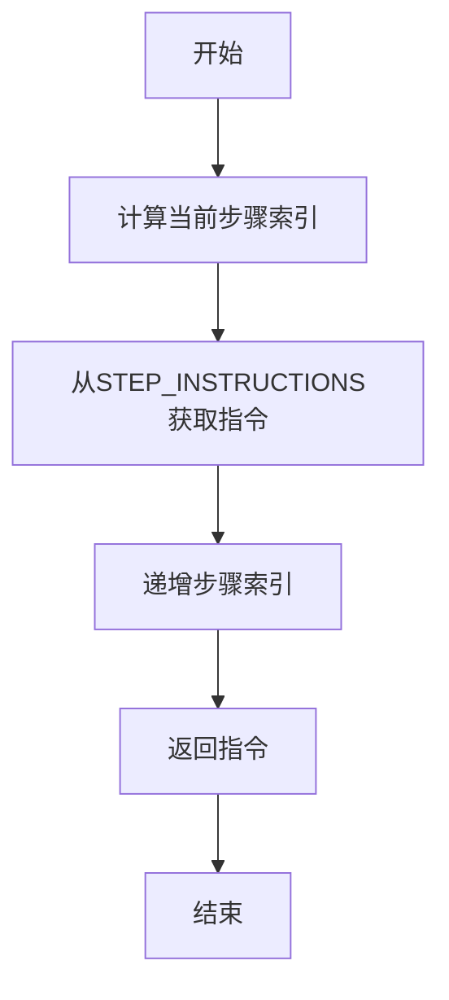

#### 带注释源码

```python
@mark_as_readable
def curr_step_instruction(self) -> dict:
    # 计算当前步骤索引，使用取模运算确保索引在有效范围内
    step_idx = self.step_idx % len(STEP_INSTRUCTIONS)
    # 从STEP_INSTRUCTIONS列表中获取当前步骤的指令
    instruction = STEP_INSTRUCTIONS[step_idx]
    # 递增步骤索引，为下一次调用做准备
    self.step_idx += 1
    # 返回当前步骤的指令
    return instruction
```

### `WerewolfExtEnv.progress_step`

该方法用于将游戏步骤索引（`step_idx`）向前推进一步，通常用于在游戏流程中手动触发进入下一个阶段或回合。

参数：
- 无

返回值：`None`，无返回值

#### 流程图

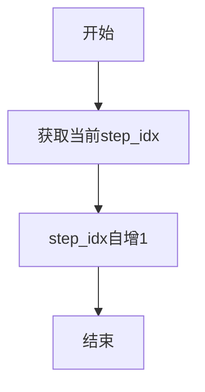

#### 带注释源码

```python
@mark_as_writeable  # 装饰器，标记该方法为可写入操作，可能用于环境状态同步或权限控制
def progress_step(self):
    # 将游戏步骤索引 step_idx 增加 1，以推进游戏到下一个步骤或阶段
    self.step_idx += 1
```

### `WerewolfExtEnv.get_players_state`

该方法用于查询指定玩家列表的当前游戏状态（角色状态），并返回一个字典，其中键为玩家名称，值为对应的`RoleState`枚举值。它仅返回玩家状态，不包含角色类型信息。

参数：

- `player_names`：`list[str]`，需要查询状态的玩家名称列表。

返回值：`dict[str, RoleState]`，一个字典，包含输入列表中存在的玩家及其对应的角色状态（`RoleState`）。如果某个玩家名称不存在于`players_state`中，则不会被包含在返回的字典里。

#### 流程图

```mermaid
flowchart TD
    A[开始: get_players_state(player_names)] --> B{遍历 player_names 列表};
    B --> C[取出一个 player_name];
    C --> D{检查 player_name 是否在<br>self.players_state 中?};
    D -- 是 --> E[从 self.players_state[player_name] 中<br>获取状态部分（索引1）];
    E --> F[将 player_name: state 加入结果字典];
    D -- 否 --> G[跳过此玩家];
    F --> H{是否还有下一个 player_name?};
    G --> H;
    H -- 是 --> C;
    H -- 否 --> I[返回结果字典];
    I --> J[结束];
```

#### 带注释源码

```python
@mark_as_readable  # 装饰器，标记此方法为“可读”操作，通常用于环境同步或权限控制
def get_players_state(self, player_names: list[str]) -> dict[str, RoleState]:
    """
    获取指定玩家列表的当前状态。

    参数:
        player_names (list[str]): 需要查询状态的玩家名称列表。

    返回:
        dict[str, RoleState]: 一个字典，键为玩家名称，值为该玩家的角色状态（RoleState）。
                              只包含存在于 `self.players_state` 中的玩家。
    """
    # 使用字典推导式构建结果
    players_state = {
        # 对于输入列表中的每个玩家名称
        player_name: self.players_state[player_name][1]  # 从 self.players_state 字典中获取该玩家的元组，并取第二个元素（索引1），即角色状态（RoleState）
        for player_name in player_names
        # 仅当玩家名称存在于 self.players_state 字典的键中时才进行处理
        if player_name in self.players_state
    }
    return players_state  # 返回构建好的状态字典
```


### `WerewolfExtEnv.vote_kill_someone`

该方法处理狼人杀游戏白天阶段的玩家投票行为。它记录指定投票者（`voter_name`）的投票目标（`player_name`），并在所有存活玩家完成投票后，统计票数并决定被处决的玩家。如果投票目标为 `None`，则视为该玩家弃权。该方法会更新游戏状态，将被票数最多的玩家标记为死亡。

参数：

-  `voter_name`：`str`，进行投票的玩家名称。
-  `player_name`：`str`，被投票的玩家名称。如果为 `None`，表示该投票者弃权。

返回值：`None`，此方法不返回任何值，其作用是通过修改类实例的内部状态来影响游戏进程。

#### 流程图

```mermaid
flowchart TD
    A[开始: vote_kill_someone] --> B{检查投票者状态<br>_check_player_continue}
    B -- 状态无效 --> C[结束]
    B -- 状态有效 --> D[记录投票<br>round_votes[voter_name] = player_name]
    D --> E{是否所有存活玩家<br>都已投票?}
    E -- 否 --> C
    E -- 是 --> F[统计所有有效投票<br>（过滤掉None）]
    F --> G[找出票数最多的玩家<br>作为被处决者]
    G --> H[更新玩家状态为死亡<br>_update_players_state]
    H --> I[结束]
```

#### 带注释源码

```python
@mark_as_writeable  # 装饰器，标记此方法为可写入环境状态的方法
def vote_kill_someone(self, voter_name: str, player_name: str = None):
    """player vote result at daytime
    player_name: if it's None, regard as abstaining from voting
    """
    # 1. 检查投票者当前是否可以进行投票操作（例如，是否存活且在正确的投票步骤）
    if not self._check_player_continue(voter_name, particular_step=18):  # 18=step no，对应白天投票的步骤编号
        return  # 如果条件不满足，直接返回，不执行后续操作

    # 2. 记录该投票者的投票结果。键为投票者，值为被投票者（可能为None表示弃权）
    self.round_votes[voter_name] = player_name

    # 3. 检查是否所有存活玩家都已经完成了投票
    if list(self.round_votes.keys()) == self.living_players:
        # 获取所有投票结果（一个列表，包含被投票者名称或None）
        voted_all = list(self.round_votes.values())
        # 过滤掉弃权票（即值为None的票）
        voted_all = [item for item in voted_all if item]
        # 4. 使用Counter统计票数，找出出现次数最多的元素（即被票数最多的玩家）
        #    .most_common()[0][0] 获取票数最多的那个玩家的名字
        # TODO: 当前实现存在平票时，选择第一个达到该票数的玩家。可能需要更复杂的平票处理逻辑。
        self.player_current_dead = [Counter(voted_all).most_common()[0][0]]
        # 5. 更新被处决玩家的状态为死亡（KILLED）
        self._update_players_state(self.player_current_dead)
```


### `WerewolfExtEnv.wolf_kill_someone`

该方法用于处理狼人在夜间猎杀玩家的动作。它首先验证执行动作的玩家是否为狼人且当前处于正确的游戏阶段（夜间猎杀阶段）。如果验证通过，则记录该狼人的猎杀目标。与投票不同，该方法不等待所有狼人完成选择，而是直接设置当前狼人的选择为猎杀目标。

参数：

- `wolf_name`：`str`，执行猎杀动作的狼人玩家名称。
- `player_name`：`str`，被狼人选择为猎杀目标的玩家名称。

返回值：`None`，该方法不返回任何值，其作用是通过修改实例状态来记录猎杀动作。

#### 流程图

```mermaid
flowchart TD
    A[开始: wolf_kill_someone] --> B{检查 wolf_name 是否为狼人?}
    B -- 否 --> C[结束: 直接返回]
    B -- 是 --> D{检查 wolf_name 是否存活<br>且处于正确阶段?}
    D -- 否 --> C
    D -- 是 --> E[记录猎杀目标<br>self.round_hunts[wolf_name] = player_name]
    E --> F[设置当前猎杀目标<br>self.player_hunted = player_name]
    F --> C
```

#### 带注释源码

```python
@mark_as_writeable  # 装饰器，标记该方法为可写入环境状态的方法
def wolf_kill_someone(self, wolf_name: str, player_name: str):
    # 1. 验证执行者是否为狼人角色
    if not self._check_valid_role(wolf_name, RoleType.WEREWOLF.value):
        return  # 如果不是狼人，直接返回，不执行任何操作

    # 2. 验证执行者是否存活且当前游戏步骤为夜间猎杀阶段（步骤索引6）
    if not self._check_player_continue(wolf_name, particular_step=6):  # 5=step no
        return  # 如果条件不满足，直接返回

    # 3. 记录该狼人的猎杀选择到本轮猎杀结果字典中
    self.round_hunts[wolf_name] = player_name

    # 4. 设置当前被猎杀的玩家为目标玩家
    # 注意：这里没有像投票那样等待所有狼人完成选择后再统计，而是直接设置。
    # 这意味着最后一个执行此方法的狼人的选择会覆盖之前的记录，成为最终猎杀目标。
    # 实际游戏逻辑中，可能需要所有狼人达成一致或进行统计，此处实现较为简化。
    self.player_hunted = player_name
```


### `WerewolfExtEnv._witch_poison_or_save_someone`

该方法处理女巫的毒药或解药操作。根据传入的状态参数，它会更新目标玩家的状态（中毒或被救），并相应地更新女巫剩余药剂的计数以及游戏的相关状态变量（如`player_poisoned`或`is_hunted_player_saved`）。这是一个内部方法，由`witch_poison_someone`和`witch_save_someone`两个公开方法调用。

参数：

-  `witch_name`：`str`，执行操作的女巫玩家名称。
-  `player_name`：`str`，目标玩家名称，即女巫要毒害或拯救的玩家。
-  `state`：`RoleState`，要设置的目标玩家状态，必须是`RoleState.POISONED`（中毒）或`RoleState.SAVED`（被救）。

返回值：`None`，此方法不返回任何值，其作用是通过副作用更新游戏状态。

#### 流程图

```mermaid
flowchart TD
    A[开始: _witch_poison_or_save_someone<br>witch_name, player_name, state] --> B{检查女巫身份有效性?}
    B -- 无效 --> Z[结束: 直接返回]
    B -- 有效 --> C{检查目标玩家状态?<br>（是否存活且在可操作阶段）}
    C -- 无效 --> Z
    C -- 有效 --> D{state 是 POISONED 还是 SAVED?}
    D -- POISONED --> E[更新玩家状态为 POISONED]
    E --> F[设置 player_poisoned = player_name]
    F --> G[女巫毒药计数 witch_poison_left -= 1]
    G --> Z
    D -- SAVED --> H[更新玩家状态为 SAVED]
    H --> I[设置 is_hunted_player_saved = True]
    I --> J[女巫解药计数 witch_antidote_left -= 1]
    J --> Z
```

#### 带注释源码

```python
def _witch_poison_or_save_someone(
    self, witch_name: str, player_name: str = None, state: RoleState = RoleState.POISONED
):
    # 1. 验证操作者是否为有效的女巫角色
    if not self._check_valid_role(witch_name, RoleType.WITCH.value):
        return
    # 2. 验证目标玩家是否处于可被操作的状态（存活且在正确的游戏阶段）
    if not self._check_player_continue(player_name):
        return

    # 3. 确保状态参数是合法的（只能是中毒或被救）
    assert state in [RoleState.POISONED, RoleState.SAVED]
    # 4. 根据状态更新目标玩家的游戏状态
    self._update_players_state([player_name], state)
    # 5. 根据是下毒还是救人，更新不同的游戏状态变量和药剂计数
    if state == RoleState.POISONED:
        # 下毒：记录被毒玩家，减少毒药数量
        self.player_poisoned = player_name
        self.witch_poison_left -= 1
    else:
        # 救人：标记被猎杀的玩家已被拯救，减少解药数量
        # self.player_protected = player_name # 原代码注释掉了这行，使用了 is_hunted_player_saved
        self.is_hunted_player_saved = True
        self.witch_antidote_left -= 1
```


### `WerewolfExtEnv.witch_poison_someone`

该方法用于女巫角色在狼人杀游戏中执行“毒药”操作，即指定一名玩家中毒。它会检查女巫身份的有效性、目标玩家的存活状态以及女巫是否还有毒药可用，然后更新游戏状态，标记目标玩家为中毒状态，并消耗一次毒药使用次数。

参数：

- `witch_name`：`str`，执行毒药操作的女巫玩家名称。
- `player_name`：`str`，可选参数，指定要中毒的目标玩家名称。如果为`None`，则视为不执行毒药操作。

返回值：`None`，该方法不返回任何值，仅更新游戏内部状态。

#### 流程图

```mermaid
flowchart TD
    A[开始: witch_poison_someone] --> B{女巫身份有效?}
    B -- 否 --> C[结束: 无操作]
    B -- 是 --> D{目标玩家存活?}
    D -- 否 --> C
    D -- 是 --> E{女巫有毒药剩余?}
    E -- 否 --> C
    E -- 是 --> F[调用内部方法<br>_witch_poison_or_save_someone]
    F --> G[更新玩家状态为中毒]
    G --> H[记录中毒玩家]
    H --> I[毒药次数减1]
    I --> J[结束]
```

#### 带注释源码

```python
@mark_as_writeable
def witch_poison_someone(self, witch_name: str, player_name: str = None):
    # 调用内部辅助方法，执行女巫的“毒药”操作。
    # 参数 `state` 被固定为 `RoleState.POISONED`，表示中毒状态。
    self._witch_poison_or_save_someone(witch_name, player_name, RoleState.POISONED)
```


### `WerewolfExtEnv.witch_save_someone`

该方法用于处理女巫在游戏中使用解药拯救一名玩家的行动。它通过调用内部辅助方法 `_witch_poison_or_save_someone` 来实现，将指定玩家的状态更新为 `RoleState.SAVED`，并相应地减少女巫的解药数量，同时标记被狼人猎杀的玩家已被拯救。

参数：

-  `witch_name`：`str`，执行拯救操作的女巫玩家的名称。
-  `player_name`：`str`，可选参数，指定要被拯救的玩家名称。如果为 `None`，则可能表示女巫选择不使用解药。

返回值：`None`，该方法不返回任何值，其作用是通过修改游戏状态来影响游戏进程。

#### 流程图

```mermaid
flowchart TD
    A[开始: witch_save_someone<br>传入 witch_name, player_name] --> B{调用内部方法<br>_witch_poison_or_save_someone}
    B --> C[参数: witch_name, player_name, RoleState.SAVED]
    C --> D[方法执行结束]
```

#### 带注释源码

```python
    @mark_as_writeable  # 装饰器，标记此方法为可写入操作，可能用于环境状态管理或权限控制。
    def witch_save_someone(self, witch_name: str, player_name: str = None):
        # 调用内部通用方法处理女巫的毒药或解药操作。
        # 传入参数：女巫名称(witch_name)，目标玩家名称(player_name)，以及操作状态(RoleState.SAVED 表示拯救)。
        self._witch_poison_or_save_someone(witch_name, player_name, RoleState.SAVED)
```


### `WerewolfExtEnv.guard_protect_someone`

该方法用于处理守卫（Guard）角色在游戏中的保护行动。当守卫选择保护一名玩家时，该方法会更新游戏状态，记录被保护的玩家。此操作是游戏夜间阶段的一部分，旨在防止被保护的玩家在当夜被狼人猎杀。

参数：

-  `guard_name`：`str`，执行保护行动的守卫玩家的名称。
-  `player_name`：`str`，可选参数，被守卫保护的玩家名称。如果为`None`，则视为守卫选择不保护任何人。

返回值：`None`，该方法不返回任何值，仅更新类内部状态。

#### 流程图

```mermaid
flowchart TD
    A[开始: guard_protect_someone] --> B{守卫身份有效?};
    B -- 否 --> C[结束: 直接返回];
    B -- 是 --> D{目标玩家可操作?<br>（存活且在正确阶段）};
    D -- 否 --> C;
    D -- 是 --> E[更新 `self.player_protected` 状态];
    E --> C;
```

#### 带注释源码

```python
    @mark_as_writeable  # 装饰器，标记此方法为可写入环境状态的方法
    def guard_protect_someone(self, guard_name: str, player_name: str = None):
        # 1. 验证执行者是否为有效的守卫角色
        if not self._check_valid_role(guard_name, RoleType.GUARD.value):
            return  # 如果不是守卫，直接返回，不执行任何操作

        # 2. 验证目标玩家在当前游戏状态下是否可以被操作（是否存活且在正确的游戏阶段）
        if not self._check_player_continue(player_name):
            return  # 如果目标玩家不符合条件，直接返回

        # 3. 更新游戏状态，记录本轮被守卫保护的玩家
        self.player_protected = player_name
```


### `WerewolfExtEnv.update_game_states`

该方法用于在狼人杀游戏环境中的特定步骤（夜晚结束和白天投票结束）评估并更新游戏状态。它根据当前步骤索引判断是否需要处理夜间行动结果（如狼人猎杀、女巫用药）或白天投票结果，并相应地更新玩家状态（如死亡）和重置相关临时变量。

参数：
-  `self`：`WerewolfExtEnv`，当前狼人杀外部环境实例。

返回值：`None`，无返回值。

#### 流程图

```mermaid
flowchart TD
    A[开始 update_game_states] --> B{计算当前步骤索引<br>step_idx % per_round_steps}
    B --> C{步骤索引是否为15或18<br>且当前全局步骤未被评估过?}
    C -- 否 --> Z[结束，直接返回]
    C -- 是 --> D[将当前全局步骤索引<br>self.step_idx 加入已评估列表]
    D --> E{步骤索引等于15?}
    E -- 是 --> F[处理夜晚结束逻辑]
    F --> F1[重置本轮死亡玩家列表]
    F1 --> F2{判断被猎杀玩家是否死亡<br>（未被守卫保护且未被女巫解救）?}
    F2 -- 是 --> F3[将被猎杀玩家加入死亡列表]
    F2 -- 否 --> F4
    F3 --> F4{判断是否有玩家被女巫毒杀?}
    F4 -- 是 --> F5[将被毒杀玩家加入死亡列表]
    F5 --> F6[更新死亡玩家的状态为KILLED]
    F6 --> F7[重置夜间临时状态变量<br>（猎杀目标、保护目标、<br>解救状态、毒杀目标）]
    F7 --> Z
    F4 -- 否 --> F6
    E -- 否 --> G[步骤索引等于18<br>处理白天投票结束逻辑]
    G --> G1[投票结果处理已在<br>vote_kill_someone方法中完成]
    G1 --> Z
```

#### 带注释源码

```python
    @mark_as_writeable  # 装饰器，标记该方法为可写入环境状态的方法
    def update_game_states(self):
        # 计算当前轮次内的步骤索引（0-based）
        step_idx = self.step_idx % self.per_round_steps
        # 仅在特定步骤（夜晚结束15，白天投票结束18）且该全局步骤尚未被评估时进行处理
        if step_idx not in [15, 18] or self.step_idx in self.eval_step_idx:
            return  # 不满足条件，直接返回，不执行后续状态更新
        else:
            # 记录当前全局步骤已被评估，防止在同一游戏步骤内重复评估
            self.eval_step_idx.append(self.step_idx)

        if step_idx == 15:  # 夜晚结束步骤
            # 重置当前轮次的死亡玩家列表，准备计算夜间死亡结果
            self.player_current_dead = []  # reset

            # 判断被狼人猎杀的玩家是否实际死亡：
            # 条件：猎杀目标 != 守卫保护目标 且 未被女巫使用解药解救
            if self.player_hunted != self.player_protected and not self.is_hunted_player_saved:
                self.player_current_dead.append(self.player_hunted)  # 加入死亡列表
            # 判断是否有玩家被女巫毒杀
            if self.player_poisoned:
                self.player_current_dead.append(self.player_poisoned)  # 加入死亡列表

            # 更新本轮死亡玩家的状态为 KILLED
            self._update_players_state(self.player_current_dead)
            # 重置所有与夜间行动相关的临时状态变量，为下一轮夜晚做准备
            self.player_hunted = None        # 清空狼人猎杀目标
            self.player_protected = None     # 清空守卫保护目标
            self.is_hunted_player_saved = False  # 重置女巫解救状态
            self.player_poisoned = None      # 清空女巫毒杀目标
        elif step_idx == 18:
            # 白天投票结束步骤：投票结果的处理和玩家状态的更新
            # 已经在 `vote_kill_someone` 方法中完成（通过 `_update_players_state`），
            # 因此这里无需额外操作，仅作为流程控制的一个分支。
            pass
```


## 关键组件


### 游戏状态管理

管理狼人杀游戏的核心状态，包括玩家角色与状态、回合与步骤索引、游戏全局状态（如获胜方、女巫药水数量）以及当前回合状态（如夜间狩猎结果、白天投票结果、当前死亡玩家等）。通过 `players_state` 字典和一系列字段维护游戏进程。

### 动作处理与游戏逻辑

定义了处理游戏内各种动作（如狼人杀人、投票、女巫用药、守卫保护）的方法。每个动作方法（如 `wolf_kill_someone`, `vote_kill_someone`）都包含角色验证和步骤验证，确保动作在正确的游戏阶段由正确的角色执行，并更新相应的游戏状态。

### 游戏流程控制

通过 `step_idx` 和 `per_round_steps` 控制游戏步骤的推进。`progress_step` 方法用于手动推进步骤，而 `curr_step_instruction` 方法根据当前步骤索引返回对应的游戏指令。`update_game_states` 方法在特定步骤（如夜晚结束、白天投票结束）评估并结算游戏状态（如计算死亡玩家）。

### 游戏初始化与设置

`init_game_setup` 方法负责根据配置（村民、狼人数量等）初始化游戏，创建玩家实例，分配角色，并设置初始游戏状态。它支持角色洗牌和添加人类玩家。

### 游戏终止条件检查

`_check_game_finish` 方法检查游戏是否满足终止条件（如所有狼人死亡或所有村民/特殊角色死亡），并据此设置获胜方和获胜原因，从而决定游戏是否结束。

### 角色与玩家状态查询

提供了一系列属性（如 `living_players`, `werewolf_players`, `villager_players`）和方法（如 `get_players_state`）来查询当前存活玩家、特定角色玩家以及玩家的具体状态，支持游戏内的决策逻辑。

### 步骤与操作验证

`_check_player_continue` 和 `_check_valid_role` 方法用于验证玩家是否存活、当前游戏步骤是否允许执行特定操作，以及执行操作的玩家是否具有正确的角色身份，确保游戏规则的执行。

### 外部环境接口集成

作为 `ExtEnv` 的子类，提供了 `step` 和 `reset` 等标准环境接口，用于与外部框架（如强化学习环境）集成。`step` 方法接收 `EnvAction` 动作，调用相应的内部处理方法，并返回新的观察、奖励和终止标志。


## 问题及建议


### 已知问题

-   **`reset` 和 `observe` 方法未实现**：作为继承自 `ExtEnv` 的环境类，`reset` 和 `observe` 是核心接口方法，但当前代码中仅为空实现 (`pass`)。这违反了接口契约，可能导致上层调用时出现错误或功能缺失。
-   **观察信息缺乏隔离**：在 `_get_obs` 方法返回的观察信息中，包含了 `werewolf_players`（狼人玩家列表）。在标准的狼人杀游戏中，每位玩家（尤其是非狼人角色）不应知晓其他玩家的具体身份。当前实现将所有信息暴露给所有“观察者”，破坏了游戏的信息不对称性和公平性。
-   **投票平局处理逻辑不完善**：在 `vote_kill_someone` 方法中，当所有存活玩家完成投票后，通过 `Counter(voted_all).most_common()[0][0]` 决定被处决的玩家。此方法在出现平票（即两个或更多玩家获得相同最高票数）时，只是简单地返回第一个达到该票数的玩家，处理方式过于随意，不符合多数狼人杀规则（如平票无人出局或进行第二轮辩论投票）。
-   **狼人猎杀目标确定逻辑不一致**：`wolf_kill_someone` 方法中，注释掉的代码逻辑是等待所有存活狼人完成猎杀选择后，通过统计决定最终目标。但当前启用的逻辑是直接将单个狼人提交的 `player_name` 赋值给 `self.player_hunted`，这可能导致：（1）如果多个狼人提交不同目标，后提交的会覆盖前者，结果不确定；（2）如果只有部分狼人提交，结果可能不代表狼人阵营的集体决定。
-   **`_check_player_continue` 方法中的 `particular_step` 参数逻辑可能错误**：该方法中判断 `if particular_step > 0 and step_idx != particular_step:`，意图是检查是否在特定的游戏步骤。但 `STEP_INSTRUCTIONS` 的长度 (`per_round_steps`) 可能大于 `particular_step` 的值（例如18）。当 `step_idx` 通过取模计算后，可能与 `particular_step` 直接比较不匹配，导致条件判断失效。例如，`particular_step=18` 可能永远无法与取模后的 `step_idx` 相等。
-   **`init_game_setup` 方法参数 `prepare_human_player` 类型标注与实际使用不符**：参数类型标注为 `Callable`，但方法内部调用时将其视为一个接受 `assigned_role` 参数并返回替换角色的函数。更准确的类型标注应为 `Callable[[object], object]` 或更具体的类型。
-   **`_witch_poison_or_save_someone` 方法中 `player_name` 参数可为 `None`，但后续逻辑未充分考虑**：当 `player_name` 为 `None` 时（例如女巫选择不使用解药），`self._update_players_state([player_name], state)` 会将 `None` 加入列表，可能导致错误或非预期行为。
-   **`update_game_states` 方法中夜晚结算逻辑可能不完整**：在夜晚结算（`step_idx == 15`）时，仅处理了 `player_hunted`（狼人猎杀）和 `player_poisoned`（女巫毒药）导致的死亡，未考虑 `player_protected`（守卫保护）与 `player_hunted` 为同一人时应避免死亡的情况。虽然当前有 `self.player_hunted != self.player_protected` 的判断，但守卫保护的目标 (`player_protected`) 在逻辑上应能抵御狼人猎杀。

### 优化建议

-   **实现 `reset` 和 `observe` 方法**：根据环境基类的约定，完整实现 `reset` 方法以初始化环境状态，并实现 `observe` 方法以根据传入的 `obs_params`（可包含玩家身份）返回该玩家视角下的局部观察信息，例如对非狼人玩家隐藏 `werewolf_players` 信息。
-   **重构观察系统，实现信息隔离**：为 `_get_obs` 方法增加参数（如 `player_name`），根据请求观察的玩家身份，过滤并返回其可见的游戏状态。可以设计一个 `get_observation_for(player_name)` 方法。
-   **完善投票平局处理机制**：修改 `vote_kill_someone` 中的计票逻辑。检测平票情况，并定义明确的处理规则，例如：平票则无人出局，并记录状态供后续步骤（如额外辩论轮次）使用；或者引入随机选择（但需明确规则）。
-   **统一并明确狼人猎杀决策逻辑**：重新设计 `wolf_kill_someone` 方法。要么恢复注释掉的集体决策逻辑（等待所有存活狼人提交后统计），并明确平票处理方式；要么明确当前逻辑为“首个提交的狼人决定目标”或“最后提交的狼人覆盖决定”，并在文档中说明。建议采用集体决策以更符合游戏设定。
-   **修正步骤检查逻辑**：审查 `_check_player_continue` 中 `particular_step` 的比较逻辑。确保 `particular_step` 与 `STEP_INSTRUCTIONS` 中的索引定义一致。考虑将步骤检查的常量（如 6, 15, 18）提取为枚举或类变量，提高可读性和可维护性。
-   **修正类型标注和参数验证**：将 `init_game_setup` 中的 `prepare_human_player` 参数类型标注修正为 `Callable[[object], object]`。在 `_witch_poison_or_save_someone` 中，对 `player_name` 参数进行有效性检查，如果为 `None` 且是“拯救”操作，应视为不使用解药，并跳过 `_update_players_state` 调用。
-   **补全夜晚结算规则**：重新审视 `update_game_states` 中夜晚结算的逻辑。确保守卫保护能正确抵消狼人猎杀。考虑更复杂的交互，例如：女巫解药优先于守卫保护，或者守卫不能连续两晚保护同一人等规则（如果实现）。明确并注释这些规则。
-   **引入更细粒度的状态管理和历史记录**：当前许多状态（如 `round_hunts`, `round_votes`）在每轮结束后被重置或覆盖。考虑引入历史记录，保存每一轮的关键行动和状态，便于复盘、调试或实现更复杂的AI策略。可以添加 `history` 字段。
-   **提高代码可测试性**：将游戏规则逻辑（如胜负判定、夜晚结算）抽取到独立的方法或类中，减少 `WerewolfExtEnv` 类的内部状态依赖，使其更容易进行单元测试。
-   **添加更丰富的文档和注释**：在关键方法（如 `update_game_states`, `_check_game_finish`）和复杂逻辑处添加详细注释，解释游戏规则对应的代码实现。特别是对于魔改规则或简化假设，需要明确说明。


## 其它


### 设计目标与约束

该环境的设计目标是提供一个可扩展、可观察、可交互的狼人杀游戏模拟环境，用于集成到智能体（Agent）系统中。核心约束包括：1) 遵循标准狼人杀游戏规则（如夜晚行动顺序、胜利条件）；2) 提供清晰的游戏状态接口供外部智能体感知；3) 通过标记为可读（`@mark_as_readable`）和可写（`@mark_as_writeable`）的方法，明确区分环境状态的查询与修改操作，以支持多智能体环境下的并发控制；4) 保持环境状态的内部一致性，确保游戏逻辑的正确执行。

### 错误处理与异常设计

代码中的错误处理主要采用防御性编程和条件检查。例如，在`_check_player_continue`和`_check_valid_role`方法中，通过检查玩家状态、角色类型和当前步骤来验证操作的有效性，无效操作会直接返回而不执行。在`step`方法中，对于不支持的`action_type`会抛出`ValueError`异常。然而，整体错误处理较为基础，缺乏统一的异常类型定义和更细致的错误信息反馈机制。例如，无效操作仅被静默忽略，不利于调试和智能体学习。

### 数据流与状态机

环境的核心数据流围绕`step`方法展开，它接收一个`EnvAction`对象，根据其`action_type`分发到具体的行动处理方法（如`wolf_kill_someone`）。每次`step`调用后，会调用`update_game_states`来根据当前步骤索引（`step_idx`）更新游戏状态（如处理夜晚结算、重置临时状态）。游戏状态本身是一个复杂的状态机，由`round_idx`、`step_idx`、`players_state`以及多个回合临时状态字段（如`round_hunts`）共同定义。`STEP_INSTRUCTIONS`定义了步骤指令的序列，驱动着游戏阶段的流转（如“狼人请睁眼”、“女巫请行动”）。

### 外部依赖与接口契约

1.  **父类与框架依赖**：继承自`ExtEnv`和`BaseEnvObsParams`，依赖于`metagpt.environment.base_env`和`metagpt.base.base_env_space`模块，需遵循其定义的接口（如`reset`、`observe`、`step`的签名），尽管部分方法当前未实现。
2.  **数据类型依赖**：重度依赖`metagpt.environment.werewolf.const`模块中定义的枚举（`RoleType`， `RoleState`）和常量（`STEP_INSTRUCTIONS`），以及`metagpt.environment.werewolf.env_space`中定义的`EnvAction`和`EnvActionType`。这些构成了环境的核心数据模型和动作空间。
3.  **工具依赖**：使用`pydantic`的`Field`进行数据验证和序列化，使用`collections.Counter`进行票数统计。
4.  **接口契约**：
    *   **对智能体的观察接口**：`_get_obs`方法返回一个字典，定义了环境向智能体公开的状态视图。
    *   **智能体的动作接口**：智能体必须构造符合`EnvAction`格式的动作对象，其`action_type`必须是`EnvActionType`中定义的枚举值。
    *   **可读/可写方法契约**：以`@mark_as_readable`或`@mark_as_writeable`装饰的方法，暗示了在多智能体环境下的访问控制策略（尽管当前代码未展示具体的并发控制逻辑）。

### 并发与同步考虑

代码通过`@mark_as_readable`和`@mark_as_writeable`装饰器暗示了对并发访问的关注，这通常是多智能体环境中管理状态读写冲突的设计模式。然而，当前实现中并未展示任何具体的锁机制或原子操作。例如，在`vote_kill_someone`中，检查`round_votes.keys()`是否等于`self.living_players`以判断投票结束，这在并发投票场景下可能存在竞态条件。环境假设在一个`step`调用中只处理一个智能体的动作，由外部调度器来确保顺序执行，从而避免了内部的显式同步。

### 配置与初始化

游戏的初始配置通过`init_game_setup`方法完成。该方法接受角色对象列表、各种角色数量参数以及控制游戏特性的标志（如`shuffle`， `add_human`， `use_reflection`等）。它负责创建玩家实例、分配角色、初始化`players_state`并生成`game_setup`描述字符串。这种设计允许灵活地设置不同规模和配置的游戏对局。

### 测试与验证策略

代码中未包含测试相关代码。潜在的验证点包括：1) 游戏规则逻辑的正确性，如夜晚死亡结算（`update_game_states`中`step_idx == 15`的逻辑）；2) 胜利条件判断（`_check_game_finish`）；3) 角色特定行动的有效性检查（如女巫不能重复使用药剂）；4) 状态转换的一致性（如玩家死亡后状态应变为`KILLED`）。建议通过单元测试覆盖这些核心逻辑，并可能使用属性测试（Property-based Testing）来验证游戏状态机在各种操作序列下的不变性。

    