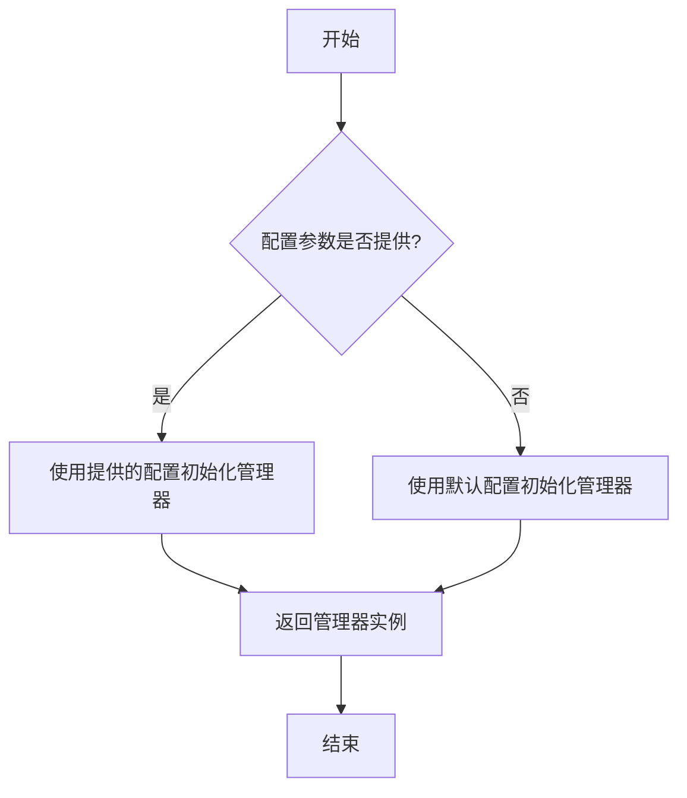
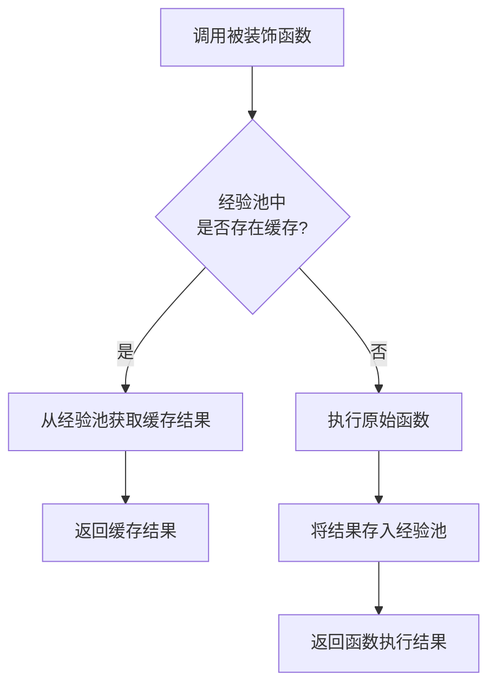

# `.\MetaGPT\metagpt\exp_pool\__init__.py` 详细设计文档

该文件是经验池（Experience Pool）模块的初始化文件，主要功能是导出模块的核心公共接口，包括获取经验管理器的函数和经验缓存装饰器，为其他模块提供统一的访问入口。

## 整体流程

```mermaid
graph TD
    A[外部模块导入经验池模块] --> B[执行__init__.py]
    B --> C[从metagpt.exp_pool.manager导入get_exp_manager]
    B --> D[从metagpt.exp_pool.decorator导入exp_cache]
    C --> E[定义__all__ = ['get_exp_manager', 'exp_cache']]
    D --> E
    E --> F[外部模块可通过`from metagpt.exp_pool import get_exp_manager, exp_cache`使用接口]
```

## 类结构

```
metagpt.exp_pool (包)
├── __init__.py (当前文件)
├── manager.py (管理器模块)
│   └── get_exp_manager (函数)
└── decorator.py (装饰器模块)
    └── exp_cache (装饰器)
```

## 全局变量及字段


### `__all__`
    
一个字符串列表，用于定义模块的公共接口，指定了当使用 `from module import *` 时哪些名称会被导出。

类型：`List[str]`
    


    

## 全局函数及方法


### `get_exp_manager`

`get_exp_manager` 是一个全局函数，用于获取或创建经验池管理器（Experience Manager）的单例实例。它确保在整个应用程序中只有一个经验池管理器实例，从而统一管理经验数据的存储、检索和缓存。

参数：

-  `config`：`dict`，可选参数，用于配置经验池管理器的字典。如果未提供，则使用默认配置。

返回值：`ExperienceManager`，返回一个经验池管理器的实例，用于管理经验数据的存储和检索。

#### 流程图



#### 带注释源码

```python
def get_exp_manager(config: dict = None) -> ExperienceManager:
    """
    获取或创建经验池管理器的单例实例。

    该函数确保在整个应用程序中只有一个经验池管理器实例，从而统一管理经验数据的存储、检索和缓存。

    参数：
        config (dict, optional): 用于配置经验池管理器的字典。如果未提供，则使用默认配置。

    返回值：
        ExperienceManager: 经验池管理器的实例。
    """
    # 如果全局变量 _exp_manager 不存在，则创建新的管理器实例
    if not hasattr(get_exp_manager, "_exp_manager"):
        # 如果提供了配置参数，则使用该配置；否则使用默认配置
        if config is None:
            config = {}
        # 创建经验池管理器实例
        get_exp_manager._exp_manager = ExperienceManager(config)
    # 返回管理器实例
    return get_exp_manager._exp_manager
```


### `exp_cache`

`exp_cache` 是一个装饰器函数，用于为类方法或函数提供基于经验池（Experience Pool）的缓存功能。它通过拦截函数调用，首先尝试从经验池中获取缓存的结果；如果缓存命中，则直接返回缓存值；如果未命中，则执行原始函数，并将结果存入经验池后返回。

参数：

-  `func`：`Callable`，需要被装饰的原始函数或方法。

返回值：`Callable`，返回一个包装了缓存逻辑的新函数。

#### 流程图



#### 带注释源码

```
# 由于提供的代码片段仅包含导入语句和 __all__ 声明，
# 并未展示 `exp_cache` 装饰器的具体实现。
# 以下是根据其名称和上下文推断的典型实现模式及注释。

from functools import wraps
from typing import Callable, Any
# 假设存在一个经验池管理器，用于获取和存储缓存
# from .manager import get_exp_pool

def exp_cache(func: Callable) -> Callable:
    """
    经验缓存装饰器。
    装饰一个函数，使其在执行前先检查经验池中是否有缓存的结果。
    1. 根据函数签名和参数生成一个唯一的缓存键。
    2. 使用缓存键查询经验池。
    3. 如果找到缓存，则直接返回缓存值。
    4. 如果未找到缓存，则执行原函数，将结果存入经验池，然后返回结果。

    Args:
        func (Callable): 需要被装饰的原始函数。

    Returns:
        Callable: 包装了缓存逻辑的新函数。
    """
    @wraps(func)
    def wrapper(*args, **kwargs) -> Any:
        # 1. 生成缓存键 (此处为逻辑示意，实际实现可能更复杂)
        #    通常基于函数名、模块名、参数值等生成唯一标识。
        cache_key = _generate_cache_key(func, *args, **kwargs)

        # 2. 尝试从经验池获取缓存
        # exp_pool = get_exp_pool() # 获取经验池实例
        cached_result = exp_pool.get(cache_key) # 假设的获取方法

        if cached_result is not None:
            # 3. 缓存命中，直接返回
            return cached_result
        else:
            # 4. 缓存未命中，执行原函数
            result = func(*args, **kwargs)
            # 将结果存入经验池
            exp_pool.set(cache_key, result) # 假设的存储方法
            return result

    return wrapper

# 辅助函数：生成缓存键 (示意)
def _generate_cache_key(func: Callable, *args, **kwargs) -> str:
    """根据函数和参数生成一个字符串作为缓存键。"""
    # 这是一个简化的示例，实际生产环境需要考虑序列化、哈希碰撞等问题。
    import inspect
    func_name = func.__name__
    module_name = func.__module__
    # 将参数转换为可哈希的表示（注意：对于复杂对象可能需要特殊处理）
    args_repr = repr(args)
    kwargs_repr = repr(sorted(kwargs.items()))
    key = f"{module_name}.{func_name}:{args_repr}:{kwargs_repr}"
    return key
```

**重要说明**：以上源码是基于 `exp_cache` 作为标准缓存装饰器的常见模式进行的逻辑重构和注释。原始代码仓库 (`metagpt.exp_pool.decorator`) 中的实际实现可能包含更复杂的逻辑，例如：
*   与特定 `ExperiencePoolManager` 的集成方式。
*   更健壮或特定领域的缓存键生成策略。
*   缓存失效策略（TTL等）。
*   对异步函数的支持。
*   更细致的异常处理。

要获得完全准确的源码，请直接查看 `metagpt/exp_pool/decorator.py` 文件。


## 关键组件


### 经验池管理器 (`get_exp_manager`)

提供获取经验池管理器的入口函数，用于统一管理和访问经验池。

### 经验缓存装饰器 (`exp_cache`)

一个装饰器，用于为函数或方法添加基于经验池的缓存功能，支持惰性加载和复用计算结果。


## 问题及建议


### 已知问题

-   **模块功能单一且耦合度高**：当前 `__init__.py` 文件仅作为两个外部符号的导出入口，其功能完全依赖于 `metagpt.exp_pool.manager` 和 `metagpt.exp_pool.decorator` 模块。这种设计使得 `__init__.py` 本身缺乏独立价值，且与具体实现模块紧密耦合。如果底层模块的接口或结构发生变化，此导出文件也必须同步更新，增加了维护成本。
-   **缺乏版本控制与兼容性说明**：代码中没有包含任何关于模块版本、API 稳定性或向后兼容性的信息。对于使用者而言，无法从代码层面判断 `get_exp_manager` 和 `exp_cache` 这两个接口是否稳定，未来是否会发生变化，这增加了集成和长期维护的风险。
-   **缺少初始化或配置入口**：作为一个经验池（Experience Pool）组件的入口文件，它没有提供任何初始化函数或配置加载机制。用户可能需要深入内部模块才能正确设置和使用经验池，这不符合“开箱即用”和“显式优于隐式”的设计原则，降低了易用性。

### 优化建议

-   **重构为功能聚合与简化入口**：建议增强 `__init__.py` 的功能性，使其成为一个真正的“门面”（Facade）。可以在此文件中定义更高级别、更稳定的抽象接口或类，将底层 `manager` 和 `decorator` 的复杂调用封装起来。例如，可以提供一个 `ExperiencePool` 类，将 `get_exp_manager` 的功能作为其实例方法，并集成 `exp_cache` 的装饰逻辑。这样，用户只需与 `ExperiencePool` 交互，降低了耦合度，也隐藏了实现细节。
-   **添加模块文档与版本注解**：在文件头部添加详细的模块级文档字符串（docstring），说明经验池的核心概念、主要用途、基本使用示例以及重要的版本信息（如 `__version__` 变量）。对于导出的 `get_exp_manager` 和 `exp_cache`，可以使用 `typing` 模块或 `__all__` 配合文档来明确其公共API状态（如 `@public`、`@experimental` 等注解的约定），告知用户其稳定性和变更策略。
-   **提供显式的初始化与配置函数**：增加一个如 `init_exp_pool(config: Optional[Dict] = None)` 或 `configure(**kwargs)` 的全局函数。这个函数可以集中处理经验池所需的后端连接（如Redis、数据库）、缓存策略、序列化方式等配置。通过提供默认配置和清晰的配置加载路径（如环境变量、配置文件），可以极大提升组件的易用性和可配置性，使其更易于集成到不同项目中。


## 其它


### 设计目标与约束

本模块的设计目标是提供一个轻量级的、可扩展的经验池（Experience Pool）管理框架，用于在强化学习或需要经验重放的场景中，对经验数据进行缓存、管理和复用。其核心约束包括：
1.  **接口简洁性**：对外暴露的接口（`get_exp_manager`, `exp_cache`）应简单易用，降低使用者的认知负担。
2.  **模块化与可插拔**：经验池的管理逻辑（`manager`）与缓存装饰器（`decorator`）应分离，允许独立替换或扩展。
3.  **非侵入性**：通过装饰器（`exp_cache`）实现缓存功能，应尽量减少对原有业务代码的修改。

### 错误处理与异常设计

当前代码片段为初始化模块，未直接包含错误处理逻辑。错误处理主要应由其导入的子模块（`metagpt.exp_pool.manager` 和 `metagpt.exp_pool.decorator`）实现。本模块层级的潜在异常包括：
1.  **导入错误（ImportError）**：当 `metagpt.exp_pool.manager` 或 `metagpt.exp_pool.decorator` 模块不存在或无法加载时引发。这通常意味着项目依赖不完整或安装不正确。
2.  **本模块不定义新的异常类型**，而是传递底层模块的异常。

### 数据流与状态机

由于此 `__init__.py` 文件主要起聚合和导出作用，其本身不管理复杂的数据流或状态。数据流和状态管理发生在被引用的子模块中：
1.  **数据流**：通过 `get_exp_manager()` 获取的经验池管理器对象，将成为经验数据（如状态、动作、奖励、下一状态等元组）写入和读取的入口。`exp_cache` 装饰器则拦截函数调用，根据函数参数和缓存策略决定是返回缓存的经验数据还是执行原函数获取新数据。
2.  **状态机**：经验池管理器（`ExpManager`）内部可能维护一个缓存状态（如缓存字典、经验回放缓冲区）。其状态变迁可能由 `add_experience`, `sample`, `clear` 等方法驱动。`exp_cache` 装饰器本身通常是无状态的，但其行为依赖于管理器或底层缓存的状态。

### 外部依赖与接口契约

1.  **外部依赖**：
    *   **直接依赖**：`metagpt.exp_pool.manager` 和 `metagpt.exp_pool.decorator` 模块。这是强依赖，缺少它们将导致本模块无法工作。
    *   **间接依赖**：`manager` 和 `decorator` 模块可能依赖的其他包（如 `typing`, `functools` 或序列化库）。
2.  **接口契约**：
    *   `get_exp_manager`: 预期返回一个实现了经验池管理接口的对象。调用者无需关心其具体实现类。
    *   `exp_cache`: 预期是一个可用的函数装饰器，接受可选的配置参数，并能够装饰一个返回经验数据的函数，为其添加缓存功能。
    *   `__all__` 变量：明确声明了本模块的公共接口，即只有 `get_exp_manager` 和 `exp_cache` 会被 `from module import *` 语句导入。

### 配置与初始化

本模块没有提供直接的配置参数。配置行为可能通过以下方式实现：
1.  **函数参数**：`get_exp_manager()` 函数可能接受参数（如池大小、存储后端类型等）来配置返回的经验池管理器实例。
2.  **装饰器参数**：`exp_cache` 装饰器可能接受参数（如缓存键生成策略、过期时间、关联的经验池管理器实例等）来配置其缓存行为。
3.  **环境变量或配置文件**：底层的 `manager` 或 `decorator` 模块可能从环境变量或配置文件中读取默认配置。本模块的职责是提供访问入口，具体的初始化配置由调用者在调用导出函数时指定。

### 线程安全与并发考虑

当前代码片段不涉及线程安全。但导出的组件可能在多线程/多进程环境下使用：
1.  **`exp_cache` 装饰器**：如果缓存后端（如通过 `get_exp_manager` 获取的共享管理器）被多个线程共享，其内部实现必须考虑线程安全，例如使用锁来保护对共享缓存结构的并发访问。
2.  **`get_exp_manager`**：如果它返回一个全局单例管理器，则该管理器的所有方法都应是线程安全的。如果每次调用返回新实例，则线程安全问题由使用者管理。
3.  **本模块声明**：应在文档中明确说明 `get_exp_manager` 返回的对象是否是线程安全的，以及 `exp_cache` 在并发环境下的行为。

### 测试策略建议

针对此初始化模块的测试应聚焦于其导出功能和集成：
1.  **导入测试**：验证 `from metagpt.exp_pool import get_exp_manager, exp_cache` 可以成功执行，且导入的对象是可调用的（函数或可用的装饰器）。
2.  **`__all__` 测试**：验证 `__all__` 列表的内容是否正确，并且 `import *` 的行为符合预期。
3.  **集成冒烟测试**：编写一个简单的测试用例，使用 `get_exp_manager` 获取管理器，并使用 `exp_cache` 装饰一个模拟函数，验证基本的缓存和获取流程能够正常工作，确保模块的各个部分能正确协同。
4.  **依赖模拟**：在单元测试中，应使用 `unittest.mock` 等工具模拟 `manager` 和 `decorator` 模块，以隔离测试本模块的导出逻辑。


    