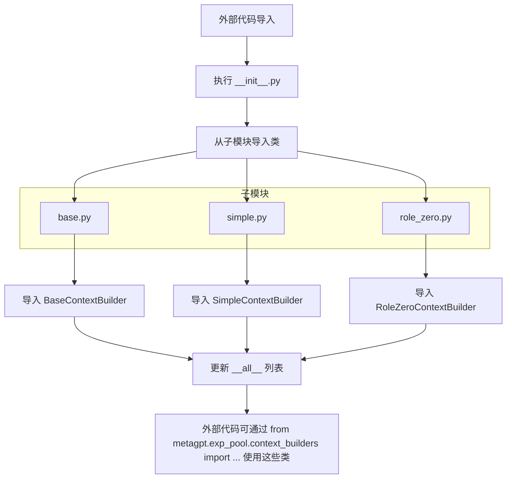

# `.\MetaGPT\metagpt\exp_pool\context_builders\__init__.py` 详细设计文档

该文件是一个Python包的初始化文件，用于导出`metagpt.exp_pool.context_builders`模块下的三个上下文构建器类，为外部代码提供统一的导入接口。

## 整体流程



## 类结构

```
metagpt.exp_pool.context_builders (Python包)
├── __init__.py (当前文件)
├── base.py
│   └── BaseContextBuilder (抽象基类)
├── simple.py
│   └── SimpleContextBuilder (具体实现类)
└── role_zero.py
    └── RoleZeroContextBuilder (具体实现类)
```

## 全局变量及字段


### `__all__`
    
一个字符串列表，用于定义本模块（__init__.py）的公共接口，指定了哪些名称（类名）应该在使用 `from module import *` 语法时被导出。

类型：`List[str]`
    


    

## 全局函数及方法


## 关键组件


### BaseContextBuilder

提供上下文构建器的基类，定义了构建上下文的基本接口和通用行为。

### SimpleContextBuilder

实现简单的上下文构建逻辑，可能用于基础或默认的上下文构建场景。

### RoleZeroContextBuilder

实现角色零（Role Zero）特定的上下文构建逻辑，可能用于处理初始或核心角色的上下文信息。


## 问题及建议


### 已知问题

-   当前 `__init__.py` 文件仅作为模块导出文件，没有包含任何初始化逻辑或配置。如果未来需要在该包级别添加共享的初始化代码、常量或配置，需要修改此文件，这可能影响现有的导入语句。
-   模块的导出列表 `__all__` 是硬编码的，如果新增了 `context_builders` 子模块中的类，需要手动更新此列表，否则新类可能无法通过 `from metagpt.exp_pool.context_builders import *` 的方式被导入，容易导致遗漏和错误。

### 优化建议

-   考虑在 `__init__.py` 中实现动态导出。例如，可以扫描 `context_builders` 目录下所有非私有（不以`_`开头）的 `.py` 文件，并自动发现其中继承自 `BaseContextBuilder` 的类，然后将这些类名动态添加到 `__all__` 列表中。这样可以确保新添加的 `ContextBuilder` 子类能够自动被导出，减少维护成本。
-   如果包在未来需要初始化步骤（如注册到某个中央工厂、加载默认配置等），可以在此 `__init__.py` 文件中添加相应的初始化函数或代码块，并确保其幂等性（多次导入不会重复初始化）。
-   为了保持代码清晰和可维护性，即使当前逻辑简单，也建议在文件头部添加简要的模块文档字符串，说明此包的主要职责和包含的核心组件。


## 其它


### 设计目标与约束

本模块的设计目标是提供一个可扩展的上下文构建器（Context Builder）框架，用于在经验池（Exp Pool）中为不同的学习或推理场景生成和管理上下文信息。其核心约束包括：
1.  **接口一致性**：所有具体的上下文构建器必须继承自一个统一的抽象基类（`BaseContextBuilder`），并实现其定义的接口方法，以确保它们可以被框架以统一的方式调用和替换。
2.  **模块化与可插拔**：通过 `__init__.py` 文件集中导出关键类，实现模块的清晰接口定义，便于其他模块（如经验池管理器）导入和使用，同时支持未来新增其他类型的上下文构建器而无需修改调用方代码。
3.  **职责分离**：`BaseContextBuilder` 定义通用接口和可能的基础逻辑，`SimpleContextBuilder` 和 `RoleZeroContextBuilder` 等具体实现则专注于各自特定的上下文构建策略，遵循单一职责原则。

### 错误处理与异常设计

当前模块作为初始化文件，主要职责是导出类，本身不包含业务逻辑，因此没有显式的错误处理。错误处理的责任下放给了各个具体的上下文构建器类（`BaseContextBuilder`, `SimpleContextBuilder`, `RoleZeroContextBuilder`）。这些类在其方法实现中应负责：
1.  **参数验证**：对输入参数进行有效性检查，例如检查是否为 `None`、类型是否正确、值是否在允许范围内等。
2.  **异常抛出**：当预置条件不满足或构建过程失败时，应抛出明确的、自描述的异常（如 `ValueError`, `TypeError` 或自定义的 `ContextBuildError`），以便调用者能够清晰地识别问题来源。
3.  **资源清理**：如果在上下文构建过程中申请了临时资源（如文件句柄、网络连接），应确保在发生异常时能正确释放这些资源，通常使用 `try...finally` 块或上下文管理器（`with` 语句）来实现。

### 数据流与状态机

本模块定义的是组件的静态结构，不直接定义数据流或状态机。数据流和状态由使用这些上下文构建器的上游模块（如经验池）控制。典型的数据流可能如下：
1.  **触发**：上游模块（如某个学习代理）需要获取特定场景的上下文。
2.  **选择与调用**：根据场景类型，上游模块从本模块导出的类中选择合适的上下文构建器实例（例如 `SimpleContextBuilder` 或 `RoleZeroContextBuilder`），并调用其 `build` 或类似的方法。
3.  **输入**：将必要的参数（如当前状态、历史经验、目标描述等）传递给该构建器方法。
4.  **处理与输出**：构建器内部根据其逻辑处理输入数据，生成结构化的上下文信息（通常是一个字典或特定的数据对象），并返回给调用者。
5.  **消耗**：上游模块使用返回的上下文信息进行后续的决策、学习或推理。

### 外部依赖与接口契约

1.  **外部依赖**：
    *   **Python 环境**：需要 Python 3.7+。
    *   **父级包**：本模块是 `metagpt.exp_pool.context_builders` 包的一部分，隐式依赖于 `metagpt.exp_pool` 包的稳定存在和结构。
    *   **导入的类**：直接依赖于 `metagpt.exp_pool.context_builders.base`、`metagpt.exp_pool.context_builders.simple` 和 `metagpt.exp_pool.context_builders.role_zero` 这三个子模块中定义的类。这些子模块必须能被正确导入。

2.  **接口契约（由 `__all__` 定义）**：
    *   **导出契约**：本文件通过 `__all__ = ["BaseContextBuilder", "SimpleContextBuilder", "RoleZeroContextBuilder"]` 明确声明了其公共接口。这意味着当其他代码使用 `from metagpt.exp_pool.context_builders import *` 时，只会导入这三个类。这是模块对外的正式承诺。
    *   **使用方期望**：任何导入 `metagpt.exp_pool.context_builders` 的代码，都可以预期能够访问到 `BaseContextBuilder`（用于类型提示或创建自定义构建器）、`SimpleContextBuilder` 和 `RoleZeroContextBuilder`（用于直接实例化使用）。这些类的具体方法签名和行为契约由它们各自的定义文件决定。

    