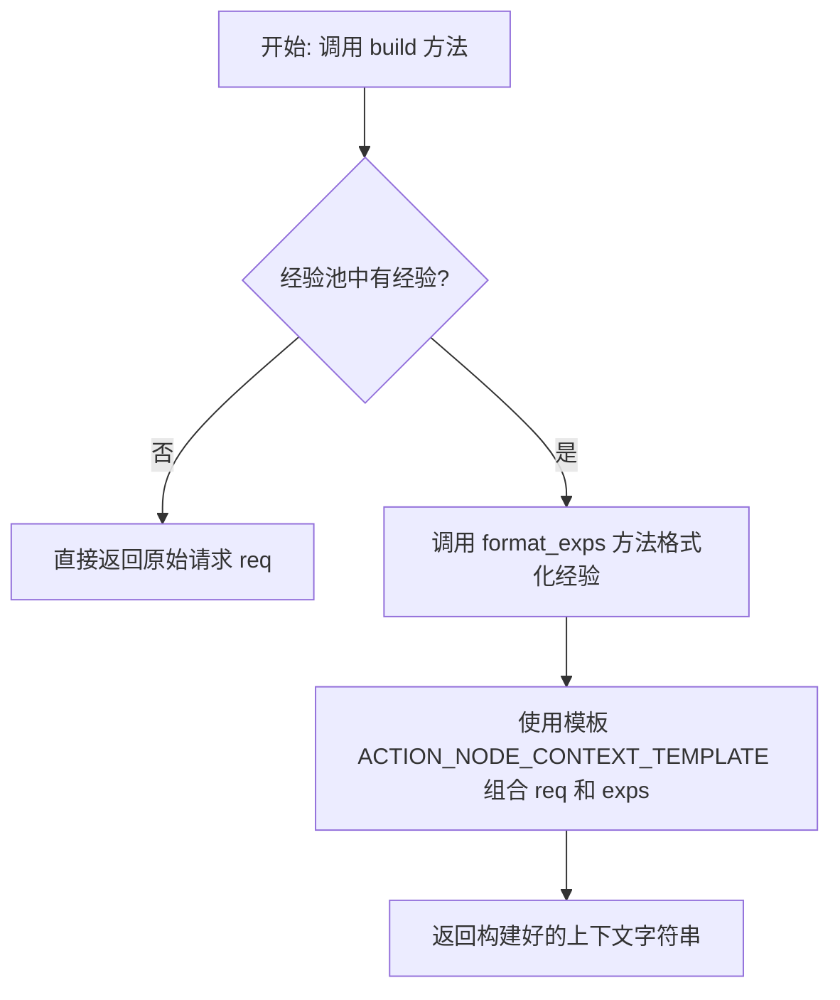
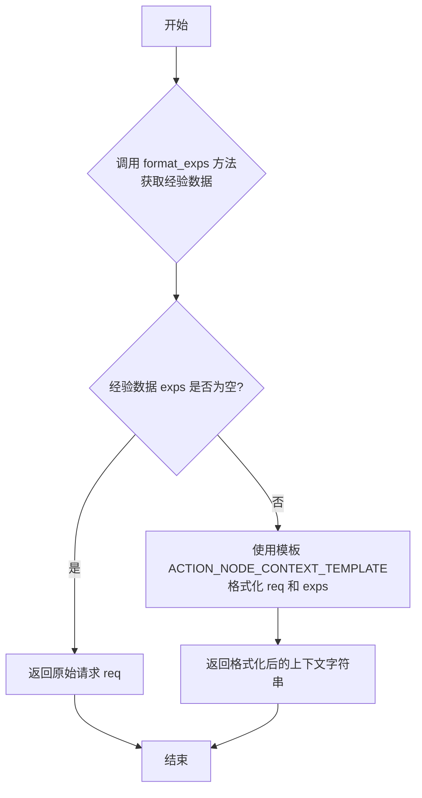

# `.\MetaGPT\metagpt\exp_pool\context_builders\action_node.py` 详细设计文档

该代码实现了一个动作节点上下文构建器，其核心功能是根据给定的请求（req）和从经验池中获取的经验（exps），按照预定义的模板格式，构建一个用于指导AI模型生成更好答案的上下文字符串。如果经验池为空，则直接返回原始请求。

## 整体流程



## 类结构

```
BaseContextBuilder (抽象基类)
└── ActionNodeContextBuilder (动作节点上下文构建器)
```

## 全局变量及字段


### `ACTION_NODE_CONTEXT_TEMPLATE`
    
一个用于格式化动作节点上下文的字符串模板，它将需求（req）和经验（exps）整合成一个结构化的提示字符串。

类型：`str`
    


    

## 全局函数及方法


### `ActionNodeContextBuilder.build`

该方法用于构建动作节点的上下文字符串。如果存在经验数据，则将其格式化并嵌入到预设的模板中，与请求内容一起返回；如果不存在经验数据，则直接返回原始的请求内容。

参数：

- `req`：`Any`，构建上下文所需的原始请求数据或内容。

返回值：`str`，构建完成的上下文字符串。当存在经验数据时，返回格式化后的模板字符串；否则返回原始的 `req` 参数。

#### 流程图



#### 带注释源码

```python
async def build(self, req: Any) -> str:
    """构建动作节点的上下文字符串。

    如果没有经验数据，则返回原始的 `req`；
    否则，返回包含 `req` 和格式化经验数据的上下文。
    """

    # 1. 调用父类或自身的方法，获取并格式化经验数据
    exps = self.format_exps()

    # 2. 判断经验数据是否存在
    #    如果存在，使用预定义的模板将请求和经验数据组合成最终上下文
    #    如果不存在，直接返回原始的请求内容
    return ACTION_NODE_CONTEXT_TEMPLATE.format(req=req, exps=exps) if exps else req
```


## 关键组件


### BaseContextBuilder 基类

作为所有上下文构建器的抽象基类，定义了构建上下文的核心接口。

### ActionNodeContextBuilder 类

继承自 `BaseContextBuilder`，专门用于为动作节点构建包含历史经验（Experiences）的提示上下文。

### ACTION_NODE_CONTEXT_TEMPLATE 模板字符串

定义了动作节点上下文的固定格式模板，用于将原始请求（`req`）和格式化后的经验（`exps`）组合成最终的提示字符串。

### 经验格式化与条件渲染逻辑

在 `build` 方法中实现的逻辑：首先调用 `format_exps` 方法获取格式化后的经验字符串；然后根据经验字符串是否为空，决定是返回包含模板的完整上下文，还是直接返回原始请求。这实现了经验的惰性集成。


## 问题及建议


### 已知问题

-   **类型安全缺失**：`build` 方法的 `req` 参数类型为 `Any`，这降低了代码的类型安全性和可读性。调用者可以传入任意类型的对象，而方法内部直接将其用于字符串格式化，如果传入的对象不支持 `__str__` 方法或转换结果不符合预期，可能导致运行时错误或输出混乱。
-   **模板字符串硬编码**：`ACTION_NODE_CONTEXT_TEMPLATE` 作为模块级常量硬编码在代码中。这使得模板的修改（例如调整格式、添加新字段）变得困难，需要直接修改源代码并重新部署，缺乏灵活性。
-   **经验格式化逻辑不明确**：`self.format_exps()` 方法的实现细节未知（继承自父类 `BaseContextBuilder`）。如果该方法返回复杂对象或列表，当前的 `exps` 变量可能无法直接用于字符串格式化，或者格式化后的结果可能不符合 `ACTION_NODE_CONTEXT_TEMPLATE` 的预期，存在潜在的接口契约不匹配风险。
-   **错误处理不足**：`build` 方法没有对 `self.format_exps()` 调用或 `str.format()` 操作进行异常捕获和处理。例如，如果 `format_exps` 抛出异常，或者 `req` 对象无法转换为合适的字符串，整个构建过程会失败，且调用方可能收到不友好的原始异常信息。

### 优化建议

-   **明确参数类型**：将 `build` 方法的 `req` 参数类型从 `Any` 改为更具体的类型，例如 `str`。如果调用方可能传入非字符串对象，应在方法内部显式地将其转换为字符串（例如使用 `str(req)`），并在文档中说明转换逻辑。这能提高代码的健壮性和 IDE 的智能提示能力。
-   **外部化配置模板**：将 `ACTION_NODE_CONTEXT_TEMPLATE` 移至配置文件（如 YAML、JSON）或环境变量中。这样可以在不修改代码的情况下调整模板内容，便于进行 A/B 测试或根据不同环境（开发、生产）使用不同的模板。
-   **增强模板的健壮性**：在使用 `str.format()` 时，考虑使用安全格式化方式，例如 `template.format_map(safe_dict)` 或使用 f-string 配合条件判断，以防止因缺少键或值类型错误导致的 `KeyError` 或 `ValueError`。同时，确保 `self.format_exps()` 的返回值是字符串或可安全转换为字符串的类型。
-   **添加异常处理与日志**：在 `build` 方法中添加 `try-except` 块，捕获 `format_exps` 调用和字符串格式化可能抛出的异常。记录详细的错误日志（包括输入参数 `req` 的信息），并返回一个安全的默认值（如原始 `req` 或错误提示上下文），而不是让异常直接抛出，从而提高系统的容错能力。
-   **考虑引入模板引擎**：如果模板逻辑变得复杂（例如需要条件判断、循环），可以考虑引入一个轻量级模板引擎（如 Jinja2），以提供更强大、更易维护的模板功能，并将业务逻辑与展示逻辑更好地分离。


## 其它


### 设计目标与约束

本模块的设计目标是提供一个可复用的上下文构建器，用于为动作节点（Action Node）生成包含历史经验（Experiences）的提示上下文。其核心约束包括：
1.  **继承性**：必须继承自 `BaseContextBuilder` 基类，遵循其定义的接口契约。
2.  **灵活性**：能够处理不同类型的请求（`req` 参数类型为 `Any`），并灵活地嵌入格式化后的经验内容。
3.  **简洁性**：当没有可用经验时，应直接返回原始请求，避免生成冗余的上下文结构。
4.  **模板化**：上下文的格式由预定义的模板 `ACTION_NODE_CONTEXT_TEMPLATE` 控制，确保输出的一致性。

### 错误处理与异常设计

当前代码的错误处理策略较为简单：
1.  **输入验证**：未对输入参数 `req` 进行类型或内容验证，依赖于调用方传入有效数据。如果 `req` 不是字符串或不可格式化的对象，在调用 `str.format()` 时可能引发 `AttributeError` 或 `KeyError`。
2.  **经验获取**：`self.format_exps()` 方法的实现未知，如果该方法抛出异常（如数据访问错误），`build` 方法会将异常直接传播给调用者。
3.  **模板渲染**：使用 `str.format()` 进行模板渲染，如果模板字符串中的占位符与传入的字典键不匹配，会引发 `KeyError`。
4.  **建议的增强**：可考虑在 `build` 方法中添加 `try-except` 块，捕获 `format_exps` 和模板格式化过程中可能出现的异常，并记录日志或返回一个安全的默认上下文（例如仅包含 `req`），以提高系统的鲁棒性。

### 数据流与状态机

本模块的数据流是单向和同步的（尽管方法是 `async`，但内部逻辑是同步的）：
1.  **输入**：外部调用者传入一个请求对象 `req`。
2.  **处理**：
    a. 调用 `self.format_exps()` 获取格式化后的经验字符串。
    b. 判断经验字符串是否为空或无效。
3.  **分支逻辑**：
    a. **有经验路径**：将 `req` 和 `exps` 填入 `ACTION_NODE_CONTEXT_TEMPLATE`，生成最终的上下文字符串。
    b. **无经验路径**：直接返回原始的 `req` 对象。
4.  **输出**：返回一个字符串（包含经验的上下文）或原始 `req` 对象。
模块本身无内部状态，其行为完全由输入和 `format_exps()` 的结果决定。

### 外部依赖与接口契约

1.  **基类依赖**：强依赖于 `metagpt.exp_pool.context_builders.base.BaseContextBuilder`。必须实现其定义的 `build` 接口。`BaseContextBuilder` 很可能定义了 `format_exps` 抽象或具体方法，本类需要实现或继承该方法。
2.  **模板常量**：依赖于模块内定义的全局常量 `ACTION_NODE_CONTEXT_TEMPLATE`。该常量的结构（包含 `{req}` 和 `{exps}` 占位符）是本类功能正确运行的前提。
3.  **异步接口**：`build` 方法被定义为 `async`，这意味着它被设计在异步环境中运行，并可能用于 `await` 调用。虽然当前实现没有明显的 `await` 调用，但为未来的异步扩展（如从异步存储中获取经验）预留了可能性。
4.  **调用方契约**：调用方需要理解返回值的两种可能类型（格式化后的字符串或原始 `req`），并做相应处理。

### 测试策略建议

1.  **单元测试**：
    *   **有经验场景**：Mock `format_exps` 返回非空字符串，验证返回的字符串是否符合模板格式，且包含了 `req` 和 `exps`。
    *   **无经验场景**：Mock `format_exps` 返回空字符串或 `None`，验证是否直接返回了 `req` 对象。
    *   **异常场景**：测试当 `format_exps` 抛出异常时，`build` 方法的行为是否符合预期（当前是传播异常）。
2.  **集成测试**：将其与具体的 `BaseContextBuilder` 实现和经验池进行集成，测试从经验获取到上下文生成的全流程。
3.  **模板变更测试**：确保对 `ACTION_NODE_CONTEXT_TEMPLATE` 的修改不会破坏现有的格式化逻辑。

### 安全与合规考虑

1.  **内容安全**：本模块不直接处理用户输入，但 `req` 和 `format_exps()` 返回的内容可能包含用户数据。如果生成的上下文用于大语言模型（LLM）提示，需注意防止提示注入攻击。当前模板将经验与指令分离（“Consider **Experiences**...”）是一个好的实践，降低了经验被误解析为指令的风险。
2.  **数据泄露**：`format_exps()` 方法负责从经验池中提取和格式化数据，需要确保该方法遵守数据访问权限和隐私策略，不会泄露敏感信息。
3.  **无明显的合规风险**：代码本身不涉及网络通信、数据持久化或第三方API调用，主要风险集中于上游数据源和下游上下文的使用方。

    