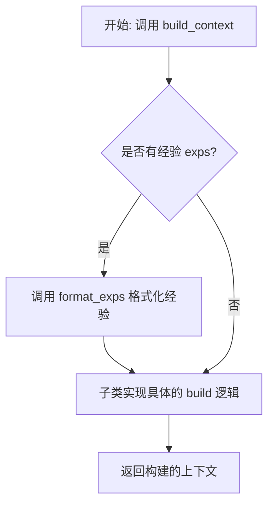
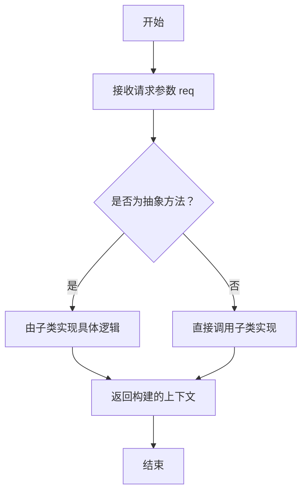
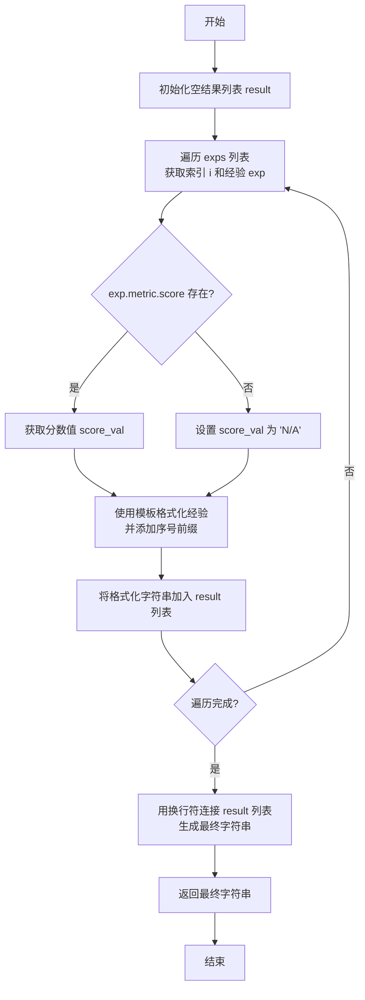

# `.\MetaGPT\metagpt\exp_pool\context_builders\base.py` 详细设计文档

该文件定义了一个用于构建上下文的抽象基类 `BaseContextBuilder`。它提供了一个框架，用于处理请求（`req`）并基于一组经验（`exps`）构建相应的上下文。核心功能包括管理经验列表、将经验格式化为可读字符串，并要求子类实现具体的上下文构建逻辑。

## 整体流程



## 类结构

```
BaseContextBuilder (抽象基类，继承自 BaseModel 和 ABC)
├── 抽象方法: build
└── 具体方法: format_exps
```

## 全局变量及字段


### `EXP_TEMPLATE`
    
一个用于格式化经验（Experience）的字符串模板，定义了如何将请求、响应和评分组合成可读的文本。

类型：`str`
    


### `BaseContextBuilder.model_config`
    
Pydantic模型的配置字典，用于设置模型的行为，例如允许任意类型（arbitrary_types_allowed=True）。

类型：`pydantic.ConfigDict`
    


### `BaseContextBuilder.exps`
    
存储经验（Experience）对象的列表，这些经验用于构建上下文或进行格式化输出。

类型：`list[Experience]`
    
    

## 全局函数及方法

### `BaseContextBuilder.build`

该方法是一个抽象方法，用于根据给定的请求（`req`）构建上下文。具体的构建逻辑由继承 `BaseContextBuilder` 的子类实现。方法要求不直接修改传入的 `req` 参数，若需修改，应先创建其副本。

参数：

- `req`：`Any`，构建上下文所需的原始请求数据。

返回值：`Any`，构建完成的上下文数据，具体类型和内容由子类实现决定。

#### 流程图



#### 带注释源码

```python
    @abstractmethod
    async def build(self, req: Any) -> Any:
        """Build context from req.

        Do not modify `req`. If modification is necessary, use copy.deepcopy to create a copy first.
        """
        # 这是一个抽象方法，没有具体的实现代码。
        # 具体的上下文构建逻辑需要在继承 BaseContextBuilder 的子类中实现。
        # 参数 `req` 是构建上下文的输入数据。
        # 返回值是构建好的上下文，类型和结构由子类定义。
        # 注意：文档要求不要直接修改 `req`，如需修改应先创建其副本。
```

### `BaseContextBuilder.format_exps`

该方法用于将存储在`exps`列表中的`Experience`对象格式化为一个带有序号的、结构化的字符串列表。每个条目遵循预定义的模板，展示请求、响应和对应的评分。

参数：
- `self`：`BaseContextBuilder`，当前`BaseContextBuilder`实例的引用。

返回值：`str`，返回一个字符串，其中每个格式化后的经验条目以换行符分隔，并按顺序编号。

#### 流程图



#### 带注释源码

```python
def format_exps(self) -> str:
    """Format experiences into a numbered list of strings.

    Example:
        1. Given the request: req1, We can get the response: resp1, which scored: 8.
        2. Given the request: req2, We can get the response: resp2, which scored: 9.

    Returns:
        str: The formatted experiences as a string.
    """

    # 初始化一个空列表，用于存储格式化后的每个经验条目
    result = []
    # 遍历 self.exps 列表，enumerate 提供索引 i（从1开始）和经验对象 exp
    for i, exp in enumerate(self.exps, start=1):
        # 安全地获取评分值：检查 exp.metric 和 exp.metric.score 是否存在
        # 如果存在，获取其值；否则，使用默认字符串 "N/A"
        score_val = exp.metric.score.val if exp.metric and exp.metric.score else "N/A"
        # 使用预定义的模板 EXP_TEMPLATE 格式化当前经验，并添加序号前缀
        # 将格式化后的字符串添加到结果列表中
        result.append(f"{i}. " + EXP_TEMPLATE.format(req=exp.req, resp=exp.resp, score=score_val))

    # 使用换行符 "\n" 连接结果列表中的所有字符串，形成一个完整的文本块并返回
    return "\n".join(result)
```

## 关键组件


### BaseContextBuilder

一个用于构建上下文的抽象基类，定义了从请求构建上下文的基本接口和格式化经验数据的方法。

### Experience

表示经验的数据结构，包含请求、响应和评分等信息，用于在上下文中提供历史参考。

### EXP_TEMPLATE

一个字符串模板，用于格式化单个经验条目，将请求、响应和评分组合成一段可读的文本。

### format_exps 方法

将存储的经验列表格式化为一个带编号的字符串列表，每个条目遵循 EXP_TEMPLATE 的格式，便于在上下文中展示。


## 问题及建议


### 已知问题

-   **`format_exps` 方法缺乏健壮性**：当 `exp.metric` 或 `exp.metric.score` 为 `None` 时，代码直接访问 `exp.metric.score.val` 会导致 `AttributeError`。虽然代码使用了三元表达式进行保护，但 `exp.metric` 本身为 `None` 时，`exp.metric.score` 的访问仍会引发异常。
-   **经验格式化模板过于简单**：`EXP_TEMPLATE` 是一个硬编码的字符串模板，它假设所有经验（`Experience`）都具有相同的结构（`req`, `resp`, `score`）。如果 `Experience` 模型未来扩展了其他需要展示的字段，或者不同场景需要不同的格式化方式，此模板将缺乏灵活性。
-   **`build` 方法抽象约束可能被忽略**：`build` 方法的文档字符串中明确要求“不要修改 `req`”，并建议在必要时使用 `copy.deepcopy`。这是一个重要的约束，但仅通过文档来约束，在代码层面没有强制机制（例如，通过类型提示或运行时检查），容易在子类实现中被开发者忽略，导致潜在的副作用错误。
-   **`exps` 字段的默认可变性风险**：`exps: list[Experience] = []` 使用了可变对象（空列表）作为类字段的默认值。这是一个常见的Python反模式。如果多个实例共享了同一个默认列表，修改其中一个实例的 `exps` 会影响其他实例。虽然Pydantic的 `BaseModel` 通常会在实例化时处理此问题，但明确使用 `default_factory` 是更安全、更清晰的做法。

### 优化建议

-   **增强 `format_exps` 的错误处理**：重构 `format_exps` 方法，使用更安全的属性访问方式，例如 `getattr` 链式调用或 `try-except` 块，以优雅地处理 `Experience` 对象中可能缺失的 `metric` 或 `score` 属性。
-   **将经验格式化逻辑抽象化**：考虑将 `EXP_TEMPLATE` 和格式化逻辑提取到一个可配置的策略中。可以定义一个 `ExperienceFormatter` 抽象类或协议，并让 `BaseContextBuilder` 持有一个格式化器实例。这样，不同的上下文构建器或同一构建器的不同使用场景可以注入不同的格式化策略，提高代码的可扩展性和可测试性。
-   **强化 `build` 方法的不可变约束**：可以考虑在 `build` 方法中添加一个装饰器或辅助函数，用于检查传入的 `req` 对象在方法执行前后是否发生了改变（例如，通过比较对象的哈希值或深拷贝后的相等性）。虽然这会增加一些运行时开销，但对于调试和确保架构契约非常有用。或者，可以将此要求明确写入团队编码规范，并通过代码审查来强化。
-   **使用 `default_factory` 初始化可变字段**：将 `exps` 字段的默认值定义修改为使用 `default_factory`，例如 `exps: list[Experience] = Field(default_factory=list)`。这确保了每个 `BaseContextBuilder` 实例都拥有自己独立的列表，消除了意外的数据共享风险，符合Pydantic的最佳实践。


## 其它


### 设计目标与约束

本模块旨在提供一个可扩展的、用于构建上下文的抽象基类。其核心设计目标包括：
1.  **抽象与可扩展性**：通过抽象基类 `BaseContextBuilder` 和抽象方法 `build`，定义构建上下文的统一接口，允许子类根据具体需求（如不同模型、不同任务）实现具体的上下文构建逻辑。
2.  **经验集成**：内置对 `Experience` 列表的管理和格式化能力，使得构建的上下文可以方便地融入历史经验信息，以支持基于经验的决策或提示工程。
3.  **数据安全与不可变性**：在 `build` 方法的文档中明确约束“不应修改 `req` 参数”，若需修改必须先进行深拷贝，这确保了输入数据的不可变性，避免了副作用，是函数式编程和线程安全的重要实践。
4.  **Pydantic 集成**：利用 Pydantic 的 `BaseModel` 作为基类，自动获得数据验证、序列化/反序列化以及配置管理（如通过 `ConfigDict` 允许任意类型）的能力，简化了类的定义并增强了健壮性。

### 错误处理与异常设计

当前代码中的错误处理策略较为隐式，主要依赖于语言和框架的默认机制：
1.  **输入验证**：依赖 Pydantic 在实例化 `BaseContextBuilder` 或其子类时，对 `exps` 字段进行类型验证。如果传入非 `list[Experience]` 类型的数据，Pydantic 会抛出 `ValidationError`。
2.  **抽象方法调用**：直接调用子类实现的 `build` 方法。如果子类未正确实现该方法，在实例化子类时不会报错，但在调用 `build` 时会抛出 `TypeError`。更佳实践是在 `BaseContextBuilder` 的 `__init_subclass__` 中进行检查。
3.  `format_exps` **方法**：该方法假设 `exp.metric` 和 `exp.metric.score` 可能为 `None`，并使用了条件表达式 (`... if ... else "N/A"`) 进行防御性处理，避免了 `AttributeError`。这是一种简单的容错设计。
4.  **潜在的异常**：`EXP_TEMPLATE.format(...)` 调用要求 `exp.req` 和 `exp.resp` 必须是可转换为字符串的对象，否则可能抛出异常。当前代码未对此做显式处理。

### 数据流与状态机

本模块的数据流相对清晰，不涉及复杂的状态机：
1.  **初始化数据流**：在创建 `BaseContextBuilder`（或其子类）实例时，`exps` 列表被初始化（默认为空）或通过构造函数传入。此数据作为实例的内部状态。
2.  **上下文构建数据流 (`build` 方法)**：
    *   **输入**：`req` 参数（任意类型），代表构建上下文所需的原始请求或输入。
    *   **处理**：具体的子类实现利用 `req` 和内部状态 `exps`（通常通过 `format_exps` 格式化后）来合成最终的上下文。
    *   **输出**：返回构建好的上下文（任意类型）。
3.  **经验格式化数据流 (`format_exps` 方法)**：
    *   **输入**：内部状态 `exps` 列表。
    *   **处理**：遍历 `exps`，使用 `EXP_TEMPLATE` 模板将每个 `Experience` 对象格式化为字符串，并添加序号。处理 `metric.score` 可能缺失的情况。
    *   **输出**：一个由格式化后的经验字符串组成的、以换行符连接的多行文本。
4.  **状态变更**：`exps` 字段是可变列表。虽然 `BaseContextBuilder` 本身没有提供修改它的方法，但子类或外部代码可以直接对其进行增删改操作，从而改变实例的状态，影响后续 `build` 和 `format_exps` 的输出。

### 外部依赖与接口契约

1.  **外部依赖库**：
    *   `abc` (Python 标准库)：用于定义抽象基类 (`ABC`) 和抽象方法 (`abstractmethod`)。
    *   `typing` (Python 标准库)：用于类型注解 (`Any`)。
    *   `pydantic`：用于数据模型定义、验证和配置。依赖 `BaseModel` 和 `ConfigDict`。
    *   `metagpt.exp_pool.schema`：从 `metagpt` 项目导入 `Experience` 数据类型。这是对项目内部另一个模块的强依赖。
2.  **接口契约**：
    *   **对上游（调用者）的契约**：`BaseContextBuilder` 的子类必须实现 `async build(self, req: Any) -> Any` 方法，并遵守“不修改 `req`”的约定。调用者通过此异步接口获取上下文。
    *   **对下游（子类实现者）的契约**：基类提供了 `exps` 存储和 `format_exps` 工具方法，子类可以在其 `build` 实现中利用这些功能。`EXP_TEMPLATE` 常量定义了经验格式化的默认模板。
    *   **数据契约**：`exps` 字段期望接收 `list[Experience]` 类型的数据，这依赖于 `metagpt.exp_pool.schema.Experience` 的特定结构（尤其是 `req`, `resp`, `metric.score.val` 等属性）。如果 `Experience` 的结构发生变化，`format_exps` 方法可能会失效。

    