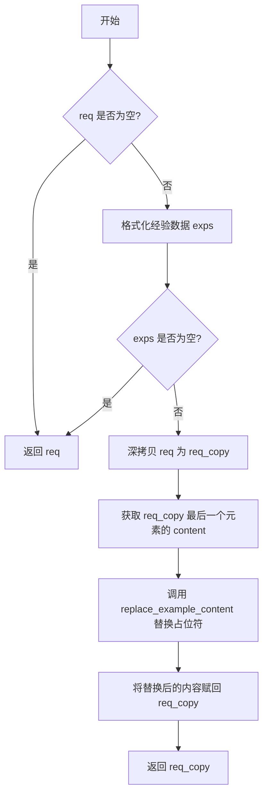
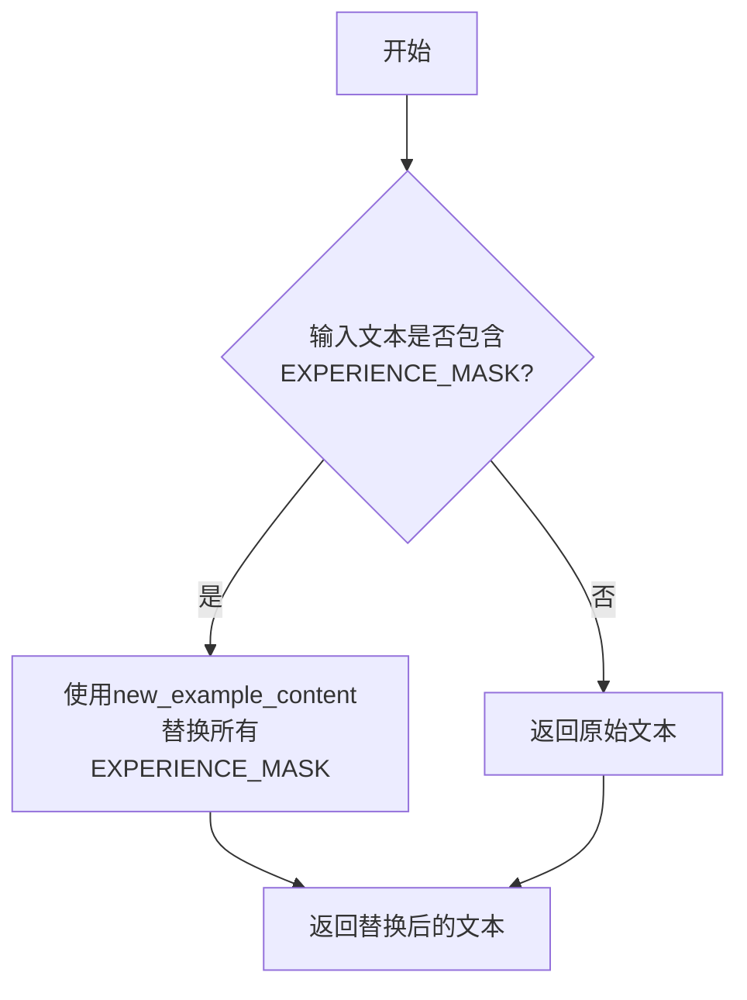

# `.\MetaGPT\metagpt\exp_pool\context_builders\role_zero.py` 详细设计文档

该代码实现了一个名为 RoleZeroContextBuilder 的上下文构建器，其核心功能是处理对话请求（req），将请求中最后一个消息内容里的特定占位符（EXPERIENCE_MASK）替换为格式化后的经验数据（exps），从而为角色（RoleZero）构建包含实际经验的对话上下文。

## 整体流程

```mermaid
graph TD
    A[开始: build(req)] --> B{req 是否为空?}
    B -- 是 --> C[直接返回 req]
    B -- 否 --> D[调用 format_exps() 获取经验数据]
    D --> E{exps 是否为空?}
    E -- 是 --> F[直接返回 req]
    E -- 否 --> G[深拷贝 req 到 req_copy]
    G --> H[获取 req_copy 最后一个消息的 content]
    H --> I[调用 replace_example_content(content, exps) 替换占位符]
    I --> J[将替换后的内容写回 req_copy]
    J --> K[返回构建好的 req_copy]
```

## 类结构

```
BaseContextBuilder (抽象基类)
└── RoleZeroContextBuilder (具体实现类)
```

## 全局变量及字段


### `EXPERIENCE_MASK`
    
一个字符串常量，用作占位符标记，标识在文本中需要被实际经验内容替换的位置。

类型：`str`
    


    

## 全局函数及方法

### `RoleZeroContextBuilder.build`

该方法用于构建角色零（RoleZero）的上下文。它接收一个请求列表，如果请求非空且存在格式化后的经验数据，则复制请求，并将请求中最后一个元素的“content”字段内的占位符替换为实际的经验内容，最后返回修改后的请求副本。

参数：

- `req`：`Any`，请求数据，期望格式为列表，例如 `[{...}, {"role": "user", "content": "context"}]`。

返回值：`list[dict]`，返回处理后的请求列表。如果输入请求为空或没有格式化后的经验数据，则返回原始请求。

#### 流程图



#### 带注释源码

```python
async def build(self, req: Any) -> list[dict]:
    """构建角色零的上下文字符串。

    注意：
        1. `req` 的期望格式，例如，`[{...}, {"role": "user", "content": "context"}]`。
        2. 如果 `req` 为空，则返回原始的 `req`。
        3. 创建 req 的副本，并将副本中的示例内容替换为实际的经验。
    """

    # 检查请求是否为空
    if not req:
        return req

    # 格式化经验数据
    exps = self.format_exps()
    # 检查格式化后的经验数据是否为空
    if not exps:
        return req

    # 深拷贝请求以避免修改原始数据
    req_copy = copy.deepcopy(req)

    # 获取请求副本中最后一个元素的“content”字段，并用经验数据替换其中的占位符
    req_copy[-1]["content"] = self.replace_example_content(req_copy[-1].get("content", ""), exps)

    # 返回修改后的请求副本
    return req_copy
```

### `RoleZeroContextBuilder.replace_example_content`

该方法用于将输入文本中的经验占位符（`EXPERIENCE_MASK`）替换为实际的经验内容。它是`RoleZeroContextBuilder`类中构建上下文流程的一部分，具体负责内容替换的逻辑。

参数：

- `text`：`str`，包含经验占位符的原始文本。
- `new_example_content`：`str`，用于替换占位符的实际经验内容。

返回值：`str`，替换占位符后的新文本。

#### 流程图



#### 带注释源码

```python
def replace_example_content(self, text: str, new_example_content: str) -> str:
    # 调用静态方法 fill_experience 执行实际的替换操作
    return self.fill_experience(text, new_example_content)
```

### `RoleZeroContextBuilder.fill_experience`

`RoleZeroContextBuilder.fill_experience` 是一个静态方法，用于将输入文本中的特定占位符（`EXPERIENCE_MASK`）替换为新的示例内容。它不依赖于类的实例状态，仅通过字符串操作完成简单的文本替换。

参数：

- `text`：`str`，包含占位符的原始文本。
- `new_example_content`：`str`，用于替换占位符的新示例内容。

返回值：`str`，替换占位符后的新文本。

#### 流程图


#### 带注释源码

```python
@staticmethod
def fill_experience(text: str, new_example_content: str) -> str:
    # 使用新的示例内容替换文本中的所有 EXPERIENCE_MASK 占位符
    replaced_text = text.replace(EXPERIENCE_MASK, new_example_content)
    # 返回替换后的文本
    return replaced_text
```

## 关键组件


### RoleZeroContextBuilder

RoleZeroContextBuilder 是一个上下文构建器，它继承自 BaseContextBuilder，专门用于处理包含经验掩码（EXPERIENCE_MASK）的请求。其核心功能是接收一个请求列表，将列表中最后一个消息内容里的经验掩码替换为格式化后的实际经验内容，从而构建出包含特定经验的上下文。

### 经验掩码替换机制

该机制通过静态方法 `fill_experience` 实现，它使用字符串的 `replace` 方法，将输入文本中的预定义经验掩码（EXPERIENCE_MASK）替换为新的、格式化后的经验内容字符串。这是实现上下文动态构建和惰性经验加载的关键。

### 请求处理流程

该流程由 `build` 方法定义。它首先检查请求是否为空，然后获取并格式化经验数据。如果经验数据有效，它会创建请求的深拷贝，并调用 `replace_example_content` 方法将拷贝中最后一个消息内容里的经验示例替换为实际经验，最后返回修改后的请求拷贝，确保原始请求不被修改。


## 问题及建议


### 已知问题

-   **硬编码的替换逻辑**：`replace_example_content` 方法直接调用 `fill_experience` 进行简单的字符串替换。这假设了 `EXPERIENCE_MASK` 在输入文本 `text` 中恰好出现一次且位置固定（通常在末尾）。如果 `EXPERIENCE_MASK` 未找到、出现多次或位置不符合预期，替换行为可能不符合设计初衷，导致上下文构建错误。
-   **脆弱的请求结构假设**：`build` 方法直接操作 `req[-1]`，即请求列表的最后一个元素。这强依赖于输入 `req` 的格式必须严格符合 `[{...}, {"role": "user", "content": "context"}]` 的假设。如果传入的请求结构不同（例如，最后一个元素不是用户消息，或者 `content` 字段不存在），代码会抛出 `KeyError` 或导致逻辑错误。
-   **经验池空值处理逻辑可能不完整**：当 `exps` 为空时，方法直接返回原始 `req`。虽然这避免了无效替换，但未考虑是否需要记录日志、抛出特定异常或返回一个标识“无经验可用”的上下文给调用方，调用方可能无法区分“未应用经验”和“应用了空经验”这两种情况。
-   **缺乏输入验证与错误处理**：代码没有对输入参数 `req` 的类型和结构进行验证。如果传入非列表类型、列表元素格式不正确或 `req[-1]` 不是字典，程序会抛出异常。同时，`replace_example_content` 和 `fill_experience` 方法内部没有处理潜在的异常（如 `text` 为 `None`）。

### 优化建议

-   **增强替换逻辑的健壮性**：在 `replace_example_content` 方法中，可以增加对 `EXPERIENCE_MASK` 出现次数和位置的检查。例如，如果未找到标记，可以记录警告日志并返回原文本或抛出特定异常；如果找到多次，可以根据业务规则决定是替换所有、替换第一个还是视为错误。
-   **解耦对请求结构的依赖**：重构 `build` 方法，使其不硬编码索引 `-1`。可以改为遍历 `req_copy`，寻找特定角色（如 `"user"`）或包含 `EXPERIENCE_MASK` 的条目进行替换。或者，将定位目标消息的逻辑抽象为一个独立的方法或策略，提高可配置性和可测试性。
-   **完善空经验池的处理策略**：考虑定义更明确的返回值或状态。例如，可以返回一个包含标志位的元组 `(modified_req, was_experience_applied)`，或者当 `exps` 为空时，在上下文中插入一个特定的占位符或注释，使下游处理更清晰。
-   **增加输入验证和防御性编程**：
    -   在 `build` 方法开始处，使用 `isinstance` 检查 `req` 是否为列表。
    -   在访问 `req[-1]["content"]` 前，检查索引有效性、元素类型以及键是否存在。
    -   在 `replace_example_content` 和 `fill_experience` 中，对 `text` 参数进行空值或非字符串类型的处理（例如，如果 `text` 为 `None`，返回空字符串或抛出 `ValueError`）。
    -   考虑使用 `try-except` 块捕获可能的异常，并转换为更有意义的业务异常或记录详细错误日志后向上抛出。
-   **提升代码可测试性和可维护性**：
    -   将 `EXPERIENCE_MASK` 的引用从静态方法 `fill_experience` 中解耦，可以考虑通过类属性或构造函数参数传入，使替换标记可配置。
    -   为关键方法（尤其是 `build` 和 `replace_example_content`）编写单元测试，覆盖各种边界情况（如空输入、异常结构、标记多次出现等）。


## 其它


### 设计目标与约束

本模块的核心设计目标是构建一个可扩展的上下文构建器，用于在对话请求中动态替换预定义的占位符（`EXPERIENCE_MASK`）为实际的经验内容。主要约束包括：1) 必须继承自 `BaseContextBuilder` 基类，遵循其接口契约；2) 处理流程需保持原始请求数据的不可变性，通过深拷贝进行操作；3) 替换操作需精确匹配占位符，避免影响请求的其他部分。

### 错误处理与异常设计

当前代码的异常处理较为隐式，主要依赖Python内置的异常机制。潜在的风险点包括：1) `req` 参数可能不是预期的列表或字典结构，导致索引或键访问错误；2) `req[-1]` 在列表为空时引发 `IndexError`；3) `req_copy[-1].get("content", "")` 假设最后一条消息是字典，且 `"content"` 键可能存在。建议增加参数验证和类型检查，或使用更健壮的访问方式（如 `try-except`），并定义明确的业务异常类以提高错误信息的可读性。

### 数据流与状态机

数据流起始于外部传入的请求 `req`。首先检查 `req` 是否为空，若为空则直接返回。若非空，则调用 `format_exps()` 方法（从父类继承）获取格式化后的经验字符串 `exps`。若 `exps` 为空，同样直接返回原 `req`。当两者均非空时，对 `req` 进行深拷贝得到 `req_copy`，然后调用 `replace_example_content` 方法，该方法内部使用 `fill_experience` 静态方法，将 `req_copy` 中最后一条消息的 `content` 字段内的 `EXPERIENCE_MASK` 占位符替换为 `exps` 的内容。最终，修改后的 `req_copy` 作为结果返回。整个过程无复杂的状态转换，是一个线性的处理流程。

### 外部依赖与接口契约

1.  **继承依赖**：强依赖于父类 `BaseContextBuilder`，特别是其 `format_exps()` 方法。需要确保父类正确实现此方法以提供经验内容。
2.  **常量依赖**：依赖于从 `metagpt.const` 导入的 `EXPERIENCE_MASK`。此常量定义了需要被替换的占位符字符串，其值的变化将直接影响模块的核心功能。
3.  **接口契约**：
    *   `build(self, req: Any) -> list[dict]`: 作为 `BaseContextBuilder` 接口的实现，必须接受一个 `Any` 类型的请求并返回一个字典列表。虽然注释说明了期望的格式，但接口本身未做强制约束。
    *   `replace_example_content(self, text: str, new_example_content: str) -> str`: 当前实现仅代理调用 `fill_experience`，但作为类方法，为子类重写替换逻辑提供了入口点。
4.  **标准库依赖**：依赖 `copy` 模块进行深拷贝操作，这是保证原始请求不被修改的关键。

### 性能考量

1.  **深拷贝开销**：使用 `copy.deepcopy` 确保数据独立性，但对于大型或嵌套层数很深的 `req` 对象，这可能带来显著的内存和时间开销。如果上游能保证请求数据在后续流程中不会被修改，可考虑改为浅拷贝或直接操作，但需仔细评估风险。
2.  **字符串替换效率**：`str.replace` 方法在替换单个固定模式时是高效的。如果 `EXPERIENCE_MASK` 在 `text` 中出现多次或文本量极大，性能影响可忽略。目前设计是合理的。
3.  **条件检查**：在流程开始处的空值检查避免了不必要的拷贝和格式化操作，是良好的性能优化实践。

### 测试策略建议

1.  **单元测试**：
    *   `build` 方法：应覆盖 `req` 为空、`exps` 为空、正常替换、`req` 结构不符合预期（如非列表、列表元素非字典、最后一条消息无`content`键）等边界情况。
    *   `fill_experience` 静态方法：应测试 `EXPERIENCE_MASK` 出现零次、一次、多次的情况，以及大小写敏感等。
2.  **集成测试**：需要测试与父类 `BaseContextBuilder` 的集成，特别是 `format_exps()` 返回不同内容时，`build` 方法的行为是否符合预期。
3.  **Mock 使用**：在测试 `build` 方法时，应 Mock 父类的 `format_exps()` 方法以隔离测试上下文构建器本身的逻辑。

    