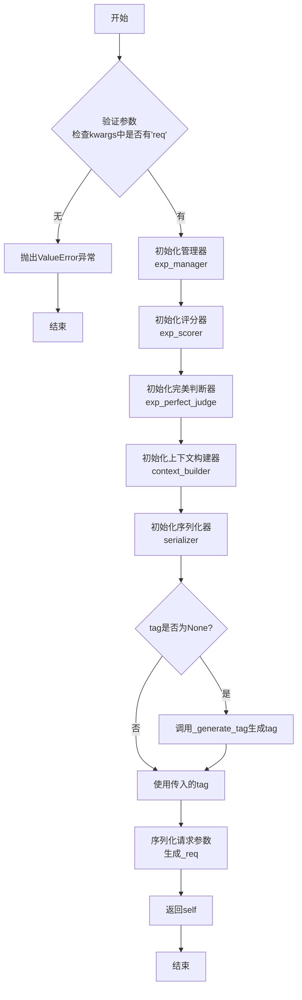
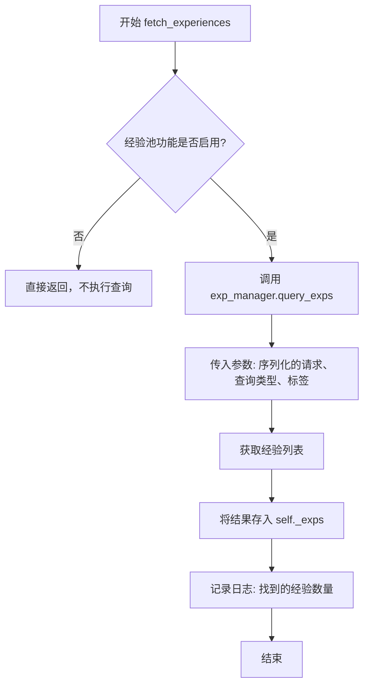
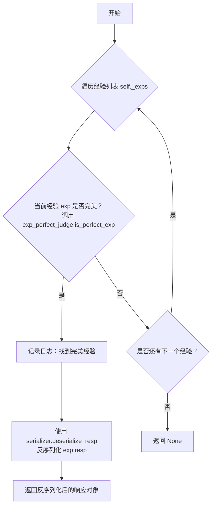
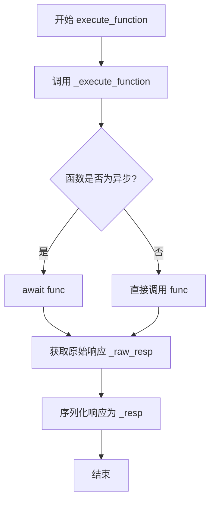
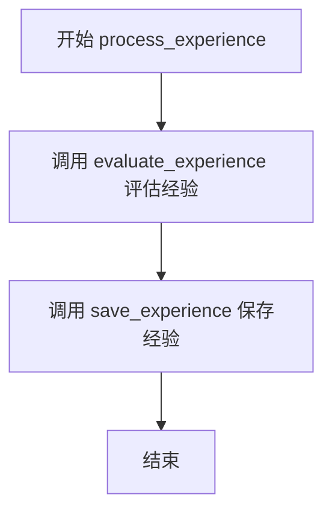
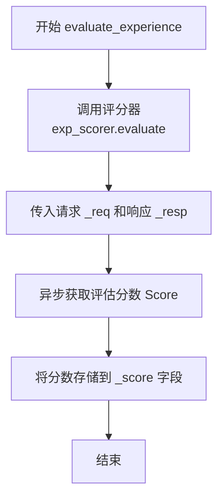
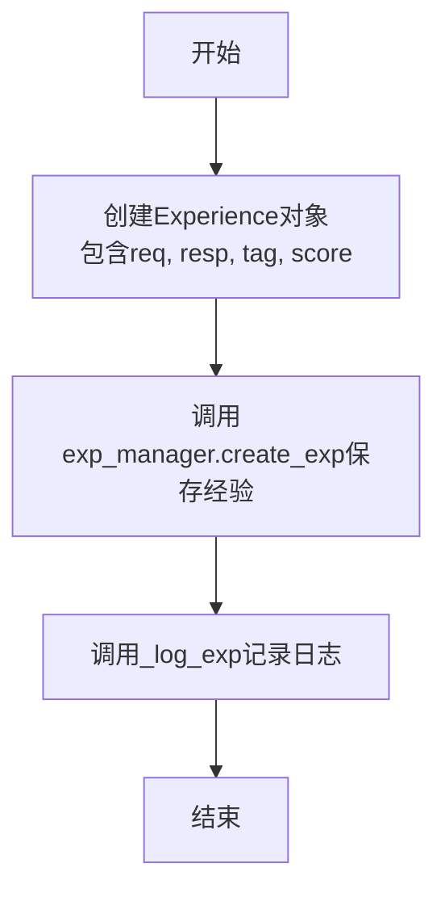
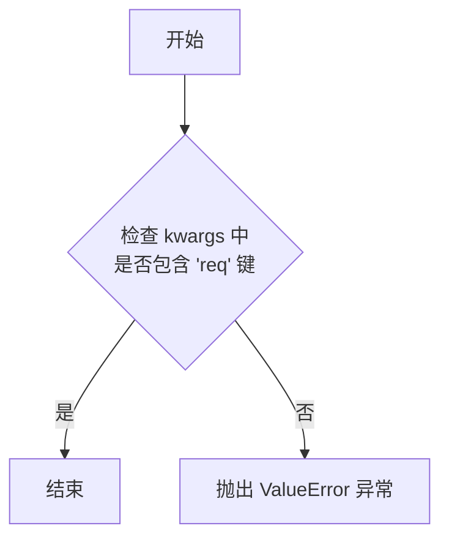
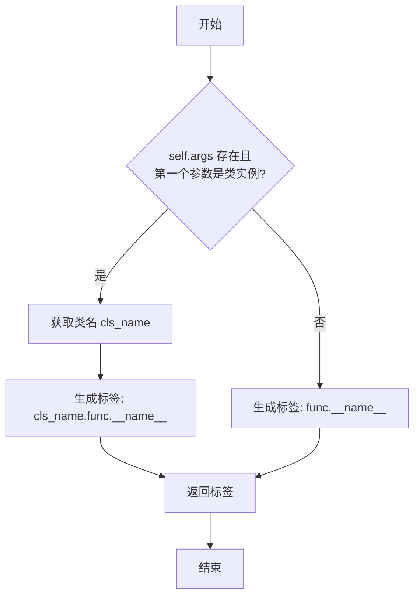
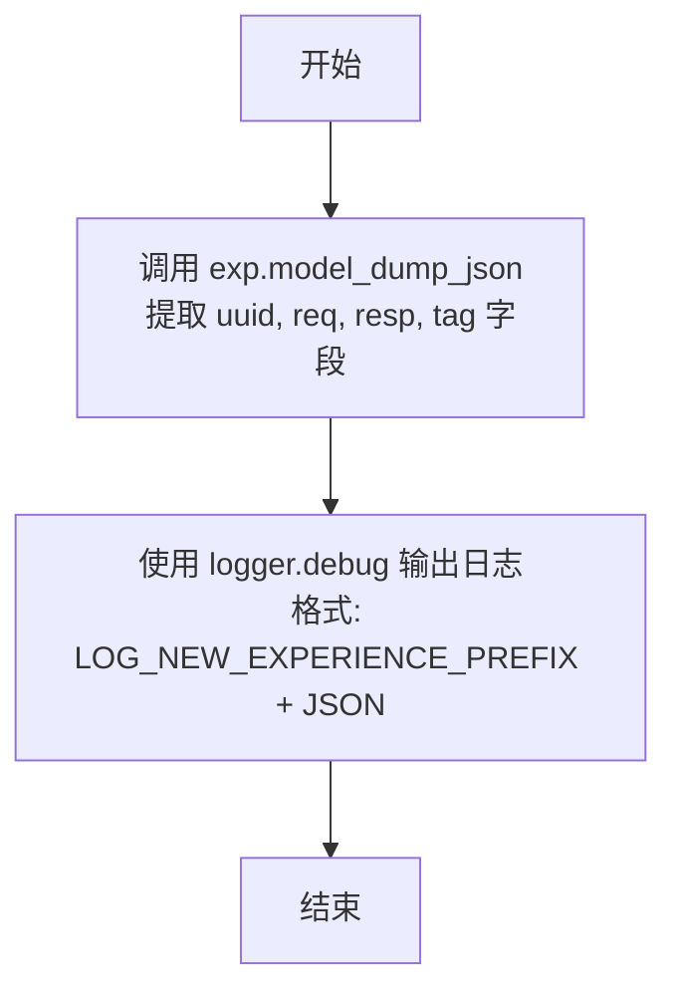

# `.\MetaGPT\metagpt\exp_pool\decorator.py` 详细设计文档

该代码实现了一个名为`exp_cache`的装饰器，用于构建一个智能的经验缓存系统。其核心功能是：当被装饰的函数（通常是LLM调用）执行时，首先尝试从经验池中查询语义相似的历史请求，并评估是否存在“完美”的经验可以直接复用；如果不存在，则执行原函数获取新结果，随后对该结果进行评估并作为新经验存入池中，从而实现对高成本函数（如大模型调用）的优化和结果复用。

## 整体流程

```mermaid
graph TD
    A[调用被@exp_cache装饰的函数] --> B{经验池功能是否启用?}
    B -- 否 --> C[直接执行原函数]
    C --> D[返回结果]
    B -- 是 --> E[ExpCacheHandler初始化]
    E --> F[序列化请求参数为_req]
    F --> G[从经验池查询相似经验_exps]
    G --> H{遍历_exps，是否存在完美经验?}
    H -- 是 --> I[反序列化完美经验结果]
    I --> D
    H -- 否 --> J[构建上下文并执行原函数]
    J --> K[序列化函数结果为_resp]
    K --> L{是否启用写入?}
    L -- 否 --> D
    L -- 是 --> M[评估新经验得分_score]
    M --> N[创建并保存新经验到池中]
    N --> D
```

## 类结构

```
ExpCacheHandler (Pydantic BaseModel)
├── 字段: func, args, kwargs, query_type, exp_manager, exp_scorer, exp_perfect_judge, context_builder, serializer, tag
├── 私有字段: _exps, _req, _resp, _raw_resp, _score
├── 方法: initialize, fetch_experiences, get_one_perfect_exp, execute_function, process_experience, evaluate_experience, save_experience, choose_wrapper
└── 私有方法: _validate_params, _generate_tag, _build_context, _execute_function, _log_exp
```

## 全局变量及字段


### `ReturnType`
    
用于装饰器函数签名的泛型类型变量，表示被装饰函数的返回类型。

类型：`typing.TypeVar`
    


### `LOG_NEW_EXPERIENCE_PREFIX`
    
日志前缀常量，用于标识新经验记录的日志条目。

类型：`str`
    


### `ExpCacheHandler.func`
    
被装饰的原始函数对象。

类型：`typing.Callable`
    


### `ExpCacheHandler.args`
    
调用被装饰函数时传入的位置参数元组。

类型：`typing.Any`
    


### `ExpCacheHandler.kwargs`
    
调用被装饰函数时传入的关键字参数字典。

类型：`typing.Any`
    


### `ExpCacheHandler.query_type`
    
查询经验池时使用的查询类型（如语义查询）。

类型：`metagpt.exp_pool.schema.QueryType`
    


### `ExpCacheHandler.exp_manager`
    
经验管理器，负责经验的查询、创建和管理。

类型：`metagpt.exp_pool.manager.ExperienceManager | None`
    


### `ExpCacheHandler.exp_scorer`
    
经验评分器，用于评估新生成经验的质量。

类型：`metagpt.exp_pool.scorers.BaseScorer | None`
    


### `ExpCacheHandler.exp_perfect_judge`
    
完美经验判定器，用于判断从经验池中获取的经验是否完美匹配当前请求。

类型：`metagpt.exp_pool.perfect_judges.BasePerfectJudge | None`
    


### `ExpCacheHandler.context_builder`
    
上下文构建器，用于根据历史经验和当前请求构建增强的上下文。

类型：`metagpt.exp_pool.context_builders.BaseContextBuilder | None`
    


### `ExpCacheHandler.serializer`
    
序列化器，负责请求和响应的序列化与反序列化。

类型：`metagpt.exp_pool.serializers.BaseSerializer | None`
    


### `ExpCacheHandler.tag`
    
经验的标签，通常用于标识经验所属的类和方法，便于分类和查询。

类型：`str | None`
    


### `ExpCacheHandler._exps`
    
从经验池中查询到的经验列表。

类型：`list[metagpt.exp_pool.schema.Experience] | None`
    


### `ExpCacheHandler._req`
    
序列化后的请求字符串，用于经验池的查询和存储。

类型：`str`
    


### `ExpCacheHandler._resp`
    
序列化后的响应字符串，用于经验池的存储。

类型：`str`
    


### `ExpCacheHandler._raw_resp`
    
被装饰函数执行后返回的原始响应对象。

类型：`typing.Any`
    


### `ExpCacheHandler._score`
    
对新生成经验的评分结果。

类型：`metagpt.exp_pool.schema.Score | None`
    
    

## 全局函数及方法

### `exp_cache`

一个用于实现“经验缓存”的高级装饰器。其核心逻辑是：当被装饰的函数被调用时，首先尝试从经验池中查找一个“完美”的、可复用的历史经验（即函数结果）。如果找到，则直接返回该结果，避免重复计算。如果未找到，则执行原函数，生成新的结果，并根据配置决定是否将其作为新的经验进行评估和存储，以供未来复用。该装饰器支持同步和异步函数，并提供了高度可配置的查询、评分、完美判定、上下文构建和序列化组件。

参数：

- `_func`：`Optional[Callable[..., ReturnType]]`，可选参数，用于使装饰器可以同时以`@exp_cache`和`@exp_cache(...)`两种形式使用。当直接`@exp_cache`使用时，此参数即为被装饰的函数。
- `query_type`：`QueryType`，查询类型，指定从经验池中查找经验时使用的查询方式（如语义查询）。默认为`QueryType.SEMANTIC`。
- `manager`：`Optional[ExperienceManager]`，经验管理器，负责经验的查询、创建等操作。默认为全局的`exp_manager`。
- `scorer`：`Optional[BaseScorer]`，评分器，用于评估新生成的经验的质量。默认为`SimpleScorer()`。
- `perfect_judge`：`Optional[BasePerfectJudge]`，完美判定器，用于判断一个已有的经验是否适用于当前请求。默认为`SimplePerfectJudge()`。
- `context_builder`：`Optional[BaseContextBuilder]`，上下文构建器，用于在未找到完美经验时，基于历史经验和当前请求参数构建新的输入上下文。默认为`SimpleContextBuilder()`。
- `serializer`：`Optional[BaseSerializer]`，序列化器，负责将函数的请求参数和返回值序列化为字符串以便存储，以及将存储的字符串反序列化为返回值。默认为`SimpleSerializer()`。
- `tag`：`Optional[str]`，可选标签，用于对经验进行分类。默认为自动生成的`ClassName.method_name`或`function_name`。

返回值：`Callable[..., ReturnType]`，返回一个包装后的函数，该函数内部实现了上述经验缓存逻辑。

#### 流程图

```mermaid
flowchart TD
    A[“调用被装饰函数”] --> B{“经验池功能<br>是否启用?<br>(config.exp_pool.enabled)”}
    B -- 否 --> C[“直接执行原函数”]
    B -- 是 --> D[“初始化ExpCacheHandler<br>并序列化请求(_req)”]
    D --> E[“从经验池查询经验(_exps)”]
    E --> F{“遍历_exps<br>是否存在完美经验?”}
    F -- 是 --> G[“反序列化完美经验的响应<br>并直接返回”]
    F -- 否 --> H[“构建新上下文并执行原函数<br>得到_raw_resp并序列化为_resp”]
    H --> I{“是否允许写入经验池?<br>(config.exp_pool.enable_write)”}
    I -- 否 --> J[“返回_raw_resp”]
    I -- 是 --> K[“评估新经验得到_score”]
    K --> L[“创建并保存新经验到经验池”]
    L --> J
```

#### 带注释源码

```python
def exp_cache(
    _func: Optional[Callable[..., ReturnType]] = None,
    query_type: QueryType = QueryType.SEMANTIC,
    manager: Optional[ExperienceManager] = None,
    scorer: Optional[BaseScorer] = None,
    perfect_judge: Optional[BasePerfectJudge] = None,
    context_builder: Optional[BaseContextBuilder] = None,
    serializer: Optional[BaseSerializer] = None,
    tag: Optional[str] = None,
):
    """Decorator to get a perfect experience, otherwise, it executes the function, and create a new experience.

    Note:
        1. This can be applied to both synchronous and asynchronous functions.
        2. The function must have a `req` parameter, and it must be provided as a keyword argument.
        3. If `config.exp_pool.enabled` is False, the decorator will just directly execute the function.
        4. If `config.exp_pool.enable_write` is False, the decorator will skip evaluating and saving the experience.
        5. If `config.exp_pool.enable_read` is False, the decorator will skip reading from the experience pool.


    Args:
        _func: Just to make the decorator more flexible, for example, it can be used directly with @exp_cache by default, without the need for @exp_cache().
        query_type: The type of query to be used when fetching experiences.
        manager: How to fetch, evaluate and save experience, etc. Default to `exp_manager`.
        scorer: Evaluate experience. Default to `SimpleScorer()`.
        perfect_judge: Determines if an experience is perfect. Defaults to `SimplePerfectJudge()`.
        context_builder: Build the context from exps and the function parameters. Default to `SimpleContextBuilder()`.
        serializer: Serializes the request and the function's return value for storage, deserializes the stored response back to the function's return value. Defaults to `SimpleSerializer()`.
        tag: An optional tag for the experience. Default to `ClassName.method_name` or `function_name`.
    """
    # 定义内部装饰器函数
    def decorator(func: Callable[..., ReturnType]) -> Callable[..., ReturnType]:
        # 使用functools.wraps保留原函数的元信息
        @functools.wraps(func)
        # 定义核心的异步包装逻辑，接收解包后的args和kwargs
        async def get_or_create(args: Any, kwargs: Any) -> ReturnType:
            # 检查1：如果经验池功能全局禁用，则直接执行原函数
            if not config.exp_pool.enabled:
                rsp = func(*args, **kwargs)
                # 处理异步函数返回值
                return await rsp if asyncio.iscoroutine(rsp) else rsp

            # 初始化处理器，封装所有缓存逻辑和组件
            handler = ExpCacheHandler(
                func=func,
                args=args,
                kwargs=kwargs,
                query_type=query_type,
                exp_manager=manager,
                exp_scorer=scorer,
                exp_perfect_judge=perfect_judge,
                context_builder=context_builder,
                serializer=serializer,
                tag=tag,
            )

            # 步骤1：从经验池中查询相关历史经验
            await handler.fetch_experiences()

            # 步骤2：检查是否有完美匹配的经验，有则直接返回
            if exp := await handler.get_one_perfect_exp():
                return exp

            # 步骤3：没有完美经验，则执行原函数生成新结果
            await handler.execute_function()

            # 步骤4：如果允许写入，则评估并保存这个新生成的经验
            if config.exp_pool.enable_write:
                await handler.process_experience()

            # 返回原函数的执行结果
            return handler._raw_resp

        # 根据原函数是同步还是异步，选择对应的包装器
        return ExpCacheHandler.choose_wrapper(func, get_or_create)

    # 装饰器语法糖处理：判断是@exp_cache还是@exp_cache(...)
    return decorator(_func) if _func else decorator
```

### `ExpCacheHandler.initialize`

该方法是一个模型验证器，在`ExpCacheHandler`实例创建后自动调用。其主要职责是初始化所有可选的组件参数，如果它们为`None`，则设置为默认值。同时，它还会验证必要的参数并生成一个默认的标签（tag）。

参数：
-  `self`：`ExpCacheHandler`，`ExpCacheHandler`类的实例。

返回值：`ExpCacheHandler`，返回初始化后的`ExpCacheHandler`实例自身。

#### 流程图



#### 带注释源码

```python
    @model_validator(mode="after")
    def initialize(self):
        """Initialize default values for optional parameters if they are None.

        This is necessary because the decorator might pass None, which would override the default values set by Field.
        """

        # 1. 验证核心参数：确保被装饰的函数调用时传入了名为'req'的关键字参数。
        self._validate_params()

        # 2. 初始化各个组件，如果传入值为None，则使用默认组件。
        self.exp_manager = self.exp_manager or get_exp_manager()
        self.exp_scorer = self.exp_scorer or SimpleScorer()
        self.exp_perfect_judge = self.exp_perfect_judge or SimplePerfectJudge()
        self.context_builder = self.context_builder or SimpleContextBuilder()
        self.serializer = self.serializer or SimpleSerializer()
        # 3. 生成或使用传入的标签（tag）。
        self.tag = self.tag or self._generate_tag()

        # 4. 使用序列化器将请求参数（kwargs）序列化为字符串，存储在`_req`字段中。
        self._req = self.serializer.serialize_req(**self.kwargs)

        # 5. 返回实例自身，这是Pydantic模型验证器的要求。
        return self
```

### `ExpCacheHandler.fetch_experiences`

该方法用于根据指定的查询类型从经验管理器中获取与当前请求相关的经验记录。它是经验缓存装饰器流程中的关键步骤，负责在尝试执行原始函数之前，先从经验池中查找可能存在的、可复用的“完美”经验。

参数：

-  `self`：`ExpCacheHandler`，`ExpCacheHandler`类的实例，包含当前函数调用、参数、配置等信息。
-  无其他显式参数。

返回值：`None`，该方法不直接返回任何值，但会将获取到的经验列表存储在实例的私有字段 `self._exps` 中。

#### 流程图



#### 带注释源码

```python
async def fetch_experiences(self):
    """Fetch experiences by query_type."""

    # 调用经验管理器（exp_manager）的查询方法，传入序列化的请求（self._req）、查询类型（self.query_type）和标签（self.tag）
    # 查询结果是一个经验（Experience）对象的列表
    self._exps = await self.exp_manager.query_exps(self._req, query_type=self.query_type, tag=self.tag)
    # 记录日志，显示为当前标签（tag）找到了多少条经验记录
    logger.info(f"Found {len(self._exps)} experiences for tag '{self.tag}'")
```

### `ExpCacheHandler.get_one_perfect_exp`

该方法用于遍历已获取的经验列表，通过完美判断器（`exp_perfect_judge`）检查是否存在一个“完美”的经验。如果找到，则使用序列化器（`serializer`）将其反序列化为原始响应对象并返回；否则返回 `None`。

参数：

-  `self`：`ExpCacheHandler`，当前 `ExpCacheHandler` 实例的引用。
-  无其他显式参数，但方法内部使用实例属性 `_exps`（经验列表）、`_req`（序列化的请求）、`args` 和 `kwargs`（原始函数参数）。

返回值：`Optional[Any]`，如果找到完美经验，则返回反序列化后的响应对象；否则返回 `None`。

#### 流程图



#### 带注释源码

```python
async def get_one_perfect_exp(self) -> Optional[Any]:
    """Get a potentially perfect experience, and resolve resp."""

    # 遍历从经验池中查询到的所有经验（self._exps）
    for exp in self._exps:
        # 使用完美判断器检查当前经验（exp）对于当前请求（self._req）和原始参数（self.args, self.kwargs）是否“完美”
        if await self.exp_perfect_judge.is_perfect_exp(exp, self._req, *self.args, **self.kwargs):
            # 如果找到完美经验，记录日志（截取请求的前20个字符以保持简洁）
            logger.info(f"Got one perfect experience for req '{exp.req[:20]}...'")
            # 使用序列化器将经验中存储的响应字符串（exp.resp）反序列化为原始响应对象并返回
            return self.serializer.deserialize_resp(exp.resp)

    # 如果遍历完所有经验都未找到完美的，则返回 None
    return None
```

### `ExpCacheHandler.execute_function`

该方法负责执行被装饰的原始函数，并将返回结果序列化后保存到处理器的内部状态中。它是经验缓存流程的核心步骤，当没有找到完美匹配的经验时，会被调用来生成新的经验。

参数：
- `self`：`ExpCacheHandler`，`ExpCacheHandler` 类的实例，包含所有处理经验缓存所需的上下文信息。

返回值：`None`，该方法不直接返回值，但会更新实例的内部状态 `_raw_resp` 和 `_resp`。

#### 流程图



#### 带注释源码

```python
async def execute_function(self):
    """Execute the function, and save resp."""

    # 1. 调用内部方法执行原始函数，获取原始返回值
    self._raw_resp = await self._execute_function()
    # 2. 使用配置的序列化器将原始返回值序列化为字符串，以便存储
    self._resp = self.serializer.serialize_resp(self._raw_resp)
```

### `ExpCacheHandler.process_experience`

处理经验（Experience）的评估与保存。该方法首先调用`evaluate_experience`对当前请求（`_req`）和响应（`_resp`）进行评估并生成分数（`_score`），然后调用`save_experience`将新的经验（包含请求、响应、标签和评估指标）保存到经验池中。整个过程被`handle_exception`装饰器包裹，以确保即使评估或保存过程中发生异常，也不会中断后续操作，保证了系统的健壮性。

参数：
-  `self`：`ExpCacheHandler`，当前`ExpCacheHandler`实例的引用。

返回值：`None`，该方法不返回任何值。

#### 流程图



#### 带注释源码

```python
@handle_exception  # 使用异常处理装饰器，确保方法内部的异常不会导致程序中断
async def process_experience(self):
    """Process experience.

    Evaluates and saves experience.
    Use `handle_exception` to ensure robustness, do not stop subsequent operations.
    """

    await self.evaluate_experience()  # 评估经验，生成分数并赋值给 self._score
    self.save_experience()            # 将经验（请求、响应、标签、分数）保存到经验池
```

### `ExpCacheHandler.evaluate_experience`

该方法用于评估由函数执行生成的响应（`self._resp`）相对于原始请求（`self._req`）的质量。它通过调用配置的评分器（`self.exp_scorer`）来计算一个分数，并将结果存储在`self._score`中，为后续保存经验提供数据。

参数：
-  `self`：`ExpCacheHandler`，当前`ExpCacheHandler`实例。

返回值：`None`，该方法不返回任何值，其作用是将评估得到的分数存储在实例变量`self._score`中。

#### 流程图



#### 带注释源码

```python
async def evaluate_experience(self):
    """Evaluate the experience, and save the score."""

    # 调用评分器（BaseScorer实例）的evaluate方法，传入序列化后的请求和响应。
    # 这是一个异步调用，旨在评估响应的质量。
    self._score = await self.exp_scorer.evaluate(self._req, self._resp)
    # 将评估得到的分数（Score对象）赋值给实例变量`self._score`。
    # 这个分数将在`save_experience`方法中被用来构建经验（Experience）的度量指标（Metric）。
```

### `ExpCacheHandler.save_experience`

该方法用于将当前处理的经验（Experience）对象保存到经验池中。它首先根据已序列化的请求（`_req`）、响应（`_resp`）、标签（`tag`）和评估得到的分数（`_score`）创建一个新的`Experience`对象，然后通过经验管理器（`exp_manager`）将其持久化，最后记录保存日志。

参数：
- 无显式参数。该方法使用类实例的字段（`self._req`, `self._resp`, `self.tag`, `self._score`）来构建经验对象。

返回值：`None`，该方法不返回任何值，其主要作用是执行保存操作和记录日志。

#### 流程图



#### 带注释源码

```python
def save_experience(self):
    """Save the new experience."""

    # 1. 使用当前处理过程中的请求、响应、标签和评估分数，构建一个新的经验对象。
    exp = Experience(req=self._req, resp=self._resp, tag=self.tag, metric=Metric(score=self._score))
    # 2. 通过经验管理器（exp_manager）将新构建的经验对象持久化到存储中。
    self.exp_manager.create_exp(exp)
    # 3. 调用内部日志方法，记录新经验的详细信息（如UUID、请求、响应、标签）。
    self._log_exp(exp)
```

### `ExpCacheHandler.choose_wrapper`

`choose_wrapper` 是一个静态方法，用于根据被装饰函数 `func` 的同步/异步特性，选择并返回一个合适的包装函数。如果 `func` 是异步函数，则返回一个异步包装器 `async_wrapper`；否则，返回一个同步包装器 `sync_wrapper`。同步包装器内部使用 `NestAsyncio` 和 `asyncio` 来运行异步的 `wrapped_func`。

参数：

- `func`：`Callable`，原始的被装饰函数，用于判断其是否为异步函数。
- `wrapped_func`：`Callable`，内部的核心处理函数 `get_or_create`，它负责经验池的读取、执行和写入逻辑。

返回值：`Callable`，返回一个包装函数（`async_wrapper` 或 `sync_wrapper`），该函数在被调用时会执行 `wrapped_func` 的逻辑。

#### 流程图

```mermaid
flowchart TD
    A[调用 choose_wrapper(func, wrapped_func)] --> B{func 是协程函数?};
    B -- 是 --> C[定义 async_wrapper];
    C --> D[返回 async_wrapper];
    B -- 否 --> E[定义 sync_wrapper];
    E --> F[应用 NestAsyncio];
    F --> G[运行 wrapped_func 至完成];
    G --> H[返回 sync_wrapper];
```

#### 带注释源码

```python
    @staticmethod
    def choose_wrapper(func, wrapped_func):
        """Choose how to run wrapped_func based on whether the function is asynchronous."""

        # 定义异步包装器：直接以异步方式调用 wrapped_func
        async def async_wrapper(*args, **kwargs):
            return await wrapped_func(args, kwargs)

        # 定义同步包装器：在事件循环中同步运行 wrapped_func
        def sync_wrapper(*args, **kwargs):
            # 应用 NestAsyncio 以允许在已有事件循环中嵌套运行
            NestAsyncio.apply_once()
            # 运行 wrapped_func 直到完成，并返回其结果
            return asyncio.get_event_loop().run_until_complete(wrapped_func(args, kwargs))

        # 根据原始函数 func 的类型返回对应的包装器
        return async_wrapper if asyncio.iscoroutinefunction(func) else sync_wrapper
```

### `ExpCacheHandler._validate_params`

该方法用于验证被装饰函数的参数，确保其包含名为 `req` 的关键字参数。这是经验缓存机制正常运行的前提条件。

参数：
- `self`：`ExpCacheHandler`，当前 `ExpCacheHandler` 实例。

返回值：`None`，无返回值。如果验证失败，将抛出 `ValueError` 异常。

#### 流程图



#### 带注释源码

```python
def _validate_params(self):
    # 检查传入的关键字参数字典（kwargs）中是否包含名为 'req' 的键。
    # 这是经验缓存装饰器正常工作所必需的，因为 'req' 是构建查询上下文和存储经验的核心参数。
    if "req" not in self.kwargs:
        # 如果未找到 'req' 参数，则抛出 ValueError 异常，提示用户必须提供该参数。
        raise ValueError("`req` must be provided as a keyword argument.")
```

### `ExpCacheHandler._generate_tag`

该方法用于为被装饰的函数生成一个标签（tag）。如果函数的第一个参数是一个类实例（即方法），则标签格式为“类名.方法名”；否则，标签仅为函数名。

参数：

-  `self`：`ExpCacheHandler`，`ExpCacheHandler` 类的实例，包含函数、参数等信息。

返回值：`str`，生成的标签字符串。

#### 流程图



#### 带注释源码

```python
def _generate_tag(self) -> str:
    """Generates a tag for the self.func.

    "ClassName.method_name" if the first argument is a class instance, otherwise just "function_name".
    """

    # 检查是否存在位置参数（self.args）并且第一个参数是一个类实例
    if self.args and hasattr(self.args[0], "__class__"):
        # 获取第一个参数（通常是 self 或 cls）的类名
        cls_name = type(self.args[0]).__name__
        # 返回格式为“类名.方法名”的标签
        return f"{cls_name}.{self.func.__name__}"

    # 如果不是类方法，则直接返回函数名作为标签
    return self.func.__name__
```

### `ExpCacheHandler._build_context`

该方法用于构建执行上下文。它首先将当前获取到的经验列表（`self._exps`）设置到上下文构建器（`self.context_builder`）中，然后调用构建器的 `build` 方法，传入请求参数（`self.kwargs["req"]`）来生成最终的上下文字符串。

参数：

-  `self`：`ExpCacheHandler`，当前 `ExpCacheHandler` 实例的引用。

返回值：`str`，构建完成的上下文字符串。

#### 流程图

```mermaid
flowchart TD
    A[开始] --> B[将 self._exps 赋值给<br>self.context_builder.exps]
    B --> C[调用 self.context_builder.build<br>传入 self.kwargs['req']]
    C --> D[返回构建的上下文字符串]
    D --> E[结束]
```

#### 带注释源码

```python
async def _build_context(self) -> str:
    # 将当前获取到的经验列表设置到上下文构建器中
    self.context_builder.exps = self._exps

    # 调用上下文构建器的 build 方法，传入原始的请求参数，生成并返回上下文字符串
    return await self.context_builder.build(self.kwargs["req"])
```

### `ExpCacheHandler._execute_function`

该方法负责执行被装饰的原始函数。在执行前，它会先通过`_build_context`方法构建一个上下文（通常基于历史经验和当前请求），并用此上下文更新传入的关键字参数`kwargs['req']`。然后，根据原始函数是同步还是异步，以相应的方式调用它并返回结果。

参数：
-  `self`：`ExpCacheHandler`，当前`ExpCacheHandler`实例。

返回值：`Any`，原始函数执行后的返回值。

#### 流程图

```mermaid
flowchart TD
    A[开始] --> B[调用 _build_context 构建上下文]
    B --> C[更新 kwargs['req'] 为构建的上下文]
    C --> D{原始函数是异步函数?}
    D -- 是 --> E[异步调用原始函数]
    D -- 否 --> F[同步调用原始函数]
    E --> G[返回异步结果]
    F --> G
    G --> H[结束]
```

#### 带注释源码

```python
async def _execute_function(self):
    # 1. 构建上下文：调用内部方法，基于历史经验（self._exps）和当前请求（self.kwargs["req"]）构建新的上下文。
    self.kwargs["req"] = await self._build_context()

    # 2. 执行函数：根据原始函数 self.func 的类型（同步或异步）决定调用方式。
    if asyncio.iscoroutinefunction(self.func):
        # 如果是异步函数，使用 await 调用。
        return await self.func(*self.args, **self.kwargs)
    # 如果是同步函数，直接调用。
    return self.func(*self.args, **self.kwargs)
```

### `ExpCacheHandler._log_exp`

该方法用于记录新创建的经验条目到日志中，以JSON格式输出经验的关键信息（UUID、请求、响应、标签），便于调试和追踪。

参数：

- `exp`：`Experience`，需要被记录的经验对象，包含UUID、请求字符串、响应字符串和标签等信息。

返回值：`None`，该方法不返回任何值。

#### 流程图



#### 带注释源码

```python
def _log_exp(self, exp: Experience):
    # 将经验对象序列化为JSON字符串，仅包含指定的字段（uuid, req, resp, tag）
    log_entry = exp.model_dump_json(include={"uuid", "req", "resp", "tag"})

    # 使用调试级别日志记录新经验，前缀为 LOG_NEW_EXPERIENCE_PREFIX
    logger.debug(f"{LOG_NEW_EXPERIENCE_PREFIX}{log_entry}")
```

## 关键组件

### 经验缓存装饰器 (`exp_cache`)

一个用于函数或方法的装饰器，其核心功能是实现基于经验的缓存机制。它首先尝试从经验池中查找与当前请求匹配的“完美”经验（即过往的成功执行结果），如果找到则直接返回，避免重复计算；如果未找到，则执行被装饰的函数，生成新的结果，并根据配置决定是否将其作为新经验评估并存入经验池，以供未来复用。

### 经验缓存处理器 (`ExpCacheHandler`)

作为`exp_cache`装饰器的核心执行引擎，负责管理经验查找、函数执行、结果评估和存储的完整生命周期。它是一个数据模型，封装了装饰器的所有配置参数和运行时状态，并通过一系列异步方法协调各个组件（如管理器、评分器、判断器）的工作流程。

### 经验管理器 (`ExperienceManager`)

负责与底层经验存储（如数据库或向量数据库）进行交互的核心组件。它提供了查询经验(`query_exps`)和创建新经验(`create_exp`)的接口，是连接业务逻辑与数据持久层的桥梁。

### 经验评分器 (`BaseScorer` / `SimpleScorer`)

负责评估新生成的经验（即函数执行结果）的质量。它接收序列化的请求(`req`)和响应(`resp`)，并返回一个`Score`对象，该分数用于衡量此次执行结果的好坏，是决定是否以及如何存储该经验的关键依据。

### 完美经验判断器 (`BasePerfectJudge` / `SimplePerfectJudge`)

负责判断从经验池中查询到的过往经验是否适用于当前的请求。它接收一个`Experience`对象和当前的请求参数，判断该经验是否“完美”匹配，如果匹配，则可以直接使用该经验的结果，无需执行原函数。

### 上下文构建器 (`BaseContextBuilder` / `SimpleContextBuilder`)

负责在需要执行原函数时，构建其执行的上下文。它可以将查询到的相关经验（`self._exps`）与原始的请求（`req`）结合起来，生成一个更丰富、可能包含历史信息的上下文，然后传递给被装饰的函数，以提升其执行效果。

### 序列化器 (`BaseSerializer` / `SimpleSerializer`)

负责在内存对象（Python对象）和可存储的字符串格式之间进行转换。它有两个主要职责：1) 序列化函数的请求参数(`kwargs`)和返回值为字符串，以便存入经验池；2) 反序列化从经验池中读取的字符串响应，恢复为Python对象供函数返回。

## 问题及建议


### 已知问题

-   **同步函数包装的潜在死锁风险**：`choose_wrapper` 方法中，对于同步函数，使用 `asyncio.get_event_loop().run_until_complete(wrapped_func(args, kwargs))` 来运行异步的 `wrapped_func`。如果在已经存在运行事件循环的线程（例如，在异步函数内部调用被装饰的同步函数）中调用此同步包装器，`get_event_loop()` 可能引发 `RuntimeError`，而 `run_until_complete` 在已有运行循环的线程中使用会导致死锁。虽然使用了 `NestAsyncio.apply_once()`，但这主要解决在 Jupyter 等环境中的嵌套事件循环问题，并不能完全保证在所有多线程或复杂异步调用链场景下的安全。
-   **异常处理粒度较粗**：`process_experience` 方法被 `@handle_exception` 装饰，目的是确保评估和保存经验的操作失败不影响主流程。然而，这可能会掩盖 `evaluate_experience` 或 `save_experience` 方法中发生的具体错误细节，使得调试和监控变得困难。例如，如果评分服务不可用或数据库写入失败，调用方可能只得到一个通用的异常或无法感知到经验未被成功保存。
-   **`_req` 序列化时机可能过早**：在 `initialize` 方法中，`self._req` 通过序列化 `self.kwargs` 生成。此时 `kwargs` 中的 `req` 参数还是原始的用户请求。然而，在 `_execute_function` 方法中，`kwargs[“req”]` 被替换为通过 `_build_context` 构建的上下文。这导致最终保存到 `Experience` 对象中的 `req` 字段（即 `self._req`）是原始请求，而非实际传递给函数的、经过上下文增强的请求。这可能与“经验”应记录实际处理内容的设计意图不符，也可能影响后续基于 `req` 的查询匹配精度。
-   **缺乏请求去重或幂等性处理**：当多个相同或高度相似的请求并发时，装饰器可能会为每个请求都执行一次函数并创建新的经验记录，即使它们本质上是相同的任务。这可能导致经验池中存在大量冗余数据，浪费存储和计算资源。

### 优化建议

-   **重构同步/异步包装逻辑**：建议将核心的 `get_or_create` 逻辑设计为纯异步函数。然后，在装饰器入口处根据被装饰函数 `func` 的类型，决定返回一个同步包装器还是异步包装器。对于同步包装器，应考虑创建一个新的事件循环来运行异步逻辑，或者使用 `asyncio.run()`（但需注意其在同一线程内只能调用一次的限制），并清晰地隔离与外部事件循环的关系，避免冲突。同时，应提供更明确的文档说明在复杂异步环境下的使用限制。
-   **细化异常处理与日志记录**：建议将 `@handle_exception` 装饰器从 `process_experience` 方法移至其内部的 `evaluate_experience` 和 `save_experience` 调用处，或者至少在这些方法内部进行更精细的 `try-except` 捕获。记录下具体的错误信息、异常类型和上下文（如请求ID、经验ID），并可以选择将错误上报到监控系统。这样既能保证主流程不中断，又能保留足够的诊断信息。
-   **调整请求序列化与存储逻辑**：重新考虑 `_req` 的生成时机。一种方案是，在 `_execute_function` 之后，使用最终传递给函数的、已经构建好上下文的 `kwargs[“req”]` 来序列化并赋值给 `self._req`。这需要确保序列化器能够处理这个可能已被修改过的请求对象。同时，需要更新文档，明确说明经验池中存储的 `req` 是经过上下文构建后的请求。
-   **引入请求指纹或哈希机制**：在 `initialize` 方法中或执行函数前，计算当前请求参数（可以考虑序列化后的 `self._req` 或关键参数组合）的哈希值（如 MD5 或 SHA256）作为请求指纹。在 `fetch_experiences` 时，可以尝试用此指纹进行精确查询。在 `save_experience` 前，也可以先检查经验池中是否已存在相同指纹的经验，避免重复保存。这能有效减少冗余，并可能提升查询命中率。
-   **考虑添加性能监控点**：可以在关键步骤（如 `fetch_experiences`、`execute_function`、`evaluate_experience`）添加计时逻辑，并记录到日志或指标系统中。这对于监控经验池的效能（如缓存命中率、评分延迟、存储延迟）非常有帮助，便于后续进行容量规划和性能调优。
-   **增强配置灵活性**：当前 `enable_read` 和 `enable_write` 的检查逻辑集中在 `exp_cache` 装饰器函数和 `get_or_create` 内部。建议将这部分配置检查也下沉到 `ExpCacheHandler` 的相关方法中（如 `fetch_experiences` 和 `process_experience`），使得 `ExpCacheHandler` 类的行为更自包含，也便于单元测试。


## 其它


### 设计目标与约束

本模块的核心设计目标是实现一个基于经验池（Experience Pool）的智能缓存装饰器，用于包装函数调用。其主要目标是在满足特定条件时，复用历史“完美”经验以避免重复计算，否则执行函数并评估、存储其结果作为新经验。设计遵循以下关键约束：
1.  **透明性**：装饰器应能无缝应用于同步和异步函数，对原函数的调用方式（参数传递、返回值）无侵入性改变。
2.  **可配置性**：通过全局配置（`config.exp_pool`）控制装饰器的启用、读写行为，允许运行时动态调整。
3.  **可扩展性**：通过依赖注入（`manager`, `scorer`, `perfect_judge`, `context_builder`, `serializer`）支持核心组件（如查询、评分、序列化策略）的替换和定制。
4.  **健壮性**：经验评估和保存过程应具备异常处理能力，确保单个经验的失败不影响主流程的执行和返回。
5.  **标识性**：能自动或手动为经验生成标识（`tag`），便于分类、查询和管理。

### 错误处理与异常设计

模块采用分层和聚焦的错误处理策略：
1.  **参数验证错误**：在 `ExpCacheHandler._validate_params` 中检查被装饰函数是否包含 `req` 关键字参数。若缺失，直接抛出 `ValueError`，中断流程。这是前置的硬性约束检查。
2.  **核心流程异常隔离**：使用 `@handle_exception` 装饰器包装 `process_experience` 方法。该方法包含经验评估（`evaluate_experience`）和保存（`save_experience`）两个子步骤。此装饰器确保这些“旁路”操作中的任何异常（如评分服务不可用、数据库写入失败）被捕获并记录日志，但**不会**影响主函数执行结果的正确返回。这保证了缓存系统的可靠性不依赖于旁路组件的绝对可用性。
3.  **组件级异常传递**：`fetch_experiences`、`get_one_perfect_exp`、`_execute_function` 等方法可能抛出其底层依赖组件（如 `ExperienceManager`、`BasePerfectJudge`、原函数 `func`）的异常。这些异常会向上传播，由装饰器的调用方处理。这符合“故障快速暴露”原则，对于影响主结果正确性的关键路径，不进行静默处理。
4.  **异步循环处理**：对于同步函数，装饰器使用 `NestAsyncio.apply_once()` 来允许在可能已存在事件循环的环境中（如Jupyter Notebook）运行异步代码，这是一种针对特定运行环境的兼容性处理。

### 数据流与状态机

模块的核心数据流围绕 `ExpCacheHandler` 实例的状态变迁展开，可视为一个简化的状态机：
1.  **初始化状态**：装饰器被调用，创建 `ExpCacheHandler` 实例。完成参数验证、默认组件注入、请求序列化（`_req`）和标签生成（`tag`）。
2.  **查询状态**：调用 `fetch_experiences`，根据 `_req` 和 `query_type` 从经验池获取候选经验列表（`_exps`）。
3.  **决策状态**：遍历 `_exps`，调用 `get_one_perfect_exp`。若找到被 `perfect_judge` 判定为“完美”的经验，则反序列化其响应（`resp`）并直接返回，流程终止。此为“缓存命中”路径。
4.  **执行状态**：若未命中，进入 `execute_function`。首先通过 `_build_context` 利用 `context_builder` 和候选经验构建增强的请求上下文，然后执行原函数得到原始响应（`_raw_resp`）并序列化（`_resp`）。
5.  **评估与持久化状态**：如果写功能启用（`config.exp_pool.enable_write`），进入 `process_experience`。先通过 `scorer` 评估响应质量得到 `_score`，然后组合 `_req`、`_resp`、`tag`、`_score` 创建新的 `Experience` 对象并保存至经验池。此状态受异常隔离保护。
6.  **终止状态**：返回 `_raw_resp`（缓存未命中路径）或反序列化的经验响应（缓存命中路径）。

状态转换主要由配置（`enabled`, `enable_read`, `enable_write`）和控制逻辑驱动，数据（`Experience`, `_req`, `_resp`, `_score`）在不同状态间流动和转换。

### 外部依赖与接口契约

本模块严重依赖外部定义的接口和配置系统，其契约如下：
1.  **配置系统 (`metagpt.config2.config`)**：依赖 `config.exp_pool.enabled`, `config.exp_pool.enable_read`, `config.exp_pool.enable_write` 三个布尔值配置项来控制装饰器的核心行为开关。这是模块运行的前提条件。
2.  **经验池管理接口 (`ExperienceManager`)**：
    *   **契约**：必须提供 `query_exps(req: str, query_type: QueryType, tag: Optional[str]) -> Awaitable[list[Experience]]` 和 `create_exp(exp: Experience) -> None` 方法。
    *   **用途**：用于经验的检索和存储。默认通过 `get_exp_manager()` 获取实例。
3.  **评分器接口 (`BaseScorer`)**：
    *   **契约**：必须提供 `evaluate(req: str, resp: str) -> Awaitable[Score]` 方法。
    *   **用途**：评估函数响应（`resp`）对于请求（`req`）的质量。默认使用 `SimpleScorer`。
4.  **完美判定器接口 (`BasePerfectJudge`)**：
    *   **契约**：必须提供 `is_perfect_exp(exp: Experience, req: str, *args, **kwargs) -> Awaitable[bool]` 方法。
    *   **用途**：判定一个已存储的经验（`exp`）是否适用于当前的新请求（`req`）和参数。默认使用 `SimplePerfectJudge`。
5.  **上下文构建器接口 (`BaseContextBuilder`)**：
    *   **契约**：必须提供 `build(req: str) -> Awaitable[str]` 方法，并且其 `exps` 属性可被设置为 `list[Experience]`。
    *   **用途**：利用检索到的历史经验（`exps`）和当前请求（`req`）构建一个增强的、包含历史上下文的请求。默认使用 `SimpleContextBuilder`。
6.  **序列化器接口 (`BaseSerializer`)**：
    *   **契约**：必须提供 `serialize_req(**kwargs) -> str` 和 `deserialize_resp(resp_str: str) -> Any` 方法。
    *   **用途**：将函数的请求参数（特别是 `req`）和返回值在字符串与对象之间进行序列化/反序列化，以便存储和检索。默认使用 `SimpleSerializer`。
7.  **日志接口 (`metagpt.logs.logger`)**：用于记录操作日志，如找到的经验数量、命中完美经验、新经验保存等。
8.  **异常处理工具 (`metagpt.utils.exceptions.handle_exception`)**：一个装饰器，用于安全地包裹可能抛出异常的函数。

这些依赖通过构造函数参数注入到 `ExpCacheHandler` 中，遵循依赖倒置原则，使得核心逻辑与具体实现解耦。

    