# `.\MetaGPT\metagpt\exp_pool\manager.py` 详细设计文档

该代码实现了一个经验管理器（ExperienceManager），用于管理AI智能体在任务执行过程中产生的经验（Experience）。核心功能包括：通过配置驱动，支持基于BM25或Chroma向量数据库的经验存储与检索，提供经验的创建、批量创建、查询（支持语义和精确匹配）、删除以及计数等CRUD操作，并通过属性控制读写权限。

## 整体流程

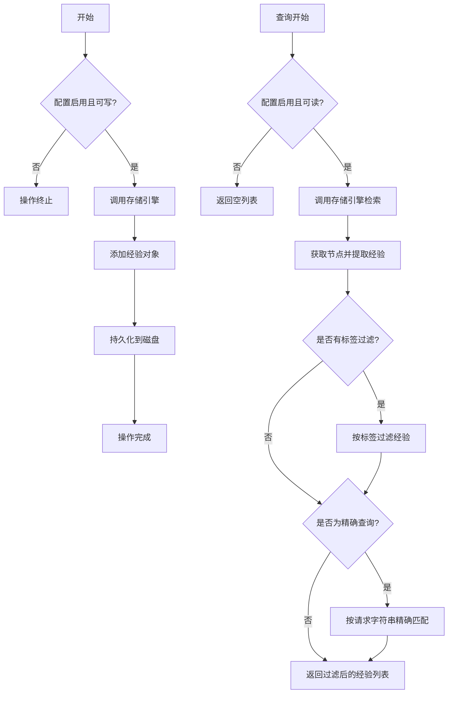

## 类结构

```
ExperienceManager (Pydantic BaseModel)
├── 字段: config, _storage
├── 属性: storage, is_readable, is_writable
├── 方法: create_exp, create_exps, query_exps, delete_all_exps, get_exps_count
└── 私有方法: _resolve_storage, _create_bm25_storage, _create_chroma_storage, _get_ranker_configs
```

## 全局变量及字段


### `_exp_manager`
    
全局单例的ExperienceManager实例，用于管理经验池的存储和检索。

类型：`ExperienceManager | None`
    


### `ExperienceManager.config`
    
经验管理器的配置对象，包含经验池的启用状态、读写权限、持久化路径等设置。

类型：`Config`
    


### `ExperienceManager._storage`
    
存储引擎的私有实例，用于实际处理经验的存储、检索和持久化操作，支持懒加载。

类型：`Any | SimpleEngine`
    
    

## 全局函数及方法

### `get_exp_manager`

这是一个全局函数，用于获取或创建 `ExperienceManager` 的单例实例。它实现了简单的单例模式，确保在整个应用程序中只有一个 `ExperienceManager` 实例被创建和使用。

参数：
- 无

返回值：`ExperienceManager`，返回全局唯一的 `ExperienceManager` 实例。

#### 流程图

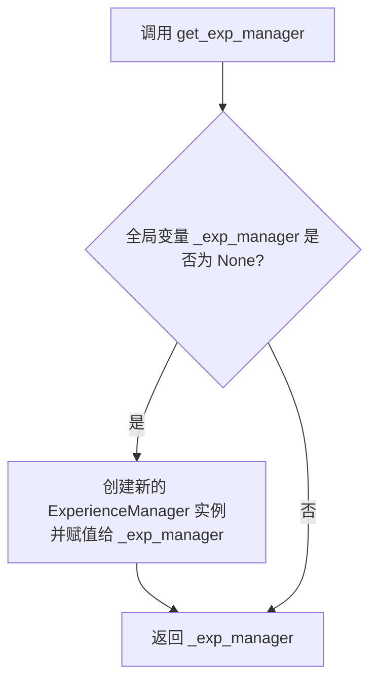

#### 带注释源码

```python
# 定义一个全局变量，用于存储 ExperienceManager 的单例实例
_exp_manager = None

def get_exp_manager() -> ExperienceManager:
    # 声明使用全局变量 _exp_manager
    global _exp_manager
    # 检查单例实例是否已经存在
    if _exp_manager is None:
        # 如果不存在，则创建一个新的 ExperienceManager 实例
        _exp_manager = ExperienceManager()
    # 返回（可能是新创建的）单例实例
    return _exp_manager
```

### `ExperienceManager.storage`

这是一个属性访问器（property getter），用于获取 `ExperienceManager` 实例的存储引擎。它实现了惰性初始化模式：当 `_storage` 私有字段为 `None` 时，它会根据配置动态创建并初始化相应的存储引擎（如 BM25 或 Chroma）。这确保了存储引擎只在首次被访问时才被创建，从而优化了启动性能。

参数：
-  `self`：`ExperienceManager`，`ExperienceManager` 类的当前实例。

返回值：`SimpleEngine`，一个用于处理经验存储和检索的简单引擎实例。

#### 流程图

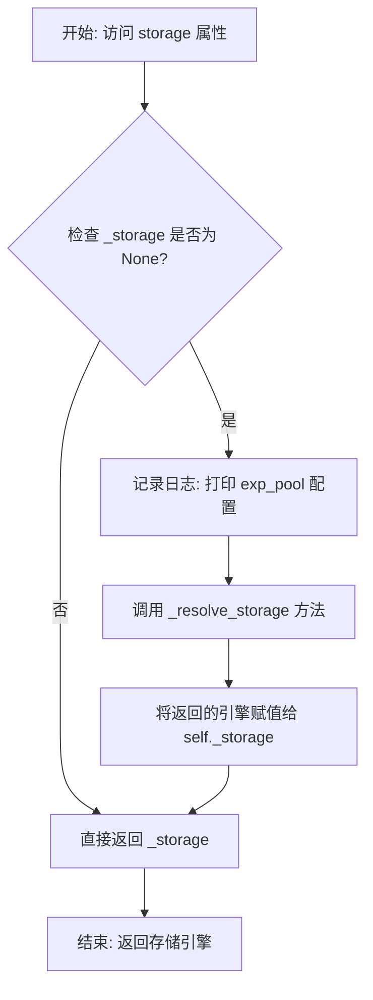

#### 带注释源码

```python
@property
def storage(self) -> "SimpleEngine":
    # 检查私有存储字段是否已初始化
    if self._storage is None:
        # 如果未初始化，记录当前的经验池配置
        logger.info(f"exp_pool config: {self.config.exp_pool}")

        # 调用内部方法，根据配置解析并创建相应的存储引擎
        self._storage = self._resolve_storage()

    # 返回已初始化的存储引擎
    return self._storage
```

### `ExperienceManager.is_readable`

这是一个属性（property），用于检查经验池（Experience Pool）当前是否处于可读取状态。它通过检查配置中的两个布尔标志来决定：经验池是否全局启用（`enabled`）以及是否启用了读取功能（`enable_read`）。只有当两者都为 `True` 时，该属性才返回 `True`。

参数：
-  `self`：`ExperienceManager`，`ExperienceManager` 类的实例。

返回值：`bool`，表示经验池是否可读。`True` 表示可读，`False` 表示不可读。

#### 流程图

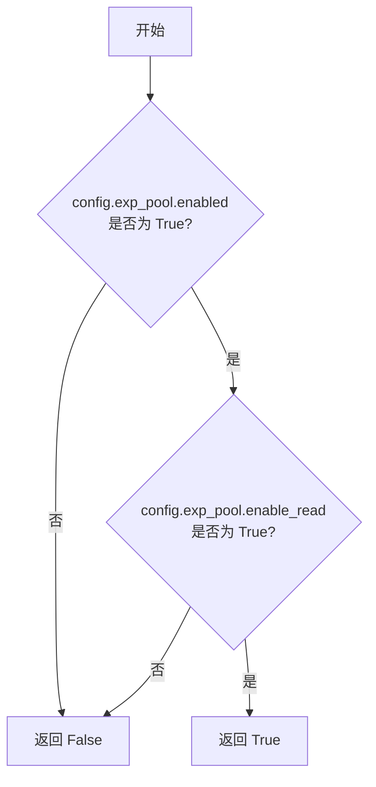

#### 带注释源码

```python
    @property
    def is_readable(self) -> bool:
        # 返回一个布尔值，表示经验池是否可读。
        # 可读的条件是：经验池功能全局启用（enabled）且启用了读取功能（enable_read）。
        return self.config.exp_pool.enabled and self.config.exp_pool.enable_read
```

### `ExperienceManager.is_writable`

`ExperienceManager.is_writable` 是一个属性（property），用于判断当前经验管理器是否处于可写入状态。它通过检查配置中的 `exp_pool.enabled` 和 `exp_pool.enable_write` 两个标志位，返回一个布尔值，指示是否允许向经验池中添加新的经验。

参数：

- 无显式参数。作为属性，其值由类实例的内部状态决定。

返回值：`bool`，如果经验池功能已启用且允许写入，则返回 `True`；否则返回 `False`。

#### 流程图

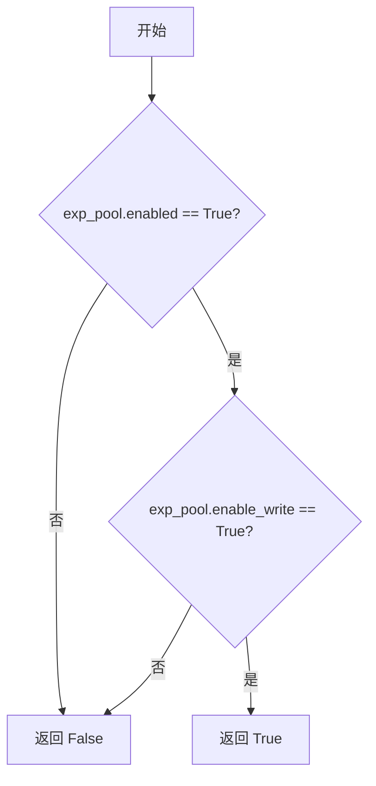

#### 带注释源码

```python
    @property
    def is_writable(self) -> bool:
        # 返回一个布尔值，表示经验池是否可写入。
        # 只有当经验池功能全局启用（enabled）且明确允许写入（enable_write）时，才返回True。
        return self.config.exp_pool.enabled and self.config.exp_pool.enable_write
```

### `ExperienceManager.create_exp`

该方法用于向经验存储中添加一条新的经验记录。它会检查写入功能是否启用，如果启用，则将传入的经验对象添加到存储引擎中，并持久化保存。

参数：

- `exp`：`Experience`，要添加的经验对象。

返回值：`None`，无返回值。

#### 流程图

```mermaid
flowchart TD
    A[开始: create_exp(exp)] --> B{is_writable?}
    B -- 否 --> C[结束: 直接返回]
    B -- 是 --> D[调用 create_exps([exp])]
    D --> E[结束]
```

#### 带注释源码

```python
@handle_exception  # 装饰器：统一处理该方法可能抛出的异常
def create_exp(self, exp: Experience):
    """Adds an experience to the storage if writing is enabled.

    Args:
        exp (Experience): The experience to add.
    """

    self.create_exps([exp])  # 将单个经验对象包装成列表，调用批量创建方法
```

### `ExperienceManager.create_exps`

该方法用于向经验存储中添加多个经验条目。它会检查写入功能是否启用，如果启用，则将提供的经验列表添加到存储引擎中，并持久化到配置的路径。

参数：

- `exps`：`list[Experience]`，一个包含要添加的经验对象的列表。

返回值：`None`，该方法不返回任何值。

#### 流程图

```mermaid
flowchart TD
    A[开始: create_exps] --> B{is_writable?}
    B -->|否| C[直接返回]
    B -->|是| D[调用 storage.add_objs(exps)]
    D --> E[调用 storage.persist]
    E --> F[结束]
```

#### 带注释源码

```python
@handle_exception
def create_exps(self, exps: list[Experience]):
    """Adds multiple experiences to the storage if writing is enabled.

    Args:
        exps (list[Experience]): A list of experiences to add.
    """
    # 检查写入功能是否启用，如果未启用则直接返回，不执行任何操作
    if not self.is_writable:
        return

    # 调用存储引擎的 add_objs 方法，将经验列表添加到存储中
    self.storage.add_objs(exps)
    # 调用存储引擎的 persist 方法，将数据持久化到配置的路径
    self.storage.persist(self.config.exp_pool.persist_path)
```

### `ExperienceManager.query_exps`

该方法用于根据查询请求、标签和查询类型，从经验存储中检索并过滤相关的经验记录。它首先检查经验池是否可读，然后通过存储引擎进行异步检索，最后根据标签和查询类型对结果进行过滤。

参数：

- `req`：`str`，查询字符串，用于检索相关经验。
- `tag`：`str`，可选标签，用于过滤经验记录。
- `query_type`：`QueryType`，查询类型，默认为语义匹配（`QueryType.SEMANTIC`），可选精确匹配（`QueryType.EXACT`）。

返回值：`list[Experience]`，匹配查询条件的经验记录列表。

#### 流程图

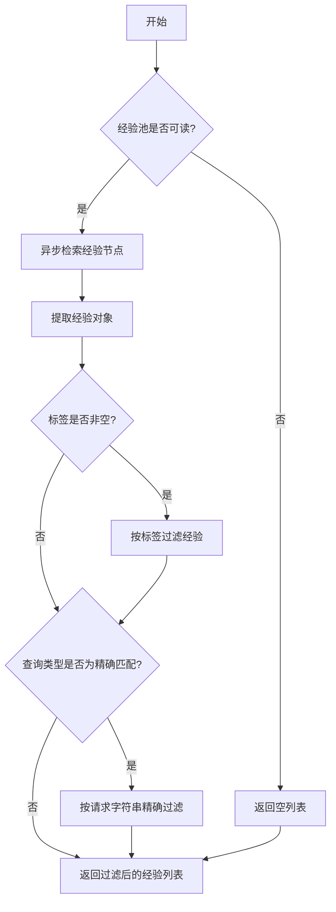

#### 带注释源码

```python
@handle_exception(default_return=[])
async def query_exps(self, req: str, tag: str = "", query_type: QueryType = QueryType.SEMANTIC) -> list[Experience]:
    """Retrieves and filters experiences.

    Args:
        req (str): The query string to retrieve experiences.
        tag (str): Optional tag to filter the experiences by.
        query_type (QueryType): Default semantic to vector matching. exact to same matching.

    Returns:
        list[Experience]: A list of experiences that match the args.
    """

    # 检查经验池是否可读，如果不可读则直接返回空列表
    if not self.is_readable:
        return []

    # 通过存储引擎异步检索与查询字符串相关的节点
    nodes = await self.storage.aretrieve(req)
    # 从节点元数据中提取经验对象
    exps: list[Experience] = [node.metadata["obj"] for node in nodes]

    # TODO: 根据元数据进行过滤（当前未实现）
    # 如果提供了标签，则根据标签过滤经验记录
    if tag:
        exps = [exp for exp in exps if exp.tag == tag]

    # 如果查询类型为精确匹配，则根据请求字符串进行精确过滤
    if query_type == QueryType.EXACT:
        exps = [exp for exp in exps if exp.req == req]

    # 返回过滤后的经验记录列表
    return exps
```

### `ExperienceManager.delete_all_exps`

该方法用于删除经验池中的所有经验数据。它会检查写入权限，如果允许写入，则调用底层存储引擎的 `clear` 方法清空所有数据。

参数：
- 无

返回值：`None`，无返回值

#### 流程图

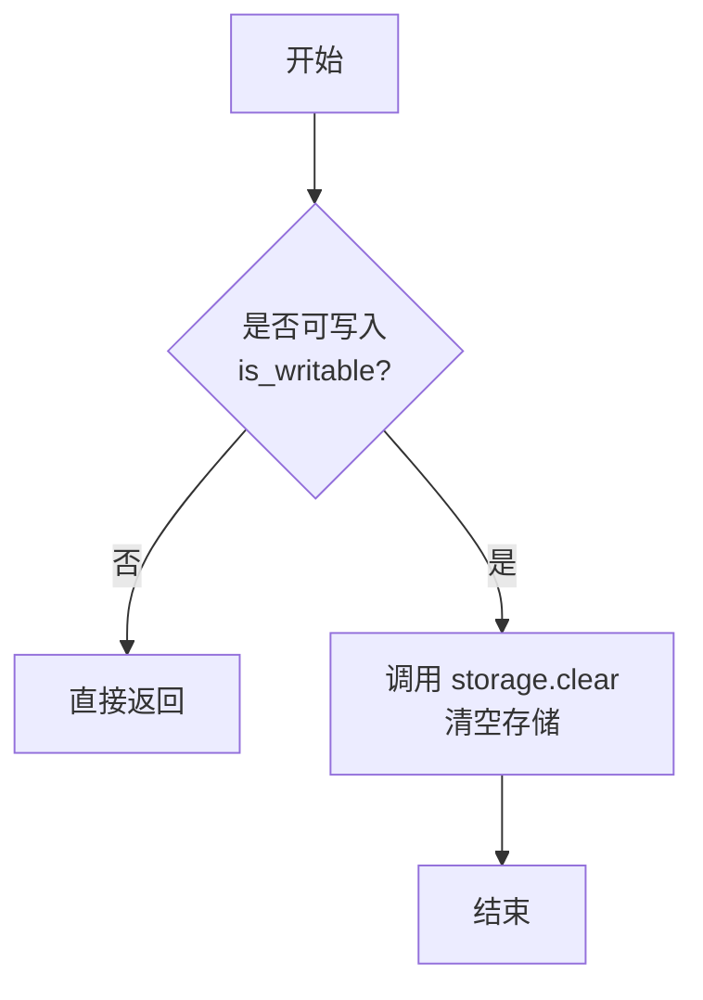

#### 带注释源码

```python
@handle_exception
def delete_all_exps(self):
    """Delete the all experiences."""

    # 检查当前配置是否允许写入操作
    if not self.is_writable:
        return

    # 调用底层存储引擎的 clear 方法，并传入持久化路径
    self.storage.clear(persist_dir=self.config.exp_pool.persist_path)
```


### `ExperienceManager.get_exps_count`

该方法用于获取当前经验池中存储的经验（Experience）总数。它通过调用底层存储引擎的 `count` 方法来实现。

参数：
- 无

返回值：`int`，返回存储的经验总数。

#### 流程图

```mermaid
flowchart TD
    A[开始] --> B{调用 storage.count() }
    B --> C[返回经验总数]
    C --> D[结束]
```

#### 带注释源码

```python
def get_exps_count(self) -> int:
    """Get the total number of experiences."""

    # 调用底层存储引擎（如 SimpleEngine）的 count 方法
    # 该方法负责统计存储中的所有经验对象数量
    return self.storage.count()
```


### `ExperienceManager._resolve_storage`

该方法根据配置的检索类型，选择并创建相应的存储引擎（BM25或Chroma）。它是一个工厂方法，用于延迟初始化`_storage`属性。

参数：
-  `self`：`ExperienceManager`，当前`ExperienceManager`实例。

返回值：`SimpleEngine`，一个配置好的`SimpleEngine`存储引擎实例。

#### 流程图

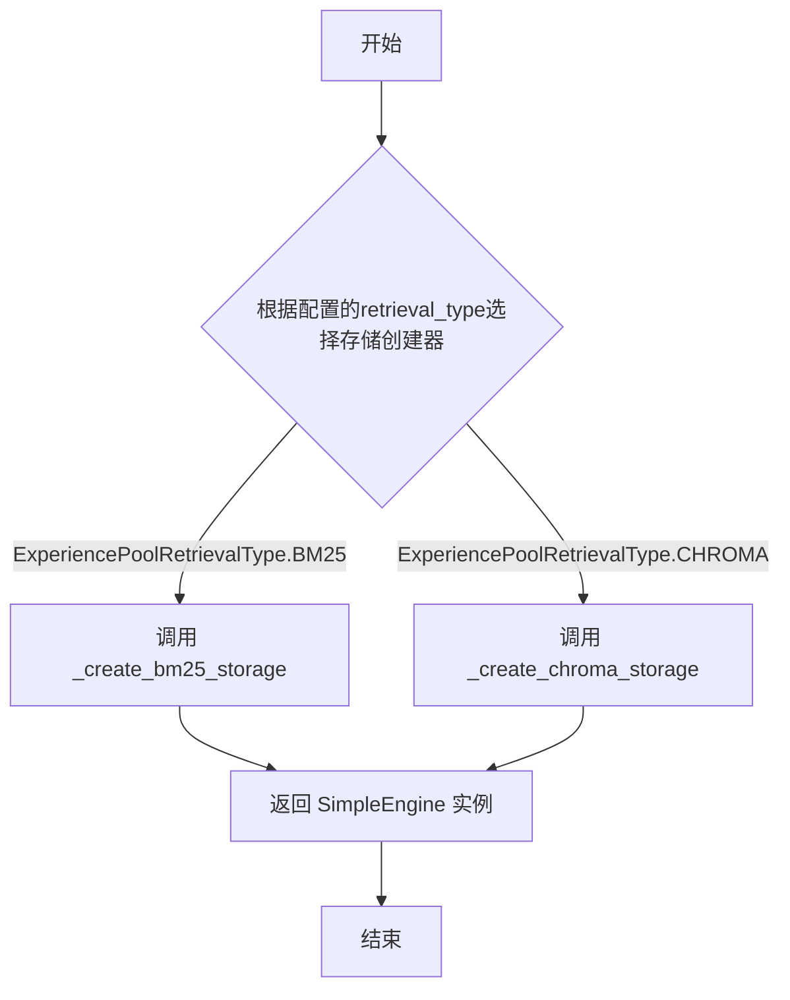

#### 带注释源码

```python
def _resolve_storage(self) -> "SimpleEngine":
    """Selects the appropriate storage creation method based on the configured retrieval type."""

    # 定义一个字典，将配置的检索类型映射到对应的创建方法
    storage_creators = {
        ExperiencePoolRetrievalType.BM25: self._create_bm25_storage,
        ExperiencePoolRetrievalType.CHROMA: self._create_chroma_storage,
    }

    # 根据配置的检索类型，调用对应的创建方法并返回结果
    return storage_creators[self.config.exp_pool.retrieval_type]()
```

### `ExperienceManager._create_bm25_storage`

该方法根据配置创建或加载一个基于BM25算法的检索存储引擎（SimpleEngine）。它首先检查持久化路径下的文档存储文件是否存在。如果不存在，则创建一个新的BM25存储并初始化一个默认的经验条目；如果存在，则从该路径加载现有的BM25索引。方法还集成了可选的LLM排序器配置。

参数：
-  `self`：`ExperienceManager`，当前ExperienceManager实例的引用。

返回值：`SimpleEngine`，一个配置了BM25检索器和可选排序器的简单RAG引擎实例。

#### 流程图

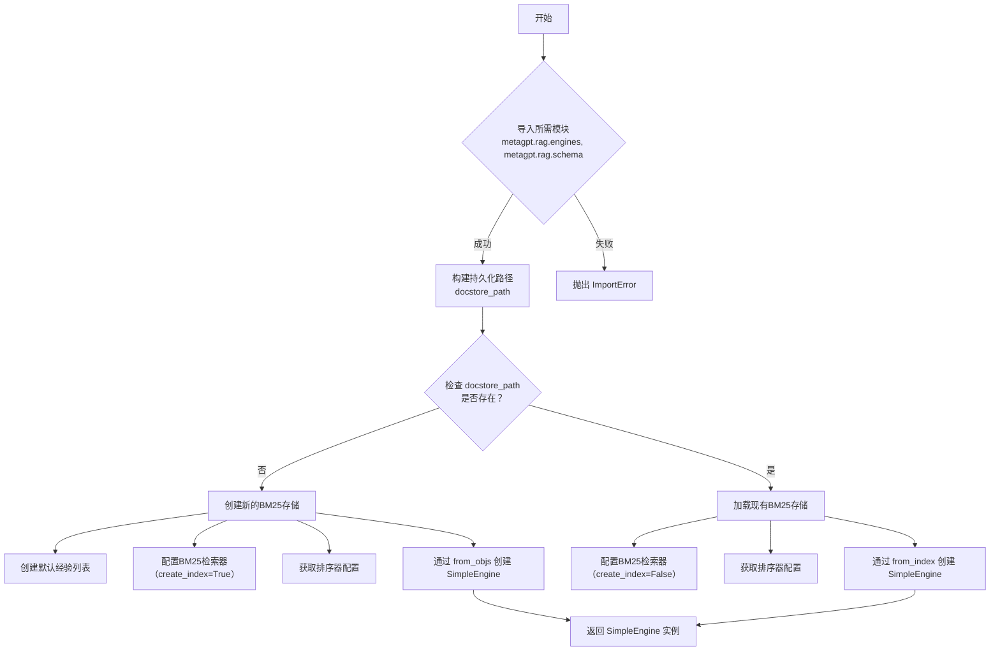

#### 带注释源码

```python
def _create_bm25_storage(self) -> "SimpleEngine":
    """Creates or loads BM25 storage.

    This function attempts to create a new BM25 storage if the specified
    document store path does not exist. If the path exists, it loads the
    existing BM25 storage.

    Returns:
        SimpleEngine: An instance of SimpleEngine configured with BM25 storage.

    Raises:
        ImportError: If required modules are not installed.
    """

    # 1. 尝试导入必要的RAG模块，如果失败则抛出ImportError。
    try:
        from metagpt.rag.engines import SimpleEngine
        from metagpt.rag.schema import BM25IndexConfig, BM25RetrieverConfig
    except ImportError:
        raise ImportError("To use the experience pool, you need to install the rag module.")

    # 2. 根据配置构建持久化路径和文档存储文件的具体路径。
    persist_path = Path(self.config.exp_pool.persist_path)
    docstore_path = persist_path / "docstore.json"

    # 3. 获取排序器（Ranker）的配置（例如是否使用LLM进行重排序）。
    ranker_configs = self._get_ranker_configs()

    # 4. 判断文档存储文件是否存在，以决定是创建新存储还是加载现有存储。
    if not docstore_path.exists():
        # 4.1 路径不存在：创建新的BM25存储。
        logger.debug(f"Path `{docstore_path}` not exists, try to create a new bm25 storage.")
        # 4.1.1 创建一个默认的经验对象列表用于初始化索引。
        exps = [Experience(req="req", resp="resp")]

        # 4.1.2 配置BM25检索器，设置 create_index=True 以在添加对象时创建索引。
        retriever_configs = [BM25RetrieverConfig(create_index=True, similarity_top_k=DEFAULT_SIMILARITY_TOP_K)]

        # 4.1.3 使用经验对象、检索器配置和排序器配置创建SimpleEngine实例。
        storage = SimpleEngine.from_objs(
            objs=exps, retriever_configs=retriever_configs, ranker_configs=ranker_configs
        )
        return storage

    # 4.2 路径存在：加载现有的BM25存储。
    logger.debug(f"Path `{docstore_path}` exists, try to load bm25 storage.")
    # 4.2.1 配置BM25检索器，此时不需要创建索引（create_index默认为False）。
    retriever_configs = [BM25RetrieverConfig(similarity_top_k=DEFAULT_SIMILARITY_TOP_K)]
    # 4.2.2 通过指定索引配置（BM25IndexConfig）来从持久化路径加载索引，并创建SimpleEngine。
    storage = SimpleEngine.from_index(
        BM25IndexConfig(persist_path=persist_path),
        retriever_configs=retriever_configs,
        ranker_configs=ranker_configs,
    )

    # 5. 返回创建或加载的SimpleEngine实例。
    return storage
```

### `ExperienceManager._create_chroma_storage`

该方法根据配置创建并返回一个基于 Chroma 向量数据库的 `SimpleEngine` 存储引擎实例，用于经验的存储和检索。

参数：
-  `self`：`ExperienceManager`，`ExperienceManager` 类的实例。

返回值：`SimpleEngine`，一个配置了 Chroma 向量存储检索器和可选 LLM 排序器的 RAG 引擎实例。

#### 流程图

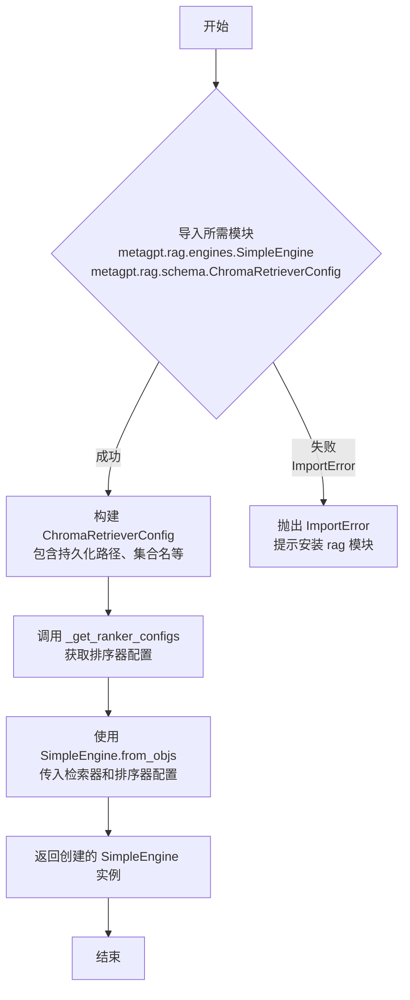

#### 带注释源码

```python
def _create_chroma_storage(self) -> "SimpleEngine":
    """Creates Chroma storage.

    Returns:
        SimpleEngine: An instance of SimpleEngine configured with Chroma storage.

    Raises:
        ImportError: If required modules are not installed.
    """

    # 尝试导入创建 Chroma 存储引擎所必需的模块
    try:
        from metagpt.rag.engines import SimpleEngine
        from metagpt.rag.schema import ChromaRetrieverConfig
    except ImportError:
        # 如果导入失败，抛出异常，提示用户需要安装 `rag` 模块
        raise ImportError("To use the experience pool, you need to install the rag module.")

    # 根据配置构建 Chroma 检索器的配置列表
    # 配置包含持久化路径、集合名称和相似性检索的 top_k 参数
    retriever_configs = [
        ChromaRetrieverConfig(
            persist_path=self.config.exp_pool.persist_path,
            collection_name=self.config.exp_pool.collection_name,
            similarity_top_k=DEFAULT_SIMILARITY_TOP_K,
        )
    ]
    # 调用内部方法获取排序器（ranker）的配置，例如是否启用 LLM 排序器
    ranker_configs = self._get_ranker_configs()

    # 使用 SimpleEngine 的类方法 `from_objs` 创建一个引擎实例
    # 此方法通常用于初始化一个空的引擎，并配置其检索和排序组件
    storage = SimpleEngine.from_objs(retriever_configs=retriever_configs, ranker_configs=ranker_configs)

    # 返回创建好的存储引擎实例
    return storage
```

### `ExperienceManager._get_ranker_configs`

该方法根据配置决定是否返回一个LLM排序器的配置列表。如果配置中启用了LLM排序器（`use_llm_ranker`），则返回一个包含`LLMRankerConfig`实例的列表；否则返回一个空列表。

参数：
- 无显式参数。该方法依赖于`self.config.exp_pool.use_llm_ranker`这个实例属性。

返回值：`list`，一个包含`LLMRankerConfig`实例的列表或一个空列表。

#### 流程图

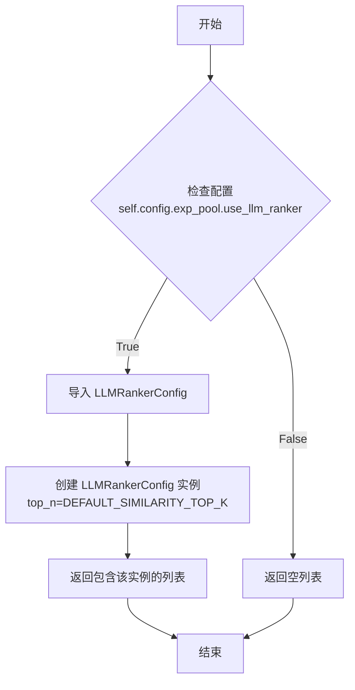

#### 带注释源码

```python
def _get_ranker_configs(self):
    """Returns ranker configurations based on the configuration.

    If `use_llm_ranker` is True, returns a list with one `LLMRankerConfig`
    instance. Otherwise, returns an empty list.

    Returns:
        list: A list of `LLMRankerConfig` instances or an empty list.
    """
    # 从rag.schema模块导入LLMRankerConfig类
    from metagpt.rag.schema import LLMRankerConfig

    # 根据配置项`self.config.exp_pool.use_llm_ranker`的值决定返回值
    # 如果为True，创建一个包含一个LLMRankerConfig实例的列表，其top_n参数使用默认值
    # 如果为False，返回一个空列表
    return [LLMRankerConfig(top_n=DEFAULT_SIMILARITY_TOP_K)] if self.config.exp_pool.use_llm_ranker else []
```

## 关键组件


### ExperienceManager

管理经验（Experience）生命周期的核心类，负责经验的创建、查询、删除和存储引擎的初始化与切换。

### 经验存储与检索引擎（SimpleEngine）

用于实际存储和检索经验对象的底层引擎，支持基于BM25和Chroma的向量化存储与语义检索。

### 经验对象（Experience）

表示单条经验的数据结构，包含请求（req）、响应（resp）和标签（tag）等核心信息。

### 配置驱动（Config.exp_pool）

通过配置对象（Config）中的`exp_pool`字段，集中管理经验池的启用状态、读写权限、持久化路径、检索类型（BM25/Chroma）等所有运行时参数。

### 惰性初始化与单例模式

`ExperienceManager`的存储引擎（`_storage`）采用惰性初始化策略，仅在首次访问时根据配置创建。全局函数`get_exp_manager()`提供了对`ExperienceManager`实例的单例访问入口。

### 异常处理装饰器（@handle_exception）

应用于关键方法（如`create_exp`, `query_exps`），提供统一的异常捕获和处理逻辑，增强代码的健壮性。

### 查询类型（QueryType）

定义了经验检索的两种模式：`SEMANTIC`（基于向量相似度的语义匹配）和`EXACT`（基于请求字符串的精确匹配），支持灵活的查询需求。


## 问题及建议


### 已知问题

-   **延迟初始化与线程安全**：`_storage` 属性通过 `@property` 装饰器进行延迟初始化。在多线程或异步环境下，多个线程可能同时检查 `self._storage is None` 并触发多次初始化，可能导致资源浪费或竞态条件。虽然 `SimpleEngine` 的初始化可能具有幂等性，但这不是一个线程安全的模式。
-   **全局单例的潜在风险**：模块级别的 `_exp_manager` 全局变量和 `get_exp_manager()` 函数实现了一个简单的单例模式。在多模块导入或复杂应用场景下，这种模式可能难以管理其生命周期和配置，并且不利于依赖注入和单元测试。
-   **异常处理可能掩盖错误**：所有公开的 CRUD 方法（`create_exp`, `create_exps`, `query_exps`, `delete_all_exps`）都使用了 `@handle_exception` 装饰器。虽然这能防止未捕获的异常导致程序崩溃，但如果装饰器配置为静默失败（例如 `default_return=[]`），可能会使调用方难以感知底层操作（如存储连接失败、查询语法错误）的真实失败原因，不利于调试和监控。
-   **配置与状态耦合**：`is_readable` 和 `is_writable` 的 setter 方法会直接修改底层的 `config.exp_pool.enable_read/write` 以及 `enabled` 属性。这模糊了“运行时状态”和“持久化配置”的边界。直接修改配置对象可能会产生意外的副作用，例如影响其他依赖同一配置的组件，或者使得配置的持久化变得复杂。
-   **硬编码的存储创建器映射**：`_resolve_storage` 方法中的 `storage_creators` 字典是硬编码的。如果未来需要支持新的 `ExperiencePoolRetrievalType`（如 `FAISS`, `WEAVIATE`），必须修改 `ExperienceManager` 类的代码，违反了开闭原则。
-   **BM25 存储初始化逻辑存在瑕疵**：在 `_create_bm25_storage` 方法中，当 `docstore_path` 不存在时，会创建一个包含默认 `Experience(req="req", resp="resp")` 的存储引擎。这个默认经验条目可能没有实际业务意义，且会作为“种子数据”被持久化，可能干扰后续的查询结果（尽管影响可能很小）。更合理的做法是创建一个完全空的存储。

### 优化建议

-   **实现线程安全的延迟初始化**：可以使用 `threading.Lock` 或 `asyncio.Lock` 来保护 `_storage` 的初始化过程，确保在多线程/异步环境下只执行一次。或者，考虑在 `__init__` 方法中根据配置直接初始化 `_storage`，避免延迟初始化带来的复杂性。
-   **重构单例模式为依赖注入**：建议移除全局的 `_exp_manager` 和 `get_exp_manager()` 函数。改为在应用层（如工厂类或主程序入口）显式创建 `ExperienceManager` 实例，并通过构造函数参数将其传递给需要的组件。这提高了代码的可测试性和模块化程度。
-   **细化异常处理策略**：重新评估 `@handle_exception` 装饰器的使用。对于 `create_exp` 和 `delete_all_exps` 等写操作，失败应该被明确抛出，以便调用方可以采取补救措施。对于 `query_exps`，可以返回空列表，但建议同时记录警告日志，以便运维人员发现问题。可以考虑定义业务相关的自定义异常（如 `ExperienceStorageError`, `ExperienceQueryError`）。
-   **解耦状态与配置**：将 `is_readable` 和 `is_writable` 改为纯粹的实例属性，不再直接修改 `config` 对象。可以在 `__init__` 方法中根据 `config` 初始化这两个属性，并提供独立的方法来更新它们。这样，配置对象保持 immutable，状态管理更清晰。
-   **使用策略模式管理存储创建**：将 `_create_bm25_storage` 和 `_create_chroma_storage` 等方法提取为独立的工厂类或函数，并通过注册机制动态添加到 `_resolve_storage` 中。这样，新的存储类型可以通过扩展点添加，而无需修改 `ExperienceManager` 的核心逻辑。
-   **优化 BM25 存储创建逻辑**：在 `_create_bm25_storage` 中，当路径不存在时，应创建一个空的 `SimpleEngine`，而不是包含默认条目的引擎。检查 `SimpleEngine` 是否支持从空对象列表创建索引。如果不支持，则需要一个更优雅的初始化路径。
-   **增加类型注解完整性**：`_storage` 字段的类型为 `Any`，降低了代码的静态类型检查价值。应尽可能使用 `"SimpleEngine"` 字符串注解或导入 `TYPE_CHECKING` 下的实际类型来改善。
-   **考虑添加持久化触发策略**：`create_exps` 方法在每次添加后都调用 `self.storage.persist`。对于高频写入场景，这可能导致性能问题。可以考虑引入批处理、异步持久化或基于时间的自动持久化策略。


## 其它


### 设计目标与约束

1.  **核心目标**：提供一个统一、可配置的接口，用于管理“经验”（Experience）对象的全生命周期，包括创建、查询、删除和持久化，并支持基于语义（向量）和关键词（BM25）的检索。
2.  **关键约束**：
    *   **可插拔存储**：必须支持多种底层存储/检索后端（如Chroma向量数据库、BM25文档检索），且通过配置可切换。
    *   **读写控制**：必须提供细粒度的读写开关（`enable_read`/`enable_write`），并允许全局启用/禁用（`enabled`）。
    *   **延迟初始化**：存储引擎（`_storage`）应实现懒加载，仅在首次访问时根据配置初始化，以优化启动性能。
    *   **异常隔离**：核心业务方法（CRUD）应通过装饰器进行统一的异常处理，防止内部异常直接向上层传播。
    *   **单例模式**：通过全局函数 `get_exp_manager()` 提供全局唯一的 `ExperienceManager` 实例，确保配置和状态的一致性。

### 错误处理与异常设计

1.  **异常处理策略**：
    *   使用 `@handle_exception` 装饰器包裹 `create_exp`, `create_exps`, `query_exps`, `delete_all_exps` 方法。该装饰器负责捕获方法执行过程中的异常，并根据配置进行日志记录、返回默认值（如空列表）或静默处理，保证管理器操作的鲁棒性。
    *   在 `_create_bm25_storage` 和 `_create_chroma_storage` 方法中，对可选依赖（`metagpt.rag`模块）进行 `try...except ImportError` 检查，并提供明确的错误提示。
2.  **错误场景**：
    *   **存储初始化失败**：如路径不可写、依赖缺失、配置错误等，通过装饰器或显式 `ImportError` 处理。
    *   **无效操作**：在禁用写入时尝试创建或删除经验，方法会提前返回，不执行操作。
    *   **查询无结果**：返回空列表，不视为错误。
    *   **配置不一致**：例如设置 `is_readable=True` 会自动将 `enabled` 设为 `True`，逻辑内嵌在 `setter` 中。

### 数据流与状态机

1.  **主要数据流**：
    *   **写入流**：`Experience` 对象列表 -> `create_exps` -> `storage.add_objs` -> 向量化/索引化 -> 持久化到磁盘（`persist_path`）。
    *   **读取流**：查询字符串 `req` (及可选 `tag`, `query_type`) -> `query_exps` -> `storage.aretrieve` -> 检索结果 `nodes` -> 提取 `Experience` 对象 -> 根据 `tag` 和 `query_type` 过滤 -> 返回列表。
    *   **删除流**：`delete_all_exps` -> `storage.clear` -> 清空底层存储和持久化文件。
2.  **关键状态**：
    *   **管理器状态**：由 `config.exp_pool` 下的 `enabled`, `enable_read`, `enable_write` 共同决定，通过 `is_readable` 和 `is_writable` 属性暴露。这是一个简单的布尔状态，控制所有CRUD操作的门槛。
    *   **存储引擎状态**：`_storage` 属性。初始为 `None`，首次通过 `storage` 属性访问时，根据 `config.exp_pool.retrieval_type` 初始化并缓存。这是一个“未初始化/已初始化”的状态。

### 外部依赖与接口契约

1.  **外部依赖**：
    *   **`metagpt.rag` 模块**：核心依赖，提供 `SimpleEngine` 以及 `BM25RetrieverConfig`, `ChromaRetrieverConfig`, `LLMRankerConfig` 等配置类。此依赖为可选，仅在配置使用相应功能时需确保安装。
    *   **`pydantic`**：用于 `BaseModel` 基类和数据验证。
    *   **`pathlib`**：用于路径操作。
2.  **接口契约**：
    *   **`Experience` 类**：作为核心数据载体，必须包含 `req`, `resp`, `tag` 等字段，且能作为元数据嵌入 `SimpleEngine` 的 `Node` 中。
    *   **`SimpleEngine` 接口**：`ExperienceManager` 依赖其提供 `add_objs`, `aretrieve`, `persist`, `clear`, `count` 等方法。这是管理器与底层检索实现之间的关键抽象层。
    *   **`Config` 对象**：必须包含 `exp_pool` 属性，其结构需满足 `ExperiencePoolConfig` 的定义，提供持久化路径、检索类型、集合名、LLM排序器等配置项。

### 配置管理

1.  **配置结构**：所有行为由 `config` 字段（`Config` 类型）驱动，具体是其中的 `exp_pool` 配置节。关键配置项包括：
    *   `enabled`：总开关。
    *   `enable_read`/`enable_write`：读写细粒度开关。
    *   `retrieval_type`：决定使用 `BM25` 还是 `CHROMA` 存储引擎。
    *   `persist_path`：持久化文件/目录路径。
    *   `collection_name`：Chroma存储的集合名。
    *   `use_llm_ranker`：是否启用LLM对检索结果重排序。
2.  **配置加载**：默认通过 `Config.default()` 工厂方法加载。配置直接影响 `_resolve_storage()` 方法的选择和存储引擎的初始化参数。

### 并发与线程安全

1.  **当前设计**：代码未显式处理并发。`@handle_exception` 装饰器不提供线程同步。
2.  **潜在风险**：
    *   **懒加载竞争**：在多线程环境下首次并发访问 `storage` 属性可能导致 `_storage` 被多次初始化（尽管Python GIL使这种情况在CPython中危害较小，但逻辑上不完美）。
    *   **状态不一致**：对 `is_readable`/`is_writable` 的 `setter` 操作非原子，但因其只是简单布尔赋值，风险较低。
    *   **存储操作**：底层 `SimpleEngine` 的并发安全性未知，如果其非线程安全，则多线程调用 `create_exps`、`query_exps` 可能导致数据损坏或异常。
3.  **建议**：若需用于多线程环境，应考虑在 `_storage` 懒加载处和关键状态修改处增加锁机制（如 `threading.Lock`）。

### 测试策略建议

1.  **单元测试**：
    *   测试 `is_readable`/`is_writable` 属性与 `config` 的联动逻辑。
    *   测试 `_resolve_storage` 在不同 `retrieval_type` 下的分支。
    *   使用Mock替换 `SimpleEngine`，测试 `create_exps`, `query_exps`, `delete_all_exps` 在读写启用/禁用时的行为，以及异常装饰器是否生效。
2.  **集成测试**：
    *   测试完整的CRUD流程，包括持久化与重新加载。
    *   分别测试BM25和Chroma两种存储后端的检索功能。
    *   测试包含`tag`过滤和`QueryType.EXACT`的查询场景。
3.  **依赖测试**：模拟 `ImportError`，测试在缺少`rag`模块时，相关存储创建方法是否按预期抛出错误。


    