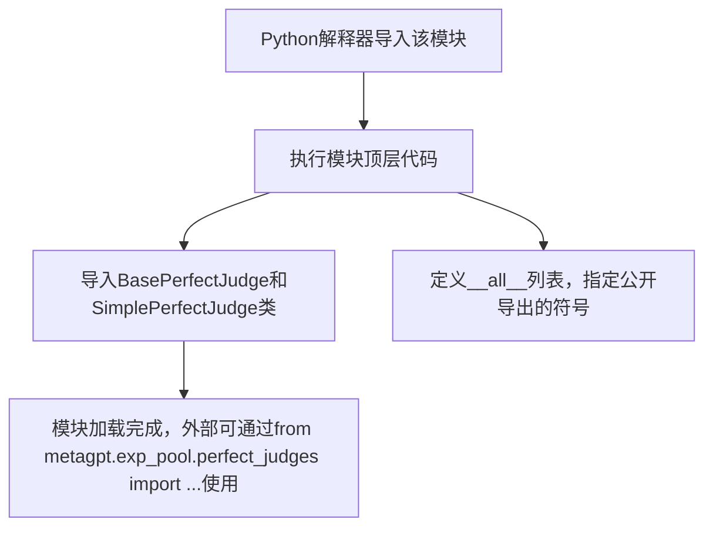

# `.\MetaGPT\metagpt\exp_pool\perfect_judges\__init__.py` 详细设计文档

该文件是metagpt.exp_pool.perfect_judges包的初始化模块，主要功能是导出完美评判器（Perfect Judge）相关的类，为外部提供一个统一的导入接口。它声明了从当前包及其子模块中公开导出的类，简化了外部代码的导入语句。

## 整体流程



## 类结构

```
metagpt.exp_pool.perfect_judges (Python包)
├── __init__.py (当前文件，包初始化模块)
├── base.py (包含BasePerfectJudge基类)
└── simple.py (包含SimplePerfectJudge具体实现类)
```

## 全局变量及字段


### `__all__`
    
一个字符串列表，用于定义模块的公共接口，指定了当使用 `from module import *` 时，哪些名称会被导出。

类型：`list[str]`
    


    

## 全局函数及方法


## 关键组件


### BasePerfectJudge

一个基础完美评判器类，定义了完美评判器的通用接口和行为规范。

### SimplePerfectJudge

一个简单的完美评判器实现，继承自基础评判器，提供了具体的评判逻辑。


## 问题及建议


### 已知问题

-   当前代码仅作为模块的初始化文件（`__init__.py`），其本身不包含任何可执行的业务逻辑、类定义或函数实现。因此，从该文件本身来看，不存在功能性的已知问题。

### 优化建议

-   **添加模块级文档字符串**：当前的模块文档字符串（`"""Perfect judges init."""`）过于简单。建议扩展此文档字符串，简要说明该模块（`metagpt.exp_pool.perfect_judges`）的职责、包含的主要组件（如`BasePerfectJudge`和`SimplePerfectJudge`）及其用途，以提高代码的可读性和可维护性。
-   **考虑使用动态导入**：如果未来该包下的子模块数量增加，手动维护`__all__`列表和导入语句可能会变得繁琐且容易出错。可以考虑使用动态扫描和导入的方式来自动化这个过程，但这需要权衡代码的清晰度和复杂性。
-   **验证导出项的可用性**：虽然当前代码导出了两个类，但建议在模块层面或通过单元测试确保这些导出的名称确实是可导入且可用的，防止因底层模块重构导致接口断裂。
-   **遵循项目导入规范**：检查并确保此处的导入方式（如使用相对导入还是绝对导入）与项目其他部分保持一致，以维持代码风格的一致性。


## 其它


### 设计目标与约束

本模块的设计目标是提供一个可扩展的“完美评判者”框架，用于在经验池中对智能体行为或结果进行高质量评估。其核心约束包括：1) 定义统一的评判接口（`BasePerfectJudge`），确保所有具体评判者实现行为一致性；2) 提供一个简单、可立即使用的默认实现（`SimplePerfectJudge`），以降低初始使用门槛；3) 通过`__all__`严格控制模块的公开接口，保持封装性，避免内部实现细节泄露。

### 错误处理与异常设计

当前代码主要为结构定义和导出，未包含具体的业务逻辑，因此显式的错误处理机制较少。潜在的错误处理设计应集中在具体的`BasePerfectJudge`子类中，例如：在`judge`方法中，对无效的输入数据应抛出`ValueError`或自定义的`JudgeError`异常；在资源初始化失败时，应抛出`RuntimeError`。本`__init__.py`文件本身应确保导入语句的健壮性，但当前未使用`try-except`包裹，依赖上层调用环境或Python的默认导入错误处理。

### 数据流与状态机

由于本模块是框架的入口定义文件，自身不处理具体的数据流或维护状态。数据流始于外部调用者导入并使用`BasePerfectJudge`或`SimplePerfectJudge`。状态管理完全由各个具体的`PerfectJudge`类实例负责。整体上，这是一个静态的、定义性的模块，数据流和状态变化发生在由此模块导出的类的实例方法被调用之后。

### 外部依赖与接口契约

1.  **外部依赖**：
    *   `metagpt.exp_pool.perfect_judges.base`：依赖`BasePerfectJudge`基类的定义。
    *   `metagpt.exp_pool.perfect_judges.simple`：依赖`SimplePerfectJudge`具体类的定义。
    *   任何使用本模块的代码，都隐含依赖上述两个子模块的正确实现。

2.  **接口契约**：
    *   **导出契约**：通过`__all__ = ["BasePerfectJudge", "SimplePerfectJudge"]`明确声明，本模块仅对外公开这两个类。这是对使用者的一个严格承诺。
    *   **继承契约**：`SimplePerfectJudge`必须遵循`BasePerfectJudge`定义的抽象接口（如`judge`方法），这是通过Python的继承机制保证的。
    *   **导入契约**：本模块假设其相对路径（`metagpt.exp_pool.perfect_judges`）在Python的模块搜索路径中是可访问的。

### 配置与可扩展性

1.  **配置**：当前模块无运行时配置。具体评判者的配置（如评分阈值、规则集）应在`SimplePerfectJudge`或其子类初始化时通过参数传入。
2.  **可扩展性**：扩展性通过面向对象设计实现。开发者可以：
    *   创建新的Python文件在`perfect_judges`目录下。
    *   定义新的类继承自`BasePerfectJudge`。
    *   实现基类要求的抽象方法。
    *   通过修改本`__init__.py`文件中的`__all__`列表来公开新的评判者类，但这并非强制要求，使用者也可以直接导入新模块。更佳实践是保持本文件仅导出核心基类和默认实现，新的扩展由各自的模块管理导出。

### 性能考量

作为纯粹的导入和再导出包装层，本`__init__.py`文件本身的性能开销极低，可忽略不计。性能关键点在于`BasePerfectJudge.judge()`方法及其在各个子类（如`SimplePerfectJudge`）中的实现效率。设计时应考虑评判逻辑的时间复杂度，避免在评判过程中进行耗时的I/O操作或复杂计算，或者提供异步接口以支持并发。

### 安全性与权限控制

当前代码不涉及具体的安全操作。安全考量应集成到具体的评判逻辑中，例如：如果评判过程涉及执行不可信的代码或访问敏感数据，则需要在具体的`PerfectJudge`子类中实现沙箱环境、输入消毒或基于角色的访问控制。模块层面应确保不会通过导入意外执行恶意代码。

### 测试策略

1.  **单元测试**：应针对`BasePerfectJudge`的接口契约编写测试，验证其子类（包括`SimplePerfectJudge`）是否正确实现了`judge`等方法。测试应覆盖正常输入、边界情况和异常输入。
2.  **集成测试**：测试本`__init__.py`文件是否能正确导出声明的类，并且这些类能够被外部模块正常导入和使用。
3.  **模拟（Mocking）**：在测试依赖于`PerfectJudge`的其他组件时，应使用Mock对象来模拟`BasePerfectJudge`的行为，以确保测试的独立性和可靠性。

### 部署与运维

本模块作为Python源码包的一部分进行部署，无特殊的部署要求。运维关注点可能包括：
*   **版本管理**：对`BasePerfectJudge`接口的修改（特别是破坏性变更）需要谨慎，并通过版本号（如SemVer）明确标识。
*   **监控与日志**：具体的`PerfectJudge`实现应在`judge`方法中添加详细的日志记录，以便在运维过程中追踪评判决策的过程和结果，辅助调试和审计。


    