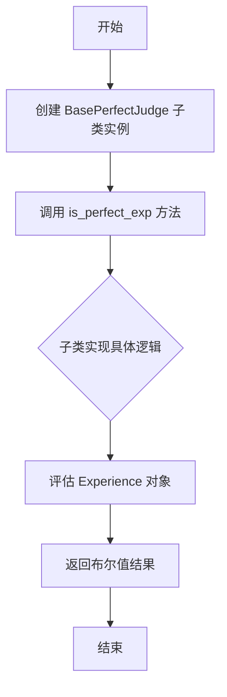
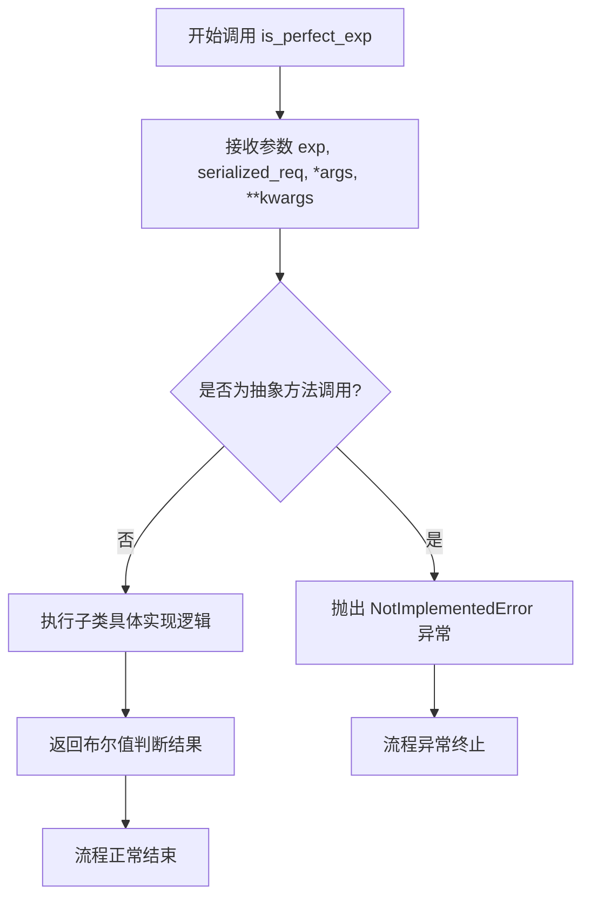

# `.\MetaGPT\metagpt\exp_pool\perfect_judges\base.py` 详细设计文档

该文件定义了一个名为 `BasePerfectJudge` 的抽象基类，它结合了 Pydantic 的数据验证能力和 Python 的抽象类机制。其核心功能是为判断一个给定的经验（`Experience`）是否“完美”提供一个标准化的接口和框架。具体的判断逻辑由继承该基类的子类实现。

## 整体流程



## 类结构

```
BasePerfectJudge (抽象基类，继承自 BaseModel 和 ABC)
└── [由具体子类继承并实现]
```

## 全局变量及字段


### `BasePerfectJudge.model_config`
    
Pydantic模型配置，允许任意类型以支持Experience等自定义类型作为字段。

类型：`pydantic.ConfigDict`
    
    

## 全局函数及方法


### `BasePerfectJudge.is_perfect_exp`

这是一个抽象方法，用于评估给定的经验（`Experience`）是否完美。其具体逻辑由继承 `BasePerfectJudge` 的子类实现。该方法旨在比较一个经验对象和一个序列化的请求字符串，以判断该经验是否满足“完美”的标准。

参数：

-  `exp`：`Experience`，需要被评估的经验对象。
-  `serialized_req`：`str`，用于与经验中的请求进行比较的序列化请求字符串。
-  `*args`：可变位置参数，用于接收额外的位置参数。
-  `**kwargs`：可变关键字参数，用于接收额外的关键字参数。

返回值：`bool`，返回 `True` 表示经验是完美的，返回 `False` 表示经验不完美。

#### 流程图



#### 带注释源码

```python
    @abstractmethod
    async def is_perfect_exp(self, exp: Experience, serialized_req: str, *args, **kwargs) -> bool:
        """Determine whether the experience is perfect.

        Args:
            exp (Experience): The experience to evaluate.
            serialized_req (str): The serialized request to compare against the experience's request.
        """
        # 这是一个抽象方法，没有具体的实现代码。
        # 具体的判断逻辑（例如，如何比较 `exp` 和 `serialized_req`，以及“完美”的定义）
        # 需要在继承 `BasePerfectJudge` 的子类中重写此方法并提供实现。
        # 方法被设计为异步（async），意味着实现中可能包含I/O操作（如网络请求、数据库查询）。
        # `*args` 和 `**kwargs` 提供了扩展性，允许子类实现接收额外的参数。
```


## 关键组件


### BasePerfectJudge

一个抽象基类，定义了判断一个经验（Experience）是否为“完美”的接口契约，要求子类实现具体的评估逻辑。

### Experience

一个数据模型类，代表待评估的经验对象，包含与请求相关的信息，是`is_perfect_exp`方法的核心输入参数之一。

### 序列化请求 (serialized_req)

一个字符串参数，代表序列化后的原始请求，用于与经验对象中的请求信息进行比较，以判断经验的完美程度。


## 问题及建议


### 已知问题

-   **抽象基类设计不完整**：`BasePerfectJudge` 类同时继承自 `pydantic.BaseModel` 和 `abc.ABC`，旨在定义一个接口。然而，`pydantic.BaseModel` 的 `__init__` 方法会阻止抽象基类的正常实例化检查，可能导致开发者能够意外地实例化这个本应是抽象接口的类，违反了设计意图。
-   **方法签名过于灵活**：`is_perfect_exp` 方法定义了 `*args` 和 `**kwargs` 参数，这虽然提供了灵活性，但也降低了接口的清晰度和类型安全性。调用者无法从方法签名明确知道可以传递哪些额外参数，增加了误用的风险，并使得子类实现和调用方都难以维护。
-   **依赖项不明确**：代码中从 `metagpt.exp_pool.schema` 导入了 `Experience` 类，但文档或类型提示中未说明该依赖的具体职责和结构。作为基础接口的一部分，其核心依赖应当有明确的定义或引入位置说明，否则会增加模块间的耦合理解成本。
-   **配置必要性存疑**：类中设置了 `model_config = ConfigDict(arbitrary_types_allowed=True)`。对于主要作为抽象接口定义的类，此配置（允许任意类型）的必要性不明确。如果并非所有子类都需要，它可能引入了不必要的宽松性，或在某些验证场景下导致非预期的行为。

### 优化建议

-   **重构继承关系以明确抽象类角色**：建议将 `BasePerfectJudge` 改为只继承 `abc.ABC`，或者使用 `typing.Protocol` 来定义一个纯接口。如果必须保留 Pydantic 模型的功能（例如用于序列化/反序列化），应考虑将其与抽象接口分离，例如使用组合而非继承，或者创建一个具体的配置基类。
-   **收紧方法签名，增强类型安全**：应尽可能将 `is_perfect_exp` 方法所需的参数明确化，移除 `*args` 和 `**kwargs`，代之以具体的命名参数。如果确实需要扩展性，可以定义一个特定的 `Context` 或 `Config` 数据类作为参数，以提高可读性和可维护性。
-   **明确并管理外部依赖**：应在模块级或类文档字符串中简要说明 `Experience` 类的职责和预期结构。考虑是否可以将此接口与 `Experience` 的具体实现解耦，例如通过定义一个本地的 `ExperienceLike` 协议或抽象基类，从而减少对特定外部模块的直接依赖。
-   **审查并明确 Pydantic 配置**：重新评估 `arbitrary_types_allowed=True` 配置在此基类中的必要性。如果只是为了允许 `Experience` 类型，而 `Experience` 本身可能不是 Pydantic 模型，那么这可能是一个设计上的妥协。理想情况下，应确保所有使用的类型都是可被 Pydantic 处理的，或者调整设计以避免这种配置需求。如果配置确实必要，应在文档中说明其理由。
-   **补充接口契约文档**：为 `BasePerfectJudge` 类及其 `is_perfect_exp` 方法添加更详细的文档字符串，明确说明“完美经验”的判断标准、方法的预期行为、参数 `serialized_req` 的格式要求以及返回值的具体含义。这有助于所有实现者遵循统一的规范。


## 其它


### 设计目标与约束

本模块旨在定义一个抽象基类 `BasePerfectJudge`，用于评估一个给定的经验（`Experience`）对象是否“完美”。其核心设计目标是提供一个可扩展的、标准化的接口，允许不同的具体实现（如基于规则的、基于模型的评估器）来判断经验的完成度或质量。主要约束包括：必须继承自 `pydantic.BaseModel` 以支持数据验证和序列化；必须实现 `is_perfect_exp` 这个异步抽象方法；并且为了支持灵活的类型（如自定义的 `Experience` 类），配置中启用了 `arbitrary_types_allowed=True`。

### 错误处理与异常设计

当前代码为抽象基类，本身不包含具体的错误处理逻辑。错误处理的责任被委托给了具体的子类实现。子类在实现 `is_perfect_exp` 方法时，应妥善处理可能出现的异常，例如：`Experience` 对象字段缺失或格式错误、`serialized_req` 字符串解析失败、与外部服务（如LLM API）通信时的网络超时或服务错误等。建议子类根据自身逻辑定义清晰的异常类型（如 `ValidationError`, `EvaluationError`），并在文档中明确说明可能抛出的异常及处理建议。基类本身不会抛出与业务逻辑相关的异常。

### 数据流与状态机

该模块不涉及复杂的状态机。数据流相对简单直接：
1.  **输入**：调用者（通常是经验池管理或学习流程）提供一个 `Experience` 对象和一个序列化的请求字符串 `serialized_req`。
2.  **处理**：数据被传递给具体 `BasePerfectJudge` 子类实例的 `is_perfect_exp` 方法。
3.  **内部逻辑**：子类方法内部执行其特定的评估逻辑（例如，将 `exp` 的响应与 `serialized_req` 的期望结果进行对比，或调用外部模型进行评分）。
4.  **输出**：方法返回一个布尔值 `bool`，表示传入的经验是否被判定为“完美”。

整个过程中，`BasePerfectJudge` 实例本身通常是无状态的（Stateless），评估结果仅由输入参数决定。

### 外部依赖与接口契约

*   **外部依赖**：
    *   `pydantic.BaseModel`：用于基类的数据模型功能。
    *   `metagpt.exp_pool.schema.Experience`：定义了输入经验对象的数据结构。这是该模块的核心数据依赖。
*   **接口契约**：
    *   **生产者契约（对调用者）**：任何 `BasePerfectJudge` 的子类必须提供 `async is_perfect_exp(exp: Experience, serialized_req: str, ...) -> bool` 方法。调用者可以依赖此接口进行异步调用。
    *   **消费者契约（对子类实现者）**：子类必须实现上述抽象方法。`exp` 参数保证是一个符合 `Experience` 模式的实例（得益于Pydantic），`serialized_req` 是一个字符串。实现者可以自由定义 `*args` 和 `**kwargs` 以接收额外的上下文信息。
    *   **序列化契约**：`serialized_req` 的序列化格式（如JSON字符串、特定模板字符串）未在基类中规定，需由调用者和子类实现者根据具体场景约定一致。

    