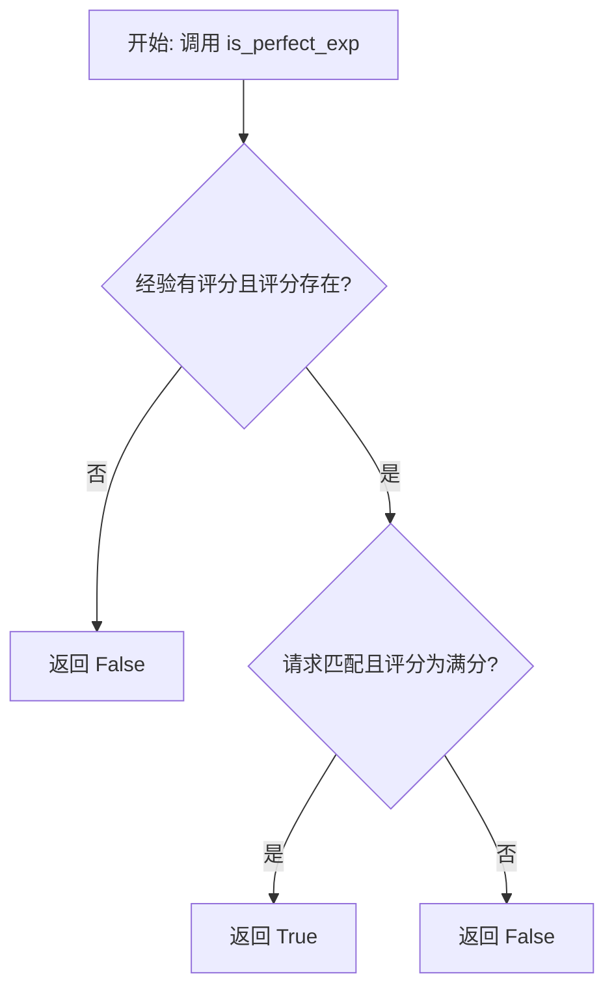
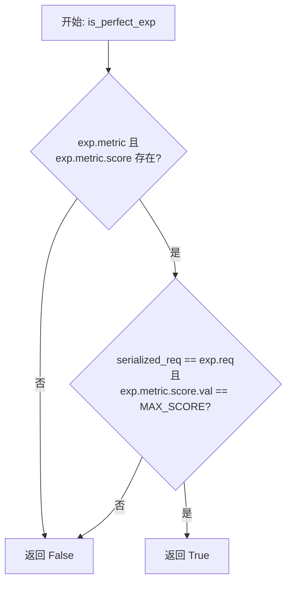

# `.\MetaGPT\metagpt\exp_pool\perfect_judges\simple.py` 详细设计文档

该代码实现了一个简单的完美经验判断器，用于评估给定的经验对象是否满足'完美'标准。其核心功能是比较经验对象的请求字符串是否与传入的序列化请求匹配，并检查经验对象的评分是否为最高分。

## 整体流程



## 类结构

```
BasePerfectJudge (抽象基类)
└── SimplePerfectJudge (简单完美判断器)
```

## 全局变量及字段


### `MAX_SCORE`
    
表示完美分数的常量，用于判断经验是否达到最高评分标准。

类型：`int`
    


### `SimplePerfectJudge.model_config`
    
Pydantic模型配置，允许任意类型以支持复杂字段验证。

类型：`pydantic.ConfigDict`
    
    

## 全局函数及方法


### `SimplePerfectJudge.is_perfect_exp`

该方法用于判断一个给定的经验对象（Experience）是否是一个“完美”的经验。其核心逻辑是检查经验是否包含有效的评分，并且该评分是否为最高分，同时验证传入的序列化请求字符串是否与该经验对象中存储的原始请求相匹配。

参数：

-  `exp`：`Experience`，待评估的经验对象，包含请求、响应、评分等信息。
-  `serialized_req`：`str`，序列化后的请求字符串，用于与经验对象中的原始请求进行比较。
-  `*args`：`tuple`，可变位置参数，当前方法未使用。
-  `**kwargs`：`dict`，可变关键字参数，当前方法未使用。

返回值：`bool`，如果经验对象包含有效评分且为最高分，并且传入的序列化请求与经验对象中的请求一致，则返回 `True`，否则返回 `False`。

#### 流程图



#### 带注释源码

```python
async def is_perfect_exp(self, exp: Experience, serialized_req: str, *args, **kwargs) -> bool:
    """Determine whether the experience is perfect.

    Args:
        exp (Experience): The experience to evaluate.
        serialized_req (str): The serialized request to compare against the experience's request.

    Returns:
        bool: True if the serialized request matches the experience's request and the experience's score is perfect, False otherwise.
    """
    # 1. 前置检查：确保经验对象包含有效的评分数据
    if not exp.metric or not exp.metric.score:
        return False

    # 2. 核心判断逻辑：请求必须完全匹配，且评分必须为最高分
    return serialized_req == exp.req and exp.metric.score.val == MAX_SCORE
```


## 关键组件


### BasePerfectJudge

作为所有完美评判器的抽象基类，定义了评判体验是否完美的接口契约。

### SimplePerfectJudge

一个具体的完美评判器实现，通过比较序列化请求和体验得分来判定体验是否完美。

### Experience

表示一次完整的体验记录，包含请求、响应、度量指标等核心数据。

### MAX_SCORE

定义完美得分的常量，用于作为评判体验是否完美的阈值标准。


## 问题及建议


### 已知问题

-   **逻辑耦合度高**：`is_perfect_exp` 方法将“请求匹配”和“分数完美”两个判断条件硬编码在一起。如果未来需要单独判断请求匹配或分数完美，或者需要支持“请求匹配且分数高于某个阈值”等新逻辑，必须修改此方法，违反了开闭原则。
-   **错误处理不足**：当 `exp.metric` 或 `exp.metric.score` 为 `None` 时，方法直接返回 `False`。虽然这避免了程序崩溃，但丢失了错误的具体原因（是缺少 `metric` 对象，还是缺少 `score` 属性），不利于调试和日志记录。
-   **可配置性差**：判断是否为“完美”的分数阈值（`MAX_SCORE`）是硬编码的全局常量。如果不同场景或不同经验池对“完美”的定义不同（例如，有的场景90分即算完美），当前设计无法灵活适应。
-   **潜在的性能瓶颈**：方法直接进行字符串相等比较 (`serialized_req == exp.req`)。如果 `req` 字段是非常长的字符串（如大型JSON或XML），频繁比较可能成为性能瓶颈，且没有缓存或哈希优化。
-   **类型安全风险**：虽然使用了Pydantic的 `ConfigDict(arbitrary_types_allowed=True)` 来允许任意类型，但这可能掩盖了 `Experience` 模型中字段类型定义不严格的问题，降低了运行时类型检查的严格性。

### 优化建议

-   **解耦判断逻辑**：将 `is_perfect_exp` 方法拆分为更细粒度的判断函数或方法，例如 `is_request_match` 和 `is_score_perfect`。主方法可以组合这些基础判断，提高代码的复用性和可测试性。
-   **增强错误处理与日志**：在返回 `False` 之前，可以添加不同级别的日志（如DEBUG级别）来记录判断失败的具体原因（例如，“metric is None”或“score is None”）。这有助于在复杂调试场景下快速定位问题。
-   **引入可配置的阈值**：将“完美分数”阈值作为类的一个可配置属性（如 `perfect_score_threshold`），而不是硬编码 `MAX_SCORE`。可以通过构造函数参数或配置文件进行设置，提高组件的灵活性。
-   **优化字符串比较**：对于可能很长的 `req` 字符串，可以考虑在 `Experience` 对象创建时计算其哈希值（如MD5或SHA256）并存储。在 `is_perfect_exp` 方法中，先比较哈希值，哈希匹配时再进行全字符串比较，以提升性能。
-   **强化类型注解与验证**：确保 `Experience` 类的 `metric` 和 `metric.score` 字段有明确的类型注解（例如使用 `Optional`）。考虑在 `BasePerfectJudge` 或 `SimplePerfectJudge` 的初始化或判断方法中，增加对输入参数的类型验证或断言，提前暴露类型不匹配的问题。
-   **考虑扩展性设计**：评估是否将“完美判断”策略设计为可插拔的组件。例如，定义一个 `JudgmentStrategy` 接口，`SimplePerfectJudge` 使用默认策略，但允许在运行时注入不同的策略实现，以支持更复杂的业务规则。


## 其它


### 设计目标与约束

本模块的设计目标是提供一个简单、高效且可扩展的“完美经验”判定器。其核心约束是判定逻辑必须严格遵循预定义的规则：只有当传入的经验对象（`Experience`）的请求（`req`）与给定的序列化请求（`serialized_req`）完全一致，并且该经验的评分（`score`）为最高分（`MAX_SCORE`）时，才判定为“完美经验”。该设计强调逻辑的清晰性和执行速度，避免引入复杂的计算或外部依赖。

### 错误处理与异常设计

当前代码采用防御性编程和静默处理策略。在 `is_perfect_exp` 方法中，首先检查 `exp.metric` 和 `exp.metric.score` 是否存在，若任一为 `None`，则直接返回 `False`，避免了潜在的 `AttributeError` 异常。这种设计将无效或数据不完整的输入视为非完美经验，符合业务逻辑，且无需抛出异常中断主流程。然而，这种静默处理可能掩盖上游数据构造的问题，在调试时需注意。

### 数据流与状态机

本模块的数据流是单向且无状态的。输入为经验对象 `exp` 和序列化请求字符串 `serialized_req`，输出为布尔值。处理过程是一个简单的、无分支的判定流水线：1) 检查度量数据完整性；2) 比较请求字符串；3) 比较分数值。模块本身不维护任何内部状态，每次调用都是独立的，符合函数式编程思想，确保了线程安全和可预测性。

### 外部依赖与接口契约

1.  **父类依赖**：继承自 `BasePerfectJudge`，需实现其定义的抽象方法 `is_perfect_exp`，并遵循其接口契约。
2.  **数据模型依赖**：强依赖 `metagpt.exp_pool.schema` 模块中的 `Experience` 和 `MAX_SCORE`。`Experience` 对象的结构（特别是 `req`、`metric.score.val` 字段）是判定逻辑的基础，任何不兼容的变更都会导致功能失效。
3.  **配置依赖**：通过 `pydantic.ConfigDict` 设置 `arbitrary_types_allowed=True`，这通常是为了允许像 `Experience` 这样的自定义 Pydantic 模型在配置中被正确识别和处理，依赖于 Pydantic 库的特定行为。

    