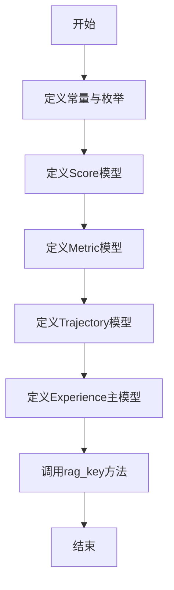
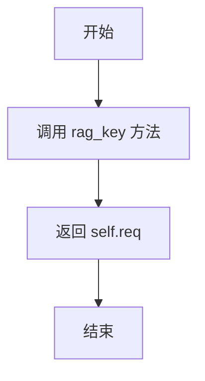

# `.\MetaGPT\metagpt\exp_pool\schema.py` 详细设计文档

该代码定义了一个用于记录和评估AI代理（如LLM）执行任务经验的数据模型。它通过Pydantic模型定义了经验（Experience）的结构，包含请求、响应、性能指标（Metric）、轨迹（Trajectory）、类型、标签等核心字段，并提供了用于检索（RAG）的键生成方法。代码还定义了相关的枚举类型（如经验类型、查询类型）和辅助模型（如分数、指标），为AI经验库或记忆系统的实现提供了基础数据契约。

## 整体流程



## 类结构

```
BaseModel (Pydantic基类)
├── Score
├── Metric
├── Trajectory
└── Experience
```

## 全局变量及字段


### `MAX_SCORE`
    
定义评分的最大值，用于约束Score.val的取值范围。

类型：`int`
    


### `DEFAULT_SIMILARITY_TOP_K`
    
定义在相似性检索（如RAG）中默认返回的最相似结果数量。

类型：`int`
    


### `LOG_NEW_EXPERIENCE_PREFIX`
    
用于日志记录新经验创建时的前缀字符串。

类型：`str`
    


### `Score.val`
    
评分的数值，范围在1到10之间，数值越高表示越好。

类型：`int`
    


### `Score.reason`
    
对评分数值的解释或理由。

类型：`str`
    


### `Metric.time_cost`
    
完成任务所花费的时间成本，单位为毫秒。

类型：`float`
    


### `Metric.money_cost`
    
完成任务所花费的金钱成本，单位为美元。

类型：`float`
    


### `Metric.score`
    
包含数值和理由的评分对象。

类型：`Score`
    


### `Trajectory.plan`
    
执行任务前制定的计划或策略。

类型：`str`
    


### `Trajectory.action`
    
根据计划所执行的具体操作或步骤。

类型：`str`
    


### `Trajectory.observation`
    
执行操作后观察到的结果或输出。

类型：`str`
    


### `Trajectory.reward`
    
用于衡量行动效果的奖励值。

类型：`int`
    


### `Experience.req`
    
触发经验生成的原始请求或输入。

类型：`str`
    


### `Experience.resp`
    
对请求的响应，可以是字符串、JSON或代码等形式。

类型：`str`
    


### `Experience.metric`
    
可选的度量指标，包含时间、金钱成本和评分。

类型：`Optional[Metric]`
    


### `Experience.exp_type`
    
经验的类型，如成功、失败或洞察。

类型：`ExperienceType`
    


### `Experience.entry_type`
    
经验条目的创建方式，自动或手动。

类型：`EntryType`
    


### `Experience.tag`
    
用于分类或标记经验的标签。

类型：`str`
    


### `Experience.traj`
    
可选的执行轨迹，记录计划、行动、观察和奖励。

类型：`Optional[Trajectory]`
    


### `Experience.timestamp`
    
经验创建的时间戳，默认为当前时间。

类型：`Optional[float]`
    


### `Experience.uuid`
    
经验的唯一标识符，默认为新生成的UUID。

类型：`Optional[UUID]`
    
    

## 全局函数及方法

### `Experience.rag_key`

该方法用于生成检索增强生成（RAG）系统中用于检索经验（Experience）的关键字。它简单地返回当前经验对象（`self`）的请求字段（`req`）作为检索键。

参数：
- `self`：`Experience`，当前经验对象实例。

返回值：`str`，返回当前经验对象的请求字符串（`self.req`），作为RAG检索的键。

#### 流程图



#### 带注释源码

```python
def rag_key(self):
    # 该方法返回当前经验对象的请求字符串（req）作为RAG检索的键。
    # 在RAG系统中，这个键通常用于在向量数据库或知识库中查找相似的经验。
    return self.req
```

## 关键组件


### Experience 类

定义经验（Experience）的核心数据结构，包含请求、响应、度量指标、类型、标签、轨迹、时间戳和唯一标识符等字段，用于封装和存储一次完整的交互或执行过程。

### Metric 类

定义度量指标（Metric）的数据结构，包含时间成本、金钱成本和评分，用于量化评估经验的质量和成本效益。

### Score 类

定义评分（Score）的数据结构，包含一个整数值和评分理由，作为 Metric 类的一部分，用于对经验进行主观或客观的量化评价。

### Trajectory 类

定义轨迹（Trajectory）的数据结构，包含计划、行动、观察和奖励四个字段，用于记录执行过程中的详细步骤和反馈，支持对复杂过程的追踪和分析。

### ExperienceType 枚举

定义经验类型（ExperienceType）的枚举值，包括成功（SUCCESS）、失败（FAILURE）和洞察（INSIGHT），用于对经验进行分类和标识。

### EntryType 枚举

定义经验录入类型（EntryType）的枚举值，包括自动（AUTOMATIC）和手动（MANUAL），用于标识经验的来源或创建方式。

### QueryType 枚举

定义查询类型（QueryType）的枚举值，包括精确匹配（EXACT）和语义匹配（SEMANTIC），用于指定在检索经验时使用的匹配策略。

### rag_key 方法

定义在 Experience 类中的方法，用于返回经验的检索键，当前实现为返回请求（req）字段，支持基于请求内容进行经验检索和匹配。


## 问题及建议


### 已知问题

-   **`Experience` 类 `req` 和 `resp` 字段描述缺失**：`req` 字段的描述为空字符串，`resp` 字段的描述过于笼统（“The type is string/json/code.”），这降低了代码文档的清晰度和可维护性。
-   **`Metric` 类 `score` 字段默认值不当**：`score` 字段的默认值为 `None`，但其类型 `Score` 是一个 Pydantic 模型。当 `score` 为 `None` 时，访问其子属性（如 `score.val`）可能导致 `AttributeError`，增加运行时错误风险。
-   **`Experience.rag_key` 方法定义不完整**：该方法缺少类型注解（参数和返回值），不符合现代 Python 代码规范，影响代码可读性和静态类型检查工具（如 mypy）的有效性。
-   **常量命名风格不一致**：`MAX_SCORE` 和 `DEFAULT_SIMILARITY_TOP_K` 使用全大写蛇形命名，而 `LOG_NEW_EXPERIENCE_PREFIX` 也使用全大写但包含下划线，虽然都是常量，但前缀 `LOG_` 暗示了其用途，与其他纯配置常量放在一起略显突兀，且整个模块的常量组织缺乏明确分类。
-   **`Experience` 模型字段可选性设计可能过于宽松**：`metric` 和 `traj` 字段被设计为可选（`Optional`），虽然提供了灵活性，但在某些业务场景下，这些信息可能是核心且必需的。宽松的约束可能导致后续处理逻辑需要频繁进行空值检查，增加复杂度。

### 优化建议

-   **补充缺失的字段描述**：为 `Experience.req` 和 `Experience.resp` 字段添加准确、清晰的描述。例如，`req` 可描述为“用户或系统发出的原始请求或查询内容”，`resp` 可描述为“系统针对请求生成的响应内容，其格式可以是纯文本、JSON 或代码等”。
-   **为 `Metric.score` 提供有效的默认实例**：将 `Metric` 模型中 `score` 字段的默认值从 `None` 改为 `Score()`（即 `Field(default_factory=Score)`），这样可以确保 `metric.score` 总是一个有效的 `Score` 对象，避免空指针异常，并符合数据模型的完整性。
-   **完善 `rag_key` 方法的类型注解**：为 `Experience.rag_key` 方法添加类型提示，明确其返回类型。例如，可以定义为 `def rag_key(self) -> str:`。
-   **重构常量定义，提升可维护性**：考虑将常量按功能或模块进行分组。例如，可以创建一个 `Config` 类或使用不同的模块来分别存放业务配置常量（如 `MAX_SCORE`）、检索配置常量（如 `DEFAULT_SIMILARITY_TOP_K`）和日志相关常量（如 `LOG_NEW_EXPERIENCE_PREFIX`）。或者，至少为常量添加更详细的注释说明其用途和取值范围。
-   **根据业务需求收紧模型约束**：重新评估 `Experience` 模型中各字段的业务必要性。如果某些字段（如 `metric` 或特定类型的 `traj`）在核心流程中总是需要的，应考虑移除 `Optional` 包装，将其设为必需字段，并在创建实例时提供默认值或强制校验。这可以使数据模型更健壮，减少下游逻辑的复杂度。如果灵活性仍然需要，可以创建不同的模型变体（例如，一个完整的 `Experience` 和一个简化的 `ExperienceLite`）来适应不同场景。


## 其它


### 设计目标与约束

本模块的核心设计目标是定义一个用于记录、评估和检索“经验”（Experience）的标准化数据结构。它旨在支持智能体（Agent）或AI系统在运行过程中，将执行任务的过程、结果和评估指标进行结构化存储，以便后续通过检索增强生成（RAG）等方式进行复用和学习。主要约束包括：1) 使用Pydantic进行数据验证和序列化，确保数据的一致性和类型安全；2) 定义清晰的枚举类型（如`ExperienceType`, `EntryType`）来限定关键字段的取值范围，保证数据的规范性；3) 结构设计需兼顾自动记录（如由系统自动生成）和手动录入（如由人工标注）两种场景。

### 错误处理与异常设计

当前代码主要侧重于数据模型的定义，并未显式包含错误处理逻辑。错误处理主要依赖于Pydantic模型在实例化或解析数据时的内置验证机制。例如，当为`Score.val`字段赋值一个不在1到10范围内的整数，或为枚举字段（如`exp_type`）传入无效字符串时，Pydantic会抛出`ValidationError`异常。调用方需要捕获并处理此类异常。这是一种“契约式”设计，将数据有效性的责任前置到了数据创建阶段。对于`uuid`和`timestamp`字段，使用`default_factory`确保在未提供值时能自动生成有效值，避免了因缺失这些字段而导致的错误。

### 数据流与状态机

此模块定义的是静态的数据模式（Schema），本身不包含动态的数据流处理或复杂的状态转换。数据流通常是单向的：由上游的智能体执行过程生成`Trajectory`（轨迹）、`Metric`（指标）等数据，然后组装成一个完整的`Experience`对象实例。该实例随后被序列化（如转换为JSON）并持久化存储到数据库或向量存储中。在检索阶段，存储的经验数据被取出、反序列化为`Experience`对象以供使用。模块内没有定义状态机，各个模型对象在创建后通常是不可变的（immutable），其状态由初始化参数决定。

### 外部依赖与接口契约

1.  **外部依赖**：
    *   **Pydantic (`pydantic.BaseModel`)**: 核心依赖，用于定义数据模型、字段验证、序列化与反序列化。这是构建所有类的基础。
    *   **Python标准库**: `time` (用于生成时间戳), `uuid` (用于生成唯一标识符), `enum` (用于定义枚举类型)。
2.  **接口契约**：
    *   **`Experience.rag_key()` 方法**: 定义了一个关键契约。该方法返回`self.req`（用户请求/查询）作为RAG检索的键。这暗示了系统将主要根据“请求”内容来查找相似的历史经验。任何使用此`Experience`类进行RAG的系统都需要遵循这一约定，即使用`req`字段作为检索的索引或查询输入。
    *   **模型字段的默认值与类型**: 所有`Field`的定义构成了创建和解析`Experience`及相关对象的数据契约。例如，`Metric.time_cost`的单位是毫秒，`Score.val`的范围是1-10，调用方必须遵守这些约定以确保数据的正确性。
    *   **枚举类 (`QueryType`, `ExperienceType`, `EntryType`)**: 这些枚举定义了字段的合法值域，是与系统其他部分交互时必须遵守的枚举值契约。

### 配置与常量

模块中明确声明了以下配置与常量，用于控制逻辑或定义阈值：
*   `MAX_SCORE = 10`: 定义了`Score.val`字段允许的最大值。
*   `DEFAULT_SIMILARITY_TOP_K = 2`: 暗示了在语义相似性检索中默认返回的最相似经验数量。虽然当前代码未直接使用，但它为可能使用此模块的检索功能提供了默认配置。
*   `LOG_NEW_EXPERIENCE_PREFIX = "New experience: "`: 定义了记录新经验日志时的前缀字符串，用于统一日志格式。
这些常量集中管理，便于查找和修改，提高了代码的可维护性。

### 安全与合规性考虑

当前模型设计层面涉及的安全与合规性考虑较为有限，主要集中在数据本身：
1.  **数据脱敏**: 模型未内置数据脱敏机制。如果`req`（请求）、`resp`（响应）、`traj.observation`（观察结果）等字段包含敏感信息（如个人身份信息PII、密钥等），需要在数据填入模型之前由上游流程进行处理。
2.  **输入验证**: 依赖Pydantic进行基础的类型和范围验证（如`Score.val`）。但对于更复杂的业务逻辑验证（例如，`money_cost`不应为负数）、或对`req`/`resp`字段内容的恶意代码/脚本检查，需要在对象创建前的业务逻辑层实现。
3.  **隐私与留存**: `timestamp`和`uuid`字段有助于数据的审计和追踪。在实际系统中，需要考虑经验的存储期限、是否包含可追溯至具体用户或会话的标识符，并制定相应的数据保留和删除策略以符合隐私法规（如GDPR）。

    