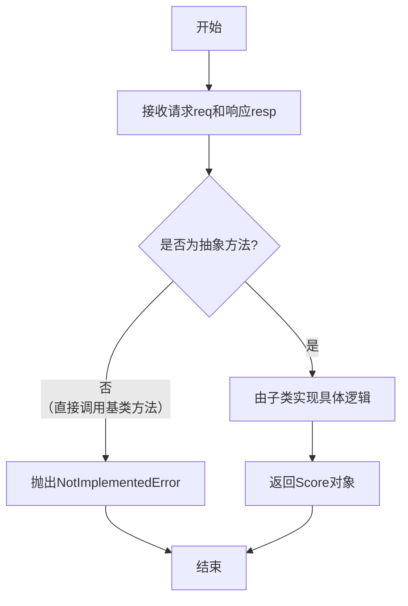

# `.\MetaGPT\metagpt\exp_pool\scorers\base.py` 详细设计文档

该文件定义了一个抽象基类 BaseScorer，用于评估给定请求（req）和响应（resp）的质量，并返回一个 Score 对象。它为所有具体的评分器（Scorer）提供了统一的接口和基础配置。

## 整体流程

```mermaid
graph TD
    A[开始] --> B[创建具体的 Scorer 实例]
    B --> C[调用 scorer.evaluate(req, resp)]
    C --> D{执行具体的评估逻辑}
    D --> E[生成 Score 对象]
    E --> F[返回 Score 对象]
    F --> G[结束]
```

## 类结构

```
BaseScorer (抽象基类)
├── 继承自 pydantic.BaseModel
└── 继承自 abc.ABC
```

## 全局变量及字段


### `BaseScorer.model_config`
    
Pydantic模型配置，允许使用任意类型，用于自定义BaseScorer类的序列化和验证行为。

类型：`pydantic.ConfigDict`
    
    

## 全局函数及方法


### `BaseScorer.evaluate`

这是一个抽象方法，定义了评估器（Scorer）的核心接口。它用于评估一个响应（`resp`）相对于给定请求（`req`）的质量，并返回一个标准化的评分对象（`Score`）。具体的评估逻辑（如使用规则、模型或人工判断）由继承此基类的子类实现。

参数：

- `req`：`str`，原始的请求或输入文本。
- `resp`：`str`，需要被评估的响应或输出文本。

返回值：`Score`，一个包含评估结果（如分数、理由等）的标准化对象。

#### 流程图



#### 带注释源码

```python
    @abstractmethod
    async def evaluate(self, req: str, resp: str) -> Score:
        """Evaluates the quality of a response relative to a given request."""
        # 这是一个抽象方法，使用`@abstractmethod`装饰器标记。
        # 它声明了评估器的核心功能：接收一个请求字符串`req`和一个响应字符串`resp`作为输入。
        # 方法被定义为异步(`async`)，意味着它可能涉及I/O操作（如调用外部API、查询数据库）。
        # 返回值类型被指定为`Score`，这是一个从`metagpt.exp_pool.schema`导入的Pydantic模型，
        # 用于标准化评估结果的格式。
        # 任何继承`BaseScorer`的具体类都必须实现这个方法，提供具体的评估逻辑。
        # 如果直接调用基类的此方法，将引发`TypeError`。
```


## 关键组件


### BaseScorer

一个用于评估响应质量的抽象基类，定义了评估接口和配置。

### Score

表示评估结果的数据模型，用于封装评分信息。

### ConfigDict

Pydantic配置字典，允许任意类型，用于BaseScorer的模型配置。


## 问题及建议


### 已知问题

-   **抽象类与Pydantic模型的潜在冲突**：`BaseScorer` 同时继承自 `ABC`（抽象基类）和 `BaseModel`（Pydantic数据模型）。虽然通过 `model_config = ConfigDict(arbitrary_types_allowed=True)` 允许任意类型，但这种混合设计可能导致在实例化、序列化或验证时出现预期之外的行为，特别是当子类需要定义复杂的字段或验证逻辑时。
-   **异步抽象方法的同步调用风险**：`evaluate` 方法被定义为 `async`（异步）方法。如果调用方在同步上下文中错误地调用此方法而未进行适当的异步处理（例如，未使用 `await` 或未在事件循环中运行），将导致运行时错误或返回协程对象而非实际结果。
-   **输入/输出参数定义过于宽泛**：`evaluate` 方法的参数 `req` 和 `resp` 类型均为 `str`。对于复杂的评分场景（例如，需要结构化请求信息或包含上下文的响应），仅使用字符串可能不足以承载所有必要信息，限制了方法的表达能力和适用性。
-   **缺乏默认实现或工具方法**：作为一个纯抽象基类，它没有提供任何默认实现、公共工具方法或钩子方法（hook）。这可能导致不同的具体实现类中存在大量重复的样板代码（如日志记录、错误处理、数据预处理等）。

### 优化建议

-   **分离关注点，考虑组合优于继承**：重新评估设计，考虑将“评分逻辑”与“数据模型”职责分离。可以定义一个纯抽象的 `IScorer` 接口（仅包含 `evaluate` 方法），然后让具体的评分器类实现该接口。如果需要配置项，可以单独使用Pydantic模型来管理配置，并通过依赖注入传递给评分器，而不是强制所有评分器都继承自 `BaseModel`。
-   **提供同步方法备选或明确约束**：如果评分操作不一定需要异步，可以考虑提供一个同步版本的 `evaluate_sync` 方法作为默认实现（在基类中实现，内部调用异步版本），或者至少在文档中明确指出此接口为异步，并提供使用示例。另一种方案是定义两个抽象方法：`async def a_evaluate` 和 `def evaluate`，让子类根据能力实现其中一个或两个。
-   **细化输入输出类型，使用泛型或更具体的模型**：将 `req` 和 `resp` 的参数类型从 `str` 改为更具体的类型，例如使用Pydantic的 `BaseModel` 来定义 `EvaluationRequest` 和 `EvaluationResponse` 数据类。或者，引入泛型 `BaseScorer[ReqT, RespT]`，允许子类在继承时指定具体的请求和响应类型，提高类型安全性和代码清晰度。
-   **在基类中增加公共功能**：在 `BaseScorer` 类中添加一些非抽象的公共方法或属性，例如：
    -   `_preprocess(req, resp)`: 一个空的或包含通用预处理逻辑的钩子方法。
    -   `_validate_input(req, resp)`: 输入验证的默认实现。
    -   `logger`: 一个类属性或实例属性，提供统一的日志记录器。
    -   这样可以在不破坏抽象的前提下，减少子类的代码重复，并确保一些横切关注点（cross-cutting concerns）的一致性处理。


## 其它


### 设计目标与约束

本模块旨在定义一个抽象的评分器基类，为后续实现具体的评分逻辑（如基于LLM、基于规则等）提供统一的接口和基础结构。其核心设计目标是确保所有评分器实现类都遵循相同的评估契约，即接收一个请求字符串和一个响应字符串，并返回一个标准化的`Score`对象。主要约束包括：必须使用Pydantic的`BaseModel`作为基类以支持配置和验证；必须实现异步的`evaluate`方法；必须能够处理任意类型（通过`arbitrary_types_allowed=True`配置），以适应未来可能扩展的复杂评分逻辑或内部状态。

### 错误处理与异常设计

当前基类未显式定义错误处理机制，将错误处理的责任下放给了具体的子类实现。预期的错误处理模式是：子类在`evaluate`方法中应捕获其内部可能发生的异常（如网络请求失败、解析错误、逻辑错误等），并选择将其封装在返回的`Score`对象中（例如，设置一个表示失败的分数或错误标志），或者直接抛出异常。基类本身作为抽象类，不会实例化，因此不涉及运行时错误。建议子类在文档中明确说明其可能抛出的异常类型和错误处理策略。

### 数据流与状态机

该模块的数据流非常简单且线性：
1.  **输入**：调用者（通常是实验池或评估流程）提供两个字符串参数：`req`（原始请求/提示）和`resp`（待评估的模型响应）。
2.  **处理**：数据流入具体评分器子类的`evaluate`方法。该方法内部实现评分逻辑，此过程可能涉及调用外部API、应用规则引擎、进行计算等。
3.  **输出**：处理结果被封装成一个`Score`数据对象并返回。`Score`对象应包含量化的分数、可能的元数据（如置信度、分解分数）或错误信息。
该基类本身是无状态的（`model_config`是类属性，用于配置Pydantic行为），不涉及状态迁移。状态管理（如果需要，如缓存、计数器）应由具体子类负责。

### 外部依赖与接口契约

*   **外部依赖**：
    *   `abc.ABC` 和 `abc.abstractmethod`：用于定义抽象基类。
    *   `pydantic.BaseModel` 和 `pydantic.ConfigDict`：用于提供数据验证、序列化和配置功能。
    *   `metagpt.exp_pool.schema.Score`：定义了评分输出的数据结构，是模块的核心数据契约。
*   **接口契约**：
    *   **类契约**：任何继承`BaseScorer`的类必须是一个Pydantic模型，并实现异步的`evaluate`方法。
    *   **方法契约**：`evaluate`方法必须接受`(req: str, resp: str)`作为参数，并返回一个`Score`类型的对象。这是一个异步协程，调用时必须使用`await`。
    *   **数据契约**：输入输出均使用`str`类型和`Score`模型，确保了接口的清晰和类型安全。

### 扩展性与维护性

该设计具有高度的扩展性。通过继承`BaseScorer`并实现`evaluate`方法，可以轻松创建多种评分器，例如：
*   `LLMScorer`：使用大语言模型进行评判。
*   `RuleBasedScorer`：基于关键词匹配、正则表达式或业务规则的评分器。
*   `EnsembleScorer`：组合多个评分器结果的集成评分器。
维护性方面，由于接口统一且简单，新增评分器或修改现有评分器内部逻辑不会影响调用方代码。`Score`对象的定义集中管理了输出格式，便于后续分析和可视化。建议建立评分器的注册机制或工厂模式，以便于动态发现和加载不同的评分器实现。

    