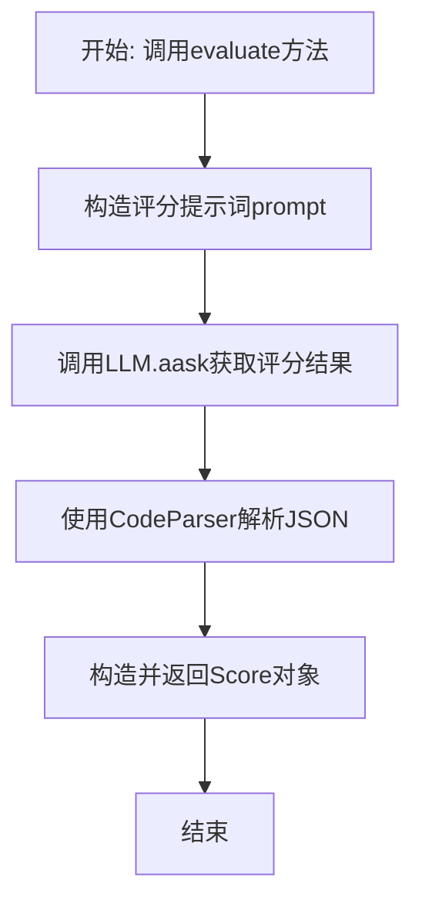

# `.\MetaGPT\metagpt\exp_pool\scorers\simple.py` 详细设计文档

该代码实现了一个基于大语言模型（LLM）的简单评分器（SimpleScorer），其核心功能是接收一个用户请求（req）和一个模型生成的响应（resp），通过构造特定的提示词（prompt）调用LLM，让LLM从人类视角对响应的质量进行评分（1-10分），并返回包含分数和评分理由的Score对象。

## 整体流程



## 类结构

```
BaseScorer (抽象基类)
└── SimpleScorer (简单评分器实现)
```

## 全局变量及字段


### `SIMPLE_SCORER_TEMPLATE`
    
用于构建LLM提示词的模板字符串，包含评估请求和响应的指令、格式示例和约束条件。

类型：`str`
    


### `SimpleScorer.llm`
    
用于执行评估任务的语言模型实例，通过default_factory使用默认的LLM类进行初始化。

类型：`BaseLLM`
    
    

## 全局函数及方法


### `SimpleScorer.evaluate`

该方法使用一个大型语言模型（LLM）来评估一个响应相对于给定请求的质量。它通过一个预定义的提示词模板将请求和响应格式化，发送给LLM，解析LLM返回的JSON格式结果，并最终封装成一个`Score`对象返回。

参数：

-  `req`：`str`，需要被评估的原始请求文本。
-  `resp`：`str`，针对上述请求生成的响应文本。

返回值：`Score`，一个包含评分（1-10分，越高越好）和评分理由的对象。

#### 流程图

```mermaid
flowchart TD
    A[开始: evaluate(req, resp)] --> B[格式化提示词<br>将req和resp填入模板]
    B --> C[异步调用LLM<br>self.llm.aask(prompt)]
    C --> D[解析LLM返回的文本<br>CodeParser.parse_code]
    D --> E[将解析出的文本<br>转换为JSON对象]
    E --> F[用JSON数据<br>实例化Score对象]
    F --> G[返回Score对象]
```

#### 带注释源码

```python
async def evaluate(self, req: str, resp: str) -> Score:
    """Evaluates the quality of a response relative to a given request, as scored by an LLM.

    Args:
        req (str): The request.
        resp (str): The response.

    Returns:
        Score: An object containing the score (1-10) and the reasoning.
    """
    # 1. 使用请求(req)和响应(resp)填充预定义的提示词模板(SIMPLE_SCORER_TEMPLATE)
    prompt = SIMPLE_SCORER_TEMPLATE.format(req=req, resp=resp)
    
    # 2. 异步调用LLM，将格式化后的提示词发送给模型，获取评估结果文本
    resp = await self.llm.aask(prompt)
    
    # 3. 使用CodeParser从LLM的返回文本中解析出JSON格式的部分
    # 4. 将解析出的JSON字符串转换为Python字典对象
    resp_json = json.loads(CodeParser.parse_code(resp, lang="json"))
    
    # 5. 使用字典中的数据（应包含'val'和'reason'键）创建并返回一个Score对象
    return Score(**resp_json)
```


## 关键组件


### BaseScorer 基类

定义了评分器的抽象基类，为所有具体评分器（如 SimpleScorer）提供统一的接口和结构。

### SimpleScorer 评分器

一个具体的评分器实现，它利用大型语言模型（LLM）来评估给定请求（req）和响应（resp）的质量，并返回一个包含分数（1-10）和理由的 Score 对象。

### LLM 集成

通过 `BaseLLM` 接口与大型语言模型服务进行交互，用于生成对请求和响应的评估结果。

### SIMPLE_SCORER_TEMPLATE 提示词模板

一个结构化的提示词模板，用于指导 LLM 如何根据给定的请求和响应进行评分，并约束其以特定的 JSON 格式输出结果。

### Score 数据模型

用于封装评分结果的数据模型，包含 `val`（分数值）和 `reason`（评分理由）两个字段。

### CodeParser 工具

一个用于从 LLM 的响应文本中解析出结构化代码块（此处为 JSON）的实用工具，确保能正确提取评分结果。


## 问题及建议


### 已知问题

-   **缺乏输入验证与错误处理**：`evaluate` 方法直接使用 `json.loads` 解析 LLM 的返回结果，如果 LLM 返回的文本不符合 JSON 格式或缺少 `"val"`、`"reason"` 字段，将导致 `json.JSONDecodeError` 或 `pydantic.ValidationError`，程序会崩溃。同时，对 `req` 和 `resp` 参数也未进行基本的有效性检查（如空值）。
-   **提示词（Prompt）脆弱性**：`SIMPLE_SCORER_TEMPLATE` 提示词依赖 LLM 严格遵循 JSON 格式输出。虽然使用了 `CodeParser.parse_code` 进行提取，但如果 LLM 返回的格式与示例有细微差别（如多出解释性文字、JSON 格式错误），解析仍可能失败。提示词本身没有明确的评分标准，可能导致不同 LLM 或同一 LLM 在不同上下文下的评分标准不一致，影响评估的客观性和可复现性。
-   **同步与异步混用的潜在风险**：类继承自 `BaseScorer` 并使用了异步方法 `evaluate` 和 `self.llm.aask`，这要求调用者也必须是异步的。如果项目中存在同步调用链需要集成此评分器，会引入复杂性。同时，未考虑异步操作中的超时、取消等控制机制。
-   **硬编码的评分范围**：评分逻辑（1-10分）和“越高越好”的规则直接固化在提示词中，缺乏灵活性。如果未来需要调整评分范围（如改为 0-5 分）或规则（如越低越好），需要修改代码和提示词，违反了开闭原则。
-   **LLM 依赖与成本**：每次评估都需要调用一次 LLM，会产生额外的 Token 消耗和延迟。对于需要高频、批量评分的场景，这可能成为性能和成本的瓶颈。

### 优化建议

-   **增强健壮性**：
    -   在 `evaluate` 方法开始时，对 `req` 和 `resp` 进行非空或基础验证。
    -   使用 `try-except` 块包裹 `json.loads` 和 `Score(**resp_json)` 的调用，捕获 `JSONDecodeError` 和 `ValidationError`，并返回一个表示“解析失败”的默认 `Score` 对象或抛出更具业务语义的自定义异常。
    -   考虑使用 Pydantic 的 `model_validate_json` 方法，它结合了 JSON 解析和模型验证。
-   **改进提示词与解析**：
    -   在提示词中增加更具体、可操作的评分维度（如相关性、完整性、清晰度），并给出每个分数区间的描述，以提高评分的一致性和可解释性。
    -   可以探索使用 LLM 的“结构化输出”功能（如果底层 `BaseLLM` 支持），或采用更鲁棒的解析策略，例如使用正则表达式作为 `CodeParser.parse_code` 的备用方案。
-   **设计可配置与可扩展的接口**：
    -   将评分范围（如 `min_score`, `max_score`）、评分规则、甚至整个提示词模板作为 `SimpleScorer` 的可配置参数（通过 `__init__` 或 Pydantic `Field`），提高组件的灵活性。
    -   考虑定义一个 `ScoringCriteria` 类来封装评分标准，使配置更结构化。
-   **性能与成本优化**：
    -   实现一个批处理版本的 `evaluate_batch` 方法，将多个 `(req, resp)` 对组合到一个提示词中发送给 LLM，以摊销调用开销。需要注意处理 LLM 的上下文长度限制和批量解析结果。
    -   为 `llm.aask` 调用添加超时 (`timeout`) 参数，防止因网络或 LLM 服务问题导致长时间挂起。
    -   考虑引入一个简单的本地缓存机制（例如，对相同的 `(req, resp)` 对缓存评分结果），适用于请求重复的场景。
-   **解耦与测试**：
    -   将 LLM 调用和响应解析逻辑进一步抽象，使其更容易被模拟（Mock），从而编写更纯粹的单元测试，测试评分逻辑而非 LLM 行为。
    -   考虑将提示词模板移至外部配置文件，便于管理和进行 A/B 测试。


## 其它


### 设计目标与约束

1.  **核心目标**：提供一个基于大语言模型（LLM）的、可扩展的响应质量评估框架。`SimpleScorer` 作为该框架的一个具体实现，旨在通过 LLM 对给定请求（`req`）和响应（`resp`）进行自动化评分。
2.  **功能约束**：
    *   输入：必须接收字符串类型的请求和响应。
    *   输出：必须返回一个结构化的 `Score` 对象，包含整型分数（1-10）和字符串类型的评分理由。
    *   评估逻辑：评估逻辑完全封装在提示词（`SIMPLE_SCORER_TEMPLATE`）中，通过 LLM 执行，代码本身不包含具体的评分规则。
3.  **非功能约束**：
    *   可扩展性：作为 `BaseScorer` 的子类，需遵循其接口契约，便于未来替换或扩展不同的评分器。
    *   异步支持：评估方法 `evaluate` 必须是异步的，以适应高并发或 I/O 密集型场景（如调用远程 LLM API）。
    *   输出格式稳定性：依赖 `CodeParser.parse_code` 从 LLM 的非结构化响应中稳定地提取 JSON 格式数据。

### 错误处理与异常设计

1.  **显式错误处理**：
    *   `json.loads` 调用：如果 `CodeParser.parse_code` 返回的字符串不是有效的 JSON，将抛出 `json.JSONDecodeError`。此异常会向上传播，调用方需处理。
    *   `Score(**resp_json)` 实例化：如果 `resp_json` 的键与 `Score` 模型的字段不匹配（例如缺少 `val` 或 `reason`），Pydantic 将抛出 `ValidationError`。此异常会向上传播。
2.  **隐式错误处理**：
    *   `self.llm.aask(prompt)` 调用：可能因网络问题、API 配额不足、模型服务异常等抛出异常（如 `APIConnectionError`, `RateLimitError`）。这些异常会直接由 `evaluate` 方法抛出。
    *   `CodeParser.parse_code`：假设其内部已处理 LLM 响应格式不匹配的情况，并返回一个可解析的字符串。若其失败，可能导致后续 `json.loads` 失败。
3.  **设计缺陷**：当前实现缺乏对上述潜在异常的捕获和转换。一个健壮的设计应在 `evaluate` 方法内部捕获这些异常，并转换为统一的、业务相关的异常类型（如 `ScoringError`），或返回一个表示失败的默认 `Score` 值，以提升调用方的体验。

### 数据流与状态机

1.  **数据流**：
    *   **输入流**：外部调用者提供 `req` (str) 和 `resp` (str)。
    *   **内部处理流**：
        1.  格式化提示词：将 `req` 和 `resp` 注入 `SIMPLE_SCORER_TEMPLATE`，生成完整的 LLM 提示。
        2.  LLM 调用：异步发送提示给 `self.llm`，获取自然语言响应。
        3.  响应解析：使用 `CodeParser.parse_code` 从响应中提取 JSON 字符串，再通过 `json.loads` 反序列化为 Python 字典。
        4.  结果封装：将字典解包，实例化为 `Score` 数据模型对象。
    *   **输出流**：返回 `Score` 对象。
2.  **状态机**：`SimpleScorer` 类本身是无状态的（`llm` 字段通常是配置后不变的）。其生命周期内不维护复杂的内部状态。评估过程是一个纯函数式的转换：`(req, resp) -> Score`。唯一的“状态”是 `llm` 客户端可能维护的连接池或会话，但这对于 `SimpleScorer` 是透明的。

### 外部依赖与接口契约

1.  **外部依赖**：
    *   **`metagpt.llm.LLM` / `metagpt.provider.base_llm.BaseLLM`**：核心依赖，用于执行评分逻辑。具体的 LLM 提供商（如 OpenAI, Anthropic）通过此抽象接口接入。
    *   **`metagpt.utils.common.CodeParser`**：用于从 LLM 的非结构化响应中解析出结构化的代码块（此处是 JSON）。强依赖其解析的准确性和稳定性。
    *   **`pydantic`**：用于数据验证和序列化（`BaseModel` 用于 `Score`， `Field` 用于类字段定义）。
    *   **`json`**：标准库，用于 JSON 反序列化。
2.  **接口契约**：
    *   **继承契约**：必须实现 `BaseScorer` 基类定义的 `evaluate` 异步方法，并遵循其签名和返回类型。
    *   **LLM 接口契约**：`self.llm` 对象必须实现 `aask(prompt: str) -> str` 方法，该方法是异步的并返回字符串响应。
    *   **`Score` 模型契约**：`evaluate` 方法返回的对象必须是 `Score` 类型，其字段 `val` (int) 和 `reason` (str) 必须有效。
    *   **提示词模板契约**：`SIMPLE_SCORER_TEMPLATE` 必须包含 `{req}` 和 `{resp}` 两个占位符，并且其指令部分必须引导 LLM 输出符合 **Format Example** 的 JSON。

    